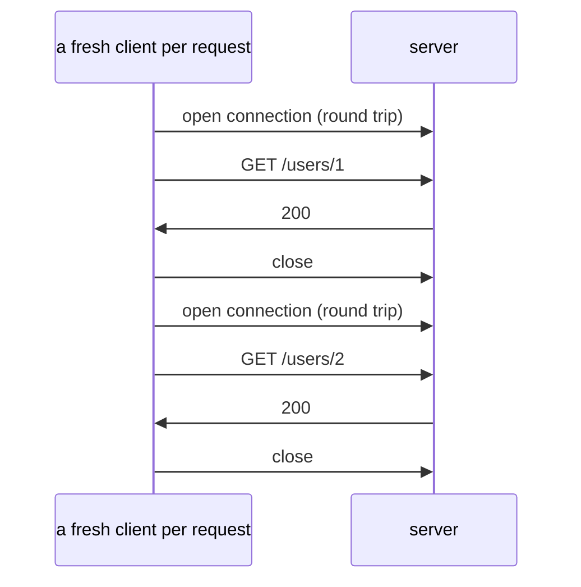
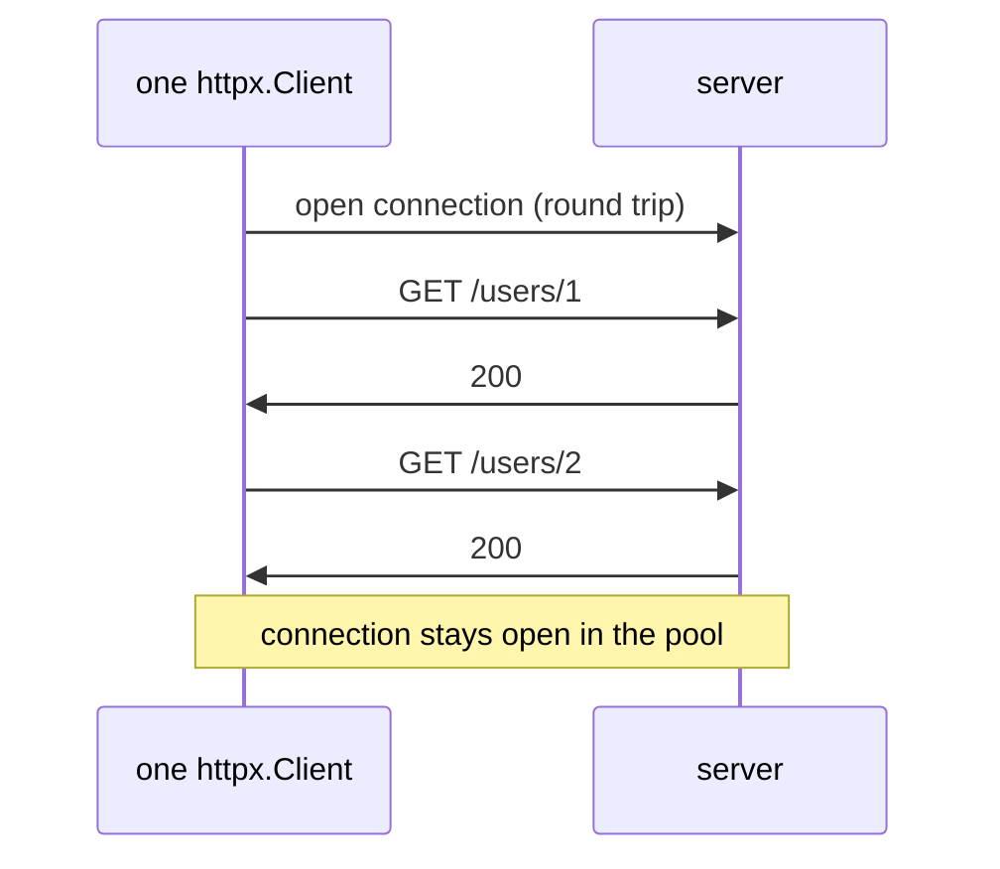

# Day 047 · Python — httpx and requests: GET, POST, headers, timeouts, sessions

**Today's theme:** HTTP clients

**After today you can:** You can call a JSON API with a timeout in each language and handle a 500.

**The interviewer asks it as:** *What goes wrong if you create a new HTTP client for every request?*

---

## 1. What this is, and why it matters

An HTTP client is the code that opens a connection to a server, sends one request, and hands you
back the response. In Python the two libraries you will meet are `requests`, which is older and
everywhere, and `httpx`, which has the same shape plus the async form you used on
[day 45](../day-045-rotated-array-search/README.md). Both let you make one call, `client.get(url)`,
and both hide a decision that matters more than the call: whether the connection underneath is
reused or thrown away.

At work, almost every service you write calls some other service over HTTP, so this is the code you
write most often after the code that reads a file. In interviews it comes up in two places. The
question in the header is asked directly, usually after you have drawn a box that calls another
box. And in a system design round, "how does your service talk to the payment service" is really
this lesson: a client, a timeout, and a plan for a 500.

## 2. The story

Sunita runs a tailoring shop on the ground floor of her building. Every blouse needs buttons, and
the buttons come from Rafiq's wholesale shop on the other side of town, forty minutes away by auto.

In her first month she does it the obvious way. She runs out of blue buttons, pulls the shutter
half down, walks to the corner, flags an auto, haggles over the fare, rides across town, buys one
packet, rides back, and opens up again. Two hours gone. The next day it is red buttons, and the
whole thing again. By the end of the month she has spent more time in autos than at the machine.

Her neighbour, who has run a shop for twenty years, watches this for a week and then says the
obvious thing. "Why do you go? Call him."

So Sunita saves Rafiq's number in her phone. Now, when she needs buttons, she calls. The first
few seconds of every call are the same: "Rafiq, it's Sunita from the tailoring shop, I'm calling
about buttons." He knows who she is and what kind of thing she wants before she says another word.
Then she either asks a question, "do you have the dark green in stock", or she places an order,
"send me six packets of the dark green". A question and an order are different kinds of call, and
they both start the same way.

Two more habits come with the phone. If Rafiq does not pick up in a minute, she hangs up and
tries again after lunch. She does not stand there with the phone at her ear all afternoon, because
there is a customer at the counter. And she has learnt to hear the difference between two kinds of
bad news. Sometimes the line is dead, and she knows nothing at all about whether Rafiq is open.
Sometimes Rafiq picks up and says, "the shutter is jammed, I can't get to the shelves, call back
in an hour". That second one is not a failed call. It is a perfectly good call that carried bad
news, and she plans around it.

She has not been in an auto for buttons since.

## 3. The idea in plain English

The auto ride is a new connection. Before a single byte of your request travels, the client and the
server perform the three-message handshake you met on [day 4](../day-004-the-growth-curves/README.md)
to open a TCP connection, and if the address starts with `https`, another exchange on top of that
to agree on encryption. Each of those is a round trip, a message there and a reply back. Across a
city a round trip is around thirty milliseconds; across an ocean, two hundred. A fresh connection
per request pays those round trips every time, for every packet.

The saved number is a **client**: an object that holds a connection open after the first request
and reuses it for the next. In `httpx` that object is `httpx.Client`; in `requests` it is
`requests.Session`. Both keep a small **connection pool**, a set of open connections to each server
you have talked to, and pick an idle one from the pool for each new request instead of dialling
again. The pool is why the second call is faster than the first, and why the tenth costs nothing
to set up.

"It's Sunita, I'm calling about buttons" is the **headers**: a few named lines sent before the body
of every request, such as `User-Agent`, which says who is calling, and `Accept`, which says what
kind of reply you can read. Headers set on the client go out with every request, so you write them
once.

The question is a **GET** and the order is a **POST**. A GET asks for something and carries no body.
A POST sends something, here a JSON body from [day 40](../day-040-2d-prefix-sums/README.md), and
usually changes what the server holds.

Hanging up after a minute is the **timeout**: the longest you are willing to wait before giving up
on a request. Without one, a server that has stopped answering holds your program hostage.

And the two kinds of bad news are the two kinds of failure. A dead line is a transport failure:
the connection could not be made, or it timed out. Python raises an exception for that, because
there is no response to give you. A jammed shutter is a **500**, a response whose status code says
the server had a problem. That is a real reply with a real body, so you get a response object
back and no exception at all. Treating a 500 as success is the mistake this lesson exists to stop.

## 4. The picture





Notice that the second diagram has one "open connection" line and the first has two. With a
thousand requests, the first diagram has a thousand of them and the second still has one.

## 5. The code, built step by step

Every call in this lesson goes to a small local server, the fixture in
[the practice sheet](03-practice.md). Save it as `fixture.py`, run `python fixture.py` in a
separate terminal, and leave it running. It prints one line per request, including the port the
request arrived from, and that port number is how you will see reuse happening.

Install the library:

```bash
python -m pip install httpx
```

The client first. This is the saved phone number.

```python
import httpx

BASE = "http://127.0.0.1:8090"
headers = {"User-Agent": "krama-day47", "Accept": "application/json"}

with httpx.Client(base_url=BASE, timeout=2.0, headers=headers) as client:
    ...
```

`base_url` means every later call can say `/users/1` instead of the full address. `timeout=2.0`
is two seconds, and it applies to every request made through this client. `headers` go out on
every request too. The `with` is the same shape as opening a file on
[day 10](../day-010-traversal-patterns/README.md): when the block ends, the client closes every
connection in its pool.

A GET, and a decision about a 404.

```python
def get_user(client: httpx.Client, user_id: int) -> dict | None:
    response = client.get(f"/users/{user_id}")
    if response.status_code == 404:
        return None
    response.raise_for_status()
    return response.json()
```

`client.get` returns a `Response`. `status_code` is the three-digit number the server sent. A 404
here means "no such user", which is an ordinary answer for this function, so it returns `None`.
Any other non-success code is not ordinary, and `raise_for_status()` turns it into an exception.
Only then is it safe to call `.json()`, which parses the body with `json.loads` from
[day 40](../day-040-2d-prefix-sums/README.md).

A POST with a JSON body.

```python
def create_user(client: httpx.Client, name: str, city: str) -> dict:
    response = client.post("/users", json={"name": name, "city": city})
    response.raise_for_status()
    return response.json()
```

`json=` does three things: it runs `json.dumps` on the dict, sends the result as the body, and
adds the `Content-Type: application/json` header so the server knows what it is reading. If you
passed `data=` instead, you would get a form-encoded body, which is the near-miss in section 7.

The two kinds of bad news.

```python
try:
    client.get("/fail").raise_for_status()
except httpx.HTTPStatusError as err:
    print("server error:", err.response.status_code, err.response.json()["error"])

try:
    client.get("/slow")
except httpx.ReadTimeout:
    print("gave up waiting on /slow after 2 seconds")
```

`HTTPStatusError` is the jammed shutter. It carries the whole response, so you can read the
server's explanation out of the body. `ReadTimeout` is the dead line: the client waited two
seconds for the reply and gave up, and there is no response to read. Both inherit from
`httpx.HTTPError`, so `except httpx.HTTPError` catches either when you do not need to tell them
apart.

Save as `main.py` and run it with the fixture up:

```bash
python main.py
```

```text
user 1: Meera from Pune
user 99: None
created id 2 -> {'id': 2, 'name': 'Arjun', 'city': 'Delhi'}
server error: 500 database down
gave up waiting on /slow after 2 seconds
```

And the fixture's terminal shows the reason the lesson exists:

```text
GET  /users/1 from port 51533
GET  /users/99 from port 51533
POST /users from port 51533
GET  /fail from port 51533
GET  /slow from port 51533
```

Five requests, one port. One auto ride. The port is the client's end of the TCP connection from
[day 46](../day-046-binary-search-on-the-answer/README.md), and the same number five times means
the same connection five times.

Here is the whole program in one piece, `main.py`:

```python
import httpx

BASE = "http://127.0.0.1:8090"


def get_user(client: httpx.Client, user_id: int) -> dict | None:
    response = client.get(f"/users/{user_id}")
    if response.status_code == 404:
        return None
    response.raise_for_status()
    return response.json()


def create_user(client: httpx.Client, name: str, city: str) -> dict:
    response = client.post("/users", json={"name": name, "city": city})
    response.raise_for_status()
    return response.json()


def main() -> None:
    headers = {"User-Agent": "krama-day47", "Accept": "application/json"}
    with httpx.Client(base_url=BASE, timeout=2.0, headers=headers) as client:
        user = get_user(client, 1)
        print("user 1:", user["name"], "from", user["city"])

        print("user 99:", get_user(client, 99))

        created = create_user(client, "Arjun", "Delhi")
        print("created id", created["id"], "->", created)

        try:
            client.get("/fail").raise_for_status()
        except httpx.HTTPStatusError as err:
            print("server error:", err.response.status_code, err.response.json()["error"])

        try:
            client.get("/slow")
        except httpx.ReadTimeout:
            print("gave up waiting on /slow after 2 seconds")


if __name__ == "__main__":
    main()
```

**The same program with `requests`.** You will meet `requests` in almost every codebase older than
2020, and the shape is the same with different names. `requests.Session()` is the client;
`session.get`, `session.post`, `json=`, `status_code`, `.json()` and `raise_for_status()` all
exist and mean the same thing. Two differences bite. There is no `base_url`, so you write the full
address each time. And `requests` has **no default timeout at all**: `session.get(url)` waits
forever, so you must pass `timeout=2` on every single call, or wrap the session so it does. The
exception on a timeout is `requests.exceptions.ReadTimeout`, and the status exception is
`requests.HTTPError`.

## 6. How the other two languages do it

**Go**

```go
client := &http.Client{Timeout: 2 * time.Second}
resp, err := client.Get("http://127.0.0.1:8090/users/1")
if err != nil {
	return nil, err // dead line: refused, or timed out
}
defer resp.Body.Close()
if resp.StatusCode != http.StatusOK {
	return nil, fmt.Errorf("status %d", resp.StatusCode) // jammed shutter
}
```

One `http.Client`, shared and reused. The timeout is a field on it. A dead line comes back as
`err`; a 500 comes back as `resp` with a `nil` error, and you must look at `StatusCode` yourself.

**C++**

```cpp
cpr::Session session;
session.SetTimeout(cpr::Timeout{std::chrono::milliseconds{2000}});
session.SetUrl(cpr::Url{"http://127.0.0.1:8090/users/1"});
cpr::Response r = session.Get();
if (r.error) { /* dead line: r.error.message says why */ }
if (r.status_code != 200) { /* jammed shutter */ }
```

One `cpr::Session`, reused. Nothing is thrown and nothing is returned separately: a dead line is
`r.error` being set, with `r.status_code` left at zero, and you check both fields in that order.

**The difference that matters:** all three agree that a 500 is a successful call that you must
check for yourself, and disagree on how they report a dead line. Python raises an exception, Go
hands you a second return value, and cpr sets a field on the response and carries on. Switch
languages and forget that, and your Python `try` catches nothing in Go, and your Go `if err != nil`
has no equivalent in C++ until you remember to look at `r.error`.

## 7. The traps

**The near-miss: the module-level function.** This is the auto ride, and it looks completely fine.

```python
for user_id in (1, 1, 1):
    print(httpx.get(f"{BASE}/users/{user_id}", timeout=2).json()["name"])
```

It prints `Meera` three times and never fails. Watch the fixture's terminal:

```text
GET  /users/1 from port 51534
GET  /users/1 from port 51535
GET  /users/1 from port 51536
```

Three ports, three connections, three handshakes. `httpx.get`, `requests.get` and their siblings
build a client, use it once, and throw it away. Against a server across the ocean that is two
hundred milliseconds of pure waiting per call. Against a server that limits connections per
address, it is the client that gets you blocked. Nothing in the output tells you this is happening.
The interview question in the header is asking whether you know that.

**Forgetting `raise_for_status`.** The jammed shutter, treated as an order filled.

```python
response = client.get("/fail")
print(response.json()["name"])
```

The fixture's 500 body is `{"error": "database down"}`, so this line dies with a `KeyError: 'name'`
that looks like a bug in your code, three lines from the actual problem. With `raise_for_status()`
in place the failure names itself:

```text
httpx.HTTPStatusError: Server error '500 Internal Server Error' for url 'http://127.0.0.1:8090/fail'
For more information check: https://developer.mozilla.org/en-US/docs/Web/HTTP/Status/500
```

**An unhandled timeout.** Take away the `try` around `/slow`:

```text
httpx.ReadTimeout: timed out
```

`ReadTimeout` means the connection opened and the request went out, but the reply did not arrive in
time. Its sibling `ConnectTimeout` means the connection itself never opened in time.

**Nobody home.** Point the client at a port with no server on it:

```text
httpx.ConnectError: [WinError 10061] No connection could be made because the target machine actively refused it
```

On Linux the same failure reads `[Errno 111] Connection refused`. Either way it is the
`connection refused` you met on [day 46](../day-046-binary-search-on-the-answer/README.md), seen
from the other end.

**`.json()` on a body that is not JSON.** A proxy in front of the server answers with an HTML
maintenance page and a 200:

```text
json.decoder.JSONDecodeError: Expecting value: line 1 column 1 (char 0)
```

Check `response.headers["content-type"]` before you parse, or catch this and log the first hundred
characters of `response.text` so you can see what actually came back.

**`data=` where you meant `json=`.** `client.post("/users", data={"name": "Arjun"})` sends
`name=Arjun` with `Content-Type: application/x-www-form-urlencoded`. The fixture answers
`415` with `{"error": "send application/json"}`, and a real server may answer with a 400 that
says nothing useful at all.

## 8. Say it out loud

**How it gets asked**

- What goes wrong if you create a new HTTP client for every request?
- Your service calls another service. What do you set on the client before you ship it?
- The downstream service returns a 500. What does your code see, and what does it do?
- What is the difference between a timeout and a 500?

**The ninety-second script**

A new client per request means a new TCP connection per request, so every call pays the handshake,
and with HTTPS the encryption setup on top of that. That is one to three round trips before the
request even leaves, thirty milliseconds across a city and two hundred across an ocean, multiplied
by every call. It also leaks: each thrown-away client can leave connections half-closed, and a busy
process runs out of file descriptors or gets rate-limited by the server for opening too many. The
fix is one client per process, or per downstream service, created at start-up and shared. In
Python that is an `httpx.Client` or a `requests.Session`; it keeps a pool of open connections and
reuses one for each request. On that client I set a timeout, because the default in `requests` is
to wait forever, and I set the headers every request needs. Then for each response I check the
status code before I read the body, because a 500 is a successful call from the client's point of
view and no exception is raised unless I ask for one.

**The follow-ups**

- **What is actually in the pool?** *Open TCP connections, keyed by the server's address, kept
  alive after a response so the next request to the same server can skip the handshake. `httpx`
  keeps a handful per host by default and closes idle ones after a while.*
- **How do you choose the timeout?** *From the slowest response you are willing to tolerate, not
  from the typical one. If the service usually answers in fifty milliseconds and you set two
  seconds, you are saying "anything slower than forty times normal is a failure". Then I measure
  and adjust; a timeout that is too long is a queue building up behind a dead service.*
- **What do you do on a 500?** *Retry, but carefully. A GET is safe to repeat. A POST that creates
  something is not, unless the server accepts a key that makes a repeated request harmless, and I
  wait a little longer before each retry so I do not pile onto a server that is already struggling.
  After a fixed number of attempts I give up and report the failure upwards.*

**A model answer**

"A client per request costs a connection per request. Each one is a TCP handshake, plus the TLS
exchange on HTTPS, so a few round trips of latency before any data moves, and on a busy service
that adds up to seconds of waiting and thousands of sockets in half-closed states. I create one
`httpx.Client` at start-up with a timeout and the common headers, and pass it in. It pools
connections, so the second request to the same host reuses the first one's socket. Two things I
always add: the timeout, because `requests` in particular will wait forever, and a status check
before I touch the body, because a 500 comes back as a normal response and the library will not
complain unless I call `raise_for_status`."

## 9. Recall card

- One `httpx.Client` (or `requests.Session`) per process, built once with `timeout=` and `headers=`; `httpx.get(...)` at module level is a new connection every call.
- Same client port in the server log five times means the connection was reused; a new port each time means it was not.
- A 500 is a response, not an exception: check `status_code` or call `raise_for_status()` before `.json()`.
- `ReadTimeout` is a dead line after connecting; `ConnectError` is nobody home; `HTTPStatusError` is the server saying no.
- `json=` sends JSON with the right `Content-Type`; `data=` sends a form. `requests` has no default timeout.
