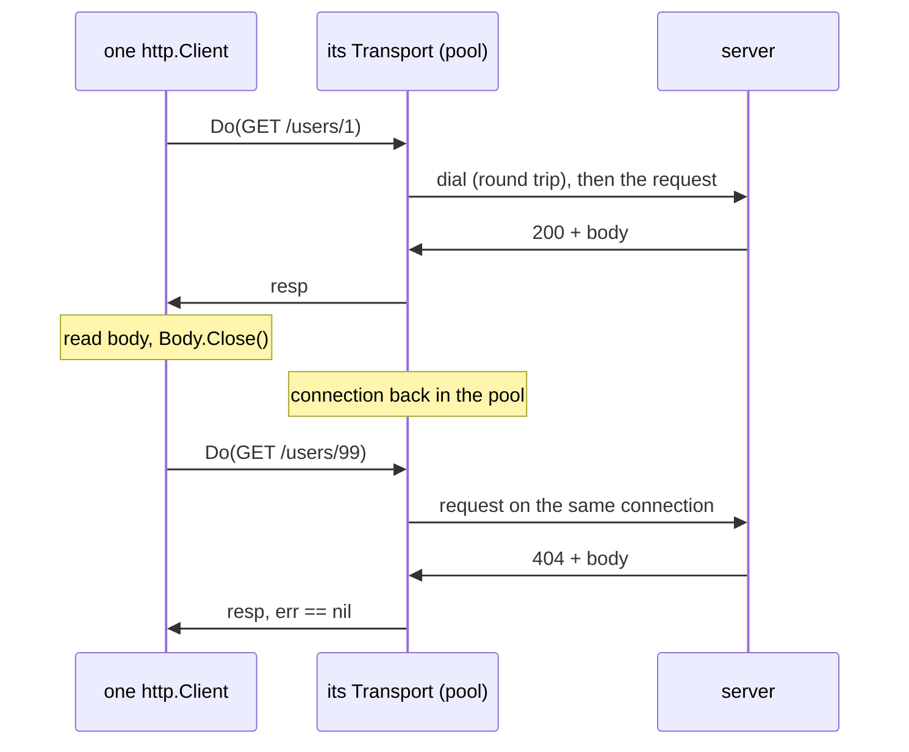

# Day 047 · Go — net/http Client, requests, headers, and reusing the transport

**Today's theme:** HTTP clients

**After today you can:** You can call a JSON API with a timeout in each language and handle a 500.

**The interviewer asks it as:** *What goes wrong if you create a new HTTP client for every request?*

---

## 1. What this is, and why it matters

`net/http` is in Go's standard library, and `http.Client` is the type that sends requests. Under
it sits an `http.Transport`, which owns the actual TCP connections and keeps them open between
requests so the next one can skip the handshake. You build one client with a timeout, share it
across your whole program, and every request goes through it; the transport does the reuse for you
as long as you let it.

At work, this is the most common piece of Go you will write after `if err != nil`. Every service
that calls another service holds one `http.Client` somewhere near `main`. In interviews the
question in the header is asked directly, and the Go-specific follow-up is almost always the same:
"and what do you have to do with the body?" The answer to that one is the difference between a
client that reuses connections and one that only looks like it does.

## 2. The story

Sunita runs a tailoring shop on the ground floor of her building. Every blouse needs buttons, and
the buttons come from Rafiq's wholesale shop on the other side of town, forty minutes away by auto.

In her first month she does it the obvious way. She runs out of blue buttons, pulls the shutter
half down, walks to the corner, flags an auto, haggles over the fare, rides across town, buys one
packet, rides back, and opens up again. Two hours gone. The next day, the same again. By the end of the month she has spent more
time in autos than at the machine.

Her neighbour, who has run a shop for twenty years, watches this for a week and then says the
obvious thing. "Why do you go? Call him."

So Sunita saves Rafiq's number in her phone. Now, when she needs buttons, she calls. The first
few seconds of every call are the same: "Rafiq, it's Sunita from the tailoring shop, I'm calling
about buttons." He knows who she is and what kind of thing she wants before she says another word.
Then she either asks a question, "do you have the dark green in stock", or she places an order,
"send me six packets of the dark green". A question and an order are different kinds of call.

Two more habits come with the phone. If Rafiq does not pick up in a minute, she hangs up and
tries again after lunch. And she has learnt to hear the difference between two kinds of
bad news. Sometimes the line is dead, and she knows nothing at all about whether Rafiq is open.
Sometimes Rafiq picks up and says, "the shutter is jammed, I can't get to the shelves, call back
in an hour". That second one is not a failed call. It is a perfectly good call that carried bad
news, and she plans around it.

One more thing her neighbour taught her. When Rafiq finishes talking, she says "thanks, bye" and
puts the phone down properly. If she just walks away with the call still open, the next time she
wants to call him the line is still busy with the last call, and she has to use a second phone.

## 3. The idea in plain English

The auto ride is a new TCP connection: the three-message handshake from
[day 4](../day-004-the-growth-curves/README.md), and for `https` an encryption exchange on top,
each a round trip of thirty milliseconds across a city or two hundred across an ocean. A fresh
connection per request pays that every time.

The saved number is the **client**, `http.Client`. Inside it is the **transport**,
`http.Transport`, which is the part that actually dials, and which keeps a **connection pool**:
open TCP connections to each server, kept alive after a response, handed out again for the next
request to the same server. `http.DefaultClient` and the package-level `http.Get` use one shared
transport, which is fine, but they have no timeout, so you build your own client and give it one.

"It's Sunita, calling about buttons" is the **headers**, named lines sent before the body of every
request: `User-Agent` says who is calling and `Accept` says what kind of reply you can read. In Go
you set them on an `http.Request`, which you build first and then hand to the client.

The question is a **GET**, a request with no body that asks for something; the order is a
**POST**, a request that sends a body, here JSON from [day 40](../day-040-2d-prefix-sums/README.md),
and usually changes what the server holds.

Hanging up after a minute is the **timeout**, the `Timeout` field on the client. It caps the whole
request, from dialling to the last byte of the body. Without it, a server that stops answering
holds your goroutine hostage.

The two kinds of bad news are Go's two return values. A dead line, refused or timed out, is `err`,
because there is no response to give you. A jammed shutter is a **500**, a response whose
`StatusCode` says the server had a problem, and it comes back as a perfectly normal `resp` with
`err == nil`. Nothing in `net/http` treats a status code as an error. You check it yourself, every
time.

And "thanks, bye" is `resp.Body.Close()`. The body is a stream over the connection. Until you read
it to the end and close it, the transport cannot put that connection back in the pool, so the next
request dials a new one. The reuse the client promises depends on this one line.

## 4. The picture



Notice two things. The second request has no "dial" line, and the 404 arrives with `err == nil`.
Both of those are the lesson.

## 5. The code, built step by step

Every call goes to the fixture in [the practice sheet](03-practice.md). Save it as `fixture.py`,
run `python fixture.py` in a separate terminal, and leave it running. It prints one line per
request with the port the request came from, and that port is how you will see reuse.

The client first, and the type the JSON maps onto.

```go
type User struct {
	ID   int    `json:"id"`
	Name string `json:"name"`
	City string `json:"city"`
}

const base = "http://127.0.0.1:8090"

client := &http.Client{Timeout: 2 * time.Second}
```

The struct tags are the [day 40](../day-040-2d-prefix-sums/README.md) `encoding/json` tags. The
client is a pointer, built once, and passed into every function that needs it. `Timeout` covers
the whole request.

A GET, built as a request so the headers can go on it.

```go
func getUser(client *http.Client, id int) (*User, error) {
	req, err := http.NewRequest(http.MethodGet, fmt.Sprintf("%s/users/%d", base, id), nil)
	if err != nil {
		return nil, err
	}
	req.Header.Set("User-Agent", "krama-day47")
	req.Header.Set("Accept", "application/json")
	resp, err := client.Do(req)
	if err != nil {
		return nil, err // dead line
	}
	defer resp.Body.Close()
```

`http.NewRequest` takes the method, the URL, and a body, which is `nil` for a GET. `req.Header` is
a map from name to values, and `Set` writes one. `client.Do` sends it. If `err` is not `nil`, there
is no response and the function stops. If it is `nil`, the very next line is `defer
resp.Body.Close()`, before anything else can return early.

Now the status code, which is the half people forget.

```go
	if resp.StatusCode == http.StatusNotFound {
		return nil, nil
	}
	if resp.StatusCode != http.StatusOK {
		return nil, fmt.Errorf("GET /users/%d: status %d", id, resp.StatusCode)
	}
	var user User
	if err := json.NewDecoder(resp.Body).Decode(&user); err != nil {
		return nil, err
	}
	return &user, nil
}
```

A 404 is an ordinary answer for this function, so it returns `nil, nil`: no user, no error. Any
other non-200 is an error you build yourself, because `net/http` will not build it for you.
`json.NewDecoder(resp.Body).Decode(&user)` reads the body straight into the struct without a
`[]byte` in between.

A POST with a JSON body.

```go
func createUser(client *http.Client, name, city string) (*User, error) {
	body, err := json.Marshal(map[string]string{"name": name, "city": city})
	if err != nil {
		return nil, err
	}
	req, err := http.NewRequest(http.MethodPost, base+"/users", bytes.NewReader(body))
	if err != nil {
		return nil, err
	}
	req.Header.Set("Content-Type", "application/json")
```

`json.Marshal` gives you bytes; `bytes.NewReader` wraps them as the `io.Reader` the request wants.
The `Content-Type` header is not set for you. Forget it and the fixture answers `415`. The rest of
the function is the same `Do`, `defer Close`, status check, and `Decode` as the GET, expecting
`http.StatusCreated` this time.

The two kinds of bad news, told apart.

```go
if _, err := getUser(client, 99); err != nil { /* not reached: 404 is nil, nil */ }

req, _ := http.NewRequest(http.MethodGet, base+"/slow", nil)
_, err := client.Do(req)
var urlErr *url.Error
if errors.As(err, &urlErr) && urlErr.Timeout() {
	fmt.Println("gave up waiting on /slow after 2 seconds")
}
```

A client timeout comes back wrapped in a `*url.Error` whose `Timeout()` method reports `true`.
`errors.As` from [day 27](../day-027-two-pointers-idea/README.md) unwraps it. A 500 does not come
back through `err` at all, so there is nothing to unwrap: it is `resp.StatusCode == 500`, and you
read the server's explanation from the body.

Save as `main.go` and run it with the fixture up:

```bash
go run main.go
```

```text
user 1: Meera from Pune
user 99: not found
created id 2 -> {ID:2 Name:Arjun City:Delhi}
server error: 500 database down
gave up waiting on /slow after 2 seconds
```

The fixture's terminal:

```text
GET  /users/1 from port 51601
GET  /users/99 from port 51601
POST /users from port 51601
GET  /fail from port 51601
GET  /slow from port 51601
```

One port, five requests. The transport dialled once.

Here is the whole program in one piece, `main.go`:

```go
package main

import (
	"bytes"
	"encoding/json"
	"errors"
	"fmt"
	"io"
	"net/http"
	"net/url"
	"os"
	"time"
)

type User struct {
	ID   int    `json:"id"`
	Name string `json:"name"`
	City string `json:"city"`
}

const base = "http://127.0.0.1:8090"

func newRequest(method, path string, body io.Reader) (*http.Request, error) {
	req, err := http.NewRequest(method, base+path, body)
	if err != nil {
		return nil, err
	}
	req.Header.Set("User-Agent", "krama-day47")
	req.Header.Set("Accept", "application/json")
	return req, nil
}

func getUser(client *http.Client, id int) (*User, error) {
	req, err := newRequest(http.MethodGet, fmt.Sprintf("/users/%d", id), nil)
	if err != nil {
		return nil, err
	}
	resp, err := client.Do(req)
	if err != nil {
		return nil, err
	}
	defer resp.Body.Close()
	if resp.StatusCode == http.StatusNotFound {
		return nil, nil
	}
	if resp.StatusCode != http.StatusOK {
		return nil, fmt.Errorf("GET /users/%d: status %d", id, resp.StatusCode)
	}
	var user User
	if err := json.NewDecoder(resp.Body).Decode(&user); err != nil {
		return nil, err
	}
	return &user, nil
}

func createUser(client *http.Client, name, city string) (*User, error) {
	body, err := json.Marshal(map[string]string{"name": name, "city": city})
	if err != nil {
		return nil, err
	}
	req, err := newRequest(http.MethodPost, "/users", bytes.NewReader(body))
	if err != nil {
		return nil, err
	}
	req.Header.Set("Content-Type", "application/json")
	resp, err := client.Do(req)
	if err != nil {
		return nil, err
	}
	defer resp.Body.Close()
	if resp.StatusCode != http.StatusCreated {
		return nil, fmt.Errorf("POST /users: status %d", resp.StatusCode)
	}
	var user User
	if err := json.NewDecoder(resp.Body).Decode(&user); err != nil {
		return nil, err
	}
	return &user, nil
}

// serverError returns the "error" field of a JSON error body, for a non-2xx response.
func serverError(client *http.Client, path string) (int, string, error) {
	req, err := newRequest(http.MethodGet, path, nil)
	if err != nil {
		return 0, "", err
	}
	resp, err := client.Do(req)
	if err != nil {
		return 0, "", err
	}
	defer resp.Body.Close()
	var payload struct {
		Error string `json:"error"`
	}
	if err := json.NewDecoder(resp.Body).Decode(&payload); err != nil {
		return resp.StatusCode, "", err
	}
	return resp.StatusCode, payload.Error, nil
}

func main() {
	client := &http.Client{Timeout: 2 * time.Second}

	user, err := getUser(client, 1)
	if err != nil {
		fmt.Println("get user 1:", err)
		os.Exit(1)
	}
	fmt.Println("user 1:", user.Name, "from", user.City)

	missing, err := getUser(client, 99)
	if err != nil {
		fmt.Println("get user 99:", err)
		os.Exit(1)
	}
	if missing == nil {
		fmt.Println("user 99: not found")
	}

	created, err := createUser(client, "Arjun", "Delhi")
	if err != nil {
		fmt.Println("create user:", err)
		os.Exit(1)
	}
	fmt.Printf("created id %d -> %+v\n", created.ID, *created)

	status, message, err := serverError(client, "/fail")
	if err != nil {
		fmt.Println("get /fail:", err)
		os.Exit(1)
	}
	fmt.Println("server error:", status, message)

	req, err := newRequest(http.MethodGet, "/slow", nil)
	if err != nil {
		fmt.Println("build /slow:", err)
		os.Exit(1)
	}
	_, err = client.Do(req)
	var urlErr *url.Error
	if errors.As(err, &urlErr) && urlErr.Timeout() {
		fmt.Println("gave up waiting on /slow after 2 seconds")
	} else if err != nil {
		fmt.Println("get /slow:", err)
	}
}
```

## 6. How the other two languages do it

**Python**

```python
with httpx.Client(base_url=BASE, timeout=2.0, headers=headers) as client:
    response = client.get("/users/1")
    if response.status_code == 404:
        return None
    response.raise_for_status()   # 500 becomes an exception only here
    return response.json()
```

One `httpx.Client` in a `with`, and the body is read and the connection returned to the pool for
you when `.json()` runs. A dead line is an exception; a 500 is a normal response until you ask
`raise_for_status` to complain.

**C++**

```cpp
cpr::Session session;
session.SetTimeout(cpr::Timeout{std::chrono::milliseconds{2000}});
session.SetUrl(cpr::Url{base + "/users/1"});
cpr::Response r = session.Get();
if (r.error) { /* dead line */ }
if (r.status_code != 200) { /* jammed shutter */ }
auto user = nlohmann::json::parse(r.text);
```

One `cpr::Session`, and the body arrives already read into `r.text`. A dead line is a field on
the response, not a return value or an exception.

**The difference that matters:** Go is the only one of the three that hands you the body as an
open stream. Python and cpr have read it by the time you see it, so the connection is already free.
In Go the connection is busy until you read the body to the end and call `Close`; skip either and
the client you built to reuse connections quietly opens a new one per request.

## 7. The traps

**The near-miss: the client that is not reused.** This looks like reuse, and it is not.

```go
for i := 0; i < 3; i++ {
	resp, err := client.Get(base + "/users/1")
	if err != nil {
		return err
	}
	fmt.Println(resp.StatusCode) // never touches resp.Body
}
```

It compiles, `go vet` is silent, and it prints `200` three times. The fixture shows three ports:

```text
GET  /users/1 from port 51602
GET  /users/1 from port 51603
GET  /users/1 from port 51604
```

The body was never read and never closed, so the transport could not return the connection to the
pool, and dialled a new one each time. Each leaked body is also an open file descriptor, and after
enough of them:

```text
Get "http://127.0.0.1:8090/users/1": dial tcp 127.0.0.1:8090: socket: too many open files
```

The fix is two lines, `defer resp.Body.Close()` and, if you are not decoding the body, `io.Copy(io.Discard, resp.Body)` so it is read to the end.

**A new client per request.** The other way to get three ports:

```go
resp, err := (&http.Client{Timeout: 2 * time.Second}).Get(url)
```

Each `&http.Client{}` with no `Transport` set shares `http.DefaultTransport`, so this one is
partly rescued by the standard library. Build a new `&http.Transport{}` per request as well, which
people do when they want a custom TLS setting, and every request dials fresh and the idle
connections from the old transports pile up until the process is out of descriptors.

**Treating `err == nil` as success.**

```go
resp, err := client.Get(base + "/fail")
if err != nil {
	return err
}
var user User
json.NewDecoder(resp.Body).Decode(&user)
fmt.Println(user.Name)
```

`err` is `nil`. The status is 500 and the body is `{"error": "database down"}`, which decodes into
`User` without complaint because none of its fields match, and the program prints an empty line
and carries on. No error anywhere. Check `resp.StatusCode` before you decode, every time.

**An unhandled timeout.** Print the error from `/slow` instead of unwrapping it:

```text
Get "http://127.0.0.1:8090/slow": context deadline exceeded (Client.Timeout exceeded while awaiting headers)
```

The text after the colon is the giveaway. `Client.Timeout exceeded while awaiting headers` means
the connection was made and the request went out, and the two seconds ran out before the first
byte of the reply.

**Nobody home.** Point the client at a port with no server:

```text
Get "http://127.0.0.1:9999/users/1": dial tcp 127.0.0.1:9999: connect: connection refused
```

On Windows the tail reads `connectex: No connection could be made because the target machine
actively refused it.` It is the [day 46](../day-046-binary-search-on-the-answer/README.md)
`connection refused`, seen from the client.

**Decoding into the wrong type.** Declare `ID string` instead of `ID int`:

```text
json: cannot unmarshal number into Go struct field User.id of type string
```

**Forgetting the import after adding the timeout check.** Use `url.Error` without importing
`net/url`:

```text
./main.go:120:14: undefined: url
```

## 8. Say it out loud

**How it gets asked**

- What goes wrong if you create a new HTTP client for every request?
- Why do people say you must always close the response body in Go?
- The downstream returns a 500. What does `client.Do` return?
- What does `http.Client.Timeout` actually cover?

**The ninety-second script**

A new client per request means a new connection per request: a TCP handshake, plus the TLS
exchange on HTTPS, before any data moves, and that is one to three round trips of thirty to two
hundred milliseconds on every call. In Go it is worse than slow, because each abandoned client
leaves its idle connections open, and a busy process runs out of file descriptors. So I build one
`http.Client` with a `Timeout`, near `main`, and pass it in. Its transport keeps a pool of open
connections and reuses them. Then there are two things I have to do on every response. I `defer
resp.Body.Close()` on the line after the error check, and I read the body to the end, because the
connection is not returned to the pool until both have happened. And I check `resp.StatusCode`,
because a 500 comes back with `err == nil`. The error is only for the dead line: refused, or timed
out. The server saying no is a normal response.

**The follow-ups**

- **What does the transport keep, exactly?** *Idle TCP connections per host, up to
  `MaxIdleConnsPerHost`, which defaults to two, and a total cap of a hundred. For a service that
  hammers one downstream I raise the per-host number; otherwise the third concurrent request dials
  fresh.*
- **`Timeout` on the client versus a context on the request?** *`Client.Timeout` caps the whole
  exchange for every request. A context from
  [day 36](../day-036-two-pointers-revision/README.md) on `NewRequestWithContext` lets one call
  have its own deadline and be cancelled when the caller gives up. In a server I use the request's
  context so a client that has gone away does not leave my downstream call running.*
- **What do you do on a 500?** *Retry a GET, with a short growing wait between attempts and a cap
  on the count. Not a POST that creates something, unless the server takes a key that makes a
  repeat harmless. After the last attempt I return the error with the status in it.*

**A model answer**

"One `http.Client` per process, with `Timeout` set, shared. It holds a transport with a
connection pool, so the second request to a host reuses the first one's socket instead of dialling.
That only works if I read the body to the end and close it, so `defer resp.Body.Close()` goes right
after `if err != nil`. And `err` is only the transport failing. A 500 arrives with `err == nil`, so
I check `resp.StatusCode` before I decode anything, and I build my own error with the status in it
when it is wrong."

## 9. Recall card

- One `&http.Client{Timeout: ...}` near `main`, passed in; its `Transport` pools connections and reuses them.
- `defer resp.Body.Close()` on the line after `if err != nil`, and read the body to the end, or the connection is never returned to the pool.
- `err` is the dead line only. A 500 is `resp` with `err == nil`; check `resp.StatusCode` before `Decode`.
- `context deadline exceeded (Client.Timeout exceeded while awaiting headers)` is the timeout; `connect: connection refused` is nobody home.
- POST needs `bytes.NewReader(json.Marshal(...))` and `Content-Type: application/json` set by hand.
