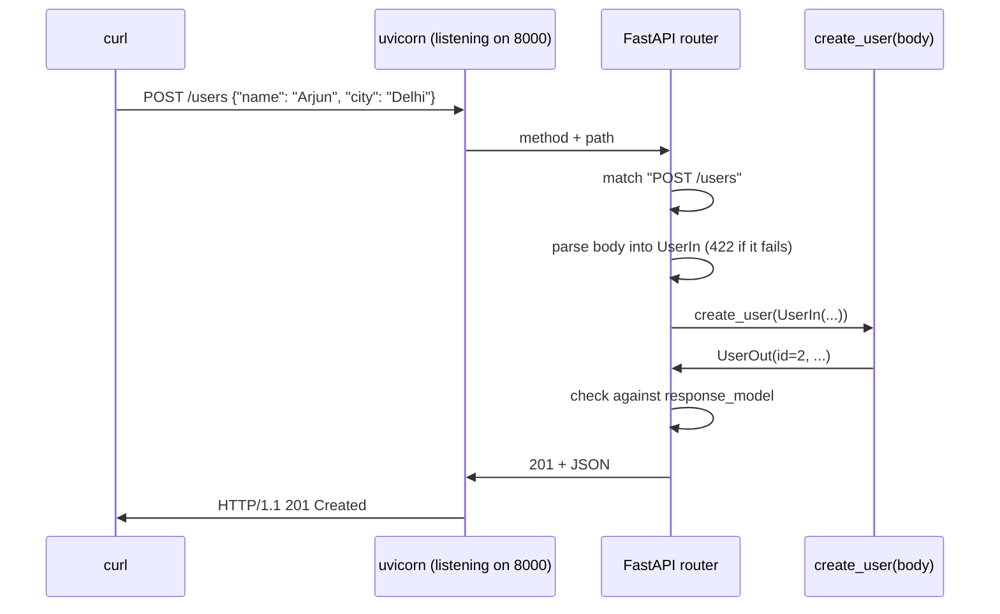

# Day 048 · Python — FastAPI: a route, a request model, a response model

**Today's theme:** HTTP servers

**After today you can:** You can serve a JSON endpoint on a port in each language and hit it with curl.

**The interviewer asks it as:** *Walk me through how your server handles one request.*

---

## 1. What this is, and why it matters

An HTTP server is the other end of yesterday's client: a program that listens on a port, reads
each request, decides which function should answer it, and writes a response back. FastAPI is the
Python framework that makes that a decorator on a function: `@app.get("/users/{user_id}")` and
the function underneath is the answer. It reads the request body into a pydantic model from
[day 40](../day-040-2d-prefix-sums/README.md), rejects bad input before your code runs, and turns
whatever you return into JSON.

At work, this is the shape of nearly every Python service you will touch. In interviews, "walk me
through how your server handles one request" is a favourite because it has a right answer with
six or seven steps, and most people can name three. By the end of today you can name all of them
and point at the line of code where each one happens.

## 2. The story

Rekha runs the front desk at a small dental clinic on the second floor of a shopping complex. The
clinic opens at nine. Before that, the door is locked and anyone who climbs the stairs finds a
closed shutter and goes back down. At nine she unlocks it, switches on the light over the desk,
and from then on she is the first person anyone meets.

A man comes in holding a folded slip. Rekha does not guess what he wants. She asks. "Are you here
to see someone, or are you here to register?" If he is here to see a doctor, she asks which one.
Dr Iyer is in room two, Dr Bhat is in room three. If he asks for a Dr Menon, she says, without
looking anything up, "there is no Dr Menon here", and that is the end of it. He does not get sent
to a room to find out for himself.

A woman comes in to register as a new patient. Rekha hands her the form: name, phone number,
date of birth. The woman fills in her name and hands it back. Rekha looks at it for two seconds
and hands it straight back. "Phone number, please." She does not carry a half-filled form to the
back office and let them discover the gap an hour later. Nobody behind the desk ever sees a form
with something missing, because Rekha does not let one through.

When a form is complete, Rekha writes the new patient's number on it, files it, and gives the
woman a small printed card with exactly three things on it: her number, her name, and the
clinic's phone line. The same card, every time, with the same three things in the same places.
The woman does not get the whole form back, and she does not get Rekha's notes.

At six the light goes off and the shutter comes down. A boy who arrives at ten past six knocks
twice and leaves.

## 3. The idea in plain English

The unlocked door with the light on is the server **listening** on a port: the `bind` and `listen`
you wrote by hand on [day 46](../day-046-binary-search-on-the-answer/README.md), done for you by
a program called `uvicorn`, which runs your FastAPI app. Before it starts, a request gets
`connection refused`. After it starts, every request comes through Rekha.

"Which doctor?" is **routing**. Every request carries a method, `GET` or `POST` from
[day 47](../day-047-minimise-the-maximum/README.md), and a path, such as `/users/1`. A **route**
is the pairing of one method and one path shape with one function, and the decorator
`@app.get("/users/{user_id}")` declares it. The `{user_id}` in braces is a **path parameter**:
whatever sits in that position of the path is handed to your function as an argument, already
converted to the type you declared.

"There is no Dr Menon here" is a **404**, sent by raising `HTTPException(status_code=404)`. The
function decides the answer is "no", and FastAPI turns that into a response with that status and
a small JSON body. Your function never has to build the response by hand.

The registration form is a **request model**: a pydantic class that lists the fields the body
must carry, with their types. FastAPI reads the body, parses it as JSON, and checks it against the
class before your function is called. A body with a missing field never reaches your code; the
caller gets a **422** and a list of exactly what was wrong. That is Rekha handing the form back.

The printed card is a **response model**: a second pydantic class that says what the reply looks
like. Whatever your function returns is filtered and checked against it, so a reply always has the
same fields in the same shape, and a field you did not mean to expose never leaks out.

The shutter at six is the server stopping. Ctrl-C in the terminal running `uvicorn` closes the
listening socket, and the boy at ten past six gets `connection refused` again.

## 4. The picture



Notice the two checks happen inside the router, on either side of your function. Your function
sees only a valid `UserIn`, and the caller sees only a valid `UserOut`.

## 5. The code, built step by step

Install the framework and the server that runs it:

```bash
python -m pip install fastapi uvicorn
```

The app, and the two models.

```python
from fastapi import FastAPI, HTTPException
from pydantic import BaseModel

app = FastAPI()


class UserIn(BaseModel):
    name: str
    city: str


class UserOut(BaseModel):
    id: int
    name: str
    city: str
```

`app` is the object every route hangs off. `UserIn` is what a caller must send to create a user;
`UserOut` is what they get back. They differ by one field, `id`, because the caller does not choose
the id, the server does. Keeping them separate is what stops a caller sending `"id": 1` and
overwriting Meera.

A place to keep users, and the GET route.

```python
users: dict[int, UserOut] = {1: UserOut(id=1, name="Meera", city="Pune")}


@app.get("/users/{user_id}", response_model=UserOut)
def get_user(user_id: int) -> UserOut:
    if user_id not in users:
        raise HTTPException(status_code=404, detail="no such user")
    return users[user_id]
```

The dict stands in for a database until [day 53](../day-053-merge-sort/README.md). The decorator
says: a `GET` whose path looks like `/users/<something>` calls this function, with that something
converted to an `int` and passed as `user_id`. If it cannot be converted, the caller gets a 422
and the function is never called. The `raise HTTPException` is "no Dr Menon here".

The POST route.

```python
@app.post("/users", response_model=UserOut, status_code=201)
def create_user(body: UserIn) -> UserOut:
    new_id = max(users) + 1
    users[new_id] = UserOut(id=new_id, name=body.name, city=body.city)
    return users[new_id]
```

A parameter whose type is a pydantic model is read from the request body. By the time the first
line of `create_user` runs, `body.name` and `body.city` are both present and both strings, or the
function did not run. `status_code=201` is "Created", the correct status for a POST that made
something, instead of the default 200.

Save it as `main.py`. There is no `if __name__ == "__main__"` block, because `uvicorn` imports the
file and finds `app` itself:

```bash
python -m uvicorn main:app --port 8000
```

```text
INFO:     Started server process [14188]
INFO:     Waiting for application startup.
INFO:     Application startup complete.
INFO:     Uvicorn running on http://127.0.0.1:8000 (Press CTRL+C to quit)
```

`main:app` means "the object called `app` in the module `main`". Now, in a second terminal, be the
client. `curl -i` prints the status line and headers before the body:

```bash
curl -i http://127.0.0.1:8000/users/1
curl -i http://127.0.0.1:8000/users/99
curl -i -X POST -H "Content-Type: application/json" -d '{"name":"Arjun","city":"Delhi"}' http://127.0.0.1:8000/users
```

The status lines and bodies, one pair per command:

```text
HTTP/1.1 200 OK
{"id":1,"name":"Meera","city":"Pune"}

HTTP/1.1 404 Not Found
{"detail":"no such user"}

HTTP/1.1 201 Created
{"id":2,"name":"Arjun","city":"Delhi"}
```

And the server's terminal logs one line per request, with the caller's port from
[day 47](../day-047-minimise-the-maximum/README.md) at the front:

```text
INFO:     127.0.0.1:57658 - "GET /users/1 HTTP/1.1" 200 OK
INFO:     127.0.0.1:57659 - "GET /users/99 HTTP/1.1" 404 Not Found
INFO:     127.0.0.1:57661 - "POST /users HTTP/1.1" 201 Created
```

Now send the half-filled form:

```bash
curl -X POST -H "Content-Type: application/json" -d '{"name":"Arjun"}' http://127.0.0.1:8000/users
```

```text
{"detail":[{"type":"missing","loc":["body","city"],"msg":"Field required","input":{"name":"Arjun"}}]}
```

That is a 422, and `create_user` never ran. The body names the field, `["body", "city"]`, and says
what was wrong with it. You wrote none of that.

One more thing for free. Open `http://127.0.0.1:8000/docs` in a browser. FastAPI has read your
routes and models and built a page that lists every endpoint and lets you call it. That page is
generated from the same type hints; it is not a separate thing you maintain.

Here is the whole program in one piece, `main.py`:

```python
from fastapi import FastAPI, HTTPException
from pydantic import BaseModel

app = FastAPI()


class UserIn(BaseModel):
    name: str
    city: str


class UserOut(BaseModel):
    id: int
    name: str
    city: str


users: dict[int, UserOut] = {1: UserOut(id=1, name="Meera", city="Pune")}


@app.get("/users/{user_id}", response_model=UserOut)
def get_user(user_id: int) -> UserOut:
    if user_id not in users:
        raise HTTPException(status_code=404, detail="no such user")
    return users[user_id]


@app.post("/users", response_model=UserOut, status_code=201)
def create_user(body: UserIn) -> UserOut:
    new_id = max(users) + 1
    users[new_id] = UserOut(id=new_id, name=body.name, city=body.city)
    return users[new_id]
```

## 6. How the other two languages do it

**Go**

```go
mux := http.NewServeMux()
mux.HandleFunc("/users/", func(w http.ResponseWriter, r *http.Request) {
	id, err := strconv.Atoi(strings.TrimPrefix(r.URL.Path, "/users/"))
	if err != nil {
		writeJSON(w, http.StatusBadRequest, map[string]string{"error": "bad id"})
		return
	}
	// ... look up, writeJSON(w, 200, user) or writeJSON(w, 404, ...)
})
log.Fatal(http.ListenAndServe("127.0.0.1:8000", mux))
```

The standard library and nothing else. The path parameter is a string you slice off and convert
yourself, the body is a stream you decode yourself, and every response is a status you set and
JSON you encode by hand.

**C++**

```cpp
httplib::Server svr;
svr.Get("/users/:id", [](const httplib::Request& req, httplib::Response& res) {
    int id = std::stoi(req.path_params.at("id"));
    // ... res.status = 404; res.set_content(json{{"error", "no such user"}}.dump(), "application/json");
});
svr.listen("127.0.0.1", 8000);
```

A header-only library and a lambda per route. `:id` is a path parameter you read as a string;
the body is `req.body`, a string you parse with nlohmann; the response is two fields you set.

**The difference that matters:** FastAPI validates for you, on both sides of your function, from
the type hints alone. In Go and C++ nothing checks the body until you write the check, and nothing
checks your response ever. The 422 with `["body", "city"]` in it does not exist in the other two
languages unless you build it, which is exactly what [day 50](../day-050-binary-search-revision/README.md)
is about.

## 7. The traps

**The near-miss: one model for both directions.** Use `UserOut` as the request body too.

```python
@app.post("/users", response_model=UserOut, status_code=201)
def create_user(body: UserOut) -> UserOut:
    users[body.id] = body
    return body
```

It works. Then a caller sends `{"id": 1, "name": "X", "city": "Y"}` and Meera is gone. The
request model is the form the public fills in; the response model is the card you print. They
share fields, and they are not the same thing.

**Returning something that does not match the response model.**

```python
@app.get("/broken/{user_id}", response_model=UserOut)
def broken(user_id: int) -> dict:
    return {"id": user_id, "name": "Meera"}   # city is missing
```

The caller gets a bare `500 Internal Server Error`, and the server's terminal says why:

```text
fastapi.exceptions.ResponseValidationError: 1 validation error:
  {'type': 'missing', 'loc': ('response', 'city'), 'msg': 'Field required', 'input': {'id': 1, 'name': 'Meera'}}
```

The `('response', 'city')` is the tell. The output check failed, not the input check.

**A path parameter that is not an int.** `curl http://127.0.0.1:8000/users/abc`:

```text
{"detail":[{"type":"int_parsing","loc":["path","user_id"],"msg":"Input should be a valid integer, unable to parse string as an integer","input":"abc"}]}
```

A 422 again, and `get_user` did not run. The `loc` says `path` this time, not `body`.

**A body that is not JSON at all.** `-d 'hello'` with the JSON content type:

```text
{"detail":[{"type":"json_invalid","loc":["body",0],"msg":"JSON decode error","input":{},"ctx":{"error":"Expecting value"}}]}
```

**The port is already taken.** Start `uvicorn` twice on 8000:

```text
ERROR:    [Errno 10048] error while attempting to bind on address ('127.0.0.1', 8000): [winerror 10048] only one usage of each socket address (protocol/network address/port) is normally permitted
```

On Linux the tail reads `[errno 98] address already in use`. It is
[day 46](../day-046-binary-search-on-the-answer/README.md)'s `bind` losing, one layer up.

**Running the file with `python main.py`.** It does nothing and exits. There is no listening loop
in the file; `uvicorn` is the loop. The command is `python -m uvicorn main:app`.

## 8. Say it out loud

**How it gets asked**

- Walk me through how your server handles one request.
- Where does input validation happen, and what does the caller see when it fails?
- What is the difference between a 404, a 422, and a 500 in your API?
- Why two models instead of one?

**The ninety-second script**

The process starts by binding a port and listening; that is `uvicorn` running my app. A request
arrives on a connection. The server reads the request line, so it knows the method and the path,
and the headers. The router matches method and path against my routes, so `GET /users/1` picks
`get_user` and binds `1` to `user_id` as an int, or returns a 422 if it cannot convert. For a POST,
the router reads the body, parses the JSON, and validates it against the request model; a missing
or mistyped field is a 422 with the field named, and my function never runs. Then my function runs
with typed arguments. It returns a model, or raises `HTTPException` for a 404. The return value is
checked against the response model and serialised to JSON, a status is set, and the response goes
back on the same connection. Then the connection is either kept alive for the next request or
closed.

**The follow-ups**

- **Where do 500s come from, then?** *From my code: an exception I did not catch, or a return
  value that fails the response model. The caller gets a bare 500 with no detail, on purpose, so
  internals do not leak; the detail is in my logs.*
- **What does uvicorn do that FastAPI does not?** *Uvicorn owns the socket: it listens, accepts
  connections, parses the raw HTTP bytes, and calls my app with a request object. FastAPI does
  routing, validation, and serialisation. Swap uvicorn for another server and the app does not
  change.*
- **How would you handle a thousand requests at once?** *Uvicorn runs my routes on an event loop
  from [day 45](../day-045-rotated-array-search/README.md), so `async def` routes that wait on
  I/O do not block each other, and plain `def` routes run on a thread pool. For CPU work I add
  worker processes with `--workers`.*

**A model answer**

"Bind and listen, then per request: parse the request line and headers, route on method and path,
convert path parameters, read and validate the body against the request model, call my function
with typed arguments, validate the return value against the response model, serialise to JSON, set
the status, write it back. Validation failures are 422s the caller can read and my function never
sees. A 404 is a decision my function makes with `HTTPException`. A 500 is my bug, and the caller
gets no detail."

## 9. Recall card

- `@app.get("/users/{user_id}")` routes on method and path; `{user_id}` becomes a typed argument, or a 422.
- A pydantic parameter is the request body; it is validated before the function runs, and a bad one is a 422 naming the field.
- `response_model=` filters and checks the return; a return that fails it is a 500 with `('response', ...)` in the log.
- Two models: the form the caller fills in, and the card they get back. Never let the caller choose the id.
- `python -m uvicorn main:app --port 8000` runs it; `curl -i` shows the status line; `/docs` is free.
