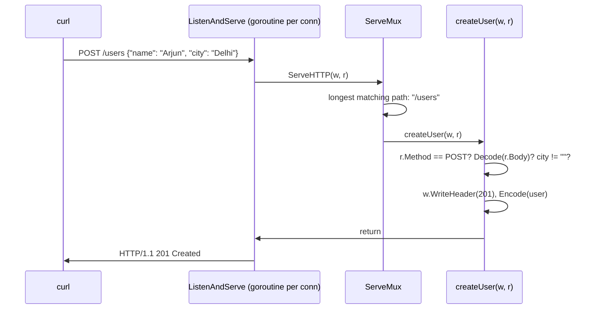

# Day 048 · Go — net/http: ServeMux, handlers, and http.ListenAndServe

**Today's theme:** HTTP servers

**After today you can:** You can serve a JSON endpoint on a port in each language and hit it with curl.

**The interviewer asks it as:** *Walk me through how your server handles one request.*

---

## 1. What this is, and why it matters

`net/http` is a complete HTTP server in Go's standard library. An `http.ServeMux` is the router:
you register a path and a function, and it calls the function for requests to that path.
`http.ListenAndServe` binds the port, accepts connections, parses each request, and hands it to
the mux, one goroutine per connection, exactly like the echo server on
[day 46](../day-046-binary-search-on-the-answer/README.md) with a parser inside the goroutine.
There is no framework to install.

At work, most Go services are this plus a router with nicer patterns, and many are just this. In
interviews, "walk me through how your server handles one request" is easiest to answer in Go,
because every step is a line you wrote: the mux, the handler, the decode, the status, the encode.
Nothing is hidden, which also means nothing is done for you.

## 2. The story

Rekha runs the front desk at a small dental clinic on the second floor of a shopping complex. The
clinic opens at nine. Before that, the door is locked and anyone who climbs the stairs finds a
closed shutter and goes back down. At nine she unlocks it, switches on the light over the desk,
and from then on she is the first person anyone meets.

A man comes in holding a folded slip. Rekha does not guess what he wants. She asks. "Are you here
to see someone, or are you here to register?" If he is here to see a doctor, she asks which one.
Dr Iyer is in room two, Dr Bhat is in room three. If he asks for a Dr Menon, she says, without
looking anything up, "there is no Dr Menon here", and that is the end of it. He does not get sent
to a room to find out for himself.

A woman comes in to register as a new patient. Rekha hands her the form: name, phone number,
date of birth. The woman fills in her name and hands it back. Rekha looks at it for two seconds
and hands it straight back. "Phone number, please." She does not carry a half-filled form to the
back office and let them discover the gap an hour later. Nobody behind the desk ever sees a form
with something missing, because Rekha does not let one through.

When a form is complete, Rekha writes the new patient's number on it, files it, and gives the
woman a small printed card with exactly three things on it: her number, her name, and the
clinic's phone line. The same card, every time.

At this clinic there is one more habit. Rekha writes the outcome on the top corner of every slip
before she writes anything else: "seen", "sent back", "no such doctor". Once the corner is
written, it cannot be changed. On her first week she wrote a long note first and then tried to
change the corner, and the slip went into the file saying the wrong thing.

At six the light goes off and the shutter comes down. A boy who arrives at ten past six knocks
twice and leaves.

## 3. The idea in plain English

The unlocked door with the light on is `http.ListenAndServe("127.0.0.1:8000", mux)`. It is
`net.Listen` and the `Accept` loop from [day 46](../day-046-binary-search-on-the-answer/README.md)
with an HTTP parser in each goroutine. It blocks for as long as the server runs, and returns an
error only when it cannot bind or is shut down.

"Which doctor?" is the **mux**, short for multiplexer: `http.NewServeMux()` holds a table from
path to function. `mux.HandleFunc("/users/", getUser)` adds a row. A path that ends in `/`
matches everything underneath it, so `/users/` matches `/users/1` and `/users/99`. Today the
number at the end is something you slice off the path yourself; [day 49](../day-049-peak-finding/README.md)
gives the mux a way to do it for you.

The function is a **handler**: `func(w http.ResponseWriter, r *http.Request)`. `r` is the request:
its method in `r.Method`, its path in `r.URL.Path`, its body as a stream in `r.Body`. `w` is where
the response goes: `w.Header().Set` for headers, `w.WriteHeader(status)` for the status line, and
then writes for the body.

"There is no Dr Menon here" is `w.WriteHeader(http.StatusNotFound)` followed by a JSON body you
encode yourself. Nothing builds it for you.

The registration form is a struct with `encoding/json` tags from
[day 40](../day-040-2d-prefix-sums/README.md), decoded from `r.Body`. The decoder checks that the
body is JSON and that the types match; it does **not** check that a field is present. A missing
`city` decodes to the empty string without complaint, so "phone number, please" is an `if` you
write.

The corner of the slip is the status line. `w.WriteHeader` sends it, and the first write to `w`
sends it as 200 if you have not. After that it cannot change. Write the body first and then try
to set a 404, and the caller has already been told 200.

## 4. The picture



Notice that every check between "matched" and "201" lives inside your handler. The mux matched a
path. Everything else was you.

## 5. The code, built step by step

The types and the store.

```go
type User struct {
	ID   int    `json:"id"`
	Name string `json:"name"`
	City string `json:"city"`
}

var users = map[int]User{1: {ID: 1, Name: "Meera", City: "Pune"}}
```

The same struct serves as the request shape and the response shape today; the trap in section 7
shows why that costs something.

One helper to write any JSON response, because you will write it four times.

```go
func writeJSON(w http.ResponseWriter, status int, value any) {
	w.Header().Set("Content-Type", "application/json")
	w.WriteHeader(status)
	if err := json.NewEncoder(w).Encode(value); err != nil {
		log.Println("encode:", err)
	}
}
```

Header, then status, then body, in that order, always. `Header().Set` after `WriteHeader` does
nothing, silently. The encoder from day 40 writes straight into `w`.

The GET handler.

```go
func getUser(w http.ResponseWriter, r *http.Request) {
	if r.Method != http.MethodGet {
		writeJSON(w, http.StatusMethodNotAllowed, map[string]string{"error": "use GET"})
		return
	}
	id, err := strconv.Atoi(strings.TrimPrefix(r.URL.Path, "/users/"))
	if err != nil {
		writeJSON(w, http.StatusBadRequest, map[string]string{"error": "id must be a number"})
		return
	}
	user, ok := users[id]
	if !ok {
		writeJSON(w, http.StatusNotFound, map[string]string{"error": "no such user"})
		return
	}
	writeJSON(w, http.StatusOK, user)
}
```

Four decisions, four early returns. The method check is first because the mux today routes on
path alone. `strings.TrimPrefix` cuts `/users/` off the front and `strconv.Atoi` turns what is
left into a number; `abc` fails here with a 400. The map lookup with `ok` is the 404.

The POST handler.

```go
func createUser(w http.ResponseWriter, r *http.Request) {
	if r.Method != http.MethodPost {
		writeJSON(w, http.StatusMethodNotAllowed, map[string]string{"error": "use POST"})
		return
	}
	var body User
	if err := json.NewDecoder(r.Body).Decode(&body); err != nil {
		writeJSON(w, http.StatusBadRequest, map[string]string{"error": "body is not JSON"})
		return
	}
	if body.Name == "" || body.City == "" {
		writeJSON(w, http.StatusBadRequest, map[string]string{"error": "name and city are required"})
		return
	}
	body.ID = len(users) + 1
	users[body.ID] = body
	writeJSON(w, http.StatusCreated, body)
}
```

`Decode` fails on a body that is not JSON, or on `"name": 5`. It does not fail on a missing
field, so the `== ""` check is Rekha handing the form back. `body.ID` is overwritten no matter
what the caller sent, which is how the server keeps control of the id.

Wiring and listening.

```go
func main() {
	mux := http.NewServeMux()
	mux.HandleFunc("/users/", getUser)
	mux.HandleFunc("/users", createUser)
	log.Println("listening on 127.0.0.1:8000")
	log.Fatal(http.ListenAndServe("127.0.0.1:8000", mux))
}
```

Two rows in the table. `/users/` with the trailing slash catches `/users/1`; `/users` without it
catches exactly `/users`. `ListenAndServe` does not return while the server runs, so `log.Fatal`
around it only fires when it fails, and prints the reason before exiting.

Save as `main.go` and run:

```bash
go run main.go
```

```text
2026/09/16 10:04:11 listening on 127.0.0.1:8000
```

In a second terminal:

```bash
curl -i http://127.0.0.1:8000/users/1
curl -i http://127.0.0.1:8000/users/99
curl -i -X POST -H "Content-Type: application/json" -d '{"name":"Arjun","city":"Delhi"}' http://127.0.0.1:8000/users
curl -i -X POST -H "Content-Type: application/json" -d '{"name":"Arjun"}' http://127.0.0.1:8000/users
```

The status lines and bodies, one pair per command:

```text
HTTP/1.1 200 OK
{"id":1,"name":"Meera","city":"Pune"}

HTTP/1.1 404 Not Found
{"error":"no such user"}

HTTP/1.1 201 Created
{"id":2,"name":"Arjun","city":"Delhi"}

HTTP/1.1 400 Bad Request
{"error":"name and city are required"}
```

The server's terminal prints nothing for these. `net/http` does not log requests unless you ask,
which [day 49](../day-049-peak-finding/README.md) does.

Here is the whole program in one piece, `main.go`:

```go
package main

import (
	"encoding/json"
	"log"
	"net/http"
	"strconv"
	"strings"
)

type User struct {
	ID   int    `json:"id"`
	Name string `json:"name"`
	City string `json:"city"`
}

var users = map[int]User{1: {ID: 1, Name: "Meera", City: "Pune"}}

func writeJSON(w http.ResponseWriter, status int, value any) {
	w.Header().Set("Content-Type", "application/json")
	w.WriteHeader(status)
	if err := json.NewEncoder(w).Encode(value); err != nil {
		log.Println("encode:", err)
	}
}

func getUser(w http.ResponseWriter, r *http.Request) {
	if r.Method != http.MethodGet {
		writeJSON(w, http.StatusMethodNotAllowed, map[string]string{"error": "use GET"})
		return
	}
	id, err := strconv.Atoi(strings.TrimPrefix(r.URL.Path, "/users/"))
	if err != nil {
		writeJSON(w, http.StatusBadRequest, map[string]string{"error": "id must be a number"})
		return
	}
	user, ok := users[id]
	if !ok {
		writeJSON(w, http.StatusNotFound, map[string]string{"error": "no such user"})
		return
	}
	writeJSON(w, http.StatusOK, user)
}

func createUser(w http.ResponseWriter, r *http.Request) {
	if r.Method != http.MethodPost {
		writeJSON(w, http.StatusMethodNotAllowed, map[string]string{"error": "use POST"})
		return
	}
	var body User
	if err := json.NewDecoder(r.Body).Decode(&body); err != nil {
		writeJSON(w, http.StatusBadRequest, map[string]string{"error": "body is not JSON"})
		return
	}
	if body.Name == "" || body.City == "" {
		writeJSON(w, http.StatusBadRequest, map[string]string{"error": "name and city are required"})
		return
	}
	body.ID = len(users) + 1
	users[body.ID] = body
	writeJSON(w, http.StatusCreated, body)
}

func main() {
	mux := http.NewServeMux()
	mux.HandleFunc("/users/", getUser)
	mux.HandleFunc("/users", createUser)
	log.Println("listening on 127.0.0.1:8000")
	log.Fatal(http.ListenAndServe("127.0.0.1:8000", mux))
}
```

One thing this program does not do: the `users` map is written from many goroutines, one per
connection, with no lock. Two POSTs at the same instant is the data race from
[day 31](../day-031-fixed-window/README.md). A `sync.Mutex` around the map fixes it, and the
practice sheet asks you to add one.

## 6. How the other two languages do it

**Python**

```python
@app.post("/users", response_model=UserOut, status_code=201)
def create_user(body: UserIn) -> UserOut:
    new_id = max(users) + 1
    users[new_id] = UserOut(id=new_id, name=body.name, city=body.city)
    return users[new_id]
```

Four lines for what took Go fifteen. The method is in the decorator, the body is parsed and
validated from the type hint, a missing `city` is a 422 the caller can read, and the status is a
keyword argument.

**C++**

```cpp
svr.Post("/users", [](const httplib::Request& req, httplib::Response& res) {
    json body = json::parse(req.body);          // throws on bad JSON
    if (!body.contains("city")) { res.status = 400; /* ... */ return; }
    res.status = 201;
    res.set_content(user.dump(), "application/json");
});
```

Closer to Go: parse the body yourself, check the field yourself, set the status yourself. The
difference is that a bad body throws, so the check is a `try`.

**The difference that matters:** Go's decoder does not know that `city` is required. `{"name":
"Arjun"}` decodes cleanly into a `User` with `City == ""`, and the only thing standing between that
and a user with no city is an `if` you remembered to write. FastAPI refuses it before your code
runs, and nlohmann gives you `contains` to ask. In Go the zero value is always a valid value, and
"missing" and "empty" look identical unless you use a pointer field.

## 7. The traps

**The near-miss: body before status.**

```go
json.NewEncoder(w).Encode(map[string]string{"error": "no such user"})
w.WriteHeader(http.StatusNotFound)
```

The caller receives `HTTP/1.1 200 OK` with an error body, and the server's terminal says:

```text
http: superfluous response.WriteHeader call from main.getUser (main.go:35)
```

The first write sent a 200. Status before body, every time; `writeJSON` exists so the order is
in one place.

**A missing field that is not an error.** Drop the `== ""` check and POST `{"name": "Arjun"}`:

```text
HTTP/1.1 201 Created
{"id":2,"name":"Arjun","city":""}
```

No error anywhere. Go decoded a struct with a zero-value `City`, and the server stored it.

**A body that is not JSON.** Print the decode error instead of hiding it, and send `-d 'hello'`:

```text
invalid character 'h' looking for beginning of value
```

And `"name": 5`:

```text
json: cannot unmarshal number into Go struct field User.name of type string
```

**The port is taken.** Start it twice:

```text
2026/09/16 10:06:40 listen tcp 127.0.0.1:8000: bind: address already in use
exit status 1
```

`log.Fatal` printed the error from `ListenAndServe` and exited.

**A handler that forgets to return.**

```go
if !ok {
	writeJSON(w, http.StatusNotFound, map[string]string{"error": "no such user"})
}
writeJSON(w, http.StatusOK, user)
```

The caller gets a 404 status, then a second JSON object glued to the first in the body, and the
terminal shows the `superfluous response.WriteHeader` line again. Every error branch ends in
`return`.

**The default mux.** `http.HandleFunc("/users/", getUser)` with no mux, then
`http.ListenAndServe(":8000", nil)`, works and uses a package-global mux. It also means any
imported package can register routes on your server. Make your own with `http.NewServeMux()`.

## 8. Say it out loud

**How it gets asked**

- Walk me through how your server handles one request.
- What does `ListenAndServe` actually do?
- Why did the client get a 200 with an error body?
- Is your handler safe to run concurrently?

**The ninety-second script**

`ListenAndServe` binds the port and runs an accept loop; each connection gets a goroutine, and in
that goroutine the server parses the request line and headers into an `http.Request` and creates
a `ResponseWriter`. It calls the mux's `ServeHTTP`, which looks up the longest registered path
that matches and calls that handler. In my handler I check the method, because today's mux routes
on path only, then I take the path parameter off the path and convert it, then for a POST I decode
the body into a struct and check the required fields myself, because the decoder treats a missing
field as a zero value. I set the content type header, write the status with `WriteHeader`, and
encode the JSON into the writer, in that order, because the first write fixes the status. Then
the handler returns and the server either serves the next request on that connection or closes
it. Handlers run concurrently, so anything shared, like my map, needs a mutex.

**The follow-ups**

- **What happens if a handler panics?** *The server recovers it, logs a stack trace, and closes
  that connection. The other goroutines carry on. The caller sees a dropped connection, not a 500,
  unless I add a recovery middleware that writes one, which is [day 49](../day-049-peak-finding/README.md).*
- **Where do timeouts go on the server side?** *Not in `ListenAndServe`'s arguments. I build an
  `http.Server{Addr:, Handler:, ReadHeaderTimeout:, WriteTimeout:}` and call its
  `ListenAndServe`, so a slow client cannot hold a goroutine forever.*
- **How do you shut it down cleanly?** *Keep the `http.Server` value, catch the signal, and call
  `server.Shutdown(ctx)` with a context from [day 36](../day-036-two-pointers-revision/README.md).
  It stops accepting, waits for in-flight handlers, then returns.*

**A model answer**

"Bind and listen, a goroutine per connection, parse into a `Request`, mux picks the handler by
longest matching path. In the handler: method check, path parameter off the path, decode the body,
check required fields by hand because a missing field decodes to zero, then header, status, body
in that order. Every error branch returns. Shared state gets a mutex because handlers are
concurrent. `writeJSON` is a helper so the order of header, status and body is written once."

## 9. Recall card

- `mux := http.NewServeMux()`, `mux.HandleFunc("/users/", handler)`, `http.ListenAndServe("127.0.0.1:8000", mux)`; a trailing `/` matches the subtree.
- A handler is `func(w http.ResponseWriter, r *http.Request)`; method in `r.Method`, path in `r.URL.Path`, body in `r.Body`.
- Header, then `WriteHeader(status)`, then body. The first write fixes the status; `superfluous response.WriteHeader` means you got the order wrong.
- `Decode` does not fail on a missing field; it decodes to the zero value. Check required fields yourself.
- Handlers run one goroutine per connection; shared maps need a `sync.Mutex`. Every error branch ends in `return`.
