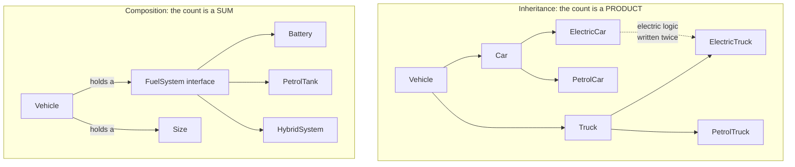

# Day 049 · System design — Composition over inheritance

**After today you can:** You can rewrite an inheritance tree as composition and say what improved.

**The interviewer asks it as:** *Refactor this class hierarchy. Why is your version better?*

---

## 1. What this is, and why they ask it

**Composition** means an object gets its behaviour by holding other objects and asking them, rather
than by inheriting it. A `Vehicle` does not *become* electric by extending `ElectricVehicle`; it
*holds* a `FuelSystem`, and that object happens to be an electric one. The relationship is has-a
rather than is-a, and the held object can be swapped at run time, tested on its own, and shared by
things that are otherwise unrelated.

They ask you to refactor because the slogan — "favour composition over inheritance" — is repeated
everywhere and demonstrated rarely. Anyone can say it. What separates candidates is being able to take
a concrete hierarchy, name the specific pain in it, produce the composed version, and then say what
improved in units that mean something: classes needed, files touched to add a variant, whether the
behaviour can be changed after construction. This is also the payoff day for the phase.
[Day 046](../day-046-binary-search-on-the-answer/README.md) told you the three ways inheritance goes
wrong; every one of them ended at the same fix, and this is it.

---

## 2. The story

Yashoda makes idli and dosa batter at home in Basavanagudi and supplies four small hotels, about
thirty kilos a day, and she has been doing it since her husband's factory closed in 2011.

The machine she works with is an ordinary mixie base — the motor unit, heavy, with the switch and the
three speeds. It has been on the same shelf for nine years.

On top of it she screws whichever jar the job needs. The big jar for grinding, the small chutney jar,
and a third dry jar she bought later for masala powders. Same base underneath all three. The same
grooves cut into the rim, the same click when it seats.

Two things happened that made her notice the arrangement rather than just use it.

The blade in the big jar went in the second year — she had been running it eight hours a day and it
gave up, which is fair. She took the jar to the shop on the main road, they had one, four hundred and
something rupees, and she was grinding again the same evening. The motor never left the shelf.

Then in the fourth year she started doing the masala powders, which is a different job entirely — dry,
and it needs a tighter, smaller jar. She did not buy a machine for it. She bought a jar.

Her neighbour, who started around the same time, bought one of the all-in-one machines. Good machine,
does everything, and the jar and the motor are one sealed unit. When her blade went, the service man
came, looked at it, and said the whole head has to be replaced, and the head is most of the price of
the machine. She waited eleven days for the part and lost eleven days of orders.

The thing Yashoda says about it, when the subject comes up, is that her machine is not better than her
neighbour's. It grinds no finer and it is not quieter. It is just that hers comes apart, and so when
one part of it fails, or when the work changes, only that part has to change.

---

## 3. The idea in plain English

The motor base is the object. The jars are the components it holds. And the neighbour's sealed unit is
the class hierarchy where a variant is welded into the type.

### The same thing, both ways

Take vehicles that vary by size and by fuel. With inheritance:

```python
class Vehicle: ...
class Car(Vehicle): ...
class Truck(Vehicle): ...

class ElectricCar(Car): ...
class PetrolCar(Car): ...
class ElectricTruck(Truck): ...
class PetrolTruck(Truck): ...
```

Two axes, so the class count is their product: 2 × 2 = 4, plus the two abstract parents. Add hybrids
and it is 6. Add "with trailer" and it is 12. And the electric refuelling logic is written twice —
once in `ElectricCar` and once in `ElectricTruck` — because there is nowhere shared to put it.

With composition:

```python
class FuelSystem(Protocol):
    def refuel(self, amount: float) -> None: ...
    def range_km(self) -> float: ...

class PetrolTank:
    def refuel(self, litres: float) -> None: ...
    def range_km(self) -> float: ...

class Battery:
    def refuel(self, kwh: float) -> None: ...
    def range_km(self) -> float: ...

class Vehicle:
    def __init__(self, size: Size, fuel: FuelSystem) -> None:
        self._size = size
        self._fuel = fuel                       # HOLDS one, rather than BEING one

    def range_km(self) -> float:
        return self._fuel.range_km()            # delegation: pass the question along
```

Now `2 sizes + 2 fuel systems = 4 classes`, and an electric truck is
`Vehicle(Size.TRUCK, Battery(...))` — an *object*, not a class. Adding hybrids is one new class, not
three. The electric logic exists once.

### The two words to have

**Delegation** is what `range_km` does: the object receives a request and passes it to the component
that knows the answer. It is one line, and it is the mechanical heart of composition.

**Injection** is what the constructor does: the component is handed in from outside rather than chosen
inside. That is the same rule as
[yesterday](../day-048-binary-search-on-floats/README.md)'s payment gateway, and for the same reason —
the moment `Vehicle.__init__` writes `self._fuel = Battery()`, every vehicle is electric and the
flexibility is gone.

### What you actually gain

Four things, and they are worth listing separately because each is a different kind of win.

**One: the class count stops being a product.** Sizes plus fuels plus trailers, instead of sizes times
fuels times trailers. §6 does the arithmetic.

**Two: behaviour can change after construction.** A subclass is fixed at the moment the object is
made — an `ElectricCar` is an `ElectricCar` forever. A held component can be replaced:

```python
vehicle.set_fuel(Battery(kwh=60))       # the same vehicle, converted
```

Whether you want that is a design decision. That you *can* is something inheritance simply cannot
offer.

**Three: the parts are testable and reusable on their own.** `Battery` can be tested with no
`Vehicle` anywhere, and the same `Battery` class can be held by a `Scooter`, a `Bus` and a
`ForkLift`, which sit in completely different parts of the hierarchy — or in no hierarchy at all.

**Four: the coupling is a stated interface, not the whole parent.** With inheritance the child depends
on everything the parent does, including *how* it does it — the fragile base class from
[day 046](../day-046-binary-search-on-the-answer/README.md). With composition the vehicle depends on
two method signatures and nothing else.

### The cost, stated plainly

Composition is not free, and pretending otherwise is how candidates lose credibility.

- **More wiring.** Someone must construct the parts and hand them over. Four objects instead of one
  `new ElectricCar()`.
- **Delegation boilerplate.** If a vehicle needs to expose eight methods of its fuel system, that is
  eight one-line forwarding methods. Inheritance gives them free.
- **An extra hop when reading.** `vehicle.range_km()` calls `self._fuel.range_km()`, so understanding
  one call means opening two files. Inheritance has the same problem in a different direction, but it
  is a real cost.

### When inheritance still wins

The slogan is "favour", not "always". Four cases, unchanged from
[day 046](../day-046-binary-search-on-the-answer/README.md):

- **Exception hierarchies.** `PaymentDeclined(PaymentError)` — no state, no implementation, pure
  substitutability.
- **Abstract base classes as contracts.** The parent has no implementation to be fragile about.
- **Documented framework extension points.** `logging.Handler`, Django's `ListView`.
- **A genuine single-axis specialisation** where nothing else will ever vary.

The practical rule: **inherit interfaces freely, compose implementations.**

### The middle ground: mixins

A **mixin** is a small class carrying one piece of behaviour, meant to be inherited alongside others:

```python
class TimestampMixin:
    def touch(self) -> None:
        self.updated_at = datetime.now(UTC)
```

It sits between the two. It is inheritance, so it has the fragile-base risk; but each mixin is small,
stateless and owns a distinct method, so the risk is small too. Mixins work when there are three of
them and each touches a different method. They stop working when two of them override the same method
and the resolution order decides which wins — at which point nobody reading the code can predict the
behaviour, and composition is the honest answer.

---

## 4. The picture

The mixie, and the object:

```
    ONE MOTOR BASE                          ONE Vehicle CLASS
          |                                        |
   +------+------+                          +------+------+
   |      |      |                          |      |      |
 big    chutney  dry                     PetrolTank  Battery  Hybrid
 jar     jar     jar                          |      |      |
   \      |      /                            \      |      /
    screw on whichever                     handed in at construction,
    the job needs                          swappable at run time

  blade breaks -> replace the JAR      Battery changes -> one file
  new kind of work -> buy a JAR        new fuel type   -> one new class
```

**What to notice:** the base is unchanged in every scenario. In the sealed-unit design — and in the
class hierarchy — a change to one part is a change to the whole thing.

The two designs, counted:



**What to notice:** in the top box, `ElectricCar` and `ElectricTruck` share behaviour with no shared
home for it, so it is duplicated. In the bottom box `Battery` exists once and anything can hold it —
including classes that are not vehicles at all.

---

## 5. How it actually works

### The refactoring, step by step

This is the recipe to run out loud when handed a hierarchy.

1. **Find the axes.** Write down what actually varies. If the class names read like
   `AdjectiveNoun` — `ElectricCar`, `PremiumSubscriber`, `UrgentEmailNotification` — the adjective is
   the second axis and it is the one to extract.
2. **Pick the axis that is not the identity.** A car is a car; being electric is something it *has*.
   Keep the identity as the class, extract the rest.
3. **Name the extracted thing as a capability, not as a variant.** `FuelSystem`, not `ElectricBits`.
   The name should describe what the component does for anyone who holds it.
4. **Declare the interface** — a Protocol, or an abstract base class. Two or three methods.
5. **Move each subclass's differing code into a component class**, unchanged.
6. **Give the base class a field and delegate to it**, and take the component in the constructor.
7. **Delete the subclasses.** This is the step people skip, and leaving them means both designs exist
   at once, which is worse than either.

### Real designs built this way

- **Python's `logging`.** A `Logger` holds `Handler`s; each `Handler` holds a `Formatter` and
  `Filter`s. None of that is inheritance between the pieces — it is objects holding objects, which is
  why you can put a `JSONFormatter` on a `FileHandler` and a plain one on a `StreamHandler` in the
  same program.
- **`sorted(items, key=...)`.** The comparison behaviour is handed in as a function. That is
  composition at the smallest possible scale, and it is why one `sorted` serves every ordering anyone
  will ever want, rather than there being a `SortedByName` class.
- **Django's `Storage`, and every payment SDK**, from
  [yesterday](../day-048-binary-search-on-floats/README.md). The client holds a backend.
- **Go has no inheritance at all.** It has struct embedding and interfaces, and the entire standard
  library is built by composing small interfaces — `io.Reader`, `io.Writer` — into bigger ones. It is
  the strongest existence proof that the slogan is practical rather than aspirational.
- **React's component model.** The team's own documentation says to prefer composition to inheritance
  for reusing UI behaviour, and the framework offers no inheritance mechanism for it.
- **The classic teaching example**, worth knowing by name: a `Duck` with a `FlyBehaviour` and a
  `QuackBehaviour` held as fields, rather than `FlyingDuck` and `RubberDuck` subclasses. It is from
  *Head First Design Patterns*, and interviewers of a certain vintage will recognise it.

### Delegation, and the boilerplate question

```python
class Vehicle:
    def __init__(self, fuel: FuelSystem) -> None:
        self._fuel = fuel

    def range_km(self) -> float:
        return self._fuel.range_km()

    def refuel(self, amount: float) -> None:
        self._fuel.refuel(amount)
```

Two forwarding methods. If there were twelve, the boilerplate would be a real argument against, and
there are three answers:

- **Do not forward at all** — expose the component: `vehicle.fuel.range_km()`. Simple, and it leaks
  the component into every caller, so a change of interface reaches everywhere.
- **Forward only what the outside actually needs.** Usually two or three of the twelve, and this is
  almost always the right answer.
- **`__getattr__` for automatic forwarding.** It works and it is a bad idea in most codebases: it
  forwards methods you did not intend, breaks autocompletion, and turns a typo into a confusing
  runtime error instead of an `AttributeError` at the right place.

### Testing, which is where it pays

```python
class FakeFuel:
    def range_km(self) -> float:
        return 0.0                          # simulate an empty tank

def test_vehicle_warns_when_range_is_zero():
    v = Vehicle(Size.CAR, FakeFuel())
    assert v.needs_refuel()
```

With the inheritance version, testing the empty-tank case means constructing a real `PetrolCar` and
manipulating its internals until the tank is empty — reaching past encapsulation to set up a test,
which is a smell in itself. With composition you hand in a component that answers however you like.
**A design where the parts are separately constructible is a design that is separately testable**, and
that is the practical reason experienced people prefer it.

---

## 6. The numbers

### The class count: product against sum

```
axes of variation                inheritance          composition
-----------------------------    ------------------   ------------------
3 sizes                          3                    3
3 sizes x 2 fuels                6                    3 + 2 = 5
3 x 2 x 2 (trailer)              12                   3 + 2 + 2 = 7
3 x 2 x 2 x 3 (ownership)        36                   3 + 2 + 2 + 3 = 10

adding a 3rd fuel type:          +6 classes           +1 class
adding a 5th axis with 2 values: x2 = 72 classes      +2 classes
```

**Thirty-six against ten**, and the growth rates are the real story: one multiplies, the other adds.
This single table is the most persuasive thing you can put in front of an interviewer on this subject.

### Edits to add a variant

```
inheritance, adding "hybrid":
    HybridCar          -> new file, duplicating some of ElectricCar
    HybridTruck        -> new file, duplicating the same thing again
    HybridBike         -> new file, a third copy
    any factory / registry that maps names to classes  -> edit
                                                        ----
                                                        3 new files (2 duplicated), 1 edit

composition, adding "hybrid":
    HybridSystem implementing FuelSystem   -> 1 new file
    the construction site                  -> 1 line
                                              ----
                                              1 new file, 1 line
```

### Duplication, counted

```
electric-specific logic in the inheritance version:
    ElectricCar.refuel      ~25 lines
    ElectricTruck.refuel    ~25 lines (near-identical)
    ElectricBike.refuel     ~25 lines (near-identical)
                            ---------
                            75 lines, 3 places to fix a bug

composition:                25 lines, 1 place
```

### Run-time cost of the extra hop

```
direct method call                       ~60 ns
delegated call (one extra hop)           ~120 ns
two levels of delegation                 ~180 ns

10,000 delegated calls in a request:     ~1.2 ms
one database round trip:                 ~1 ms
```

Comparable to a single query, at ten thousand calls. Real, and almost never the constraint — say the
number rather than dismissing the question.

---

## 7. The trade-offs

### Flexibility against wiring

Every component must be constructed and passed in, so object creation gets longer and something has to
know how to assemble the pieces. *I would not compose a class that has exactly one variant and always
will* — a `Ticket` does not need a `TicketNumberingStrategy`. The trigger is a second axis, or a
second implementation you can name.

### Composition against the readability of one class

An `ElectricCar` class tells you what it is from its name. A `Vehicle` holding a `Battery` tells you at
the construction site, which may be in a different file. *I would not scatter a design across six tiny
classes when two would do* — small classes are not automatically better, and a component with one
method and one implementation is usually a field pretending to be an object.

### Delegation boilerplate against exposing the component

Twelve forwarding methods is noise; `vehicle.fuel.range_km()` leaks the component's interface into
every caller, so changing `FuelSystem` reaches everywhere. *I would forward only the two or three
methods the outside genuinely needs, and expose the component itself only inside the same module.* And
I would not reach for `__getattr__` — automatic forwarding breaks tooling and hides mistakes.

### Composition against mixins

Mixins give you shared behaviour with no wiring at all, which is genuinely convenient. They are still
inheritance, so the fragile-base risk applies. *I would use a mixin only when it is small, stateless,
and owns a method no other mixin touches* — and the moment two mixins override the same method and the
resolution order decides the winner, I would convert to composition, because nobody reading the code
can predict which one runs.

### The honest sentence

> The point is not that inheritance is bad. It is that inheritance welds a variant into the type, and
> a type cannot be changed after the object is built or shared with something in a different part of
> the tree. Composition costs you some wiring and buys you parts that come apart — which is what you
> want on the day one of them fails, or the work changes.

---

## 8. In the interview

### How it gets asked

- *"Refactor this class hierarchy. Why is your version better?"* — the direct form, usually with a
  four-to-eight-class tree on screen.
- *"You have three vehicle types and two fuel types. Model it."* — the same question before the bad
  version exists, and the trap is to draw six classes.
- *"Why not just subclass it?"* — the pushback in a design round, when you have proposed a component.
- *"When would you still use inheritance?"* — the balance check, and answering "never" fails it.

### What to say out loud, in the first ninety seconds

1. **Name the axes before touching anything.** *"Looking at these class names — `ElectricCar`,
   `PetrolCar`, `ElectricTruck` — there are two axes here: what the vehicle is, and how it's powered.
   Inheritance only has one axis, which is why the count is a product."*
2. **Say which axis is the identity.** *"A car is a car. Being electric is something it has, not
   something it is. So `Car` stays a class and the fuel becomes a component."*
3. **Name the component as a capability.** *"I'd call it `FuelSystem`, with `refuel` and `range_km` —
   named for what it does for whoever holds it, not for which variant it is."*
4. **Give the count.** *"That takes six classes to four — three sizes plus two fuel systems instead of
   three times two. And adding hybrids is one class instead of three."*
5. **Name the duplication you removed.** *"Right now the electric refuelling logic is written in
   `ElectricCar` and again in `ElectricTruck`, because there's nowhere shared to put it. After this
   it exists once."*
6. **Concede the cost.** *"What I've added is wiring — something has to construct the fuel system and
   hand it in — and one delegating method. That's the trade."*

### The follow-ups

**"Give me the concrete win, not the principle."**
Four wins, and I would give them as separate things because they are different kinds of benefit.
First, the class count stops multiplying: three sizes and two fuel types is five classes composed
against six inherited, and by the time there are four axes it is ten against thirty-six — one grows by
addition, the other by multiplication. Second, the duplication goes: right now the electric refuelling
logic sits in `ElectricCar` and again in `ElectricTruck`, roughly twenty-five lines each, because
those two classes are in different branches and there is no shared home for it — so a bug there is
fixed in two places or one. Third, behaviour becomes changeable after construction. An `ElectricCar`
is an `ElectricCar` for the life of the object; a `Vehicle` holding a `Battery` can be handed a
different fuel system, which matters for a fleet system that models conversions and for tests.
Fourth, and the one I care most about in practice, the parts become separately testable: to test the
empty-tank path with inheritance I have to build a real `PetrolCar` and reach into its internals to
drain it, which means breaking encapsulation to set up a test. With composition I hand in a fake fuel
system that reports zero range, in two lines.

**"When would you still use inheritance?"**
Four cases, and they share one property. Exception hierarchies — `PaymentDeclined` extending
`PaymentError` — because the parents carry no state and no implementation, so there is nothing for a
child to depend on the internals of, and catching the family is exactly what substitutability is for.
Abstract base classes used as contracts, for the same reason: the parent is signatures only. Framework
extension points that were designed to be subclassed and document which method to override, like
`logging.Handler` and its `emit`. And a genuine single-axis specialisation where nothing else will
ever vary — a `SavingsAccount` that differs from `Account` only in interest calculation. The property
those four share is that **the parent has little or no implementation**, which is where the
fragile-base problem lives. So the rule I actually use is: inherit interfaces freely, compose
implementations, and never inherit purely to avoid retyping code — that is the case where the coupling
buys nothing.

**"Isn't composition just more code and more indirection?"**
Yes to both, and I would rather concede it than argue. There is more wiring, because someone has to
construct the parts and hand them over — four objects where there was one constructor call. There is
delegation boilerplate, one forwarding line per method the outside needs. And there is an extra hop
when reading: `vehicle.range_km()` calls `self._fuel.range_km()`, so understanding one call means
opening two files. What I would say back is that inheritance has the same reading cost in a different
direction — understanding a method on a class four levels deep also means opening four files, and
worse, you cannot tell from the call site which level it came from. And I would keep the boilerplate
small deliberately: forward only the two or three methods that actually cross the boundary, rather
than mirroring the component's whole interface, and definitely not with `__getattr__`, which forwards
things you did not intend and breaks tooling. The trade is a few lines of wiring now against a class
count that multiplies later, and I would take that, while agreeing it is a trade rather than a free
win.

### A model answer

> "Let me name what varies before I touch the code, because that's what decides the shape.
>
> These class names are `ElectricCar`, `PetrolCar`, `ElectricTruck`, `PetrolTruck` — an adjective and
> a noun. That means two axes: what the vehicle is, and how it's powered. Inheritance has one axis, so
> the class count is the product of the two, and it's already six with the parents. Add hybrids and
> it's nine. Add trailers and it's eighteen.
>
> There's a second symptom already visible: the electric refuelling logic is written in `ElectricCar`
> and again in `ElectricTruck`, because those two are in different branches and there's no shared
> place to put it. About twenty-five lines, duplicated, so a bug there gets fixed once or twice
> depending on who's looking.
>
> So: which axis is the identity? A car is a car. Being electric is something it *has*. So the size
> stays as the class, or even just as a field, and the fuel becomes a component:
>
> ```python
> class FuelSystem(Protocol):
>     def refuel(self, amount: float) -> None: ...
>     def range_km(self) -> float: ...
>
> class Vehicle:
>     def __init__(self, size: Size, fuel: FuelSystem) -> None:
>         self._size, self._fuel = size, fuel
>
>     def range_km(self) -> float:
>         return self._fuel.range_km()
> ```
>
> I've named it `FuelSystem` rather than `ElectricBits` deliberately — it's a capability, described by
> what it does for whoever holds it.
>
> Now an electric truck is `Vehicle(Size.TRUCK, Battery(...))` — an object, not a class. The count goes
> from six classes to four, and by the fourth axis it's ten instead of thirty-six. Adding hybrids is
> one new class and one line where vehicles are constructed, instead of three new classes duplicating
> each other.
>
> Two more things I get. The fuel system can be swapped after construction, which a subclass can never
> be. And I can test the empty-tank path by handing in a fake that reports zero range, instead of
> building a real `PetrolCar` and reaching into its internals to drain it.
>
> The cost, honestly: more wiring at construction, one delegating method per thing the outside needs,
> and an extra hop when reading the code. I'd forward only the two or three methods that actually
> cross the boundary rather than mirroring the whole interface.
>
> And I'd still use inheritance in four places — exception hierarchies, abstract base classes as
> contracts, documented framework hooks, and a genuine single-axis specialisation. What those share is
> that the parent has almost no implementation, which is where the fragile-base problem lives. Inherit
> interfaces freely; compose implementations."

---

## 9. Recall card

- **Inheritance welds a variant into the type; composition holds it.** `Vehicle(Size.TRUCK,
  Battery())` is an *object*, not a class — and it can be swapped after construction, which a subclass
  never can.
- **The count is the argument:** inheritance multiplies the axes (3 × 2 × 2 × 3 = **36**), composition
  adds them (3 + 2 + 2 + 3 = **10**). A new fuel type is +6 classes against +1.
- **The refactor, in order:** find the axes (adjective-noun class names are the tell) → keep the
  identity as the class → name the rest as a *capability* (`FuelSystem`, not `ElectricBits`) → declare
  the interface → move each subclass's code into a component → delegate → **delete the subclasses**.
- **The practical payoff is testing:** hand in a `FakeFuel` returning zero range, instead of building a
  real object and reaching past encapsulation to set up the case. Separately constructible means
  separately testable.
- **Concede the cost** (wiring, one forwarding line per exposed method, an extra hop) and **keep
  inheritance for exception trees, ABCs as contracts, documented framework hooks, and true single-axis
  specialisation** — all cases where the parent has almost no implementation. *Inherit interfaces,
  compose implementations.*
