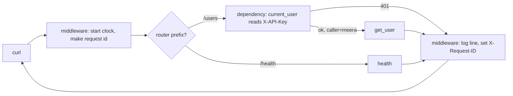

# Day 049 · Python — Routers, path parameters, dependencies, and middleware in FastAPI

**Today's theme:** Routing and middleware

**After today you can:** You can add authentication and logging to every route without repeating code, in each language.

**The interviewer asks it as:** *How would you add request logging to every endpoint?*

---

## 1. What this is, and why it matters

Yesterday's server had two routes and everything in one file. Today's has the three things that
let it grow: an `APIRouter`, which groups routes under a shared prefix so they can live in their
own module; `Depends`, which runs a function before your route and hands its result in as an
argument, so "who is calling" is computed once and used everywhere; and middleware, one function
that wraps every request and response, so logging happens in one place and not in forty.

At work, every service of any size is built from these three. The logging middleware is usually
the first thing you write and the thing you read most at three in the morning. In interviews,
"how would you add request logging to every endpoint" is asked to see whether you say "in each
handler" or "in one place that wraps them all", and then whether you know what to log and where
the request id comes from.

## 2. The story

Kamal sits in the booth at the gate of a housing society with two wings, A and B, eight floors
each. Every person who comes in, whether they are going to A-402 or B-101, walks past him. There
is no second way in.

He keeps a register. When someone arrives he writes the time, their name, and the flat they are
going to. Then he phones the flat. If the flat says yes, he lets them through and gives them a
visitor slip with the flat number and the time on it. When they leave, he finds their line in the
register and writes the time out. A line is not finished until it has both times.

The flats never do any of this. Mrs Rao in A-402 does not ask a visitor for their name or check
the time. By the time anyone knocks on her door, Kamal has already done that, and she can simply
open it. If she wants to know who is standing there, she reads the slip.

Some people do not get through. A man arrives with no slip from the office and no name on the
approved list, and Kamal sends him back. Mrs Rao never hears about it. The register has a line
for him, with the time and the words "turned back", and that is all.

Within each wing the numbering starts again. A-402 and B-402 are different flats, and the wing
letter is the first thing Kamal asks for, because it decides which lift the visitor takes. The
society's office is in neither wing; it is a room next to the gate, and people going there still
pass Kamal, but he does not phone anyone.

Once a month the society committee asks Kamal for the register, and reads it looking for one
thing: people who came in and have no time out. He is very careful about that column.

## 3. The idea in plain English

Kamal's booth is **middleware**: a function that runs for every request, before and after the
route. `@app.middleware("http")` marks it. It receives the request and a `call_next` function; it
does its "before" work, calls `call_next(request)` to run the route, gets the response back, does
its "after" work, and returns the response. Writing time in and time out is logging the method,
path, status, and how long it took. The visitor slip is a **request id**: a short random string
made at the gate, put on the response as a header, and printed in the log line so a caller's
complaint can be matched to a line.

The wings are **routers**. `APIRouter(prefix="/users")` is a small app of its own; routes are
decorated on it with paths relative to the prefix, and `app.include_router(router)` mounts it.
Two routers can have `/{id}` routes without colliding, because the prefix comes first.

The phone call to the flat is a **dependency**: a function that FastAPI runs before your route and
whose return value it passes in. `caller: str = Depends(current_user)` means "run `current_user`,
give me its result as `caller`". If the dependency raises `HTTPException`, the route never runs;
that is Kamal sending someone back. A dependency listed on the router, `dependencies=[Depends(current_user)]`,
runs for every route in that router without any of them naming it.

Reading a header in a dependency is `Header()`. The parameter name `x_api_key` becomes the header
name `X-API-Key`; FastAPI swaps underscores for hyphens and ignores case.

The order is the order at the gate: middleware first, then the router prefix picks the wing,
then the dependencies run, then the route. On the way out, only the middleware sees the
response.

## 4. The picture



Notice that `/health` skips the dependency: it is not on the router. And notice the 401 arrow
goes straight back to the middleware, so the log line is still written for a turned-back
request.

## 5. The code, built step by step

Start from yesterday's `main.py` and the same `pip install fastapi uvicorn`.

The middleware, the gate.

```python
@app.middleware("http")
async def log_requests(request: Request, call_next):
    request_id = uuid.uuid4().hex[:8]
    start = time.perf_counter()
    response = await call_next(request)
    ms = (time.perf_counter() - start) * 1000
    print(f"{request_id} {request.method} {request.url.path} -> {response.status_code} {ms:.1f}ms", flush=True)
    response.headers["X-Request-ID"] = request_id
    return response
```

It is `async def` because `call_next` must be awaited; you met `await` on
[day 45](../day-045-rotated-array-search/README.md). Everything above `await call_next` is time
in; everything below is time out. `uuid.uuid4().hex[:8]` is eight random hex characters, enough to
find a line. The last line matters: forget `return response` and every request is a 500.

The dependency, the phone call.

```python
API_KEYS = {"secret-123": "meera"}


def current_user(x_api_key: str | None = Header(default=None)) -> str:
    if x_api_key not in API_KEYS:
        raise HTTPException(status_code=401, detail="bad api key")
    return API_KEYS[x_api_key]
```

A plain function. `Header(default=None)` reads `X-API-Key` and gives `None` if it is absent, so a
missing key and a wrong key both end in the same 401. The return value is the caller's name.
Real keys live in a database and are hashed, which is [day 57](../day-057-stability-and-pythons-sort/README.md);
today the dict stands in.

The router, the wing.

```python
router = APIRouter(prefix="/users", dependencies=[Depends(current_user)])


@router.get("/{user_id}", response_model=User)
def get_user(user_id: int) -> User:
    if user_id not in users:
        raise HTTPException(status_code=404, detail="no such user")
    return users[user_id]
```

`prefix="/users"` means this route's full path is `/users/{user_id}`. The `dependencies=` list
runs `current_user` for every route on this router; `get_user` never mentions it, and still
cannot be reached without a valid key.

A route that wants the dependency's value, not just its check.

```python
@router.get("/{user_id}/greeting")
def greeting(user_id: int, caller: str = Depends(current_user)) -> dict[str, str]:
    if user_id not in users:
        raise HTTPException(status_code=404, detail="no such user")
    return {"message": f"hello {users[user_id].name}, from {caller}"}
```

Here `Depends(current_user)` is a parameter, so its return value arrives as `caller`. FastAPI
runs the dependency once per request even though it is listed on the router and on the route,
and reuses the result.

Mounting, and a route outside the wing.

```python
@app.get("/health")
def health() -> dict[str, bool]:
    return {"ok": True}


app.include_router(router)
```

`/health` is on `app`, not on `router`, so it has no key check. Anyone can ask whether the server
is up, which is what a load balancer needs.

Run it:

```bash
python -m uvicorn main:app --port 8000
```

In a second terminal:

```bash
curl -i http://127.0.0.1:8000/health
curl -i http://127.0.0.1:8000/users/1
curl -i -H "X-API-Key: secret-123" http://127.0.0.1:8000/users/1
curl -H "X-API-Key: secret-123" http://127.0.0.1:8000/users/1/greeting
```

```text
HTTP/1.1 200 OK
x-request-id: bb3092f4
{"ok":true}

HTTP/1.1 401 Unauthorized
{"detail":"bad api key"}

HTTP/1.1 200 OK
{"id":1,"name":"Meera","city":"Pune"}

{"message":"hello Meera, from meera"}
```

And the server's terminal, one line per request, turned-back ones included:

```text
bb3092f4 GET /health -> 200 4.6ms
32d38198 GET /users/1 -> 401 0.9ms
a9b2c513 GET /users/1 -> 200 0.7ms
74dc0630 GET /users/1/greeting -> 200 1.0ms
```

The first request is slower because it is the first; the rest are under a millisecond.

Here is the whole program in one piece, `main.py`:

```python
import time
import uuid

from fastapi import APIRouter, Depends, FastAPI, Header, HTTPException, Request
from pydantic import BaseModel

app = FastAPI()

API_KEYS = {"secret-123": "meera"}


class User(BaseModel):
    id: int
    name: str
    city: str


users: dict[int, User] = {1: User(id=1, name="Meera", city="Pune")}


@app.middleware("http")
async def log_requests(request: Request, call_next):
    request_id = uuid.uuid4().hex[:8]
    start = time.perf_counter()
    response = await call_next(request)
    ms = (time.perf_counter() - start) * 1000
    print(f"{request_id} {request.method} {request.url.path} -> {response.status_code} {ms:.1f}ms", flush=True)
    response.headers["X-Request-ID"] = request_id
    return response


def current_user(x_api_key: str | None = Header(default=None)) -> str:
    if x_api_key not in API_KEYS:
        raise HTTPException(status_code=401, detail="bad api key")
    return API_KEYS[x_api_key]


router = APIRouter(prefix="/users", dependencies=[Depends(current_user)])


@router.get("/{user_id}", response_model=User)
def get_user(user_id: int) -> User:
    if user_id not in users:
        raise HTTPException(status_code=404, detail="no such user")
    return users[user_id]


@router.get("/{user_id}/greeting")
def greeting(user_id: int, caller: str = Depends(current_user)) -> dict[str, str]:
    if user_id not in users:
        raise HTTPException(status_code=404, detail="no such user")
    return {"message": f"hello {users[user_id].name}, from {caller}"}


@app.get("/health")
def health() -> dict[str, bool]:
    return {"ok": True}


app.include_router(router)
```

## 6. How the other two languages do it

**Go**

```go
func logging(next http.Handler) http.Handler {
	return http.HandlerFunc(func(w http.ResponseWriter, r *http.Request) {
		start := time.Now()
		rec := &statusRecorder{ResponseWriter: w, status: 200}
		next.ServeHTTP(rec, r)
		log.Printf("%s %s -> %d %s", r.Method, r.URL.Path, rec.status, time.Since(start))
	})
}
mux.HandleFunc("GET /users/{id}", getUser)
http.ListenAndServe(":8000", logging(auth(mux)))
```

Middleware is a function that takes a handler and returns a handler, and the chain is written by
nesting calls. The status is not visible to the wrapper unless you wrap the writer too.

**C++**

```cpp
svr.set_pre_routing_handler([](const auto& req, auto& res) {
    if (req.path.rfind("/users", 0) == 0 && req.get_header_value("X-API-Key") != "secret-123") {
        res.status = 401; return httplib::Server::HandlerResponse::Handled;
    }
    return httplib::Server::HandlerResponse::Unhandled;
});
svr.set_logger([](const auto& req, const auto& res) { std::cout << req.method << " " << req.path << " -> " << res.status << "\n"; });
```

Two hooks on the server, one before routing and one after the response, rather than one function
that wraps.

**The difference that matters:** FastAPI's middleware sees the response as an object it can
change, so adding the `X-Request-ID` header on the way out is one line. Go's middleware sees only
a writer that has already been written to, so reading the status back means wrapping the writer;
cpp-httplib's logger sees the finished response but cannot change it. The one-function
"before, call next, after" shape is the same in all three; what you can do on the "after" side is
not.

## 7. The traps

**The near-miss: `Header()` with no default.**

```python
def current_user(x_api_key: str = Header()) -> str:
```

A wrong key is a 401. A missing key is not:

```text
HTTP/1.1 422 Unprocessable Entity
{"detail":[{"type":"missing","loc":["header","x-api-key"],"msg":"Field required","input":null}]}
```

The validation ran before the dependency body and reported a missing field, which is true and
unhelpful: a caller with no key should get the same "unauthorised" as a caller with a bad one,
and should not be told the header name by the validator. `Header(default=None)` and one `if`.

**Middleware that does not return the response.**

```python
@app.middleware("http")
async def log_requests(request: Request, call_next):
    response = await call_next(request)
    print(request.method, request.url.path, response.status_code)
```

Every request, including ones the route answered correctly, becomes a 500, and the terminal
ends with:

```text
TypeError: 'NoneType' object is not callable
```

The framework tried to send `None` as the response. The log line printed fine, which makes this
one confusing for about a minute.

**Dependency on the route and forgotten on the router.** Add a new route to the `users` router
and it is protected, because the router carries the dependency. Add it to `app` instead, with the
same `/users/...` path, and it is open. The prefix is the router's; a route on `app` with that
path is just a route.

**A dependency that does work.** `current_user` today is a dict lookup. When it becomes a
database query, it runs on every request to every protected route. That is correct, and it is
also the first thing to cache; FastAPI runs a dependency once per request even if five things
depend on it, but not across requests.

**Route order inside a router.** `@router.get("/{user_id}")` before `@router.get("/me")` means
`/users/me` is matched by the first one and tries to convert `me` to an int, a 422. Fixed paths go
before parameterised ones.

## 8. Say it out loud

**How it gets asked**

- How would you add request logging to every endpoint?
- Where does authentication live in your service?
- What is a request id, and where does it come from?
- What is the difference between middleware and a dependency?

**The ninety-second script**

Logging goes in middleware, one function that wraps every request. It runs before the route, so I
make a request id there, a short random string, and start a clock. It calls the next thing in the
chain, which is the router, and gets the response object back. Then I write one line: the request
id, method, path, status, and elapsed milliseconds, and I put the request id on the response as a
header so a caller can quote it back to me. Authentication is a dependency, not middleware,
because it is per-route: a function that reads the API key header and returns the caller, or
raises a 401 before the route runs. I attach it to the router that holds the protected routes, so
every route in that group gets it without naming it, and the health check on the app itself does
not. The order is middleware, router prefix, dependencies, route; the middleware is the only thing
that sees the response on the way out.

**The follow-ups**

- **What do you log, and what do you never log?** *Method, path, status, duration, request id,
  and the caller's id if known. Never the API key, never a password, never a full request body,
  which may contain either. [Day 52](../day-052-quadratic-sorts/README.md)
  is the whole answer.*
- **Where does the request id come from in a real system?** *If the caller or the load balancer
  sent one in `X-Request-ID`, I reuse it, so one id follows the request through every service.
  Only if it is absent do I make one.*
- **Middleware versus a dependency: when each?** *Middleware for things every request gets and
  that need the response: logging, request ids, timing, CORS headers. Dependencies for things a
  route needs as a value: the current user, a database session, a parsed setting. A dependency can
  be on some routers and not others; middleware is all or nothing.*

**A model answer**

"One `@app.middleware("http")` function: make a request id, start a clock, `await call_next`,
then log id, method, path, status and duration, and set `X-Request-ID` on the response. Auth is a
`Depends` function on the users router, so every route under `/users` gets it and `/health` does
not. Turned-back requests still get a log line, because the middleware wraps the dependency too.
The header is read with `Header(default=None)` so a missing key is a 401 and not a 422."

## 9. Recall card

- `@app.middleware("http")`: `async def f(request, call_next)`; before, `response = await call_next(request)`, after, `return response`. Forget the return and everything is a 500.
- `APIRouter(prefix="/users", dependencies=[Depends(current_user)])` protects every route on it; `app.include_router(router)` mounts it.
- `caller: str = Depends(current_user)` runs the function first and passes its return; `HTTPException` in it stops the route.
- `Header(default=None)` reads `X-API-Key` from `x_api_key`; without a default a missing header is a 422, not a 401.
- Order: middleware, prefix, dependencies, route. Only middleware sees the response on the way out.
