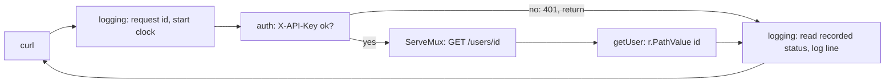

# Day 049 · Go — Method and path patterns in ServeMux, and a middleware chain

**Today's theme:** Routing and middleware

**After today you can:** You can add authentication and logging to every route without repeating code, in each language.

**The interviewer asks it as:** *How would you add request logging to every endpoint?*

---

## 1. What this is, and why it matters

Since Go 1.22 the standard `ServeMux` understands patterns like `"GET /users/{id}"`: the method
is part of the route, and `{id}` is a path parameter you read with `r.PathValue("id")`. That
removes the method check and the `strings.TrimPrefix` from yesterday's handlers. Middleware in Go
is not a feature at all; it is a function that takes an `http.Handler` and returns a new one that
does something and then calls the original. A chain is nested calls.

At work, this is how every Go service is structured, whether it uses the standard mux or a
third-party router; the routers differ in pattern syntax and the middleware shape is identical
everywhere, because it is just the `http.Handler` interface from
[day 16](../day-016-2d-arrays/README.md). In interviews, "how would you add request logging to
every endpoint" in Go is a test of whether you know that shape, and then whether you know the
catch: the wrapper cannot see the status code unless it wraps the writer too.

## 2. The story

Kamal sits in the booth at the gate of a housing society with two wings, A and B, eight floors
each. Every person who comes in, whether they are going to A-402 or B-101, walks past him. There
is no second way in.

He keeps a register. When someone arrives he writes the time, their name, and the flat they are
going to. Then he phones the flat. If the flat says yes, he lets them through and gives them a
visitor slip with the flat number and the time on it. When they leave, he finds their line in the
register and writes the time out. A line is not finished until it has both times.

The flats never do any of this. Mrs Rao in A-402 does not ask a visitor for their name or check
the time. By the time anyone knocks on her door, Kamal has already done that, and she can simply
open it. If she wants to know who is standing there, she reads the slip.

Some people do not get through. A man arrives with no slip from the office and no name on the
approved list, and Kamal sends him back. Mrs Rao never hears about it. The register has a line
for him, with the time and the words "turned back", and that is all.

There is one thing Kamal cannot see from the booth: how the visit went. Whether Mrs Rao was
pleased or slammed the door is not something the gate knows. So the society added a small habit.
Every visitor, on the way out, hands back the slip, and the flat has ticked one of three boxes on
it. Kamal copies the tick into the register. Without the slip coming back, his register would say
who came and when, and nothing about what happened.

Once a month the society committee asks Kamal for the register, and reads it looking for one
thing: people who came in and have no time out. He is very careful about that column.

## 3. The idea in plain English

Kamal's booth is **middleware**: a function with the signature
`func(next http.Handler) http.Handler`. It returns a handler that does its "before" work, calls
`next.ServeHTTP(w, r)` to run whatever is inside, and does its "after" work. `http.HandlerFunc`
turns an ordinary function into an `http.Handler`, which is what makes the return type work.

The **chain** is `logging(auth(mux))`. Read it inside out: the mux is wrapped by auth, which is
wrapped by logging, so a request meets logging first, then auth, then the mux. Kamal is the
outermost wrapper. Nothing about `ServeMux` knows the chain exists; the chain is just the handler
you give to `ListenAndServe`.

The wing letter and the flat number are the **pattern**: `"GET /users/{id}"`. The mux matches the
method and the path shape, and `r.PathValue("id")` gives you the segment as a string. A `GET`
pattern that does not match a `POST` to the same path gives the caller `405 Method Not Allowed`
automatically, which yesterday's code did by hand.

The slip coming back is the **status recorder**. `http.ResponseWriter` is write-only: after the
handler calls `WriteHeader(404)` there is no method to ask what it wrote. To log the status, the
middleware hands the handler a small struct that embeds the real writer and remembers the status
as it goes past. Embedding is [day 46](../day-046-binary-search-on-the-answer/README.md)'s
"Go has no inheritance" answer put to work: the struct satisfies `http.ResponseWriter` because
the embedded field does, and overrides only `WriteHeader`.

The approved list is the **auth middleware**: it reads the `X-API-Key` header, and either writes a
401 and returns without calling `next`, or calls `next`. The route never sees a turned-back
request. The **request id** is made in the logging middleware and put on the response header
before `next` runs, because headers must be set before the first write.

## 4. The picture



Notice that `auth` sits between `logging` and the mux, so a 401 is still logged. Swap the order
and turned-back requests vanish from the register.

## 5. The code, built step by step

Start from yesterday's `main.go`. First, the pattern routes.

```go
mux := http.NewServeMux()
mux.HandleFunc("GET /health", health)
mux.HandleFunc("GET /users/{id}", getUser)
mux.HandleFunc("POST /users", createUser)
```

Method, a space, then the path. `{id}` matches one segment. The mux now rejects a `DELETE
/users/1` with a 405 on its own, so the method checks in the handlers go.

The handler, shorter than yesterday.

```go
func getUser(w http.ResponseWriter, r *http.Request) {
	id, err := strconv.Atoi(r.PathValue("id"))
	if err != nil {
		writeJSON(w, http.StatusBadRequest, map[string]string{"error": "id must be a number"})
		return
	}
	user, ok := users[id]
	if !ok {
		writeJSON(w, http.StatusNotFound, map[string]string{"error": "no such user"})
		return
	}
	writeJSON(w, http.StatusOK, user)
}
```

`r.PathValue("id")` replaces the `TrimPrefix`. It is a string, so `Atoi` is still yours.

The status recorder, the slip that comes back.

```go
type statusRecorder struct {
	http.ResponseWriter
	status int
}

func (rec *statusRecorder) WriteHeader(code int) {
	rec.status = code
	rec.ResponseWriter.WriteHeader(code)
}
```

The embedded `http.ResponseWriter` supplies `Header` and `Write`; this struct adds a field and
overrides one method to note the code before passing it on. A handler that never calls
`WriteHeader` sends a 200, so the recorder starts at 200.

The logging middleware, the booth.

```go
func logging(next http.Handler) http.Handler {
	return http.HandlerFunc(func(w http.ResponseWriter, r *http.Request) {
		requestID := fmt.Sprintf("%08x", rand.Uint32())
		w.Header().Set("X-Request-ID", requestID)
		rec := &statusRecorder{ResponseWriter: w, status: http.StatusOK}
		start := time.Now()
		next.ServeHTTP(rec, r)
		log.Printf("%s %s %s -> %d %s", requestID, r.Method, r.URL.Path, rec.status, time.Since(start))
	})
}
```

Before: make an id, set the header, wrap the writer, start the clock. `next.ServeHTTP(rec, r)`
runs everything inside with the recorder in place of the writer. After: one log line. The header
is set before `next` because after the first write it is too late. `rand.Uint32` is from
`math/rand/v2`, which needs no seeding; this id is for finding log lines, not for security.

The auth middleware, the approved list.

```go
var apiKeys = map[string]string{"secret-123": "meera"}

func auth(next http.Handler) http.Handler {
	return http.HandlerFunc(func(w http.ResponseWriter, r *http.Request) {
		if r.URL.Path == "/health" {
			next.ServeHTTP(w, r)
			return
		}
		if _, ok := apiKeys[r.Header.Get("X-API-Key")]; !ok {
			writeJSON(w, http.StatusUnauthorized, map[string]string{"error": "bad api key"})
			return
		}
		next.ServeHTTP(w, r)
	})
}
```

`/health` is let through by path, the way the society office is next to the gate. Anything else
without a known key gets a 401 and `next` is never called. `r.Header.Get` is case-insensitive.

The chain.

```go
log.Fatal(http.ListenAndServe("127.0.0.1:8000", logging(auth(mux))))
```

Run it:

```bash
go run main.go
```

In a second terminal:

```bash
curl -i http://127.0.0.1:8000/health
curl -i http://127.0.0.1:8000/users/1
curl -i -H "X-API-Key: secret-123" http://127.0.0.1:8000/users/1
curl -i -X DELETE -H "X-API-Key: secret-123" http://127.0.0.1:8000/users/1
```

```text
HTTP/1.1 200 OK
X-Request-Id: 3f9a1c2e
{"ok":true}

HTTP/1.1 401 Unauthorized
{"error":"bad api key"}

HTTP/1.1 200 OK
{"id":1,"name":"Meera","city":"Pune"}

HTTP/1.1 405 Method Not Allowed
```

The 405 came from the mux, with no handler of yours involved. And the server's terminal:

```text
2026/09/16 11:02:15 3f9a1c2e GET /health -> 200 61.3µs
2026/09/16 11:02:16 a7d04b91 GET /users/1 -> 401 38.9µs
2026/09/16 11:02:17 5c218e0f GET /users/1 -> 200 92.4µs
2026/09/16 11:02:18 e14b7d33 DELETE /users/1 -> 405 27.1µs
```

Four requests, four lines, including the two the routes never saw.

Here is the whole program in one piece, `main.go`:

```go
package main

import (
	"encoding/json"
	"fmt"
	"log"
	"math/rand/v2"
	"net/http"
	"strconv"
	"time"
)

type User struct {
	ID   int    `json:"id"`
	Name string `json:"name"`
	City string `json:"city"`
}

var users = map[int]User{1: {ID: 1, Name: "Meera", City: "Pune"}}
var apiKeys = map[string]string{"secret-123": "meera"}

func writeJSON(w http.ResponseWriter, status int, value any) {
	w.Header().Set("Content-Type", "application/json")
	w.WriteHeader(status)
	if err := json.NewEncoder(w).Encode(value); err != nil {
		log.Println("encode:", err)
	}
}

func health(w http.ResponseWriter, r *http.Request) {
	writeJSON(w, http.StatusOK, map[string]bool{"ok": true})
}

func getUser(w http.ResponseWriter, r *http.Request) {
	id, err := strconv.Atoi(r.PathValue("id"))
	if err != nil {
		writeJSON(w, http.StatusBadRequest, map[string]string{"error": "id must be a number"})
		return
	}
	user, ok := users[id]
	if !ok {
		writeJSON(w, http.StatusNotFound, map[string]string{"error": "no such user"})
		return
	}
	writeJSON(w, http.StatusOK, user)
}

func createUser(w http.ResponseWriter, r *http.Request) {
	var body User
	if err := json.NewDecoder(r.Body).Decode(&body); err != nil {
		writeJSON(w, http.StatusBadRequest, map[string]string{"error": "body is not JSON"})
		return
	}
	if body.Name == "" || body.City == "" {
		writeJSON(w, http.StatusBadRequest, map[string]string{"error": "name and city are required"})
		return
	}
	body.ID = len(users) + 1
	users[body.ID] = body
	writeJSON(w, http.StatusCreated, body)
}

type statusRecorder struct {
	http.ResponseWriter
	status int
}

func (rec *statusRecorder) WriteHeader(code int) {
	rec.status = code
	rec.ResponseWriter.WriteHeader(code)
}

func logging(next http.Handler) http.Handler {
	return http.HandlerFunc(func(w http.ResponseWriter, r *http.Request) {
		requestID := fmt.Sprintf("%08x", rand.Uint32())
		w.Header().Set("X-Request-ID", requestID)
		rec := &statusRecorder{ResponseWriter: w, status: http.StatusOK}
		start := time.Now()
		next.ServeHTTP(rec, r)
		log.Printf("%s %s %s -> %d %s", requestID, r.Method, r.URL.Path, rec.status, time.Since(start))
	})
}

func auth(next http.Handler) http.Handler {
	return http.HandlerFunc(func(w http.ResponseWriter, r *http.Request) {
		if r.URL.Path == "/health" {
			next.ServeHTTP(w, r)
			return
		}
		if _, ok := apiKeys[r.Header.Get("X-API-Key")]; !ok {
			writeJSON(w, http.StatusUnauthorized, map[string]string{"error": "bad api key"})
			return
		}
		next.ServeHTTP(w, r)
	})
}

func main() {
	mux := http.NewServeMux()
	mux.HandleFunc("GET /health", health)
	mux.HandleFunc("GET /users/{id}", getUser)
	mux.HandleFunc("POST /users", createUser)
	log.Println("listening on 127.0.0.1:8000")
	log.Fatal(http.ListenAndServe("127.0.0.1:8000", logging(auth(mux))))
}
```

The `users` map is still unlocked, as on day 48; the practice sheet's mutex still applies.

## 6. How the other two languages do it

**Python**

```python
@app.middleware("http")
async def log_requests(request: Request, call_next):
    response = await call_next(request)
    response.headers["X-Request-ID"] = request_id
    return response

router = APIRouter(prefix="/users", dependencies=[Depends(current_user)])
```

The middleware gets the response back as an object and can read its status and add headers
after the route ran. Auth is a dependency on a router, not a wrapper, so it applies to a group of
routes by construction rather than by a path check.

**C++**

```cpp
svr.set_pre_routing_handler([](const httplib::Request& req, httplib::Response& res) {
    if (req.path.rfind("/users", 0) == 0 && !allowed(req.get_header_value("X-API-Key"))) {
        res.status = 401;
        return httplib::Server::HandlerResponse::Handled;
    }
    return httplib::Server::HandlerResponse::Unhandled;
});
svr.set_logger([](const httplib::Request& req, const httplib::Response& res) { /* one line */ });
```

Two hooks on the server object, one before routing that can short-circuit and one after the
response that can only observe.

**The difference that matters:** Go is the only one where the "after" side of the middleware
cannot see the status without work. Python hands it a response object, and cpp-httplib's logger
gets the finished `Response`. In Go the writer is write-only, so every logging middleware you
will ever read starts with a `statusRecorder` struct that embeds `http.ResponseWriter`, and
forgetting it logs 200 for every request, including the failures.

## 7. The traps

**The near-miss: logging without the recorder.**

```go
func logging(next http.Handler) http.Handler {
	return http.HandlerFunc(func(w http.ResponseWriter, r *http.Request) {
		next.ServeHTTP(w, r)
		log.Printf("%s %s -> 200", r.Method, r.URL.Path)
	})
}
```

It compiles and it logs. Every line says 200, including the 401s and the 404s, because there is
no way to ask `w` what happened. The register says everyone was let in.

**Setting the header after `next`.**

```go
next.ServeHTTP(rec, r)
w.Header().Set("X-Request-ID", requestID)
```

No error, no log line, and the header is not on the response. The handler wrote the status and
body already, and headers go out with the status. Set it before `next`.

**Chain order.** `auth(logging(mux))` instead of `logging(auth(mux))`: turned-back requests
get their 401 and never reach the logger. The register has no line for them. Outermost is first.

**Two patterns that overlap.**

```go
mux.HandleFunc("GET /users/{id}", getUser)
mux.HandleFunc("GET /users/{name}", getUserByName)
```

```text
panic: pattern "GET /users/{name}" (registered at main.go:98) conflicts with pattern "GET /users/{id}" (registered at main.go:97):
GET /users/{name} matches the same requests as GET /users/{id}
```

The mux refuses at registration, on start-up, not on the first request. A fixed segment beats a
wildcard, so `GET /users/me` alongside `GET /users/{id}` is fine and `me` goes to the fixed one.

**A trailing slash.** `"GET /users/{id}/"` matches only paths that end in `/`; `/users/1`
without it redirects with a 301 to `/users/1/`. Patterns are exact about the trailing slash.

**`PathValue` on a pattern without the name.** `r.PathValue("user_id")` when the pattern says
`{id}` returns `""`, with no error. `Atoi("")` then fails with:

```text
strconv.Atoi: parsing "": invalid syntax
```

The name in `PathValue` must match the name in braces exactly.

## 8. Say it out loud

**How it gets asked**

- How would you add request logging to every endpoint?
- Show me the signature of a middleware in Go.
- How does your logging middleware know the status code?
- Where does authentication go, and how does the health check skip it?

**The ninety-second script**

Middleware in Go is a function that takes an `http.Handler` and returns one. The returned handler
does its work and calls `next.ServeHTTP`. I write a `logging` middleware that makes a request id,
sets it as a response header before calling next because headers must precede the first write,
starts a clock, and calls next with a wrapped writer. The wrapper is a struct that embeds the real
`ResponseWriter` and overrides `WriteHeader` to remember the status, because the writer is
write-only. After next returns, I log id, method, path, recorded status and duration. Auth is a
second middleware that reads `X-API-Key` and writes a 401 without calling next, with a path
exception for `/health`. The chain is `logging(auth(mux))`, outermost first, so a 401 is still
logged. Routes use method patterns, `"GET /users/{id}"`, and `r.PathValue("id")`, so the mux
handles 405s and the handlers only do their own work.

**The follow-ups**

- **Why not put logging in each handler?** *Forty handlers, forty copies, and the one someone
  forgets is the one that breaks in production. And a handler cannot log a 405 or a 401 that
  happened before it.*
- **How does a handler get the caller's identity from the auth middleware?** *Through the request
  context: `r.WithContext(context.WithValue(r.Context(), key, user))` in the middleware, and
  `r.Context().Value(key)` in the handler. The context is from
  [day 36](../day-036-two-pointers-revision/README.md), and the key is an unexported type so
  packages cannot collide.*
- **What about panics in a handler?** *A `recover` middleware, innermost: `defer func() { if p :=
  recover(); p != nil { log it; write a 500 } }()` before calling next. Without it the server logs
  the panic and drops the connection.*

**A model answer**

"`func logging(next http.Handler) http.Handler`, returning an `http.HandlerFunc` that makes a
request id, sets the header, wraps the writer in a `statusRecorder` that embeds
`ResponseWriter` and overrides `WriteHeader`, calls next, then logs one line with the recorded
status and `time.Since`. Auth is the same shape, writing 401 and returning early. The chain is
`logging(auth(mux))` so nothing escapes the log. Routes are `GET /users/{id}` patterns with
`PathValue`, and the mux gives me 405 for free."

## 9. Recall card

- Middleware is `func(next http.Handler) http.Handler`; return `http.HandlerFunc(func(w, r) { before; next.ServeHTTP(w, r); after })`.
- The chain is nested calls, `logging(auth(mux))`, outermost first; put auth inside logging so 401s are logged.
- `ResponseWriter` is write-only: embed it in a `statusRecorder` and override `WriteHeader` to learn the status.
- Set response headers before `next`; after the first write they are gone.
- `"GET /users/{id}"` patterns, `r.PathValue("id")`; the mux answers 405 itself and panics at start-up on overlapping patterns.
