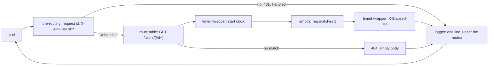

# Day 049 · C++ — Route patterns, pre-routing handlers, and a logging wrapper

**Today's theme:** Routing and middleware

**After today you can:** You can add authentication and logging to every route without repeating code, in each language.

**The interviewer asks it as:** *How would you add request logging to every endpoint?*

---

## 1. What this is, and why it matters

cpp-httplib has no middleware chain. What it has is three hooks on the `Server` object: a route
pattern can be a regular expression whose captures land in `req.matches`; a **pre-routing
handler** runs before any route is matched and can answer the request itself; and a **logger**
runs after every response is written and sees both the request and the finished response.
Between those three, and one ordinary function that wraps a handler lambda in another lambda, you
get everything the middleware chain gives Go and FastAPI.

At work, the pre-routing hook is where authentication and rate limiting go, and the logger is the
one line you will read most. In interviews, the C++ version of "how would you add request logging
to every endpoint" has a small extra: the logger is called on the worker thread that served the
request, so whatever it writes to must be safe to write from several threads at once.

## 2. The story

Kamal sits in the booth at the gate of a housing society with two wings, A and B, eight floors
each. Every person who comes in, whether they are going to A-402 or B-101, walks past him. There
is no second way in.

He keeps a register. When someone arrives he writes the time, their name, and the flat they are
going to. Then he phones the flat. If the flat says yes, he lets them through and gives them a
visitor slip with the flat number and the time on it. When they leave, he finds their line in the
register and writes the time out. A line is not finished until it has both times.

The flats never do any of this. Mrs Rao in A-402 does not ask a visitor for their name or check
the time. By the time anyone knocks on her door, Kamal has already done that, and she can simply
open it. If she wants to know who is standing there, she reads the slip.

Some people do not get through. A man arrives with no slip from the office and no name on the
approved list, and Kamal sends him back. Mrs Rao never hears about it. The register has a line
for him, with the time and the words "turned back", and that is all.

The register itself is one book, and on a festival evening there are three guards at the gate,
not one. Three hands reaching for one book is how a line gets written on top of another line. So
the book has a rule: you pick up the pen that is chained to it, you write your line, you put the
pen down. One pen, one line at a time, however many guards.

Once a month the society committee asks Kamal for the register, and reads it looking for one
thing: people who came in and have no time out. He is very careful about that column.

## 3. The idea in plain English

Kamal phoning the flat before letting anyone through is the **pre-routing handler**:
`svr.set_pre_routing_handler(f)`, where `f` takes the request and the response and returns either
`Handled`, meaning "I answered this, do not route it", or `Unhandled`, meaning "carry on". A turned-back
visitor is `res.status = 401` and `return Handled`. The route never runs.

The time-out column is the **logger**: `svr.set_logger(f)`, where `f` takes the request and the
finished response and returns nothing. It runs after the response has gone out, for every
request, including the ones the pre-routing handler answered. That is where the one log line
goes: method, path, status, and the request id.

The wing letter and flat number are a **regex route**. `svr.Get(R"(/users/(\d+))", handler)`
matches paths made of `/users/` and one or more digits, and the digits are `req.matches[1]`. The
`R"(...)"` is a raw string from [day 42](../day-042-binary-search-idea/README.md), so the
backslash is not an escape. Yesterday's `:id` captured any segment; this captures only digits, so
`/users/abc` is a 404 before your lambda runs.

The visitor slip is a **request id** made in the pre-routing handler with `res.set_header`. The
pre-routing handler is the only hook that runs before the route and can touch the response, so it
is the place for anything that must be on the way in and the way out.

A **logging wrapper** is the one thing here that is not a hook: a function that takes a handler
lambda and returns a new lambda that starts a clock, calls the original, and adds the elapsed
time as a header. It is Go's middleware shape, in C++, applied per route.

The chained pen is a `std::mutex` around the log line, because the logger runs on whichever worker
thread served the request, and two `std::cout <<` chains from two threads interleave their
pieces.

## 4. The picture



Notice that the logger is last for every path through the diagram, including the 401 and the
404. And notice the wrapper sits inside the route, not around the server.

## 5. The code, built step by step

Start from yesterday's `main.cpp`, with the same `httplib.h` and nlohmann/json.

The regex route.

```cpp
svr.Get(R"(/users/(\d+))", [](const httplib::Request& req, httplib::Response& res) {
    int id = std::stoi(req.matches[1]);
    std::lock_guard<std::mutex> lock(users_mutex);
    auto it = users.find(id);
    if (it == users.end()) return reply(res, 404, {{"error", "no such user"}});
    reply(res, 200, it->second);
});
```

`req.matches[1]` is the first capture group. Because the pattern only admits digits, the
`try` around `stoi` from yesterday is gone; `std::stoi` cannot fail on a string of digits short
enough to be an `int`, and the practice sheet asks what happens when it is not short enough.

The pre-routing handler, the phone call and the slip.

```cpp
const std::map<std::string, std::string> api_keys = {{"secret-123", "meera"}};

svr.set_pre_routing_handler([](const httplib::Request& req, httplib::Response& res) {
    res.set_header("X-Request-ID", make_request_id());
    if (req.path == "/health") return httplib::Server::HandlerResponse::Unhandled;
    if (!api_keys.contains(req.get_header_value("X-API-Key"))) {
        reply(res, 401, {{"error", "bad api key"}});
        return httplib::Server::HandlerResponse::Handled;
    }
    return httplib::Server::HandlerResponse::Unhandled;
});
```

`req.get_header_value` returns the empty string for a missing header, and `contains` on the map
is C++20, from [day 7](../day-007-space-complexity/README.md). Answering with `reply` and
returning `Handled` is the turn-back. `Unhandled` hands the request on to the route table.

The request id.

```cpp
std::string make_request_id() {
    static std::atomic<unsigned> counter{0};
    std::ostringstream out;
    out << std::hex << std::setw(8) << std::setfill('0') << ++counter;
    return out.str();
}
```

A counter in hex, eight wide. `std::atomic` from [day 33](../day-033-window-with-a-map/README.md)
makes `++counter` safe from several threads. A random id would be fine too; a counter makes the
log easier to read by eye.

The logger, the register.

```cpp
std::mutex log_mutex;

svr.set_logger([](const httplib::Request& req, const httplib::Response& res) {
    std::lock_guard<std::mutex> lock(log_mutex);
    std::cout << res.get_header_value("X-Request-ID") << ' ' << req.method << ' ' << req.path
              << " -> " << res.status << ' ' << res.get_header_value("X-Elapsed-Ms") << "ms\n";
});
```

The request id comes back off the response header the pre-routing handler set. The `lock_guard`
is the chained pen. Without it, two workers logging at once produce lines like
`00000003 GET 00000004 GET /users/1 /health -> 200`.

The wrapper, the per-route middleware.

```cpp
using Handler = std::function<void(const httplib::Request&, httplib::Response&)>;

Handler timed(Handler inner) {
    return [inner](const httplib::Request& req, httplib::Response& res) {
        const auto start = std::chrono::steady_clock::now();
        inner(req, res);
        const auto elapsed = std::chrono::steady_clock::now() - start;
        res.set_header("X-Elapsed-Ms",
            std::to_string(std::chrono::duration_cast<std::chrono::microseconds>(elapsed).count() / 1000.0));
    };
}
```

A function that takes a handler and returns a handler. `[inner]` captures the original lambda by
value, as on [day 19](../day-019-what-a-string-is/README.md). `steady_clock` is the
one that does not jump when the wall clock is adjusted, from
[day 41](../day-041-prefix-revision/README.md). Use it by wrapping at registration:

```cpp
svr.Get(R"(/users/(\d+))", timed([](const httplib::Request& req, httplib::Response& res) {
    // ... the same body as above ...
}));
```

Build and run:

```bash
g++ -Wall -Wextra -std=c++20 main.cpp -o server
./server
```

In a second terminal:

```bash
curl -i http://127.0.0.1:8000/health
curl -i http://127.0.0.1:8000/users/1
curl -i -H "X-API-Key: secret-123" http://127.0.0.1:8000/users/1
curl -i -H "X-API-Key: secret-123" http://127.0.0.1:8000/users/abc
```

```text
HTTP/1.1 200 OK
X-Request-ID: 00000001
{"ok":true}

HTTP/1.1 401 Unauthorized
{"error":"bad api key"}

HTTP/1.1 200 OK
X-Elapsed-Ms: 0.041000
{"city":"Pune","id":1,"name":"Meera"}

HTTP/1.1 404 Not Found
```

`/users/abc` did not match the digits pattern, so it is cpp-httplib's own empty 404, and no
lambda of yours ran. The server's terminal:

```text
00000001 GET /health -> 200 ms
00000002 GET /users/1 -> 401 ms
00000003 GET /users/1 -> 200 0.041000ms
00000004 GET /users/abc -> 404 ms
```

The lines with no number before `ms` are the ones that never reached a timed route: the header is
absent and `get_header_value` returned the empty string. The practice sheet asks you to tidy that.

Here is the whole program in one piece, `main.cpp`:

```cpp
#include <httplib.h>
#include <nlohmann/json.hpp>

#include <atomic>
#include <chrono>
#include <functional>
#include <iomanip>
#include <iostream>
#include <map>
#include <mutex>
#include <sstream>
#include <string>

using json = nlohmann::json;
using Handler = std::function<void(const httplib::Request&, httplib::Response&)>;

std::map<int, json> users = {{1, {{"id", 1}, {"name", "Meera"}, {"city", "Pune"}}}};
std::mutex users_mutex;
std::mutex log_mutex;
const std::map<std::string, std::string> api_keys = {{"secret-123", "meera"}};

void reply(httplib::Response& res, int status, const json& body) {
    res.status = status;
    res.set_content(body.dump(), "application/json");
}

std::string make_request_id() {
    static std::atomic<unsigned> counter{0};
    std::ostringstream out;
    out << std::hex << std::setw(8) << std::setfill('0') << ++counter;
    return out.str();
}

Handler timed(Handler inner) {
    return [inner](const httplib::Request& req, httplib::Response& res) {
        const auto start = std::chrono::steady_clock::now();
        inner(req, res);
        const auto elapsed = std::chrono::steady_clock::now() - start;
        res.set_header("X-Elapsed-Ms",
            std::to_string(std::chrono::duration_cast<std::chrono::microseconds>(elapsed).count() / 1000.0));
    };
}

int main() {
    httplib::Server svr;

    svr.set_pre_routing_handler([](const httplib::Request& req, httplib::Response& res) {
        res.set_header("X-Request-ID", make_request_id());
        if (req.path == "/health") return httplib::Server::HandlerResponse::Unhandled;
        if (!api_keys.contains(req.get_header_value("X-API-Key"))) {
            reply(res, 401, {{"error", "bad api key"}});
            return httplib::Server::HandlerResponse::Handled;
        }
        return httplib::Server::HandlerResponse::Unhandled;
    });

    svr.set_logger([](const httplib::Request& req, const httplib::Response& res) {
        std::lock_guard<std::mutex> lock(log_mutex);
        std::cout << res.get_header_value("X-Request-ID") << ' ' << req.method << ' ' << req.path
                  << " -> " << res.status << ' ' << res.get_header_value("X-Elapsed-Ms") << "ms\n";
    });

    svr.Get("/health", [](const httplib::Request&, httplib::Response& res) {
        reply(res, 200, {{"ok", true}});
    });

    svr.Get(R"(/users/(\d+))", timed([](const httplib::Request& req, httplib::Response& res) {
        int id = std::stoi(req.matches[1]);
        std::lock_guard<std::mutex> lock(users_mutex);
        auto it = users.find(id);
        if (it == users.end()) return reply(res, 404, {{"error", "no such user"}});
        reply(res, 200, it->second);
    }));

    svr.Post("/users", timed([](const httplib::Request& req, httplib::Response& res) {
        json body;
        try {
            body = json::parse(req.body);
        } catch (const json::parse_error&) {
            return reply(res, 400, {{"error", "body is not JSON"}});
        }
        if (!body.contains("name") || !body.contains("city")) {
            return reply(res, 400, {{"error", "name and city are required"}});
        }
        std::lock_guard<std::mutex> lock(users_mutex);
        int id = static_cast<int>(users.size()) + 1;
        users[id] = {{"id", id}, {"name", body["name"]}, {"city", body["city"]}};
        reply(res, 201, users[id]);
    }));

    std::cout << "listening on 127.0.0.1:8000\n";
    if (!svr.listen("127.0.0.1", 8000)) {
        std::cerr << "could not bind 127.0.0.1:8000\n";
        return 1;
    }
    return 0;
}
```

## 6. How the other two languages do it

**Python**

```python
@app.middleware("http")
async def log_requests(request: Request, call_next):
    start = time.perf_counter()
    response = await call_next(request)
    print(f"{request.method} {request.url.path} -> {response.status_code}")
    response.headers["X-Request-ID"] = request_id
    return response
```

One function does what C++ splits across the pre-routing handler and the logger, and it can set
headers on the way out because it holds the response object.

**Go**

```go
func logging(next http.Handler) http.Handler {
	return http.HandlerFunc(func(w http.ResponseWriter, r *http.Request) {
		rec := &statusRecorder{ResponseWriter: w, status: 200}
		next.ServeHTTP(rec, r)
		log.Printf("%s %s -> %d", r.Method, r.URL.Path, rec.status)
	})
}
```

The same wrapper shape as `timed`, applied to the whole server rather than one route, with a
wrapped writer to learn the status.

**The difference that matters:** in C++ the hooks are on the server, so there is no chain to get
in the wrong order and no way to get one either. Python and Go let you stack six middlewares and
then debug why the third never sees the fourth's header; cpp-httplib gives you exactly one
"before" and exactly one "after", and anything per-route is a wrapper you write yourself. Less to
misorder, more to write by hand.

## 7. The traps

**The near-miss: logging without the mutex.** Drop `log_mutex` and run fifty requests at once
from the practice sheet:

```text
00000007 GET 00000008 GET /users/1/users/1 -> 200 -> 200 0.038000ms
0.041000ms
```

No crash, no error. Two workers, one `std::cout`, and each `<<` is its own write. Under a single
`curl` you will never see it.

**Returning the wrong enum.**

```cpp
reply(res, 401, {{"error", "bad api key"}});
return httplib::Server::HandlerResponse::Unhandled;
```

The 401 body is set, then routing carries on, the route runs, and `reply(res, 200, ...)`
overwrites it. The caller gets a 200 with a valid key or not. `Handled` means "stop here".

**`std::stoi` on a very long number.** The pattern `(\d+)` admits `/users/99999999999`:

```text
terminate called after throwing an instance of 'std::out_of_range'
  what():  stoi
```

The whole server exits. Digits-only does not mean fits-in-an-int. Either `try` it or bound the
pattern, `(\d{1,9})`.

**A pattern that is not raw.** `svr.Get("/users/(\d+)", ...)`:

```text
main.cpp:71:13: warning: unknown escape sequence: '\d'
```

The compiler keeps the `d` and drops the backslash, and the route matches `/users/d+` literally.
`R"(...)"` every time.

**Setting a header after `set_content`.** It works; cpp-httplib collects headers until the
response is written. That is the opposite of Go, where the first write ends the chance, and it
is why the `timed` wrapper can add `X-Elapsed-Ms` after calling `inner`.

**`std::function` and the capture.** `timed` takes the lambda by value into `std::function`,
so a lambda that captures a local by reference and is registered inside a function that then
returns is a dangling reference the compiler will not catch. Capture globals, or capture by
value.

## 8. Say it out loud

**How it gets asked**

- How would you add request logging to every endpoint?
- Where does authentication go in cpp-httplib, and how does the health check skip it?
- What thread does the logger run on, and why do you care?
- How do you time one route without editing its body?

**The ninety-second script**

cpp-httplib gives me two hooks on the server. `set_pre_routing_handler` runs before routing;
it is where I make a request id and set it as a response header, and where I check `X-API-Key`
and answer 401 with `Handled`, letting `/health` through by path. `set_logger` runs after every
response, including the 401s and the unmatched 404s, and writes one line: request id, method,
path, status. It runs on the worker thread that served the request, so the line is written under
a mutex or the output from two workers interleaves. Per-route timing is a wrapper: a function
that takes the handler lambda and returns a lambda that starts a `steady_clock`, calls the
original, and sets an elapsed-time header, which the logger then reads. Routes are regexes,
`/users/(\d+)`, so the id is `req.matches[1]` and non-digits never reach my code.

**The follow-ups**

- **How does a route learn who the caller is?** *The pre-routing handler cannot attach arbitrary
  data to the request, because the request is `const` in the route. I set a response header the
  route can read back, or look the key up again in the route, or keep a map from thread id to
  caller. None is elegant; the practice sheet asks you to choose and say why.*
- **What about exceptions in a route?** *`set_exception_handler` takes a lambda with the request,
  response and `std::exception_ptr`; I rethrow inside a `try` to get the type, write a 500, and
  the process survives. Without it, a throw ends the server.*
- **Why a mutex on the logger and not on `std::cout` itself?** *`std::cout` is thread-safe per
  call, so no single `<<` corrupts, but a line is many calls. The mutex makes the whole line one
  unit. A real logger, [day 52](../day-052-quadratic-sorts/README.md), does
  this for you.*

**A model answer**

"Pre-routing handler for the way in: request id header, API key check, 401 plus `Handled` to
stop routing, `/health` exempt. Logger for the way out: one line per request with id, method,
path, status, under a mutex because it runs on worker threads. Timing per route is a wrapper
lambda that clocks `inner(req, res)` and sets a header. Routes are `R"(/users/(\d+))"` with
`req.matches[1]`, so a non-numeric id is a 404 before I run. The two mistakes to name: returning
`Unhandled` after answering, and forgetting the mutex."

## 9. Recall card

- `set_pre_routing_handler` runs before routing; answer and `return Handled` to stop, `Unhandled` to continue. Set the request id header here.
- `set_logger` runs after every response, on the worker thread; write the line under a `std::mutex` or it interleaves.
- `svr.Get(R"(/users/(\d+))", ...)`; `req.matches[1]` is the capture. Raw string, or `\d` is silently wrong.
- A wrapper is `Handler timed(Handler inner)` returning a lambda that clocks `inner(req, res)`; headers can still be set after `set_content`.
- `(\d+)` does not mean it fits in an `int`; `stoi` throws `std::out_of_range` and ends the process.
