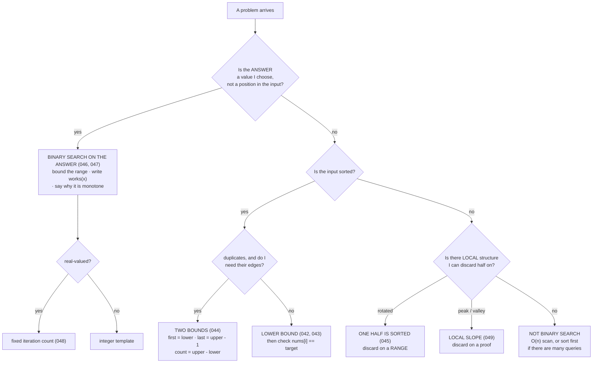

# Day 050 · DSA — Binary search revision and mock round

**After today you can:** You can solve two unseen binary search problems, including one search-on-answer.

**The interviewer asks it as:** *Two problems, no hints, talk as you go.*

---

## 1. What this is, and why they ask it

The binary search phase ends today. Eight days, six distinct shapes, and one template that has not
changed since [day 043](../day-043-binary-search-without-bugs/README.md). Today is not new material.
It is the drill that turns eight lessons into one act you can perform cold: **look at a problem you
have never seen, name which of the six it is, and start.**

Naming is a separate skill from solving, and it is the one interviews actually test. A candidate who
knows all six templates and cannot tell which one a problem wants will spend twenty minutes on a
greedy approach that does not work. The naming takes ten seconds and it decides the next thirty
minutes. So today has two halves: the recognition drill, and a mock round run under real conditions —
two unseen problems, talking the whole time, no hints.

---

## 2. The story

Yesudas has taken the choir at the church in Thrissur for nineteen years, and the Christmas service is
on the twenty-fourth.

From September they practise on Wednesdays and it is all stop-and-fix. The altos come in half a beat
late on the second piece, so they do that entry eleven times. Somebody is flat on a held note, so they
sit on that note. That is what a practice is for and it works.

Then, three weeks out, he changes what happens in the room, and the change is the whole of what he
knows about this.

The first change is that he stops correcting. From the first week of December they sing each piece
straight through, and whatever goes wrong, they carry on. He does not lift a hand. He told them years
ago why: nobody has ever ruined a service by singing a wrong note. What ruins it is that somebody
sings a wrong note and stops, and then the two beside her stop, and there are four seconds of nothing
in a full church. Recovering while continuing is a different skill from getting it right, and it
cannot be practised in a room where you are allowed to stop.

The second change is smaller and he thinks it matters more. He stops telling them what is next.

For three months the order has been on the board. Now he simply stands up and raises his hand, and
the first chord is the only clue anyone gets. And the thing he is watching, in those first two
seconds, is the row of faces — who has recognised the piece and taken a breath, and who is still
looking at the person next to them to work out which one it is.

Because on the night, the pieces will not come in the order anybody rehearsed. The priest will run
long, one piece will be dropped, the collection will take four minutes instead of two, and Yesudas
will turn round and start something. If they need three seconds to work out what it is, the opening
is gone.

Nineteen years, and he has never once had to correct a note in the last week. What he corrects, in
the last week, is the two seconds before the singing starts.

---

## 3. The idea in plain English

Yesudas's last three weeks are today. The full run-through without stopping is the mock. And the two
seconds before the first note — recognising which piece from one chord — is the naming drill, which is
the thing this phase has actually been building toward.

### The six chapters, and the tell for each

Every binary search problem you will be handed is one of these. Learn the left column; the right
column is the eight days you have already done.

```
THE TELL IN THE PROBLEM                          THE CHAPTER
---------------------------------------------    ------------------------------------------
"sorted array" + "find the index of"             plain search / lower_bound     (042, 043)
"first and last" / "how many times does x        two bounds, one char apart     (044)
   appear" / "how many are in [a, b]"
"rotated at an unknown pivot"                    one half is sorted; discard    (045)
                                                   on a RANGE, not a comparison
"not sorted" + "a peak" / "the minimum of a      local structure + a discard    (049, 045)
   rotated array"                                  proof; no order needed
"the smallest X such that it is possible" /      binary search on the ANSWER    (046, 047)
   "minimise the maximum" / "maximise the           bound the range, write
   minimum" / a capacity, speed, rate or days      works(x), check monotonicity
"to six decimal places" / a real-valued answer   float search, FIXED iteration  (048)
                                                   count, hi = max(1.0, x)
```

### The three exits — problems that look like binary search and are not

Naming when *not* to use it is worth as much as naming when to.

- **"Exactly k groups."** The word *exactly* usually kills monotonicity — if 5 works, 6 may not, and 7
  may. Check by asking "if x works, does every larger x work?" If you cannot answer yes with a reason,
  stop.
- **Duplicates in a rotated array, or a plateau in a peak search.** When
  `nums[lo] == nums[mid] == nums[hi]`, no comparison carries information, so no half can be discarded.
  `O(n)` worst case, and it is a property of the problem, not a weakness in your code.
- **"The maximum of an unsorted array."** `O(n)` and unbeatable — any element you skip could be the
  largest. Compare with "a peak", which is `O(log n)`. That contrast is the single sharpest thing you
  can say in this phase.

And one more: **a single query on unsorted data.** Sorting first costs `O(n log n)`, which is worse
than one `O(n)` scan. Binary search earns its place from the second or third query onward.

### The one template, which has not changed

```python
def first_true(lo: int, hi: int, question) -> int:
    """Smallest i in [lo, hi) with question(i) True, else hi."""
    while lo < hi:
        mid = (lo + hi) // 2
        if question(mid):
            hi = mid
        else:
            lo = mid + 1
    return lo
```

Six lines, written on day 043, unmodified since. Everything in the phase is this with a different
question:

```
question(i) = nums[i] >= target        -> lower bound  (first occurrence, insert position, exists)
question(i) = nums[i] >  target        -> upper bound  (last occurrence = -1, count = upper - lower)
question(c) = days_needed(c) <= d      -> smallest workable capacity
question(g) = not can_place(g)         -> largest workable gap, minus one
question(i) = nums[i] <= nums[-1]      -> the minimum of a rotated array
question(i) = nums[i] > nums[i + 1]    -> a peak
```

**Six problems, one loop.** If you find yourself writing a second loop shape, stop and ask what
question you should have written instead.

### The five bugs of the phase

Every failure in eight days has been one of these. Learn them as a pre-flight list, with the input
that catches each.

**One: mixing the two conventions.** Closed `[lo, hi]` goes with `while lo <= hi` and `± 1`. Half-open
`[lo, hi)` goes with `while lo < hi` and `hi = mid`. Blend them and you get either an infinite loop or
an `IndexError`. *Checking input:* a two-element array.

**Two: `hi = mid - 1` where `mid` might be the answer.** In every boundary search, the middle is a
candidate when the question answers True. *Checking input:* an array whose answer is at the position
the first midpoint lands on.

**Three: discarding on a single comparison instead of on a proof.** Plain binary search gets away with
`nums[mid] < target` because the array is sorted. Rotated arrays and peaks do not — the discard must be
justified by a range or by an argument about what must exist. *Checking input:* `[9, 11, 1, 3, 5, 7]`
searching for 9.

**Four: a range that does not contain the answer.** `hi = x` for the square root of 0.25. An upper
capacity that is too small. The function returns the edge of its own range with total confidence and
no error. *Checking habit:* assert that `works(hi)` is True before the loop.

**Five: `lo` set to a meaningless value.** A rate of 0 raises `ZeroDivisionError`; a capacity of 0
carries nothing. The lower bound is the smallest *meaningful* value, not the smallest number.
*Checking input:* whatever makes the check divide.

### The recognition minute

Before writing anything, sixty seconds, out loud:

1. **Which chapter?** Name it from the tells above.
2. **Is the precondition true?** Sorted — on which key? Monotone — say the sentence. Distinct
   adjacent values?
3. **What is the range?** Indices, or answers? Both ends, with a reason each.
4. **What is the question?** Write `works(x)` as one English sentence before it is code.
5. **What does the return value mean?** An index, a position, a value — and what must the caller check
   before using it?

Say those five out loud and the code takes ninety seconds, because every decision is already made.

---

## 4. The picture

The phase, as a decision you run in ten seconds:



**What to notice:** the very first question is not "is it sorted?" It is "what is the answer?" That
one reordering is what stops candidates missing the search-on-answer family, which is where the
hardest questions live.

The costs of the whole phase, on one card:

```
 tool                                  time                       space
 ------------------------------------  -------------------------  --------
 plain search / lower bound            O(log n)                   O(1)
 two bounds (first + last + count)     2 log n = O(log n)          O(1)
 rotated, distinct values              O(log n), ~3 cmp/pass      O(1)
 rotated, with duplicates              O(n) worst case            O(1)
 peak (1D)                             O(log n)                   O(1)
 peak (2D, r x c)                      O(r x log c)               O(1)
 search on the answer                  O(n x log(range))          O(1)
 float search                          O(1) -- fixed 100 passes   O(1)
 ------------------------------------  -------------------------  --------
 sorting first, if the input is not    O(n log n)                 O(n) or O(1)
   sorted                                                           in place
```

**What to notice:** every row is `O(1)` space. If your solution to a binary search problem allocates,
something has gone wrong — the one legitimate exception is sorting a copy of the input.

---

## 5. The code, built step by step

### The pre-flight, written as code

Before the mock, put this in your head. It is not a function you will write in an interview; it is the
shape of the sixty seconds.

```python
# 1. chapter?      answer-space -> works(x) | sorted -> bounds | local structure -> proof
# 2. precondition? sorted on WHICH key? monotone (say why)? adjacent values distinct?
# 3. range?        lo = smallest MEANINGFUL, hi = certainly-works (or len(nums))
# 4. question?     one English sentence, then code
# 5. return means? index / position / value -- and what must the caller check?
```

### The three loops, side by side

Everything in the phase is one of these three shapes. Know which you are writing and why.

```python
# A. boundary, half-open. The default. Use it unless you have a reason not to.
while lo < hi:
    mid = (lo + hi) // 2
    if question(mid):
        hi = mid
    else:
        lo = mid + 1
return lo
```

```python
# B. closed range, three-way. For "find this exact value and return -1 if absent",
#    and for the rotated search where mid must be compared to the target directly.
while lo <= hi:
    mid = (lo + hi) // 2
    if nums[mid] == target:
        return mid
    if nums[mid] < target:
        lo = mid + 1
    else:
        hi = mid - 1
return -1
```

```python
# C. floats. No condition at all -- a fixed count.
for _ in range(100):
    mid = (lo + hi) / 2
    if predicate(mid):
        lo = mid
    else:
        hi = mid
return (lo + hi) / 2
```

**A is the one to reach for.** B exists because rotated search genuinely needs the equality branch. C
exists because a continuous range never empties.

### The phase, in one runnable file

```python
from bisect import bisect_left, bisect_right


# ---------- chapter 1: sorted, find a target ----------
def search(nums: list[int], target: int) -> int:
    """Index of target, or -1. Day 042/043."""
    lo, hi = 0, len(nums)
    while lo < hi:
        mid = (lo + hi) // 2
        if nums[mid] >= target:
            hi = mid
        else:
            lo = mid + 1
    return lo if lo < len(nums) and nums[lo] == target else -1


# ---------- chapter 2: duplicates, find both edges ----------
def search_range(nums: list[int], target: int) -> list[int]:
    """First and last index of target, or [-1, -1]. Day 044."""
    first = bisect_left(nums, target)
    if first == len(nums) or nums[first] != target:
        return [-1, -1]
    return [first, bisect_right(nums, target) - 1]


# ---------- chapter 3: rotated, distinct values ----------
def search_rotated(nums: list[int], target: int) -> int:
    """Day 045. At least one half is sorted; discard on that half's RANGE."""
    lo, hi = 0, len(nums) - 1
    while lo <= hi:
        mid = (lo + hi) // 2
        if nums[mid] == target:
            return mid
        if nums[lo] <= nums[mid]:                     # <= : a one-element range is sorted
            if nums[lo] <= target < nums[mid]:
                hi = mid - 1
            else:
                lo = mid + 1
        else:
            if nums[mid] < target <= nums[hi]:
                lo = mid + 1
            else:
                hi = mid - 1
    return -1


# ---------- chapter 4: local structure, no order ----------
def find_peak(nums: list[int]) -> int:
    """Day 049. Compare with the RIGHT neighbour only; the array being finite is the proof."""
    lo, hi = 0, len(nums) - 1
    while lo < hi:
        mid = (lo + hi) // 2
        if nums[mid] < nums[mid + 1]:
            lo = mid + 1
        else:
            hi = mid
    return lo


def find_min_rotated(nums: list[int]) -> int:
    """Day 045. A valley. Compare against nums[hi], never nums[lo]."""
    lo, hi = 0, len(nums) - 1
    while lo < hi:
        mid = (lo + hi) // 2
        if nums[mid] > nums[hi]:
            lo = mid + 1
        else:
            hi = mid
    return nums[lo]


# ---------- chapter 5: search the ANSWER ----------
def ship_within_days(weights: list[int], d: int) -> int:
    """Day 046. Bound the answer range, write works(x), say why it is monotone."""
    def days_needed(capacity: int) -> int:
        days, load = 1, 0
        for w in weights:
            if load + w > capacity:
                days, load = days + 1, 0
            load += w
        return days

    lo, hi = max(weights), sum(weights)
    while lo < hi:
        mid = (lo + hi) // 2
        if days_needed(mid) <= d:
            hi = mid
        else:
            lo = mid + 1
    return lo


def max_min_gap(positions: list[int], count: int) -> int:
    """Day 047. Maximise the minimum: search the first FAILURE, then step back one."""
    positions = sorted(positions)

    def can_place(gap: int) -> bool:
        placed, last = 1, positions[0]
        for p in positions[1:]:
            if p - last >= gap:
                placed, last = placed + 1, p
                if placed == count:
                    return True
        return False

    lo, hi = 1, positions[-1] - positions[0] + 1       # + 1: half-open, hi is a candidate
    while lo < hi:
        mid = (lo + hi) // 2
        if not can_place(mid):
            hi = mid
        else:
            lo = mid + 1
    return lo - 1


# ---------- chapter 6: real-valued answers ----------
def sqrt_float(x: float) -> float:
    """Day 048. A fixed iteration count. hi = max(1.0, x), never x."""
    if x < 0:
        raise ValueError("no real square root of a negative number")
    lo, hi = 0.0, max(1.0, x)
    for _ in range(100):
        mid = (lo + hi) / 2
        if mid * mid < x:
            lo = mid
        else:
            hi = mid
    return (lo + hi) / 2


if __name__ == "__main__":
    print(search([3, 9, 14, 23, 31], 23), search([3, 9, 14], 10))          # 3 -1
    print(search_range([2, 4, 4, 4, 7], 4), search_range([2, 4], 5))       # [1, 3] [-1, -1]
    print(search_rotated([9, 11, 1, 3, 5, 7], 9))                          # 0
    print(search_rotated([1, 3, 5, 7, 9], 7))                              # 3
    print(find_peak([1, 3, 2, 4, 7, 9, 5, 6, 2]))                          # 7
    print(find_min_rotated([9, 11, 1, 3, 5, 7]), find_min_rotated([1, 3])) # 1 1
    print(ship_within_days([1, 2, 3, 4, 5, 6, 7, 8, 9, 10], 5))            # 15
    print(max_min_gap([1, 2, 4, 8, 9], 3))                                 # 3
    print(f"{sqrt_float(10):.6f}", f"{sqrt_float(0.25):.6f}")              # 3.162278 0.500000
```

Six chapters, about a hundred lines, and one loop shape doing almost all of it. Read it once, then
close it and write `first_true` from memory — that is the only thing in the file you must be able to
produce cold.

---

## 6. What it costs

### The whole phase, priced

Say these without pausing. Interviewers ask for the number, not the letter.

```
n = 1,000,000 elements:

 plain search               20 comparisons
 first + last               40 comparisons
 rotated (distinct)         20 passes x ~3 = 60 comparisons
 rotated (duplicates)       up to 1,000,000  -- the worst case is the point
 peak                       20 comparisons
 search on answer, range 25M
                            25 passes x 1,000,000 = 25,000,000 operations
                            (the CHECK is O(n): the comparison is no longer free)
 float, fixed count         100 passes, whatever the input
```

### The two comparisons worth having ready

```
find A PEAK      O(log n)     20 comparisons at a million
find THE MAXIMUM O(n)         1,000,000 -- and it cannot be beaten
                              -> weakening "global best" to "local best" buys the logarithm

LC 410 by binary search   O(n log(sum))  = 1,000 x 30      = 30,000 ops, O(1) space
LC 410 by dynamic prog.   O(n^2 k)       = 1,000 x 1,000 x 50 = 50,000,000 ops, 50,000 cells
                              -> ~1,600x, and a quarter of the code
```

### Where the logarithm sits, which people get wrong

```
searching an ARRAY:    log2(n)          -- doubling the array adds one pass
searching the ANSWER:  log2(hi - lo)    -- doubling the array adds NOTHING to the pass count,
                                           but doubles the cost of every check
```

That distinction is a good sentence to have: *"the log is over the answer range, not the input, so the
input size multiplies rather than adds."*

### Space, and the one thing that breaks it

```
every tool in the phase:  O(1) extra space
the exception:            sorting an unsorted input first -- O(n log n) time,
                          and O(n) space unless you sort in place
```

---

## 7. The traps

### The five-bug pre-flight, with the input that catches each

Run this list before you say "done" on any binary search, in an interview or out of it.

```
1. convention mixed        -> two-element array, e.g. [2, 1] or [1, 2]
2. hi = mid - 1 on a       -> an array whose answer sits where the first midpoint lands,
   branch that keeps mid      e.g. find_peak on [1, 2, 1, 3, 5, 6, 4]
3. discard on one          -> [9, 11, 1, 3, 5, 7] searching for 9
   comparison, not a proof
4. range misses the answer -> sqrt(0.25); a capacity upper bound smaller than sum(weights)
5. lo is meaningless       -> a rate of 0, a capacity of 0
```

### The real error: the convention blend

```python
lo, hi = 0, len(nums)          # half-open bound
while lo <= hi:                # closed-range condition
    mid = (lo + hi) // 2
    if nums[mid] >= target:
        hi = mid
    else:
        lo = mid + 1
```

```
Traceback (most recent call last):
  File "day50.py", line 5, in <module>
    if nums[mid] >= target:
       ~~~~^^^^^
IndexError: list index out of range
```

`hi` starts at `len(nums)` and the non-strict condition lets `mid` reach it. On other inputs the same
blend hangs instead, because `hi = mid` at `lo == hi` changes nothing. **Pick a convention per
function and never mix within one.**

### The near-miss that survives testing: an upper bound that is too small

```python
def broken_ship(weights, d):
    lo, hi = max(weights), max(weights) * len(weights) // 2       # hi too small
    while lo < hi:
        mid = (lo + hi) // 2
        if days_needed(weights, mid) <= d:
            hi = mid
        else:
            lo = mid + 1
    return lo

print(broken_ship([1, 2, 3, 4, 5, 6, 7, 8, 9, 10], 1))
```

```
50
```

The correct answer is 55. Every candidate in the range answered False, `lo` marched to the top, and
the function returned the edge of its own range. **Assert `works(hi)` before the loop while you
develop.** It costs one line and it converts this failure from silent to loud.

### The near-miss: a question that is not monotone

```python
# "the smallest k such that EXACTLY k groups can be formed"
```

No code needed to see the problem. If 5 works, 6 fails and 7 works, the row of answers is not
monotone, the halving lands somewhere arbitrary, and there is no error. **Say the monotonicity
sentence out loud before you write the loop, every single time:** *if x works, does every larger x
also work, and why?*

### The trap: sorting you forgot

```python
print(max_min_gap([5, 1, 9, 2, 8], 3))     # meaningless if positions is not sorted first
```

The feasibility check computes `p - last` as a distance, which is only a distance if the positions
come in order. Binary search on the answer does not need the input sorted; the *check* often does.
Those are different requirements and keeping them separate in your head is worth doing.

### The trap: reaching for a scan because "it isn't sorted"

The reflex that this phase exists to remove. Rotated arrays are not sorted. Peak finding has no order
at all. Capacity problems never sort anything. **Binary search needs a rule for discarding half with a
guarantee — sortedness is one way to get one, and it is not the only way.**

---

## 8. In the interview

### How it gets asked

Today is a mock, so the framing is the round itself:

- *"Two problems, no hints. Talk as you go."* — forty-five minutes, roughly twenty each, and the
  talking is scored.
- *"Here's the first one."* — usually a medium from chapters 1 to 4.
- *"And here's the second."* — usually a search-on-answer, because that is where candidates separate.
- *"You've got five minutes left."* — the pressure question, and the right answer is to say what you
  are choosing to finish.

### The mock protocol

Run it exactly like this. Standing, out loud, nothing open, a timer running.

```
minutes  0-1    the recognition minute: chapter, precondition, range, question, return meaning
minutes  1-3    say the invariant, and the cost you expect, BEFORE any code
minutes  3-12   write it, narrating each line as a sentence
minutes 12-15   run the pre-flight five, and the two-element and empty inputs
minutes 15-20   the follow-up you know is coming (duplicates / updates / a bigger n)
```

The most common failure in a mock is silence between minutes 3 and 12. If you find yourself thinking
without speaking, say what you are weighing — *"I'm deciding whether the middle can be the answer,
which decides between `hi = mid` and `hi = mid - 1`"* — because that sentence is worth as much as the
code.

### What to say out loud, in the first ninety seconds

1. **Name the chapter.** *"This is 'the smallest X such that something is possible', so I'll binary
   search the answer rather than the array."*
2. **Check the precondition and say it.** *"More capacity can never need more days, so the question is
   monotone. That's what the whole method rests on."*
3. **State the range with a reason each end.** *"Not below the heaviest package — it'd never load. Not
   above the total — that's one day."*
4. **State the invariant.** *"Below `lo` everything answers no; from `hi` up, everything answers yes."*
5. **Predict the cost.** *"The check is O(n) and I'll do about twenty-five of them, so O(n log range)."*
6. **Then write it**, narrating.

### The follow-ups

**"How do you decide, in ten seconds, whether a problem is binary search at all?"**
I ask one question first, and it is not "is it sorted?" — it is "what is the answer?" If the answer is
a *position in the input*, then I need the input to have structure I can discard on: sorted, rotated,
or a local slope like a peak. If the answer is a *value I get to choose* — a capacity, a rate, a gap,
a number of days — then the input's order is irrelevant and I am searching the answer range instead,
which is where the harder problems live. Getting that order right is what stops people missing the
search-on-answer family, because those problems read as optimisation and the input is usually
unsorted, so "is it sorted?" gives a misleading no. After that I check the precondition for whichever
branch I am in: sortedness and on which key, or monotonicity said as a sentence about the real world.
If neither holds, I say so and price the scan instead — O(n), and if there are many queries, sort once
at O(n log n) and amortise.

**"Your search-on-answer solution is O(n log range). Isn't the log over the input for a real binary
search?"**
No, and the distinction is worth being precise about because it changes how the solution scales. In an
array search the log is over n, so doubling the input adds one comparison and the comparison itself is
free. In a search on the answer the log is over the *range of candidate answers*, and each evaluation
is a full pass over the input. So doubling the input adds nothing to the number of passes and doubles
the cost of every pass — the input size multiplies rather than adds. Concretely, fifty thousand
packages over a capacity range of twenty-five million is about twenty-five passes of fifty thousand
operations, so a bit over a million, against a trillion if I tried every capacity. It also tells me
where to spend effort if it is too slow: tightening the bounds saves passes, but making the check
cheaper saves more, because it multiplies.

**"You've got five minutes left and the second problem isn't finished. What do you do?"**
I say so out loud and choose, rather than typing faster and hoping. With five minutes I would finish
the *feasibility check* completely and correctly, because that is where the actual difficulty of a
search-on-answer problem lives — the search loop around it is six lines I can write in ninety seconds
and have written identically five times this week. So I would say: "the loop is the standard boundary
template, and I'll write it last; let me make the check right first, because that's the part that's
specific to this problem." Then, in the final minute, I would state the things I know I have not
verified — the two-element case, whether the upper bound is provably feasible — rather than let the
interviewer discover them. Naming your own gaps is worth real marks, because the alternative reading
is that you did not see them.

### A model answer

> "Let me take the recognition minute before I write anything, because on this family the naming
> decides everything after it.
>
> The phrasing is 'the smallest capacity such that all packages ship within d days'. That's 'the
> smallest X such that something is possible', so the answer is a value I choose, not a position in
> the input — which means I'm binary searching the answer range, and the fact that the weights aren't
> sorted is irrelevant.
>
> Precondition: is it monotone? More capacity can never require more days — every packing that fits a
> smaller ship also fits a bigger one — so the answers run no, no, no, yes, yes, yes with exactly one
> boundary. That's the property the whole method rests on, and I check it in words before I trust it.
>
> Range, with a reason at each end. Not below `max(weights)`, because a package heavier than the ship
> never loads. Not above `sum(weights)`, because that's everything in one day. Both O(n), computed
> once.
>
> The question: `days_needed(capacity)` walks the packages in order, adds to the current day, and
> starts a new day when the next one doesn't fit. The counter starts at one, because day one exists
> before anything is loaded.
>
> Invariant: everything below `lo` answers no, everything from `hi` up answers yes, so `lo` ends on
> the boundary. Cost: the check is O(n) and I'll run about twenty-five of them, so O(n log range) —
> and O(1) space.
>
> ```python
> lo, hi = max(weights), sum(weights)
> while lo < hi:
>     mid = (lo + hi) // 2
>     if days_needed(mid) <= d:
>         hi = mid
>     else:
>         lo = mid + 1
> return lo
> ```
>
> That's the same six lines as every other search this week; only the question changed.
>
> Before I say I'm done, the pre-flight: the convention is half-open so the condition is strict and
> there's no minus one anywhere; the True branch keeps `mid` because `mid` might be the smallest
> capacity that works; the upper bound provably works, so there's no not-found case; and the lower
> bound is meaningful rather than zero. I'd test a single package, all-equal weights, and d equal to
> the number of packages.
>
> And the follow-up I'd expect: if packages could ship in any order, the greedy check stops being
> exact — that's bin packing, NP-hard — so the search skeleton survives but the answer becomes an
> approximation, and I'd say that rather than let it pass."

---

## 9. Recall card

- **Ask "what is the answer?" before "is it sorted?"** A *position* → the input needs discardable
  structure (sorted / rotated / local slope). A *value you choose* → search the answer range, and the
  input's order is irrelevant.
- **Six chapters, one loop.** `first_true` from [day 043](../day-043-binary-search-without-bugs/README.md)
  — half-open, strict `<`, `hi = mid` / `lo = mid + 1` — with a different question each time. Writing a
  second loop shape means you should have written a different question.
- **The five bugs, with their inputs:** convention blend (two-element array) · `hi = mid - 1` where mid
  is a candidate · discarding on one comparison instead of a proof · a range that misses the answer
  (assert `works(hi)`) · a meaningless `lo` (rate 0 → `ZeroDivisionError`).
- **The three exits:** "exactly k" kills monotonicity · duplicates/plateaus make it O(n),
  unavoidably · the *maximum* of an unsorted array is O(n) and unbeatable, where a *peak* is O(log n).
- **Say the numbers, not the letters:** a million → 20 comparisons; two bounds → 40; rotated with
  duplicates → up to a million; search-on-answer → O(n × log range), the log over the *answer* range,
  so input size multiplies rather than adds. Every tool in the phase is O(1) space.
