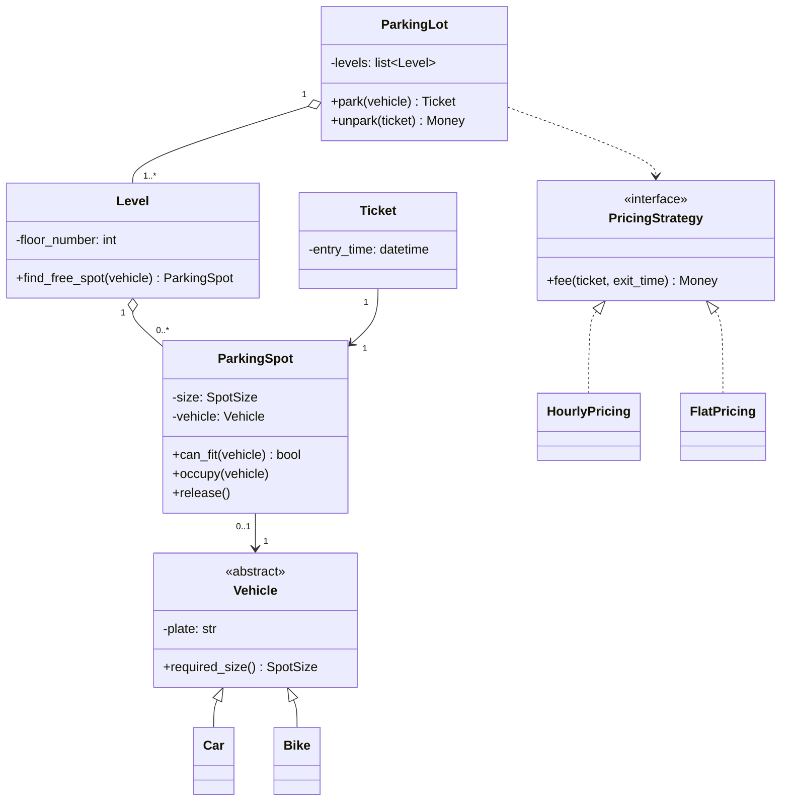

# Day 050 · System design — Class diagrams and the UML you will actually draw

**After today you can:** You can draw a class diagram on a whiteboard that an interviewer can read.

**The interviewer asks it as:** *Draw the class diagram for what you just described.*

---

## 1. What this is, and why they ask it

A **class diagram** is a picture of a design: boxes for classes, lines for the relationships between
them, and small numbers saying how many of each. **UML** — the Unified Modeling Language — is the
standard it comes from, and it has fourteen diagram types and a specification running to hundreds of
pages. You need roughly five symbols from it, and today is about which five and how to put them on a
board in four minutes.

They ask because the diagram is the shared object in the room. Everything you said in the first
fifteen minutes of an object-oriented design round lived in the air; the diagram makes it something you
and the interviewer can both point at, and the follow-up questions get asked *about the picture*. A
candidate who draws twelve unlabelled boxes joined by identical arrows has made the conversation
harder rather than easier. A candidate who draws seven boxes with the important fields, three kinds of
line used consistently, and multiplicities on every relationship has, in four minutes, made the rest
of the round easy for both of them.

---

## 2. The story

Ouseph supervises small building sites around Aluva — two-storey houses, mostly — and the part of the
job he cares most about happens on one morning, before any wall goes up.

The ground floor slab gets poured, and then it sits for a week. On the morning the masons are due to
start, Ouseph gets there early with a lump of chalk and draws the whole ground floor on the concrete.
Full size. The kitchen wall, the passage, where the stairs land, the line of the front veranda.

It takes him about forty minutes and it looks rough. He does not measure everything; he paces most of
it. He does not draw the plug points or the tile pattern or the window frames. He draws walls, doors
and the staircase, and nothing else.

Then he stands there with the owner and the head mason, and they walk about on it.

What happens on that hour is the reason for the chalk. The owner walks from the chalk front door to
the chalk kitchen and says the passage feels narrow, and it is narrow, and they move a line by nine
inches. The mason stands at the foot of the chalk stairs, looks up at nothing, and says the landing
will foul the window above, which nobody had noticed. Last year an owner stood in her chalk kitchen
and realised the door was on the wrong side entirely, and they changed it before a single brick was
laid.

None of those three would have come out of talking. They came out of standing in it.

And then the bricks go down and the chalk disappears under the first course, that same afternoon.
Nobody photographs it. Nobody keeps it. Ouseph has never once gone back to look at an old chalk
drawing, because by the time the walls are up, the walls are the drawing.

He is quite clear about what would ruin it, too. If he tried to chalk everything — every socket, every
shelf, the cupboard depths — it would take two days, the floor would be a mess of lines nobody could
read, and the owner would not walk about on it. The drawing works because it leaves nearly everything
out.

---

## 3. The idea in plain English

Ouseph's chalk outline is the class diagram. The hour of walking about on it is the design
conversation. The bricks covering it up is the code, which becomes the real record. And the two-day
version with every socket on it is a fully specified UML model — technically more complete, and worse
at the one job it had.

### The five symbols you need

Everything you will draw in an interview uses these and nothing else.

**One: the class box.** Three compartments — name, fields, methods:

```
+---------------------------+
|      ParkingSpot          |    <- name, always
+---------------------------+
| - size: SpotSize          |    <- the fields that MATTER, 3-5 of them
| - vehicle: Vehicle | None |
+---------------------------+
| + can_fit(v): bool        |    <- the methods that carry rules, 2-4
| + occupy(v)               |
| + release()               |
+---------------------------+
```

`-` means private, `+` means public. That is the whole of visibility notation you need. Leave out
constructors, getters and anything that does not carry a decision — the diagram is for the
conversation, and `get_size()` has never started a conversation.

**Two: association** — a plain line, meaning "these two know about each other". Add an arrowhead if
only one direction knows:

```
   Ticket --------> ParkingSpot        a ticket knows its spot; the spot does not know the ticket
```

**Three: inheritance** — a line with a **hollow triangle** pointing at the parent:

```
   Car ------|>  Vehicle
   Bike -----|>  Vehicle
```

**Four: implements an interface** — the same triangle, but a **dashed** line:

```
   HourlyPricing - - -|> PricingStrategy
```

**Five: multiplicity** — small numbers at each end of a line, saying how many:

```
   ParkingLot 1 -------- 1..* Level        one lot has one or more levels
   Level      1 -------- 0..* ParkingSpot  one level has any number of spots
```

The four you need: `1`, `0..1`, `1..*`, `0..*`. **Put a multiplicity on every line.** It is the
cheapest information in the diagram and it is the thing candidates leave out most.

### The diamond, and why not to worry about it

UML has two more line types. A **hollow diamond** at the container end means *aggregation* — the parts
can exist without the whole. A **filled diamond** means *composition* — the parts die with the whole,
so `Order ◆—— OrderLine` because a line item has no meaning without its order.

Learn what they mean; do not spend interview time deciding between them. No interviewer has ever
marked a candidate down for drawing a plain line where a hollow diamond belonged. Several have marked
candidates down for spending ninety seconds visibly agonising over it. **If the distinction genuinely
matters to your design — because it decides a cascade delete — say it in a sentence instead of
encoding it in a symbol.**

### What to leave out

This list is longer than the list of what to include, and that is the point.

- **Getters, setters and constructors.** They fill the box and say nothing.
- **Every field.** Three to five that matter. `created_at` is not one of them.
- **Type details.** `list[ParkingSpot]` is fine; `Optional[Sequence[ParkingSpot]]` is noise on a
  board.
- **The other thirteen UML diagram types.** Component, deployment, state, activity, package —
  interesting, and not what "draw the class diagram" means.
- **Stereotypes, notes, constraint boxes, `«interface»` markers if you have already used the dashed
  line.**
- **Anything you already said out loud and nobody questioned.**

### Seven boxes, not fifteen

There is a real limit and it comes from what a person can hold at once: about seven items, plus or
minus two. A diagram of fifteen boxes is not read; it is scanned and abandoned.

If your design genuinely has fifteen classes, **draw two diagrams**: the core five or six, and then a
second showing one subsystem in detail. Say what you are doing — *"let me draw the core first, then
zoom into pricing"* — and the interviewer will follow you happily.

### The order to draw in

This matters more than the symbols, because a board fills up and you cannot undo.

1. **Put the two or three central classes in the middle first**, spread wide apart. Leave far more
   space than feels necessary.
2. **Draw the containment spine** — lot, level, spot — top to bottom or left to right, with
   multiplicities as you go.
3. **Hang the inheritance groups off to one side.** Vehicles in one corner, spot types in another. Do
   not let hierarchies cut across the middle.
4. **Add the interfaces last**, with dashed triangles, usually at an edge.
5. **Fill in fields and methods only for the boxes the conversation is actually about.** Some boxes
   will have a name and nothing else, and that is correct rather than lazy.

### The sequence diagram, in one paragraph

Occasionally the question is not "what are the classes" but "walk me through what happens when a car
arrives". That is a **sequence diagram**: participants as columns, time running down, and each message
an arrow from one column to the next.

```
 Driver     ParkingLot      Level        ParkingSpot     Ticket
   |            |             |               |            |
   |-- park() ->|             |               |            |
   |            |-- find() -->|               |            |
   |            |             |-- can_fit() ->|            |
   |            |             |<---- true ----|            |
   |            |             |-- occupy() -->|            |
   |            |<-- spot ----|               |            |
   |            |------------- new Ticket ----------------->|
   |<- ticket --|             |               |            |
```

Five participants maximum, one flow per diagram, and only draw one when the *interaction order* is the
interesting thing. A class diagram shows structure; a sequence diagram shows a story. Knowing which
the question wants is most of the skill.

---

## 4. The picture

The parking lot, drawn the way it should look on a board at minute twenty:



**What to notice:** nine boxes, and only four of them carry fields and methods. The three that matter
to the conversation — the lot, the spot and the pricing interface — are detailed; `Car` and `Bike` are
names only, because everything about them was said out loud. Every relationship line carries a
multiplicity except the inheritance ones, which never do.

The same thing as chalk on a whiteboard, which is what you will actually draw:

```
        +---------------+
        |  ParkingLot   |  1
        |---------------|
        | + park(v)     |
        | + unpark(t)   |
        +-------+-------+
                | 1..*
        +-------+-------+                    +------------------+
        |    Level      |                    | PricingStrategy  |<<interface>>
        |---------------|<...................|------------------|
        | + find_free() |                    | + fee(t, when)   |
        +-------+-------+                    +--------+---------+
                | 0..*                          ^          ^
        +-------+--------+                      :          :
        |  ParkingSpot   |                 HourlyPricing  FlatPricing
        |----------------|
        | - size         |          +-----------+
        | - vehicle      | 0..1     |  Vehicle  |  (abstract)
        |----------------|--------->|-----------|
        | + can_fit(v)   |    1     | - plate   |
        | + occupy(v)    |          +-----+-----+
        +----------------+                ^
                ^ 1                       |
                | 1                    +--+--+
        +-------+-------+              |     |
        |    Ticket     |             Car   Bike
        |---------------|
        | - entry_time  |
        +---------------+
```

**What to notice:** the containment spine runs straight down the left, the inheritance groups sit off
to the sides, and the interface is at the right edge. Nothing crosses anything. That layout is not
decoration — it is what makes the diagram readable from where the interviewer is sitting.

---

## 5. How it actually works

### What people really do with these

Being honest about this is worth marks, because interviewers know it.

- **In an interview**, a class diagram is the artefact of the round. It is drawn once, discussed, and
  thrown away.
- **In a design document or a pull request**, a small diagram of the five classes you are adding is
  genuinely useful, and Mermaid means it lives in the repository next to the code.
- **In onboarding**, a diagram of the core domain saves a new engineer a week.
- **Almost nowhere** is a full UML model maintained in step with the code. Round-trip tools that
  generate code from diagrams and back had their moment and it passed. Diagrams that are not
  regenerated go stale, and a stale diagram is worse than none because people trust it.

The conclusion is Ouseph's: **draw the diagram for the conversation it enables, not as a record.** The
code is the record.

### Mermaid, which is the version you will type

Every diagram in this course is Mermaid, and it is the practical answer for a design doc:

```
classDiagram
    class Order {
        -id: int
        -status: OrderStatus
        +cancel()
        +total() Money
    }
    Order "1" *-- "1..*" OrderLine        %% filled diamond: lines die with the order
    Order "0..*" --> "1" Customer         %% plain association with an arrow
    Order ..> PricingStrategy             %% dashed: depends on / uses
    Notification <|-- EmailNotification   %% hollow triangle: inheritance
    Sendable <|.. EmailNotification       %% dashed triangle: implements
```

The five arrow forms to remember: `<|--` inheritance, `<|..` implements, `*--` composition, `o--`
aggregation, `-->` association. Quotes carry multiplicities. That is enough for every diagram you will
draw for years.

GitHub, GitLab and most documentation tools render Mermaid in Markdown, which is what makes it worth
learning over a drawing tool: the diagram is reviewable in a pull request and diffs like text.

### The tools, named

- **A whiteboard**, or the interviewer's shared drawing tool — Excalidraw and tldraw are the common
  ones in remote rounds. Practise on whichever your interviews use; drawing a straight line with a
  mouse is a skill and it is worth ten minutes of practice.
- **Mermaid**, for anything living in a repository.
- **PlantUML**, the older text-to-diagram tool. More expressive, uglier output, still common in
  enterprise codebases.
- **draw.io / diagrams.net**, for a diagram somebody will edit later by hand.

### How to talk while drawing

The diagram is not the answer; it is the accompaniment. Narrate as you draw, and the narration is what
is scored:

> *"I'll put ParkingLot at the top — it's the entry point and it coordinates, but it owns no rules
> itself. Under it, Level, one-to-many. Under that, ParkingSpot, one-to-many again — and I'm putting
> `can_fit` on the spot rather than on the lot, because the spot is the thing that knows its own size.
> Off to the right, PricingStrategy as an interface with two implementations, because pricing is the
> requirement most likely to change."*

Three sentences, and every one of them is a design decision with a reason. Silence while drawing is
the commonest way to waste four minutes.

---

## 6. The numbers

### What fits, and what is read

```
readable on a whiteboard from where the interviewer sits:   6-9 boxes
the working-memory limit (7 +/- 2):                          ~7 items
a diagram of 15 boxes:                                       scanned, not read

so: 15 classes -> TWO diagrams (core, then one subsystem), announced out loud
```

### Time, on the board

```
one class box with 3 fields and 3 methods   ~30 seconds to draw legibly
7 boxes                                     ~3.5 minutes
relationship lines and multiplicities       ~1 minute
                                            ------------
                                            ~4.5 minutes

the OOD round's budget for the diagram      3-5 minutes, from a 45-minute round
```

Which is why detail is the enemy. Adding `created_at`, `updated_at` and two getters to each of seven
boxes is another two minutes and adds nothing anyone will ask about.

### Detail per box, budgeted

```
fields shown per class     : 3-5      (the ones a rule depends on)
methods shown per class    : 2-4      (the ones carrying decisions)
boxes with NO detail       : 30-50%   -- and that is correct, not lazy

a box with 12 fields and 9 methods:
    ~90 seconds to draw, and it is the class that should have been two classes
```

That last line is worth saying out loud if it happens: a box that will not fit is usually a design
problem showing up as a drawing problem.

### The symbols, counted

```
UML 2.5 specification:            ~800 pages, 14 diagram types
symbols used in a real interview: 5   (box, association, inheritance, implements, multiplicity)
symbols worth knowing but not
  agonising over:                 2   (hollow / filled diamond)
```

---

## 7. The trade-offs

### Detail against readability

Every field you add makes the diagram more complete and less useful. *I would not draw a field the
conversation does not depend on* — the diagram is a conversation aid, and a complete one is Ouseph's
two-day chalk drawing that nobody walks on. If the interviewer wants a field, they will ask, and
answering is faster than pre-empting.

### Precision against speed

You could get every diamond right, mark every navigability arrow, and label every association with a
role name. *I would not spend interview time on aggregation-versus-composition* — I would draw a plain
line and, if the distinction matters, say "these die with the order" in a sentence. The exception is a
design document that will be read without you present; there, precision earns its cost because nobody
can ask.

### A class diagram against a sequence diagram

A class diagram shows structure and is silent about time. A sequence diagram shows one flow and is
silent about structure. *I would not draw a sequence diagram unless the ordering of the interaction is
the interesting part* — for "design a parking lot" it is not, and for "walk me through what happens on
a payment retry" it very much is. Drawing the wrong one wastes four minutes and answers a question
nobody asked.

### A maintained diagram against no diagram

*I would not commit a large diagram to a repository unless someone owns regenerating it*, because a
stale diagram is worse than no diagram — people trust it and it lies. A small Mermaid diagram of five
classes next to the code it describes usually survives, because it is small enough that whoever
changes the code will fix it. A forty-box model will not.

### The honest sentence

> The diagram's job is to let two people point at the same thing and disagree productively. Judge it
> by whether the next five minutes of conversation got easier — not by whether it is complete, and
> certainly not by whether the diamonds are right.

---

## 8. In the interview

### How it gets asked

- *"Draw the class diagram for what you just described."* — the direct form, usually at minute twenty,
  after you have talked through the classes.
- *"Can you show me how these fit together?"* — the same request, phrased as if it were optional. It is
  not.
- *"Walk me through what happens when a car arrives."* — a sequence diagram question wearing plain
  clothes, and drawing a class diagram in response answers something else.
- *"What's the difference between aggregation and composition?"* — the vocabulary check. Answer in one
  sentence and add that you would not spend board time on it.

### What to say out loud, in the first ninety seconds

1. **Say the plan before the first box.** *"I'll draw the core structure first — lot, level, spot,
   vehicle — then hang the pricing interface off the side. About four minutes."*
2. **Place the central class and say why it is central.** *"ParkingLot at the top: it coordinates and
   owns no rules of its own."*
3. **Draw the spine with multiplicities as you go.** *"One lot, one-to-many levels. One level,
   zero-to-many spots."*
4. **Narrate one design decision while drawing it.** *"`can_fit` goes on the spot, not on the lot,
   because the spot is what knows its own size — if I put it in the lot it becomes a type-switch I'd
   have to edit for every new vehicle."*
5. **Do the interfaces last and say why they exist.** *"PricingStrategy as an interface, dashed
   triangle, two implementations — because pricing is the requirement most likely to change, and I can
   name the second implementation."*
6. **Say what you left out.** *"I've left out getters and audit fields deliberately, and payment is out
   of scope — tell me if you want either."*

### The follow-ups

**"What's the difference between aggregation and composition, and does it matter here?"**
Aggregation is a whole-part relationship where the parts can outlive the whole — a hollow diamond at
the container end. Composition is one where they cannot — a filled diamond — so if the whole is
deleted, the parts are deleted with it. In this design, `Order` to `OrderLine` is composition, because
a line item has no meaning without its order and would be cascade-deleted with it, and
`ParkingLot` to `Level` is arguably aggregation, because a level is a physical thing that would
survive the software object being destroyed. Does it matter? It matters in exactly one place, which is
the cascade-delete decision, and that is a database `ON DELETE` clause rather than a drawing symbol —
which was [day 026](../day-026-strings-revision/README.md)'s point about choosing `ON DELETE`
deliberately. So my honest answer is that I know the distinction, I will draw a plain line under time
pressure, and if the lifecycle matters I will say "these die with the order" in a sentence, which is
clearer to everyone in the room than a diamond that half the readers will not decode.

**"Your diagram has fifteen boxes and I can't read it. What do you do?"**
I would say that is my mistake and split it, and I would say what I am splitting on rather than just
erasing things. The limit is what a person can hold at once — about seven items — so fifteen boxes is
not a diagram, it is a wall. So: rub out everything except the five or six classes that carry the main
flow, redraw those with room around them, and then say "let me zoom into pricing separately", and draw
the second diagram beside it. That is two readable pictures instead of one unreadable one, and the
narration — announcing the split before doing it — is what stops it looking like panic. The other
thing I would take from it is that a diagram that will not fit is usually telling me something about
the design: if fifteen classes are all mutually connected, the boundaries are probably wrong, and I
would rather notice that on the board than three weeks into building it.

**"Do you actually use these at work, or is this an interview exercise?"**
Both, in different sizes, and I think being straight about that matters. In an interview the diagram
is the artefact of the conversation — it gets drawn, argued over and wiped, and its whole value was
the argument. At work I use small ones: five or six classes in a Mermaid block in a design document or
a pull request description, describing the thing I am adding, which reviewers can read in twenty
seconds and which diffs like text in code review. What I have never seen work is a full UML model kept
in step with the code. Those go stale within a release, and a stale diagram is worse than none because
people trust it and it lies. The tools that generated code from diagrams and back had a period of
popularity and it passed. So my rule is that the code is the record, and a diagram is a temporary
shared surface for a conversation — which is exactly why I draw it rough, leave the getters out, and
do not agonise over the diamonds.

### A model answer

> "Let me draw the core first and hang the variable parts off the side. Four minutes or so, and I'll
> talk while I draw.
>
> ParkingLot goes at the top, because it's the entry point and it coordinates — it owns no rules
> itself, which is deliberate. Below it, Level, one-to-many. Below that, ParkingSpot, zero-to-many. I'm
> putting multiplicities on every line because they're the cheapest information here and they're what
> people leave out.
>
> ParkingSpot gets real detail, because it's where the interesting decision is: it holds `size` and an
> optional `vehicle`, and exposes `can_fit`, `occupy` and `release`. `can_fit` is on the spot rather
> than on the lot because the spot is the thing that knows its own size — put it in the lot and it
> becomes a type-switch I have to edit every time a vehicle type is added.
>
> Off to the right, Vehicle as an abstract class with Car and Bike under it, hollow triangles. Those
> two boxes get names only — everything about them was in what I said, and drawing their fields would
> just fill the board.
>
> On the other side, PricingStrategy as an interface, dashed triangles from HourlyPricing and
> FlatPricing, and a dashed dependency from ParkingLot to it. That's there because pricing is the
> requirement most likely to change, and I can name the second implementation — which is my test for
> whether an interface earns its place.
>
> Ticket down at the bottom, pointing at the spot it was issued for, with the entry time on it.
>
> Things I've left out on purpose: getters, constructors, audit fields, and the payment flow. And I've
> drawn plain lines rather than agonising over aggregation versus composition — the only place that
> distinction matters here is whether tickets are deleted with the lot, and if that's interesting I'd
> rather say it in a sentence than encode it in a diamond half the room won't decode.
>
> Nine boxes, four of them detailed. If you want, the next thing I'd draw is a sequence diagram for
> the arrival flow — but only if the ordering of the interaction is what you want to dig into, because
> this picture is already telling you the structure."

---

## 9. Recall card

- **Five symbols is the whole kit:** the three-compartment box (`+` public, `-` private), a plain
  **association** line, a **hollow triangle** for inheritance, a **dashed** triangle for implements,
  and a **multiplicity** on every line (`1`, `0..1`, `1..*`, `0..*`).
- **6-9 boxes, 30-50% of them detail-free.** Fifteen boxes is a wall — split into "the core" plus one
  subsystem, and announce the split. A box that will not fit is usually two classes.
- **Draw in order:** central class first with space around it → the containment spine with
  multiplicities → inheritance groups off to the sides → interfaces at an edge → fields and methods
  only where the conversation is.
- **Leave out getters, constructors, audit fields, full types, and the diamond argument.** Say "these
  die with the order" in a sentence rather than encoding it — nobody has ever been marked down for a
  plain line.
- **Narrate every box with its reason** ("`can_fit` on the spot, because the spot knows its own
  size"). The diagram enables the conversation; **the code is the record** — a stale diagram is worse
  than none. Class diagram = structure; sequence diagram = one flow, ≤5 participants, only when order
  is the point.
