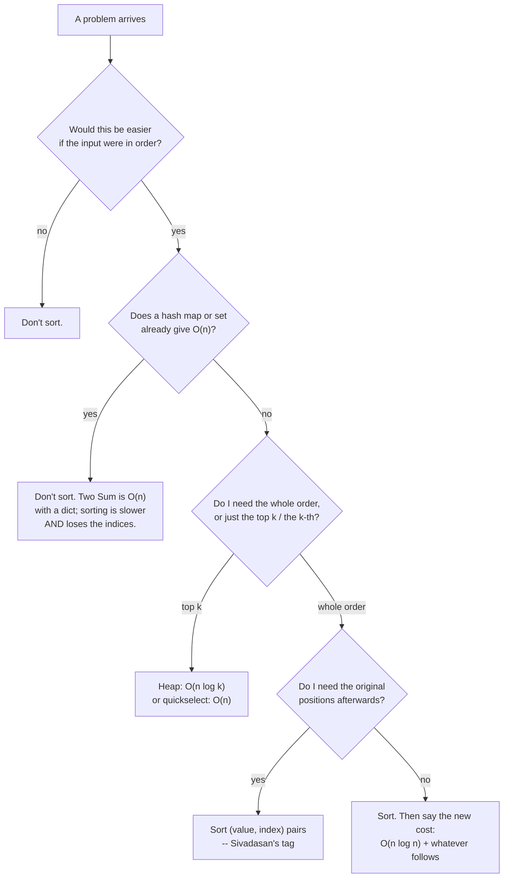

# Day 051 · DSA — Why sorting matters more than any single sorting algorithm

**After today you can:** You reach for sort as a preprocessing step and can justify the extra n log n.

**The interviewer asks it as:** *Would sorting first make this problem easier?*

---

## 1. What this is, and why they ask it

This opens the sorting phase, and it deliberately does not teach a sorting algorithm. Merge sort,
quicksort and the rest arrive over the next eight days. Today is about the thing that actually shows
up in interviews: **sorting as a first move.** You pay `O(n log n)` once, and in exchange the problem
in front of you often collapses from quadratic to linear, because sorted data puts related things next
to each other and lets you stop early.

They ask "would sorting first help?" because it is the highest-value habit in the whole subject and
most candidates do not have it. A candidate without it writes a nested loop for "find the two closest
values" and delivers `O(n²)`. A candidate with it says "sort, then compare neighbours" and delivers
`O(n log n)` in three lines. The habit is also what makes the intervals family, most of the greedy
family, and half the two-pointer problems from
[day 027](../day-027-two-pointers-idea/README.md) tractable at all. And the reason it is worth a whole
day is the other half: knowing the four situations where sorting is the wrong move, and being able to
say why.

---

## 2. The story

Sivadasan runs the collection point for mangoes at the edge of a village near Salem, and from the end
of April he is there from five in the morning.

Fifteen or twenty growers come through in a day, each with two or three crates, and the fruit arrives
exactly as it came off the trees — a big one, a small one, a middling one, whatever the picker's hand
found. Nobody grades on the farm.

The first thing Sivadasan does with every lot, before anything else at all, is put it over the grading
table. It is a long sloped table with slats, and two boys work it, and at the end of it the whole lot
is laid out along the bench in size order, smallest at the near end, largest at the far end.

It takes about eleven minutes for a hundred and fifty kilos, and it is eleven minutes he never
argues about, because of what happens afterwards.

The price bands are cuts along the bench. Everything past that point is export grade, everything
between these two marks is the middle rate, everything at the near end goes to the pulp factory. He
does not have to look at any individual fruit to make those calls; the line has already made them.

Finding the biggest one for the display crate is walking to the far end.

The boxes for the city need six of nearly the same size in each. That used to mean picking one up,
then hunting through the whole lot for a match. Now the matches are standing next to each other — he
takes six in a row and they are as close in size as anything in that lot could be, because anything
closer would have to be adjacent too.

And when a grower turns up late with one extra crate, the boys do not re-grade the whole bench. They
take a fruit, hold it against the middle of the bench, and go left or right from there.

One thing he learnt the hard way, in his first season. Once the fruit is on the bench it is in size
order and not in grower order, and if he does not know whose is whose he cannot pay anybody. So every
crate goes over the table with a small numbered tag, and the tag stays with the fruit through the
grading and comes off at the far end. The size order is what he wants; the grower's number is what he
cannot afford to lose. He arranged for both rather than choosing.

---

## 3. The idea in plain English

Sivadasan's grading table is `sort()`. The eleven minutes are the `O(n log n)`. The price cuts, the far
end, the neighbouring matches and the late crate are the four things sorted data gives you. And the
numbered tag is what you do when sorting would destroy something you need.

### The four things sorting buys

Learn these as four separate payoffs, because problems announce which one they want.

**One: equal things become adjacent.** Duplicates, groups, and counts stop needing a search.

```python
nums = [4, 1, 4, 9, 1, 4]
nums.sort()                      # [1, 1, 4, 4, 4, 9]
# now "are there duplicates?" is one pass comparing each element with the one before it
```

**Two: near things become adjacent.** This is the one people miss, and it is the most powerful.

> **If the array is sorted, the two closest values are next to each other.**

That single sentence turns a quadratic problem into a linear one. Finding the minimum difference
between any two values needs `n × (n-1) / 2` comparisons on unsorted data — about 500 billion at a
million elements. Sorted, it is one pass over neighbours.

**Three: you can stop early, and you can binary search.** Once sorted, everything from the whole of
the [binary search phase](../day-050-binary-search-revision/README.md) is available: `O(log n)`
lookups, insertion points, counting values in a range. And a scan can quit the moment values get too
large.

**Four: order becomes a decision you can act on greedily.** Intervals sorted by start time can be
merged in one pass. Meetings sorted by end time can be packed greedily. Almost every problem in the
greedy and intervals phase from [day 164](../day-164-greedy-idea/README.md) begins with a sort, and
the sort is what makes the greedy correct rather than merely plausible.

### The question to ask, every time

> **Would this be easier if the input were in order?**

Ask it before you write anything. If the answer is yes, the follow-up is arithmetic:

```
does sorting first change the problem's class?

  O(n^2) -> O(n log n)     yes, sort.       500 billion ops -> 20 million
  O(n^2) -> O(n) after
     an O(n log n) sort    yes, sort.       the sort dominates and it is cheap
  O(n)   -> O(n log n)     NO. You made it worse.
  O(n)   -> O(n) after
     an O(n log n) sort    NO. Same class after, plus n log n before.
```

The rule in one line: **sort when it lowers the class; never sort when the problem was already
linear.**

### The four times not to sort

This half is what separates a habit from a reflex.

**One: a hash set or map already gives you `O(n)`.** Two Sum on an unsorted array is `O(n)` with a
dictionary. Sorting first and using two pointers is `O(n log n)` — correct, slower, and it destroys
the original indices, which the problem asks for. *"Does a hash structure answer this in one pass?"* is
the question to ask before reaching for sort.

**Two: you only need the top `k`, not the whole order.** Sorting is `O(n log n)`; a heap of size `k` is
`O(n log k)`, and quickselect is `O(n)` on average.

```
n = 1,000,000, k = 10:
  full sort      : 1,000,000 x 20 = 20,000,000 operations
  heap of size k : 1,000,000 x 3.3 = 3,300,000
  quickselect    : ~2,000,000 (average)
```

Heaps arrive on [day 113](../day-113-the-heap/README.md) and quickselect on
[day 055](../day-055-quickselect/README.md); today, just know that "the top ten" is not "sort
everything".

**Three: the original positions matter.** Sorting throws away where things were. If the answer is an
index, sorting the bare values loses it — and the fix is Sivadasan's tag: sort pairs.

```python
indexed = sorted((value, i) for i, value in enumerate(nums))
```

Now each value carries its original index through the sort, and both are available at the end.

**Four: the data arrives as a stream, or it is enormous.** Sorting needs all of it at once and `O(n)`
space if you cannot sort in place. A running median from a stream is two heaps, not a sort per
element.

### Using Python's sort properly

```python
nums.sort()                       # in place, returns None, O(1) extra space
ordered = sorted(nums)            # a new list, leaves the original alone, O(n) space
```

`sort()` is a method on lists only. `sorted()` takes any iterable and always returns a list. **`sort()`
returns `None`** — `x = nums.sort()` gives you `None`, and it is one of the most common beginner bugs
in Python.

The `key` argument is the one that matters:

```python
words.sort(key=len)                                 # by length
people.sort(key=lambda p: p.age)                    # by one field
people.sort(key=lambda p: (p.city, -p.age))         # by city, then by age descending
intervals.sort(key=lambda iv: iv[0])                # by start time -- the intervals opener
```

A **tuple key** sorts by the first element, then breaks ties with the second, and so on. The minus
sign reverses a numeric field inside a tuple key, which `reverse=True` cannot do for one field only.

`key` is called **once per element**, not once per comparison — so an expensive key function costs
`O(n)` calls, not `O(n log n)`. That is why `key=` is preferred over the old comparison-function style,
and it is worth knowing.

### What Python actually runs

Python's sort is **Timsort**: `O(n log n)` worst case, **stable**, and adaptive — it finds runs that
are already ordered and merges them, so nearly-sorted input runs close to `O(n)`. It is written in C,
so its constant factor is far smaller than anything you write in Python.

**Stable** means equal elements keep their original relative order. That is what makes multi-pass
sorting work:

```python
people.sort(key=lambda p: p.name)      # sort by name first
people.sort(key=lambda p: p.city)      # then by city -- names stay ordered within each city
```

Stability gets a day of its own on
[day 057](../day-057-stability-and-pythons-sort/README.md). Today: know the word, and know Python has
it.

**In an interview you sort with `sorted()` and say `O(n log n)`.** Nobody asks you to implement a sort
in order to use one. The next eight days teach how sorts work because interviewers ask *about* them —
not because you should write one when you need ordered data.

---

## 4. The picture

The one sentence that does the most work:

```
 unsorted        [ 41 ,  7 , 63 , 12 , 44 , 10 , 40 ]
                   the two closest values are 41 and 40 -- FIVE apart in the array.
                   To find them you must compare every pair: 7 x 6 / 2 = 21 comparisons.

 sorted          [  7 , 10 , 12 , 40 , 41 , 44 , 63 ]
                                     ^^^^^^^^
                   the two closest values are NEXT TO EACH OTHER.
                   One pass over 6 neighbouring pairs.

 why: if two values are closest, nothing lies between them -- so after sorting,
      nothing lies between them in the array either.
```

**What to notice:** the proof is one line and it is worth saying out loud in an interview. Closeness in
value becomes closeness in position, and that is the whole reason sorting collapses so many problems.

The four payoffs, drawn on one array:

```
 sorted  [  7 , 10 , 12 , 40 , 41 , 44 , 63 ]
            ^                            ^
          min                          max          <- 1. the ends, in O(1)

         [  7 , 10 , 12 ][ 40 , 41 , 44 , 63 ]
                        ^
              a price cut / a binary search boundary <- 2. cuts, in O(log n)

              10   12       40   41   44
               \___/         \___/  \___/
             neighbouring pairs are the only candidates
             for "closest", "duplicate", "same group"   <- 3. adjacency, in O(n)

         [ ... ] --> scan left to right, and once a value is too big, STOP
                                                        <- 4. early exit
```

**What to notice:** all four come from one `sort()` call. That is why the `O(n log n)` is usually worth
it — you rarely buy just one of them.

The decision, as you should run it:



**What to notice:** three of the five leaves say "do not sort". The habit is asking the question, not
always answering yes.

---

## 5. The code, built step by step

### The pattern that names the whole day

Closest pair of values — the problem that is quadratic without a sort and linear with one:

```python
def min_difference(nums: list[int]) -> int:
    nums = sorted(nums)                                  # O(n log n)
    return min(b - a for a, b in zip(nums, nums[1:]))    # O(n) over neighbours
```

Two lines. `zip(nums, nums[1:])` pairs each element with the next one — the neighbour-walking idiom,
and worth having in your hands. The unsorted version is a double loop and `O(n²)`.

### Duplicates, after a sort

```python
def has_duplicate(nums: list[int]) -> bool:
    nums = sorted(nums)
    return any(a == b for a, b in zip(nums, nums[1:]))
```

Correct, `O(n log n)`, and **the wrong answer in an interview** — `len(set(nums)) != len(nums)` is
`O(n)`. Written here on purpose: it is the clearest example of sorting being a reflex rather than a
decision.

### Merging intervals: sort, then one pass

```python
def merge_intervals(intervals: list[list[int]]) -> list[list[int]]:
    intervals.sort(key=lambda iv: iv[0])          # by start time -- the sort IS the algorithm
    merged: list[list[int]] = []
    for start, end in intervals:
        if merged and start <= merged[-1][1]:     # overlaps the last merged one
            merged[-1][1] = max(merged[-1][1], end)
        else:
            merged.append([start, end])
    return merged
```

The sort is the whole insight. Once intervals are in start order, an interval can only overlap the one
immediately before it in the output — so one pass suffices, and no interval has to be compared with
anything far away. Without the sort you are back to comparing every pair.

### Carrying the index through the sort

```python
def two_smallest_indices(nums: list[int]) -> tuple[int, int]:
    """The original indices of the two smallest values."""
    pairs = sorted((value, i) for i, value in enumerate(nums))
    return pairs[0][1], pairs[1][1]
```

Sivadasan's tag. Tuples compare element by element, so `(value, i)` sorts by value and breaks ties by
the original index — which also makes the result deterministic.

### Sorting by several keys

```python
people.sort(key=lambda p: (p.city, -p.age, p.name))
```

City ascending, then age descending, then name ascending. The minus works on numbers only; for a
descending string field you need two passes and stability:

```python
people.sort(key=lambda p: p.name, reverse=True)     # inner key first
people.sort(key=lambda p: p.city)                   # outer key second -- stability preserves the first
```

**Sort by the least significant key first.** That ordering is the part people get backwards.

### The complete file

```python
from bisect import bisect_left


def min_difference(nums: list[int]) -> int:
    """Smallest difference between any two values. O(n log n) instead of O(n^2).

    Correct because closest-in-value implies adjacent-after-sorting: if nothing lies
    between two values, nothing lies between them in the sorted array either.
    """
    if len(nums) < 2:
        raise ValueError("need at least two values")
    ordered = sorted(nums)
    return min(b - a for a, b in zip(ordered, ordered[1:]))


def merge_intervals(intervals: list[list[int]]) -> list[list[int]]:
    """LeetCode 56. Sort by start, then one pass. The sort is the algorithm."""
    ordered = sorted(intervals, key=lambda iv: iv[0])
    merged: list[list[int]] = []
    for start, end in ordered:
        if merged and start <= merged[-1][1]:
            merged[-1][1] = max(merged[-1][1], end)
        else:
            merged.append([start, end])
    return merged


def three_sum(nums: list[int]) -> list[list[int]]:
    """LeetCode 15. Sort, then fix one value and two-point the rest.

    O(n^2) instead of O(n^3) -- and the sort is also what makes skipping duplicates easy,
    because equal values are adjacent.
    """
    ordered = sorted(nums)
    out: list[list[int]] = []
    for i in range(len(ordered) - 2):
        if i > 0 and ordered[i] == ordered[i - 1]:
            continue                                     # skip a repeated first value
        left, right = i + 1, len(ordered) - 1
        while left < right:
            total = ordered[i] + ordered[left] + ordered[right]
            if total < 0:
                left += 1
            elif total > 0:
                right -= 1
            else:
                out.append([ordered[i], ordered[left], ordered[right]])
                while left < right and ordered[left] == ordered[left + 1]:
                    left += 1                            # skip repeats on the left
                while left < right and ordered[right] == ordered[right - 1]:
                    right -= 1
                left, right = left + 1, right - 1
    return out


def two_sum_hashed(nums: list[int], target: int) -> list[int]:
    """LeetCode 1. NOT a sorting problem: O(n) with a dict, and it keeps the indices."""
    seen: dict[int, int] = {}
    for i, x in enumerate(nums):
        if target - x in seen:
            return [seen[target - x], i]
        seen[x] = i
    return []


def count_in_range(nums: list[int], low: int, high: int) -> int:
    """Sort once, then answer any number of range-count queries in O(log n) each."""
    ordered = sorted(nums)
    return bisect_left(ordered, high + 1) - bisect_left(ordered, low)


if __name__ == "__main__":
    print(min_difference([41, 7, 63, 12, 44, 10, 40]))          # 1   (41 and 40)
    print(min_difference([3, 3]))                               # 0

    print(merge_intervals([[1, 3], [2, 6], [8, 10], [15, 18]])) # [[1, 6], [8, 10], [15, 18]]
    print(merge_intervals([[1, 4], [4, 5]]))                    # [[1, 5]]
    print(merge_intervals([[5, 6], [1, 3]]))                    # [[1, 3], [5, 6]]  <- sort matters

    print(three_sum([-1, 0, 1, 2, -1, -4]))                     # [[-1, -1, 2], [-1, 0, 1]]
    print(three_sum([0, 0, 0, 0]))                              # [[0, 0, 0]]

    print(two_sum_hashed([2, 7, 11, 15], 9))                    # [0, 1]

    nums = [41, 7, 63, 12, 44, 10, 40]
    print(count_in_range(nums, 10, 44))                         # 5

    # the two things people get wrong about Python's sort
    xs = [3, 1, 2]
    print(xs.sort())                                            # None  <- sorts in place
    print(xs)                                                   # [1, 2, 3]
    print(sorted([3, 1, 2]))                                    # [1, 2, 3]  <- returns a new list
```

Note `three_sum`: the sort does two jobs at once. It makes the two-pointer sweep possible, and it puts
equal values next to each other so duplicates can be skipped with a comparison to the neighbour. One
sort, two payoffs — which is the normal case, and the reason the `O(n log n)` is rarely the thing you
regret.

---

## 6. What it costs

### The sort itself

```
Timsort (Python's sort):  O(n log n) worst case, O(n) best case on nearly-sorted input
                          stable
                          O(n) extra space worst case (it merges), O(1)-ish on runs

n =     1,000   ->  1,000 x 10 =    10,000 comparisons
n = 1,000,000   ->  1,000,000 x 20 = 20,000,000 comparisons  (~0.4 s in pure Python terms,
                                     but ~0.1 s because sorted() is C)
```

### The trade, priced

The closest-pair problem, which is the honest advertisement for the whole idea:

```
n = 1,000,000

 unsorted, every pair:   n(n-1)/2 = 499,999,500,000 comparisons   -- ~10 days in Python
 sort + neighbour walk:  20,000,000 + 1,000,000     = 21,000,000  -- ~0.15 s

 ~24,000x fewer operations, bought with one sort.
```

### When it is a loss

```
"are there duplicates?"
    sort + neighbour walk : 20,000,000 operations, O(n) space
    set(nums)             :  1,000,000 operations, O(n) space
                            -> sorting is 20x slower for the SAME answer

"the ten largest of a million"
    full sort             : 20,000,000
    heap of size 10       :  3,300,000       (n log k)
    quickselect           :  ~2,000,000      (average)
```

### The amortisation, which is the real argument at scale

```
q queries of "how many values are in [a, b]" on a fixed array of n = 100,000:

  scan per query : q x 100,000
  sort once + 2 binary searches per query : 1,700,000 + q x 34

  break-even at about q = 17. After that the sort is free and getting freer.
```

Same shape as [day 037](../day-037-prefix-sums/README.md)'s prefix sums and
[day 042](../day-042-binary-search-idea/README.md)'s "many searches on fixed data": **pay a
preparation cost once, buy cheap answers forever.** That is the third time this course has made that
argument, and interviewers like hearing it named as a recurring shape.

### Space

```
nums.sort()      : O(1) extra beyond Timsort's merge buffer -- mutates the caller's list
sorted(nums)     : O(n) -- a new list, original untouched
```

Say which you are doing and why. Mutating an argument the caller still needs is a real bug and a
cheap one to avoid.

---

## 7. The traps

### The real error: `nums.sort()` returns `None`

```python
nums = [3, 1, 2]
ordered = nums.sort()
print(ordered[0])
```

```
Traceback (most recent call last):
  File "day51.py", line 3, in <module>
    print(ordered[0])
          ~~~~~~~^^^
TypeError: 'NoneType' object is not subscriptable
```

`.sort()` sorts in place and returns nothing; `sorted()` returns a new list. The Python convention is
that methods which mutate return `None`, which is also why `nums.reverse()` and `nums.append()` do.
Learn the pair once: **`sorted()` when you want a value, `.sort()` when you want the side effect.**

### The near-miss: sorting when a set would do

```python
def has_duplicate_slow(nums):
    ordered = sorted(nums)
    return any(a == b for a, b in zip(ordered, ordered[1:]))
```

Correct, and twenty times slower than `len(set(nums)) != len(nums)` at a million elements. The
interviewer will not tell you it is slow; they will ask "what's the complexity?" and let you notice.
**Ask whether a hash structure answers it in one pass before you sort.**

### The near-miss: sorting away the answer

```python
def two_sum_broken(nums, target):
    ordered = sorted(nums)                 # <-- indices are gone
    left, right = 0, len(ordered) - 1
    while left < right:
        total = ordered[left] + ordered[right]
        if total == target:
            return [left, right]           # indices into the SORTED list, not the original
        ...

print(two_sum_broken([3, 2, 4], 6))        # [0, 2]  -- should be [1, 2]
```

```
[0, 2]
```

No error. The values `2` and `4` do sum to 6, and their positions in the sorted list are 0 and 2 —
which are not their positions in the input. If the problem asks for indices, either use a dictionary
(`O(n)`, and it is the right answer here) or sort `(value, index)` pairs. Sivadasan's tag.

### The near-miss: mutating the caller's list

```python
def process(nums):
    nums.sort()                    # <-- the caller's list is now reordered
    return nums[0]

original = [5, 2, 9]
print(process(original), original)
```

```
2 [2, 5, 9]
```

The caller passed a list and got it back rearranged. Sometimes that is wanted; more often it is a bug
found three functions away. Use `sorted(nums)` inside a function unless you have a reason, and if you
do mutate, say so in the docstring.

### The trap: comparing things that cannot be compared

```python
print(sorted([3, "1", 2]))
```

```
Traceback (most recent call last):
  File "day51.py", line 1, in <module>
    print(sorted([3, "1", 2]))
          ~~~~~~^^^^^^^^^^^^^
TypeError: '<' not supported between instances of 'str' and 'int'
```

Sorting needs a total order. Mixed types, `None` in a list of numbers, or your own class with no
`__lt__` all raise this. For your own objects, either define `__lt__` or — better — pass `key=`, which
keeps the ordering decision at the call site where the reader can see it.

### The trap: sorting by the wrong key on intervals

```python
intervals.sort(key=lambda iv: iv[1])       # by END time
```

For *merging* intervals you sort by **start**; for *packing the most non-overlapping meetings* you sort
by **end**. Both are one-line sorts and they solve different problems, and using the wrong one gives a
plausible wrong answer with no error. When the sort is the algorithm, the key is the algorithm — say
out loud which field you are sorting on and why.

---

## 8. In the interview

### How it gets asked

- *"Would sorting first make this easier?"* — asked directly, usually as a hint after you have written
  a nested loop.
- *"Find the two closest numbers / the minimum absolute difference."* — the purest form. `O(n²)` is the
  trap answer.
- *"Merge these intervals."* — LeetCode 56, where the sort is the entire insight and everything after
  is one pass.
- *"You sorted. What did that cost you, and was it worth it?"* — the follow-up, and the answer is
  arithmetic, not opinion.

### What to say out loud, in the first ninety seconds

1. **Ask the question audibly.** *"Before I write anything — would this be easier if the input were in
   order? Here I think yes, and let me say why."*
2. **Name which of the four payoffs you want.** *"I want adjacency: if two values are closest, nothing
   lies between them, so after sorting they're neighbours. That turns an all-pairs comparison into one
   pass."*
3. **Do the class arithmetic out loud.** *"Unsorted it's O(n²) — half a trillion comparisons at a
   million elements. Sorted it's O(n log n) plus O(n), so about twenty-one million. I'll take the
   sort."*
4. **Check the three reasons not to.** *"A hash set doesn't answer this — it's about closeness, not
   membership. I need the whole order, not the top k. And the problem wants a value, not an index, so
   I don't need to carry positions through the sort."*
5. **Say which sort call and what it does to the input.** *"`sorted(nums)`, so I don't mutate the
   caller's list. Python's sort is Timsort — O(n log n), stable, and written in C."*

### The follow-ups

**"You sorted. Justify the extra n log n."**
With the arithmetic rather than a principle. The unsorted version compares every pair, which is
n(n−1)/2 — at a million elements that is about five hundred billion comparisons, which is days in
Python. Sorting is n log n, so twenty million comparisons, and the pass over neighbours afterwards is
another million: twenty-one million against five hundred billion, roughly twenty-four thousand times
less work. So the sort does not merely pay for itself, it changes the complexity class, and that is
the test I apply. If sorting took an O(n²) problem to O(n log n), or made an O(n²) problem O(n) after
the sort, I sort. If the problem was already O(n) — a membership question a set answers, or a single
pass — then sorting makes it *worse*, and the honest thing is to notice that rather than reach for the
habit. I would also say what the sort cost me besides time: `sorted` allocates an O(n) copy, and if I
used `.sort()` I would be mutating the caller's list, which is a decision rather than a detail.

**"Can you do it without sorting?"**
It depends which payoff I was using, and I would answer by naming that first. If I sorted for
*membership or duplicates*, then yes — a set does it in one pass, O(n) time and O(n) space, and it is
strictly better. If I sorted for *the top k*, then yes — a heap of size k is O(n log k) and quickselect
is O(n) on average, so at a million elements and k of ten that is about three million or two million
operations against twenty million for the full sort. If I sorted for *adjacency of near values* —
closest pair, minimum difference — then no, not in the general case: knowing which values are closest
genuinely requires knowing the order, and any comparison-based method that answers it can be used to
sort, so it inherits the n log n lower bound. The exception is if the values are bounded integers, in
which case counting sort or bucketing gives O(n + range), which is
[day 056](../day-056-non-comparison-sorts/README.md). So the answer is: for two of the four payoffs
there is something better; for the ordering ones, the sort is the price of the information.

**"The data arrives as a stream and you can't hold it all. Now what?"**
Then sorting is off the table, because a sort needs every element present, and I would restructure
around what the question actually needs. For the top k of a stream, keep a min-heap of size k: push
each element, pop when the heap exceeds k, and at the end the heap holds the k largest — O(n log k)
time and O(k) space, and it never holds more than k items. For a running median, keep two heaps, a max
heap of the lower half and a min heap of the upper half, rebalanced after each insert, which gives
O(log n) per element. For approximate quantiles over a very large stream, the real-world answer is a
sketch — t-digest or similar — which trades exactness for constant memory, and I would say plainly
that it is approximate. And if the data is simply larger than memory but finite, the answer is an
external merge sort: sort chunks that fit in memory, write them out, and merge the sorted runs — which
is exactly what a database does for a large `ORDER BY`, and it is why
[day 032](../day-032-variable-window/README.md)'s query plans show a sort spilling to disk.

### A model answer

> "Before I write anything, the question I ask on every array problem: would this be easier if the
> input were in order?
>
> Here it would, and I can say precisely why. The claim is that if two values are the closest pair,
> nothing lies between them in value — so after sorting, nothing lies between them in position either.
> They're neighbours. That means I don't have to compare every pair; I only have to compare each
> element with the one after it.
>
> ```python
> def min_difference(nums: list[int]) -> int:
>     ordered = sorted(nums)
>     return min(b - a for a, b in zip(ordered, ordered[1:]))
> ```
>
> The arithmetic that justifies the sort: unsorted, all pairs is n(n−1)/2, which at a million elements
> is about five hundred billion comparisons. Sorted, it's twenty million for the sort plus a million
> for the walk — twenty-one million, about twenty-four thousand times less. The sort changed the
> complexity class, which is my test for whether to do it.
>
> I'd also say what I checked before reaching for it. A hash set doesn't help — this is about
> closeness, not membership, and a set knows nothing about order. I need the whole order, not the top
> k, so a heap wouldn't be cheaper. And the problem asks for a difference rather than indices, so I
> don't need to carry the original positions through — if it did, I'd sort `(value, index)` pairs so
> both survive.
>
> I used `sorted` rather than `.sort()` deliberately, so the caller's list isn't mutated. That costs
> O(n) space. Python's sort is Timsort: O(n log n) worst case, stable, adaptive on nearly-sorted input,
> and implemented in C, so its constant factor beats anything I'd write.
>
> The general habit I'd state: sort when it lowers the complexity class, and don't when the problem
> was already linear. Duplicates is the counter-example I'd give — `len(set(nums)) != len(nums)` is
> O(n), and sorting to answer it is twenty times slower for the same answer."

---

## 9. Recall card

- **Ask it on every array problem: "would this be easier in order?"** Sorting buys four things —
  equal values adjacent · **near values adjacent** · binary search and early exit · a correct greedy
  order.
- **The sentence that earns the n log n:** *if two values are closest, nothing lies between them — so
  after sorting they are neighbours.* All-pairs 500 billion → 21 million at n = 10⁶.
- **Sort only when it lowers the class.** Four times not to: a hash set already gives O(n)
  (duplicates, Two Sum) · you want the top k (heap O(n log k), quickselect O(n)) · you need the
  original indices · the data is a stream.
- **Carry the tag when order would destroy something:** `sorted((value, i) for i, value in
  enumerate(nums))`. And `.sort()` returns **`None`** and mutates; `sorted()` returns a new list.
- **`key=` is called once per element** and tuple keys break ties (`(city, -age)`); multi-pass sorting
  needs **stability** and the *least* significant key first. Python runs **Timsort** — O(n log n),
  stable, adaptive, in C. In an interview you *call* a sort; the next eight days are about how they
  work because interviewers ask *about* them.
