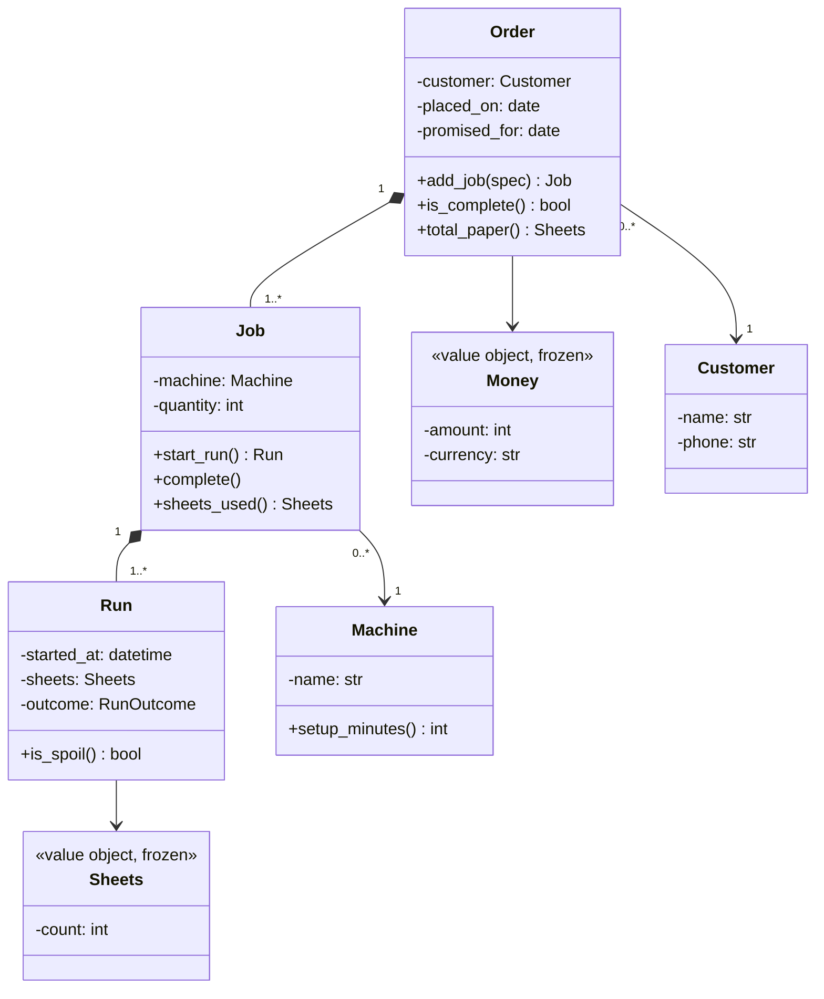

# Day 051 · System design — Modelling a real domain

**After today you can:** You can turn a page of product requirements into objects, fields and relationships.

**The interviewer asks it as:** *Here are the requirements. Model it.*

---

## 1. What this is, and why they ask it

**Domain modelling** is turning a description of how a business works into classes, fields and
relationships that hold its rules. Not a database schema — that comes later and is a different
question. A model: the things the business talks about, the invariants that must never be false, and
where each rule lives.

They ask it because it is the first ten minutes of every low-level design round, and because it is the
part that cannot be revised for. You have now met classes, encapsulation, inheritance, polymorphism,
abstraction and composition — six days of tools. Today is the day you are handed a paragraph and asked
to produce a model with them, under a clock, for a business you have never worked in. What separates
candidates is not tool knowledge. It is three habits: using the words the business uses, finding the
concept nobody named, and drawing the boundary around what must be consistent together.

---

## 2. The story

Kalyan finished his degree in June and started at his father's printing press in Sivakasi, and the
first month was worse than either of them expected.

The press does wedding cards, calendars, shop labels — four machines, eleven people, and his father
has run it since 1989.

The trouble was one word. Kalyan came in saying "order" for everything, because that is what a
customer places, and for four weeks he was wrong in a way nobody could quite explain to him.

In the press there are three words and they are not the same word.

An **order** is what the customer asked for. Mrs Fernandez wants four hundred wedding cards, two
hundred envelopes and a hundred small thank-you slips. One order.

A **job** is one thing set up on one machine. Those cards are one job on the big machine. The
envelopes are a second job, and the slips a third, and they go on different machines on different
days, because setting up a machine takes forty minutes and you do not do it twice for the same thing.
One order, three jobs.

A **run** is one pass of a job through the machine. The card job is one run if everything goes well,
and it is four runs if the paper jams twice and somebody notices the alignment is off.

For four weeks Kalyan answered the phone and said "yes ma'am, your order is done" because a job had
come off the machine, and twice a customer arrived and only the envelopes were ready.

Then there was the thing nobody had a word for at all.

When a run goes wrong, they run it again. That second run is not a new order — the customer asked for
nothing new. It is not really a new job either, because nothing was set up again. But it eats paper,
it eats machine time, and it is the difference between a profitable month and a flat one. For
twenty-five years it lived in his father's head as a feeling about whether the month had gone well.

Kalyan gave it a name in September. He called it a spoil, because that is what the men on the floor
had always called the wasted sheets, and he started counting spoils per job. His father looked at
three months of it and moved the calendar work to the other machine, and that was worth about eleven
thousand rupees a month.

The word already existed on the floor. It had just never made it as far as the office.

---

## 3. The idea in plain English

Kalyan's four weeks are what happens when you model with your own words instead of the business's.
Order, job and run are the **entities**. The spoil is the concept the requirements never mentioned,
and it is where the value was. And the fact that the men on the floor already had the word is the whole
of what "use the domain's language" means.

### The procedure

Six steps, in order, and the order matters because each one depends on the last.

**Step one: collect the nouns and verbs, in the business's words.** Underline them as they are
written. If the requirements say "consignment", your class is `Consignment`, not `Shipment`, even if
`Shipment` is what you would have called it.

That habit has a name — the **ubiquitous language**, a single vocabulary shared by the code, the
conversation and the business. It is not pedantry. When the code says `Shipment` and the operations
team says "consignment", every conversation between them costs a translation, and eventually somebody
translates wrongly. Kalyan's four weeks were exactly that cost.

**Step two: separate entities from value objects.**

- An **entity** has an identity that persists while everything about it changes. A `Job` is the same
  job after it is rescheduled, reprinted and renamed. Entities are usually mutable and compare by id.
- A **value object** is defined entirely by its values. `Money(400, "INR")` is interchangeable with any
  other four hundred rupees. Value objects should be **frozen**, compare by value, and are safe to
  share and hash.

The test, from [day 044](../day-044-first-and-last-occurrence/README.md): *would I care which one I
got?* Two four-hundred-rupee amounts, no. Two jobs, yes.

Getting this wrong is expensive in a specific way: an entity treated as a value loses its history, and
a value treated as an entity gets an id nobody needs and an equality that surprises people.

**Step three: find the noun that is not in the paragraph.** This is the step that produces good models,
and it is the one candidates skip.

The requirements describe *things*. The interesting concepts are usually the *relationships between
things*, and nobody writes those down because everyone in the business already knows them.

```
"members borrow books"                     -> Loan       (nobody said the word)
"a customer books a seat for a show"       -> Booking
"a vehicle parks in a spot"                -> Ticket
"an order is printed"                      -> Job, Run, and Kalyan's Spoil
```

Every one of those is where the dates, the state and the money live. A model without `Loan` has to
put the due date on `Copy`, which means a copy remembers only its current loan and history is gone.
**When a rule has nowhere to live, you have found a missing class.**

**Step four: write the invariants, as sentences.** Two to four, in plain English:

> An order is complete when all its jobs are complete.
> A run belongs to exactly one job.
> The paper used by a job is the sum of its runs, including spoils.

These do two things. They tell you where behaviour goes — the object that owns the data an invariant
needs owns the method that enforces it. And they tell you where the boundaries go, which is step five.

**Step five: draw the aggregate boundaries.** An **aggregate** is a cluster of objects treated as one
unit for consistency. One class in it is the **root**, and the rule is:

> **Everything outside the aggregate holds a reference to the root only. All changes go through the
> root, and the root enforces the invariants that span the cluster.**

For the press, `Order` is a root and its `Job`s are inside it. Nothing outside reaches into a job to
change its state; it asks the order. That is why "an order is complete when all its jobs are complete"
can be guaranteed — there is one door, exactly as
[day 045](../day-045-rotated-array-search/README.md) argued.

Keep aggregates small. If your `Order` aggregate contains customers, invoices and the entire price
list, then everything is one aggregate and the boundary means nothing.

**Step six: put each verb on the class that owns the data it needs.** The rule from
[day 044](../day-044-first-and-last-occurrence/README.md), unchanged: `member.borrow()`,
`loan.late_fee(returned_on)`, `order.is_complete()`. If a rule fits nowhere, go back to step three —
it is usually a missing class rather than a service.

### The same word meaning two things

One more idea, and it is the one that separates a good answer from a very good one.

In a large business the same word means different things in different parts of it. To sales, a
"customer" is a lead with a pipeline stage. To support, a "customer" is an account with a ticket
history. To billing, it is a payment method and an address. Forcing one `Customer` class to serve all
three gives you a class with forty fields, most of them null most of the time.

The name for the boundary between those worlds is a **bounded context**: each context gets its own
model of "customer", and they are linked by an id rather than merged. In a forty-five-minute interview
you will not build several contexts — but noticing out loud that *"'customer' means something
different to billing than it does to support, and I'd keep those as separate models linked by id"* is a
strong signal, and it takes one sentence.

### What not to do

- **Do not design the database.** No foreign keys, no `BIGSERIAL`, no indexes. That is a different
  question and answering it here means you have misread the round —
  [day 043](../day-043-binary-search-without-bugs/README.md)'s wrong-round warning.
- **Do not model what was not asked for.** Loyalty points, refunds and audit logs are scope you chose
  to add.
- **Do not use your own words** where the business has its own. Say `Spoil` if they say spoil.
- **Do not produce fields with no behaviour.** That is the anaemic model, and six days of this phase
  have been about avoiding it.

---

## 4. The picture

The press, modelled — and the aggregate boundary drawn, which is the part most diagrams omit:



**What to notice:** `Run` is inside the `Order` aggregate, two levels down. Nothing outside the order
ever holds a `Run` — if the shop floor wants to record a spoil, it goes
`order.job(id).start_run()`. That is what makes "the paper used by an order is the sum of its runs"
enforceable rather than hopeful.

The aggregate boundary, drawn plainly:

```
   +==========================================+
   |            ORDER  (the root)             |     <- one door in
   |                                          |
   |   Job ---- Job ---- Job                  |     everything outside holds
   |    |        |        |                   |     a reference to Order ONLY
   |   Run      Run      Run, Run(spoil)      |
   +==========================================+
        |                        |
        v                        v
    Customer                  Machine
   (its own aggregate,       (its own aggregate,
    referenced by id)         referenced by id)

  inside  : full object references, changed only through the root
  outside : an id, never a direct reference
```

**What to notice:** `Customer` and `Machine` are outside. They have their own lifecycles — a customer
exists before any order and after all of them — so they are separate aggregates referenced by id.
Pulling them inside would make every order load a customer's entire history.

---

## 5. How it actually works

### A worked example, start to finish

Requirements, of the kind you will be handed:

> *A courier company collects parcels from senders and delivers them to recipients. A pickup can
> collect several parcels from one sender. Parcels travel between hubs and each movement is recorded.
> A parcel can be attempted for delivery up to three times; after that it is returned to the sender.
> Customers are quoted a price at booking, based on weight and distance.*

**Step one, the nouns in their words:** parcel, sender, recipient, pickup, hub, movement, attempt,
return, quote, weight, distance. Verbs: collect, deliver, travel, record, attempt, return, quote.

**Step two, entities against values:**

```
entities (identity persists):   Parcel, Pickup, Hub, Shipment, DeliveryAttempt
value objects (frozen):         Weight, Money, Address, TrackingNumber, Distance
not classes at all:             "three times" is a rule, not a thing
```

`Address` as a value object is the decision worth defending: two identical addresses are
interchangeable, and freezing it means a parcel's delivery address cannot be mutated from a distance.

**Step three, the nouns that are not in the paragraph:**

```
Movement / Leg   -- "parcels travel between hubs and each movement is recorded".
                    The movement is a THING: from hub, to hub, departed at, arrived at.
                    Without it, a parcel can only remember where it is now.

Quote            -- named, but easy to miss as a class. It has a price, the inputs that
                    produced it, and a time it was valid at. Without it, "why were we
                    charged this?" is unanswerable three months later.

Route            -- never mentioned. Whether you need it depends on whether the sequence
                    of movements is planned in advance or emerges. Ask.
```

**Step four, the invariants:**

> A parcel is at exactly one hub, or in transit on exactly one movement, at any time.
> A parcel has at most three delivery attempts; the third failure returns it.
> A quote's price never changes after the booking accepts it.

That third one immediately tells you `Quote` is a frozen value snapshot, not a live calculation —
which is [day 029](../day-029-read-write-pointer/README.md)'s snapshot rule arriving in object form.

**Step five, the aggregates:**

```
Parcel (root)  ---- Movement, DeliveryAttempt      one consistency boundary:
                                                   "at most three attempts" is enforced here

Pickup (root)  ---- references parcels by id       a pickup groups parcels; it does not own them

Hub (root)                                         its own lifecycle entirely
```

The key decision: a `Movement` belongs inside `Parcel` because the "exactly one location" invariant
spans them. A `Pickup` references parcels **by id** rather than containing them, because a parcel
outlives its pickup and belongs to the delivery process afterwards.

**Step six, the behaviour:**

```python
class Parcel:
    def attempt_delivery(self, at: datetime, outcome: AttemptOutcome) -> None:
        if self.is_returned:
            raise ValueError("parcel has already been returned to sender")
        self._attempts.append(DeliveryAttempt(at, outcome))
        if outcome is AttemptOutcome.FAILED and len(self._attempts) == 3:
            self._begin_return()          # the rule lives with the data it needs
```

The three-attempt rule sits on `Parcel` because `Parcel` is the only object that knows how many
attempts there have been. Put it in a `DeliveryService` and the bulk-import path will forget it.

### The names to know

These are the standard vocabulary and using them correctly is worth real credit:

- **Entity** — identity persists through change. Compare by id.
- **Value object** — defined by its values. Frozen, compare by value, safe to share.
- **Aggregate** and **aggregate root** — a consistency boundary and its single door.
- **Repository** — the thing that loads and saves an aggregate root: `OrderRepository.get(id)`,
  `.save(order)`. One repository per aggregate root, never one per class. This is also where
  [day 048](../day-048-binary-search-on-floats/README.md)'s interface argument pays off — the
  repository is an interface, with a Postgres implementation and an in-memory fake.
- **Domain service** — for a rule that genuinely belongs to no single entity, such as pricing that
  needs a rate card and a distance table. It is the *last* resort, not the first, and the test is
  whether you tried step three properly.
- **Ubiquitous language** and **bounded context** — the vocabulary rule and its boundary.

These come from Eric Evans' *Domain-Driven Design*, and knowing where the words come from is worth a
sentence if the interviewer uses them.

### The order to speak in

```
minutes 0-2    read back the nouns and verbs IN THE BUSINESS'S WORDS, and ask 3-4 questions
minutes 2-4    entities and value objects, split with the "would I care which one I got" test
minutes 4-6    the missing noun -- name it, and say what has nowhere to live without it
minutes 6-8    the invariants, two to four, as sentences
minutes 8-11   the aggregates: which root, and what is referenced by id from outside
minutes 11-15  behaviour on the classes, one rule placed out loud with its reason
```

Fifteen minutes, and the remaining thirty are code and the extension question.

---

## 6. The numbers

### Model size, and what it means when it is wrong

```
a 45-minute round:                6-10 classes
    fewer than 5    -> under-modelled; the missing noun is usually why
    more than 15    -> you modelled scope nobody asked for

per class:
    fields          3-6           more than ~10 is two classes
    methods         2-5           more than ~8 is two classes
    invariants      1-3

aggregates in a model of this size:  2-4 roots
    1 root  -> everything is one aggregate; the boundary means nothing
    6+ roots-> probably one per class, which is also no boundary
```

### The cost of the wrong word

Kalyan's four weeks, priced the way it actually shows up:

```
one mistranslated term ("order" for "job"):
    ~2 wrong answers per week to customers x 4 weeks     = ~8 incidents
    each one: a phone call, an apology, sometimes a redelivery

in code, the same mistake:
    every conversation between engineering and operations pays a translation
    every new joiner learns two vocabularies
    the bug where the translation is wrong ships, because it reads correctly
```

The fix costs nothing at design time and is nearly impossible later: renaming a core domain concept
touches every file, every table, every dashboard and every conversation.

### The missing noun, priced

```
no Loan class:
    the due date goes on Copy         -> a copy remembers only its CURRENT loan
    loan history                      -> gone
    "how many times was this borrowed" -> unanswerable
    the late-fee rule                 -> lives in a service, at 3-4 call sites

adding Loan later:
    a data migration, plus every place that reads Copy.due_date        ~15-30 edits
adding Loan at design time:
    one class                                                          1 file
```

### Aggregate size, and why it matters at run time

```
Order aggregate containing Customer, and Customer containing all their Orders:
    loading one order -> loads the customer -> loads their 400 orders -> ...
    the classic accidental full-database load

Order referencing Customer BY ID:
    loading one order  = 1 order + its jobs and runs  ~ 20 objects
```

That is [day 041](../day-041-prefix-revision/README.md)'s N+1 arriving as a modelling decision rather
than as a query decision — and it is decided here, months before anyone looks at a query log.

---

## 7. The trade-offs

### A rich model against getting it built

Entities, value objects, aggregates and repositories are real structure and real time. *I would not
build a full domain model for a service that reads a table and returns JSON* — a CRUD service with no
invariants has nothing for a model to protect, and a dataclass plus a query is the honest answer. The
trigger is invariants: two or three rules that must never be false are what a model is for.

### The business's words against good names

Sometimes the business's word is genuinely bad — overloaded, or the same word for two things. *I would
still use their word*, and if it truly names two things I would say so and propose splitting it with
them rather than inventing a private vocabulary in the code. A model whose names differ from the
conversation costs a translation forever; a model that renames a concept *with the business's
agreement* is a one-time cost.

### Big aggregates against small ones

A large aggregate makes invariants easy — everything is inside one boundary, so consistency is free.
It also makes every load enormous and every write contend with every other write on the same root.
*I would keep aggregates as small as the invariants allow*, reference other aggregates by id, and
accept that a rule spanning two aggregates becomes eventually consistent — which is a real cost and
worth naming rather than hiding.

### Modelling reality against modelling what the software needs

The world is infinitely detailed and your model should not be. *I would not model a parcel's physical
dimensions if nothing prices or routes on them.* The test is not "is this true of the real thing?" but
"does any rule in this system depend on it?" Kalyan's spoil earned its class because eleven thousand
rupees a month depended on counting it.

### The honest sentence

> A domain model is worth building when the business has rules that must never be broken, and it is
> ceremony when it does not. What makes it good is not the number of classes — it is that the words
> match the ones people say out loud, that the concept nobody named has a home, and that every rule
> has exactly one place it can be enforced.

---

## 8. In the interview

### How it gets asked

- *"Here are the requirements. Model it."* — a paragraph, and fifteen minutes before code.
- *"What are the main entities?"* — the shorter version, often the opening of a bigger design round.
- *"Where does that rule live?"* — asked halfway through, about a specific requirement. This is the
  scored question.
- *"What would you call this?"* — a check on whether you are using their vocabulary or your own.

### What to say out loud, in the first ninety seconds

1. **Read the nouns back in their words.** *"Let me play back the vocabulary: parcel, pickup, hub,
   movement, attempt, quote. I'll use those names exactly, even where I'd have picked different
   ones."*
2. **Ask the three or four questions that change the model.** *"Is a pickup always from one sender? Is
   the route planned in advance or does it emerge? Does the quote's price ever change after booking?
   And does a parcel ever split across movements?"*
3. **Split entities from values, with the test.** *"`Parcel` and `Hub` are entities — identity persists.
   `Weight`, `Money` and `Address` are value objects, frozen, compared by value. The test is whether
   I'd care which one I got: two identical addresses, no; two parcels, yes."*
4. **Name the missing noun and say what it rescues.** *"`Movement` isn't in the requirements as a
   thing, but 'each movement is recorded' means it is one — from hub, to hub, departed, arrived.
   Without it a parcel can only remember where it is now, and the tracking history has nowhere to
   live."*
5. **State two or three invariants as sentences**, then use them to draw the boundary.
6. **Place one rule out loud, with the reason.** *"Three attempts then return goes on `Parcel`, because
   `Parcel` is the only object that knows how many attempts there have been."*

### The follow-ups

**"Where does that rule live, and why not in a service?"**
On the object that owns the data the rule reads and writes — that is the test I apply every time. The
three-attempt rule needs the count of attempts and the parcel's returned status, and only `Parcel` has
both, so it goes on `Parcel.attempt_delivery`. If I put it in a `DeliveryService` instead, the rule
lives at a call site, and then the courier app calls it, and the hub scanner calls it, and the bulk
import script calls it — three copies of one rule, and the one somebody forgets is the one that ships,
with no error at the moment it breaks. That is the anaemic model, and it is objects in name only. A
domain service is legitimate, but only for a rule that genuinely belongs to no single entity —
pricing that needs a rate card and a distance table, for instance, where neither the parcel nor the
route owns the inputs. My rule is that a service is the last resort, and before reaching for one I go
back and ask whether the rule is telling me about a class I have not created yet. Nine times out of
ten it is.

**"You've invented a class the requirements never mentioned. Justify it."**
Because a rule and some data had nowhere to live, and that is the strongest signal in modelling. The
requirements say "parcels travel between hubs and each movement is recorded". If `Movement` is not a
class, then recording a movement means writing to fields on `Parcel` — a `current_hub`, maybe a
`departed_at` — and the moment I do that, the parcel remembers only where it is *now*. There is no
history, so "where has this been" and "how long did the Coimbatore leg take" are unanswerable, and
those are exactly the questions a courier company asks. So `Movement` is a class with a from-hub, a
to-hub, a departure and an arrival, and the parcel holds a list of them. This is the same pattern as
`Loan` in a library and `Ticket` in a car park — the interesting class is usually the *relationship*
between two things, and nobody writes it down because everyone in the business already knows it is
there. The check I use is: is there a rule, a date or an amount of money that has no home? If yes,
that is a missing class, not a missing field.

**"How do you decide what goes inside an aggregate and what is referenced by id?"**
By the invariants, and only by the invariants. An aggregate is a consistency boundary, so things go
inside it when a rule spans them and must hold at every moment. "A parcel has at most three delivery
attempts" spans the parcel and its attempts, so attempts are inside the parcel's boundary, and nothing
outside ever holds a reference to an attempt — changes go through the parcel, which is the one door
that can enforce the rule. `Customer` is different: no invariant spans a parcel and a customer, and a
customer exists before any parcel and after all of them, so it is its own aggregate referenced by id.
There are two costs to getting that wrong and they pull opposite ways. Make the aggregate too big —
pull `Customer` inside, and their four hundred other parcels come with it — and loading one parcel
loads the database, which is the N+1 problem decided at design time rather than in a query log. Make
it too small and a rule that must be atomic now spans two boundaries, which means it becomes
eventually consistent and I have to say so out loud rather than pretend it is guaranteed. So: as small
as the invariants allow, and reference everything else by id.

### A model answer

> "Let me play the vocabulary back first, because I want to use their words rather than mine.
>
> Nouns: parcel, sender, recipient, pickup, hub, movement, attempt, quote. Verbs: collect, deliver,
> travel, record, attempt, return, quote. If the business says 'consignment' rather than 'parcel', I'd
> use consignment — a model whose names differ from the conversation costs a translation forever.
>
> Four questions that would change the model: is a pickup always from one sender? Is the route planned
> in advance or does it emerge from the movements? Can a quote's price change after booking? And does
> a parcel ever split?
>
> Now the split. Entities, where identity persists through change: `Parcel`, `Hub`, `Pickup`. Value
> objects, frozen and compared by value: `Weight`, `Money`, `Address`, `TrackingNumber`. The test is
> whether I'd care which one I got — two identical addresses are interchangeable, two parcels are not.
>
> Then the class that isn't in the requirements, which is where the interesting part usually is. The
> line 'each movement is recorded' means `Movement` is a thing: from hub, to hub, departed at, arrived
> at. Without it, a parcel can only hold a `current_hub` field, so it remembers where it is and not
> where it has been — and 'where has this parcel been' is the single most common question a courier
> company gets asked. The same shape as `Loan` in a library or `Ticket` in a car park: the valuable
> class is the relationship, and nobody writes it down because everyone in the business already knows
> it.
>
> Three invariants, as sentences. A parcel is at exactly one hub or on exactly one movement at any
> time. A parcel gets at most three delivery attempts, and the third failure returns it. A quote's
> price never changes once the booking accepts it — which tells me `Quote` is a frozen snapshot rather
> than a live calculation.
>
> Those invariants draw the boundaries. `Parcel` is an aggregate root, with `Movement` and
> `DeliveryAttempt` inside it, because both those rules span the parcel and its parts. `Hub` and
> `Customer` are separate roots referenced by id — no invariant spans them, and pulling a customer
> inside would mean loading one parcel drags in their entire history.
>
> Behaviour goes with the data. `Parcel.attempt_delivery(at, outcome)` owns the three-attempt rule,
> because `Parcel` is the only object that knows the count. In a `DeliveryService` it would be
> duplicated across the courier app, the hub scanner and the import script, and the one somebody
> forgets is the one that ships.
>
> One thing I'd flag before coding: 'customer' probably means something different to billing than to
> operations. I'd keep those as separate models linked by an id rather than one class with forty
> fields."

---

## 9. Recall card

- **Six steps, in order:** nouns and verbs *in the business's words* → entities vs value objects →
  **the noun nobody wrote down** → invariants as sentences → aggregate boundaries → behaviour on the
  class that owns the data.
- **Use their vocabulary — the ubiquitous language.** `Consignment` if they say consignment, `Spoil`
  if the floor says spoil. A model whose names differ from the conversation costs a translation
  forever, and renaming later touches everything.
- **The missing noun is where the value is:** `Loan`, `Ticket`, `Movement`, `Booking`, `Quote`. The
  test — *is there a rule, a date or an amount of money with no home?* If yes, that is a class, not a
  field.
- **An aggregate is a consistency boundary with one door.** Inside: things a rule spans; changes go
  through the root. Outside: **referenced by id**. Too big → loading one order loads the database; too
  small → an atomic rule becomes eventually consistent, and you must say so.
- **Entity = identity persists (compare by id, mutable). Value object = defined by its values (frozen,
  compare by value).** Test: *would I care which one I got?* A **domain service** is the last resort —
  reach for it only after checking you have not missed a class. 6-10 classes, 2-4 roots.
