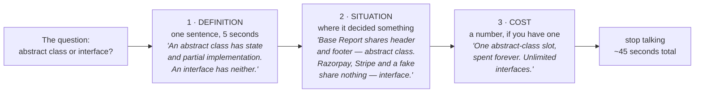
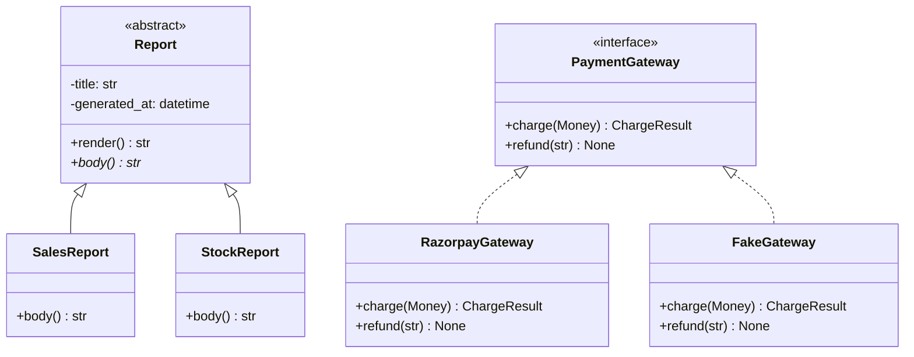

# Day 052 · System Design — Common object-oriented interview questions

**After today you can:** You can answer the standard OOP questions without reciting a textbook.

**The interviewer asks it as:** *What is the difference between an abstract class and an interface?*

---

## 1. What this is, and why they ask it

There is a fixed set of about a dozen object-oriented questions that get asked in almost every
interview at almost every product company. What are the four pillars. Abstract class or interface.
Overloading or overriding. Composition or inheritance. Encapsulation or abstraction. They are short
questions with short answers, and they come in a rapid-fire block, usually in the first fifteen
minutes of a design round or at the end of a coding round when there is time left over.

They ask them because they are cheap to ask and they separate people quickly. Everybody has read the
same textbook answer, so the definition itself carries no information — the interviewer learns
nothing from hearing "an interface is a contract". What they are listening for is the second half of
your answer: a situation where the choice actually mattered, and what went wrong when it was made
badly. You have spent nine days building that second half. [Day 043](../day-043-binary-search-without-bugs/README.md)
through [day 051](../day-051-why-sorting-matters/README.md) gave you encapsulation, inheritance,
polymorphism, abstraction, composition, diagrams and domain modelling. Today is about turning that
into answers that fit in forty-five seconds and do not sound memorised.

---

## 2. The story

Vignesh took his driving test in Coimbatore on a Tuesday morning in February, and he failed it, and
the reason he failed is the thing he still tells people about.

He had studied properly. He had the little booklet they give you, and he had been through it so many
times that he could recite whole lines of it. His cousin had tested him the night before and he got
every single one right.

The examiner was a tired man called Balan who had been doing this for eighteen years. Before they
even started the engine, sitting in the parked car with the door open and one foot on the ground,
Balan asked him one question. "When do you use the handbrake?"

Vignesh said the sentence from the booklet, more or less word for word: "The handbrake is used to
hold the vehicle stationary when it is parked."

Balan nodded and wrote something down and did not say anything about it. They drove for about twenty
minutes. Then, on the slope going up to the flyover near Gandhipuram, the light turned red and
Vignesh stopped halfway up the rise. When it went green he lifted his foot off the clutch and the car
rolled backwards, a foot, maybe a foot and a half, and the auto behind him leaned on his horn and
kept leaning on it, and Vignesh's hands went completely white on the wheel.

Balan did not say anything then either. He waited until they were back and parked and the engine was
off. Then he said: "You know what the handbrake is. You don't know what it's for."

Six weeks later Vignesh went back, and by chance he got Balan again, and Balan asked him the same
question in the same parked car. This time Vignesh said: "On a hill, mostly. You hold the car with
it, bring the clutch up to where it starts to bite, and then let it off — otherwise you roll back
into whoever is behind you. That happened to me on the flyover in February and I have not forgotten
it."

Balan laughed, which Vignesh was not expecting at all, and made a mark on his sheet, and they drove.
He passed. The words in the booklet had not changed. What had changed was that he had rolled
backwards into a horn.

---

## 3. The idea in plain English

Every one of the standard object-oriented questions is a handbrake question. There is a booklet
answer, which everybody has, and there is an answer from having rolled backwards, which almost nobody
gives. The interviewer is listening for the second one.

So learn every answer in three parts, and say all three:

1. **The definition**, in one sentence. You still need it. It takes five seconds.
2. **The situation** where the difference actually decided something.
3. **The cost** — what goes wrong if you choose the other one, ideally with a number.

That is roughly forty-five seconds of speech. Any longer and you are lecturing; any shorter and you
have only given the booklet.

Below are the questions, with all three parts. Each one leans on a day you have already done, so
these are not new ideas — they are the same ideas compressed into interview shape.

### "What are the four pillars of OOP?"

**Definition.** Encapsulation, abstraction, inheritance, polymorphism.

Say them, then immediately say which two do the work. **Encapsulation** is keeping the data and the
rules that protect it in one place so the rule cannot be broken from outside
([day 045](../day-045-rotated-array-search/README.md)). **Abstraction** is exposing what something
can do and hiding how ([day 048](../day-048-binary-search-on-floats/README.md)). **Inheritance** is
declaring that every B is an A ([day 046](../day-046-binary-search-on-the-answer/README.md)).
**Polymorphism** is calling one method on several types and getting each type's behaviour
([day 047](../day-047-minimise-the-maximum/README.md)).

**Situation.** In real code you use encapsulation and polymorphism constantly and inheritance
sparingly. Say that out loud — it is the sentence that shows you have written code rather than read
about it.

### "Encapsulation or abstraction — what is the difference?"

This is the one candidates muddle most, because the textbook definitions overlap.

**Definition.** Encapsulation is about **protecting state**: the balance cannot go negative because
the only way to change it runs a check. Abstraction is about **hiding mechanism**: the caller says
"charge this card" and does not learn which payment provider ran it.

**The one-liner that separates them:** *encapsulation hides data so a rule cannot be broken;
abstraction hides implementation so it can be replaced.*

**Cost.** Break encapsulation and the same rule appears at nine call sites and the tenth one ships
without it. Break abstraction and swapping payment providers touches sixty files instead of one.

### "Abstract class or interface — which and why?"

**Definition.** An **abstract class** is a partly-built class: it can hold fields, constructors and
working methods, and it declares some methods that subclasses must fill in. You cannot create one
directly. An **interface** is a pure list of method signatures with no state and no implementation —
a contract that says what a type can do.

**The rule that decides it.** An abstract class says **"is a kind of"**; an interface says **"is able
to"**. A `SavingsAccount` *is a kind of* `Account` — abstract class. A `SavingsAccount` *is able to be*
`Exportable` — interface.

**Situation.** Reach for an abstract class when there is genuine shared code that every subclass
needs and you want to write it once: a base `Report` that handles the header, the footer and the
timestamp, and leaves `body()` abstract. Reach for an interface when several unrelated types need to
be usable in the same slot: `PaymentGateway` implemented by Razorpay, Stripe and an in-memory fake,
which have nothing else in common.

**Cost.** A class can inherit from only one abstract class in Java and C#, and that slot is spent
forever. It can implement any number of interfaces. So an abstract class is the expensive choice, and
the honest default is: **inherit interfaces, compose implementations**
([day 049](../day-049-peak-finding/README.md)).

**In Python.** There is no `interface` keyword. You get the same two things with `abc.ABC` plus
`@abstractmethod` for the abstract-class case, and `typing.Protocol` for the interface case — and
`Protocol` needs no inheritance at all, which is closer to what an interface really means. The
mechanics are in §5.

### "Overloading or overriding?"

**Definition.** **Overriding** is a subclass replacing a method it inherited — same name, same
arguments, different behaviour, decided when the program runs. **Overloading** is several methods
with the same name and different argument types in the same class, decided when the program is
compiled.

**Python has no overloading.** A second `def` with the same name simply replaces the first. Say this
plainly — interviewers ask it precisely to see whether you know your own language:

```python
class Bill:
    def total(self, items): ...
    def total(self, items, discount): ...   # this REPLACES the one above
```

The Python answers are default arguments, `*args`, or `functools.singledispatch` when you genuinely
need behaviour to vary by argument type.

**Cost.** Nothing warns you. The first `total` is gone, and every call to it fails at runtime with a
`TypeError` about argument count.

### "Composition or inheritance?"

**Definition.** Inheritance welds a variant into the type. Composition holds it as an object you can
swap.

**Situation and the number.** This is the one where arithmetic wins the point. Three vehicle types ×
two fuel types × two trailer options × three ownership models is **3 × 2 × 2 × 3 = 36 classes** with
inheritance, and **3 + 2 + 2 + 3 = 10** with composition. Inheritance multiplies axes; composition
adds them. A new fuel type is six new classes against one.

**When inheritance is still right.** Exception trees, abstract base classes used purely as contracts,
documented framework hooks, and genuine single-axis specialisation — all cases where the parent has
almost no implementation to inherit.

### "What is polymorphism? Give an example."

Do not define it. **Show it.** Write the `if` chain, then delete it:

```python
if vehicle.kind == "car":     fee = hours * 30
elif vehicle.kind == "bike":  fee = hours * 10
elif vehicle.kind == "truck": fee = hours * 60
```

```python
fee = vehicle.fee_for(hours)      # each type knows its own rate
```

**Cost, in edits.** Adding a van is one new file and one line of wiring, against four edits to code
that already works and is already tested. And the type tag has to go, or somebody rebuilds the switch
next quarter.

### "`==` or `is`? And what about `__hash__`?"

**Definition.** `is` asks whether two names point at the same object in memory. `==` asks whether two
objects are equal by whatever rule the class defines in `__eq__`. Default `__eq__` falls back to
identity, so without one, `==` and `is` do the same thing.

**The rule that gets tested.** If you define `__eq__` you must define `__hash__`, and both must be
built from fields that never change. Python quietly sets `__hash__` to `None` when you define
`__eq__` without it, so the object stops being usable as a dictionary key at all.

**Cost.** Hash on a mutable field, put the object in a set, then change that field, and the object
becomes unfindable in the set it is sitting in. No error — it is simply looked for in the wrong
place.

### "Static method, class method, or instance method?"

**Definition.** An **instance method** takes `self` and needs one particular object. A **class
method** takes `cls`, belongs to the class, and is usually an alternative constructor. A **static
method** takes neither and is a plain function that lives inside the class for tidiness.

```python
class Money:
    def __init__(self, paise: int) -> None:
        self.paise = paise

    def add(self, other: "Money") -> "Money":       # instance: needs this object
        return Money(self.paise + other.paise)

    @classmethod
    def from_rupees(cls, rupees: float) -> "Money": # class: another way to build one
        return cls(round(rupees * 100))

    @staticmethod
    def is_valid_currency(code: str) -> bool:       # static: needs nothing
        return code in {"INR", "USD", "EUR"}
```

**The tell.** If a static method is doing real work with the object's data, it is an instance method
in disguise, and that is usually a symptom of the anaemic model
([day 044](../day-044-first-and-last-occurrence/README.md)).

### "What is the diamond problem?"

**Definition.** Class D inherits from B and C, both of which inherit from A. If B and C both override
a method, which one does D get? Java forbids multiple inheritance of classes to avoid the question
entirely. Python allows it and answers it with a defined order.

**The Python answer.** The **method resolution order** — `D.__mro__` — is computed by a rule called
C3 linearisation, and `super()` follows that order rather than jumping straight to a parent. Show the
mechanics if asked (§5), then say the honest thing: **in production you avoid the situation.** Use
one base class and compose the rest, or use mixins that touch disjoint methods.

---

## 4. The picture

The shape of a good answer, which is the same shape every time:



**What to notice:** almost every candidate delivers box one and stops. Boxes two and three are the
whole difference, and they are short. The last box is a real instruction — over-answering a rapid-fire
question is its own failure mode.

The two Python mechanisms that answer "abstract class or interface", side by side:



**What to notice:** the abstract class carries fields and a working `render()` — the solid triangle
means the subclasses inherit real code. The interface carries nothing but signatures, and the dashed
triangle means "implements". `RazorpayGateway` and `FakeGateway` are not kinds of anything; they are
merely both *able to* charge, and that is why the interface is right for them.

Where each question lives on the map you have already drawn:

```
  STATE ---------------------------------------------- BEHAVIOUR

  encapsulation      abstraction        inheritance      polymorphism
  "cannot break      "can replace       "is a kind of"   "one call,
   the rule"          the mechanism"                      many types"
       |                   |                  |                |
   private fields      interfaces        abstract classes   overriding
   @property           Protocol          super(), MRO       duck typing
   invariants          adapters          the diamond        singledispatch
       |                   |                  |                |
   day 045             day 048            day 046           day 047
```

**What to notice:** the twelve questions are four ideas asked four ways each. If you can place a
question on this line, you already know which day's argument answers it.

---

## 5. How it actually works

### Abstract base classes in Python

```python
from abc import ABC, abstractmethod

class Report(ABC):
    def __init__(self, title: str) -> None:
        self.title = title                       # state: interfaces cannot do this

    def render(self) -> str:                     # shared implementation, written once
        return f"=== {self.title} ===\n{self.body()}\n--- end ---"

    @abstractmethod
    def body(self) -> str:                       # subclasses must supply this
        ...
```

The enforcement is real and it happens early:

```python
class BrokenReport(Report):
    pass

BrokenReport("Q3")
```

```
Traceback (most recent call last):
  File "day52.py", line 15, in <module>
    BrokenReport("Q3")
TypeError: Can't instantiate abstract class BrokenReport without an implementation
for abstract method 'body'
```

That failure happens at **construction**, not when `body()` is eventually called in production. It is
the strongest argument for `ABC` over a bare base class that raises `NotImplementedError` in the
body: the bad object never comes into existence.

This is exactly how Python's own `collections.abc` works. `MutableMapping` gives you `get`, `pop`,
`setdefault`, `items`, `keys`, `update` and more for free, and demands five methods from you:
`__getitem__`, `__setitem__`, `__delitem__`, `__iter__` and `__len__`. Django's `Model` and
`BaseCommand` are the same idea at a larger scale — a partly-built class with named holes.

### Interfaces in Python: `typing.Protocol`

```python
from typing import Protocol

class PaymentGateway(Protocol):
    def charge(self, amount_paise: int, token: str) -> str: ...
    def refund(self, charge_id: str) -> None: ...
```

```python
class RazorpayGateway:                       # note: inherits from NOTHING
    def charge(self, amount_paise: int, token: str) -> str: ...
    def refund(self, charge_id: str) -> None: ...

def checkout(gateway: PaymentGateway, amount_paise: int, token: str) -> str:
    return gateway.charge(amount_paise, token)
```

`RazorpayGateway` satisfies `PaymentGateway` without importing it or inheriting from it. That is
**structural typing** — the type checker matches on the shape of the methods rather than on a
declared relationship. It is what people mean by **duck typing**
([day 047](../day-047-minimise-the-maximum/README.md)) made checkable, and it is how Go's interfaces
work too.

The practical difference:

```
 abc.ABC + @abstractmethod   checked at construction time, at runtime
                             the implementer must import and inherit
                             can carry fields and working methods
                             use when: "is a kind of", and there is real shared code

 typing.Protocol             checked by mypy or pyright, before the code runs
                             the implementer knows nothing about you
                             signatures only
                             use when: "is able to", and the implementers are unrelated
```

### Method resolution order, and what `super()` really does

```python
class A:
    def who(self) -> str: return "A"
class B(A):
    def who(self) -> str: return "B -> " + super().who()
class C(A):
    def who(self) -> str: return "C -> " + super().who()
class D(B, C):
    pass

print(D().who())
print([c.__name__ for c in D.__mro__])
```

```
B -> C -> A
['D', 'B', 'C', 'A', 'object']
```

Read that output carefully, because it surprises people. `B.who` calls `super().who()`, and `super()`
inside `B` does **not** mean "my parent `A`". It means "the next class after `B` in `D`'s resolution
order", which is `C`. The order is a property of `D`, not of `B`.

That is the diamond problem, answered. Every class appears once, subclasses come before their
parents, and the order you listed the bases in is preserved. Java sidesteps it by allowing only one
parent class; C++ makes you say `virtual` and think about it.

The honest interview answer: know that `__mro__` exists and that `super()` follows it, then say you
avoid deep multiple inheritance in production and use composition instead.

### Shallow copy and deep copy

Asked constantly, and it is a two-line demonstration:

```python
import copy

original = {"tags": ["new", "sale"], "price": 100}
shallow = copy.copy(original)
deep = copy.deepcopy(original)

original["tags"].append("clearance")
print(shallow["tags"])      # ['new', 'sale', 'clearance']   <- shared list
print(deep["tags"])         # ['new', 'sale']                <- its own list
```

`copy.copy` duplicates the outer container and keeps the same inner objects. `copy.deepcopy` walks
the whole structure. The one to say out loud: **returning a shallow copy of your internal list is not
encapsulation** — the caller still holds your inner objects and can mutate them.

### `__eq__` and `__hash__` together

```python
from dataclasses import dataclass

@dataclass(frozen=True)          # frozen=True gives __eq__ AND __hash__
class Money:
    paise: int
    currency: str

@dataclass(eq=True)              # eq without frozen: __hash__ becomes None
class Cart:
    items: list[str]

print(hash(Money(1000, "INR")))
print(hash(Cart(["a"])))
```

```
-1806852253442064055
Traceback (most recent call last):
  File "day52.py", line 14, in <module>
    print(hash(Cart(["a"])))
          ~~~~^^^^^^^^^^^^^
TypeError: unhashable type: 'Cart'
```

Python does this deliberately. An object whose equality can change must not be a dictionary key,
because the dictionary would look for it in the wrong place. Value objects get `frozen=True`;
entities compare on an unchanging id ([day 044](../day-044-first-and-last-occurrence/README.md)).

---

## 6. The numbers

### The shape of the round

```
 A 45-minute low-level design round at a product company:

   0-15 min   rapid-fire OOP questions       8 to 12 questions
  15-40 min   one design problem
  40-45 min   your questions

  12 questions in 15 minutes = 75 seconds per question,
  including the interviewer asking it and typing a note.

  Your speaking budget: 40 to 50 seconds. About 120 words.
```

Time your answers against that. The commonest failure is not a wrong answer; it is a ninety-second
answer to a fifteen-second question, which costs you three of the remaining questions and reads as
not knowing what matters.

### What a definition-only answer costs

```
 12 questions, 3 marks each:
   1 · the definition
   1 · a situation where it mattered
   1 · the cost of the other choice

 booklet answers only     : 12 x 1 = 12 / 36   -> "knows the theory"
 definition + situation   : 12 x 2 = 24 / 36   -> "has written some code"
 all three                : 12 x 3 = 36 / 36   -> "has maintained code"

 The gap between the first and the last is not knowledge. It is 25 extra
 words per answer.
```

### The abstract-class slot, priced

```
 Java / C#:  1 superclass per class, unlimited interfaces.

 A class hierarchy 4 levels deep, and the team later needs a shared
 Auditable capability across 11 unrelated classes:

   as an abstract class  : impossible for 9 of the 11 -- their one slot is spent.
                           The fix is a refactor of the whole hierarchy.
   as an interface       : 11 x 1 line = 11 lines, no hierarchy touched.
```

### The `__hash__` mistake, priced

```
 A set of 10,000 orders, keyed on a hash built from a mutable status field.

 correct hash   : lookup touches ~1 bucket        -> 1 comparison,   O(1)
 mutated field  : the object is in bucket 4,193
                  but now hashes to bucket 7,812  -> NOT FOUND, silently

 "order in orders" returns False for an order that is standing in the set.
 Nothing raises. The bug is found weeks later, in the data.
```

### The composition arithmetic, which wins the argument

```
 Vehicle types 3 · fuel types 2 · trailer 2 · ownership 3

 inheritance : 3 x 2 x 2 x 3 = 36 classes.  A new fuel type: +18 classes.
 composition : 3 + 2 + 2 + 3 = 10 classes.  A new fuel type: +1 class.
```

Say the numbers rather than the principle. "Inheritance multiplies the axes, composition adds them"
is a sentence; thirty-six against ten is an argument.

---

## 7. The trade-offs

### The booklet answer is not always wrong

There is a real case for the short, textbook answer: an early telephone screen, run by a recruiter or
a junior engineer working from a checklist, where the person opposite is matching your words against
a list. Give the definition cleanly, add one sentence of situation, and stop. Reading the room is part
of the skill. The three-part answer is for an engineer who will work with you.

### Abstract class: what you give up

You give up the one inheritance slot, and you give up the freedom of implementers to be unrelated to
you. You gain shared code written once and enforcement at construction.

**I would not use an abstract class if** the implementations have nothing in common except the
method names, or if any of them is a type I do not own — a third-party class cannot be made to
inherit from my base. Then it is an interface, and in Python a `Protocol`, which the implementer does
not even have to know exists.

### Interface: what you give up

You give up shared implementation. Every implementer writes its own version of everything, and if
eight of them need the same helper, you have eight copies or an awkward mixin. You also give up
runtime enforcement in the `Protocol` case — nothing stops a wrong object at construction; you find
out when the type checker runs, or when the method is called.

**I would not use an interface if** there is genuinely one way to do most of the work and only one
step varies. That is a base class with one abstract method, and pretending otherwise duplicates the
common part.

### Polymorphism: what you give up

Polymorphism makes new **types** cheap and new **operations** expensive. Adding a fifth vehicle type
is one file. Adding a sixth method to the interface is an edit to every implementation, including the
fakes in your tests.

**I would not replace the `if` chain if** the set of types is closed and will not grow — days of the
week, suits in a deck, HTTP methods — or if you are branching on a *value* rather than a type. The
trigger to refactor is the **second** place in the codebase switching on the same set of types.

### Multiple inheritance: what you give up

Comprehension. A method call in a four-parent class is no longer answerable by reading the class; you
have to run `__mro__` in your head. The rule that holds up in review: **at most one parent with
implementation; anything else must be a mixin whose methods do not collide.**

**I would not use multiple inheritance if** two parents both define the same method with real
behaviour. That is the diamond, and the fix is to hold one of them as a field instead of inheriting
it.

### The meta trade-off

Every one of these questions has a "correct" answer and a real answer, and the real answer usually
begins with "it depends on..." followed by the thing it actually depends on. That is not hedging, as
long as you then commit. **State the dependency, pick a side, and say what would change your mind.**
A candidate who answers "interface, unless there is shared implementation worth writing once, in
which case abstract class" has said more in eleven words than a paragraph of definition.

---

## 8. In the interview

### How it gets asked

- *"What's the difference between an abstract class and an interface?"* — the single most-asked OOP
  question at product companies. Expect a follow-up on which you would use for a specific case.
- *"What are the four pillars of OOP?"* — a warm-up. Do not spend two minutes on it. Name them,
  define two properly, and offer to go deeper.
- *"Does Python support method overloading?"* — a trap for people who learned OOP from Java notes.
  The answer is no, and then the three Python alternatives.
- *"Composition or inheritance? Why does everyone say prefer composition?"* — answer with the
  multiplication, not the principle.
- *"What's the difference between `==` and `is`?"* — nearly always followed by `__eq__` and
  `__hash__`.
- *"Give me an example of polymorphism from something you've built."* — the "from something you've
  built" is the whole question. Have one ready.

### What to say out loud, in the first ninety seconds

For any question in this block, run the same three beats and then stop.

1. **The definition, in one sentence.** *"An abstract class can hold state and working methods and
   declares some for subclasses to fill in. An interface is signatures only, no state."*
2. **The rule that decides between them.** *"Abstract class is 'is a kind of'. Interface is 'is able
   to'."*
3. **A situation you can name.** *"A base `Report` that owns the header and footer and leaves `body`
   abstract — that is an abstract class, because there is real shared code. `PaymentGateway`
   implemented by Razorpay, Stripe and an in-memory fake — that is an interface, because those three
   share nothing but the capability."*
4. **The cost.** *"A class gets one abstract-class slot and unlimited interfaces, so the abstract
   class is the expensive choice. My default is inherit interfaces, compose implementations."*
5. **Then stop, and let them ask the follow-up.** Silence after a complete answer is fine. Filling it
   is how a good answer becomes a rambling one.

### The follow-ups

**"You said Python has no `interface` keyword. So how do you do it?"**
Two mechanisms, and they are for different situations. The first is `abc.ABC` with `@abstractmethod`,
which is really the abstract-class case: the implementer inherits from my base, gets whatever shared
code I put there, and Python refuses to construct a subclass that has not implemented every abstract
method — the `TypeError` fires at construction rather than when the method is eventually called,
which is the point of using it. The second is `typing.Protocol`, and that is the true interface. The
implementing class inherits from nothing and does not import my module at all; a type checker matches
on the shape of the methods. That is structural typing, which is the same thing Go's interfaces do,
and it is duck typing made checkable. I reach for `Protocol` when the implementers are unrelated or
not mine — I cannot make a third-party class inherit from my base, but I can declare a `Protocol` it
already satisfies. I reach for `ABC` when there is real shared implementation worth writing once, and
when I want the failure at construction time rather than at type-check time. The one thing I would
not do is write an abstract class with no implementation in it at all; that is an interface wearing
the wrong costume, and it spends the subclass's only inheritance slot for nothing.

**"Does Python support method overloading? What happens if I define two methods with the same name?"**
No, and what happens is that the second definition silently replaces the first — the class body is
just executed top to bottom, and the name ends up bound to whichever `def` ran last. There is no
warning, and the failure shows up at the call site as a `TypeError` about the number of arguments,
which is a confusing place to find it. The three things I would do instead depend on the case. If the
variants differ by an optional value, default arguments — `def total(self, items, discount=0)`. If
they differ by count, `*args`, though I would be suspicious of a method that genuinely wants two
different shapes of input. And if the behaviour genuinely has to vary by argument *type*, then
`functools.singledispatch`, which registers separate implementations per type and dispatches on the
first argument at runtime. There is also `typing.overload`, but that only declares signatures for the
type checker — the implementation is still one function, so it documents rather than dispatches.
Overriding is a different thing entirely and Python does support it fully: a subclass replaces an
inherited method, resolved at runtime, and that is the mechanism polymorphism is built on.

**"Give me a concrete example of when you chose composition over inheritance."**
The clearest one is modelling vehicles for a parking system. The first shape that occurs to everyone
is a subclass per kind of vehicle, and it survives exactly until a second axis appears. Once you have
three vehicle types and two fuel types you need six classes, because `ElectricTruck` and `DieselTruck`
are different subclasses. Add a trailer option and it is twelve, add three ownership models and it is
thirty-six — the class count is the *product* of the axes, so every new axis multiplies. With
composition it is a `Vehicle` that holds a size, a fuel system, a trailer and an ownership record:
three plus two plus two plus three, which is ten classes, and a new fuel type is one new class rather
than eighteen. The tell that made me change it was the class names — `ElectricTruck`,
`DieselTruck` — adjective-noun names are almost always two axes wearing one class. There is a second
payoff I would mention, which is testing: a composed object takes a `FakeFuelSystem` that reports zero
range, so I can test the empty-tank path by handing in an object, instead of building a real vehicle
and reaching past encapsulation to set up the case. Separately constructible means separately
testable. I still use inheritance, but for the narrow cases — exception hierarchies, abstract base
classes used as contracts, framework hooks that are documented as such.

### A model answer

> "An abstract class and an interface both let a caller depend on a capability rather than a concrete
> type, but they differ in what they can carry. An abstract class can hold fields, a constructor and
> fully working methods, and it declares some methods for subclasses to fill in. An interface is
> signatures only — no state, no implementation.
>
> The rule I use to choose is that an abstract class says 'is a kind of' and an interface says 'is
> able to'. A `SavingsAccount` is a kind of `Account`, so that is a base class. A `SavingsAccount` is
> able to be exported, and so is an `Invoice` and so is a `Customer`, and those three share nothing —
> so `Exportable` is an interface.
>
> Concretely: I had a base `Report` that owned the header, the footer and the generated-at timestamp
> and left `body()` abstract. That is an abstract class, because there was real shared code and I
> wanted it written once. Against that, a `PaymentGateway` with Razorpay, Stripe and an in-memory fake
> behind it — those three have no shared implementation at all, only a shared capability, so that is
> an interface.
>
> The cost that decides borderline cases: in Java or C# a class has exactly one superclass and
> unlimited interfaces. So the abstract class spends a slot that can never be reclaimed. If I later
> need eleven unrelated classes to share an `Auditable` capability, an interface is eleven one-line
> changes and an abstract class is impossible for most of them. My default is therefore inherit
> interfaces, compose implementations.
>
> In Python there is no `interface` keyword, so it is `abc.ABC` with `@abstractmethod` for the
> abstract-class case — and that gives real enforcement, a `TypeError` at construction if a subclass
> has not implemented everything — or `typing.Protocol` for the interface case, where the implementing
> class inherits from nothing at all and the checker matches on the shape of the methods."

---

## 9. Recall card

- **Every standard OOP question is a handbrake question: booklet answer, then the one that matters.**
  Answer in three beats and stop — **definition** (one sentence) · **situation** where it decided
  something · **cost** with a number. Budget 40-50 seconds, about 120 words.
- **Abstract class = "is a kind of"; interface = "is able to".** Abstract class carries state and
  working methods and spends the one inheritance slot; interface carries signatures and you can have
  unlimited ones. Python: `abc.ABC` + `@abstractmethod` (fails at *construction*) versus
  `typing.Protocol` (structural, implementer inherits nothing).
- **Encapsulation hides data so a rule cannot be broken; abstraction hides mechanism so it can be
  replaced.** The pillars split the same way: encapsulation and abstraction are about *hiding*;
  inheritance and polymorphism are about *varying*.
- **Python has no overloading** — a second `def` silently replaces the first. Use defaults, `*args`,
  or `functools.singledispatch`. It has full **overriding**, resolved at runtime through `__mro__`,
  and `super()` means "next in the MRO", not "my parent" — which is the diamond problem, answered.
- **Say numbers, not principles.** Composition against inheritance: 3 + 2 + 2 + 3 = **10** classes
  against 3 × 2 × 2 × 3 = **36**. Polymorphism against a switch: 1 new file + 1 line against 4 edits
  to working code. And define `__hash__` whenever you define `__eq__`, on fields that never change.
