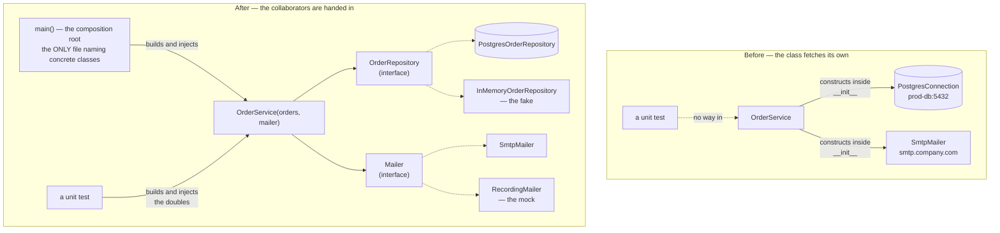

# Day 053 · System Design — Writing clean, testable classes

**After today you can:** You can inject dependencies so your class can be tested without a database.

**The interviewer asks it as:** *How would you unit test this class?*

---

## 1. What this is, and why they ask it

A class is **testable** when you can create it, run one of its methods, and check the result without
starting anything else. No database, no network call, no waiting, no fixed clock. The technique that
gets you there has one main idea: a class should be **given** the things it depends on rather than
**fetching** them itself. That is called **dependency injection**, and it is three lines of code, not
a framework.

They ask "how would you test this?" because it is the fastest way to find out whether you have ever
maintained code. Untestable code is not a testing problem — it is a design problem that shows up as a
testing problem, and the design flaw is always the same: the class reaches out and builds its own
collaborators, so there is no way to stand between it and them. You met the fix already, in a
different costume. [Day 048](../day-048-binary-search-on-floats/README.md) said the strongest reason
to define an interface is usually the in-memory fake for tests, and
[day 049](../day-049-peak-finding/README.md) said separately constructible means separately testable.
Today is those two sentences turned into code you can write in an interview.

---

## 2. The story

The annual day at a school in Kochi is on a Saturday, and on the Wednesday before it, the rehearsal
for the main play went badly for a reason that had nothing to do with the acting.

The play needs four things: a crown, a wooden sword, a large brass lamp, and a letter in a sealed
envelope. All four live in the store room behind the stage, and the store room is locked, and the
only key is with Joseph, who looks after the building and who had gone to Thrissur for a funeral.

The way rehearsals had always worked was that each boy fetched his own things. When it was nearly
your scene you went round the back, found what you needed, and came out with it. So on Wednesday,
with the store room shut, nobody could rehearse anything. Sunil stood at the side of the stage for
forty minutes waiting to see if the key would turn up. It did not. Everyone went home.

On Thursday the teacher in charge, Ms Fernandes, changed one thing, and it was not about the store
room. She put a boy called Riyas at the side of the stage with a table, and she said: from now on
nobody goes to the back. Whatever your scene needs, Riyas hands it to you as you go on.

Thursday's rehearsal ran completely. The crown was a circle of card with gold paper on it. The sword
was a metre rule. The lamp was a steel tumbler turned upside down, and the sealed letter was an empty
envelope with nothing written on it. Not one of the four was the real thing, and it did not matter,
because what the scene actually needed from the crown was something the boy could put on his head at
the right moment, and a card circle does that perfectly well.

They rehearsed the whole play twice. They found two real problems — one boy's entrance was three
seconds late every time, and two of them were standing in each other's light — and they fixed both
before Joseph came back with the key.

On Friday the real crown and the real lamp came out of the store room. The play did not change. Riyas
handed out the real things instead of the stand-ins, and everybody's part worked exactly as it had on
Thursday, because nobody's part had ever depended on where the crown came from.

---

## 3. The idea in plain English

Ms Fernandes did one thing, and it is the whole lesson: she stopped the actors fetching and started
handing things in. Everything else follows from that.

### The problem: a class that fetches its own collaborators

Here is the untestable version. Read it and find the line that ruins it.

```python
class OrderService:
    def __init__(self) -> None:
        self.db = PostgresConnection("postgres://prod-db:5432/orders")   # fetches its own
        self.mailer = SmtpMailer("smtp.company.com")                     # and its own

    def place(self, customer_id: int, items: list[str]) -> int:
        order_id = self.db.insert_order(customer_id, items)
        self.mailer.send(customer_id, f"Order {order_id} confirmed")
        return order_id
```

To test `place` you must have Postgres running, on that host, with that schema. You must have an SMTP
server, or you send a real email to a real customer every time the test runs. And there is no way to
check what happens when the database is down, because you cannot make it be down on demand.

This is the store room with the key gone. The dependency is **hidden inside the constructor**, so
there is nowhere for a test to stand between `OrderService` and Postgres.

### The fix: hand the collaborators in

```python
class OrderService:
    def __init__(self, orders: OrderRepository, mailer: Mailer) -> None:
        self.orders = orders            # given, not fetched
        self.mailer = mailer

    def place(self, customer_id: int, items: list[str]) -> int:
        order_id = self.orders.insert(customer_id, items)
        self.mailer.send(customer_id, f"Order {order_id} confirmed")
        return order_id
```

That is **constructor injection**, and it is the entire technique. The class now says what it needs
and refuses to go and get it. Some vocabulary, each defined once:

- A **dependency** is anything a class needs in order to do its job but does not own — a repository,
  a mailer, a clock, a payment gateway.
- **Dependency injection** is passing dependencies in from outside instead of constructing them
  inside. Constructor injection is the common form; method injection — passing it as an argument to
  one method — is the right choice when only one method needs it.
- A **seam** is a place where you can change behaviour without editing the class. Every injected
  dependency is a seam.
- A **test double** is a stand-in you pass in during a test. Riyas's cardboard crown.
- The **composition root** is the one place in the program where the real concrete classes are named
  and wired together — usually `main()` or a startup module. It is the only file that mentions
  `PostgresOrderRepository`.

### The four kinds of test double, named properly

Interviewers use these words precisely, so use them precisely.

| Name | What it does | Use it when |
|---|---|---|
| **Dummy** | Passed to satisfy a signature, never used. | The method under test does not touch it. |
| **Stub** | Returns canned answers. No logic. | You need the collaborator to *return* something. |
| **Fake** | A real working implementation, simplified. An in-memory dict instead of Postgres. | You need it to behave correctly across several calls. |
| **Mock** | Records the calls made to it so the test can assert on them. | The *effect* is the outcome — "an email was sent". |

The cardboard crown is a fake: it genuinely goes on a head. The empty envelope is a dummy: nobody
opens it. If Ms Fernandes had stood at the side counting how many times the lamp was picked up, that
would be a mock.

**Prefer fakes to mocks.** A mock asserts *how* your class did its job — which methods it called, in
what order — so it breaks when you refactor the inside of a class that still behaves correctly. A
fake asserts *what happened*, which is what you actually care about. Reach for a mock only when the
outcome genuinely is a call to something outside, such as sending an email.

### The three things that make code untestable, and their fixes

**One: `new` inside a constructor.** Fixed by injection, above.

**Two: reading the clock, the random number generator, or the environment directly.**

```python
class Subscription:
    def is_expired(self) -> bool:
        return datetime.now() > self.ends_at        # cannot test "expires tomorrow"
```

You cannot write a test for "what happens the day after it expires" without changing the computer's
clock. Inject the clock:

```python
class Subscription:
    def is_expired(self, now: datetime) -> bool:    # method injection: only this method needs it
        return now > self.ends_at
```

Now the test is one line and runs in a microsecond. The same applies to `random.random()`,
`uuid.uuid4()` and `os.environ`. **Anything that returns a different answer on two identical runs
must come in from outside.**

**Three: global or class-level mutable state.** A module-level `_connection` or a singleton means two
tests running in the same process affect each other, and the second one fails only when the first one
ran first. That is the worst class of bug to debug and it is entirely avoidable.

### The rule that ties it together

> **A class should ask for what it needs and never go looking for it.**

If a constructor contains the name of a concrete external thing — a driver, a URL, a hostname, a file
path — that name belongs in the composition root instead.

---

## 4. The picture

The change Ms Fernandes made, in one diagram:



**What to notice:** the arrow from the test. In the top half there is no way for a test to get
between `OrderService` and Postgres, so there is no unit test at all. In the bottom half the test
does exactly what `main()` does — it constructs the object and hands in collaborators — and the only
difference is which ones. `OrderService` cannot tell.

The seams, drawn on one class:

```
   class Invoice:
       def __init__(self,
                    customer: Customer,        <- injected  (seam)
                    rates: TaxRates,           <- injected  (seam)
                    numbering: SequenceSource   <- injected  (seam)
                   ) -> None:

       def total(self, on: date) -> Money:      <- the clock, injected per call (seam)

       def issue(self) -> None:
           self.mailer = SmtpMailer(...)        <- NOT a seam. Welded shut.
           now = datetime.now()                 <- NOT a seam. Untestable.
           key = os.environ["API_KEY"]          <- NOT a seam. Environment-dependent.
```

**What to notice:** the top four lines can each be replaced from a test without touching this file.
The bottom three cannot be replaced at all, and each one makes the whole method impossible to test in
isolation. Count the seams in a class and you have measured its testability.

The test pyramid, which is why any of this matters:

```
                        /\
                       /  \        end-to-end       ~10 tests    minutes    real everything
                      /----\
                     /      \      integration      ~100 tests   seconds    real DB, no network
                    /--------\
                   /          \    unit             ~1000 tests  milliseconds  all doubles
                  /____________\

   The bottom layer only exists if your classes take their dependencies as arguments.
   A codebase that constructs its own collaborators has no bottom layer at all —
   every test is an integration test, and the suite takes twenty minutes.
```

**What to notice:** the shape is not an aesthetic preference. It is a consequence of injection. You
cannot choose to have a thousand fast tests if your classes cannot be constructed without a database.

---

## 5. How it actually works

### The whole thing, in runnable code

Start with the interface — a `Protocol`, as on
[day 052](../day-052-quadratic-sorts/README.md), so implementations need not inherit anything:

```python
from typing import Protocol

class OrderRepository(Protocol):
    def insert(self, customer_id: int, items: list[str]) -> int: ...
    def get(self, order_id: int) -> dict | None: ...

class Mailer(Protocol):
    def send(self, customer_id: int, body: str) -> None: ...
```

The class under test depends only on those two names:

```python
class OrderService:
    def __init__(self, orders: OrderRepository, mailer: Mailer) -> None:
        self._orders = orders
        self._mailer = mailer

    def place(self, customer_id: int, items: list[str]) -> int:
        if not items:
            raise ValueError("an order needs at least one item")
        order_id = self._orders.insert(customer_id, items)
        self._mailer.send(customer_id, f"Order {order_id} confirmed")
        return order_id
```

The fake is fifteen lines and it is a real implementation:

```python
class InMemoryOrderRepository:
    """A working repository backed by a dict. Same behaviour, no Postgres."""

    def __init__(self) -> None:
        self._rows: dict[int, dict] = {}
        self._next_id = 1

    def insert(self, customer_id: int, items: list[str]) -> int:
        order_id = self._next_id
        self._rows[order_id] = {"customer_id": customer_id, "items": list(items)}
        self._next_id += 1
        return order_id

    def get(self, order_id: int) -> dict | None:
        return self._rows.get(order_id)


class RecordingMailer:
    """A mock: it remembers what it was asked to send."""

    def __init__(self) -> None:
        self.sent: list[tuple[int, str]] = []

    def send(self, customer_id: int, body: str) -> None:
        self.sent.append((customer_id, body))
```

And the test, which needs nothing running:

```python
def test_placing_an_order_stores_it_and_emails_the_customer() -> None:
    orders = InMemoryOrderRepository()
    mailer = RecordingMailer()
    service = OrderService(orders, mailer)

    order_id = service.place(customer_id=7, items=["lamp", "shade"])

    assert orders.get(order_id) == {"customer_id": 7, "items": ["lamp", "shade"]}
    assert mailer.sent == [(7, f"Order {order_id} confirmed")]
```

Three lines of setup, one line of action, two assertions, and it runs in well under a millisecond.
The fake checks the state that resulted; the mock checks the effect that had to leave the system.

### Testing the failure path, which is the real payoff

The reason this matters is not that the happy path is faster to test. It is that the unhappy paths
become testable at all:

```python
class ExplodingRepository:
    def insert(self, customer_id: int, items: list[str]) -> int:
        raise ConnectionError("could not connect to server: Connection refused")
    def get(self, order_id: int) -> dict | None:
        raise ConnectionError("could not connect to server: Connection refused")


def test_no_email_is_sent_if_the_order_fails_to_save() -> None:
    mailer = RecordingMailer()
    service = OrderService(ExplodingRepository(), mailer)

    with pytest.raises(ConnectionError):
        service.place(customer_id=7, items=["lamp"])

    assert mailer.sent == []            # the bug this test exists to prevent
```

You cannot write that test against a real database without unplugging it. This is the argument to
make in an interview: **injection is not about speed, it is about reachability.** Roughly half the
branches in production code are error paths, and without doubles most of them are never executed by
any test.

### Injecting the clock

```python
from datetime import date
from typing import Protocol

class Clock(Protocol):
    def today(self) -> date: ...

class SystemClock:
    def today(self) -> date:
        return date.today()

class FixedClock:
    def __init__(self, day: date) -> None:
        self._day = day
    def today(self) -> date:
        return self._day
```

```python
class Subscription:
    def __init__(self, ends_at: date, clock: Clock) -> None:
        self._ends_at, self._clock = ends_at, clock

    def is_expired(self) -> bool:
        return self._clock.today() > self._ends_at


def test_expires_the_day_after_it_ends() -> None:
    sub = Subscription(date(2026, 3, 31), FixedClock(date(2026, 4, 1)))
    assert sub.is_expired()
```

The library alternative is `freezegun` or pytest's `monkeypatch`, and both work. The injected clock
is better in domain code because it makes the dependency visible in the signature rather than
patching a global at test time — but say that you know both exist.

### The composition root

Exactly one file names the real classes:

```python
# main.py -- the only module that mentions Postgres or SMTP
def build_order_service() -> OrderService:
    return OrderService(
        orders=PostgresOrderRepository(os.environ["DATABASE_URL"]),
        mailer=SmtpMailer(os.environ["SMTP_HOST"]),
    )
```

The check that this worked is a one-line command, and it is a good thing to say out loud:

```bash
grep -rn "psycopg" src/ --exclude-dir=adapters --exclude=main.py
```

If that returns nothing, the database driver is genuinely swappable.

### What real frameworks do

- **pytest fixtures** are dependency injection for tests. A `@pytest.fixture` that returns an
  `InMemoryOrderRepository` is handed to every test that names it as an argument.
- **FastAPI's `Depends`** injects per-request collaborators into endpoint functions, and its
  `dependency_overrides` dict swaps them for fakes in tests — the composition root as a data
  structure.
- **Spring** in Java and **.NET's** built-in container do the same with annotations and a registry.
  They automate the wiring; they do not change the idea.
- **`unittest.mock.patch`** replaces a name in a module at test time. It works, and it is the escape
  hatch for code you cannot change — but it couples the test to the *import path* of the thing being
  patched, so moving a module breaks tests that never mentioned it. Prefer injection where you own
  the code.
- **Fakes shipped by real products:** `fakeredis` for Redis, SQLite in `:memory:` mode for a SQL
  database, `moto` for AWS, and `localstack` for a broader set. When you need the real thing,
  **testcontainers** starts a genuine Postgres in Docker per test session — the integration layer of
  the pyramid, not the unit layer.

---

## 6. The numbers

### What the suite costs, with and without seams

```
 A service with 800 tests.

 every test hits a real Postgres:
     setup + teardown per test  ~ 45 ms
     the test itself            ~ 15 ms
     800 x 60 ms                = 48 seconds  ... if the DB is local and warm
     in CI, with container startup and migrations: 6-10 minutes

 700 unit tests with fakes + 90 integration + 10 end-to-end:
     700 x 0.4 ms   =   0.3 s
      90 x 60 ms    =   5.4 s
      10 x 4 s      =  40   s
                      -------
                       ~46 s total, and the 0.3 s part runs on every file save
```

The number that changes behaviour is the **0.3 seconds**. A suite you can run on every save gets run
a hundred times a day. A suite that takes ten minutes gets run once, before you go home, and the
feedback arrives after you have forgotten the change.

### Reachability, which is the real argument

```
 A typical service class: 40 branches.
   ~22 happy-path branches      reachable with real collaborators
   ~18 error branches           connection lost, timeout, duplicate key,
                                payment declined, rate limited, disk full

 with real dependencies only : 22 / 40 reachable  = 55% of branches testable
 with injected doubles       : 40 / 40 reachable  = 100%

 Nearly half the code in a service is error handling, and it is exactly the half
 that runs at 3 a.m.
```

### Flakiness, priced

```
 A suite of 800 tests where each has a 0.1% chance of a network flake:

   P(at least one failure) = 1 - 0.999^800 = 55%

 So more than half of all CI runs fail for no reason.
 A team that sees that learns to re-run rather than to read, and a real
 failure gets re-run too.

 With 700 of the 800 using in-memory doubles, only 100 can flake:
   1 - 0.999^100 = 9.5%
```

### The cost of the change itself

```
 Refactoring OrderService to take its dependencies as arguments:

   the class            : 4 lines changed
   the composition root : 1 new function, 6 lines
   the fake repository  : 15 lines, written once, reused by ~40 tests
   call sites           : however many construct it -- usually 1, in main()

 Total: about 25 lines, once. Against 800 tests that no longer need Postgres.
```

---

## 7. The trade-offs

### What injection costs you

**Wiring.** Something must construct the objects and pass them in, and that something is code you did
not have before. In a small program it is one function; in a large one it is a container, and a
container is a thing to learn, debug and misconfigure.

**Indirection.** Reading `self._orders.insert(...)` no longer tells you what actually runs. You have
to go to the composition root to find out. That is a genuine cost to a newcomer, and the mitigation
is that there is exactly *one* place to look.

**Constructors that grow.** A class taking six injected dependencies is a signal, and the signal is
that the class is doing six things. Do not fix it by hiding them in a container — fix it by splitting
the class, which is tomorrow's topic on
[day 055](../day-055-quickselect/README.md).

### When not to inject

**I would not inject a dependency if** it is a value object, a pure function, or part of the language
— nobody injects `datetime` the *type*, `json`, or `Money`. Inject things that do input and output,
things that are slow, things that are non-deterministic, and things you might genuinely replace.
Everything else is noise.

**I would not inject if the class is a leaf with no collaborators.** A `Money` or an `Interval` needs
no seams; it is already testable because it is already pure.

**I would not build an interface for a dependency with exactly one implementation and no test
double.** That is the check from [day 048](../day-048-binary-search-on-floats/README.md) — name the
second implementation, and if the answer is "the fake", that counts and you should say so.

### Fakes against mocks

Mocks are seductive because `unittest.mock.MagicMock()` writes itself. The cost arrives later. A test
that asserts `repo.insert.assert_called_once_with(7, ["lamp"])` fails when you rename a parameter,
reorder two calls, or batch two inserts into one — all changes that leave the behaviour identical.
That is a test coupled to the implementation, and a suite full of them makes refactoring *harder*,
which is the exact opposite of what tests are for.

**I would use a mock when the effect leaving the system is the outcome** — an email sent, a message
published, a webhook fired — because there is no state to inspect. For anything with state, a fake
and a state assertion is better.

### When the double is the wrong answer entirely

A fake repository backed by a dict does not have a unique index, a foreign key, a transaction, or
Postgres's exact behaviour on a concurrent update. Tests against it will pass while production fails.
So:

**I would not unit-test with a fake if the thing under test *is* the database interaction** — the SQL
itself, the migration, the isolation level from
[day 034](../day-034-at-most-k/README.md). Those need the real engine, and that is what the
integration layer of the pyramid and `testcontainers` are for. The rule is: **fake the collaborator
when you are testing your logic; use the real thing when you are testing the integration.** Say both
halves. A candidate who claims everything can be unit-tested with fakes has not been burned yet.

### The honest summary

Injection is not a testing trick that happens to improve design. It is a design property — *this
class does not decide what its collaborators are* — that happens to make testing possible. If you
argue for it only on testing grounds, an interviewer can reasonably ask "so why not just use
`mock.patch`?" The better answer is that the same seam is what lets you swap Razorpay for Stripe, run
the service against a read replica, or add caching without touching business logic.

---

## 8. In the interview

### How it gets asked

- *"How would you unit test this class?"* — shown a class that constructs its own database
  connection. The expected answer is "I'd change the constructor first", and saying that is the
  point.
- *"What is dependency injection? Do you need a framework for it?"* — no. It is passing arguments.
  Say that plainly; a surprising number of candidates think it requires Spring.
- *"What's the difference between a mock, a stub and a fake?"* — the vocabulary question. Know all
  four, including dummy.
- *"This method calls `datetime.now()`. How do you test the expiry logic?"* — the clock question.
- *"Your test suite takes 20 minutes. What do you do?"* — the pyramid, and where the seams are
  missing.

### What to say out loud, in the first ninety seconds

1. **Name the blocker before offering a technique.** *"As written I can't unit test this at all,
   because the constructor builds a Postgres connection and an SMTP client. There's nowhere for a
   test to stand."*
2. **State the change in one sentence.** *"I'd have it take an `OrderRepository` and a `Mailer` as
   constructor arguments instead of building them. That's dependency injection, and it's a signature
   change, not a framework."*
3. **Say where the real ones get built.** *"The concrete `PostgresOrderRepository` gets named in one
   place — `main()`, the composition root. Nothing else in the codebase mentions the driver."*
4. **Name the doubles precisely.** *"For the repository I'd write an in-memory fake backed by a dict
   — a real implementation, simplified. For the mailer I'd use a mock that records what it was asked
   to send, because 'an email went out' is an effect, not a state I can inspect."*
5. **Give the reason that isn't speed.** *"The real gain is reachability: I can make the repository
   raise `ConnectionError` on demand and assert that no confirmation email goes out. There's no way
   to write that test against a live database."*

### The follow-ups

**"Isn't this just testing your fake rather than your code?"**
It is a fair challenge and the answer has two halves. What the unit test verifies is my class's
logic — that it validates the input, that it calls the repository before the mailer, that it doesn't
send a confirmation when the save failed, that it propagates the right exception. None of that is
fake behaviour; it is my behaviour, and it is the part most likely to be wrong. What the unit test
does *not* verify is that `PostgresOrderRepository` writes the right SQL, respects the unique
constraint, or behaves correctly under a concurrent update — and I would never claim it does. That is
exactly what the integration layer is for: a smaller number of tests running against a real Postgres,
usually started by testcontainers, that test the adapter and nothing else. The way I'd keep the fake
honest is to write one contract test — a single set of test cases run twice, once against the fake
and once against the real repository — so that any behaviour the fake gets wrong shows up as a
failure rather than as a false pass. If I only had time for one thing, it would be that contract
test, because a fake that has drifted from the real implementation is worse than no fake at all.

**"Do you need a dependency injection framework?"**
No, and I would push back gently on the assumption. Dependency injection is passing arguments to a
constructor; it is a technique, not a library. In Python I do it by hand and it costs one function in
`main()`. A container earns its place at a certain scale — when you have a hundred services with a
deep graph of dependencies, wiring them manually becomes a large fragile function, and something like
Spring in Java or `dependency-injector` in Python, or FastAPI's `Depends` for the per-request case,
saves real work. What the container buys is lifecycle management — singletons, per-request scopes,
lazy construction — not the injection itself. What it costs is that the wiring becomes implicit, so a
missing registration fails at startup or, worse, at first use, with a stack trace that points at the
container rather than at the code. For anything under a few dozen classes I would write the
composition root by hand, because a function I can read beats a graph I have to trust.

**"Your suite takes twenty minutes. Walk me through fixing it."**
First I measure rather than guess — pytest's `--durations=25` will usually show that a small number
of tests own most of the time, and very often it is per-test database setup. Then I look at the shape
of the suite. If almost every test needs a real database, the problem is not the tests, it is that
the classes construct their own collaborators, so every test is forced to be an integration test.
That is the thing to fix, and it is fixed one class at a time: change the constructor to take the
repository, write the in-memory fake once, and move the tests that were only ever exercising business
logic down to the unit layer. Second, I check for shared expensive setup that runs per test rather
than per session — migrations especially, which should run once against a template database that each
test copies or truncates. Third, the truly slow tests that genuinely need the real thing get kept,
but bounded: ten end-to-end tests covering critical journeys, not four hundred. And I would run the
whole thing in parallel with `pytest-xdist`, which only works if tests share no global state — so it
also flushes out the singletons. The target shape is a thousand-odd unit tests running in under a
second, which is a suite people run on every save, and a hundred slower ones in CI.

### A model answer

> "As it stands I can't unit test this class at all, and I'd say that first rather than reaching for a
> mocking library. The constructor builds a `PostgresConnection` and an `SmtpMailer` itself, so there
> is no seam — no place a test can stand between this class and the outside world. Any test I write
> needs a live database and an SMTP server, and it sends real email.
>
> The fix is a signature change, not a framework:
>
> ```python
> class OrderService:
>     def __init__(self, orders: OrderRepository, mailer: Mailer) -> None:
>         self._orders = orders
>         self._mailer = mailer
> ```
>
> `OrderRepository` and `Mailer` are `Protocol`s, so implementations don't inherit anything from me.
> The concrete `PostgresOrderRepository` is named in exactly one place — `main()`, the composition
> root — and nothing else in the codebase imports the driver.
>
> Then the test is three lines of setup. For the repository I'd write an in-memory fake backed by a
> dict: a real, simplified implementation, so I can assert on the state afterwards. For the mailer I'd
> use a recording double — a mock — because 'a confirmation email was sent' is an effect leaving the
> system, not a state I can inspect. I'd generally prefer fakes to mocks, because a mock asserts *how*
> the class did its job and breaks when I refactor something that still behaves correctly.
>
> The reason I'd actually argue for this isn't speed, although 800 tests going from 48 seconds to 0.3
> seconds does change how often people run them. It's reachability. About half the branches in a
> service class are error handling — connection lost, duplicate key, payment declined — and with a
> real database I can't reach any of them. With an injected repository I hand in one that raises
> `ConnectionError` and assert that no confirmation email goes out. That's the bug the test exists to
> prevent, and there's no other way to write it.
>
> What I wouldn't claim is that this replaces integration testing. The fake doesn't have a unique
> index or a transaction, so the SQL and the constraints still need a real Postgres — testcontainers,
> at the integration layer, maybe ninety tests rather than eight hundred. And I'd write one contract
> test run against both the fake and the real repository, so the fake can't silently drift."

---

## 9. Recall card

- **The whole technique in one sentence: a class asks for what it needs and never goes looking for
  it.** A constructor that names a driver, host or URL has welded itself shut; take the collaborator
  as an argument instead. That is **dependency injection**, and it needs no framework — it is
  argument passing.
- **Every injected dependency is a seam.** Three things destroy testability: constructing
  collaborators inside `__init__` · calling `datetime.now()`, `random`, `uuid` or `os.environ`
  directly · global mutable state. Inject the first, inject a **clock** for the second, delete the
  third.
- **Four doubles, used precisely:** dummy (never used) · stub (canned answers) · **fake** (a real
  simplified implementation — the in-memory dict) · mock (records calls). **Prefer fakes**; a mock
  asserts *how* and breaks on honest refactors. Use a mock when the outcome is an effect leaving the
  system.
- **The argument isn't speed, it's reachability.** ~18 of 40 branches in a service are error paths
  and none are reachable with a live database; a repository that raises `ConnectionError` on demand
  makes them all testable. Speed follows: 800 tests, 48 s → 0.3 s.
- **Concrete classes are named once, in the composition root** (`main()`, or FastAPI's
  `dependency_overrides`); `grep -rn "psycopg" src/ --exclude=main.py` should be empty. And concede
  the limit: **fake the collaborator to test your logic, use the real engine (testcontainers) to test
  the integration** — plus one contract test run against both, so the fake cannot drift.
