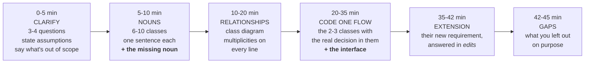
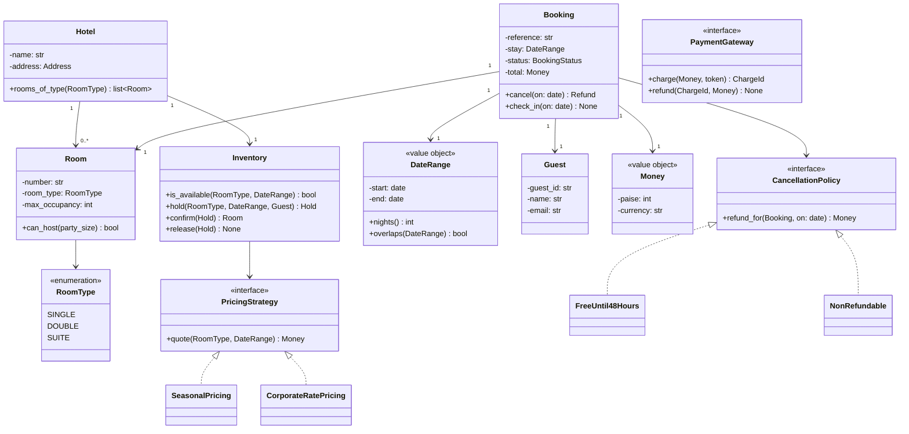

# Day 054 · System Design — Object-oriented design revision and interview questions

**After today you can:** You can take an unseen LLD prompt and produce classes in twenty minutes.

**The interviewer asks it as:** *Design the classes for a hotel booking system.*

---

## 1. What this is, and why they ask it

This closes the object-oriented design phase. You have eleven days of tools —
classes ([day 044](../day-044-first-and-last-occurrence/README.md)), encapsulation, inheritance,
polymorphism, abstraction, composition, diagrams, domain modelling, the standard questions, and
testable construction. Today is the day you use all of them at once, on a prompt you have not seen,
with someone watching a clock.

They ask it as one question — "design the classes for X" — and the X changes every time: a hotel
booking system, a parking lot, a library, a lift, a food delivery app, a chess game. What does not
change is the shape of a good answer, and that is what a revision day is for. Candidates fail this
round for one of three reasons, and none of them is not knowing what a class is. They start coding at
minute two without scoping. They produce a set of data holders with a `Service` class doing all the
work. Or they design something so rigid that the interviewer's extra requirement at minute forty
requires rewriting it. The fix for all three is a rehearsed order of moves, and this lesson is that
order, run end to end on one prompt.

---

## 2. The story

Deepa learned to cook from her mother over about two years, in the way most people do — one thing at
a time, whenever it happened to be being made. Sambar on a Tuesday. Beans on a Thursday. She could do
each of them properly on her own and she knew it.

Then her mother went to Chennai for her aunt's surgery, and on the Sunday eleven relatives were
coming for lunch at one o'clock, and Deepa was the only one at home.

She got up at eight, which she thought was very early, and she was quite calm about it. She knew
every single dish she had to make. That turned out not to be the thing that mattered.

At half past twelve she had four things ready and beautiful, and she had not started the rice. The
rice takes forty minutes and it cannot be hurried and it is the only thing on the table that nobody
will forgive you for. She also had two burners going and needed a third, and the coconut was not
scraped, and one of the dishes had gone cold an hour ago and would have to be warmed again at the
last minute, which she had not left a burner free for.

They ate at ten past two. Everything was good. Her uncle said so twice, and she cried a bit in the
kitchen afterwards anyway, because she had known how to make all of it and it had still gone wrong.

A month later there were guests again, and she did one thing differently before she lit anything at
all. She stood in the kitchen for ten minutes and worked out the order. What takes longest starts
first. What goes cold last, goes last. Two burners means two things at once and not three. What can
be done the night before gets done the night before.

That day she was sitting down with everybody at five past one, and there was a stretch in the middle
where she had nothing to do for six or seven minutes and stood at the door, which had never happened
before.

Her mother, when she got back and heard about both Sundays, was not surprised by either of them.
Knowing the dishes and being able to put lunch on the table at one o'clock, she said, are two
different things, and only one of them is taught one Tuesday at a time.

---

## 3. The idea in plain English

Deepa's second Sunday is the whole lesson. She did not learn a new dish between the two lunches. She
spent ten minutes deciding the order before she lit anything, and that was the difference between ten
past two and five past one.

A low-level design round is the same problem. You already know the tools. What decides the outcome is
running a fixed sequence of moves, out loud, in the right order, and saying the plan at the start so
the interviewer knows you have one.

### The five moves, and the clock

For a 45-minute round:

| Minutes | Move | What you produce |
|---|---|---|
| 0-5 | **Clarify and scope** | Three or four questions, and the answers you will assume. Say what you are leaving out. |
| 5-10 | **The nouns** | 6 to 10 classes, each with one sentence of responsibility. |
| 10-20 | **Relationships** | The class diagram: who holds whom, with multiplicities. |
| 20-35 | **Code one flow** | The two or three classes carrying the interesting decision, written properly. |
| 35-42 | **The extension** | Their new requirement, answered in edits. |
| 42-45 | **Gaps** | What you knowingly left out, and what you would do next. |

Say the plan at minute one: *"I'll scope for five minutes, name the classes, draw relationships, then
code the booking flow properly and leave time for whatever you want to add."* That single sentence
buys you the rest of the round, because the interviewer stops wondering whether you are lost.

### The four habits that decide the score

These are the recurring judgements from the whole phase, compressed.

**One: behaviour goes next to the data it needs.** `room.can_host(party_size)`, never a type check
inside a coordinator. A design that is fields plus a `BookingService` doing everything is the
**anaemic model**, and it is the most common way to lose this round
([day 044](../day-044-first-and-last-occurrence/README.md)).

**Two: find the noun nobody wrote down.** Requirements say "a guest books a room". `Guest` and `Room`
are in the sentence; `Booking` is not, and `Booking` is where every interesting rule lives — the
dates, the price, the cancellation deadline, the status. The test from
[day 051](../day-051-why-sorting-matters/README.md): *is there a rule, a date, or an amount of money
with no home?* If yes, that is a class.

**Three: put an interface exactly where the requirement will change.** Not everywhere. Every prompt
has one or two places where the business rule is genuinely variable — pricing, cancellation policy,
spot allocation, fare calculation — and that is where an interface earns its keep. The test from
[day 048](../day-048-binary-search-on-floats/README.md) still applies: **name the second
implementation.** If you can name it, build the interface; if you cannot, do not.

**Four: make it constructible.** Hand dependencies in rather than fetching them
([day 053](../day-053-merge-sort/README.md)). It costs nothing to write
`Booking(pricing, policy, clock)` instead of building them inside, and when the interviewer says "how
would you test the cancellation refund", you have already answered it.

### What "revision" means here

The rest of this lesson runs the five moves on one prompt — a hotel booking system — showing the
first version, naming what breaks, and then fixing it. That last part matters more than the diagram.
**Never present a design as if it arrived finished.** An interviewer learns far more from watching
you notice a flaw than from a clean drawing.

---

## 4. The picture

The order of moves, which is the thing to memorise:



**What to notice:** twenty minutes pass before you write a line of code, and that is correct. The
commonest failure in this round is starting at box four.

The finished hotel model, which §5 builds up to:



**What to notice:** ten boxes, and only three of them have methods worth listing — `Inventory`,
`Booking` and `Room`. The two `<<interface>>` boxes sit exactly where the business changes its mind:
what a night costs, and what you get back if you cancel. Everything else is a plain noun with a
plain line. And `Booking` — the noun that was not in "a guest books a room" — is the class holding
the most behaviour.

The concurrency problem, which is the question this prompt always gets:

```
  one room left, room 412, and two guests click Book at the same instant

  time     Anita's request                 Bhaskar's request
  ----     --------------                  -----------------
  t=0      is 412 free?  -> yes
  t=1                                      is 412 free?  -> yes
  t=2      write booking A
  t=3                                      write booking B

  result: two confirmed bookings for one room. Nobody saw an error.
```

**What to notice:** the gap between the check and the write is where the bug lives. Every version of
this prompt — cinema seats, parking spots, ticket sales — has the same shape, and the fix is always
to make the check and the write **one atomic operation**, not two. §5 shows the three ways.

---

## 5. How it actually works

### Move 1 · Clarify, in five minutes

Ask three or four questions, state the answers you will assume, and name what you are leaving out.
Real questions, and the assumptions a reasonable interviewer will accept:

> **"One property or a chain?"** — Assume a chain, so `Hotel` is a real class rather than an implied
> singleton.
>
> **"Do guests book a room type, or a specific room?"** — Assume they book a *type* and a specific
> room is assigned at check-in. This is how hotels actually work and it changes the model
> substantially, so it is the highest-value question to ask.
>
> **"Do we handle payment, or does an external gateway?"** — Assume an external gateway behind an
> interface, and we store a charge reference.
>
> **"Are cancellation rules fixed, or do they vary?"** — Assume they vary by rate plan. Ask this,
> because the answer creates an interface.

Then say the scope out loud: *"I'll model search, booking, cancellation and check-in. I'm leaving out
loyalty points, housekeeping, group bookings and multi-currency — tell me if you'd rather I include
one."* Naming the exclusions is what makes it scoping rather than forgetting.

### Move 2 · The nouns, in five minutes

Pull them straight out of the requirements, one sentence of responsibility each:

- **Hotel** — one property. Owns its rooms and knows its address.
- **Room** — one physical room. Knows its number, its type, and how many people it can hold.
- **RoomType** — single, double, suite. An enumeration, not a class hierarchy — there is no behaviour
  that differs per type beyond data.
- **Guest** — the person booking. Identity, contact details.
- **DateRange** — a start and an end. A **value object**: frozen, compared by value, and it owns
  `nights()` and `overlaps()`.
- **Money** — a value object in the smallest unit. Never a `float`.
- **Inventory** — the class that answers "is a room of this type free for these dates" and holds
  one. This is the second missing noun and it is where the hard part lives.
- **Booking** — **the noun nobody wrote down.** A guest, a room type, a date range, a price, a
  status, and the rules for cancelling and checking in.
- **PricingStrategy** — an interface. What a night costs.
- **CancellationPolicy** — an interface. What you get back.
- **PaymentGateway** — an interface. Razorpay, Stripe, or a fake for tests.

Say the missing-noun reasoning out loud, because it is the highest-scoring sentence in the whole
round: *"'A guest books a room' has two nouns in it, but the price, the dates, the status and the
cancellation deadline have nowhere to live. That is a `Booking`, and it is where most of the
behaviour goes."*

### Move 3 · The relationships

That is the diagram in §4. Draw it while narrating each line: *"A hotel has many rooms — a room
belongs to exactly one hotel. A booking has one date range, one guest, one room type, and after
check-in, one room."* Put a multiplicity on every line. Nobody has ever been marked down for a plain
association line, and plenty of people have been marked down for a diagram with no numbers on it.

### Move 4 · The interesting part

Every LLD prompt has one place where the design is actually decided. In a parking lot it is spot
allocation. In a lift it is scheduling. **In a hotel it is availability** — and specifically the gap
between checking and booking.

Show the naive version first and name what breaks:

```python
class Inventory:
    def book(self, room_type: RoomType, stay: DateRange, guest: Guest) -> Booking:
        if self.is_available(room_type, stay):        # CHECK
            return self._create_booking(room_type, stay, guest)   # then WRITE
        raise NoRoomsAvailable(room_type, stay)
```

*"That is correct with one guest and wrong with two. Between the check and the write, another request
can run the same check and get the same answer. One room, two confirmed bookings, and no error
anywhere."*

Then give the three fixes, in the order you would consider them:

**One: make it atomic in the database.** The real answer for a hotel. A conditional insert or an
`UPDATE ... WHERE remaining > 0` does the check and the write in one statement, and the database
guarantees only one succeeds:

```sql
UPDATE availability
   SET remaining = remaining - 1
 WHERE hotel_id = %s AND room_type = %s AND day = %s AND remaining > 0;
-- affected rows: 1 = you got it, 0 = someone else did
```

Say the isolation level and why: this is a lost-update problem, and `remaining > 0` inside the
statement is what makes it safe under `READ COMMITTED` without an explicit lock
([day 034](../day-034-at-most-k/README.md)).

**Two: a two-phase hold.** What booking systems actually do, because payment takes thirty seconds and
you must not lose the room in the meantime:

```
  hold  ->  (10 minutes, expires on its own)  ->  confirm  or  release
```

**Three: a lock, if it is single-process.** In one Python process a `threading.Lock` around
check-and-write is enough, and saying "but that does not survive a second instance of the service"
shows you know the limit of the answer.

Now the code for the classes that carry it. This is the part you write properly.

```python
from dataclasses import dataclass, field
from datetime import date, timedelta
from enum import Enum
from typing import Protocol
import threading
import uuid


@dataclass(frozen=True)
class DateRange:
    """A stay. Value object: frozen, compared by value, owns its own arithmetic."""
    start: date
    end: date                                     # exclusive: the check-out day

    def __post_init__(self) -> None:
        if self.end <= self.start:
            raise ValueError("a stay must be at least one night")

    def nights(self) -> int:
        return (self.end - self.start).days

    def days(self) -> list[date]:
        return [self.start + timedelta(days=i) for i in range(self.nights())]

    def overlaps(self, other: "DateRange") -> bool:
        return self.start < other.end and other.start < self.end
```

`DateRange` refusing to exist with `end <= start` is encapsulation doing real work
([day 045](../day-045-rotated-array-search/README.md)) — an invalid stay cannot be constructed, so no
downstream code has to check for one.

```python
@dataclass(frozen=True)
class Money:
    paise: int
    currency: str = "INR"

    def __add__(self, other: "Money") -> "Money":
        if other.currency != self.currency:
            raise ValueError("cannot add different currencies")
        return Money(self.paise + other.paise, self.currency)

    def __mul__(self, n: int) -> "Money":
        return Money(self.paise * n, self.currency)
```

Integers in the smallest unit, never floats. Saying "I'd store paise as an integer because floating
point cannot represent 0.1 exactly" is a small sentence that reads as experience.

```python
class PricingStrategy(Protocol):
    def quote(self, room_type: "RoomType", stay: DateRange) -> Money: ...


class FlatRatePricing:
    def __init__(self, per_night: dict["RoomType", Money]) -> None:
        self._rates = per_night

    def quote(self, room_type: "RoomType", stay: DateRange) -> Money:
        return self._rates[room_type] * stay.nights()


class SeasonalPricing:
    """The second implementation, which is why the interface exists."""

    def __init__(self, base: PricingStrategy, peak_days: set[date], multiplier: float) -> None:
        self._base, self._peak, self._multiplier = base, peak_days, multiplier

    def quote(self, room_type: "RoomType", stay: DateRange) -> Money:
        total = Money(0)
        for day in stay.days():
            one_night = self._base.quote(room_type, DateRange(day, day + timedelta(days=1)))
            if day in self._peak:
                one_night = Money(int(one_night.paise * self._multiplier))
            total = total + one_night
        return total
```

Note that `SeasonalPricing` *wraps* a `PricingStrategy` rather than inheriting from `FlatRatePricing`.
That is composition doing the work of a decorator, and it means corporate rates, seasonal loading and
last-minute discounts can be stacked in any order without a class per combination
([day 049](../day-049-peak-finding/README.md)).

```python
class CancellationPolicy(Protocol):
    def refund_for(self, booking: "Booking", on: date) -> Money: ...


class FreeUntilDaysBefore:
    def __init__(self, days: int) -> None:
        self._days = days

    def refund_for(self, booking: "Booking", on: date) -> Money:
        deadline = booking.stay.start - timedelta(days=self._days)
        return booking.total if on <= deadline else Money(0)


class NonRefundable:
    def refund_for(self, booking: "Booking", on: date) -> Money:
        return Money(0)
```

Two implementations, named. That is the check from
[day 048](../day-048-binary-search-on-floats/README.md) passing, and it is why this interface is
justified while an `IHotel` interface would not be.

```python
class BookingStatus(Enum):
    HELD = "held"
    CONFIRMED = "confirmed"
    CHECKED_IN = "checked_in"
    CANCELLED = "cancelled"


@dataclass
class Booking:
    """The noun that was not in the requirements, and where the rules live."""
    reference: str
    guest: "Guest"
    room_type: "RoomType"
    stay: DateRange
    total: Money
    policy: CancellationPolicy                      # injected -- testable
    status: BookingStatus = BookingStatus.CONFIRMED
    assigned_room: "Room | None" = None

    def cancel(self, on: date) -> Money:
        if self.status in (BookingStatus.CHECKED_IN, BookingStatus.CANCELLED):
            raise ValueError(f"cannot cancel a booking that is {self.status.value}")
        refund = self.policy.refund_for(self, on)   # the rule lives in the policy
        self.status = BookingStatus.CANCELLED
        return refund

    def check_in(self, room: "Room", on: date) -> None:
        if self.status is not BookingStatus.CONFIRMED:
            raise ValueError(f"cannot check in a booking that is {self.status.value}")
        if on < self.stay.start:
            raise ValueError("too early to check in")
        if not room.can_host(self.guest.party_size):
            raise ValueError(f"room {room.number} cannot host {self.guest.party_size} guests")
        self.assigned_room = room
        self.status = BookingStatus.CHECKED_IN
```

Every rule about a booking lives on `Booking`. There is no `BookingService.cancel(booking)` deciding
what a cancellation means, and that is the difference between a model and a bag of fields.

```python
class Inventory:
    """Availability per room type per day, with the check and the write made atomic."""

    def __init__(self, capacity: dict["RoomType", int], pricing: PricingStrategy) -> None:
        self._capacity = capacity
        self._pricing = pricing
        self._booked: dict[tuple["RoomType", date], int] = {}
        self._lock = threading.Lock()               # single process; see the trade-offs

    def available(self, room_type: "RoomType", stay: DateRange) -> int:
        return min(
            self._capacity[room_type] - self._booked.get((room_type, day), 0)
            for day in stay.days()
        )

    def book(
        self,
        room_type: "RoomType",
        stay: DateRange,
        guest: "Guest",
        policy: CancellationPolicy,
    ) -> Booking:
        with self._lock:                            # check and write, together
            if self.available(room_type, stay) <= 0:
                raise NoRoomsAvailable(room_type, stay)
            for day in stay.days():
                self._booked[(room_type, day)] = self._booked.get((room_type, day), 0) + 1
        return Booking(
            reference=uuid.uuid4().hex[:8].upper(),
            guest=guest,
            room_type=room_type,
            stay=stay,
            total=self._pricing.quote(room_type, stay),
            policy=policy,
        )
```

The `with self._lock` is one line, and pointing at it and saying *"this is the check-then-write race,
and in a real deployment the lock has to be in the database or in Redis, not in the process"* is
worth more than the rest of the class.

### Move 5 · The extension, rehearsed

The interviewer will add a requirement at minute forty. For a hotel it is almost always one of three,
and each has a prepared answer:

- *"Now we want last-minute discounts."* — One new `PricingStrategy` implementation, wrapping the
  existing one. Zero edits to `Booking`, `Inventory` or anything else.
- *"Now a booking can cover several rooms."* — `Booking` holds a list of line items rather than one
  room type. `Inventory.book` takes a list and reserves all of them under one lock, or none.
- *"Now we overbook by 5% because of no-shows."* — `available()` becomes
  `capacity × 1.05 − booked`, in one class, one method.

Answer in **edits**, not in prose. "One new file and one wiring line" is a measurement; "we'd use the
strategy pattern" is a word.

---

## 6. The numbers

### How big is the object graph

```
 A mid-size chain:
   40 properties x 120 rooms  =  4,800 Room objects
   3 room types per property  =    120 RoomType references (an enum: 3 objects total)
   1 Inventory per property   =     40

 Availability, if stored per room type per day:
   40 properties x 3 types x 365 days = 43,800 rows for a year
   x 3 years forward booking          = 131,400 rows

 That fits in memory. Per ROOM per day it would be
   4,800 x 365 x 3 = 5,256,000 rows -- 40x more, for no extra ability,
 which is the arithmetic that justifies booking a type rather than a room.
```

That last comparison is the payoff of the clarifying question in move one. Ask it, then show the
forty-times difference, and the interviewer sees a decision rather than a guess.

### The concurrency window, measured

```
 check-then-write, without a lock:

   is_available()  reads 3 days of availability   ~ 0.4 ms
   business logic                                 ~ 0.1 ms
   write the booking                              ~ 2.0 ms
                                                  ---------
   window in which a second request can pass       ~2.5 ms

 At 20 bookings/second across the chain, two requests for the LAST room
 of the same type land inside 2.5 ms roughly:
   20 req/s x 0.0025 s = 0.05 -> about a 5% chance per contended room-night.

 On a peak day with 300 sold-out room-nights: ~15 double bookings.
```

Fifteen a day is not a theoretical concern; it is a person standing at a counter at eleven at night.
That number is why the atomic write matters, and giving it turns a hand-wave into an argument.

### The hold window

```
 payment flow: card details -> gateway -> 3-D Secure -> confirmation
   median 12 s, 95th percentile 40 s, timeout at 90 s

 hold expiry = 10 minutes
   comfortably above the 95th percentile
   at 20 holds/second and a 10-minute window: 20 x 600 = 12,000 live holds
   at ~200 bytes each = 2.4 MB -- trivially a Redis key with a TTL
```

Naming `SETEX` with a ten-minute TTL as the mechanism, and the 12,000 number as the size, is the
level of concreteness this round rewards.

### The cost of the design decisions, in edits

```
 "add last-minute discounts"
   with a PricingStrategy interface : 1 new class + 1 wiring line
   with pricing inside Booking      : edit Booking, edit Inventory, edit 2 tests,
                                      re-verify every existing booking path   = 4+ edits
                                      to code that already works

 "add a non-refundable rate"
   with a CancellationPolicy        : 1 new class, 5 lines
   with an if-chain in cancel()     : 1 edit to the most safety-critical method
                                      in the system
```

---

## 7. The trade-offs

### What this design gives up

**Booking a type, not a room.** The guest cannot choose room 412 with the balcony. That is a real
product decision, and it buys the forty-times reduction in availability records plus the freedom to
reassign rooms right up to check-in. **I would change it if** the business sells specific rooms —
villas, or a heritage property where every room is different — and then availability becomes per
room, the object count goes up forty times, and I would need a real search index rather than a dict.

**An in-process lock.** `threading.Lock` protects one Python process. Two instances behind a load
balancer share nothing, and the race comes straight back. **I would not use this if** the service
runs more than one instance, which it always does — the honest production answer is the conditional
`UPDATE` in the database, or a Redis lock with a TTL if the availability store cannot express the
condition. Saying that the lock is a placeholder, and naming its replacement, is the difference
between a naive answer and a scoped one.

**No overbooking.** Real hotels deliberately sell more rooms than they have, because 5-10% of guests
do not turn up. This model refuses the sale. **I would add it** as a multiplier inside
`Inventory.available()` — one method, one line — which is exactly the kind of change a good boundary
makes cheap.

**Money as an integer of paise, single currency.** Adding currencies means every arithmetic operation
needs a rate and a date, and `Money + Money` across currencies must fail loudly, which it already
does. That is the right shape to grow into.

### Where the interfaces are, and where they deliberately are not

Two interfaces: `PricingStrategy` and `CancellationPolicy`. Both pass the "name the second
implementation" test — seasonal against flat, free-until-48-hours against non-refundable — and both
sit exactly where a business changes its mind quarterly.

There is deliberately **no** `IHotel`, no `IRoom`, no `IBookingRepository` at this stage. Those would
be interfaces with one implementation and no fake, which is ceremony. **I would add
`BookingRepository` the moment persistence appears**, and I would say the reason honestly: the second
implementation is the in-memory fake for tests, and that counts
([day 053](../day-053-merge-sort/README.md)).

### `RoomType` as an enum rather than a hierarchy

A `Single`/`Double`/`Suite` class hierarchy is the tempting move and it is wrong here, because the
types differ only in data — a rate and an occupancy — and not in behaviour. An enum plus a rate table
is three lines against three classes. **I would change it if** a type acquired genuine behaviour that
differed, for example a suite requiring a manager's approval to discount, and even then I would reach
for a strategy object before a subclass.

### What breaks at ten times the size

The `Inventory` dict is fine for 131,400 rows and hopeless for a chain of four thousand properties.
At that point availability moves to the database with a composite key on
`(hotel_id, room_type, day)`, `available()` becomes a range query with an index, and the atomic
decrement becomes the conditional `UPDATE`. The class boundary does not change, which is the argument
for having drawn it: **`Inventory` is an interface with a dict implementation today and a Postgres
implementation tomorrow, and nothing else in the model notices.**

---

## 8. In the interview

### How it gets asked

- *"Design the classes for a hotel booking system."* — and the same round with a parking lot, a
  library, a lift, a vending machine, a chess game, or a food delivery app. The prompt changes; the
  five moves do not.
- *"Just give me the class diagram."* — still do the five minutes of scoping first, out loud, and
  say why.
- *"Two guests book the last room at the same moment. What happens?"* — the follow-up this prompt
  always gets.
- *"Now add [new requirement]."* — at minute forty, every time. Answer in edits.

### The script, minute by minute

**Minutes 0-5 — clarify.** *"Before I model anything, four questions. One property or a chain? Do
guests book a room type or a specific room? Do we take payment ourselves or through a gateway? Are
cancellation rules fixed or do they vary by rate?"* Then state your assumptions and your scope,
including what you are leaving out.

**Minutes 5-10 — nouns.** Say them with one line of responsibility each, and land the missing-noun
sentence: *"'A guest books a room' names two classes, but the dates, the price, the status and the
cancellation deadline have nowhere to live. That is a `Booking`."*

**Minutes 10-20 — the diagram.** Draw while narrating. Multiplicity on every line. Put the two
interfaces in and say why each one is justified by naming its second implementation.

**Minutes 20-35 — code the booking flow.** `DateRange` first, because it is small and it shows the
invariant being enforced in the constructor. Then `Booking.cancel`, because that is where the rule
lives. Then `Inventory.book`, and stop at the check-then-write to name the race before they ask.

**Minutes 35-42 — the extension.** Whatever they add, answer in edits, and say the number.

**Minutes 42-45 — gaps.** *"I've left out group bookings, loyalty, housekeeping and multi-currency
deliberately. The one I'd do next is persistence, because that turns `Inventory` into a repository
interface and the atomic decrement into a conditional `UPDATE`, and it's the piece that decides
whether the design survives two service instances."*

### The follow-ups

**"Two guests click Book on the last room at the same instant. What happens?"**
With the code as written and no lock, both succeed, and that is the bug. The check and the write are
two separate operations, and between them another request can run the same check and get the same
answer — the window is about two and a half milliseconds, which at twenty bookings a second across
the chain is roughly a five percent chance per contended room-night, so on a busy day it is a dozen
or so real double bookings, not a theoretical one. The fix is to make the check and the write a
single atomic operation. In the class I showed I used a `threading.Lock`, and I would immediately say
that it only protects one process — the moment there are two instances behind a load balancer the
race is back. The production answer is to push the condition into the database: an
`UPDATE availability SET remaining = remaining - 1 WHERE ... AND remaining > 0`, and then check the
affected row count. One statement, so there is no window, and it works under READ COMMITTED without
an explicit lock because the predicate is evaluated inside the write. If availability lives somewhere
that cannot express that, the alternative is a distributed lock in Redis keyed on hotel, room type
and date, with a TTL so a crashed holder does not block the room forever. And separately from the
race, I would use a two-phase hold, because payment takes twelve seconds at the median and forty at
the ninety-fifth percentile — so the room is held for ten minutes with a TTL and then either
confirmed or released automatically. That is what real booking systems do, and the expiring hold is
also what protects you against a client that simply disappears.

**"Where would you put an interface, and where would you not?"**
Two places, and the test is whether I can name the second implementation. Pricing gets one, because
flat-rate, seasonal, corporate-negotiated and last-minute-discount are all real and the business adds
one every quarter — and I would compose rather than subclass them, so `SeasonalPricing` wraps another
`PricingStrategy` and any combination stacks without a class per combination. Cancellation policy
gets one, because free-until-48-hours and non-refundable are both standard rate plans and the rule
must not be an if-chain inside the most safety-critical method in the system. I would deliberately
*not* create `IHotel`, `IRoom` or `IGuest`. Those would have exactly one implementation and no test
double, so they buy nothing and cost a layer of indirection that a new reader has to walk through. The
one I would add as soon as persistence enters is a `BookingRepository`, and I would be honest that the
second implementation there is the in-memory fake for tests — that is a legitimate reason on its own,
and it is usually the real reason interfaces exist. The general rule I apply: an interface earns its
place where the requirement is known to vary, not everywhere a class exists.

**"How would you test this?"**
Almost all of it without anything running, because I have handed the variable parts in rather than
constructing them. `Booking` takes its `CancellationPolicy` as a field, so testing the refund rules
is constructing a `Booking` with `FreeUntilDaysBefore(2)` and asserting the refund on the day before
the deadline, on the deadline, and the day after — three lines each, no clock manipulation, because
the date is a parameter to `cancel` rather than read from the system. `PricingStrategy` is a pure
function from a room type and a date range to `Money`, so seasonal loading is testable in isolation,
including the awkward case of a stay that straddles the start of the peak period. `DateRange` refuses
to be constructed with an end on or before the start, so I test that it raises rather than testing
that every caller checks. For `Inventory` I would use the real dict-backed implementation as the fake
— it *is* a working implementation — and test the interesting cases: booking the last room succeeds,
the one after it raises `NoRoomsAvailable`, a cancellation returns the inventory, and a stay that
overlaps a sold-out day is rejected even if the other days are free. The one thing I cannot test this
way is the actual race, and I would say so: concurrency needs either a test that fires two threads at
a shared `Inventory` and asserts the total booked never exceeds capacity, or — for the real
implementation — an integration test against a real Postgres, because the guarantee I am relying on
is the database's, not mine.

### A model answer

> "Before modelling, four questions. Is this one property or a chain? Do guests book a room type or a
> specific room? Do we take payment ourselves or through a gateway? And do cancellation rules vary by
> rate plan? I'll assume a chain, booking by room type with the specific room assigned at check-in,
> payment through an external gateway behind an interface, and cancellation rules that vary. I'm
> scoping to search, book, cancel and check-in, and deliberately leaving out group bookings, loyalty
> and housekeeping.
>
> The nouns from the requirements are `Hotel`, `Room`, `RoomType`, `Guest`. But 'a guest books a
> room' has a gap in it — the dates, the price, the status and the cancellation deadline have nowhere
> to live. That is a `Booking`, and it is the class that ends up holding most of the behaviour.
> There's a second class that isn't in the sentence either: `Inventory`, which answers 'is a room of
> this type free for these dates' and reserves one. That's where the hard part is. And two value
> objects — `DateRange` and `Money`, both frozen, both owning their own arithmetic.
>
> `DateRange` refuses to be constructed with an end on or before its start, so no downstream code has
> to check for a zero-night stay. `Booking.cancel(on)` asks its `CancellationPolicy` for the refund
> and changes its own status — the rule lives on the object that owns the data, not in a
> `BookingService`.
>
> Two interfaces, and only two. `PricingStrategy`, because flat, seasonal and corporate rates all
> exist and the business adds one every quarter — and I compose them, so `SeasonalPricing` wraps
> another strategy rather than subclassing it. And `CancellationPolicy`, because free-until-48-hours
> and non-refundable are both standard. I can name the second implementation for both, which is my
> test for whether an interface is justified. I'd deliberately not create `IHotel` or `IRoom`.
>
> The part I want to flag before you ask: `Inventory.book` checks availability and then writes, and
> those are two operations. Two guests clicking Book on the last room can both pass the check — the
> window is a couple of milliseconds, which at twenty bookings a second is about a five percent chance
> per contended room-night, so a dozen real double bookings on a busy day. I've put a lock around it
> here, but that only protects one process. In production the check and the write have to be one
> statement — `UPDATE availability SET remaining = remaining - 1 WHERE ... AND remaining > 0` — and
> I'd add a ten-minute hold with a TTL in front of it, because payment takes twelve seconds at the
> median and forty at the ninety-fifth percentile and you must not lose the room in the meantime."

---

## 9. Recall card

- **Run five moves on a clock, and say the plan at minute one:** 0-5 clarify and scope (name what you
  leave out) · 5-10 nouns, 6-10 classes, one sentence each · 10-20 the class diagram with a
  multiplicity on every line · 20-35 code the one flow that matters · 35-42 their extension, answered
  in **edits** · 42-45 gaps.
- **Find the noun nobody wrote down.** "A guest books a room" has no home for the dates, the price,
  the status or the cancellation deadline — that is `Booking`. Second missing noun: `Inventory`. The
  test: *is there a rule, a date or an amount of money with no home?*
- **Behaviour on the class that owns the data.** `booking.cancel(on)`, `room.can_host(n)`,
  `DateRange` refusing to exist with `end <= start`. Fields plus a `BookingService` is the anaemic
  model and it is how this round is lost.
- **An interface only where you can name the second implementation.** Here: `PricingStrategy`
  (flat/seasonal — and **wrap**, don't subclass) and `CancellationPolicy` (free-until-48h /
  non-refundable). Not `IHotel`. A repository counts, because the second implementation is the test
  fake.
- **Every version of this prompt has the same race: check, then write.** ~2.5 ms window ≈ 5% per
  contended room-night ≈ a dozen double bookings a day. Fix it by making check-and-write **one**
  operation — `UPDATE ... WHERE remaining > 0` — plus a 10-minute **hold with a TTL**, because
  payment is 12 s median and 40 s at p95. An in-process lock is a placeholder; say so.
