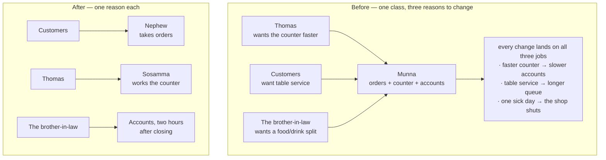
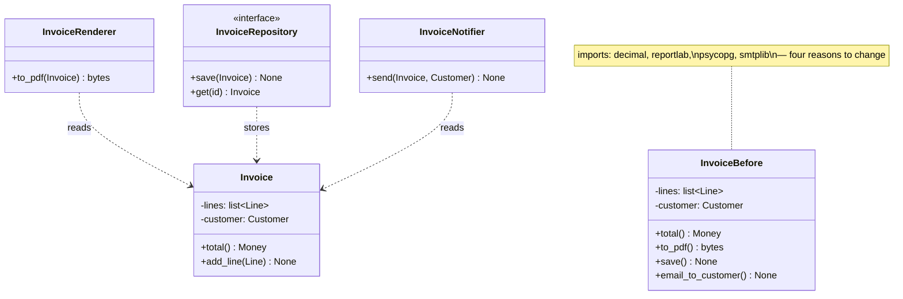

# Day 055 · System Design — Single responsibility

**After today you can:** You can spot a class doing two jobs and split it.

**The interviewer asks it as:** *This class is 800 lines. What is wrong with it?*

---

## 1. What this is, and why they ask it

The **single responsibility principle** is the S in SOLID, and it says: a class should have one
reason to change. Not "a class should do one thing", which is the version everybody quotes and which
is too vague to act on. **One reason to change** — meaning one group of people, with one job, who
would ever come and ask for this class to be different.

They ask it because it is the first principle of the five and the one every other principle depends
on, and because it is the fastest way to tell whether a candidate has maintained code or only written
it. Somebody who has only written code sees an 800-line class and says "it is long". Somebody who has
maintained one says "the pay calculation and the CSV export are in here together, so the finance team
and the reporting team both edit this file, and their changes collide". That second sentence is what
is being scored. This is also where the OOD phase you just finished turns into a set of named rules —
[day 044](../day-044-first-and-last-occurrence/README.md) already told you a responsibility is
something you can say in one sentence with no "and", and today gives you the reason that test works.

---

## 2. The story

There is a small eating house near the bus stand in Kottayam, eleven tables, run by a man called
Thomas, and for about four years everything in it went through one boy called Munna.

Munna took the orders at the tables. Munna sat at the counter and took the money when people left.
And at night, after the shutters came down, Munna sat with Thomas and worked out what had come in and
what had gone out and what was owed to the vegetable supplier.

He was good at all three. That was never the problem.

The problem was that three different people kept asking him to change how he worked, and none of them
knew about the other two.

Thomas wanted the counter faster at lunch, because the queue was reaching the door and people were
walking off. So Munna started keeping the money loose in a tray instead of counting it properly into
the box, and that made the counter quicker and made the night accounts take an extra forty minutes.

The customers wanted somebody at the tables. When Munna was at the counter nobody took orders, so
food went out late, so people at the counter waited longer to pay, so the queue got worse. Fixing the
tables made the counter slower.

And Thomas's brother-in-law, who did the tax paperwork twice a year, wanted the day's takings split
between food and drinks. That is one extra thing to note down — except the only moment Munna could
note it was at the counter, in the middle of the lunch rush, which put the queue back to the door
again.

Three people, three completely different concerns, one boy. Every improvement for one of them was a
problem for the other two, and none of them could see why.

The day it actually broke was a Thursday in June when Munna had fever and did not come in. Nobody
could take an order, nobody could take money, and nothing was written down that night at all. Thomas
shut at four.

What he did after that took a week and cost him one extra salary. His nephew took the tables. A woman
called Sosamma, who had done it before somewhere else, took the counter. And the night accounts went
to a man who came for two hours after closing and did nothing else.

Thomas told me the part that surprised him. It was not that the work got faster, although it did a
bit. It was that a change stopped being frightening. When his brother-in-law asked for the food and
drink split, that was now a conversation with one man, for two hours, after closing, and the lunch
queue never heard about it.

---

## 3. The idea in plain English

Munna is a class doing three jobs. Thomas, the customers and the brother-in-law are three **reasons
to change**, and the pain was never the amount of work — it was that a change asked for by one of
them landed on top of the other two.

### The principle, stated properly

> **A class should have one reason to change.**

The sharper version, which is the one to use in an interview: **gather together the things that
change for the same reason, and separate the things that change for different reasons.**

And the sharpest version, which explains why the other two work: a "reason to change" is a **person
or a role** who asks for the change. Not a technical topic — a stakeholder. Munna's three reasons had
names: Thomas, the customers, the brother-in-law.

### Why "does one thing" is the wrong version

Everybody quotes "a class should do one thing", and it falls apart the moment you use it, because
"one thing" has no fixed size. Is "handle an order" one thing? Is "validate an order" one thing? Is
"check that the postcode is six digits" one thing? Every answer is defensible, so the rule decides
nothing, and people end up either leaving 800-line classes alone or splitting until every class has
one method.

"One reason to change" decides it, because you can actually go and look. Ask: **who would come and
ask for this to be different?** If the answer is one team, leave it together. If it is two teams, it
is two classes.

### The canonical example

```python
class Employee:
    def calculate_pay(self) -> Money: ...       # the finance team owns this rule
    def report_hours(self) -> str: ...          # the HR team owns this rule
    def save(self, db) -> None: ...             # the platform team owns this
```

Three methods, three teams, one file. Now the failure, concretely: finance and HR both want overtime
counted, and the two definitions are *almost* the same, so someone writes one shared helper. Six
months later finance changes how overtime is calculated for a tax reason. HR's hours report silently
changes too, and nobody notices until an employee queries their timesheet.

That is the real cost, and it is not "the file is long". It is that **two independent rules were
coupled by accident because they lived in the same place.**

The fix names the three responsibilities:

```python
class Employee:                    # the data and the rules about being an employee
    ...

class PayCalculator:               # owned by finance
    def calculate(self, employee: Employee) -> Money: ...

class HoursReporter:               # owned by HR
    def report(self, employee: Employee) -> str: ...

class EmployeeRepository:          # owned by the platform team
    def save(self, employee: Employee) -> None: ...
```

Now finance's change touches one file, and the HR report cannot be affected by it.

### The second canonical example, and the trap in it

```python
class Invoice:
    def total(self) -> Money: ...           # the business rule
    def to_pdf(self) -> bytes: ...          # presentation
    def save(self) -> None: ...             # persistence
    def email_to_customer(self) -> None: ...# notification
```

Four responsibilities, and the tell is the imports: this file imports a PDF library, a database
driver and an SMTP client to do arithmetic on money. The trap is that `total()` genuinely belongs on
`Invoice` — it is behaviour next to the data it needs, which is exactly what
[day 044](../day-044-first-and-last-occurrence/README.md) told you to do. **Splitting is not
"move everything out into services."** Keep the domain rule; move the format, the storage and the
sending.

### How to spot a violation, in order of usefulness

1. **You cannot describe the class in one sentence without "and".** *"It calculates the invoice total
   and renders it as a PDF."* Two responsibilities, and the word `and` told you.
2. **The imports disagree with each other.** A file that imports both `decimal` and `smtplib` is
   doing arithmetic and sending mail.
3. **The class name is a noise word.** `OrderManager`, `DataProcessor`, `Utils`, `Helper`,
   `Service`. These names are vague precisely because the class has no single responsibility to be
   named after. A class you cannot name specifically is a class you have not decided about.
4. **Two teams keep editing the same file.** This one is measurable — the version history tells you,
   and it is the most direct evidence the principle exists at all.
5. **Test setup is long and mostly irrelevant.** If testing the discount calculation requires a
   database connection and an SMTP host, the discount calculation is living with things it does not
   need.
6. **The class has fields that most of its methods never touch.** Two clusters of fields, each used
   by its own cluster of methods, is two classes that have been stapled together.

### The other direction, which matters just as much

You can violate this principle by splitting too much. Fifteen classes with one method each, that must
all be constructed in the right order to do anything, is not a better design — the responsibility has
simply been smeared across fifteen files, and now a reader has to visit all of them to understand one
flow. **Cohesion is the other half of the rule:** things that change together should live together.
The full vocabulary for that arrives on
[day 061](../day-061-collisions/README.md).

---

## 4. The picture

Munna, before and after:



**What to notice:** the arrows. In the top half three different stakeholders point at one box, and
that is the definition of the violation — not the box's size. In the bottom half each stakeholder
points at exactly one box, so a change from one of them cannot disturb the others.

The `Invoice` split, as classes:



**What to notice:** `total()` stayed on `Invoice`. It is the business rule and it belongs next to the
data it needs. Only the format, the storage and the sending moved out — and notice the arrows all
point *at* `Invoice`, which now imports nothing but `decimal`. A class that everything depends on and
that depends on nothing is exactly what you want at the centre of a model.

Where the change lands, which is the whole argument:

```
 BEFORE — one class, four concerns

   finance changes the tax rule       -> edit Invoice.py  (risk: PDF, DB, email)
   design changes the PDF layout      -> edit Invoice.py  (risk: tax, DB, email)
   platform migrates to a new DB      -> edit Invoice.py  (risk: tax, PDF, email)
   marketing changes the email copy   -> edit Invoice.py  (risk: tax, PDF, DB)

   4 teams, 1 file, every change reviewed by people who understand one quarter of it


 AFTER — one class per concern

   finance   -> Invoice.py             (imports: decimal)
   design    -> InvoiceRenderer.py     (imports: reportlab)
   platform  -> InvoiceRepository.py   (imports: psycopg)
   marketing -> InvoiceNotifier.py     (imports: smtplib)

   4 teams, 4 files, zero overlap
```

**What to notice:** the risk column in the top half. Nothing about the *code* got worse when four
concerns shared a file — what got worse is that every change now carries three risks it has no
business carrying.

---

## 5. How it actually works

### The refactor, in six mechanical steps

This is the sequence to run out loud when an interviewer hands you a fat class.

**Step 1 — list the methods and name the stakeholder for each.** Not the topic; the *person*.

```
 class OrderProcessor (642 lines)

   validate_order()          -> the business  (what makes an order valid)
   calculate_total()         -> finance       (pricing, tax, discounts)
   apply_discount_code()     -> marketing     (campaign rules)
   reserve_inventory()       -> operations    (stock rules)
   charge_card()             -> finance/payments
   save_to_db()              -> platform
   send_confirmation_email() -> marketing     (copy, templates)
   generate_invoice_pdf()    -> finance/design
   log_analytics_event()     -> data team
```

Nine methods, six stakeholders. Say that number out loud — it is the evidence.

**Step 2 — group the methods whose stakeholder is the same.** Groups become classes.

**Step 3 — find the fields each group actually touches.** A group that uses three of the class's
fourteen fields is a class trying to leave. A group that uses all fourteen probably belongs where it
is.

**Step 4 — extract the group with the *most* independent stakeholder first.** Usually persistence or
notification, because they touch the fewest fields and nothing depends on them.

**Step 5 — inject the new collaborator rather than constructing it**
([day 053](../day-053-merge-sort/README.md)), so the original class stays testable.

**Step 6 — check the imports.** After the split, each file's import list should be readable as a
sentence about what that file does. If `Order.py` still imports `smtplib`, you missed one.

### Before

```python
class OrderProcessor:
    def __init__(self, order_id: str) -> None:
        self.order = fetch_order(order_id)              # hidden dependency, untestable
        self.conn = psycopg.connect(os.environ["DB"])   # ditto
        self.smtp = smtplib.SMTP(os.environ["SMTP"])    # ditto

    def process(self) -> None:
        if not self.order.items:
            raise ValueError("empty order")
        total = sum(i.price * i.quantity for i in self.order.items)
        if self.order.code:
            total *= (1 - DISCOUNTS[self.order.code])   # marketing's rule
        total *= 1.18                                   # finance's rule (GST)
        for item in self.order.items:                   # operations' rule
            self.conn.execute(
                "UPDATE stock SET qty = qty - %s WHERE sku = %s",
                (item.quantity, item.sku),
            )
        charge_id = razorpay.charge(total, self.order.token)
        self.conn.execute(
            "INSERT INTO orders (id, total, charge) VALUES (%s, %s, %s)",
            (self.order.id, total, charge_id),
        )
        self.smtp.sendmail(                             # marketing's copy
            "orders@shop.in", self.order.email,
            f"Subject: Order confirmed\n\nYour total is {total}",
        )
        analytics.track("order_placed", {"total": total})
```

One method, six stakeholders, four external systems, and no way to test any single rule.

### After

```python
from dataclasses import dataclass
from typing import Protocol


@dataclass(frozen=True)
class Money:
    paise: int

    def __mul__(self, factor: float) -> "Money":
        return Money(round(self.paise * factor))

    def __add__(self, other: "Money") -> "Money":
        return Money(self.paise + other.paise)


@dataclass
class Order:
    """The business's rules about what an order IS. Imports nothing external."""
    order_id: str
    email: str
    items: list["Line"]
    discount_code: str | None = None

    def subtotal(self) -> Money:
        total = Money(0)
        for line in self.items:
            total = total + line.amount()
        return total

    def is_valid(self) -> bool:
        return bool(self.items) and all(line.quantity > 0 for line in self.items)
```

```python
class Pricing:
    """Owned by finance. One reason to change: the tax or discount rules."""

    def __init__(self, gst_rate: float, discounts: dict[str, float]) -> None:
        self._gst_rate = gst_rate
        self._discounts = discounts

    def total_for(self, order: Order) -> Money:
        total = order.subtotal()
        if order.discount_code:
            total = total * (1 - self._discounts.get(order.discount_code, 0.0))
        return total * (1 + self._gst_rate)
```

```python
class InventoryReservation(Protocol):
    def reserve(self, order: Order) -> None: ...

class OrderRepository(Protocol):
    def save(self, order: Order, total: Money, charge_id: str) -> None: ...

class Notifier(Protocol):
    def order_confirmed(self, order: Order, total: Money) -> None: ...

class PaymentGateway(Protocol):
    def charge(self, amount: Money, token: str) -> str: ...
```

And the coordinator, which now does exactly one thing — decide the *order* of the steps:

```python
class PlaceOrder:
    """One responsibility: the sequence. No rule about money, stock, or wording."""

    def __init__(
        self,
        pricing: Pricing,
        inventory: InventoryReservation,
        payments: PaymentGateway,
        orders: OrderRepository,
        notifier: Notifier,
    ) -> None:
        self._pricing = pricing
        self._inventory = inventory
        self._payments = payments
        self._orders = orders
        self._notifier = notifier

    def execute(self, order: Order, token: str) -> Money:
        if not order.is_valid():
            raise ValueError("an order needs at least one item with a positive quantity")
        total = self._pricing.total_for(order)
        self._inventory.reserve(order)
        charge_id = self._payments.charge(total, token)
        self._orders.save(order, total, charge_id)
        self._notifier.order_confirmed(order, total)
        return total
```

Five constructor arguments is a lot, and it is *deliberately* visible: the class needs five
collaborators because placing an order genuinely involves five concerns. That is honest, and it is
the point — a fat constructor is a signal you can read, whereas six hidden `import`s inside a method
are not.

### Is the coordinator itself a violation?

No, and this is the question interviewers use to separate people who have read about SRP from people
who have applied it. `PlaceOrder` has exactly one reason to change: **the sequence of steps
changes.** If the business decides to charge before reserving stock, this class changes and nothing
else does. If the tax rate changes, `Pricing` changes and this class does not. That is one reason to
change, and it is a legitimate responsibility with a name: orchestration.

### What real systems look like

- **Unix.** `ls` lists, `sort` sorts, `wc` counts. Each program has one reason to change, and they
  compose through pipes. This is the principle at the process level, from 1973, and it is why the
  tools have outlived every framework built since.
- **The layered web application.** Model, repository, service, view, serialiser. Django's fat-model
  debate is entirely an SRP argument: does business logic belong on the model, or in a service? The
  answer people converge on is the one above — domain rules on the model, persistence and
  presentation outside it.
- **React and its relatives.** The container/presentational split is SRP: one component decides what
  data to fetch, another decides how it looks. Designers change the second and never the first.
- **Microservices.** SRP at the deployment level, with the same failure modes in both directions —
  split by stakeholder and it works, split by noun and you get fifteen services that must all be
  deployed together.
- **Where you can measure it.** Version-control history is the only direct evidence:

```bash
git log --format='%an' --since=1.year -- src/OrderProcessor.py | sort -u | wc -l
```

If that returns 1 or 2, the class is probably fine however long it is. If it returns 9, from four
different teams, that is the violation, in data.

---

## 6. The numbers

### What a shared file costs, measured

```
 OrderProcessor.py -- 642 lines, 6 stakeholders

 commits in a year                     : 84
 distinct authors                      : 11
 merge conflicts on this file          : 19   (23% of commits)
 average review turnaround             : 2.4 days
   -- because a reviewer who understands pricing
      must also sign off on SQL and email templates

 after the split, per file
 Pricing.py            : 14 commits, 3 authors, 0 conflicts, 4-hour reviews
 OrderRepository.py    :  6 commits, 2 authors, 0 conflicts
 Notifier.py           : 21 commits, 4 authors, 1 conflict
```

The conflict count is the number to quote. Nineteen merge conflicts in a year is roughly one every
two and a half weeks where two people's work has to be manually reconciled by someone who did not
write either half.

### Blast radius

```
 "change the GST rate from 18% to 12%"

 before : 1 file touched, but it contains 5 other concerns
          tests that must be re-run : all 63 tests of OrderProcessor
          things that could break   : stock, payment, persistence, email, analytics
          reviewers needed          : finance + platform + marketing

 after  : 1 file touched (Pricing.py, 22 lines)
          tests that must be re-run : 9 pricing tests
          things that could break   : pricing
          reviewers needed          : finance
```

### Test cost

```
 Testing "a 10% discount code reduces the total correctly"

 before : construct OrderProcessor  -> needs a DB connection
                                    -> needs an SMTP host
                                    -> needs a Razorpay key
          test runtime  ~180 ms, and it fails when the network is slow
          lines of setup: 24

 after  : Pricing(gst_rate=0.18, discounts={"DIWALI": 0.10}).total_for(order)
          test runtime  ~0.1 ms
          lines of setup: 3

 1,800x faster, and it cannot flake.
```

### The reading cost, which is why long classes are actually bad

```
 Understanding "how is the total calculated?"

 642-line class : read ~200 lines to be sure nothing else modifies `total`
                  (it is assigned in 4 places)
  22-line class : read 22 lines, and the class imports only `decimal`,
                  so nothing external can be involved
```

The real cost of a long class is not that it is long. It is that you cannot be **sure** about
anything in it without reading all of it, because any line might touch any field.

### And the cost of over-splitting

```
 The same flow, split into 15 one-method classes:

 files to open to follow one order being placed : 15
 constructor arguments in the top-level object  :  9
 lines of wiring in main()                      : 38
 time for a new joiner to trace the flow        : ~40 minutes

 Against 5 classes with real responsibilities   :  5 files, 5 arguments, ~8 minutes
```

Both failures are real. Six hundred lines in one class and one method in each of fifteen classes are
the same mistake — the responsibility boundary was drawn somewhere other than where the reasons to
change are.

---

## 7. The trade-offs

### What splitting costs you

**More files, and more names to invent.** Every extracted class needs a name, and a bad name
(`OrderHelper`) is worse than no split at all, because it hides the responsibility instead of
declaring it.

**Indirection.** Following one order through five classes means five files instead of one scroll. For
a small program that is a net loss, and pretending otherwise is dishonest.

**Wiring.** Somebody has to construct five objects and pass them in. That is the composition root
from [day 053](../day-053-merge-sort/README.md), and it grows.

**A risk of anaemia.** The commonest bad split takes *all* the behaviour out of the entity and leaves
a bag of fields plus a `Service` class — which is precisely the anaemic model
[day 044](../day-044-first-and-last-occurrence/README.md) warned about. Splitting by *technical
layer* rather than by *reason to change* is how that happens. `Invoice.total()` stays on `Invoice`.

### When a big class is the right answer

**I would not split a class if** all its methods change for the same reason, however many there are.
A `Matrix` class with forty methods — multiply, transpose, invert, determinant — has one reason to
change: the mathematics of matrices. Splitting it into `MatrixMultiplier` and `MatrixTransposer` is
worse in every way, because none of those pieces is independently useful and the fields are shared by
all of them.

**I would not split if the pieces cannot exist independently.** If class B can only ever be
constructed by class A, used by class A, and tested through class A, then B is not a separate
responsibility; it is A's implementation with a file of its own.

**I would not split at the start of a project.** You cannot see the reasons to change until somebody
has asked for a change. Two or three concerns in one class in week one is fine; the tell that it is
time is the *second* time two different people edit it for unrelated reasons. Splitting a
responsibility you guessed at is how you end up with fifteen wrong boundaries.

### The genuinely hard part

Deciding what counts as a reason. Is "the tax rate changed" the same reason as "we now support a
second country"? Reasonable engineers disagree, and the honest answer is that you cannot always tell
in advance — which is why the version history matters more than the principle. **Let the second
unrelated change tell you where the seam is.** Guessing produces boundaries that have to be undone,
and undoing a boundary is more expensive than never drawing it.

### Where it interacts with the rest of SOLID

SRP decides *what* the classes are. The other four decide how they relate: open/closed
([day 056](../day-056-non-comparison-sorts/README.md)) says extend rather than edit, Liskov
([day 057](../day-057-stability-and-pythons-sort/README.md)) says a subtype must be usable in the
parent's place, interface segregation
([day 058](../day-058-custom-comparators/README.md)) is SRP applied to interfaces rather than
classes, and dependency inversion ([day 059](../day-059-sorting-revision/README.md)) says point the
dependency at the abstraction. **Get SRP wrong and none of the other four can help you**, because
they all assume the boundaries are in sensible places.

---

## 8. In the interview

### How it gets asked

- *"This class is 800 lines. What's wrong with it?"* — a code sample, and the expected answer names
  stakeholders, not line counts.
- *"What is the single responsibility principle?"* — and the follow-up is always "give me an
  example", so have `Employee` or `Invoice` ready.
- *"How do you decide where to split a class?"* — the reason-to-change test, and the honest admission
  that the version history is better evidence than intuition.
- *"Isn't this just adding more files?"* — the pushback question. Answer with the blast-radius and
  test-cost numbers.
- *"Can you over-apply it?"* — yes, and being able to describe the fifteen-one-method-classes failure
  is what shows judgement.

### What to say out loud, in the first ninety seconds

1. **Reject the line count as the problem.** *"The length is a symptom. The actual problem is that
   this class has more than one reason to change."*
2. **Name the stakeholders, out loud, method by method.** *"`calculate_total` changes when finance
   changes the tax rule. `send_confirmation_email` changes when marketing rewrites the copy.
   `save_to_db` changes when platform migrates the database. That's three different people asking for
   changes to one file."*
3. **Give the concrete failure, not the principle.** *"So a finance change gets reviewed by someone
   who has to also understand the SQL and the email templates, and two teams' commits collide in the
   same file — nineteen merge conflicts in a year on the one I'm thinking of."*
4. **Say what stays.** *"I'd keep `total()` on `Invoice` — that's a business rule and it belongs next
   to the data. I'd move the PDF rendering, the persistence and the email out. This isn't 'take all
   the behaviour out and put it in services' — that's the anaemic model."*
5. **Name the resulting classes and the one-sentence responsibility of each,** with no "and" in any
   sentence.

### The follow-ups

**"Isn't this just more files for the same code?"**
It is more files, and I would not pretend that is free — more names to invent, more indirection, and
a wiring step that did not exist before. What it buys is that a change stops carrying risks it has no
business carrying. Concretely: changing the GST rate from eighteen percent to twelve. In the fat
class that is one file touched, but the file also contains stock reservation, payment, persistence,
email and analytics, so the full test suite for the class has to run, the reviewer needs to
understand five things they did not write, and there is a real chance of touching something
unrelated. After the split it is twenty-two lines in `Pricing.py`, nine tests, and one reviewer from
finance. The other measurable difference is test cost: testing "a ten percent discount code reduces
the total correctly" against the fat class needs a database connection, an SMTP host and a payment
key, so it is about a hundred and eighty milliseconds and it flakes when the network is slow; against
`Pricing` it is three lines and a tenth of a millisecond and it cannot flake. And the version history
is the honest evidence — the class I have in mind had eleven distinct authors and nineteen merge
conflicts in a year, which is one every two and a half weeks where two people's unrelated work had to
be reconciled by hand.

**"How do you decide where the boundary goes?"**
By asking who would come and ask for this to be different, and grouping by the answer. Not by
technical topic — by person or role. So I go through the methods and write a stakeholder next to
each: pricing is finance, the discount campaign rules are marketing, stock is operations, the email
copy is marketing again, persistence is platform. Methods with the same stakeholder become one class.
Then I check it two ways. First the sentence test: I try to describe each new class in one sentence
with no "and" in it, and if I need an "and" the split is not finished. Second, the fields: a group of
methods that touches three of the fourteen fields is a class trying to leave, whereas a group that
touches all fourteen probably belongs where it is. And I would be honest that this is the part where
judgement is needed and intuition is often wrong — you cannot see the reasons to change until
somebody has asked for a change. So in a new codebase I would leave two concerns together rather than
guess, and let the *second* unrelated change tell me where the seam is. Guessing produces boundaries
that later have to be undone, and undoing one is more expensive than never drawing it.

**"Can you over-apply it? What does that look like?"**
Yes, and it fails in a way that is harder to see than the fat class. It looks like fifteen classes
with one method each — `OrderValidator`, `OrderTotalCalculator`, `OrderDiscountApplier`,
`OrderStockReserver` — none of which can be understood or used on its own, all of which must be
constructed in the right order, and following a single order through the system means opening fifteen
files instead of scrolling one. That is not one responsibility per class; it is one responsibility
smeared across fifteen files, and the reader pays for it every time. The rule I use is the other half
of the principle, which people quote less: gather together the things that change for the same
reason. A `Matrix` class with forty methods has one reason to change — the mathematics of matrices —
and splitting it into `MatrixMultiplier` and `MatrixTransposer` is worse in every respect, because
none of the pieces is independently useful and they all share the same data. The related failure is
splitting by technical layer rather than by reason: if I pull every method off `Invoice` and put them
in an `InvoiceService`, I have made an anaemic model, which is fields with no behaviour, and I have
lost the main thing objects are for. `Invoice.total()` stays on `Invoice`; only the PDF, the
persistence and the email move out.

### A model answer

> "The eight hundred lines are a symptom rather than the problem. The problem is that this class has
> more than one reason to change, and I'd show that by naming who would ask for each change.
> `calculate_total` changes when finance changes the tax or discount rules. `send_confirmation_email`
> changes when marketing rewrites the copy. `save_to_db` changes when the platform team migrates the
> database. `reserve_inventory` changes when operations changes the stock policy. That's four
> different groups of people editing one file, and the single responsibility principle is really the
> statement that a class should have one reason to change — one group of people who would ever come
> and ask.
>
> The concrete harm is not that the file is long. It's that unrelated things become coupled by
> accident. If finance and HR both need overtime, someone writes one helper because the definitions
> look the same, and then a tax change to one silently changes the other. And practically: eleven
> distinct authors on the file in a year, nineteen merge conflicts, and every review needs someone who
> understands pricing, SQL and email templates.
>
> So I'd split by stakeholder. `Pricing` for the finance rules. `InventoryReservation`,
> `OrderRepository` and `Notifier` behind interfaces. And a `PlaceOrder` class whose only
> responsibility is the sequence — it decides that pricing happens before reservation and reservation
> before payment, and nothing else. That's a legitimate single responsibility with a name:
> orchestration. If the business decides to charge before reserving stock, that class changes and
> nothing else does.
>
> One thing I'd be careful about. `Invoice.total()` stays on `Invoice`. Splitting doesn't mean moving
> all the behaviour into service classes — that gives you a bag of fields and a procedure, which is
> the anaemic model. The business rule belongs next to the data it needs; it's the format, the storage
> and the sending that leave.
>
> And it can be over-applied. Fifteen classes with one method each is the same mistake in the other
> direction — the responsibility is smeared instead of concentrated, and a new joiner opens fifteen
> files to follow one order. I'd rather leave two concerns together in a new codebase and let the
> second unrelated change show me where the seam actually is, because a boundary I guessed at is
> expensive to undo."

---

## 9. Recall card

- **"One reason to change", not "does one thing"** — and a *reason* is a **person or a role**, not a
  topic. `Employee` with `calculate_pay` (finance) + `report_hours` (HR) + `save` (platform) is three
  stakeholders in one file. The harm is not length; it is that two unrelated rules get coupled by
  accident and one team's change silently breaks another's.
- **Six ways to spot it:** you need an "and" to describe the class · the imports disagree (`decimal`
  *and* `smtplib`) · the name is a noise word (`Manager`, `Processor`, `Utils`) · **two teams keep
  editing the same file** (the only measurable one — check the version history) · long, irrelevant
  test setup · two clusters of fields used by two clusters of methods.
- **The refactor:** list the methods and name the *stakeholder* for each → group by stakeholder →
  check which fields each group touches → extract the most independent group first → inject rather
  than construct → re-read the imports.
- **Keep the business rule where it is.** `Invoice.total()` stays on `Invoice`; only the PDF, the
  persistence and the email move out. Pulling *everything* into a `Service` is the **anaemic model**,
  which is the commonest bad split. A coordinator whose one responsibility is the *sequence* is
  legitimate.
- **It is over-appliable.** Fifteen one-method classes is the same mistake inverted — 15 files and 38
  lines of wiring to follow one flow. The other half of the rule is *gather what changes together*.
  In a new codebase, leave two concerns together and let the **second unrelated change** show you the
  seam. Numbers to quote: GST change = 22 lines and 9 tests instead of a 642-line file and 63 tests;
  the discount test goes from 180 ms with a database to 0.1 ms without one.
