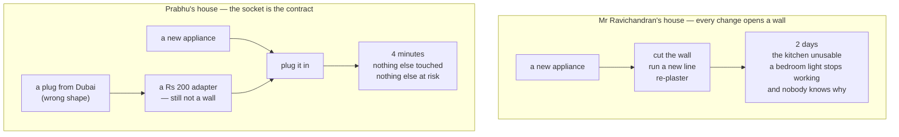
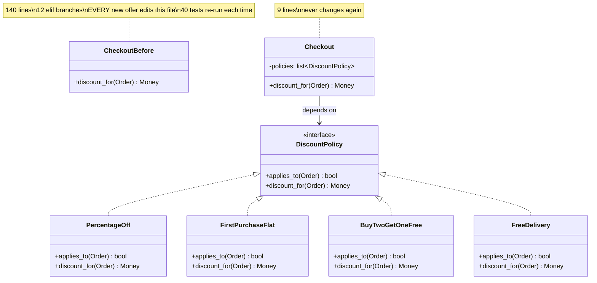

# Day 056 · System Design — Open for extension, closed for modification

**After today you can:** You can add a new behaviour without editing existing code, and show it.

**The interviewer asks it as:** *A new discount type arrives every month. How do you design for that?*

---

## 1. What this is, and why they ask it

The **open/closed principle** is the O in SOLID: software should be **open for extension and closed
for modification**. In plain words — you should be able to add a new behaviour by writing new code,
not by editing code that already works and is already tested. The mechanism is always the same: find
the place where the requirement varies, put an interface there, and let new behaviour arrive as a new
implementation.

They ask it because it is the principle that has a measurable answer. Every other design argument can
be waved away as taste; this one is settled by counting edits. "A new discount type is one new file
and one line of registration, against four edits to code that is currently in production" is not an
opinion. It is also the principle candidates most often over-apply — building plug points for
variation that never arrives — so the interviewer is listening for both halves: can you make
extension cheap, and do you know when not to. You have the machinery already. Polymorphism from
[day 047](../day-047-minimise-the-maximum/README.md) is the mechanism, interfaces from
[day 048](../day-048-binary-search-on-floats/README.md) are the shape, and yesterday's single
responsibility decides where the boundary goes.

---

## 2. The story

Prabhu has done the electrical work in that part of Coimbatore for about twenty years, and he
explains it the same way to every family building a house, usually while standing in a room with
nothing in it.

The house he always tells them about belonged to a man called Ravichandran, built in 1994, and it was
wired for exactly what the family owned at the time. Lights in every room. A fan in three of them.
One point in the kitchen for the grinder, and one in the hall for the television. That is what they
had, so that is what was put in, and everything was neat and correct and inside the walls.

Then in 1997 they bought a mixer. Prabhu came, and he had to cut the wall to run a new line from the
box in the passage to the kitchen, and re-plaster it, and the kitchen was unusable for two days.

In 1999 it was a fridge. Different corner of the kitchen, so another line, another cut, another two
days. In 2002 an air cooler for the bedroom, and that one was worse, because the line from the box to
that side of the house was already carrying as much as it should and he had to think hard about it and
partly redo the passage. And every time he opened a wall, something that had been working perfectly
for years was suddenly at risk, and twice something was — once a bedroom light stopped working for a
reason nobody ever properly found.

By 2004 Mr Ravichandran had stopped buying things. Not because he did not want them. Because every
new thing meant Prabhu, and the wall, and two days.

The house Prabhu built for his own family, he did differently, and it is what he does everywhere now.
Four points in every room, at two heights. A separate line for the kitchen with plenty of room in it.
The box in the passage with four spare ways in it, labelled, doing nothing.

His wife thought the spare ways were a waste of money and told him so, and she was partly right — two
of them are still empty.

But in eighteen years nobody has cut a wall in that house. A new thing arrives, you plug it in, and
that is the entire job. The washing machine took four minutes. The inverter took an afternoon, and
only because it is heavy.

The reason it works, Prabhu says, is not the number of points. It is that everybody agreed on the
shape of the plug a long time ago. The socket does not know or care what is going to be plugged into
it — it only promises two flat pins and a round one, and anything that offers those pins will work.
The one time it did not was a coffee machine his brother brought from Dubai with fat round pins, and
even that was not a wall. It was a small piece in between, bought for two hundred rupees, that had
Dubai on one side and Coimbatore on the other.

---

## 3. The idea in plain English

Mr Ravichandran's house is a class with an `if` chain in it. Every new appliance is a new
requirement, and every new requirement means opening the wall — editing code that was working. Prabhu
sockets are interfaces. The agreed shape of the plug is the contract. And his brother's coffee
machine is an adapter.

### The principle

> **Open for extension, closed for modification.**

Open for extension: the behaviour of the system can grow. Closed for modification: it grows without
anyone editing the source of what is already there.

Those two sound contradictory until you see the mechanism, which is one sentence: **depend on an
abstraction, and let new behaviour arrive as a new implementation of it.** The existing code calls a
method through an interface; it never learns how many implementations exist.

### The problem, in code

The discount rules for an online shop:

```python
def discount_for(order: Order) -> Money:
    if order.code == "DIWALI":
        return order.subtotal * 0.10
    elif order.code == "FIRSTBUY":
        return Money(20000) if order.subtotal.paise > 100000 else Money(0)
    elif order.code == "STUDENT":
        return order.subtotal * 0.15
    return Money(0)
```

It is October, and marketing wants a "buy two get one free" offer. You open this function and add a
branch. Then in November they want a coupon that gives free delivery. Another branch. By March this
function is a hundred and forty lines and it is the most-edited file in the codebase, and every one
of those edits was made in the same place as code that was working perfectly.

Four specific things go wrong, and they are the argument:

1. **You must edit tested code to add untested code.** Every new offer touches a function that
   currently passes forty tests, so all forty must be re-run and re-reviewed.
2. **The blast radius is everything.** A typo in the new branch can break Diwali.
3. **The file becomes a merge point.** Two people adding two offers in the same sprint conflict.
4. **The function cannot be closed.** There is no version of it that is finished, so it is never
   safe.

### The fix

```python
class DiscountPolicy(Protocol):
    def applies_to(self, order: Order) -> bool: ...
    def discount_for(self, order: Order) -> Money: ...
```

```python
class PercentageOff:
    def __init__(self, code: str, fraction: float) -> None:
        self._code, self._fraction = code, fraction

    def applies_to(self, order: Order) -> bool:
        return order.code == self._code

    def discount_for(self, order: Order) -> Money:
        return order.subtotal * self._fraction
```

And the calling code, which is now finished forever:

```python
class Checkout:
    def __init__(self, policies: list[DiscountPolicy]) -> None:
        self._policies = policies

    def discount_for(self, order: Order) -> Money:
        for policy in self._policies:
            if policy.applies_to(order):
                return policy.discount_for(order)
        return Money(0)
```

Read `Checkout` again. There is nothing in it that will ever need to change when a new offer arrives.
It does not know how many policies exist, what they are called, or what they do. **That is what
"closed" means** — not that the file is locked, but that no future requirement of this kind gives you
a reason to open it.

A new offer is now:

```python
class BuyTwoGetOneFree:
    def applies_to(self, order: Order) -> bool:
        return any(line.quantity >= 3 for line in order.lines)

    def discount_for(self, order: Order) -> Money:
        cheapest = min(line.unit_price for line in order.lines)
        return cheapest
```

One new file. Then one line where the list is built — the composition root from
[day 053](../day-053-merge-sort/README.md):

```python
POLICIES = [
    PercentageOff("DIWALI", 0.10),
    PercentageOff("STUDENT", 0.15),
    FirstPurchaseFlat(Money(20000), minimum=Money(100000)),
    BuyTwoGetOneFree(),                  # <-- the only edit, in the wiring
]
```

### Where the modification went

Be honest about this, because a sharp interviewer will press on it: **something always changes.** You
have not achieved zero edits; you have moved the edit to a place where it is safe.

```
 before : the edit is inside a 140-line function containing 12 other live rules
 after  : the edit is one line in a list, in a file that contains only wiring
```

The one line in the wiring cannot break Diwali. The branch inside the function can. That is the whole
gain, and stating it that way is more convincing than claiming the code is never touched.

You can go further and remove even that line, with a registry that discovers implementations —
Python entry points, a decorator that self-registers, a scan of a package. That is genuinely zero
edits, and it costs you the ability to see the full list in one place. Most teams take the one line.

### The three ways to build the plug point

**One: an interface with implementations.** What is shown above. Use it when the variations have
behaviour.

**Two: a lookup table.** When the variation is *data* rather than behaviour, a dict is the right
answer and an interface is over-engineering:

```python
GST_RATES = {"food": 0.05, "electronics": 0.18, "books": 0.00}
```

A new category is a new entry, not a new class. **Do not build a `TaxRateStrategy` hierarchy for
this.**

**Three: a callback or a hook.** When the extension is a single function, pass the function. Python's
`sorted(key=...)` is exactly this — `sorted` is closed and has been for twenty years, and you extend
it with a one-line lambda.

### The rule for when to build it

Do not build a plug point for a variation that has happened once. Build it when the **second** one
arrives, or when you can name a specific one that is definitely coming. That is the same test as
[day 048](../day-048-binary-search-on-floats/README.md)'s: **name the second implementation.** If you
cannot, you are guessing, and a guessed-at plug point in the wrong place is worse than the `if`
chain — it has all the indirection and none of the benefit.

---

## 4. The picture

The two houses:



**What to notice:** the bottom half still has a change in it. Something is plugged in; the house is
not static. What has changed is *where* the change lands — at a prepared point, where nothing that
already works can be disturbed.

The discount code, before and after:



**What to notice:** the arrow from `Checkout` points at the *interface*, and all the implementation
arrows point *up* at the interface too. Nothing points from `Checkout` at a concrete class. Adding
`FreeDelivery` adds one box and one dashed arrow, and touches nothing that exists.

Where the edit lands, drawn as a target:

```
 BEFORE — the edit lands in the blast zone

   +------------------------------------------------+
   |  discount_for()      140 lines                  |
   |    DIWALI      <- working, tested, in production |
   |    FIRSTBUY    <- working, tested, in production |
   |    STUDENT     <- working, tested, in production |
   |    ...9 more                                     |
   |    BUY2GET1    <- NEW CODE, dropped in here      |
   +------------------------------------------------+
      one typo anywhere in this file breaks live revenue


 AFTER — the edit lands outside it

   +---------------------+       +--------------------------+
   |  Checkout           |  -->  |  DiscountPolicy          |
   |  9 lines, closed    |       |  (interface)             |
   +---------------------+       +--------------------------+
                                    ^     ^     ^      ^
                                    |     |     |      |
                            DIWALI  FIRSTBUY STUDENT  BUY2GET1
                            (untouched files)         (new file)

   +--------------------------------------+
   |  policies.py -- the wiring            |
   |  POLICIES = [ ..., BuyTwoGetOneFree() ]  <- the ONE line that changed
   +--------------------------------------+
```

**What to notice:** the change is not eliminated, it is relocated. A one-line addition to a list of
constructors cannot produce a wrong discount for Diwali; a new branch in a shared function can.

---

## 5. How it actually works

### The refactor, in five steps

**Step 1 — find the axis of change.** Look at the version history and ask what kind of change keeps
arriving. Not any change — the *repeating* one. Discounts. Payment providers. Export formats.
Notification channels. That repetition is the evidence, and it is what stops this being guesswork.

**Step 2 — name the question the `if` chain is answering.** The chain
`if code == "DIWALI" ... elif code == "STUDENT"` is answering "how much comes off this order?" That
sentence becomes the interface method: `discount_for(order) -> Money`.

**Step 3 — declare the interface in your own vocabulary.** Your `Order`, your `Money`. A vendor type
in the signature means the interface belongs to the vendor
([day 048](../day-048-binary-search-on-floats/README.md)).

**Step 4 — move each branch into its own class**, one at a time, running the tests after each. The
branch body becomes the method body almost verbatim.

**Step 5 — replace the chain with a loop over the collection, and delete the type tag.** If the
`order.code` string survives as something the caller switches on, somebody will rebuild the chain
next quarter.

### The full example, runnable

```python
from dataclasses import dataclass
from typing import Protocol


@dataclass(frozen=True)
class Money:
    paise: int

    def __mul__(self, f: float) -> "Money":
        return Money(round(self.paise * f))

    def __sub__(self, other: "Money") -> "Money":
        return Money(self.paise - other.paise)

    def __lt__(self, other: "Money") -> bool:
        return self.paise < other.paise


@dataclass(frozen=True)
class Line:
    sku: str
    unit_price: Money
    quantity: int


@dataclass(frozen=True)
class Order:
    lines: list[Line]
    code: str | None = None
    customer_orders_so_far: int = 0

    @property
    def subtotal(self) -> Money:
        return Money(sum(line.unit_price.paise * line.quantity for line in self.lines))
```

```python
class DiscountPolicy(Protocol):
    """The plug point. Everything below is a new socket, never a new wall."""

    def applies_to(self, order: Order) -> bool: ...
    def discount_for(self, order: Order) -> Money: ...
```

```python
class PercentageOff:
    def __init__(self, code: str, fraction: float) -> None:
        self._code, self._fraction = code, fraction

    def applies_to(self, order: Order) -> bool:
        return order.code == self._code

    def discount_for(self, order: Order) -> Money:
        return order.subtotal * self._fraction


class FirstPurchaseFlat:
    def __init__(self, amount: Money, minimum: Money) -> None:
        self._amount, self._minimum = amount, minimum

    def applies_to(self, order: Order) -> bool:
        return order.customer_orders_so_far == 0 and self._minimum < order.subtotal

    def discount_for(self, order: Order) -> Money:
        return self._amount


class BuyTwoGetOneFree:
    """October's new requirement. A NEW FILE. Nothing above was edited."""

    def applies_to(self, order: Order) -> bool:
        return any(line.quantity >= 3 for line in order.lines)

    def discount_for(self, order: Order) -> Money:
        return min(line.unit_price for line in order.lines)
```

```python
class Checkout:
    """Closed. This class has no reason to change when a new offer arrives."""

    def __init__(self, policies: list[DiscountPolicy]) -> None:
        self._policies = policies

    def best_discount(self, order: Order) -> Money:
        applicable = [p.discount_for(order) for p in self._policies if p.applies_to(order)]
        return max(applicable, key=lambda m: m.paise, default=Money(0))

    def total(self, order: Order) -> Money:
        return order.subtotal - self.best_discount(order)
```

```python
# policies.py -- the composition root. The one line that changes.
POLICIES: list[DiscountPolicy] = [
    PercentageOff("DIWALI", 0.10),
    PercentageOff("STUDENT", 0.15),
    FirstPurchaseFlat(Money(20_000), minimum=Money(100_000)),
    BuyTwoGetOneFree(),
]
```

Notice that `best_discount` changed the *rule* — it now takes the best applicable offer rather than
the first. That is a genuine change to `Checkout`, and it is the right kind: it is a change to what
"discount" means, not a change caused by a new offer arriving. **Open/closed does not promise a class
never changes. It promises it does not change for *this* reason.**

### Registration without editing the list

If even the one wiring line is unacceptable — usually because a plugin ships separately from the core
— a decorator registers implementations as they are imported:

```python
POLICIES: list[DiscountPolicy] = []

def policy(cls):
    POLICIES.append(cls())
    return cls

@policy
class FreeDelivery:
    def applies_to(self, order: Order) -> bool:
        return Money(200_000) < order.subtotal
    def discount_for(self, order: Order) -> Money:
        return Money(4_000)
```

Genuinely zero edits to existing code. The cost: the list of active policies is no longer visible
anywhere, and the behaviour of the system now depends on which modules happen to be imported, which
is a real debugging cost. Python's own `functools.singledispatch` works this way, and so do pytest's
plugin hooks.

### Where you have already seen this

- **`sorted(key=...)`** — the sort is closed and has not changed since 2002; every new ordering is a
  new function you pass in, which is exactly [day 058](../day-058-custom-comparators/README.md).
- **Django middleware and Flask blueprints** — a list in a settings file. New behaviour is a new
  class plus one entry.
- **pytest plugins** — hook functions discovered through entry points, so a plugin extends pytest
  without pytest knowing it exists.
- **Kubernetes admission webhooks and custom resources** — the API server is closed; you extend the
  cluster with new resource types it has never heard of.
- **nginx modules, VS Code extensions, browser extensions, WordPress plugins** — every one of these
  is the same shape. A stable core, a published contract, and behaviour arriving from outside.
- **Java's `ServiceLoader` and Python's `importlib.metadata.entry_points`** — the language-level
  version of the decorator registry above.
- **Stripe and Razorpay webhooks** — you register a handler for an event type; the payment provider's
  code is closed to you and extended by you.

A useful sentence: **every successful platform is an open/closed argument that won.** The core team
stopped editing the core, and everyone else got to add behaviour.

---

## 6. The numbers

### The edit count, which is the whole argument

```
 Adding a new discount type

 with the if-chain
   files touched                    : 1  (the shared 140-line function)
   lines of NEW code                : ~8
   lines of EXISTING code re-read   : ~140  (to be sure the new branch fits)
   existing tests that must re-run  : 40
   reviewers who must understand
     the other 12 offers            : 1-2
   risk of breaking a live offer    : real

 with the interface
   files touched                    : 2  (1 new class + 1 wiring line)
   lines of NEW code                : ~10
   lines of EXISTING code re-read   : 0
   existing tests that must re-run  : 0  (nothing existing changed)
   new tests                        : 3  (for the new class alone)
   risk of breaking a live offer    : none, structurally
```

### Twelve offers over a year

```
 if-chain, 12 offers in 12 months:
   12 edits to one file
   the file grows 8 -> 140 lines
   merge conflicts on it            : 7
   production incidents traced to a
     change in that file            : 2
   time to add offer #12            : ~3 hours (mostly reading)

 interfaces, 12 offers in 12 months:
   12 new files, 12 wiring lines
   Checkout unchanged after month 1
   merge conflicts                  : 1  (two people adding to the same list)
   time to add offer #12            : ~25 minutes (same as offer #2)
```

The number to quote is the last one. **With the `if` chain the cost of a change grows with the number
of previous changes. With the interface it is flat.** That is the difference between a codebase that
gets slower to work in and one that does not.

### The cost of the plug point itself

Be honest about the other side of the ledger:

```
 building the interface where it was NOT needed:

   interface declaration            :  4 lines
   one implementation class         : 12 lines (against 4 lines of if-branch)
   wiring / registry                :  6 lines
   the reader now opens             :  3 files to answer "what is the discount?"
                                       instead of 1
   total                            : ~22 lines and 3 files
                                       for behaviour that never varied

 That is the cost of guessing wrong, and it is paid every time
 somebody reads the code.
```

### When the `if` chain is genuinely cheaper

```
 a variation with exactly 2 cases that has not changed in 3 years:

   if-chain     : 4 lines, 1 file, understood in 5 seconds
   interface    : 22 lines, 3 files, understood in ~90 seconds

 5x the code and 18x the reading time, to make cheap something
 that has not happened.
```

### The rule, as arithmetic

```
 build the plug point when:

   (expected number of future variations) x (cost of an edit under the if-chain)
        >
   (cost of building the plug point) + (variations) x (cost of an edit with it)

 12 x 3 hours = 36 hours          against      4 hours + 12 x 25 min = 9 hours
 -> obviously build it

  2 x 20 min  = 40 minutes        against      4 hours + 2 x 15 min = 4.5 hours
 -> obviously do not
```

The crossover in practice sits at about **three variations**, which is why the working rule is *build
it when the second one arrives* — by then you can see the axis, and the third is usually already
being discussed.

---

## 7. The trade-offs

### What the plug point costs

**Indirection.** Answering "what discount does this order get?" now means reading `Checkout`, then
the interface, then finding which implementations exist, then reading the relevant one. Three or four
files instead of one function. For a new joiner, that is real.

**A contract you must live with.** The moment two implementations exist, the interface's shape is
expensive to change — adding a method means editing every implementation, including the test fakes.
An interface is open for extension by *implementation* and quite closed to extension by *method*,
which is a genuine limitation and the reason interface segregation
([day 058](../day-058-custom-comparators/README.md)) exists.

**A place for behaviour to hide.** With a registry, the set of active policies is not visible
anywhere, and "why did this order get a discount?" becomes a debugging exercise. Prefer the explicit
list unless plugins genuinely ship separately.

### The failure mode: speculative generality

The commonest way to get this wrong is to build plug points for variation that never arrives. Symptoms:

- an interface with exactly one implementation and no test fake;
- a `Strategy` class hierarchy where a dict of values would do;
- a configuration option nobody has ever set to anything but the default;
- an abstract base class written before the second concrete case existed.

Each of those is `if`-chain-cost paid up front, forever, for a benefit that never arrived. **YAGNI —
you aren't gonna need it — is the counterweight to open/closed**, and a good answer holds both.

**I would not build a plug point if** I cannot name the second implementation. That test again, and
it is the one that keeps this principle honest.

### When to just edit the code

**I would leave the `if` chain if** the set of cases is closed and known — days of the week, the four
suits, HTTP methods, the three sizes of a T-shirt. A closed set is not an axis of change; it is data.
Building a `MondayStrategy` is a joke, and interviewers have heard it.

**I would leave it if** the variation is *data* rather than behaviour. GST rates by category is a
dict. Currency symbols are a dict. Only reach for classes when the *logic* differs, not the numbers.

**I would leave it if** it is the first occurrence. One discount type is not an axis. Wait for the
second, and let the requirement tell you where the seam is rather than guessing — the same argument
as [day 055](../day-055-quickselect/README.md).

### The honest limit of the principle

You cannot close a module against *every* kind of change, only against a chosen one. Choosing to be
closed against new discount types means you are still open to being edited if the meaning of
"discount" changes — if it becomes a list rather than one value, or if offers start stacking. That
happened in §5: `best_discount` changed the rule from "first match" to "best match", and that edit
was correct and unavoidable.

Say this out loud in an interview, because it is the sentence that shows you have used the principle
rather than read about it: **"Open/closed is always closed against a specific axis of change, and you
pick that axis from what has actually been changing."**

### Where it sits with the other four

Open/closed is the *goal*; the other principles are how you reach it. Single responsibility
([day 055](../day-055-quickselect/README.md)) decides where the boundary goes. Liskov
([day 057](../day-057-stability-and-pythons-sort/README.md)) is what makes substitution safe — if an
implementation misbehaves in the parent's place, the caller ends up adding an `if` and the whole
thing collapses. Interface segregation
([day 058](../day-058-custom-comparators/README.md)) keeps the contract small enough that new
implementations are cheap. Dependency inversion
([day 059](../day-059-sorting-revision/README.md)) is the direction of the arrow that makes it work
at all.

---

## 8. In the interview

### How it gets asked

- *"A new discount type arrives every month. How do you design for that?"* — the direct form. Answer
  with the interface, then the edit count.
- *"What is the open/closed principle?"* — and the follow-up is always "show me", so have the
  `if`-chain-to-interface refactor ready as code.
- *"Here is a function with a big if/elif chain. What would you do?"* — the same question wearing a
  code sample. The right first move is to ask which of these branches keeps changing.
- *"Doesn't this just add indirection?"* — the pushback. Answer with the flat-cost-of-change argument
  and concede the reading cost.
- *"When would you not do this?"* — the judgement question, and the one that separates people. Closed
  sets, data variations, and the first occurrence.

### What to say out loud, in the first ninety seconds

1. **Ask what has actually been changing.** *"Before I design for it — is it always a new *kind* of
   discount, with different logic? Or is it the same percentage-off rule with different numbers?
   Those need different answers."*
2. **Name the question the branch is answering.** *"The chain is answering 'how much comes off this
   order?'. That sentence is my interface method."*
3. **Show the interface and the closed class.** *"`DiscountPolicy` with `applies_to` and
   `discount_for`. `Checkout` loops over a list of them. `Checkout` now has no reason to change when
   a new offer arrives."*
4. **Give the edit count, not the principle.** *"A new offer becomes one new file and one line in the
   wiring, against editing a hundred-and-forty-line function that contains twelve live revenue rules
   and re-running forty tests."*
5. **Concede where the change went.** *"I haven't made the change disappear — I've moved it. There's
   still one line added to a list. But a line in a list of constructors cannot break Diwali, and a
   new branch inside the function can."*

### The follow-ups

**"Isn't this just moving the if-statement somewhere else?"**
Partly, and I would not pretend otherwise — something always changes when a requirement changes. What
moves is *where* the change lands and what it can damage. Before, the new offer is written inside a
hundred-and-forty-line function that also contains twelve rules currently earning revenue, so a typo
anywhere in that edit can break Diwali; every one of the forty existing tests has to be re-run; the
reviewer has to hold twelve unrelated offers in their head to judge eight new lines; and two people
adding offers in the same sprint conflict in the same file. After, the new offer is a file that
nothing else imports and one line appended to a list of constructors. The existing files are byte for
byte identical, so the existing tests are not merely passing — they are testing unchanged code, which
is a stronger statement. The second difference is the shape of the cost over time. With the chain,
adding the twelfth offer costs more than adding the second, because most of the work is reading a
function that has grown; I have seen that go from twenty minutes to three hours. With the interface
it is flat — the twelfth costs what the second cost, about twenty-five minutes, because the new class
is written in isolation. And if even the one wiring line is unacceptable, a decorator that registers
implementations on import removes it entirely, at the cost of not being able to see the active list
in one place.

**"When would you not do this?"**
Four cases, and I would check them in this order. First, when the set of cases is closed: days of the
week, the four suits in a deck, the three T-shirt sizes. That is not an axis of change, it is data
that happens to be enumerated, and a `MondayStrategy` class is worse in every respect. Second, when
the variation is data rather than behaviour: GST rates by product category is a dict, not a hierarchy
of tax strategy classes, and the tell is that every branch would have an identical body with a
different number in it. Third, when it is the first occurrence. One discount type is not an axis; I
cannot see the shape of the variation from a single instance, and a plug point built at the wrong
seam is worse than the `if` chain because it has all the indirection and none of the benefit. My rule
is to build it when the second one arrives, or when someone can name a specific one that is definitely
coming — that is the same test I use for any interface: name the second implementation. Fourth, when
the code is genuinely finished. A two-case branch that has not changed in three years is four lines
understood in five seconds; replacing it with an interface is about twenty-two lines across three
files, so five times the code and considerably more reading, to make cheap something that has not
happened. And I would add the honest limit: you can only close a module against a *chosen* axis of
change. Closing against new discount types does not close it against the meaning of "discount"
changing — when offers started stacking, my `Checkout` did have to change, and that was correct.

**"How do you decide where to put the interface?"**
By looking at what has actually been changing, not by guessing what might. The version history is the
best evidence there is: if I run through the last year of commits on a file and the same *kind* of
change keeps arriving — a new payment provider, a new export format, a new notification channel, a
new discount — that repetition is the axis, and the interface goes exactly there. Then I name the
question the branch is answering, because that sentence becomes the method: "how much comes off this
order" becomes `discount_for(order) -> Money`. I keep the interface in my own vocabulary — my `Order`,
my `Money` — because if a vendor's type appears in the signature then the interface belongs to the
vendor and it will change when they change. Then I move the branches out one at a time, running the
tests between each, and the last step is deleting the type tag, because if `order.code` survives as
something callers switch on, somebody rebuilds the chain in six months. The check that it worked is
that the class I was protecting has no remaining reference to any concrete implementation — I should
be able to grep for the implementation names and find them only in the wiring file.

### A model answer

> "First I'd ask what's actually varying, because there are two different questions hiding here. If
> every month brings the same percentage-off rule with a different code and a different number, that's
> data, and the right answer is a table — a new offer is a row, not a class. If every month brings
> genuinely different logic — buy two get one free, free delivery over two thousand, flat two hundred
> off a first purchase — then it's behaviour, and that's what open/closed is for.
>
> Assuming it's behaviour: the `if` chain is answering one question, 'how much comes off this order?',
> and that sentence becomes the interface.
>
> ```python
> class DiscountPolicy(Protocol):
>     def applies_to(self, order: Order) -> bool: ...
>     def discount_for(self, order: Order) -> Money: ...
>
> class Checkout:
>     def __init__(self, policies: list[DiscountPolicy]) -> None:
>         self._policies = policies
>
>     def best_discount(self, order: Order) -> Money:
>         applicable = [p.discount_for(order) for p in self._policies if p.applies_to(order)]
>         return max(applicable, key=lambda m: m.paise, default=Money(0))
> ```
>
> `Checkout` is now closed against this axis. It doesn't know how many offers exist or what they're
> called, so no new offer gives anyone a reason to open it.
>
> The argument I'd make is the edit count rather than the principle. Adding buy-two-get-one under the
> chain means editing a hundred-and-forty-line function that contains twelve live revenue rules,
> re-reading all of it, re-running forty tests, and getting it reviewed by someone who has to
> understand the other twelve offers. With the interface it's one new file that nothing imports, three
> new tests for it alone, and one line appended to a list. And the cost stays flat — the twelfth offer
> costs what the second cost, whereas with the chain the twelfth is the expensive one because most of
> the work is reading.
>
> I'd concede two things. The change hasn't disappeared, it's moved: there's still one line in the
> wiring, and I'd argue that a line in a list of constructors cannot produce a wrong Diwali discount
> whereas a branch inside the function can. And you can only close against a chosen axis. When
> marketing later asked for stacking offers, `Checkout` did change — from 'first match' to 'best
> match' — and that was the right kind of change, because it was the meaning of discount changing, not
> a new offer arriving.
>
> The thing I'd avoid is building this before the second variation exists. An interface with one
> implementation and no test fake is all the indirection and none of the benefit."

---

## 9. Recall card

- **Open for extension, closed for modification** — add behaviour by writing *new* code, not by
  editing code that already works. The mechanism is always: **find the axis of change, put an
  interface there, let new behaviour arrive as a new implementation.** The caller never learns how
  many implementations exist.
- **Argue it with the edit count, not the principle.** New offer with the `if` chain: 1 shared
  140-line file, 40 tests re-run, 12 live rules at risk. With the interface: **1 new file + 1 wiring
  line**, 0 existing tests re-run. And the cost stays **flat** — the twelfth costs what the second
  cost.
- **Concede that the change moved rather than vanished.** One line is still added to a list — but a
  line in a list of constructors cannot break Diwali, and a new branch inside a shared function can.
  A decorator registry removes even that line, at the cost of the active list being invisible.
- **Four times to leave the `if` chain alone:** the set is closed (weekdays, suits, sizes) · the
  variation is **data**, so a dict beats a class hierarchy (GST rates) · it is the *first* occurrence
  — build it when the **second** arrives · the code is genuinely finished. The test is always **name
  the second implementation**; speculative generality costs ~22 lines and 3 files, forever.
- **You can only close against a *chosen* axis.** Closed to new discount types is still open to
  "discount" changing meaning. Every platform you use is this principle having won — `sorted(key=)`,
  Django middleware, pytest plugins, VS Code extensions, Kubernetes CRDs, payment webhooks.
