# Day 056 · Python — redis-py: GET, SET, EX, and cache-aside

**Today's theme:** Caching with Redis

**After today you can:** You can add a cache in front of a slow query in each language and measure the difference.

**The interviewer asks it as:** *How do you keep the cache and the database consistent?*

---

## 1. What this is, and why it matters

Redis is a database that keeps everything in memory, so a read is microseconds instead of the
milliseconds a disk-backed database like Postgres takes. You put a copy of a slow query's result
into Redis under a key, with an expiry, and check Redis before the database next time. `redis-py`
is the Python client, `GET` and `SET` are the two calls you use most, `EX` sets the expiry, and
**cache-aside** is the pattern that ties them to the database. Redis speaks over TCP, so
everything from [day 47](../day-047-minimise-the-maximum/README.md) about clients and pools
applies to it too.

At work, a cache is how a service survives traffic its database could not, and the bug that a
cache introduces, showing stale data, is one of the most common in production. In interviews,
"how do you keep the cache and the database consistent" is the real question behind every caching
discussion, and the honest answer names the trade-off rather than claiming perfect consistency.

## 2. The story

Anand runs the counter at a busy neighbourhood library. Most books live on the shelves at the
back, down long aisles, and fetching one takes a few minutes of walking. For a rare request that
is fine. But there are twenty or thirty books everyone wants this month, the same titles asked
for again and again, and walking to the back for each one would leave a queue at the counter all
day.

So behind the counter he keeps a small reserve shelf. The first time someone asks for this
month's most-wanted novel, he walks to the back, fetches it, and before handing it over he puts
a copy on the reserve shelf. The next person who asks for it gets it from arm's reach, in
seconds. The reserve shelf is small and close; the back is vast and slow.

Two things keep the reserve shelf honest. Every copy on it has a date pencilled on the spine, and
at the end of the month Anand clears anything past its date, because a novel that was the rage in
June is nobody's request in August and the shelf space is needed for July's titles. And when the
back room tells him a book has been re-catalogued, moved to a new section, he does not correct the
copy on the reserve shelf; he takes it off the shelf entirely. The next person who asks triggers
a fresh walk to the back, and the copy that comes back is the corrected one. He learnt that the
hard way: once he tried to pencil the correction onto the reserve copy himself, got a digit
wrong, and sent three people to the wrong aisle before anyone noticed.

The reserve shelf never has every book. It is not meant to. It has the few that are asked for
enough to be worth the space, and everything else is a walk to the back, which is fine, because
most books are asked for once.

## 3. The idea in plain English

The back shelves are the **database**, Postgres from [day 54](../day-054-quicksort/README.md):
everything is there, and reaching it is slow, milliseconds per read because a disk is involved.
The reserve shelf is **Redis**: a small store, in memory, close, microseconds per read, holding
copies of the things asked for often.

Fetching from the back and putting a copy on the reserve shelf is **cache-aside**, the pattern.
On a read: look in Redis first with `GET key`. If it is there, a **cache hit**, return it. If it
is not, a **cache miss**, read the database, put a copy in Redis with `SET`, and return it. The
application sits between the two stores and manages the copy; Redis does not know the database
exists.

The date pencilled on the spine is the **expiry**, `SET key value EX 30`: the copy lives for
thirty seconds and then Redis deletes it on its own. This is a **TTL**, time to live, the same
idea as on [day 3](../day-003-big-o-in-plain-english/README.md). It bounds how stale the copy can
be: even if nothing else touches it, it is at most thirty seconds old, and then the next read
walks to the back.

Taking the book off the shelf when it changes is **invalidation**. When the application updates a
user, it writes the database and then `DELETE`s the Redis key. The next read misses and reloads
the fresh value. The key is that you **delete, not update**: writing the new value into Redis as
well as the database is two writes that can disagree if one fails, and Anand's wrong-digit story
is exactly that failure. Deleting is one instruction whose only outcome is "the copy is gone",
and a gone copy is never wrong, only absent.

Keeping the cache and the database consistent is therefore a trade, not a guarantee. Between a
database write and the delete, or within the TTL window, a reader can see a stale value. You
choose the TTL and the invalidation to make that window small and harmless, and you accept that
a cache is a copy, and a copy is sometimes behind.

## 4. The picture

```mermaid
flowchart TD
    R[read user 1] --> G{GET user:1 in Redis?}
    G -->|hit| H[return the copy, microseconds]
    G -->|miss| D[read Postgres, milliseconds]
    D --> S[SET user:1 with EX 30]
    S --> RET[return it]
    W[update user 1] --> WD[write Postgres]
    WD --> DEL[DELETE user:1 from Redis]
```



Notice the write path deletes the key rather than setting it. The next read is a miss that
reloads the truth, so the cache can never hold a value the database disagrees with for longer
than the gap between the write and the delete.

## 5. The code, built step by step

Run a Redis and install the client:

```bash
docker run --name redis -p 6379:6379 -d redis:7
python -m pip install redis
```

The client, and a stand-in slow database.

```python
import redis

cache = redis.Redis(host="127.0.0.1", port=6379, decode_responses=True)

DB = {1: {"id": 1, "name": "Meera", "city": "Pune"}}
db_reads = 0


def load_user_from_db(user_id: int) -> dict | None:
    global db_reads
    db_reads += 1
    time.sleep(0.05)   # pretend this is a 50ms query
    return DB.get(user_id)
```

`decode_responses=True` makes Redis return `str`, not `bytes`, so you get back what you stored.
`db_reads` counts trips to the back, which is how you will prove the cache is working. The
`sleep` stands in for a real query's latency.

The read, cache-aside.

```python
def get_user(cache: redis.Redis, user_id: int) -> dict | None:
    key = f"user:{user_id}"
    cached = cache.get(key)
    if cached is not None:
        return json.loads(cached)
    user = load_user_from_db(user_id)
    if user is not None:
        cache.set(key, json.dumps(user), ex=30)
    return user
```

`cache.get(key)` returns the stored string or `None`. A hit parses the JSON from
[day 40](../day-040-2d-prefix-sums/README.md) and returns, never touching the database. A miss
loads the database, stores a copy with `ex=30`, thirty seconds, and returns. Redis stores
strings, so the dict is serialised with `json.dumps` on the way in and `json.loads` on the way
out. A user that does not exist is not cached, so a missing id does not fill Redis with `None`s;
that choice is the practice sheet's to reconsider.

The write, invalidation.

```python
def update_city(cache: redis.Redis, user_id: int, city: str) -> None:
    DB[user_id]["city"] = city
    cache.delete(f"user:{user_id}")
```

Write the database first, then delete the key. Not `cache.set` with the new value: delete. The
next `get_user` misses and reloads the fresh row. Deleting is the one-instruction way to be sure
the cache never holds a value that disagrees with the database.

Run it:

```bash
python main.py
```

```text
miss: {'id': 1, 'name': 'Meera', 'city': 'Pune'} 51ms
hit:  {'id': 1, 'name': 'Meera', 'city': 'Pune'} 0ms
db reads so far: 1
ttl: 30
after update: {'id': 1, 'name': 'Meera', 'city': 'Mumbai'}
db reads total: 2
```

The first read walked to the back, fifty-one milliseconds. The second was arm's reach, under a
millisecond, and `db_reads` stayed at one: the second read never touched the database. `ttl` is
the seconds left on the copy. After the update, the read returned the new city and `db_reads`
went to two, because the delete forced one fresh walk. That is the whole pattern, measured.

Here is the whole program in one piece, `main.py`:

```python
import json
import time

import redis

cache = redis.Redis(host="127.0.0.1", port=6379, decode_responses=True)

DB = {1: {"id": 1, "name": "Meera", "city": "Pune"}}
db_reads = 0


def load_user_from_db(user_id: int) -> dict | None:
    global db_reads
    db_reads += 1
    time.sleep(0.05)
    return DB.get(user_id)


def get_user(cache: redis.Redis, user_id: int) -> dict | None:
    key = f"user:{user_id}"
    cached = cache.get(key)
    if cached is not None:
        return json.loads(cached)
    user = load_user_from_db(user_id)
    if user is not None:
        cache.set(key, json.dumps(user), ex=30)
    return user


def update_city(cache: redis.Redis, user_id: int, city: str) -> None:
    DB[user_id]["city"] = city
    cache.delete(f"user:{user_id}")


def main() -> None:
    cache.flushdb()

    start = time.perf_counter()
    print("miss:", get_user(cache, 1), f"{(time.perf_counter() - start) * 1000:.0f}ms")
    start = time.perf_counter()
    print("hit: ", get_user(cache, 1), f"{(time.perf_counter() - start) * 1000:.0f}ms")
    print("db reads so far:", db_reads)
    print("ttl:", cache.ttl("user:1"))

    update_city(cache, 1, "Mumbai")
    print("after update:", get_user(cache, 1))
    print("db reads total:", db_reads)


if __name__ == "__main__":
    main()
```

## 6. How the other two languages do it

**Go**

```go
val, err := rdb.Get(ctx, key).Result()
if err == redis.Nil {
	user = loadFromDB(id)
	rdb.Set(ctx, key, mustJSON(user), 30*time.Second)
} else if err != nil {
	// redis is down: fall through to the database
}
```

`go-redis` returns the sentinel error `redis.Nil` for a missing key, so a miss is
`err == redis.Nil`, not a nil value. Every call takes a context, and the expiry is a
`time.Duration`.

**C++**

```cpp
auto cached = redis.get(key);        // std::optional<std::string>
if (cached) return json::parse(*cached);
auto user = load_from_db(id);
redis.set(key, user.dump(), std::chrono::seconds(30));
```

`redis-plus-plus` returns a `std::optional<std::string>` from `get`, empty on a miss, which is
the cleanest of the three: the miss is `!cached`. `set` takes a `std::chrono` duration for the
expiry.

**The difference that matters:** the three clients disagree on how a miss looks. Python's `get`
returns `None`, Go's returns the sentinel error `redis.Nil` that you must compare against, and
C++'s returns an empty `std::optional`. Treating Go's `redis.Nil` as a real error, or C++'s empty
optional as a failure, turns every cache miss into a crash, and a cache that crashes on a miss is
worse than no cache. The cache-aside logic is identical; the miss check is the line that differs.

## 7. The traps

**The near-miss: update the cache instead of deleting it.**

```python
def update_city(cache: redis.Redis, user_id: int, city: str) -> None:
    DB[user_id]["city"] = city
    cache.set(f"user:{user_id}", json.dumps(DB[user_id]), ex=30)
```

It looks tidier: write both stores, no wasted reload. But now there are two writes, and under
concurrency they can be applied in the wrong order. Two requests update the same user, request A
writes the database then request B writes the database then B writes the cache then A writes the
cache: the database has B's value and the cache has A's, and they disagree until the TTL expires.
Deleting has no value to get out of order; the key is either present and correct, or absent.

**Treating a miss as an error, or caching the miss badly.** If a lookup for a missing user
caches `None`, a later creation of that user is not seen until the TTL expires, because every
read hits the cached `None`. If you must cache misses to stop repeated database trips for
absent keys, give them a short TTL and delete the key on creation. The lesson does not cache
misses at all, which is the simple safe default.

**No expiry.**

```python
cache.set(key, json.dumps(user))   # no ex=
```

The key lives forever. Redis fills with copies that are never asked for again, and without a
`maxmemory` policy it eventually refuses writes:

```text
redis.exceptions.ResponseError: OOM command not allowed when used memory > 'maxmemory'.
```

Every cached value gets a TTL, so the cache is self-cleaning.

**Redis is down and the code does not cope.**

```text
redis.exceptions.ConnectionError: Error 111 connecting to 127.0.0.1:6379. Connection refused.
```

A cache is an optimisation, not a source of truth. If Redis is unreachable, the read should fall
through to the database, slower but correct, not fail. Wrap the `cache.get` and `cache.set` so a
`ConnectionError` logs and continues; a cache outage should be a latency problem, never an
availability one.

**The stampede.** A popular key expires, and in the same instant a hundred requests all miss and
all hit the database at once, the thundering herd. For a hot key this can knock the database
over. The fix is a short lock so one request reloads while the others wait, or refreshing the
key before it expires; the practice sheet builds the lock.

**Storing a Python object, not a string.** `cache.set(key, user)` with `user` a dict:

```text
redis.exceptions.DataError: Invalid input of type: 'dict'. Convert to a bytes, string, int or float first.
```

Redis stores strings. `json.dumps` on the way in, `json.loads` on the way out, every time.

## 8. Say it out loud

**How it gets asked**

- How do you keep the cache and the database consistent?
- Walk me through a read with a cache in front of it.
- Why delete the cache key on a write instead of updating it?
- What happens when Redis goes down?

**The ninety-second script**

Cache-aside: on a read I check Redis first; a hit returns in microseconds, a miss reads Postgres,
stores a copy with a TTL, and returns. On a write I update Postgres and then delete the cache
key, and the next read misses and reloads the fresh value. I delete rather than update because
deleting is one instruction with one outcome, the copy is gone, whereas writing the new value to
both stores is two writes that can be applied in the wrong order under concurrency and leave the
cache and the database disagreeing until the TTL. So consistency is not a guarantee, it is a
bounded window: between the database write and the delete, and within the TTL, a reader can see a
stale value, and I size the TTL and place the invalidation so that window is small and the stale
value is harmless. The TTL also bounds staleness on its own, so even a key I forget to
invalidate is at most one TTL behind. And the cache is an optimisation, not the truth: if Redis
is down, reads fall through to the database, slower but correct.

**The follow-ups**

- **Why not write-through, updating the cache on every write?** *It keeps the cache warm and
  removes the reload, but it is the two-writes problem: the ordering under concurrency, and a
  write that fails halfway leaves them inconsistent. Delete-on-write is simpler and its worst
  case is a cache miss, not a wrong value. Write-through is worth it only for keys read far more
  than written where the reload cost matters.*
- **How do you choose the TTL?** *From how stale the data may safely be. A user's profile can be
  minutes; a price or a balance, seconds or no cache at all. The TTL is the maximum staleness I
  am willing to serve, and shorter means fresher but more database load.*
- **What is the thundering herd, and how do you handle it?** *A hot key expires and every request
  misses at once and stampedes the database. A per-key lock so one request reloads while the rest
  wait, or proactively refreshing the key before expiry, prevents it.*

**A model answer**

"Cache-aside: read checks Redis, miss loads the database and sets the key with a TTL; write
updates the database and deletes the key. Delete, not update, because delete is one instruction
that can't be reordered into inconsistency, and its worst case is a miss. Consistency is a
bounded window, the TTL plus the write-to-delete gap, sized so staleness is small and harmless,
not a guarantee. Redis down means reads fall through to Postgres, because the cache is an
optimisation, not the source of truth."

## 9. Recall card

- Cache-aside read: `GET`; hit returns; miss reads the database, `SET key value EX ttl`, returns.
- Write: update the database, then `DELETE` the key. Delete, never set, so two writes cannot be reordered into disagreement.
- Consistency is a bounded window, the TTL plus the write-to-delete gap, not a guarantee; size the TTL to the staleness you can serve.
- Redis is an optimisation: on `ConnectionError`, fall through to the database, slower but correct. Every key gets a TTL.
- Redis stores strings: `json.dumps`/`json.loads`. A miss is `None` (Python), `redis.Nil` (Go), an empty `optional` (C++); never an error.
