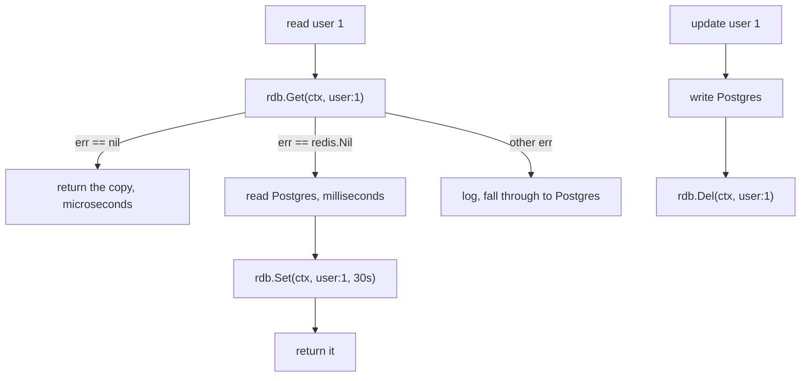

# Day 056 · Go — go-redis: GET, SET, pipelines, and cache-aside

**Today's theme:** Caching with Redis

**After today you can:** You can add a cache in front of a slow query in each language and measure the difference.

**The interviewer asks it as:** *How do you keep the cache and the database consistent?*

---

## 1. What this is, and why it matters

Redis is an in-memory database: a read is microseconds, against the milliseconds Postgres takes
from disk. `go-redis` is the Go client; `Get` and `Set` are the calls you use most, the expiry is
a `time.Duration` argument, and **cache-aside** is the pattern that puts Redis in front of the
database. Every call takes a `context.Context` from
[day 36](../day-036-two-pointers-revision/README.md), and a **pipeline** sends several commands
in one network round trip, which matters because a cache's whole value is being fast.

At work, a Redis cache is how a Go service serves traffic its database could not, and the
stale-data bug a cache introduces is one of the commonest in production. In interviews, "how do
you keep the cache and the database consistent" is the real question, and the Go-specific detail
is the `redis.Nil` sentinel: how a miss is reported, and what happens when you treat it as an
error.

## 2. The story

Anand runs the counter at a busy neighbourhood library. Most books live on the shelves at the
back, down long aisles, and fetching one takes a few minutes of walking. For a rare request that
is fine. But there are twenty or thirty books everyone wants this month, the same titles asked
for again and again, and walking to the back for each one would leave a queue at the counter all
day.

So behind the counter he keeps a small reserve shelf. The first time someone asks for this
month's most-wanted novel, he walks to the back, fetches it, and before handing it over he puts
a copy on the reserve shelf. The next person who asks for it gets it from arm's reach, in
seconds. The reserve shelf is small and close; the back is vast and slow.

Two things keep the reserve shelf honest. Every copy on it has a date pencilled on the spine, and
at the end of the month Anand clears anything past its date, because a novel that was the rage in
June is nobody's request in August. And when the back room tells him a book has been
re-catalogued, he does not correct the copy on the reserve shelf; he takes it off entirely. The
next person who asks triggers a fresh walk to the back, and the copy that comes back is the
corrected one.

There is one more thing Anand does when a reader hands him a list of five most-wanted titles at
once. He does not walk to the reserve shelf five times. He notes the five, walks over once,
picks up all five in one trip, and hands them across together. Five separate trips to a shelf
three steps away is still four wasted turns, and on a busy afternoon those add up.

## 3. The idea in plain English

The back shelves are the **database**, Postgres from [day 54](../day-054-quicksort/README.md):
everything, slow. The reserve shelf is **Redis**: small, in memory, microseconds per read.

Fetching from the back and leaving a copy is **cache-aside**. On a read: `rdb.Get(ctx, key)`. A
hit returns the copy. A miss reads the database, `rdb.Set(ctx, key, value, ttl)`, and returns.
The application manages the copy; Redis does not know the database exists.

The date on the spine is the **expiry**, the last argument to `Set`, a `time.Duration`:
`30*time.Second`. Redis deletes the key when it expires, so a copy is at most one TTL stale even
if nothing else touches it.

Taking the book off the shelf is **invalidation**: on a write, update Postgres, then
`rdb.Del(ctx, key)`. The next read misses and reloads. Delete, not `Set` with the new value,
because two writes can be applied out of order under concurrency and leave the two stores
disagreeing, while a delete has one outcome: the copy is gone, and a gone copy is never wrong.

The one-trip-for-five is a **pipeline**: `rdb.Pipeline()` batches several commands and
`pipe.Exec(ctx)` sends them in one round trip, instead of one round trip each. For a `MGET`-style
read of many keys, or setting several keys at once, it turns N network waits into one.

How a miss is reported is Go's own wrinkle: `Get` returns a value and an error, and a missing key
is the sentinel error `redis.Nil`, not an empty value. You check `err == redis.Nil` for a miss,
`err != nil` for a real failure, and only then use the value.

Consistency is a trade, not a guarantee: within the TTL, and between the database write and the
delete, a reader can see stale data. You size the TTL and place the invalidation so the window is
small and harmless.

## 4. The picture



Notice three arrows out of `Get`, not two: a hit, a miss (`redis.Nil`), and a real error, which
falls through to the database rather than failing. Collapsing the miss and the error into one is
the trap in section 7.

## 5. The code, built step by step

A Redis, and the client:

```bash
docker run --name redis -p 6379:6379 -d redis:7
go get github.com/redis/go-redis/v9
```

The client and a stand-in slow database.

```go
rdb := redis.NewClient(&redis.Options{Addr: "127.0.0.1:6379"})

var dbReads int

func loadUserFromDB(id int) (*User, error) {
	dbReads++
	time.Sleep(50 * time.Millisecond)   // pretend this is a slow query
	if id != 1 {
		return nil, nil
	}
	return &User{ID: 1, Name: "Meera", City: "Pune"}, nil
}
```

`redis.NewClient` is a pool of connections, like `pgxpool` from day 54; one is created for the
whole program. `dbReads` counts trips to the back.

The read, cache-aside.

```go
func getUser(ctx context.Context, rdb *redis.Client, id int) (*User, error) {
	key := fmt.Sprintf("user:%d", id)
	cached, err := rdb.Get(ctx, key).Result()
	if err == nil {
		var u User
		return &u, json.Unmarshal([]byte(cached), &u)
	}
	if err != redis.Nil {
		log.Println("redis get:", err)   // real failure: fall through, do not abort
	}
	user, dbErr := loadUserFromDB(id)
	if dbErr != nil || user == nil {
		return user, dbErr
	}
	data, _ := json.Marshal(user)
	rdb.Set(ctx, key, data, 30*time.Second)
	return user, nil
}
```

`rdb.Get(...).Result()` returns the string and an error. `err == nil` is a hit. `err ==
redis.Nil` is a miss, and any other error is Redis being unwell, which is logged and then treated
like a miss: read the database, slower but correct. The value is stored as JSON from
[day 40](../day-040-2d-prefix-sums/README.md), so `Marshal` in, `Unmarshal` out.

The write, invalidation.

```go
func updateCity(ctx context.Context, rdb *redis.Client, id int, city string) error {
	db[id].City = city                          // write the database
	return rdb.Del(ctx, fmt.Sprintf("user:%d", id)).Err()   // delete the key
}
```

Database first, then `Del`. Not `Set`. The next `getUser` misses and reloads the new city.

A pipeline, for warming several keys at once.

```go
func warm(ctx context.Context, rdb *redis.Client, users []*User) error {
	pipe := rdb.Pipeline()
	for _, u := range users {
		data, _ := json.Marshal(u)
		pipe.Set(ctx, fmt.Sprintf("user:%d", u.ID), data, 30*time.Second)
	}
	_, err := pipe.Exec(ctx)   // one round trip for all the Sets
	return err
}
```

Each `pipe.Set` is queued, not sent; `pipe.Exec` sends them together. Ten `Set`s become one
network wait instead of ten, which is the difference between warming a cache in one millisecond
and ten.

Run it:

```bash
go run main.go
```

```text
miss: &{1 Meera Pune} 51ms
hit:  &{1 Meera Pune} 0ms
db reads so far: 1
ttl: 30s
after update: &{1 Meera Mumbai}
db reads total: 2
```

The first read walked to the back, the second was arm's reach with `dbReads` unchanged, the TTL
is what is left on the copy, and after the update the delete forced one fresh read, so `dbReads`
is two.

Here is the whole program in one piece, `main.go`:

```go
package main

import (
	"context"
	"encoding/json"
	"fmt"
	"log"
	"time"

	"github.com/redis/go-redis/v9"
)

type User struct {
	ID   int    `json:"id"`
	Name string `json:"name"`
	City string `json:"city"`
}

var db = map[int]*User{1: {ID: 1, Name: "Meera", City: "Pune"}}
var dbReads int

func loadUserFromDB(id int) (*User, error) {
	dbReads++
	time.Sleep(50 * time.Millisecond)
	u, ok := db[id]
	if !ok {
		return nil, nil
	}
	copy := *u
	return &copy, nil
}

func getUser(ctx context.Context, rdb *redis.Client, id int) (*User, error) {
	key := fmt.Sprintf("user:%d", id)
	cached, err := rdb.Get(ctx, key).Result()
	if err == nil {
		var u User
		return &u, json.Unmarshal([]byte(cached), &u)
	}
	if err != redis.Nil {
		log.Println("redis get:", err)
	}
	user, dbErr := loadUserFromDB(id)
	if dbErr != nil || user == nil {
		return user, dbErr
	}
	data, _ := json.Marshal(user)
	rdb.Set(ctx, key, data, 30*time.Second)
	return user, nil
}

func updateCity(ctx context.Context, rdb *redis.Client, id int, city string) error {
	db[id].City = city
	return rdb.Del(ctx, fmt.Sprintf("user:%d", id)).Err()
}

func main() {
	ctx := context.Background()
	rdb := redis.NewClient(&redis.Options{Addr: "127.0.0.1:6379"})
	defer rdb.Close()
	rdb.FlushDB(ctx)

	start := time.Now()
	u, _ := getUser(ctx, rdb, 1)
	fmt.Printf("miss: %v %dms\n", u, time.Since(start).Milliseconds())
	start = time.Now()
	u, _ = getUser(ctx, rdb, 1)
	fmt.Printf("hit:  %v %dms\n", u, time.Since(start).Milliseconds())
	fmt.Println("db reads so far:", dbReads)
	fmt.Println("ttl:", rdb.TTL(ctx, "user:1").Val())

	updateCity(ctx, rdb, 1, "Mumbai")
	u, _ = getUser(ctx, rdb, 1)
	fmt.Println("after update:", u)
	fmt.Println("db reads total:", dbReads)
}
```

## 6. How the other two languages do it

**Python**

```python
cached = cache.get(key)
if cached is not None:
    return json.loads(cached)
user = load_user_from_db(user_id)
cache.set(key, json.dumps(user), ex=30)
```

`redis-py`'s `get` returns `None` for a miss, not an error, so the miss check is `is not None`.
The expiry is the `ex=` keyword in seconds.

**C++**

```cpp
auto cached = redis.get(key);        // std::optional<std::string>
if (cached) return json::parse(*cached);
auto user = load_from_db(id);
redis.set(key, user.dump(), std::chrono::seconds(30));
```

`redis-plus-plus`'s `get` returns a `std::optional`, empty on a miss. The expiry is a
`std::chrono` duration.

**The difference that matters:** Go is the only one where a miss is an error value, `redis.Nil`,
that sits in the same return slot as a real failure. Python's `None` and C++'s empty optional
cannot be confused with a connection error; Go's `redis.Nil` can, if you write `if err != nil {
return err }`, which turns every cache miss into a failure. The three-way check, `nil`,
`redis.Nil`, other, is the Go idiom, and getting it to two branches is the bug.

## 7. The traps

**The near-miss: treating a miss as an error.**

```go
cached, err := rdb.Get(ctx, key).Result()
if err != nil {
	return nil, err
}
```

Every cache miss now returns an error, so the first read of any key fails, and a cache that
fails on a miss is worse than no cache. `err == redis.Nil` is a miss, not a failure; it must be
its own branch.

**Update the cache instead of deleting.**

```go
db[id].City = city
data, _ := json.Marshal(db[id])
rdb.Set(ctx, key, data, 30*time.Second)
```

Two writes, the database and the cache, and under concurrency two requests can apply them in the
wrong order, leaving the cache with one value and the database with another until the TTL.
`rdb.Del` has no value to reorder.

**No expiry.**

```go
rdb.Set(ctx, key, data, 0)   // 0 means no expiry
```

The key never dies. Redis fills with cold keys, and with a `maxmemory` policy set it starts
evicting; without one it refuses writes with an OOM error. Every value gets a real TTL.

**Ignoring the Set error, and the Del error, silently.** `rdb.Set(...)` returns an error you can
drop, and usually should not; a Redis that is refusing writes is a Redis you want to know about.
The read path can ignore a failed `Set` (the value is still returned from the database), but log
it, because a cache that silently stops caching looks like a database under mysterious load.

**A context with no deadline on a hot path.** `context.Background()` on a `Get` means a slow or
hung Redis blocks the request forever. In a handler, derive a short timeout, so a sick Redis
becomes a fast fall-through to the database rather than a pile of stuck goroutines.

**Redis down.**

```text
dial tcp 127.0.0.1:6379: connect: connection refused
```

That is `err` from `Get`, not `redis.Nil`. The lesson logs it and falls through to the database.
A cache outage must be a latency event, never an availability one.

## 8. Say it out loud

**How it gets asked**

- How do you keep the cache and the database consistent?
- How does a cache miss look in go-redis, and why does it matter?
- Why delete the key on a write instead of setting it?
- What does a pipeline buy you?

**The ninety-second script**

Cache-aside: a read checks Redis with `Get`; a hit returns in microseconds, a miss reads Postgres,
sets the key with a TTL, and returns. A write updates Postgres and then deletes the key, so the
next read reloads the fresh value. I delete rather than set because deleting is one instruction
with one outcome, the copy is gone, while writing to both stores is two writes that concurrency
can reorder into disagreement. In Go the thing to get right is the miss: `Get` returns a value
and an error, and a missing key is the sentinel `redis.Nil`, so I check `nil` for a hit,
`redis.Nil` for a miss, and any other error is Redis being unwell, which I log and then treat as
a miss and read the database. Consistency is a bounded window, the TTL plus the write-to-delete
gap, not a guarantee; I size the TTL to the staleness I can serve. The cache is an optimisation,
so a Redis outage falls through to Postgres, slower but correct. And a pipeline sends many
commands in one round trip, which matters because the cache's whole point is being fast.

**The follow-ups**

- **Why not write-through?** *Updating the cache on every write keeps it warm but is the
  two-writes ordering problem, and a half-done write leaves them inconsistent. Delete-on-write is
  simpler and its worst case is a miss. Write-through only for keys read far more than written.*
- **How do you choose the TTL?** *The maximum staleness I can safely serve. Profile data can be
  minutes, a balance seconds or no cache. Shorter is fresher and more database load.*
- **When would a pipeline not help?** *When the commands depend on each other, since a pipeline
  sends them before reading any reply. For read-then-decide logic you need the round trips, or a
  Lua script that runs the logic inside Redis.*

**A model answer**

"Cache-aside: `Get`, hit returns, miss loads Postgres and `Set`s with a TTL; write updates
Postgres and `Del`s the key. Delete not set, because delete can't be reordered into
inconsistency and its worst case is a miss. In Go the miss is `redis.Nil`, a distinct branch from
a real error, which falls through to the database. Consistency is a bounded window sized by the
TTL, not a guarantee, and Redis down means slower reads, not failed ones. A pipeline batches
commands into one round trip for warming or multi-key reads."

## 9. Recall card

- Cache-aside read: `rdb.Get(ctx, key).Result()`; `err == nil` hit, `err == redis.Nil` miss, other error logs and falls through.
- Write: update the database, then `rdb.Del(ctx, key)`. Delete, never `Set`, so two writes cannot be reordered into disagreement.
- Expiry is the last `Set` argument, a `time.Duration`; `0` means no expiry, which fills Redis. Every key gets a real TTL.
- A pipeline (`rdb.Pipeline()`, queue, `pipe.Exec(ctx)`) sends many commands in one round trip; use it to warm or read many keys.
- Redis is an optimisation: a real error (not `redis.Nil`) falls through to the database. Consistency is a bounded window, not a guarantee.
