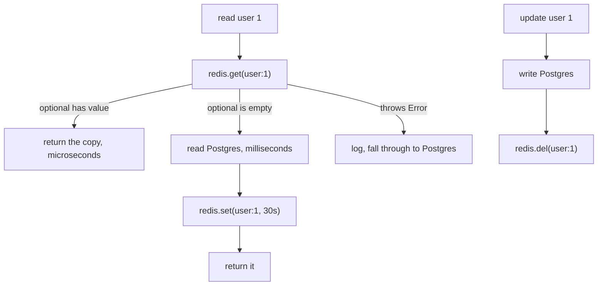

# Day 056 · C++ — redis-plus-plus: GET, SET, and cache-aside

**Today's theme:** Caching with Redis

**After today you can:** You can add a cache in front of a slow query in each language and measure the difference.

**The interviewer asks it as:** *How do you keep the cache and the database consistent?*

---

## 1. What this is, and why it matters

Redis is an in-memory database: a read is microseconds, against the milliseconds Postgres takes
from disk. `redis-plus-plus` is the C++ client, built on the C library `hiredis`. `get` returns a
`std::optional<std::string>` from [day 23](../day-023-palindromes/README.md), empty on a miss;
`set` takes the value and an optional expiry as a `std::chrono` duration; and **cache-aside** is
the pattern that puts Redis in front of the database. The optional return is the cleanest
miss-check of the three languages, and it is the C++ detail worth knowing.

At work, a Redis cache is how a C++ service serves traffic its database could not, and the
stale-data bug a cache introduces is one of the commonest in production. In interviews, "how do
you keep the cache and the database consistent" is the real question, and it has the same answer
in every language; the C++ angle is that `get`'s `std::optional` makes the miss a first-class,
un-ignorable thing rather than a sentinel you must remember to compare against.

## 2. The story

Anand runs the counter at a busy neighbourhood library. Most books live on the shelves at the
back, down long aisles, and fetching one takes a few minutes of walking. For a rare request that
is fine. But there are twenty or thirty books everyone wants this month, the same titles asked
for again and again, and walking to the back for each one would leave a queue at the counter all
day.

So behind the counter he keeps a small reserve shelf. The first time someone asks for this
month's most-wanted novel, he walks to the back, fetches it, and before handing it over he puts
a copy on the reserve shelf. The next person who asks for it gets it from arm's reach, in
seconds. The reserve shelf is small and close; the back is vast and slow.

Two things keep the reserve shelf honest. Every copy on it has a date pencilled on the spine, and
at the end of the month Anand clears anything past its date, because a novel that was the rage in
June is nobody's request in August. And when the back room tells him a book has been
re-catalogued, he does not correct the copy on the reserve shelf; he takes it off entirely. The
next person who asks triggers a fresh walk to the back, and the copy that comes back is the
corrected one. He learnt that the hard way: once he tried to pencil the correction on himself,
got a digit wrong, and sent three people to the wrong aisle.

There is one thing Anand is careful about that a new assistant got wrong. When he goes to the
reserve shelf, he does not assume the book is there. He looks. If the slot is empty, that is a
normal thing, not a disaster; he simply walks to the back. The new assistant, finding an empty
slot, once declared the whole system broken and sent everyone home. An empty slot is not a broken
shelf. It is just an empty slot.

## 3. The idea in plain English

The back shelves are the **database**, Postgres from [day 54](../day-054-quicksort/README.md):
everything, slow. The reserve shelf is **Redis**: small, in memory, microseconds per read.

Fetching from the back and leaving a copy is **cache-aside**. On a read: `redis.get(key)`, which
returns a `std::optional<std::string>`. If it holds a value, a hit, return it. If it is empty, a
miss, read the database, `redis.set(key, value, ttl)`, and return.

The date on the spine is the **expiry**, an optional `std::chrono` argument to `set`:
`std::chrono::seconds(30)`. Redis deletes the key when it expires, so a copy is at most one TTL
stale on its own.

Taking the book off the shelf is **invalidation**: on a write, update Postgres, then
`redis.del(key)`. The next read misses and reloads. Delete, not `set` with the new value, because
two writes can be applied out of order under concurrency and leave the stores disagreeing, while
a delete has one outcome: the copy is gone, and a gone copy is never wrong. Anand's wrong-digit
story is the two-writes failure.

The empty slot that is normal, not broken, is the `std::optional`. `get` returning an empty
optional is a cache miss, an ordinary event, and the code walks to the back. The new assistant
treating it as a failure is the trap: a miss is not an error. A real error, Redis being
unreachable, is a thrown exception, `sw::redis::Error`, which is different from an empty optional,
and the two are handled differently: a miss reads the database, an exception logs and reads the
database, both slower but correct.

Consistency is a trade, not a guarantee: within the TTL and between the write and the delete, a
reader can see stale data. You size the TTL and place the invalidation so the window is small and
harmless.

## 4. The picture



Notice three arrows out of `get`: a value (hit), an empty optional (miss), and a thrown
exception (Redis unwell). The miss and the exception both fall through to the database; only the
value skips it.

## 5. The code, built step by step

A Redis, and the library: `libredis++-dev` on Debian and Ubuntu, `redis-plus-plus` on Homebrew
and vcpkg; it pulls in `hiredis`.

```bash
docker run --name redis -p 6379:6379 -d redis:7
```

The client and a stand-in slow database.

```cpp
#include <sw/redis++/redis++.h>
#include <nlohmann/json.hpp>

using json = nlohmann::json;

int db_reads = 0;
std::map<int, json> db = {{1, {{"id", 1}, {"name", "Meera"}, {"city", "Pune"}}}};

std::optional<json> load_user_from_db(int id) {
    ++db_reads;
    std::this_thread::sleep_for(std::chrono::milliseconds(50));   // a slow query
    auto it = db.find(id);
    if (it == db.end()) return std::nullopt;
    return it->second;
}
```

`db_reads` counts trips to the back. The `sleep` stands in for a real query's latency.

The read, cache-aside.

```cpp
std::optional<json> get_user(sw::redis::Redis& redis, int id) {
    const std::string key = "user:" + std::to_string(id);
    try {
        if (auto cached = redis.get(key)) {
            return json::parse(*cached);
        }
    } catch (const sw::redis::Error& e) {
        std::cerr << "redis get: " << e.what() << '\n';   // unwell: fall through
    }
    auto user = load_user_from_db(id);
    if (user) {
        try {
            redis.set(key, user->dump(), std::chrono::seconds(30));
        } catch (const sw::redis::Error& e) {
            std::cerr << "redis set: " << e.what() << '\n';   // caching failed; value still returned
        }
    }
    return user;
}
```

`redis.get(key)` returns a `std::optional<std::string>`. `if (auto cached = redis.get(key))` is a
hit; the `else`, falling out of the `if`, is a miss. A thrown `sw::redis::Error` is Redis being
unreachable, caught and logged, and then the code reads the database anyway. The value is stored
as JSON from [day 40](../day-040-2d-prefix-sums/README.md), `dump()` in and `parse` out.

The write, invalidation.

```cpp
void update_city(sw::redis::Redis& redis, int id, const std::string& city) {
    db[id]["city"] = city;              // write the database
    redis.del("user:" + std::to_string(id));   // delete the key
}
```

Database first, then `del`. Not `set`. The next `get_user` misses and reloads the new city.

Run it:

```bash
g++ -Wall -Wextra -std=c++20 main.cpp -lredis++ -lhiredis -o app
./app
```

```text
miss: {"city":"Pune","id":1,"name":"Meera"} 51ms
hit:  {"city":"Pune","id":1,"name":"Meera"} 0ms
db reads so far: 1
ttl: 30
after update: {"city":"Mumbai","id":1,"name":"Meera"}
db reads total: 2
```

First read walked to the back, second was arm's reach with `db_reads` unchanged, `ttl` is the
seconds left, and after the update the delete forced one fresh read, so `db_reads` is two. The
JSON keys are alphabetical because nlohmann sorts them.

Here is the whole program in one piece, `main.cpp`:

```cpp
#include <sw/redis++/redis++.h>
#include <nlohmann/json.hpp>

#include <chrono>
#include <iostream>
#include <map>
#include <optional>
#include <string>
#include <thread>

using json = nlohmann::json;

int db_reads = 0;
std::map<int, json> db = {{1, {{"id", 1}, {"name", "Meera"}, {"city", "Pune"}}}};

std::optional<json> load_user_from_db(int id) {
    ++db_reads;
    std::this_thread::sleep_for(std::chrono::milliseconds(50));
    auto it = db.find(id);
    if (it == db.end()) return std::nullopt;
    return it->second;
}

std::optional<json> get_user(sw::redis::Redis& redis, int id) {
    const std::string key = "user:" + std::to_string(id);
    try {
        if (auto cached = redis.get(key)) {
            return json::parse(*cached);
        }
    } catch (const sw::redis::Error& e) {
        std::cerr << "redis get: " << e.what() << '\n';
    }
    auto user = load_user_from_db(id);
    if (user) {
        try {
            redis.set(key, user->dump(), std::chrono::seconds(30));
        } catch (const sw::redis::Error& e) {
            std::cerr << "redis set: " << e.what() << '\n';
        }
    }
    return user;
}

void update_city(sw::redis::Redis& redis, int id, const std::string& city) {
    db[id]["city"] = city;
    redis.del("user:" + std::to_string(id));
}

int main() {
    try {
        sw::redis::Redis redis("tcp://127.0.0.1:6379");
        redis.flushdb();

        auto start = std::chrono::steady_clock::now();
        auto u = get_user(redis, 1);
        auto ms = std::chrono::duration_cast<std::chrono::milliseconds>(std::chrono::steady_clock::now() - start).count();
        std::cout << "miss: " << (u ? u->dump() : "null") << ' ' << ms << "ms\n";

        start = std::chrono::steady_clock::now();
        u = get_user(redis, 1);
        ms = std::chrono::duration_cast<std::chrono::milliseconds>(std::chrono::steady_clock::now() - start).count();
        std::cout << "hit:  " << (u ? u->dump() : "null") << ' ' << ms << "ms\n";
        std::cout << "db reads so far: " << db_reads << '\n';
        std::cout << "ttl: " << redis.ttl("user:1") << '\n';

        update_city(redis, 1, "Mumbai");
        u = get_user(redis, 1);
        std::cout << "after update: " << (u ? u->dump() : "null") << '\n';
        std::cout << "db reads total: " << db_reads << '\n';
    } catch (const sw::redis::Error& e) {
        std::cerr << "redis unavailable: " << e.what() << '\n';
        return 1;
    }
    return 0;
}
```

## 6. How the other two languages do it

**Python**

```python
cached = cache.get(key)
if cached is not None:
    return json.loads(cached)
```

`redis-py`'s `get` returns `None` for a miss and raises `ConnectionError` for a real failure, so
the miss check is `is not None` and the failure is a separate `try`.

**Go**

```go
cached, err := rdb.Get(ctx, key).Result()
if err == nil { /* hit */ }
if err == redis.Nil { /* miss */ }
```

`go-redis` reports a miss as the sentinel error `redis.Nil` in the same slot as a real error, so
you check three cases: `nil`, `redis.Nil`, other.

**The difference that matters:** C++'s `std::optional` and Python's `None` keep the miss and the
error apart by type: an empty optional or a `None` is a miss, and an unreachable Redis is an
exception. Go puts the miss into the error return as `redis.Nil`, so a careless `if err != nil`
turns every miss into a failure. The C++ optional is arguably the safest of the three, because a
miss cannot be mistaken for an error without effort, and the compiler makes you unwrap the
optional before you can use the value.

## 7. The traps

**The near-miss: update the cache instead of deleting.**

```cpp
db[id]["city"] = city;
redis.set("user:" + std::to_string(id), db[id].dump(), std::chrono::seconds(30));
```

Two writes, the database and the cache. Under concurrency two updates can apply them in the wrong
order and leave the cache with one value and the database with another until the TTL. `redis.del`
has one outcome and cannot be reordered into disagreement.

**Dereferencing the optional without checking.**

```cpp
auto cached = redis.get(key);
return json::parse(*cached);        // *cached on an empty optional
```

On a miss `cached` is empty and `*cached` is undefined behaviour, in practice a crash. The whole
point of the optional is that you must check it; `if (auto cached = redis.get(key))` is the check.

**Treating the exception as fatal.** Letting `sw::redis::Error` from a `get` propagate out of the
request means a Redis blip takes the request down. A cache is an optimisation; catch the
exception, log it, and read the database. The lesson's outer `try` in `main` is for start-up
failure; the per-call `try` in `get_user` is for staying up when Redis wobbles.

**No expiry.**

```cpp
redis.set(key, user->dump());        // no duration
```

The key never expires. Redis fills with cold keys and, under a `maxmemory` policy, evicts or
refuses writes. Every value gets a `std::chrono` TTL.

**Storing a non-string.** redis-plus-plus takes `std::string`, so `redis.set(key, some_json)`
with a `json` object will not compile:

```text
error: no matching function for call to 'sw::redis::Redis::set(std::string, nlohmann::json&, ...)'
```

`user->dump()` turns it into a string; `json::parse` turns it back.

**Redis down at start-up.**

```text
redis unavailable: Failed to connect to Redis (127.0.0.1:6379): Connection refused
```

The `sw::redis::Redis` constructor is lazy on some builds and eager on others; either way a call
against an unreachable Redis throws `sw::redis::Error`. The service should decide whether it can
run at all without Redis; a cache-only dependency should not stop start-up, so construct it, and
let the per-call `try` handle the outage.

## 8. Say it out loud

**How it gets asked**

- How do you keep the cache and the database consistent?
- How does a cache miss look in redis-plus-plus?
- Why delete the key on a write instead of setting it?
- What happens when Redis is unreachable?

**The ninety-second script**

Cache-aside: a read calls `get`, which returns a `std::optional`; a value is a hit returned in
microseconds, an empty optional is a miss that reads Postgres, sets the key with a TTL, and
returns. A write updates Postgres and then deletes the key, so the next read reloads the fresh
value. I delete rather than set because deleting is one instruction with one outcome, the copy is
gone, while writing to both stores is two writes concurrency can reorder into disagreement. In
C++ the miss is the empty optional, which is separate by type from a real failure: an unreachable
Redis throws `sw::redis::Error`, which I catch, log, and treat like a miss by reading the
database, because the cache is an optimisation, not the source of truth. Consistency is a bounded
window, the TTL plus the write-to-delete gap, not a guarantee; I size the TTL to the staleness I
can serve. The optional is the safest miss-check of the three languages, because I cannot use the
value without unwrapping it, and an empty optional cannot be mistaken for an error.

**The follow-ups**

- **Why not write-through?** *Updating the cache on every write keeps it warm but is the
  two-writes ordering problem, and a half-done write leaves the stores inconsistent.
  Delete-on-write is simpler and its worst case is a miss. Write-through only for keys read far
  more than written.*
- **How do you choose the TTL?** *The maximum staleness I can safely serve: minutes for a
  profile, seconds or none for a balance. Shorter is fresher and more database load.*
- **Is redis-plus-plus thread-safe?** *A `Redis` object is safe to share across threads for
  commands; it manages a connection pool internally. A transaction or a pipeline object is not,
  so each thread gets its own, the same rule as the database connection on day 54.*

**A model answer**

"Cache-aside: `get` returns an optional, value is a hit, empty is a miss that loads Postgres and
`set`s with a TTL; a write updates Postgres and `del`s the key. Delete not set, because delete
can't be reordered into inconsistency and its worst case is a miss. In C++ the miss is the empty
optional, separate by type from a thrown `sw::redis::Error`, which I catch and treat as a miss
because the cache is an optimisation. Consistency is a bounded window sized by the TTL, not a
guarantee."

## 9. Recall card

- Cache-aside read: `redis.get(key)` returns `std::optional`; value is a hit, empty is a miss that loads the database and `set`s with a TTL.
- Write: update the database, then `redis.del(key)`. Delete, never `set`, so two writes cannot be reordered into disagreement.
- The miss (empty optional) is separate by type from a real failure (`sw::redis::Error` thrown); catch the error, log, fall through to the database.
- `set(key, value, std::chrono::seconds(30))`; no duration means no expiry, which fills Redis. Store `dump()`, read with `json::parse`.
- Never `*cached` without `if (auto cached = ...)`; the optional exists to force the miss check. A `Redis` object is thread-safe for commands.
