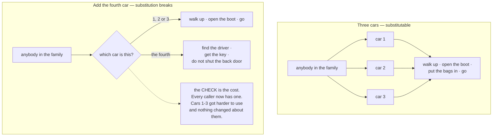
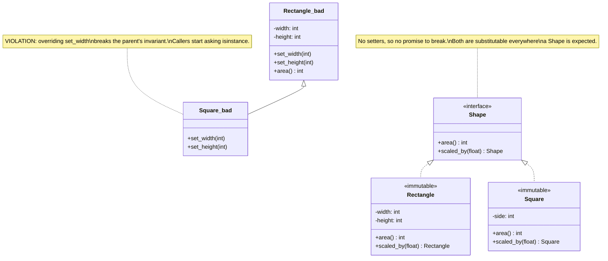

# Day 057 · System Design — Liskov substitution

**After today you can:** You can name the classic square-rectangle failure and avoid writing your own version.

**The interviewer asks it as:** *Is a Square a Rectangle? Defend your answer in code.*

---

## 1. What this is, and why they ask it

The **Liskov substitution principle** is the L in SOLID: anywhere the code expects a type, you must
be able to hand it any subtype and have everything still work — without the caller knowing or caring
which one it got. If a subclass can be given to code written for its parent and that code breaks,
the inheritance was a lie, however sensible it looked when you wrote it.

They ask it as the square-and-rectangle question because it is the shortest example that makes an
obviously true sentence produce an obviously broken program. A square *is* a rectangle. Every
mathematician agrees. And `class Square(Rectangle)` breaks real code in about six lines, which is
uncomfortable in a useful way. It is also the principle that decides whether the other four work at
all — open/closed from [day 056](../day-056-non-comparison-sorts/README.md) depends entirely on being
able to swap implementations behind an interface, and the moment one implementation misbehaves in the
others' place, callers start adding `isinstance` checks and the whole structure collapses back into
an `if` chain. [Day 046](../day-046-binary-search-on-the-answer/README.md) already told you to say
"every B is an A, with no exception" out loud before inheriting. Today is the day you learn what
"no exception" actually means.

---

## 2. The story

Latha booked four cars for her daughter's wedding — three days, airport runs, the hall, relatives who
would need dropping back. The agency had one model on their list and she booked four of them, and
they gave her the terms in writing: four seats, luggage space at the back, air conditioning.

On the morning it started, three of the four turned up as expected. The fourth was late, and when it
came it was the same model and the same colour, and the man said the one she had booked was in the
workshop and this was the replacement.

Two things about it were different, and neither was visible from outside.

The first was the boot. It opened, but only with a key, and the key was a different key from the
ignition, and the driver had one of the two. So the standard thing everybody had been doing all
morning — pull up, open the back, put the bags in, close it, go — did not work on that car. Somebody
had to find the driver first.

The second was the back doors. They had the child lock engaged and it could not be released, so they
opened only from the outside. If you got in the back and the door shut, you sat there until somebody
came round.

Now, everything the agency had promised was true. Four seats. Luggage space at the back. Air
conditioning. If you read the terms and looked at the car, nothing was missing.

But by lunchtime on the first day, the whole family had learned to check which car had arrived before
doing anything. Her nephew, who was organising the airport runs, started shouting across the car park
— *not that one, that one's the different one, wait for the driver.* An aunt was left sitting in the
back for four or five minutes outside the hall because nobody had told her.

And that is the part Latha could not get over afterwards. It was not that the fourth car was bad. It
was that having it there made the other three harder to use, because from that morning on nobody
could simply walk up to a car and use it. Every single time, somebody had to ask which one it was
first.

---

## 3. The idea in plain English

The fourth car is a subclass that does not substitute. Everything on the agency's written list was
true of it, so it passed the interface. What it broke was what everybody had learned to *expect*, and
the cost was not in the car — it was in every place that now had to ask which car it had.

### The principle

> **Anywhere the code expects a type, it must be able to receive any subtype and still be correct,
> without knowing which subtype it got.**

Barbara Liskov's original wording is more precise, and the practical translation is what matters. A
subtype must:

- **not demand more than the parent** (it must not strengthen preconditions);
- **not deliver less than the parent** (it must not weaken postconditions);
- **not break any rule the parent guaranteed** (it must preserve invariants).

Each of those has a plain-English version and a failure you have probably seen.

### Failure one: demanding more (a strengthened precondition)

The parent accepts any amount; the child accepts only positive amounts. Caller code written against
the parent now throws.

```python
class Account:
    def withdraw(self, amount: Money) -> None:
        """Withdraws. Overdraft to -5000 is allowed."""

class FixedDeposit(Account):
    def withdraw(self, amount: Money) -> None:
        if self.locked_until > today():
            raise ValueError("cannot withdraw before maturity")     # demands MORE
```

Every piece of code that loops over accounts and withdraws now needs to know about maturity dates.
That is the nephew shouting across the car park.

### Failure two: delivering less (a weakened postcondition)

The parent's method promises the item is now in the list. The child sometimes silently does not add
it, or adds it somewhere else, or refuses.

```python
class ReadOnlyList(list):
    def append(self, item):
        raise NotImplementedError("this list is read only")
```

`ReadOnlyList` passes every type check — it *is* a `list`. Hand it to any function that appends and
you get a crash in code that was correct. This is the single commonest real-world Liskov violation,
and the fix is not a subclass at all: read-only and mutable are two capabilities, not a parent and a
child.

### Failure three: breaking an invariant

This is the square and the rectangle, and it is worth writing out because it is the question you will
be asked.

```python
class Rectangle:
    def __init__(self, width: int, height: int) -> None:
        self._width, self._height = width, height

    def set_width(self, w: int) -> None:
        self._width = w

    def set_height(self, h: int) -> None:
        self._height = h

    def area(self) -> int:
        return self._width * self._height
```

The rectangle guarantees something quietly: **setting the width does not change the height.** Nobody
wrote that down. Every caller relies on it.

```python
class Square(Rectangle):
    def set_width(self, w: int) -> None:
        self._width = self._height = w         # must stay square
    def set_height(self, h: int) -> None:
        self._width = self._height = h
```

Now a function written against `Rectangle`:

```python
def resize_and_check(r: Rectangle) -> None:
    r.set_width(5)
    r.set_height(4)
    assert r.area() == 20, f"expected 20, got {r.area()}"
```

```
Traceback (most recent call last):
  File "day57.py", line 24, in <module>
    resize_and_check(Square(3, 3))
    ~~~~~~~~~~~~~~~~^^^^^^^^^^^^^^
  File "day57.py", line 21, in resize_and_check
    assert r.area() == 20, f"expected 20, got {r.area()}"
           ^^^^^^^^^^^^^^
AssertionError: expected 20, got 16
```

The function is correct. `Rectangle` is correct. `Square` is correct on its own terms. The
*inheritance* is what is wrong, and no amount of care inside `Square` fixes it.

The lesson people take away wrongly is "geometry is tricky". The real lesson is more useful: **the
mathematical relationship is not the programming relationship.** A square is a rectangle as a *shape*.
A mutable `Square` is not a mutable `Rectangle`, because a mutable rectangle promises independently
settable sides and a square cannot keep that promise.

Notice what dissolves the problem: **make them immutable.** If there is no `set_width`, there is no
promise to break, and `Square(4)` is a perfectly good `Rectangle` forever. Immutability makes
substitution far easier, and that is a genuinely useful thing to say in an interview.

### How to spot a violation before it costs you

1. **`isinstance` checks appearing in callers.** This is the loudest signal there is. If code that
   was written against the parent has to ask which child it got, substitution has already failed.
   Latha's nephew, in code.
2. **An overridden method that raises.** `NotImplementedError`, `UnsupportedOperationException`, "not
   supported for this type" — a subclass refusing a method its parent promised is the definition of
   weakening a postcondition.
3. **An overridden method that ignores an argument.** `Square.set_width(w)` does not ignore its
   argument, but a `NullLogger.log(msg)` that discards `msg` is fine, while a
   `CachedRepository.get(id, fresh=True)` that ignores `fresh` is not.
4. **Documentation with "do not call X on Y".** If the class comment has to warn callers about a
   subtype, the type system has stopped helping.
5. **Tests that pass for the parent and fail for the child.** The mechanical version: take the
   parent's test suite and run it against every subclass. Anything that fails is a violation, and
   this is a real technique, not a metaphor — it is called a **contract test**.

### The fixes, in the order to try them

**One: model the capability, not the taxonomy.** Instead of `Square extends Rectangle`, have both
implement `Shape` with an `area()`. Instead of `ReadOnlyList extends List`, have `Sequence` (readable)
and `MutableSequence` (readable and writable) — which is exactly what Python's own
`collections.abc` does, and it is a good example to cite.

**Two: make it immutable.** No setters, no broken promises. Most Liskov failures are failures about
*mutation*.

**Three: use composition.** If `Square` needs a rectangle's area logic, let it *hold* one rather than
*be* one. Then no caller ever receives a `Square` where a `Rectangle` was expected
([day 049](../day-049-peak-finding/README.md)).

**Four: move the method down.** If only some subclasses can `fly()`, `fly()` does not belong on
`Bird`. Put it on a `Flying` interface that `Penguin` does not implement.

---

## 4. The picture

The four cars, and where the cost landed:



**What to notice:** the diamond. That question — *which one is this?* — is an `isinstance` check, and
it is the entire damage. It was not there before the fourth car, it now sits in front of every use,
and it makes the three good cars worse.

The square and the rectangle, with the invariant made visible:

```
 Rectangle promises, quietly:  "setting the width leaves the height alone"

   r = Rectangle(3, 3)
   r.set_width(5)      ->  width 5, height 3
   r.set_height(4)     ->  width 5, height 4
   r.area()            ->  20        <- what the caller expects

 Square breaks that promise:

   s = Square(3)
   s.set_width(5)      ->  width 5, height 5     <- height changed!
   s.set_height(4)     ->  width 4, height 4     <- width changed!
   s.area()            ->  16        <- the caller gets 16 and has no idea why

 The caller did nothing wrong. Neither class is wrong on its own.
 The IS-A claim is what is wrong.
```

**What to notice:** the broken promise was never written down anywhere. It is not in the type
signature, not in the docstring, not enforceable by any checker. That is why Liskov violations get
past code review — the type system says the substitution is legal, and it is the *behaviour* that is
not.

The two ways to model the same shapes:



**What to notice:** the fix removed the inheritance *and* the setters. `Square` is no longer a kind
of `Rectangle`; both are kinds of `Shape`, which is the capability they genuinely share. And
`scaled_by` returns a new object rather than mutating, so there is nothing left to violate.

---

## 5. How it actually works

### Contract tests: the mechanical way to check substitution

This is the technique to name in an interview, because it turns a principle into a test file.

Write the test suite once, against the *interface*, and run it against every implementation:

```python
import pytest
from typing import Protocol


class Repository(Protocol):
    def save(self, key: str, value: str) -> None: ...
    def get(self, key: str) -> str | None: ...
    def delete(self, key: str) -> None: ...
```

```python
class RepositoryContract:
    """Every implementation must pass every test in here. Subclass and supply one."""

    def make(self) -> Repository:
        raise NotImplementedError

    def test_get_returns_what_was_saved(self) -> None:
        repo = self.make()
        repo.save("a", "1")
        assert repo.get("a") == "1"

    def test_get_returns_none_for_a_missing_key(self) -> None:
        assert self.make().get("nope") is None

    def test_save_overwrites(self) -> None:
        repo = self.make()
        repo.save("a", "1")
        repo.save("a", "2")
        assert repo.get("a") == "2"

    def test_delete_is_idempotent(self) -> None:
        repo = self.make()
        repo.delete("never-existed")          # must NOT raise
        repo.save("a", "1")
        repo.delete("a")
        repo.delete("a")
        assert repo.get("a") is None
```

```python
class TestInMemory(RepositoryContract):
    def make(self) -> Repository:
        return InMemoryRepository()


class TestPostgres(RepositoryContract):
    def make(self) -> Repository:
        return PostgresRepository(test_connection())
```

Two lines per implementation, and every substitution rule is now enforced by a test that fails
loudly. If `PostgresRepository.delete` raises on a missing key while the in-memory one does not, that
is a Liskov violation and `test_delete_is_idempotent` finds it before a caller does.

This is also the answer to "how do you keep a test fake honest?" from
[day 053](../day-053-merge-sort/README.md) — the same file solves both problems.

### The square-rectangle question, answered properly in code

```python
from dataclasses import dataclass
from typing import Protocol


class Shape(Protocol):
    def area(self) -> float: ...
    def perimeter(self) -> float: ...


@dataclass(frozen=True)
class Rectangle:
    width: float
    height: float

    def area(self) -> float:
        return self.width * self.height

    def perimeter(self) -> float:
        return 2 * (self.width + self.height)

    def with_width(self, width: float) -> "Rectangle":
        return Rectangle(width, self.height)        # returns a NEW object


@dataclass(frozen=True)
class Square:
    side: float

    def area(self) -> float:
        return self.side * self.side

    def perimeter(self) -> float:
        return 4 * self.side

    def as_rectangle(self) -> Rectangle:
        return Rectangle(self.side, self.side)      # a conversion, not an IS-A
```

`Square` is not a `Rectangle`. It is a `Shape`, and it can *become* a `Rectangle` when somebody needs
one. Any function taking a `Shape` works with both, forever, because `Shape` promises only `area` and
`perimeter` and both keep that promise completely.

The sentence to say: *"I'd model the shared capability rather than the taxonomy, and I'd make them
immutable — most Liskov violations are really violations about mutation."*

### The read-only collection, done properly

Python's standard library already solves this and it is worth pointing at:

```python
from collections.abc import Sequence, MutableSequence

def total(prices: Sequence[int]) -> int:      # reads only -- accepts list AND tuple
    return sum(prices)

def add_price(prices: MutableSequence[int], price: int) -> None:
    prices.append(price)                       # writes -- accepts list, NOT tuple
```

`Sequence` promises `__getitem__`, `__len__`, iteration, `index`, `count`. `MutableSequence` adds
`append`, `insert`, `__setitem__`, `__delitem__`. A `tuple` is a `Sequence` and is not a
`MutableSequence`, so the type system refuses the bad substitution rather than letting it fail at
runtime.

That is the fix for `ReadOnlyList` and for every variation of it: **split the interface by
capability**, which is tomorrow's principle
([day 058](../day-058-custom-comparators/README.md)).

### The rules, as a checklist you can apply to an override

When you override a method, check four things:

```
 1. ARGUMENTS  -- does the override accept everything the parent accepted?
                  (You may accept MORE. You may never accept LESS.)

 2. RETURN     -- does it return something the caller can use as the parent's return?
                  (You may return a SUBTYPE. You may never return something broader.)

 3. EXCEPTIONS -- does it throw anything the parent did not document?
                  (New exception types are a broken promise.)

 4. INVARIANTS -- does it preserve every rule the parent guaranteed,
                  including the ones nobody wrote down?
```

Point three is the one that catches real code. A `CachedUserRepository.get` that raises
`CacheMissError` where `UserRepository.get` returned `None` is a Liskov violation, and it shows up as
an unhandled exception in production six weeks later.

Rules one and two have names — **contravariance** on arguments, **covariance** on return types — and
Python's type checkers enforce them:

```python
class Parent:
    def handle(self, event: Event) -> Response: ...

class Child(Parent):
    def handle(self, event: LoginEvent) -> Response: ...     # accepts LESS
```

```
error: Argument 1 of "handle" is incompatible with supertype "Parent";
supertype defines the argument type as "Event"  [override]
note: This violates the Liskov substitution principle
```

mypy says the words. That message is worth recognising — it is the type checker telling you exactly
this, by name.

### Where real systems get this right and wrong

- **Python's `collections.abc`** — the `Sequence` / `MutableSequence` split exists precisely to make
  read-only substitution safe. So does `Mapping` / `MutableMapping`.
- **Java's `Collections.unmodifiableList`** — a famous violation. It returns a `List` whose `add`
  throws `UnsupportedOperationException`, which is exactly the `ReadOnlyList` problem shipped in the
  standard library, and it has caused a great deal of production breakage.
- **`java.sql.Date extends java.util.Date`** — a `Date` whose time fields throw. Same failure.
- **`InputStream` and its subclasses** — a good example: every subclass genuinely supports `read`,
  and the ones that cannot seek advertise that through a separate capability rather than throwing on
  a promised method.
- **HTTP status codes** — an interesting non-code example. Every proxy in the world can handle a
  response it has never seen, because the first digit tells it enough. That is substitutability
  designed into a protocol.

---

## 6. The numbers

### What one bad subclass costs, counted

```
 A Repository interface with 6 implementations and 40 call sites.

 One implementation raises where the others return None.

   call sites that must now check       : 40  (or crash unpredictably)
   lines added per check                : 3   (try/except or isinstance)
   total lines of defensive code        : 120
   places somebody will forget          : 3-5 (empirically, always some)
   the bug appears                      : only when THAT implementation is
                                          wired in, in one environment
```

The last line is the reason these are expensive. The failure is not deterministic across
environments, so it survives testing and appears in production.

### The isinstance cascade

```
 before the bad subclass:
   grep -rn "isinstance" src/     ->  2 hits (both legitimate, at a boundary)

 six months after:
   grep -rn "isinstance" src/     ->  31 hits
   of which, checks for the one problematic subclass : 18

 Each check is a place where adding a SEVENTH implementation
 requires editing existing code -- so open/closed is gone too.
```

That is the connection to say out loud: **a Liskov violation destroys open/closed.** Once callers
check the type, adding an implementation is no longer free.

### Contract tests, priced

```
 6 implementations of Repository, 14 contract tests each:

   writing the contract suite once  : ~2 hours, 140 lines
   wiring each implementation       : 3 lines x 6 = 18 lines
   tests that now run               : 84
   substitution violations caught
     the first time it was run      : 3
        - Postgres raised on delete-missing; in-memory did not
        - Redis returned "" for a missing key; others returned None
        - the S3 one was case-insensitive on keys
```

Three real violations found in two hours, each of which would have been an incident. That is the
argument for contract tests, and it is a better answer than "I'd be careful".

### The square-rectangle failure, in one line

```
 set_width(5); set_height(4); area()

   Rectangle : 20
   Square    : 16          -> 20% wrong, silently, in code that is correct
```

### The cost of the fix

```
 Rectangle/Square as separate immutable Shapes:

   lines removed : the 2 overrides, the 4 setters       = ~12
   lines added   : the Shape protocol, as_rectangle()   = ~8
   call sites that change                               : 0
                   (they took a Shape or a Rectangle, and still do)
   isinstance checks removed                            : all of them
```

---

## 7. The trade-offs

### What the principle costs

**Inheritance gets much harder to justify.** Applied honestly, Liskov rules out most of the
inheritance people want to write, and you end up with more interfaces and more composition. That is
more files and more indirection, and it is the same cost as
[day 049](../day-049-peak-finding/README.md)'s composition argument.

**Contracts have to be written down.** The rules a parent guarantees are usually implicit —
`Rectangle` never says "width and height are independent" — so making them substitutable means
documenting or testing what was previously understood. That is real work, and the contract test file
is where it lives.

**You lose some convenient reuse.** `ReadOnlyList(list)` is genuinely convenient and it *mostly*
works. Doing it properly means a `Sequence` type, conversions at the boundary, and callers being
precise about whether they read or write.

### When a narrower subtype is acceptable anyway

**I would accept a technical violation if** the subtype is never handed to code written for the
parent. A test double that raises on an unused method is fine, because nothing in production ever
receives it. A subclass used only inside the module that defines it is fine. The principle is about
*substitution*, so if the substitution never happens, there is nothing to violate — but say that
explicitly rather than letting it be an accident.

**I would accept it if** the parent's contract genuinely allows failure and the child merely fails
more often. If `PaymentGateway.charge` documents that it can raise `GatewayUnavailable`, then an
implementation that raises it more often is not violating anything; it is exercising a documented
outcome. **The rule is about promises, not about behaviour being identical.**

### When defensive `isinstance` is the right answer

**I would use `isinstance` at a boundary** — parsing external input, dispatching on a message type
that arrived over the wire, or narrowing an `Any` from a library. That is a place where the type is
genuinely unknown and must be discovered.

**I would not use `isinstance`** inside business logic to work around a subtype's misbehaviour. That
is treating the symptom, and it spreads: two checks become thirty-one, and every new implementation
has to be added to all of them.

### The honest ambiguity

The hardest part is that the "contract" is often not written anywhere, so reasonable people disagree
about whether something is a violation. Does `Rectangle` promise independent sides? Nobody wrote it
down, and yet every caller assumes it. The practical resolution is not philosophical:

> **If existing callers break, it is a violation. If they do not, it is not.**

That is a test you can run, and it is why contract tests matter more than argument. Take the parent's
test suite, run it against the child, and let the failures decide.

### Where it sits with the other four

Single responsibility ([day 055](../day-055-quickselect/README.md)) decides what the classes are.
Open/closed ([day 056](../day-056-non-comparison-sorts/README.md)) says extend rather than edit —
**and it works only if substitution holds**, because the whole mechanism is a caller holding an
interface and receiving any implementation. Interface segregation
([day 058](../day-058-custom-comparators/README.md)) is the main *fix* for Liskov violations: most of
them are one interface promising more than some implementations can deliver, and the answer is two
smaller interfaces. Dependency inversion
([day 059](../day-059-sorting-revision/README.md)) points the arrows the right way so substitution
has somewhere to happen.

---

## 8. In the interview

### How it gets asked

- *"Is a Square a Rectangle?"* — the classic. The answer is "as a shape yes, as a mutable class no",
  and then the six lines that show it.
- *"What is the Liskov substitution principle?"* — and the follow-up is always "give me an example of
  a violation you've seen", so have `ReadOnlyList` or `Collections.unmodifiableList` ready.
- *"Here's a class hierarchy. What's wrong with it?"* — usually a `Bird` with `fly()` and a
  `Penguin`, or an `Account` with a `FixedDeposit`.
- *"How would you detect a violation in a large codebase?"* — `isinstance` in callers, overrides that
  raise, and contract tests. The third answer is the one that scores.
- *"Why does this matter?"* — because it is what makes open/closed possible.

### What to say out loud, in the first ninety seconds

1. **Answer the question as asked, then split it.** *"As a shape, yes — every square satisfies the
   definition of a rectangle. As a class with setters, no, and I can show that in six lines."*
2. **Show the failing caller, not the classes.** *"Here's a function written against `Rectangle`: set
   the width to 5, set the height to 4, expect an area of 20. Hand it a `Square` and it gets 16. The
   function is correct. Both classes are correct. The inheritance is what's wrong."*
3. **Name the broken promise.** *"`Rectangle` quietly guarantees that setting the width leaves the
   height alone. Nobody wrote that down and every caller relies on it. `Square` can't keep that
   promise and stay square."*
4. **Give the fix, and the general form.** *"I'd model the shared capability rather than the
   taxonomy — both implement `Shape` with `area()` — and I'd make them immutable, because most Liskov
   violations are really about mutation. With no setters there's no promise to break."*
5. **Name the real cost.** *"The damage isn't the wrong area. It's that callers start writing
   `isinstance` checks, and once they do, adding a new shape means editing existing code — so the
   violation destroys open/closed as well."*

### The follow-ups

**"Give me a violation you've seen in real code, not geometry."**
The commonest one is a read-only collection implemented as a subclass of a mutable one — a
`ReadOnlyList` extending `list` whose `append` raises `NotImplementedError`. It type-checks
perfectly, because it genuinely *is* a list, so any function taking a list will accept it and then
crash at runtime on a method the type promised. That is not a hypothetical: Java ships it in the
standard library as `Collections.unmodifiableList`, which returns a `List` whose mutating methods
throw `UnsupportedOperationException`, and it has broken a great deal of production code over the
years. `java.sql.Date extends java.util.Date` is the same failure — a date whose time-of-day methods
throw. The fix in both cases is to split by capability rather than to subclass: Python's
`collections.abc` gets this right with `Sequence` for things you can read and `MutableSequence` for
things you can also write, so a `tuple` is a `Sequence` and simply is not a `MutableSequence`, and
the type checker refuses the bad substitution before the program runs. The other one I see constantly
is a caching layer: `CachedUserRepository.get` raising `CacheMissError` where the plain
`UserRepository.get` returned `None`. Throwing an exception the parent never documented is a broken
promise, and it appears as an unhandled exception in production weeks later, in whichever environment
happens to have caching enabled.

**"How would you detect these in a large codebase?"**
Three ways, in increasing order of usefulness. The cheapest is to grep for `isinstance` in code that
is not at a boundary — if business logic has to ask which subtype it received, substitution has
already failed, and each of those checks is evidence. On one codebase I would expect a handful of
legitimate ones at parsing boundaries; thirty is a symptom. The second is to look for overridden
methods that raise, or that are documented with "do not call this on X" — a subclass refusing a
method its parent promised is the definition of the violation and it is greppable. But the one that
actually works is contract testing: write the test suite once against the *interface*, not against
any implementation, and run the whole suite against every implementation. In pytest that is a base
class of tests plus one three-line subclass per implementation. The first time I did that on a
repository interface with six implementations, it found three genuine violations in one run —
Postgres raised when deleting a key that did not exist while the in-memory one did not, the Redis one
returned an empty string for a missing key where the others returned `None`, and the S3-backed one
was case-insensitive on keys. Every one of those would have been an incident, and each was a
substitution failure rather than a bug in any single implementation. It also solves a second problem
from the testing side: it is what stops an in-memory test fake drifting away from the real thing.

**"Why does it matter? What actually breaks?"**
Two things, and the second is the expensive one. The first is the obvious one: code that was written
correctly against the parent produces a wrong answer or throws, and because it only does so when that
particular subtype is wired in, it is environment-dependent and survives testing. The second is
structural. As soon as one implementation misbehaves, callers defend themselves — an `isinstance`
check here, a `try/except` there — and every one of those checks is a place that must be edited when
a new implementation arrives. That is exactly the open/closed principle collapsing. The whole reason
you put an interface in front of a set of implementations is so that new behaviour is a new file and
one wiring line; the moment forty call sites are asking which implementation they got, adding the
seventh means editing forty places, and you have paid for all the indirection of an interface and
kept the maintenance cost of the `if` chain. So I would frame Liskov not as a rule about class
hierarchies but as the thing that makes polymorphism actually deliver — if substitution is not safe,
none of the abstraction above it is worth anything.

### A model answer

> "It depends which question you're asking, and the split is the interesting part. As a *shape*, yes —
> every square satisfies the definition of a rectangle, and mathematically the inheritance is fine.
> As a *class with setters*, no, and I can show why in six lines.
>
> ```python
> def resize_and_check(r: Rectangle) -> None:
>     r.set_width(5)
>     r.set_height(4)
>     assert r.area() == 20     # Square gives 16
> ```
>
> That function is correct. `Rectangle` is correct. `Square` is correct on its own terms — it has to
> keep its sides equal, so setting the width must change the height. What's wrong is the claim that a
> `Square` can be used wherever a `Rectangle` is expected.
>
> The promise being broken was never written down: `Rectangle` quietly guarantees that setting the
> width leaves the height alone. Every caller relies on it and no type checker can see it. That's why
> Liskov violations get through review — the types say the substitution is legal, and it's the
> *behaviour* that isn't.
>
> The general rule I'd state is that a subtype must not demand more than its parent, must not deliver
> less, and must preserve every invariant the parent guaranteed. Square breaks the third.
>
> The fix has two parts. Model the capability rather than the taxonomy — both implement a `Shape`
> protocol with `area()` and `perimeter()`, which is what they genuinely share, and `Square` gets an
> `as_rectangle()` conversion rather than an is-a claim. And make them immutable: with no setters
> there's no promise to break, and `Square(4)` is a fine `Rectangle` forever. Most Liskov violations
> turn out to be about mutation.
>
> The reason I'd push on this rather than shrug it off is the second-order cost. When one
> implementation misbehaves, callers start writing `isinstance` checks to defend themselves — and
> every one of those is a place that has to be edited when a new implementation arrives. So a Liskov
> violation quietly destroys the open/closed principle too: you've paid for the indirection of an
> interface and kept the maintenance cost of an if-chain.
>
> To catch these in practice I'd write contract tests — one test suite against the interface, run
> against every implementation. The first time I did that on a repository with six implementations it
> found three real violations in a single run."

---

## 9. Recall card

- **Anywhere the code expects a type, any subtype must work — and the caller must not need to know
  which one it got.** The three rules: a subtype must **not demand more** (stronger precondition),
  **not deliver less** (weaker postcondition), and **not break an invariant** the parent guaranteed —
  including the ones nobody wrote down.
- **Square/Rectangle: `set_width(5); set_height(4); area()` gives 20 and 16.** The caller is correct,
  both classes are correct, the **is-a claim** is wrong. `Rectangle` silently promises that the sides
  are independent. **Most Liskov violations are really about mutation — make it immutable and the
  problem dissolves.**
- **Four tells:** `isinstance` appearing in *callers* · an override that **raises**
  (`ReadOnlyList.append`, `Collections.unmodifiableList`, `java.sql.Date`) · an override throwing an
  exception the parent never documented (`CacheMissError` instead of `None`) · docs saying "do not
  call X on Y".
- **Fixes, in order:** model the **capability, not the taxonomy** (`Sequence` vs `MutableSequence` in
  `collections.abc`) · make it immutable · compose instead of inherit · move the method down onto a
  narrower interface.
- **Detect it with contract tests** — one suite written against the *interface*, three lines to wire
  each implementation. And say the second-order cost: **a Liskov violation destroys open/closed**,
  because once 40 call sites check the type, the seventh implementation is no longer one new file.
