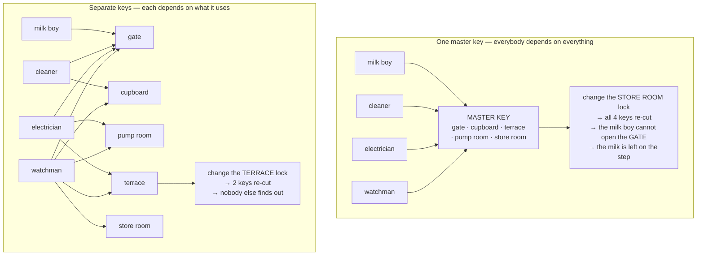
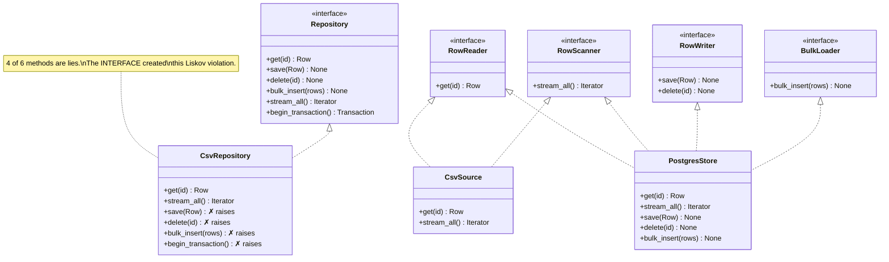

# Day 058 · System Design — Interface segregation

**After today you can:** You can spot a fat interface and split it by client.

**The interviewer asks it as:** *Why is a single large interface a problem?*

---

## 1. What this is, and why they ask it

The **interface segregation principle** is the I in SOLID: no client should be forced to depend on
methods it does not use. In practice that means **many small interfaces, named after roles, rather
than one large one named after a thing.** A class that only reads should depend on a type that only
promises reading, so that a change to how writing works cannot reach it.

They ask it because a fat interface is the most common structural problem in a real codebase and
almost nobody names it. It has two costs, and a good answer gives both. The first is that
implementations are forced to supply methods they cannot support, so they stub them out with
`NotImplementedError` — which is a Liskov violation from
[day 057](../day-057-stability-and-pythons-sort/README.md), created by the interface rather than by
the implementer. The second is churn: adding one method to a fifteen-method interface forces every
implementation and every test fake to change, including the ones that never touch it. Python has an
unusually good answer to this — a `Protocol` can be declared by the *consumer*, so the narrow
interface costs nothing and the provider does not even have to know — and being able to say that is
a strong answer to a question most people answer generically.

---

## 2. The story

The society secretary at an apartment building in Pune is a retired bank manager called Mr Kulkarni,
and about four years ago he did something entirely sensible that took him two years to undo.

The building has a main gate, a corridor cupboard where the cleaning things live, a terrace door, a
pump room, and a store room in the basement where the society keeps decorations, spare taps, and the
generator's spare parts.

Four people needed to get in and out. The watchman, the cleaning lady, the electrician who comes on
call, and the boy who leaves the milk at six in the morning.

Rather than work out who needed what, Mr Kulkarni had one key cut that opened everything, and gave
one to each of them. It took ten minutes and it solved the problem completely and everybody said it
was a good idea.

Two things happened afterwards.

The first was in the second year, when some of the generator parts went missing from the store room.
Nobody ever found out who took them, and that was the point — four people could have. The milk boy
had, for two years, been carrying a key to a room he had never once had a reason to enter, and when
the committee started asking questions his name was on the list simply because of what was in his
pocket.

The second was what happened next. They changed the store room lock. And because there was only one
kind of key in the building, every single one of the four keys stopped working — not just for the
store room, for everything. All four people had to stop what they were doing and come and collect a
new key. The milk boy came at six in the morning, could not get through the main gate, and left the
milk on the step, and Mrs Deshpande's cat got at it.

That is the bit Mr Kulkarni tells people about. Not the theft. The fact that changing a lock nobody
in the building except two people had ever used had, that morning, stopped the milk.

He does it differently now, and it took an afternoon and about nine hundred rupees. The milk boy has
one key and it opens the gate. The cleaning lady has two — the gate and the cupboard. The electrician
has the gate, the pump room and the terrace. The watchman has all of them, because the watchman
genuinely does need all of them.

They changed the terrace lock last year. Two keys were re-cut. Nobody else in the building found out
it had happened.

---

## 3. The idea in plain English

Mr Kulkarni's master key is a fat interface. Everybody depends on all of it, so a change anywhere
reaches everybody, and everybody carries capabilities they never use. Four separate keys is interface
segregation.

### The principle

> **No client should be forced to depend on methods it does not use.**

"Client" means the code that calls the interface, not a person. And "depend on" is stronger than
"call" — if your function takes a `Repository` with fifteen methods and calls one, you depend on all
fifteen, because a change to any of them changes the type you are declared against.

### The two costs, which are different and both worth naming

**Cost one: implementations are forced to lie.**

```python
class Repository(Protocol):
    def get(self, id: str) -> Row: ...
    def save(self, row: Row) -> None: ...
    def delete(self, id: str) -> None: ...
    def bulk_insert(self, rows: list[Row]) -> None: ...
    def stream_all(self) -> Iterator[Row]: ...
    def begin_transaction(self) -> Transaction: ...
```

Now write a read-only repository backed by a CSV file that ships with the product. It can `get` and
it can `stream_all`. It cannot save, delete, bulk-insert, or begin a transaction. So it does this:

```python
class CsvRepository:
    def get(self, id: str) -> Row: ...
    def stream_all(self) -> Iterator[Row]: ...
    def save(self, row: Row) -> None:
        raise NotImplementedError("this repository is read only")
    def delete(self, id: str) -> None:
        raise NotImplementedError("this repository is read only")
    ...
```

That is a Liskov violation — a subtype delivering less than the contract promised — and the
implementer had no choice. **The interface created the violation.** The fix is not to be more careful
in `CsvRepository`; it is to have two interfaces, so that "can read" and "can write" are separate
claims and `CsvRepository` only makes the one that is true.

**Cost two: churn reaches code that does not care.**

Add a `bulk_upsert` method to the interface. Now:

```
 6 implementations           -> 6 files must add the method
 4 test fakes                -> 4 more
 every caller's type stubs   -> re-checked
 in a compiled language      -> every module importing the interface recompiles
                                and, in a deployed system, redeploys
```

A reporting service that only ever calls `get` has to change, be re-reviewed and be redeployed
because of a method it will never call. That is the store room lock stopping the milk.

### The classic example

The textbook version, and worth knowing because interviewers use it:

```python
class Worker(Protocol):
    def work(self) -> None: ...
    def eat(self) -> None: ...

class Robot:
    def work(self) -> None: ...
    def eat(self) -> None:
        raise NotImplementedError("robots do not eat")     # forced to lie
```

Split by role:

```python
class Workable(Protocol):
    def work(self) -> None: ...

class Feedable(Protocol):
    def eat(self) -> None: ...
```

Now `Robot` implements `Workable` only, and honestly. A payroll function takes `Feedable`; a
scheduler takes `Workable`; a human implements both.

A more realistic version of the same shape is an office multifunction machine:

```python
class Machine(Protocol):
    def print(self, doc: Document) -> None: ...
    def scan(self) -> Document: ...
    def fax(self, doc: Document, number: str) -> None: ...
    def staple(self, doc: Document) -> None: ...
```

An old laser printer can only print. It is forced to stub three methods, and every function that
takes a `Machine` has to worry about which one it got.

### Role interfaces, not header interfaces

Two names worth having:

- A **header interface** is named after the implementation and lists everything it can do:
  `Repository`, `Machine`, `UserService`. It is written *by the provider* and it grows forever.
- A **role interface** is named after what a client needs: `UserReader`, `Printer`,
  `PriceQuoter`. It is written *from the caller's side*, and it is small because a caller usually
  needs one or two things.

**Name interfaces after roles, and prefer `-er` names.** `UserReader` rather than `UserRepository`.
The name itself keeps them small: it is hard to justify adding `delete` to something called
`UserReader`, and very easy to justify adding it to something called `UserRepository`.

### The Python answer, which is unusually good

In Java or C#, an interface is declared by the provider and the implementer must say `implements`. So
splitting a fat interface is a change to every implementation.

In Python, `typing.Protocol` is **structural** — it matches on the shape of the methods, and the
implementing class inherits nothing and imports nothing
([day 052](../day-052-quadratic-sorts/README.md)). That means the *consumer* can declare exactly the
narrow interface it needs, and the provider does not have to be touched at all:

```python
# in reporting/monthly.py -- declared by the CONSUMER, for the consumer
class UserReader(Protocol):
    def get(self, user_id: str) -> User: ...

def monthly_report(users: UserReader, ids: list[str]) -> Report:
    ...
```

`PostgresUserRepository` already satisfies `UserReader` — it has a `get` with that signature — and
nobody had to change it. The reporting module now depends on exactly one method, so adding
`bulk_upsert` to the repository cannot reach it, and the test fake for this module is a class with
one method in it.

That is the strongest form of interface segregation available in any mainstream language, and it is
worth naming explicitly in an interview: **in Python the narrow interface is free, and it can be
declared where it is used.**

### How to spot a fat interface

1. **Implementations that raise `NotImplementedError`.** The loudest signal, and it is greppable.
2. **Callers that use two or three methods of a fifteen-method type.** Count the methods a function
   actually calls against the methods its parameter type declares.
3. **Test fakes that are enormous.** If faking a dependency means writing twelve stub methods to
   test one call, the interface is too wide. This is the cost people feel first.
4. **The interface's name is a noun for a thing rather than a capability.** `Repository`, `Manager`,
   `Service`, `Machine`, `Context`.
5. **A method added for one caller.** Look at the version history: if methods arrive one at a time,
   each for a single new use, the interface is a bag rather than a contract.

---

## 4. The picture

The keys:



**What to notice:** the watchman still holds everything, and that is fine — he genuinely uses
everything. Segregation is not about giving everyone less; it is about nobody being *forced* to hold
what they do not use. And notice the blast radius at the bottom of each half: four against two.

The fat repository, and the split:



**What to notice:** `CsvSource` now implements two interfaces honestly rather than one interface
dishonestly. Nothing raises. And a function that only reads declares `RowReader`, so adding a method
to `BulkLoader` cannot possibly reach it.

What each caller actually needs:

```
   caller                        methods it CALLS   type it DECLARES   forced dependency
   ---------------------------   ----------------   ----------------   -----------------
   monthly_report()                      1          Repository (6)          5 unused
   export_all_to_csv()                   1          Repository (6)          5 unused
   admin_delete_user()                   2          Repository (6)          4 unused
   nightly_import()                      1          Repository (6)          5 unused
   checkout_flow()                       3          Repository (6)          3 unused

   total unused dependencies: 22

 after splitting into role interfaces:

   monthly_report()                      1          RowReader (1)           0
   export_all_to_csv()                   1          RowScanner (1)          0
   admin_delete_user()                   2          RowWriter (2)           0
   nightly_import()                      1          BulkLoader (1)          0
   checkout_flow()                       3          RowReader + RowWriter   0
```

**What to notice:** twenty-two forced dependencies became zero, and no implementation changed. In
Python, declaring those four narrow protocols is about twelve lines and the provider is never
touched.

---

## 5. How it actually works

### The split, in four steps

**Step 1 — list the callers and the methods each one actually calls.** This is the whole diagnosis
and it takes ten minutes with `grep`. Anything a caller does not call is a forced dependency.

**Step 2 — group callers by the set of methods they use.** Those groups are your role interfaces.
Usually three or four fall out of a fifteen-method interface.

**Step 3 — name each group after the role, not the thing.** `UserReader`, `RowScanner`,
`PriceQuoter`, `EventPublisher`. `-er` names keep them small.

**Step 4 — change the *parameter types*, not the implementations.** In Python nothing about the
concrete classes changes, because `Protocol` is structural. That is the step that makes this a
cheap refactor rather than an expensive one.

### Before

```python
from typing import Iterator, Protocol


class Repository(Protocol):
    """A header interface: named after the thing, and it grows forever."""

    def get(self, row_id: str) -> dict: ...
    def save(self, row: dict) -> None: ...
    def delete(self, row_id: str) -> None: ...
    def bulk_insert(self, rows: list[dict]) -> None: ...
    def stream_all(self) -> Iterator[dict]: ...
    def begin_transaction(self) -> object: ...


def monthly_report(repo: Repository, user_ids: list[str]) -> list[dict]:
    """Calls exactly ONE method and depends on six."""
    return [repo.get(uid) for uid in user_ids]
```

The test for `monthly_report` needs a fake `Repository`, which means six stub methods to exercise
one.

### After

```python
class RowReader(Protocol):
    """A role interface, declared where it is USED."""
    def get(self, row_id: str) -> dict: ...


class RowScanner(Protocol):
    def stream_all(self) -> Iterator[dict]: ...


class RowWriter(Protocol):
    def save(self, row: dict) -> None: ...
    def delete(self, row_id: str) -> None: ...


class BulkLoader(Protocol):
    def bulk_insert(self, rows: list[dict]) -> None: ...
```

```python
def monthly_report(reader: RowReader, user_ids: list[str]) -> list[dict]:
    """Depends on exactly what it calls."""
    return [reader.get(uid) for uid in user_ids]


def export_all(scanner: RowScanner, out) -> int:
    count = 0
    for row in scanner.stream_all():
        out.write(row)
        count += 1
    return count


def admin_delete(writer: RowWriter, row_id: str) -> None:
    writer.delete(row_id)
```

And the implementations, unchanged and honest:

```python
class CsvSource:
    """Satisfies RowReader and RowScanner. Claims nothing else. Nothing raises."""

    def __init__(self, rows: list[dict]) -> None:
        self._rows = {r["id"]: r for r in rows}

    def get(self, row_id: str) -> dict:
        return self._rows[row_id]

    def stream_all(self) -> Iterator[dict]:
        yield from self._rows.values()


class PostgresStore:
    """Satisfies all four. It genuinely can do all four."""

    def get(self, row_id: str) -> dict: ...
    def stream_all(self) -> Iterator[dict]: ...
    def save(self, row: dict) -> None: ...
    def delete(self, row_id: str) -> None: ...
    def bulk_insert(self, rows: list[dict]) -> None: ...
```

Note that neither class inherits from anything. `CsvSource` satisfies `RowReader` because it has a
`get` of the right shape, and a type checker verifies that at the call site. **The provider was never
edited.**

### The test, which is where you feel the difference

```python
def test_monthly_report_fetches_each_user() -> None:
    class OneMethodFake:                    # the ENTIRE fake
        def get(self, row_id: str) -> dict:
            return {"id": row_id, "total": 100}

    rows = monthly_report(OneMethodFake(), ["a", "b"])
    assert [r["id"] for r in rows] == ["a", "b"]
```

Four lines. Against the fat interface, this fake needs six methods, five of which are
`raise NotImplementedError` — and a reviewer cannot tell at a glance whether those five are stubs
because they are unused or stubs because somebody forgot.

### Composing interfaces when a caller needs two

```python
class ReadWriteStore(RowReader, RowWriter, Protocol):
    """Compose rather than widen. Callers that need both declare this."""


def checkout(store: ReadWriteStore, order_id: str) -> None:
    order = store.get(order_id)
    order["status"] = "paid"
    store.save(order)
```

Inheriting protocols composes them. This is how you keep small interfaces without forcing every
caller to take four parameters — and crucially, `ReadWriteStore` is still only three methods, not
six.

### Where real systems do this

- **Go's `io` package** is the canonical success. `io.Reader` has exactly one method, `Read`.
  `io.Writer` has one, `Write`. `io.ReadWriter` is those two composed. Almost the entire Go standard
  library is built out of one-method interfaces, and it is the most-cited example of this principle
  working at scale.
- **Python's `collections.abc`** — `Iterable` (one method), `Container` (one), `Sized` (one),
  `Sequence`, `MutableSequence`, `Mapping`, `MutableMapping`. The read/write split is exactly
  interface segregation, and it is also the fix for the Liskov problem from
  [day 057](../day-057-stability-and-pythons-sort/README.md).
- **Java's `Closeable`, `Comparable`, `Serializable`, `Runnable`** — one method each, mixed in as
  needed. Against that, `java.sql.ResultSet` has over a hundred and eighty methods and is the
  standard example of a fat interface.
- **`typing.Protocol` declared at the consumer** — the Python idiom described above, and the reason
  narrow interfaces cost nothing here.
- **Least privilege in security** — the same principle, applied to permissions rather than methods.
  An IAM role with `s3:GetObject` rather than `s3:*` is interface segregation, and it fails the same
  way when somebody grants the master key because it is quicker.

---

## 6. The numbers

### Forced dependencies, counted

```
 Repository: 6 methods, 5 callers.

   caller                methods called   methods depended on   unused
   -------------------   --------------   -------------------   ------
   monthly_report              1                  6               5
   export_all_to_csv           1                  6               5
   admin_delete_user           2                  6               4
   nightly_import              1                  6               5
   checkout_flow               3                  6               3
                                                                 ----
                                                          total   22

 after splitting into 4 role interfaces:            total    0
 cost of the split, in Python: ~12 lines of Protocol declarations,
                               0 changes to any implementation.
```

### Churn, priced

```
 Adding one method to the interface.

 fat interface (6 methods, 6 implementations, 4 test fakes):
   implementations to update      : 6
   test fakes to update           : 4
   files re-reviewed              : 10
   services redeployed (compiled
     language, shared library)    : every service importing the interface
   engineer-hours                 : ~4

 role interfaces:
   the new method goes on ONE role interface (or a new one)
   implementations that actually offer it : 2
   test fakes affected                    : the 1 that fakes that role
   engineer-hours                         : ~0.5
```

### Test-fake size

```
 faking a dependency to test ONE call:

   fat Repository (6 methods) : 6 stub methods, ~18 lines,
                                5 of them raise NotImplementedError
   RowReader (1 method)       : 1 method, 4 lines

 Across 40 tests that each need a fake:
   fat     : 40 x 18 = 720 lines of stub code
   narrow  : 40 x  4 = 160 lines
```

The 720-line number is the one that persuades people, because everyone has written those stubs.

### `NotImplementedError`, counted

```
 grep -rn "NotImplementedError" src/

 before : 23 hits
          of which 19 are "this implementation doesn't support that method"
          i.e. 19 Liskov violations CREATED BY the interface

 after  : 4 hits, all in genuine abstract base classes where a subclass
          is required to supply the method
```

That grep is a real diagnostic and worth naming in an interview: **most `NotImplementedError`s in a
codebase are interface segregation failures.**

### Where it stops paying

```
 splitting a 6-method interface into 6 one-method interfaces:

   protocols to declare      : 6
   callers needing 3 of them : must declare a composed protocol anyway
   names to invent           : 6, several of them awkward (RowDeleter?)
   reader's question
     "what can this thing do?" : now answered by reading 6 files

 The gain from 4 interfaces to 6 is near zero;
 the naming and reading cost is real.
```

---

## 7. The trade-offs

### What splitting costs you

**More names, and some of them are bad.** `RowReader` is fine. `RowDeleter` is not really a role
anybody has. When the name is awkward, that is a signal the split is too fine.

**More types to trace.** A reader asking "what can this store do?" now has to find every protocol it
satisfies rather than reading one interface. In Python that is worse than in Java, because structural
typing means nothing in the class declares what it implements.

**Composed protocols multiply.** A caller needing read and write declares `ReadWriteStore`; one
needing read and bulk declares something else. Left unchecked you get a combinatorial pile of
composed protocols, which is its own mess.

### When one interface is right

**I would not split if** every client uses every method. That is not a fat interface, it is a
cohesive one — and cohesion is the other half of the argument, exactly as in
[day 055](../day-055-quickselect/README.md). A `Money` or a `DateRange` with eight methods that
callers use together is fine.

**I would not split if** the interface has one implementation and two callers. There is nothing to
protect against yet; wait for the second implementation or the third caller, which is the same
"wait for the second" rule as
[day 056](../day-056-non-comparison-sorts/README.md).

**I would not split down to one method each** as a matter of policy. Go does this and it works
because the standard library was designed that way from the start; retrofitting it onto an
application produces a lot of interfaces named after verbs and a codebase nobody can navigate.
Three or four role interfaces out of a fifteen-method type is usually the right granularity.

### The genuine tension with the other principles

Interface segregation pushes towards **many small types**. Single responsibility pushes towards
**cohesive units**. Those can pull against each other, and the resolution is to remember what each
one is about: **SRP is about who changes the code; ISP is about who calls it.** A class can have one
reason to change and still expose three different roles to three different callers — a `Postgres
store` is one responsibility and satisfies four role interfaces, and that is correct, not
contradictory.

### The honest limit

Interface segregation reduces *compile-time and review-time* coupling. It does not reduce runtime
coupling: `monthly_report` declared against `RowReader` still receives a whole `PostgresStore` at
runtime, with all its methods, and if that object is broken the report still breaks. What you have
bought is that a *change* to the writing methods cannot reach the reporting module, and that the
reporting module's test needs a four-line fake. That is worth having, and it is worth being precise
about rather than claiming isolation you have not achieved.

### Where it sits with the other four

Interface segregation is largely the **fix** for Liskov violations
([day 057](../day-057-stability-and-pythons-sort/README.md)): an implementation raising
`NotImplementedError` is almost always an interface promising more than that implementation can
deliver, and splitting the interface removes the lie. It is also what makes open/closed
([day 056](../day-056-non-comparison-sorts/README.md)) cheap: a small interface means a new
implementation is a small amount of work, whereas a fifteen-method interface makes every new
implementation a project. And dependency inversion
([day 059](../day-059-sorting-revision/README.md)) is what points the callers at these interfaces in
the first place.

---

## 8. In the interview

### How it gets asked

- *"Why is a single large interface a problem?"* — the direct form. Give both costs: forced lies, and
  churn.
- *"You have a `Repository` with fifteen methods. What would you do?"* — the practical form, and the
  right first move is to count what each caller actually calls.
- *"What does `NotImplementedError` in an implementation tell you?"* — that the interface is too
  wide, not that the implementer was lazy.
- *"How is this different from single responsibility?"* — the question that separates people who
  memorised SOLID from people who use it. SRP is about who *changes* it; ISP is about who *calls*
  it.
- *"Isn't this just more interfaces?"* — the pushback. Answer with the fake-size and churn numbers,
  and concede the naming cost.

### What to say out loud, in the first ninety seconds

1. **State it in terms of the caller.** *"No client should be forced to depend on methods it doesn't
   use. And 'depend on' is stronger than 'call' — if my function takes a fifteen-method type and
   calls one, a change to any of the other fourteen changes my declared type."*
2. **Give the first cost concretely.** *"Implementations get forced to lie. A read-only CSV-backed
   repository has to stub `save` and `delete` with `NotImplementedError`, which is a Liskov
   violation the interface created."*
3. **Give the second cost with a number.** *"And churn: adding one method means editing six
   implementations and four test fakes, including the ones for callers that will never touch it."*
4. **Name the diagnosis.** *"I'd list the callers and count the methods each actually calls. In one
   codebase that was twenty-two forced dependencies across five callers of a six-method interface."*
5. **Give the Python answer, because it is the strong one.** *"In Python I'd declare a narrow
   `Protocol` at the consumer — `class UserReader(Protocol): def get(...)` — and because Protocols
   are structural, the existing repository already satisfies it. No implementation changes at all;
   it's about twelve lines."*

### The follow-ups

**"How is this different from single responsibility?"**
They point in similar directions but they are answering different questions, and the distinction is
worth being precise about. Single responsibility is about **who changes the code**: I group methods
by which stakeholder would come and ask for them to be different, and split when two different people
own two different parts. Interface segregation is about **who calls the code**: I group methods by
which client uses them, and split so that no caller is declared against methods it never invokes. So
they can pull in opposite directions and both be right. A `PostgresStore` has exactly one reason to
change — the platform team owns how rows are persisted — so by SRP it is one class and should stay
one class. But it has four different kinds of caller, so by ISP it should satisfy four narrow role
interfaces. One implementation class, four interfaces, and neither principle is being violated. The
mistake would be to conclude from ISP that `PostgresStore` should be split into four classes; that
would be applying a rule about interfaces to an implementation. The short form I would give: **ISP
splits the contract, SRP splits the code.**

**"Isn't this just adding more interfaces to maintain?"**
It is more names, and I would concede that some of them are awkward — `RowReader` is a fine role,
`RowDeleter` is not really a role anybody has, and when the name is hard the split is probably too
fine. What it buys is two things I can measure. The first is churn: adding a method to a six-method
interface with six implementations and four test fakes is ten files and about four hours; adding it
to the one role interface that needs it is two implementations and one fake, about half an hour.
The second is test cost, and this is the one everybody has felt — faking a six-method interface to
exercise one call is about eighteen lines of stubs, five of them `raise NotImplementedError`, and a
reviewer cannot tell whether those five are deliberately unused or accidentally forgotten. Against a
one-method protocol the fake is four lines. Across forty tests that is seven hundred lines of stub
code against a hundred and sixty. And in Python the cost side is unusually low, because `Protocol` is
structural — I declare the narrow interface in the consuming module and the provider is never
touched, so the whole refactor is about twelve lines and zero changes to any implementation. In Java
it is more expensive, because the implementer has to declare `implements`, and I would weigh it
differently there.

**"How do you decide the granularity?"**
By grouping callers, not by decomposing the interface. I list every caller and the methods it
actually calls — that is a `grep` and about ten minutes — and then look for clusters. Usually a
fifteen-method interface has three or four distinct usage patterns: things that read one row, things
that scan everything, things that write, things that bulk-load. Those clusters are the interfaces,
and I name them after the role rather than the thing, with `-er` names, because a name like
`UserReader` makes it hard to justify adding `delete` while a name like `UserRepository` makes it
easy. What I would not do is go all the way to one method per interface as a matter of policy. Go
does that and it works beautifully, but Go's standard library was designed that way from the
beginning; retrofitting it onto an application gives you a large number of verb-shaped interfaces and
a codebase where answering "what can this thing do?" means reading six files. And when a caller
genuinely needs two roles, I compose the protocols rather than widening either one — inheriting two
Protocols gives me a three-method `ReadWriteStore` rather than going back to the six-method original.
The stopping rule is that the gain from four interfaces to six is near zero and the naming cost is
real.

### A model answer

> "The principle is that no client should be forced to depend on methods it doesn't use — and 'depend
> on' is stronger than 'call'. If my reporting function takes a `Repository` with six methods and
> calls one, a change to any of the other five changes the type I'm declared against, so it reaches
> me.
>
> There are two distinct costs and I'd give both. The first is that implementations get forced to
> lie. If the interface promises `get`, `save`, `delete`, `bulk_insert`, `stream_all` and
> `begin_transaction`, then a read-only CSV-backed source has to stub four of those with
> `NotImplementedError` — and that's a Liskov violation created by the interface, not by the
> implementer. In fact I'd say most `NotImplementedError`s in a codebase are interface segregation
> failures; grepping for them is a genuine diagnostic.
>
> The second cost is churn. Adding one method to that interface means updating six implementations and
> four test fakes, and in a compiled language redeploying every service that imports it — including a
> reporting service that only ever calls `get`. That's the practical harm.
>
> The diagnosis is mechanical: list the callers, count the methods each actually calls. On the
> codebase I'm thinking of, five callers of a six-method interface gave twenty-two forced
> dependencies. Those callers cluster — some read one row, some scan everything, some write — and each
> cluster becomes a role interface, named after the role: `RowReader`, `RowScanner`, `RowWriter`. The
> `-er` naming keeps them small, because it's hard to justify putting `delete` on something called
> `RowReader`.
>
> In Python the fix is unusually cheap, and I'd point that out. `typing.Protocol` is structural, so I
> declare the narrow interface in the *consuming* module and the existing `PostgresStore` already
> satisfies it — it has a `get` of the right shape. No implementation is edited at all. That's about
> twelve lines for the whole refactor, and the test fake for the reporting module goes from eighteen
> lines of stubs to a four-line class with one method.
>
> Where I'd stop: I wouldn't go to one method per interface as policy — three or four roles out of
> fifteen methods is usually right, and past that the names get awkward and nobody can tell what a
> class can do. And if every caller genuinely uses every method, that's a cohesive interface, not a
> fat one, and I'd leave it alone."

---

## 9. Recall card

- **No client should be forced to depend on methods it does not use** — and *depend on* is stronger
  than *call*: taking a 15-method type and calling one means all 15 changes reach you. Prefer **role
  interfaces** named after a capability (`UserReader`, `RowScanner`) over **header interfaces** named
  after a thing (`Repository`, `Machine`). `-er` names keep them small.
- **Two costs, and give both.** Implementations are **forced to lie** — `CsvRepository.save` raising
  `NotImplementedError` is a Liskov violation *created by the interface*. And **churn**: one new
  method = 6 implementations + 4 fakes + a redeploy, for callers that will never invoke it. Mr
  Kulkarni changed the store-room lock and stopped the milk.
- **The diagnosis is a grep.** List every caller and count methods called against methods depended
  on — 5 callers of a 6-method interface gave **22 forced dependencies**, and 19 of 23
  `NotImplementedError`s were ISP failures. Test fakes are where you feel it: 18 lines of stubs
  against 4, times 40 tests.
- **In Python the narrow interface is free.** `typing.Protocol` is **structural**, so declare it in
  the *consuming* module — the provider is never edited. ~12 lines, 0 implementation changes.
  Compose with protocol inheritance (`class ReadWriteStore(RowReader, RowWriter, Protocol)`) rather
  than widening.
- **ISP splits the contract; SRP splits the code.** One `PostgresStore` class (one reason to change)
  satisfying four role interfaces (four kinds of caller) is correct, not contradictory. Stop at three
  or four roles — going to one method each retrofits Go's design onto an app and nobody can answer
  "what can this thing do?"
