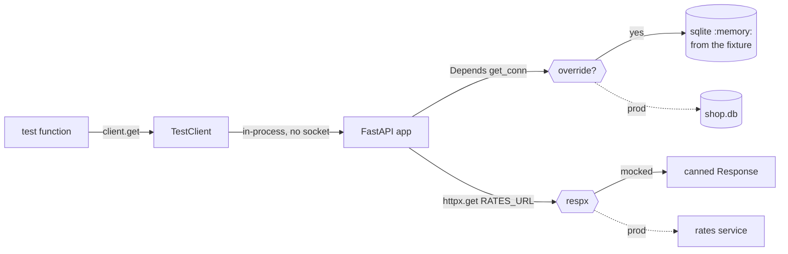

# Day 058 · Python — TestClient, fixtures for a test database, and mocking with respx

**Today's theme:** Testing a service

**After today you can:** You can test an HTTP handler in each language without a network or a real database.

**The interviewer asks it as:** *How do you test code that calls another service?*

---

## 1. What this is, and why it matters

A service test calls your route the way a real caller would, checks the status and the body, and
does it without a network, without a real database, and without the other services your code
talks to. In FastAPI the three tools are `TestClient`, which sends a request straight into the
app in-process; a pytest **fixture** that hands each test a fresh database and swaps it in with
`app.dependency_overrides`; and **respx**, which intercepts every `httpx` request your code makes
and answers it with whatever the test says. The result is a test file that runs in a fraction of
a second, passes on a laptop with the Wi-Fi off, and fails only when your code is wrong.

At work this is most of the test suite for any backend. The unit tests from
[day 28](../day-028-opposite-ends/README.md) cover functions; these cover the thing you
ship. In interviews the question is "how do you test code that calls another service", and the
answer they want is the shape of today: put the dependency behind a seam, replace it in the test,
and check both the happy path and the path where the other side is down.

## 2. The story

Rehearsal for the school play is on Thursday, and the lead actor has a dentist appointment. Priya,
who is directing, does not cancel. She hands his lines to Sameer from the year below and says: "You
are the king today. When Asha says 'Is the bridge safe?', you say 'It is', and nothing else. When
she asks the second time, you say nothing. Just stand there." Sameer has never read the play. He
does not need to. He has two lines and an instruction.

The point of the rehearsal is not Sameer. It is Asha. Priya wants to know what Asha does when the
king says yes, and what she does when the king says nothing at all. Last week nobody knew, because
the real lead always answered, and always answered well. Nobody had ever seen the scene fail.

Before each run-through, Priya resets the stage. The chairs go back to their marks. The prop
lantern goes back on the table. The bridge, which is a plank between two crates, goes back
across the crates. She does this every time, even if the last run looked fine, because the run
before that had gone wrong for a reason nobody could find, and it turned out the lantern had
been left on the wrong side of the stage by the previous scene. Now every attempt starts from the
same picture.

They run the scene four times. First with Sameer saying "It is": Asha crosses the bridge. Second
with him silent: Asha is meant to turn back, and she does not. She stands there waiting. Everyone
sees it at once. That is the bug they came for. Third, Priya has Sameer say "It is not", and
Asha, unprompted, turns back correctly. Fourth, the plank is removed, and Asha, to her credit,
stops before the crates.

At the end Priya asks Sameer how many times he was asked about the bridge. "Four," he says. She
had counted three. They go back and find the extra one. The dentist appointment, it turns out,
was the most useful thing that happened to the play all term.

## 3. The idea in plain English

The scene is your route. Asha is the code under test. The real lead actor is the other service,
the one you cannot rely on being there, and cannot make say "nothing" on demand. Sameer is a
**mock**: a stand-in that says exactly what the test tells it to say, and counts how many times
it was asked. respx builds Sameer for you. `respx.get(URL).mock(return_value=httpx.Response(...))`
registers what to answer; `route.called` and `route.calls` are the count.

Resetting the stage before each run is a **fixture**: a pytest function that builds known
starting state, hands it to the test, and cleans up after. Today the fixture is an in-memory
SQLite database with one row in it. Every test gets its own; no test can leave a lantern on the
wrong side for the next.

Handing Sameer's lines in is **dependency injection** plus an **override**. The route gets its
database through `Depends(get_conn)` from [day 49](../day-049-peak-finding/README.md). In the
test, `app.dependency_overrides[get_conn] = lambda: conn` tells FastAPI to call your lambda
instead. The route does not know it is in a rehearsal.

`TestClient` is the audience: it sends requests to the app without opening a socket, in the same
process, so `client.get("/price/pen")` returns in a millisecond, and a traceback in the route
lands in your test output instead of in a log somewhere.

The four run-throughs are the four tests you always write: the happy path, the missing thing,
the dependency answering something unexpected, and the dependency being down.

## 4. The picture



Notice the two seams. Both dashed arrows are what production does, and both are cut in the
test. Neither the route nor `get_rate` changes between the two pictures; only what is on the far
side of each seam does.

## 5. The code, built step by step

Install the pieces:

```bash
pip install fastapi httpx pytest respx
```

The service under test, in `app.py`. It reads a price in rupees from the database, and, if the
caller wants another currency, asks a rates service for the conversion.

```python
import sqlite3
from collections.abc import Iterator

import httpx
from fastapi import Depends, FastAPI, HTTPException

RATES_URL = "https://rates.example/v1/rate"
app = FastAPI()
```

The database dependency, exactly the shape from day 49: a generator that yields the connection
and closes it after the response.

```python
def get_conn() -> Iterator[sqlite3.Connection]:
    conn = sqlite3.connect("shop.db")
    try:
        yield conn
    finally:
        conn.close()
```

The call to the other service. It is a plain function using `httpx`, with a timeout, and it
raises on a non-2xx status.

```python
def get_rate(currency: str) -> float:
    response = httpx.get(RATES_URL, params={"to": currency}, timeout=2.0)
    response.raise_for_status()
    return float(response.json()["rate"])
```

The route. Notice the `except httpx.HTTPError`: when the rates service is down or slow, the
caller gets a 502, "the thing behind me failed", not a 500.

```python
@app.get("/price/{sku}")
def price(sku: str, currency: str = "INR",
          conn: sqlite3.Connection = Depends(get_conn)) -> dict:
    row = conn.execute("SELECT price_inr FROM items WHERE sku = ?", (sku,)).fetchone()
    if row is None:
        raise HTTPException(404, detail={"code": "not_found", "message": f"no item {sku}"})
    try:
        rate = 1.0 if currency == "INR" else get_rate(currency)
    except httpx.HTTPError as exc:
        raise HTTPException(502, detail={"code": "rates_unavailable", "message": str(exc)})
    return {"sku": sku, "currency": currency, "price": round(row[0] * rate, 2)}
```

Now the tests, in `test_app.py`. First the stage reset: a fixture that builds a fresh in-memory
database with one item.

```python
@pytest.fixture
def conn() -> Iterator[sqlite3.Connection]:
    conn = sqlite3.connect(":memory:")
    conn.execute("CREATE TABLE items (sku TEXT PRIMARY KEY, price_inr REAL)")
    conn.execute("INSERT INTO items VALUES ('pen', 20.0)")
    yield conn
    conn.close()
```

`:memory:` is a real SQLite database that lives only in this process and vanishes on close. The
`yield` splits set-up from tear-down; everything after it runs when the test ends, pass or fail.

Then the override, in a second fixture that depends on the first.

```python
@pytest.fixture
def client(conn: sqlite3.Connection) -> Iterator[TestClient]:
    app.dependency_overrides[get_conn] = lambda: conn
    with TestClient(app) as test_client:
        yield test_client
    app.dependency_overrides.clear()
```

The key is the original function object, `get_conn`; the value is anything FastAPI can call
instead. `clear()` in the tear-down matters: overrides live on the app, which is shared by every
test in the process, so a forgotten override leaks into the next file.

The happy path and the missing item need no mock, because with `currency=INR` the route never
calls out.

```python
def test_price_in_inr(client: TestClient) -> None:
    response = client.get("/price/pen")
    assert response.status_code == 200
    assert response.json() == {"sku": "pen", "currency": "INR", "price": 20.0}

def test_missing_sku(client: TestClient) -> None:
    response = client.get("/price/nope")
    assert response.status_code == 404
    assert response.json()["detail"]["code"] == "not_found"
```

Now Sameer. `@respx.mock` turns interception on for the test; inside, `respx.get(RATES_URL)`
registers a route, and `.mock(return_value=...)` gives it its line.

```python
@respx.mock
def test_price_in_usd(client: TestClient) -> None:
    route = respx.get(RATES_URL).mock(return_value=httpx.Response(200, json={"rate": 0.012}))
    response = client.get("/price/pen", params={"currency": "USD"})
    assert response.status_code == 200
    assert response.json()["price"] == 0.24
    assert route.called
    assert route.calls.last.request.url.params["to"] == "USD"
```

The last two asserts are Priya asking Sameer how many times he was asked, and what exactly. A
mock that only answers is half a mock; checking what your code sent is the other half.

The down path: the rates service answers 503, `raise_for_status` raises, the route turns it into
a 502.

```python
@respx.mock
def test_rates_down(client: TestClient) -> None:
    respx.get(RATES_URL).mock(return_value=httpx.Response(503))
    response = client.get("/price/pen", params={"currency": "USD"})
    assert response.status_code == 502
    assert response.json()["detail"]["code"] == "rates_unavailable"
```

Run them:

```bash
python -m pytest -v
```

```text
test_app.py::test_price_in_inr PASSED
test_app.py::test_missing_sku PASSED
test_app.py::test_price_in_usd PASSED
test_app.py::test_rates_down PASSED

4 passed in 0.41s
```

No network was opened, no file was written, and the whole run is under half a second. Here is
the complete test file, `test_app.py`:

```python
import sqlite3
from collections.abc import Iterator

import httpx
import pytest
import respx
from fastapi.testclient import TestClient

from app import RATES_URL, app, get_conn


@pytest.fixture
def conn() -> Iterator[sqlite3.Connection]:
    conn = sqlite3.connect(":memory:")
    conn.execute("CREATE TABLE items (sku TEXT PRIMARY KEY, price_inr REAL)")
    conn.execute("INSERT INTO items VALUES ('pen', 20.0)")
    yield conn
    conn.close()


@pytest.fixture
def client(conn: sqlite3.Connection) -> Iterator[TestClient]:
    app.dependency_overrides[get_conn] = lambda: conn
    with TestClient(app) as test_client:
        yield test_client
    app.dependency_overrides.clear()


def test_price_in_inr(client: TestClient) -> None:
    response = client.get("/price/pen")
    assert response.status_code == 200
    assert response.json() == {"sku": "pen", "currency": "INR", "price": 20.0}


def test_missing_sku(client: TestClient) -> None:
    response = client.get("/price/nope")
    assert response.status_code == 404
    assert response.json()["detail"]["code"] == "not_found"


@respx.mock
def test_price_in_usd(client: TestClient) -> None:
    route = respx.get(RATES_URL).mock(return_value=httpx.Response(200, json={"rate": 0.012}))
    response = client.get("/price/pen", params={"currency": "USD"})
    assert response.status_code == 200
    assert response.json()["price"] == 0.24
    assert route.called
    assert route.calls.last.request.url.params["to"] == "USD"


@respx.mock
def test_rates_down(client: TestClient) -> None:
    respx.get(RATES_URL).mock(return_value=httpx.Response(503))
    response = client.get("/price/pen", params={"currency": "USD"})
    assert response.status_code == 502
    assert response.json()["detail"]["code"] == "rates_unavailable"
```

## 6. How the other two languages do it

**Go**

```go
type RateSource interface {
	Rate(ctx context.Context, currency string) (float64, error)
}

func newMux(db *sql.DB, rates RateSource) *http.ServeMux { ... }

// in the test
rec := httptest.NewRecorder()
newMux(newTestDB(t), &fakeRates{rate: 0.012}).ServeHTTP(rec,
	httptest.NewRequest("GET", "/price/pen?currency=USD", nil))
```

Go has no `dependency_overrides` and no respx. The seam is an interface you declare, `RateSource`,
and the fake is a struct you write that satisfies it. `httptest.NewRecorder` plays the role of
`TestClient`: it calls the handler directly and records the status and body.

**C++**

```cpp
class MockRates : public RateSource {
public:
    MOCK_METHOD(double, rate, (const std::string& currency), (override));
};
EXPECT_CALL(rates, rate("USD")).WillOnce(::testing::Return(0.012));
```

The seam is an abstract base class with a virtual `rate`; gMock generates the stand-in from one
macro, and `EXPECT_CALL` states both the answer and how many times it may be asked. There is no
in-process client, so the fixture starts the real server on a thread and calls it over loopback.

**The difference that matters:** in Python the seam can be cut from the outside, after the fact,
because respx patches `httpx` itself and `dependency_overrides` swaps a function by identity. In
Go and C++ the seam must exist in the design before the test can use it: an interface or an
abstract class that the real code and the fake both satisfy. That is why Go and C++ code written
without tests in mind is often untestable, and Python code merely untested.

## 7. The traps

**The near-miss: a test that passes because the failure path was never written.** Suppose the
route had no `try`/`except` around `get_rate`. `test_price_in_usd` still passes. `test_rates_down`
looks like it should give you a 502 assertion failure, but what you actually get is worse:

```text
FAILED test_app.py::test_rates_down - httpx.HTTPStatusError: Server error '503 Service
Unavailable' for url 'https://rates.example/v1/rate?to=USD'
```

`TestClient` re-raises exceptions from the app by default, so the exception the route did not
catch surfaces in the test. That is a feature: it tells you the route would have been a 500 in
production. The fix is in the route, not the test.

**Forgetting `@respx.mock`.** Register a route without turning interception on and nothing is
intercepted:

```text
httpx.ConnectError: [Errno 11001] getaddrinfo failed
```

Your test just tried to reach `rates.example` on the real network. If your machine had a rates
service by that name, the test would have talked to it. A test that can reach the network is a
test whose result depends on the Wi-Fi.

**A request respx did not expect.** With interception on, a request to a URL you did not register
is an error, by design:

```text
respx.models.AllMockedAssertionError: RESPX: <Request('GET', 'https://rates.example/v1/other')> not mocked!
```

Read it as "your code called something the test did not know about". Either the test is missing a
route, or the code is calling somewhere it should not.

**Leaking the override.** Skip `app.dependency_overrides.clear()` and the next test file that uses
`app` silently gets your in-memory connection, which is by then closed:

```text
sqlite3.ProgrammingError: Cannot operate on a closed database.
```

**Asserting on the mock instead of the behaviour.** `assert route.called` is useful as a second
check. As the only check it proves the code sent a request and nothing about what it did with the
answer. The `price == 0.24` assertion is the test; the `called` assertion is the audit.

**Testing through the network by accident.** `TestClient` never opens a socket. If you find
yourself starting `uvicorn` in a fixture and calling `http://127.0.0.1:8000`, you have written an
end-to-end test that is slower, flakier, and no more truthful than the in-process one.

## 8. Say it out loud

**How it gets asked**

- How do you test code that calls another service?
- How do you test a route that needs a database?
- What is the difference between a mock and a fixture?
- How do you make sure your tests do not hit the network?

**The ninety-second script**

I put every outside dependency behind a seam and replace it in the test. For the database, the
route takes its connection through `Depends`, and the test uses `app.dependency_overrides` to
hand in an in-memory SQLite connection built by a pytest fixture, so every test starts from a known
row and leaves nothing behind. For the other service, the code calls it with `httpx`, and respx
intercepts those calls and answers with a canned `Response`, so I can make the other side say
200 with a rate, 503, or time out, on demand. The test itself goes through `TestClient`, which
calls the app in-process, no socket, so the suite runs in under a second and re-raises any
exception the route did not handle. I always write four tests: the happy path, the missing
record, the dependency answering, and the dependency down; the last one is the one that finds
the missing `except`. And I check what the code sent to the mock, not just what it got back,
because a mock that is never asked what it was asked with is half a test.

**The follow-ups**

- **Why not a real test database instead of SQLite in memory?** *Sometimes you must, when the SQL
  uses Postgres-only features. Then the fixture creates a schema in a throwaway database and
  drops it after; the seam is the same, `dependency_overrides`, and the tests are slower but
  still hermetic. The in-memory version is for the many tests that only need a table and a row.*
- **What if the code under test uses `requests`, not `httpx`?** *respx only patches `httpx`. For
  `requests` the equivalent is `responses`; the shape of the test is identical. Or move the call
  behind a function and override that function, which works for any client.*
- **How do you test a timeout?** *`respx.get(URL).mock(side_effect=httpx.TimeoutException("slow"))`.
  The route should turn that into a 502 or 504 the same way it does a 503, and the test asserts
  that it does.*

**A model answer**

"Two seams, both replaced in the test. The database comes in through `Depends(get_conn)`, and
the test overrides it with an in-memory SQLite connection from a fixture that creates the table,
inserts one row, and closes after. The rates call goes through `httpx`, and respx intercepts it,
so I register `respx.get(RATES_URL)` with a canned 200 for the happy path and a 503 for the down
path. `TestClient` calls the app in-process. Four tests: INR needs no mock and checks the body;
missing SKU checks the 404; USD checks the price and that the mock was asked with `to=USD`; rates
down checks the 502. No network, no files, under a second."

## 9. Recall card

- Two seams: the database through `Depends(get_conn)`, overridden with `app.dependency_overrides[get_conn] = lambda: conn`; the outside call through `httpx`, intercepted by `@respx.mock`.
- A fixture is set-up, `yield`, tear-down: `sqlite3.connect(":memory:")`, create the table, insert the row, `close()` after. Every test gets a fresh one.
- `respx.get(URL).mock(return_value=httpx.Response(200, json=...))`; then `route.called` and `route.calls.last.request` to check what was sent.
- `TestClient(app)` is in-process, no socket, and re-raises exceptions the route did not catch; that is how the missing `except httpx.HTTPError` shows up.
- Four tests every time: happy path, missing record, dependency answers, dependency down. `clear()` the overrides, or the next file inherits a closed connection.
