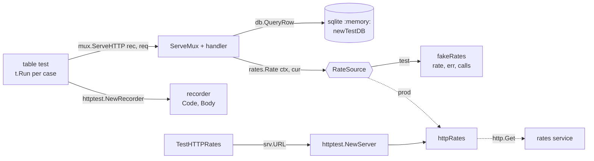

# Day 058 · Go — httptest, table tests for handlers, and interfaces for mocking

**Today's theme:** Testing a service

**After today you can:** You can test an HTTP handler in each language without a network or a real database.

**The interviewer asks it as:** *How do you test code that calls another service?*

---

## 1. What this is, and why it matters

A handler test in Go calls `ServeHTTP` directly, with a request built by `httptest.NewRequest`
and a response captured by `httptest.NewRecorder`, so no port is opened and no network is
touched. The database is a real SQLite in memory, built by a helper that registers its clean-up
with `t.Cleanup`. The other service your code calls sits behind an **interface** you declare,
`RateSource`, and the test hands in a **fake** struct that answers what the test says and records
what it was asked; for the real HTTP implementation of that interface there is
`httptest.NewServer`, a throwaway server on a random loopback port. The cases go in a table and
run under `t.Run`, so one function covers the happy path, the missing row, and the dependency down.

At work this is the bulk of a Go service's tests, and Go teams are strict about it: `go test
./...` must pass offline. In interviews the question is "how do you test code that calls another
service", and in Go the expected answer is one word first, "interface", and then the shape of
today.

## 2. The story

Rehearsal for the school play is on Thursday, and the lead actor has a dentist appointment. Priya,
who is directing, does not cancel. She hands his lines to Sameer from the year below and says: "You
are the king today. When Asha says 'Is the bridge safe?', you say 'It is', and nothing else. When
she asks the second time, you say nothing. Just stand there." Sameer has never read the play. He
does not need to. He has two lines and an instruction.

The point of the rehearsal is not Sameer. It is Asha. Priya wants to know what Asha does when the
king says yes, and what she does when the king says nothing at all. Last week nobody knew, because
the real lead always answered, and always answered well. Nobody had ever seen the scene fail.

Before each run-through, Priya resets the stage. The chairs go back to their marks. The prop
lantern goes back on the table. The bridge, which is a plank between two crates, goes back
across the crates. She does this every time, even if the last run looked fine, because the run
before that had gone wrong for a reason nobody could find, and it turned out the lantern had
been left on the wrong side of the stage by the previous scene. Now every attempt starts from the
same picture.

They run the scene four times. First with Sameer saying "It is": Asha crosses the bridge. Second
with him silent: Asha is meant to turn back, and she does not. She stands there waiting. Everyone
sees it at once. That is the bug they came for. Third, Priya has Sameer say "It is not", and
Asha, unprompted, turns back correctly. Fourth, the plank is removed, and Asha, to her credit,
stops before the crates.

At the end Priya asks Sameer how many times he was asked about the bridge. "Four," he says. She
had counted three. They go back and find the extra one. The dentist appointment, it turns out,
was the most useful thing that happened to the play all term.

## 3. The idea in plain English

The scene is your handler. Asha is the code under test. The real lead is the rates service,
which you cannot make say "nothing" on demand. Sameer is a **fake**: a struct that satisfies the
same interface as the real thing, answers whatever field you set, and appends every question it
gets to a slice so the test can count. There is no library for this in Go; you write the struct,
and it is usually ten lines.

The instruction "you are the king today" is the **interface**. On
[day 16](../day-016-2d-arrays/README.md) you learned that a Go interface is satisfied implicitly:
anything with a `Rate(ctx, currency) (float64, error)` method is a `RateSource`. The handler is
built with `newMux(db, rates RateSource)`, so production passes the real HTTP-backed struct and
the test passes Sameer. The handler cannot tell.

Resetting the stage is `newTestDB(t)`: a helper that opens `sqlite` at `:memory:`, creates the
table, inserts one row, and calls `t.Cleanup` to close it when the test ends. Every subtest calls
it, so every subtest starts from the same picture.

The four run-throughs are a **table test**: a slice of cases, each with a name, a path, a fake,
and the expected status and body, run in a loop under `t.Run(tc.name, ...)`. One failure names
its case; the others still run.

The audience is `httptest.NewRecorder()`, a `ResponseWriter` that keeps the status and body in
memory. You call `mux.ServeHTTP(rec, req)` yourself; no `ListenAndServe`, no port. And for the
one piece that really speaks HTTP, the real `httpRates`, `httptest.NewServer` gives you a
server on a random loopback port for the length of one test.

## 4. The picture



Notice that the handler tests never reach `httpRates` at all; the interface cuts them off. The
real implementation gets its own test, against a throwaway server, so both halves are covered
without either touching the network.

## 5. The code, built step by step

The module and its two dependencies:

```bash
go mod init pricer
go get modernc.org/sqlite
```

The service under test, in `main.go`. First the seam: the interface, and the real implementation
that calls the rates service over HTTP.

```go
type RateSource interface {
	Rate(ctx context.Context, currency string) (float64, error)
}

type httpRates struct {
	client *http.Client
	base   string
}
```

`base` is the URL to call. In production it is the real service; in the test it will be a
`httptest.NewServer`'s address. Making it a field is what makes the real implementation testable.

```go
func (h httpRates) Rate(ctx context.Context, currency string) (float64, error) {
	req, err := http.NewRequestWithContext(ctx, http.MethodGet, h.base+"/v1/rate?to="+currency, nil)
	if err != nil {
		return 0, err
	}
	resp, err := h.client.Do(req)
	if err != nil {
		return 0, err
	}
	defer resp.Body.Close()
	if resp.StatusCode != http.StatusOK {
		return 0, fmt.Errorf("rates: status %d", resp.StatusCode)
	}
	var body struct{ Rate float64 `json:"rate"` }
	return body.Rate, json.NewDecoder(resp.Body).Decode(&body)
}
```

Then the handler, built by a function that takes both dependencies. The response is a struct so
the JSON keys come out in a fixed order.

```go
type priceResponse struct {
	SKU      string  `json:"sku"`
	Currency string  `json:"currency"`
	Price    float64 `json:"price"`
}

func newMux(db *sql.DB, rates RateSource) *http.ServeMux {
	mux := http.NewServeMux()
	mux.HandleFunc("GET /price/{sku}", func(w http.ResponseWriter, r *http.Request) {
		priceHandler(w, r, db, rates)
	})
	return mux
}
```

The handler body. A missing row is 404, a failing rate source is 502, and the price is rounded
to two places.

```go
func priceHandler(w http.ResponseWriter, r *http.Request, db *sql.DB, rates RateSource) {
	sku := r.PathValue("sku")
	currency := r.URL.Query().Get("currency")
	if currency == "" {
		currency = "INR"
	}
	var priceINR float64
	err := db.QueryRowContext(r.Context(), "SELECT price_inr FROM items WHERE sku = ?", sku).Scan(&priceINR)
	if errors.Is(err, sql.ErrNoRows) {
		writeError(w, http.StatusNotFound, "not_found")
		return
	}
```

The rest of it: the rate, the arithmetic, the encode.

```go
	rate := 1.0
	if currency != "INR" {
		rate, err = rates.Rate(r.Context(), currency)
		if err != nil {
			writeError(w, http.StatusBadGateway, "rates_unavailable")
			return
		}
	}
	w.Header().Set("Content-Type", "application/json")
	json.NewEncoder(w).Encode(priceResponse{sku, currency, math.Round(priceINR*rate*100) / 100})
}
```

Now the tests, in `main_test.go`. Sameer first: a fake that satisfies `RateSource`.

```go
type fakeRates struct {
	rate  float64
	err   error
	calls []string
}

func (f *fakeRates) Rate(_ context.Context, currency string) (float64, error) {
	f.calls = append(f.calls, currency)
	return f.rate, f.err
}
```

Three fields: what to answer, whether to fail instead, and a record of every question. That is
the whole mock library.

The stage reset. `t.Helper()` makes failures point at the caller; `t.Cleanup` closes the
database when the test ends, whether it passed or not.

```go
func newTestDB(t *testing.T) *sql.DB {
	t.Helper()
	db, err := sql.Open("sqlite", ":memory:")
	if err != nil {
		t.Fatal(err)
	}
	db.SetMaxOpenConns(1)
	t.Cleanup(func() { db.Close() })
	for _, stmt := range []string{
		"CREATE TABLE items (sku TEXT PRIMARY KEY, price_inr REAL)",
		"INSERT INTO items VALUES ('pen', 20.0)",
	} {
		if _, err := db.Exec(stmt); err != nil {
			t.Fatal(err)
		}
	}
	return db
}
```

`SetMaxOpenConns(1)` is not optional, and §7 shows what happens without it.

The table. Each case is one run-through: a name, the request path, the fake to hand in, and what
the recorder should hold afterwards.

```go
func TestPriceHandler(t *testing.T) {
	cases := []struct {
		name       string
		path       string
		rates      *fakeRates
		wantStatus int
		wantBody   string
		wantCalls  []string
	}{
		{"inr", "/price/pen", &fakeRates{}, 200, `{"sku":"pen","currency":"INR","price":20}`, nil},
		{"usd", "/price/pen?currency=USD", &fakeRates{rate: 0.012}, 200, `{"sku":"pen","currency":"USD","price":0.24}`, []string{"USD"}},
		{"missing", "/price/nope", &fakeRates{}, 404, `{"error":"not_found"}`, nil},
		{"rates down", "/price/pen?currency=USD", &fakeRates{err: errors.New("boom")}, 502, `{"error":"rates_unavailable"}`, []string{"USD"}},
	}
```

The loop. `httptest.NewRequest` builds a request with no network; `httptest.NewRecorder` is the
`ResponseWriter`; `ServeHTTP` runs the mux exactly as the real server would.

```go
	for _, tc := range cases {
		t.Run(tc.name, func(t *testing.T) {
			mux := newMux(newTestDB(t), tc.rates)
			rec := httptest.NewRecorder()
			mux.ServeHTTP(rec, httptest.NewRequest(http.MethodGet, tc.path, nil))
			if rec.Code != tc.wantStatus {
				t.Fatalf("status: got %d, want %d", rec.Code, tc.wantStatus)
			}
			if got := strings.TrimSpace(rec.Body.String()); got != tc.wantBody {
				t.Errorf("body: got %s, want %s", got, tc.wantBody)
			}
			if !reflect.DeepEqual(tc.rates.calls, tc.wantCalls) {
				t.Errorf("rate calls: got %v, want %v", tc.rates.calls, tc.wantCalls)
			}
		})
	}
}
```

The `calls` check is Priya asking Sameer how many times he was asked. The `inr` case asserts
`nil`: the handler must not call out when no conversion is needed.

Finally the real `httpRates`, against a throwaway server. `httptest.NewServer` picks a free
loopback port, and `srv.URL` is its address; `srv.Client()` is a client already pointed at it.

```go
func TestHTTPRates(t *testing.T) {
	srv := httptest.NewServer(http.HandlerFunc(func(w http.ResponseWriter, r *http.Request) {
		if got := r.URL.Query().Get("to"); got != "USD" {
			t.Errorf("to: got %q, want USD", got)
		}
		fmt.Fprint(w, `{"rate":0.012}`)
	}))
	defer srv.Close()
	got, err := httpRates{client: srv.Client(), base: srv.URL}.Rate(context.Background(), "USD")
	if err != nil || got != 0.012 {
		t.Fatalf("got %v, %v; want 0.012, nil", got, err)
	}
}
```

Run them:

```bash
go test -v ./...
```

```text
=== RUN   TestPriceHandler
=== RUN   TestPriceHandler/inr
=== RUN   TestPriceHandler/usd
=== RUN   TestPriceHandler/missing
=== RUN   TestPriceHandler/rates_down
--- PASS: TestPriceHandler (0.01s)
    --- PASS: TestPriceHandler/inr (0.00s)
    --- PASS: TestPriceHandler/usd (0.00s)
    --- PASS: TestPriceHandler/missing (0.00s)
    --- PASS: TestPriceHandler/rates_down (0.00s)
=== RUN   TestHTTPRates
--- PASS: TestHTTPRates (0.00s)
PASS
ok  	pricer	0.052s
```

Here is the complete test file, `main_test.go`:

```go
package main

import (
	"context"
	"database/sql"
	"errors"
	"fmt"
	"net/http"
	"net/http/httptest"
	"reflect"
	"strings"
	"testing"

	_ "modernc.org/sqlite"
)

type fakeRates struct {
	rate  float64
	err   error
	calls []string
}

func (f *fakeRates) Rate(_ context.Context, currency string) (float64, error) {
	f.calls = append(f.calls, currency)
	return f.rate, f.err
}

func newTestDB(t *testing.T) *sql.DB {
	t.Helper()
	db, err := sql.Open("sqlite", ":memory:")
	if err != nil {
		t.Fatal(err)
	}
	db.SetMaxOpenConns(1)
	t.Cleanup(func() { db.Close() })
	for _, stmt := range []string{
		"CREATE TABLE items (sku TEXT PRIMARY KEY, price_inr REAL)",
		"INSERT INTO items VALUES ('pen', 20.0)",
	} {
		if _, err := db.Exec(stmt); err != nil {
			t.Fatal(err)
		}
	}
	return db
}

func TestPriceHandler(t *testing.T) {
	cases := []struct {
		name       string
		path       string
		rates      *fakeRates
		wantStatus int
		wantBody   string
		wantCalls  []string
	}{
		{"inr", "/price/pen", &fakeRates{}, 200, `{"sku":"pen","currency":"INR","price":20}`, nil},
		{"usd", "/price/pen?currency=USD", &fakeRates{rate: 0.012}, 200, `{"sku":"pen","currency":"USD","price":0.24}`, []string{"USD"}},
		{"missing", "/price/nope", &fakeRates{}, 404, `{"error":"not_found"}`, nil},
		{"rates down", "/price/pen?currency=USD", &fakeRates{err: errors.New("boom")}, 502, `{"error":"rates_unavailable"}`, []string{"USD"}},
	}
	for _, tc := range cases {
		t.Run(tc.name, func(t *testing.T) {
			mux := newMux(newTestDB(t), tc.rates)
			rec := httptest.NewRecorder()
			mux.ServeHTTP(rec, httptest.NewRequest(http.MethodGet, tc.path, nil))
			if rec.Code != tc.wantStatus {
				t.Fatalf("status: got %d, want %d", rec.Code, tc.wantStatus)
			}
			if got := strings.TrimSpace(rec.Body.String()); got != tc.wantBody {
				t.Errorf("body: got %s, want %s", got, tc.wantBody)
			}
			if !reflect.DeepEqual(tc.rates.calls, tc.wantCalls) {
				t.Errorf("rate calls: got %v, want %v", tc.rates.calls, tc.wantCalls)
			}
		})
	}
}

func TestHTTPRates(t *testing.T) {
	srv := httptest.NewServer(http.HandlerFunc(func(w http.ResponseWriter, r *http.Request) {
		if got := r.URL.Query().Get("to"); got != "USD" {
			t.Errorf("to: got %q, want USD", got)
		}
		fmt.Fprint(w, `{"rate":0.012}`)
	}))
	defer srv.Close()
	got, err := httpRates{client: srv.Client(), base: srv.URL}.Rate(context.Background(), "USD")
	if err != nil || got != 0.012 {
		t.Fatalf("got %v, %v; want 0.012, nil", got, err)
	}
}
```

And `main.go`, so the package compiles and runs:

```go
package main

import (
	"context"
	"database/sql"
	"encoding/json"
	"errors"
	"fmt"
	"log"
	"math"
	"net/http"

	_ "modernc.org/sqlite"
)

type RateSource interface {
	Rate(ctx context.Context, currency string) (float64, error)
}

type httpRates struct {
	client *http.Client
	base   string
}

func (h httpRates) Rate(ctx context.Context, currency string) (float64, error) {
	req, err := http.NewRequestWithContext(ctx, http.MethodGet, h.base+"/v1/rate?to="+currency, nil)
	if err != nil {
		return 0, err
	}
	resp, err := h.client.Do(req)
	if err != nil {
		return 0, err
	}
	defer resp.Body.Close()
	if resp.StatusCode != http.StatusOK {
		return 0, fmt.Errorf("rates: status %d", resp.StatusCode)
	}
	var body struct {
		Rate float64 `json:"rate"`
	}
	return body.Rate, json.NewDecoder(resp.Body).Decode(&body)
}

type priceResponse struct {
	SKU      string  `json:"sku"`
	Currency string  `json:"currency"`
	Price    float64 `json:"price"`
}

func writeError(w http.ResponseWriter, status int, code string) {
	w.Header().Set("Content-Type", "application/json")
	w.WriteHeader(status)
	json.NewEncoder(w).Encode(map[string]string{"error": code})
}

func priceHandler(w http.ResponseWriter, r *http.Request, db *sql.DB, rates RateSource) {
	sku := r.PathValue("sku")
	currency := r.URL.Query().Get("currency")
	if currency == "" {
		currency = "INR"
	}
	var priceINR float64
	err := db.QueryRowContext(r.Context(), "SELECT price_inr FROM items WHERE sku = ?", sku).Scan(&priceINR)
	if errors.Is(err, sql.ErrNoRows) {
		writeError(w, http.StatusNotFound, "not_found")
		return
	}
	if err != nil {
		writeError(w, http.StatusInternalServerError, "db_error")
		return
	}
	rate := 1.0
	if currency != "INR" {
		rate, err = rates.Rate(r.Context(), currency)
		if err != nil {
			writeError(w, http.StatusBadGateway, "rates_unavailable")
			return
		}
	}
	w.Header().Set("Content-Type", "application/json")
	json.NewEncoder(w).Encode(priceResponse{sku, currency, math.Round(priceINR*rate*100) / 100})
}

func newMux(db *sql.DB, rates RateSource) *http.ServeMux {
	mux := http.NewServeMux()
	mux.HandleFunc("GET /price/{sku}", func(w http.ResponseWriter, r *http.Request) {
		priceHandler(w, r, db, rates)
	})
	return mux
}

func main() {
	db, err := sql.Open("sqlite", "shop.db")
	if err != nil {
		log.Fatal(err)
	}
	rates := httpRates{client: &http.Client{}, base: "https://rates.example"}
	log.Fatal(http.ListenAndServe("127.0.0.1:8000", newMux(db, rates)))
}
```

## 6. How the other two languages do it

**Python**

```python
app.dependency_overrides[get_conn] = lambda: conn          # swap the database
route = respx.get(RATES_URL).mock(return_value=httpx.Response(200, json={"rate": 0.012}))
response = TestClient(app).get("/price/pen", params={"currency": "USD"})
assert route.calls.last.request.url.params["to"] == "USD"
```

Python needs no interface. respx patches `httpx` from the outside, and `dependency_overrides`
swaps a function by identity, so code that never planned to be tested still can be.

**C++**

```cpp
class MockRates : public RateSource {
public:
    MOCK_METHOD(double, rate, (const std::string& currency), (override));
};
EXPECT_CALL(rates, rate("USD")).WillOnce(::testing::Return(0.012));
```

Same seam as Go, an abstract base class instead of an interface, but gMock writes the fake for
you and lets you state expectations, including "called exactly once with `USD`", up front.

**The difference that matters:** Go's fake is a struct you write by hand, and its interface is
satisfied implicitly, so the production type never mentions the test. That is cheap, but it
means the seam has to be there in the design: a handler that calls `http.Get` directly, or opens
its own `sql.Open`, cannot be tested this way, and there is no respx to rescue it. In Go, testable
and injected are the same word.

## 7. The traps

**The near-miss: `:memory:` without `SetMaxOpenConns(1)`.** Every open connection in
`database/sql`'s pool to `:memory:` is a separate, empty database. The `CREATE TABLE` runs on one
connection, the handler's `QueryRow` may get another, and:

```text
--- FAIL: TestPriceHandler/inr (0.00s)
    main_test.go:58: status: got 500, want 200
```

with `SQL logic error: no such table: items (1)` behind the 500. It is intermittent, because it
depends on which pooled connection you get. One connection, one database.

**Forgetting the blank import.** Without `_ "modernc.org/sqlite"` in the test file's package:

```text
sql: unknown driver "sqlite" (forgotten import?)
```

**Capturing the loop variable in a parallel subtest.** Add `t.Parallel()` inside `t.Run` on Go
1.21 or earlier and every subtest sees the last `tc`. Go 1.22+ gives each iteration its own
variable, so on 1.23 this is safe, but you will meet the old shape in code review; the old fix
was `tc := tc` as the first line of the loop body.

**A fake that ignores its input.** A `Rate` that returns `f.rate` without recording `currency`
lets a handler that calls `rates.Rate(ctx, "INR")` by mistake pass every test. The `calls` slice
and the `wantCalls` column exist to catch exactly that. Assert on what the fake was asked, not
only on what it answered.

**`t.Fatal` inside the server handler of `httptest.NewServer`.** The handler runs on another
goroutine; `t.Fatal` there calls `runtime.Goexit` on the wrong goroutine and the test framework
prints:

```text
testing.go: test executed panic(nil) or runtime.Goexit: subtest may have called FailNow on a parent test
```

Use `t.Errorf` inside handlers, and check the result on the test's own goroutine.

**Comparing bodies with a trailing newline.** `json.NewEncoder(w).Encode` appends `\n`. Compare
against `strings.TrimSpace(rec.Body.String())`, or decode both sides and compare structs, or the
`usd` case fails with a message where both strings look identical.

**Testing through a real port.** If the test calls `http.ListenAndServe` in a goroutine and then
`http.Get("http://127.0.0.1:8000/...")`, it races the server start, collides with anything else
on 8000, and is slower for no extra truth. `ServeHTTP` on a recorder is the same code path minus
the socket.

## 8. Say it out loud

**How it gets asked**

- How do you test code that calls another service?
- How do you test an HTTP handler in Go without starting a server?
- What is `httptest.NewRecorder` versus `httptest.NewServer`?
- How do you mock in Go without a mocking library?

**The ninety-second script**

I put the other service behind an interface, `RateSource` with one method, and build the handler
with that interface as a parameter. In the test I pass a fake: a struct with a `rate` field, an
`err` field, and a `calls` slice that records every currency it was asked for. The handler is
tested with `httptest.NewRequest` and `httptest.NewRecorder`, calling `mux.ServeHTTP` directly,
so no port opens. The database is real SQLite at `:memory:` built by a `newTestDB(t)` helper
with `t.Cleanup` and `SetMaxOpenConns(1)`, because each pooled connection to `:memory:` is a
separate database. The cases are a table, run under `t.Run`: happy path, conversion, missing
row, and rate source failing, and every case asserts on the status, the body, and the fake's
`calls`, so a handler that calls out when it should not is caught. The real HTTP implementation
of `RateSource` gets its own test against `httptest.NewServer`, so both sides of the interface
are covered and neither touches the network.

**The follow-ups**

- **Why not use a mocking library like gomock or mockery?** *For a one-method interface, a
  hand-written fake is shorter and has no generated code. Those tools earn their place when the
  interface has fifteen methods or you need call-order expectations; the pattern is the same,
  a type that satisfies the interface.*
- **What if the handler uses a global `http.DefaultClient`?** *Then it is not testable this way,
  and that is the answer: refactor so the client, or better the whole rate source, is injected.
  `httptest.NewServer` can still test it if the URL is configurable, which is the weaker fix.*
- **How do you test the context being cancelled?** *Build the request with a cancelled context,
  `req = req.WithContext(ctx)` after `cancel()`, and have the fake return `ctx.Err()`. Assert the
  handler returns without writing a 200.*

**A model answer**

"Interface, fake, recorder. `RateSource` is a one-method interface; `newMux(db, rates)` takes it.
The test's `fakeRates` has a rate, an error, and a slice of calls. `newTestDB(t)` opens SQLite at
`:memory:` with one connection and cleans up via `t.Cleanup`. A table of four cases runs under
`t.Run`, each one calling `mux.ServeHTTP` on an `httptest.NewRecorder` with an
`httptest.NewRequest`, and checks status, body, and what the fake was asked. The real `httpRates`
is tested separately against `httptest.NewServer`. `go test ./...` passes with the network off."

## 9. Recall card

- The seam is an interface: `type RateSource interface { Rate(ctx, currency) (float64, error) }`; the handler takes it as a parameter, production passes `httpRates`, the test passes a fake.
- The fake is a struct you write: answer fields plus a `calls []string` that records every question; assert on `calls`, not only on the answer.
- `rec := httptest.NewRecorder(); mux.ServeHTTP(rec, httptest.NewRequest("GET", path, nil))`; then `rec.Code` and `rec.Body`. No port, no goroutine.
- `newTestDB(t)`: `sql.Open("sqlite", ":memory:")`, `SetMaxOpenConns(1)` or each pooled connection is its own empty database, `t.Cleanup(db.Close)`.
- Cases in a table under `t.Run`; the real HTTP implementation gets `httptest.NewServer` with `srv.URL` and `srv.Client()`, and `t.Errorf`, never `t.Fatal`, inside its handler.
