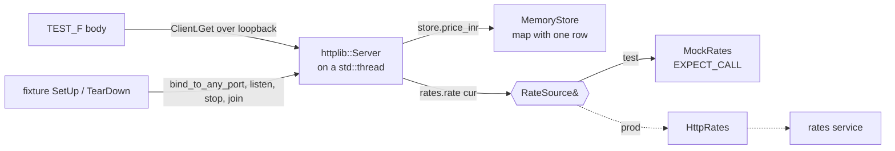

# Day 058 · C++ — GoogleTest with an in-process server, and gMock

**Today's theme:** Testing a service

**After today you can:** You can test an HTTP handler in each language without a network or a real database.

**The interviewer asks it as:** *How do you test code that calls another service?*

---

## 1. What this is, and why it matters

A C++ service test starts the real `httplib::Server` on a background thread inside the test
process, bound to a random loopback port, and calls it with `httplib::Client`, so nothing leaves
the machine and nothing needs to be running first. The database and the other service each sit
behind an **abstract base class** with virtual methods; the test hands in an in-memory store for
one and a **gMock** for the other. gMock generates the stand-in from a `MOCK_METHOD` line, and
`EXPECT_CALL` states what it should answer, how many times it may be asked, and with what. A
GoogleTest **fixture**, `TEST_F`, does the set-up and tear-down so every test gets a fresh server
and a fresh mock.

At work this is how C++ services are tested when a full integration environment is too slow or
too flaky to run on every commit. In interviews, "how do you test code that calls another
service" in C++ is a design question in disguise: the interviewer wants to hear that the
dependency is a virtual interface, because without that there is nothing to mock.

## 2. The story

Rehearsal for the school play is on Thursday, and the lead actor has a dentist appointment. Priya,
who is directing, does not cancel. She hands his lines to Sameer from the year below and says: "You
are the king today. When Asha says 'Is the bridge safe?', you say 'It is', and nothing else. When
she asks the second time, you say nothing. Just stand there." Sameer has never read the play. He
does not need to. He has two lines and an instruction.

The point of the rehearsal is not Sameer. It is Asha. Priya wants to know what Asha does when the
king says yes, and what she does when the king says nothing at all. Last week nobody knew, because
the real lead always answered, and always answered well. Nobody had ever seen the scene fail.

Before each run-through, Priya resets the stage. The chairs go back to their marks. The prop
lantern goes back on the table. The bridge, which is a plank between two crates, goes back
across the crates. She does this every time, even if the last run looked fine, because the run
before that had gone wrong for a reason nobody could find, and it turned out the lantern had
been left on the wrong side of the stage by the previous scene. Now every attempt starts from the
same picture.

They run the scene four times. First with Sameer saying "It is": Asha crosses the bridge. Second
with him silent: Asha is meant to turn back, and she does not. She stands there waiting. Everyone
sees it at once. That is the bug they came for. Third, Priya has Sameer say "It is not", and
Asha, unprompted, turns back correctly. Fourth, the plank is removed, and Asha, to her credit,
stops before the crates.

At the end Priya asks Sameer how many times he was asked about the bridge. "Four," he says. She
had counted three. They go back and find the extra one. The dentist appointment, it turns out,
was the most useful thing that happened to the play all term.

## 3. The idea in plain English

The scene is your route. Asha is the handler under test. The real lead is the rates service.
Sameer is a **mock object**: an instance of a class gMock writes for you, whose `rate` method
does whatever the test says. "When she asks, say 'It is'" is
`EXPECT_CALL(rates, rate("USD")).WillOnce(Return(0.012))`. "Say nothing, just stand there" is
`.WillOnce(Throw(std::runtime_error("rates unreachable")))`. And Priya's count at the end is
built in: if the mock is called more or fewer times than the expectation says, the test fails
when the mock is destroyed.

"You are the king today" is the **abstract base class** from
[day 16](../day-016-2d-arrays/README.md): `struct RateSource { virtual double rate(const
std::string&) = 0; };`. The real implementation calls the rates service over HTTP; `MockRates`
inherits the same base. The handler holds a `RateSource&` and cannot tell which it has. That
reference is the seam, and it must be there in the design.

Resetting the stage is the **fixture**: a class deriving from `::testing::Test` whose `SetUp`
builds a fresh in-memory store, a fresh mock, registers the routes, binds the server to a random
port, and starts it on a thread; `TearDown` stops the server and joins the thread. Every
`TEST_F` gets a new instance of the fixture, so no test can leave the lantern on the wrong side.

There is no in-process client in cpp-httplib, so the audience really does buy a ticket:
`httplib::Client("127.0.0.1", port).Get("/price/pen")` goes over loopback to the thread running
the server. It is still hermetic; loopback never leaves the machine, and the port is whatever
was free.

## 4. The picture



Notice that the server thread is real and the port is real, but both belong to the test process
and die with it. The seam is the reference `RateSource&`; everything to its right is what the
fixture chose.

## 5. The code, built step by step

`CMakeLists.txt` fetches the three libraries: cpp-httplib, nlohmann json, and GoogleTest, which
ships gMock.

```cmake
cmake_minimum_required(VERSION 3.20)
project(pricer CXX)
set(CMAKE_CXX_STANDARD 20)
include(FetchContent)
FetchContent_Declare(httplib GIT_REPOSITORY https://github.com/yhirose/cpp-httplib GIT_TAG v0.18.3)
FetchContent_Declare(json GIT_REPOSITORY https://github.com/nlohmann/json GIT_TAG v3.11.3)
FetchContent_Declare(googletest GIT_REPOSITORY https://github.com/google/googletest GIT_TAG v1.15.2)
FetchContent_MakeAvailable(httplib json googletest)
add_executable(pricer_test pricer_test.cpp)
target_link_libraries(pricer_test PRIVATE httplib::httplib nlohmann_json::nlohmann_json GTest::gmock_main)
```

`GTest::gmock_main` links a `main` that runs every registered test, so the test file needs none.

The service under test, in `pricer.hpp`. The two seams first.

```cpp
struct RateSource {
    virtual ~RateSource() = default;
    virtual double rate(const std::string& currency) = 0;
};

struct Store {
    virtual ~Store() = default;
    virtual std::optional<double> price_inr(const std::string& sku) = 0;
};
```

Pure virtual, virtual destructor. Anything that inherits and implements these can be handed to
the routes.

The routes. The handler takes both by reference and catches a throw from the rate source,
turning it into a 502.

```cpp
inline void register_routes(httplib::Server& svr, Store& store, RateSource& rates) {
    svr.Get("/price/:sku", [&](const httplib::Request& req, httplib::Response& res) {
        const std::string sku = req.path_params.at("sku");
        const std::string currency = req.has_param("currency") ? req.get_param_value("currency") : "INR";
        const auto price = store.price_inr(sku);
        if (!price) {
            res.status = 404;
            res.set_content(nlohmann::json{{"error", "not_found"}}.dump(), "application/json");
            return;
        }
```

And the second half of the handler.

```cpp
        double rate = 1.0;
        if (currency != "INR") {
            try {
                rate = rates.rate(currency);
            } catch (const std::exception&) {
                res.status = 502;
                res.set_content(nlohmann::json{{"error", "rates_unavailable"}}.dump(), "application/json");
                return;
            }
        }
        const double value = std::round(*price * rate * 100.0) / 100.0;
        res.set_content(nlohmann::json{{"sku", sku}, {"currency", currency}, {"price", value}}.dump(),
                        "application/json");
    });
}
```

Now `pricer_test.cpp`. Sameer, in one macro:

```cpp
class MockRates : public RateSource {
public:
    MOCK_METHOD(double, rate, (const std::string& currency), (override));
};
```

`MOCK_METHOD(return type, name, (argument types), (qualifiers))`. gMock writes a `rate` that
consults whatever `EXPECT_CALL`s the test has set. `override` makes the compiler check that the
signature really matches the base.

The store, hand-written because it is one map:

```cpp
class MemoryStore : public Store {
    std::map<std::string, double> items{{"pen", 20.0}};
public:
    std::optional<double> price_inr(const std::string& sku) override {
        if (auto it = items.find(sku); it != items.end()) return it->second;
        return std::nullopt;
    }
};
```

The fixture. `SetUp` wires everything and starts the server; `TearDown` stops it. Each `TEST_F`
below gets its own instance, so its own server, store, and mock.

```cpp
class PricerTest : public ::testing::Test {
protected:
    httplib::Server svr;
    MemoryStore store;
    MockRates rates;
    std::thread server_thread;
    int port = 0;

    void SetUp() override {
        register_routes(svr, store, rates);
        port = svr.bind_to_any_port("127.0.0.1");
        server_thread = std::thread([this] { svr.listen_after_bind(); });
        svr.wait_until_ready();
    }
    void TearDown() override {
        svr.stop();
        server_thread.join();
    }
    httplib::Client client() { return httplib::Client("127.0.0.1", port); }
};
```

`bind_to_any_port` asks the operating system for a free port and returns it; `listen_after_bind`
serves on it, on the thread; `wait_until_ready` blocks until the accept loop is up, so the first
request cannot race the start.

The happy path. No expectation on the mock beyond "do not call me": `Times(0)`.

```cpp
TEST_F(PricerTest, PriceInInr) {
    EXPECT_CALL(rates, rate(::testing::_)).Times(0);
    auto res = client().Get("/price/pen");
    ASSERT_TRUE(res);
    EXPECT_EQ(res->status, 200);
    EXPECT_EQ(res->body, R"({"currency":"INR","price":20.0,"sku":"pen"})");
}
```

`ASSERT_TRUE(res)` is the fatal check from [day 28](../day-028-opposite-ends/README.md): if the
request itself failed, there is no `res->status` to look at. nlohmann's `dump` sorts keys, hence
the order.

The conversion. The mock must be asked exactly once, with `"USD"`, and answers `0.012`.

```cpp
TEST_F(PricerTest, PriceInUsd) {
    EXPECT_CALL(rates, rate("USD")).WillOnce(::testing::Return(0.012));
    auto res = client().Get("/price/pen?currency=USD");
    ASSERT_TRUE(res);
    EXPECT_EQ(res->status, 200);
    EXPECT_EQ(res->body, R"({"currency":"USD","price":0.24,"sku":"pen"})");
}
```

`WillOnce` implies `Times(1)`. If the handler asked twice, or asked for `"EUR"`, the test fails
with gMock's own message naming the unexpected call.

The missing item, and the dependency down. `Throw` makes the mock throw when called.

```cpp
TEST_F(PricerTest, MissingSku) {
    auto res = client().Get("/price/nope");
    ASSERT_TRUE(res);
    EXPECT_EQ(res->status, 404);
}

TEST_F(PricerTest, RatesDown) {
    EXPECT_CALL(rates, rate("USD")).WillOnce(::testing::Throw(std::runtime_error("rates unreachable")));
    auto res = client().Get("/price/pen?currency=USD");
    ASSERT_TRUE(res);
    EXPECT_EQ(res->status, 502);
    EXPECT_EQ(res->body, R"({"error":"rates_unavailable"})");
}
```

Build and run:

```bash
cmake -S . -B build -DCMAKE_BUILD_TYPE=Debug
cmake --build build
./build/pricer_test
```

```text
[==========] Running 4 tests from 1 test suite.
[----------] Global test environment set-up.
[----------] 4 tests from PricerTest
[ RUN      ] PricerTest.PriceInInr
[       OK ] PricerTest.PriceInInr (3 ms)
[ RUN      ] PricerTest.PriceInUsd
[       OK ] PricerTest.PriceInUsd (2 ms)
[ RUN      ] PricerTest.MissingSku
[       OK ] PricerTest.MissingSku (2 ms)
[ RUN      ] PricerTest.RatesDown
[       OK ] PricerTest.RatesDown (2 ms)
[----------] 4 tests from PricerTest (11 ms total)

[----------] Global test environment tear-down
[==========] 4 tests from 1 test suite ran. (11 ms total)
[  PASSED  ] 4 tests.
```

Four servers started and stopped, four ports borrowed and returned, eleven milliseconds. Here is
the complete test file, `pricer_test.cpp`:

```cpp
#include <gmock/gmock.h>
#include <gtest/gtest.h>
#include <httplib.h>

#include <map>
#include <optional>
#include <stdexcept>
#include <string>
#include <thread>

#include "pricer.hpp"

class MockRates : public RateSource {
public:
    MOCK_METHOD(double, rate, (const std::string& currency), (override));
};

class MemoryStore : public Store {
    std::map<std::string, double> items{{"pen", 20.0}};

public:
    std::optional<double> price_inr(const std::string& sku) override {
        if (auto it = items.find(sku); it != items.end()) return it->second;
        return std::nullopt;
    }
};

class PricerTest : public ::testing::Test {
protected:
    httplib::Server svr;
    MemoryStore store;
    MockRates rates;
    std::thread server_thread;
    int port = 0;

    void SetUp() override {
        register_routes(svr, store, rates);
        port = svr.bind_to_any_port("127.0.0.1");
        server_thread = std::thread([this] { svr.listen_after_bind(); });
        svr.wait_until_ready();
    }
    void TearDown() override {
        svr.stop();
        server_thread.join();
    }
    httplib::Client client() { return httplib::Client("127.0.0.1", port); }
};

TEST_F(PricerTest, PriceInInr) {
    EXPECT_CALL(rates, rate(::testing::_)).Times(0);
    auto res = client().Get("/price/pen");
    ASSERT_TRUE(res);
    EXPECT_EQ(res->status, 200);
    EXPECT_EQ(res->body, R"({"currency":"INR","price":20.0,"sku":"pen"})");
}

TEST_F(PricerTest, PriceInUsd) {
    EXPECT_CALL(rates, rate("USD")).WillOnce(::testing::Return(0.012));
    auto res = client().Get("/price/pen?currency=USD");
    ASSERT_TRUE(res);
    EXPECT_EQ(res->status, 200);
    EXPECT_EQ(res->body, R"({"currency":"USD","price":0.24,"sku":"pen"})");
}

TEST_F(PricerTest, MissingSku) {
    auto res = client().Get("/price/nope");
    ASSERT_TRUE(res);
    EXPECT_EQ(res->status, 404);
}

TEST_F(PricerTest, RatesDown) {
    EXPECT_CALL(rates, rate("USD")).WillOnce(::testing::Throw(std::runtime_error("rates unreachable")));
    auto res = client().Get("/price/pen?currency=USD");
    ASSERT_TRUE(res);
    EXPECT_EQ(res->status, 502);
    EXPECT_EQ(res->body, R"({"error":"rates_unavailable"})");
}
```

And `pricer.hpp`, the code under test:

```cpp
#pragma once
#include <httplib.h>
#include <nlohmann/json.hpp>

#include <cmath>
#include <optional>
#include <string>

struct RateSource {
    virtual ~RateSource() = default;
    virtual double rate(const std::string& currency) = 0;
};

struct Store {
    virtual ~Store() = default;
    virtual std::optional<double> price_inr(const std::string& sku) = 0;
};

inline void register_routes(httplib::Server& svr, Store& store, RateSource& rates) {
    svr.Get("/price/:sku", [&](const httplib::Request& req, httplib::Response& res) {
        const std::string sku = req.path_params.at("sku");
        const std::string currency =
            req.has_param("currency") ? req.get_param_value("currency") : "INR";
        const auto price = store.price_inr(sku);
        if (!price) {
            res.status = 404;
            res.set_content(nlohmann::json{{"error", "not_found"}}.dump(), "application/json");
            return;
        }
        double rate = 1.0;
        if (currency != "INR") {
            try {
                rate = rates.rate(currency);
            } catch (const std::exception&) {
                res.status = 502;
                res.set_content(nlohmann::json{{"error", "rates_unavailable"}}.dump(),
                                "application/json");
                return;
            }
        }
        const double value = std::round(*price * rate * 100.0) / 100.0;
        res.set_content(
            nlohmann::json{{"sku", sku}, {"currency", currency}, {"price", value}}.dump(),
            "application/json");
    });
}
```

## 6. How the other two languages do it

**Python**

```python
app.dependency_overrides[get_conn] = lambda: conn
route = respx.get(RATES_URL).mock(return_value=httpx.Response(200, json={"rate": 0.012}))
response = TestClient(app).get("/price/pen", params={"currency": "USD"})
assert route.called
```

No abstract class, no thread, no port. respx patches `httpx` itself and `TestClient` calls the app
in-process, so a route that was never designed for testing can still be tested.

**Go**

```go
type fakeRates struct{ rate float64; err error; calls []string }
func (f *fakeRates) Rate(_ context.Context, c string) (float64, error) {
	f.calls = append(f.calls, c); return f.rate, f.err
}
rec := httptest.NewRecorder()
mux.ServeHTTP(rec, httptest.NewRequest("GET", "/price/pen?currency=USD", nil))
```

Same seam as C++, an interface instead of a base class, but the fake is hand-written and the
handler is called directly on a recorder, with no thread or port.

**The difference that matters:** C++ is the only one of the three where the test cannot avoid the
real server. cpp-httplib has no recorder and no in-process client, so the fixture must bind a
port, start a thread, wait for readiness, and join on tear-down, and every one of those four
steps is a place a test can hang or race. gMock repays some of that cost with expectations that
Python and Go make you write by hand: `Times(0)` and `WillOnce` check the count and the argument
without a `calls` slice.

## 7. The traps

**The near-miss: forgetting `wait_until_ready`.** Start the thread and send the request at once,
and on a fast machine it passes, on a loaded one:

```text
pricer_test.cpp:52: Failure
Value of: res
  Actual: false
Expected: true
```

`res` is empty because the client connected before the accept loop was up. The failure is
intermittent, which is the worst kind. `wait_until_ready()` after starting the thread, always.

**Forgetting to `stop` and `join`.** Leave `TearDown` empty and the first test passes, then:

```text
terminate called without an active exception
```

The `std::thread` member is destroyed while still joinable, which is a hard abort, exactly as on
[day 31](../day-031-fixed-window/README.md). `stop()` makes `listen_after_bind` return; `join()`
then completes.

**An expectation the code does not meet.** Write `WillOnce(Return(0.012))` and have the handler
ask for the rate twice, and gMock reports it at the call site, then again when the mock is
destroyed:

```text
pricer_test.cpp:62: Failure
Mock function called more times than expected - returning default value.
    Function call: rate(@0x7ffd5c3e1a30 "USD")
          Returns: 0
         Expected: to be called once
           Actual: called twice - over-saturated and active
```

Read the last two lines; they are the whole story.

**Mocking a non-virtual method.** Remove `virtual` from `RateSource::rate` and `MOCK_METHOD`
with `(override)` refuses to compile:

```text
error: 'double MockRates::rate(const std::string&)' marked 'override', but does not override
```

Without `override` it compiles and silently mocks nothing: the handler, holding a `RateSource&`,
calls the base's `rate`, not the mock's. Keep `override` on every `MOCK_METHOD`.

**Sharing the server between tests.** Tempting, to save the start-stop cost: make `svr` static.
Then one test's leftover `EXPECT_CALL` state, or a route registered twice, bleeds into the next.
The fixture is per-test on purpose. Eleven milliseconds for four is not the bottleneck.

**Asserting with `EXPECT_EQ(res->status, 200)` before `ASSERT_TRUE(res)`.** `res->` on an empty
`Result` is undefined behaviour; you get a crash instead of a failure message. The fatal assert
first, always.

## 8. Say it out loud

**How it gets asked**

- How do you test code that calls another service?
- How do you mock in C++?
- What does a GoogleTest fixture do, and when does `SetUp` run?
- How would you test an HTTP handler without deploying it?

**The ninety-second script**

The dependency has to be a virtual interface, or there is nothing to mock, so I declare
`RateSource` with a pure virtual `rate`, and the handler holds a `RateSource&`. gMock writes the
stand-in from one `MOCK_METHOD` line, and `EXPECT_CALL(rates, rate("USD")).WillOnce(Return(0.012))`
sets both the answer and the expectation that it is asked exactly once with `USD`; `Times(0)`
on the rupee path proves the handler does not call out when it need not, and `WillOnce(Throw(...))`
is the dependency-down case, which the handler must turn into a 502. The store is the same
pattern with an in-memory map. cpp-httplib has no in-process client, so a `TEST_F` fixture binds
the real server to any free loopback port, runs it on a `std::thread`, waits until ready, and
stops and joins in `TearDown`; each test gets a fresh fixture. Four tests: rupee, conversion,
missing item, rates down, checking status and body, with the call counts checked by gMock when
the mock is destroyed.

**The follow-ups**

- **Why not a real Postgres in the tests?** *For the handler tests, an in-memory `Store` is
  enough and instant. The real `PgStore` gets its own test against a throwaway database, the same
  split as the mock rates versus the real HTTP rate source; each side of the interface is tested,
  neither test needs the other's dependency.*
- **What is the difference between a mock and a fake here?** *`MemoryStore` is a fake: a working
  implementation, simplified. `MockRates` is a mock: it has no behaviour of its own, only what
  `EXPECT_CALL` gives it, and it verifies how it was used. Fakes for things with simple real
  behaviour, mocks for things whose calls you need to assert on.*
- **How do you test that the handler passes the right currency through?** *That is the
  `rate("USD")` matcher: if the handler called `rate("usd")` or `rate("INR")`, gMock reports an
  unexpected call with the actual argument.*

**A model answer**

"Two abstract base classes, `Store` and `RateSource`, and the routes take both by reference.
The test's fixture builds a `MemoryStore` with one row and a `MockRates` from `MOCK_METHOD`,
registers the routes, binds the server to any free loopback port, starts it on a thread, and
waits until ready; `TearDown` stops and joins. Four `TEST_F`s: rupees with `Times(0)` on the
mock, dollars with `WillOnce(Return(0.012))` and the exact body, a missing SKU for the 404, and
`WillOnce(Throw(...))` for the 502. gMock checks the call counts at destruction. No network,
no database process, eleven milliseconds."

## 9. Recall card

- The seam is a pure virtual base: `struct RateSource { virtual double rate(const std::string&) = 0; };` and the handler holds a `RateSource&`. No virtual, no mock.
- `class MockRates : public RateSource { MOCK_METHOD(double, rate, (const std::string&), (override)); };` — keep `override`, or a non-virtual base compiles and mocks nothing.
- `EXPECT_CALL(rates, rate("USD")).WillOnce(::testing::Return(0.012))`; `Times(0)` for "must not be asked"; `WillOnce(::testing::Throw(...))` for the dependency down. Counts are checked when the mock is destroyed.
- Fixture: `SetUp` registers routes, `port = svr.bind_to_any_port("127.0.0.1")`, thread runs `listen_after_bind()`, then `wait_until_ready()`; `TearDown` is `stop()` then `join()`.
- `ASSERT_TRUE(res)` before any `res->`; compare `res->status` and `res->body`; nlohmann `dump()` sorts keys.
