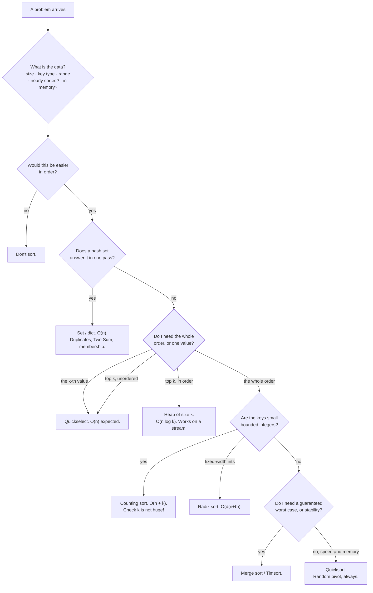

# Day 059 · DSA — Sorting revision and mock round

**After today you can:** You can solve two unseen sorting problems and defend your algorithm choice.

**The interviewer asks it as:** *Two problems, no hints, talk as you go.*

---

## 1. What this is, and why they ask it

This closes the sorting phase. Over eight days you have met the three quadratic sorts, merge sort,
quicksort, quickselect, the three non-comparison sorts, stability, and key functions. Today is not
new material. It is the day you find out whether you can *reach* any of it while somebody is watching
and the clock is running, which is a different skill and the only one that gets tested.

They ask it as an unseen problem with no hints because that is what the coding round actually is. You
will not be asked "implement merge sort" as often as you will be asked something that turns out to
need a sort, and the marks come from three things nobody practises: saying the decision out loud
before coding, choosing the right algorithm and being able to defend it in arithmetic, and continuing
to talk when you are stuck. The material you already have. What this day adds is the performance —
the same distinction as knowing a piece of music and being able to play it through in front of
someone without stopping.

---

## 2. The story

Anjali has been learning the keyboard for four years, and by the third year she could play the piece
her teacher had set for the December programme completely, from beginning to end, without a mistake.
She knew it. That was not in question.

Her teacher, Mrs Pinto, made her play it in the front room one Saturday with three people sitting
there — Mrs Pinto's husband, a neighbour, and a girl from the next batch who had come early.

Twenty seconds in, Anjali played a wrong note. And she did what she had done a thousand times in her
own room: she stopped, made a small annoyed sound, and started again from the beginning.

Mrs Pinto let her get to about the same place and then stopped her and said, do it again, and this
time whatever happens, do not stop.

She played it again and hit the same wrong note in the same place, and she carried on, and it was
horrible for about two seconds and then it was fine. The people in the room could not really tell.
The neighbour said afterwards that it was lovely and clearly meant it.

That was the lesson, and Anjali still describes it as the day she found out she had been practising
the wrong thing. Four years of playing alone in her room had taught her the notes perfectly and had
also taught her, without anybody intending it, that a mistake means going back to the start. In her
room that costs nothing. On a stage, in front of people, it is the only thing that actually goes
wrong.

So for the six weeks before December they changed what practice meant. Twice a week she played the
whole thing through, once, with somebody in the room, and she was not allowed to stop for any reason.
Her mother sat there some days. Once it was just her little brother, who was not listening.

She still made mistakes in December. Two that she can name. Nobody else noticed either of them,
because she did not stop, and because she had made her peace with the fact that she was going to make
some.

---

## 3. The idea in plain English

Anjali knew the piece. What she had not practised was playing it in front of somebody without
stopping, and that turned out to be the thing the performance actually tested.

A coding round is the same. You know merge sort. What you have not practised is deciding out loud,
under a clock, whether this problem wants a sort at all — and carrying on talking when you get
something wrong.

So this lesson is the whole phase compressed into a decision procedure you can run out loud, followed
by two unseen problems worked end to end with the thinking left in.

### The decision procedure, in the order to run it

**Step 0 — Ask what the data is.** Before anything else. How many elements, what type are the keys,
what is the range, is it nearly sorted, does it fit in memory, can the caller's list be modified.
Half the sorting decisions are made by the answers, and asking is itself worth marks.

**Step 1 — Ask whether sorting helps at all.** From
[day 051](../day-051-why-sorting-matters/README.md): *would this be easier if the input were in
order?* Sorting buys four things — equal values adjacent, near values adjacent, binary search and
early exit, and a correct greedy order. If you want none of those, do not sort.

**Step 2 — Check the four reasons not to.** A hash set already gives `O(n)` · you only want the top
`k` · you need the original positions · the data is a stream.

**Step 3 — Decide what you actually need.** This is the step people skip, and it is where the marks
are:

```
 the whole order          -> a sort
 one value (the k-th)     -> quickselect,  O(n) expected
 the top k, unordered     -> quickselect,  O(n) expected
 the top k, in order      -> heap of size k, O(n log k)
 the top k from a stream  -> heap of size k, O(n log k), O(k) space
 just "are there dupes?"  -> a set, O(n). Do not sort.
```

**Step 4 — Choose the sort, and be able to defend it:**

```
 default, in Python                 -> sorted() / .sort()    Timsort, stable, C
 keys are bounded small integers    -> counting sort         O(n + k)
 keys are fixed-width integers      -> radix sort            O(d(n + b))
 need a guaranteed worst case       -> merge sort            no bad input
 need stability                     -> merge sort or Timsort
 memory is tight, array in memory   -> quicksort             O(1) extra
 data is a linked list              -> merge sort            no random access needed
 data does not fit in memory        -> external merge sort
 n < ~50, or nearly sorted          -> insertion sort
```

**Step 5 — Say the cost, with the arithmetic.** Not "it's n log n". *"Twenty million comparisons at a
million elements, against five hundred billion for the all-pairs version."*

### The one-page comparison

| Sort | Time | Space | Stable | In place | Use it when |
|---|---|---|---|---|---|
| Insertion | `O(n²)`, `O(n)` best | `O(1)` | Yes | Yes | `n < 50`, nearly sorted, values arriving one at a time |
| Selection | `O(n²)` always | `O(1)` | **No** | Yes | Writes are far more expensive than reads |
| Bubble | `O(n²)`, `O(n)` best | `O(1)` | Yes | Yes | Never. Learn it to explain it |
| Merge | `O(n log n)` always | **`O(n)`** | Yes | No | Guaranteed worst case, stability, linked lists, external |
| Quick | `O(n log n)` avg, `O(n²)` worst | `O(1)` + `O(log n)` stack | **No** | Yes | Arrays in memory, when speed matters most |
| Heap | `O(n log n)` always | `O(1)` | **No** | Yes | Guaranteed worst case *and* `O(1)` space |
| Counting | `O(n + k)` | `O(n + k)` | Yes | No | Integer keys, small known range |
| Radix | `O(d(n + b))` | `O(n + b)` | Yes | No | Fixed-width integers or equal-length strings |
| Bucket | `O(n)` avg, `O(n²)` worst | `O(n)` | Yes | No | Values known to be uniformly spread |
| **Timsort** | `O(n log n)`, `O(n)` best | `O(n)` | **Yes** | No | **Everything, in Python** |

Heapsort appears here for completeness — it is the answer to "guaranteed `O(n log n)` with `O(1)`
space", and it arrives properly on [day 113](../day-113-the-heap/README.md).

### The five sentences that carry the phase

If you remember nothing else on the day:

1. *"Would this be easier if the input were in order?"* — asked before writing anything.
2. *"If two values are closest, nothing lies between them, so after sorting they are neighbours."*
3. *"Merge sort is n per level times log n levels. Quicksort is the same, unless the pivot is always
   extreme — which on sorted input with a fixed pivot, it is."*
4. *"Quickselect discards one side, so the work is n + n/2 + n/4 … = 2n."*
5. *"Stable means equal elements keep their original order, which is what makes two-pass multi-key
   sorting work."*

### What a mock round is actually scoring

Four things, and only one of them is the code:

- **Did you clarify before coding?** Two or three questions about the data.
- **Did you state the approach and its cost before writing?** Thirty seconds, out loud.
- **Did you keep talking when stuck?** Silence is the failure mode. "I'm going to try X because Y;
  if that doesn't work the fallback is Z" is a sentence you can always say.
- **Did you test it out loud?** Empty input, one element, all equal, all reversed, duplicates.

---

## 4. The picture

The decision, drawn:



**What to notice:** five of the nine leaves are not "sort the array". The phase is called sorting,
and most of what it taught you is when to do something else.

The three `O(n log n)` sorts against each other, on the axes that decide:

```
                      GUARANTEE          SPACE         STABLE      SPEED
  merge sort          n log n always     O(n)          yes         1.0x
  quicksort           n^2 worst case     O(1)+O(log n) no          2-3x faster
  heapsort            n log n always     O(1)          no          ~0.5x slower

  Pick TWO of: guaranteed, in place, stable.
  No comparison sort gives you all three.
      merge = guaranteed + stable
      heap  = guaranteed + in place
      quick = in place + fast (and gives up the guarantee)
```

**What to notice:** the last line is the sentence to say when asked "which would you use". It is a
trade with a shape, not a ranking.

Where the phase's algorithms sit on cost:

```
  n = 1,000,000

  counting sort (k=100)   ~2,000,000 ops   ####
  quickselect (k-th)      ~3,400,000       ######
  heap, k=10              ~3,300,000       ######
  radix sort (base 256)   ~8,000,000       ###############
  merge / quick / Timsort ~20,000,000      ######################################
  insertion sort          ~500,000,000,000 (off the chart by 25,000x)

  and Timsort on ALREADY SORTED input:  ~1,000,000   ##
```

**What to notice:** the last line. Timsort on nearly-ordered data beats everything except counting
sort, for free, with no decision required. That is why "just call `sorted()`" is a strong default in
Python and why the arithmetic has to be about *your* data, not about the textbook.

---

## 5. The code, built step by step

Two unseen problems, worked the way you should work them out loud. The thinking is left in on
purpose — that is the part being practised.

### Problem one: "Given an array of meeting intervals, find the minimum number of rooms needed."

**Step 0 — clarify.** *"Are intervals half-open, so a meeting ending at 10 and one starting at 10
don't clash? How many meetings — hundreds or millions? Can I modify the input list?"* Assume
half-open, up to a hundred thousand, and yes.

**Step 1 — would order help?** Yes, obviously. But *which* order is the question, and this is the
part to say aloud: *"For merging intervals I'd sort by start. For packing the most non-overlapping
meetings I'd sort by end. Here I want the maximum number overlapping at any instant, which is a
different question again."*

**Step 2 — the insight, stated before the code.** *"A room is needed at the moment a meeting starts
and released at the moment one ends. So I only care about the times, not about which meeting they
belong to. If I sort all the start times and all the end times separately and sweep through them, the
answer is the maximum number of starts I have seen before the corresponding end."*

**Step 3 — the code.**

```python
def min_meeting_rooms(intervals: list[list[int]]) -> int:
    """The two-list sweep. O(n log n) for the sorts, O(n) for the sweep."""
    if not intervals:
        return 0
    starts = sorted(iv[0] for iv in intervals)
    ends = sorted(iv[1] for iv in intervals)
    rooms = most = 0
    e = 0
    for s in starts:
        while ends[e] <= s:        # every meeting that finished before this one starts
            rooms -= 1             # frees a room
            e += 1
        rooms += 1
        most = max(most, rooms)
    return most
```

**Step 4 — the cost, out loud.** *"Two sorts of n, so 2 × n log n. The sweep is one pass over starts,
and `e` only ever moves forward, so the inner `while` is amortised O(n) in total, not O(n²). At a
hundred thousand meetings that is about 3.4 million operations."*

**Step 5 — test it out loud.** Empty list — returns 0. One meeting — 1. Two identical meetings — 2.
`[[0, 30], [5, 10], [15, 20]]` — 2. Back-to-back `[[0, 10], [10, 20]]` — 1, and this is where the
half-open clarification pays off, because `ends[e] <= s` rather than `<` is what makes it 1.

### Problem two: "Given a million log lines with a severity and a timestamp, return them grouped by severity, most severe first, and in time order within each severity."

**Step 0 — clarify.** *"How many severity levels? Are the lines already roughly in time order? Do I
need all of them, or the first page?"* Assume five levels, roughly time-ordered because they came
from a log file, and all of them.

**Step 1 — recognise the shape.** *"That's a two-key sort: severity descending by a custom order, and
timestamp ascending."*

**Step 2 — decide the technique, out loud.** *"Severity isn't a number I can negate — it's a name.
But I have an order for it, so I'll turn it into a rank with a lookup table, and then it's an
integer I can negate. That gives me a single tuple key and one pass."*

```python
SEVERITY = {"critical": 4, "error": 3, "warn": 2, "info": 1, "debug": 0}

def order_logs(lines: list[dict]) -> list[dict]:
    """Severity descending by rank, then timestamp ascending. One pass."""
    return sorted(lines, key=lambda line: (-SEVERITY.get(line["level"], -1),
                                           line["timestamp"]))
```

**Step 3 — say what you protected against.** *"`.get(level, -1)` means an unknown severity sorts last
instead of raising a `KeyError` in production. And the timestamp tie-break makes the output
deterministic, which matters if a test compares it."*

**Step 4 — the follow-up you know is coming.** *"There are only five severities, so I could bucket
into five lists in one pass and sort each by time — that's O(n) for the bucketing plus the sorts. But
the timestamps still need sorting, so it doesn't change the class. The version worth mentioning is
that the file is roughly time-ordered already, so Timsort will find long runs and this is closer to
O(n) than to n log n in practice."*

**Step 5 — the alternative, if only the first page is wanted.** *"If they only want the first fifty
lines, I'd use `heapq.nsmallest(50, lines, key=...)`, which is O(n log 50) and doesn't sort the other
999,950."*

### The reference implementations, for revision

```python
"""The sorting phase on one page. Read the docstrings as a decision table."""

import heapq
import random
from functools import cmp_to_key


def insertion_sort(nums: list[int]) -> None:
    """O(n^2), O(n) on nearly-sorted. O(1) space. STABLE. In place.
    Use for n < ~50 or nearly-sorted data. Timsort uses it below 64."""
    for j in range(1, len(nums)):
        value = nums[j]
        i = j - 1
        while i >= 0 and nums[i] > value:       # guard first; strict > keeps it stable
            nums[i + 1] = nums[i]
            i -= 1
        nums[i + 1] = value


def merge_sort(nums: list[int]) -> list[int]:
    """O(n log n) ALWAYS. O(n) space. STABLE.
    n work per level, log n levels. Use for a guaranteed worst case,
    stability, linked lists, or data that does not fit in memory."""
    if len(nums) <= 1:
        return nums
    mid = len(nums) // 2
    left, right = merge_sort(nums[:mid]), merge_sort(nums[mid:])
    out, i, j = [], 0, 0
    while i < len(left) and j < len(right):
        if left[i] <= right[j]:                 # <= keeps it stable
            out.append(left[i]); i += 1
        else:
            out.append(right[j]); j += 1
    out.extend(left[i:]); out.extend(right[j:])  # BOTH extends, or the tail is lost
    return out


def partition(nums: list[int], lo: int, hi: int) -> int:
    """Lomuto, random pivot. Invariant: nums[lo:i] < pivot, nums[i:j] >= pivot."""
    r = random.randint(lo, hi)
    nums[r], nums[hi] = nums[hi], nums[r]
    pivot, i = nums[hi], lo
    for j in range(lo, hi):
        if nums[j] < pivot:                     # strict <, or duplicates go quadratic
            nums[i], nums[j] = nums[j], nums[i]
            i += 1
    nums[i], nums[hi] = nums[hi], nums[i]
    return i


def quicksort(nums: list[int], lo: int = 0, hi: int | None = None) -> None:
    """O(n log n) expected, O(n^2) worst. O(1) space + O(log n) stack. NOT stable.
    Recurse into the smaller side so the stack stays O(log n)."""
    if hi is None:
        hi = len(nums) - 1
    while lo < hi:
        p = partition(nums, lo, hi)
        if p - lo < hi - p:
            quicksort(nums, lo, p - 1)
            lo = p + 1                          # p, not p+-1, is an infinite loop
        else:
            quicksort(nums, p + 1, hi)
            hi = p - 1


def quickselect(nums: list[int], target: int) -> int:
    """The value at index `target` if sorted. O(n) EXPECTED: n + n/2 + n/4 = 2n.
    k-th LARGEST is target = len(nums) - k. Mutates nums."""
    lo, hi = 0, len(nums) - 1
    while lo < hi:
        p = partition(nums, lo, hi)
        if p == target:
            return nums[p]
        if target < p:
            hi = p - 1
        else:
            lo = p + 1
    return nums[lo]


def counting_sort(nums: list[int], max_value: int) -> list[int]:
    """O(n + k) where k is the RANGE, not the count. STABLE. O(n + k) space.
    A range of 2 billion is a MemoryError, not a slow sort."""
    counts = [0] * (max_value + 1)
    for x in nums:
        counts[x] += 1
    for v in range(1, max_value + 1):
        counts[v] += counts[v - 1]
    out = [0] * len(nums)
    for x in reversed(nums):                    # backwards keeps it stable
        counts[x] -= 1
        out[counts[x]] = x
    return out


def radix_sort(nums: list[int]) -> list[int]:
    """O(d(n + b)). STABLE, and it DEPENDS on the per-digit sort being stable."""
    if not nums:
        return []
    out, exponent, largest = list(nums), 1, max(nums)
    while largest // exponent > 0:
        counts = [0] * 10
        for x in out:
            counts[(x // exponent) % 10] += 1
        for d in range(1, 10):
            counts[d] += counts[d - 1]
        buf = [0] * len(out)
        for x in reversed(out):
            digit = (x // exponent) % 10
            counts[digit] -= 1
            buf[counts[digit]] = x
        out, exponent = buf, exponent * 10
    return out


def kth_largest(nums: list[int], k: int) -> int:
    """Three correct answers; this is the O(n) one."""
    return quickselect(list(nums), len(nums) - k)


def top_k_in_order(nums: list[int], k: int) -> list[int]:
    """O(n log k), O(k) space, and the only one that works on a stream."""
    return heapq.nlargest(k, nums)


def largest_number(nums: list[int]) -> str:
    """The one problem with no per-element key. Negative = first arg comes first."""
    def compare(a: str, b: str) -> int:
        return -1 if a + b > b + a else (1 if a + b < b + a else 0)
    joined = "".join(sorted((str(n) for n in nums), key=cmp_to_key(compare)))
    return "0" if joined[0] == "0" else joined


def min_meeting_rooms(intervals: list[list[int]]) -> int:
    """Mock problem 1. Two sorted lists of times, swept together."""
    if not intervals:
        return 0
    starts, ends = sorted(iv[0] for iv in intervals), sorted(iv[1] for iv in intervals)
    rooms = most = e = 0
    for s in starts:
        while ends[e] <= s:
            rooms -= 1
            e += 1
        rooms += 1
        most = max(most, rooms)
    return most


SEVERITY = {"critical": 4, "error": 3, "warn": 2, "info": 1, "debug": 0}


def order_logs(lines: list[dict]) -> list[dict]:
    """Mock problem 2. A name turned into a rank, then negated. One tuple key."""
    return sorted(lines, key=lambda ln: (-SEVERITY.get(ln["level"], -1), ln["timestamp"]))


if __name__ == "__main__":
    print(merge_sort([38, 27, 43, 3, 9, 82, 10]))     # [3, 9, 10, 27, 38, 43, 82]
    print(counting_sort([3, 1, 4, 1, 5], 5))          # [1, 1, 3, 4, 5]
    print(radix_sort([329, 457, 657, 839, 436]))      # [329, 436, 457, 657, 839]
    print(kth_largest([3, 2, 1, 5, 6, 4], 2))         # 5
    print(top_k_in_order([3, 2, 1, 5, 6, 4], 3))      # [6, 5, 4]
    print(largest_number([3, 30, 34, 5, 9]))          # 9534330

    print(min_meeting_rooms([[0, 30], [5, 10], [15, 20]]))   # 2
    print(min_meeting_rooms([[0, 10], [10, 20]]))            # 1  <- half-open
    print(min_meeting_rooms([]))                             # 0

    logs = [
        {"level": "info", "timestamp": 5},
        {"level": "critical", "timestamp": 9},
        {"level": "info", "timestamp": 2},
        {"level": "weird", "timestamp": 1},
    ]
    print([(l["level"], l["timestamp"]) for l in order_logs(logs)])
    # [('critical', 9), ('info', 2), ('info', 5), ('weird', 1)]
```

---

## 6. What it costs

### The whole phase, priced at `n = 1,000,000`

```
                                  operations        wall clock (Python)   space
 insertion sort                   5.0 x 10^11       ~10 days              O(1)
 selection sort                   5.0 x 10^11       ~10 days              O(1)
 merge sort (hand-written)        2.0 x 10^7        ~8 s                  O(n)
 quicksort (hand-written)         2.8 x 10^7        ~6 s                  O(1)
 sorted()  -- Timsort in C        2.0 x 10^7        ~0.15 s               O(n)
 sorted()  -- already ordered     1.0 x 10^6        ~0.02 s               O(n)
 counting sort, k = 100           2.0 x 10^6        ~0.35 s               O(n+k)
 radix sort, base 256, d = 4      8.0 x 10^6        ~1.2 s                O(n+b)
 quickselect (median)             3.4 x 10^6        ~1.5 s                O(1)
 heapq.nlargest(10)               3.3 x 10^6        ~0.09 s               O(k)
```

Two lessons in that table and both get asked about. **A hand-written `O(n log n)` sort in Python is
forty times slower than `sorted()`**, because one is bytecode and the other is C — so the asymptotic
winner is not always the wall-clock winner. And **`sorted()` on nearly-ordered data is faster than
counting sort**, which is why "just call `sorted()` and measure" is a defensible engineering answer
even when a linear sort exists.

### The three arithmetic facts to have ready

```
 1. n log n against n^2, at n = 10^6
      20,000,000  against  500,000,000,000        -> 25,000x

 2. Quickselect's halving sum
      n + n/2 + n/4 + ... = 2n                    -> O(n), not O(n log n)

 3. Sort-once-then-query break-even, n = 100,000
      scan per query        : q x 100,000
      sort + binary search  : 1,700,000 + q x 34
      break-even at q ~ 17
```

### The comparison-count differences, which get asked

```
 n = 1,000,000

 merge sort      n log2 n            = 20,000,000 comparisons
 quicksort       1.39 n log2 n       = 28,000,000  (39% MORE, and still faster —
                                                    in place, cache-friendly, no allocation)
 heapsort        2 n log2 n          = 40,000,000  (and it is the slowest of the three
                                                    in practice, despite the guarantee)
```

### Space, side by side

```
 O(1)      : insertion, selection, bubble, heapsort, quicksort's data
 O(log n)  : quicksort's stack (only if you recurse into the smaller side)
 O(n)      : merge sort, Timsort, bucket sort
 O(n + k)  : counting sort  -- and k can be the thing that kills you
 O(k)      : a heap of size k -- the only one that survives a stream
```

---

## 7. The traps

The phase's collected failures, each with the input that exposes it. Run every one of these once.

### Quicksort on already-sorted input

```python
import sys; sys.setrecursionlimit(2000)
quicksort_last_pivot(list(range(5000)))
```

```
RecursionError: maximum recursion depth exceeded
```

Sorting a sorted list crashed. Fixed pivot means one empty side every time. **Randomise the pivot.**

### Quicksort or quickselect on all-equal values

```python
quicksort_two_way([7] * 3000)          # with <= in the partition
```

```
RecursionError: maximum recursion depth exceeded
```

Randomising the *position* does not help when every *value* is equal. **Three-way partition**, and
strict `<` not `<=`.

### Recursing on the pivot

```python
quicksort(nums, lo, p)                 # should be p - 1
```

```
RecursionError: maximum recursion depth exceeded
```

The pivot is finished. Exclude it from both sides.

### Merge sort's dropped tail

```python
print(merge_broken([1, 2, 9], [3, 4]))
```

```
[1, 2, 3, 4]
```

No error, and the `9` is gone. The loop exits when *either* side empties, so **both** `extend` calls
are required.

### The base case that never fires

```python
merge_sort_broken([])                  # if len(nums) == 1
```

```
RecursionError: maximum recursion depth exceeded
```

`<= 1`, not `== 1`. The base case must cover every input that cannot shrink.

### Counting sort's range

```python
counting_sort([1, 5, 2_000_000_000], 2_000_000_000)
```

```
MemoryError
```

Three elements. `k` is the **range**, not the count.

### The k-th largest off-by-one

```python
print(kth_largest_broken([3, 2, 1, 5, 6, 4], 2))
```

```
3
```

Should be 5. `target = len(nums) - k`, checked against `k = 1` and `k = n`.

### `reverse=True` on a tuple key

```python
sorted(students, key=lambda s: (s.score, s.name), reverse=True)
```

```
['Chitra', 'Asha', 'Devi', 'Bala']
```

Scores descending — correct. Names descending too — not asked for, no error. Negate the number
inside the key instead.

### Negating a string

```python
sorted(people, key=lambda p: (-p.name, p.age))
```

```
TypeError: bad operand type for unary -: 'str'
```

Two passes, least significant key first.

### `.sort()` returns `None`

```python
top = nums.sort()[:3]
```

```
TypeError: 'NoneType' object is not subscriptable
```

`sorted()` for a value, `.sort()` for the side effect.

### Sorting objects with no order

```python
sorted([Student("Asha", 90), Student("Bala", 85)])
```

```
TypeError: '<' not supported between instances of 'Student' and 'Student'
```

Pass `key=`. Do not reach for `__lt__` unless the type has one obvious order.

### The silent stability losses

```python
if left[i] < right[j]:          # merge sort: should be <=
while i >= 0 and nums[i] >= value:   # insertion sort: should be >
for x in nums:                  # counting sort: should be reversed(nums)
```

All three still sort correctly. All three silently break two-pass multi-key sorting. **Keep the
four-line `is_stable` test.**

---

## 8. In the interview

### How it gets asked

- *"Here's a problem. Talk me through it."* — no hint that it is about sorting, and recognising that
  it is is half the mark.
- *"Two problems, forty-five minutes, no hints."* — the standard coding round.
- *"You sorted. Justify it."* — asked after almost every solution that begins with `sorted()`.
- *"Which sort would you use here, and why?"* — the defence question. The answer is a trade, not a
  ranking.
- *"Can you do it without sorting?"* — meaning "is there a hash-set or heap answer".

### The script, minute by minute, for a 45-minute round

**Minutes 0-3 — clarify.** Two or three questions about the *data*, not the problem statement. How
large, what type are the keys, what range, is it nearly sorted, can I modify the input, does it fit
in memory. Then restate the problem in your own words and get agreement.

**Minutes 3-6 — state the approach and its cost, before writing anything.** *"My first thought is the
brute-force double loop, which is O(n²) — half a trillion operations at a million elements. I think
sorting collapses it, because [the specific reason], which makes it O(n log n) plus a linear pass.
I'll do that unless you'd rather I explore something else."* Getting agreement here means you do not
write the wrong thing for fifteen minutes.

**Minutes 6-25 — write it, narrating.** Say what each piece maintains as you write it. State the
invariant. Flag the parts you know are error-prone as you reach them — the guard order, the strict
comparison, the excluded pivot.

**Minutes 25-32 — test out loud, on the five inputs.** Empty. One element. All equal. Already sorted.
Reverse sorted. Walk one real example through by hand.

**Minutes 32-40 — the follow-up.** Expect one of: what if the data is a stream, what if the values
are bounded, what if you only need the top k, what is the worst case, is it stable.

**Minutes 40-45 — the honest summary.** *"Time is n log n, space is O(n) because `sorted` allocates.
If I needed O(1) space I'd use quicksort in place and give up the guarantee. The case I'd want to
check with real data is [something specific]."*

### The follow-ups

**"You sorted. Justify the extra n log n."**
With arithmetic, not with a principle. The unsorted version compares every pair, which is n(n−1)/2 —
at a million elements about five hundred billion comparisons, which is days in Python. Sorting is
n log n, so twenty million, and the pass afterwards is another million: about twenty-one million
against five hundred billion, roughly twenty-five thousand times less work. So the sort did not
merely pay for itself, it changed the complexity class, and that is my test. If sorting takes an
O(n²) problem to O(n log n), or makes it O(n) after the sort, I sort. If the problem was already
linear — a membership question a set answers, or a single pass — sorting makes it worse and the
honest thing is to notice rather than reach for the habit. I would also say what it cost besides
time: `sorted` allocates an O(n) copy, and `.sort()` would mutate the caller's list, which is a
decision rather than a detail.

**"Which sorting algorithm would you actually use, and why?"**
In Python, `sorted()`, and I would say why that is a real answer rather than a dodge: it is Timsort,
which is O(n log n) worst case, stable, adaptive — linear on nearly-ordered input — and written in C,
so its constant factor beats anything I would write by roughly forty times. A hand-written merge sort
doing the same twenty million comparisons takes about eight seconds where `sorted()` takes 0.15.
Then I would name the cases where I would do something else. If the keys are bounded small integers —
marks out of a hundred, ages, statuses — counting sort is O(n + k) and genuinely linear, with the
caveat that k is the *range*, so a range of two billion is a MemoryError rather than a slow sort. If
I need a guaranteed worst case because the input could be chosen against me, merge sort, because
quicksort's worst case is real and an adversary who knows a deterministic pivot rule can construct
it. If memory is tight and I have an array in memory, quicksort in place with a random pivot — it
does about thirty-nine percent more comparisons than merge sort and is still two to three times
faster, because it allocates nothing and the memory access pattern is friendly. If the data is a
linked list or does not fit in memory, merge sort, because merging is sequential and needs no random
access. And the framing I would give at the end: you can pick two of guaranteed, in place, and
stable. Merge gives guaranteed and stable; heapsort gives guaranteed and in place; quicksort gives in
place and fast, and gives up the guarantee.

**"What if the data doesn't fit in memory / arrives as a stream?"**
Those are two different questions and I would separate them. If it is finite but larger than RAM, the
answer is an external merge sort: read chunks that fit in memory, sort each one, write it out as a
run, then merge the runs with a k-way merge — which needs only one buffer per run in memory. That is
exactly what Postgres or MySQL does for a large ORDER BY that spills to disk, and it is why merge
sort survives as an algorithm even though quicksort is faster in memory. If it is a genuine unbounded
stream, then sorting is not available at all, because a sort needs every element present, and I would
restructure around what is actually needed. For the top k, a min-heap of size k: push each value, pop
whenever the size exceeds k, and the heap holds the k largest — O(n log k) time, O(k) space, one
pass, never holding more than k+1 items. For a running median, two heaps, a max-heap of the lower
half and a min-heap of the upper half, rebalanced after each insert, giving O(log n) per element. For
approximate quantiles over a very large stream, a sketch such as t-digest, which trades exactness for
constant memory — and I would say plainly that it is approximate rather than let that pass. The one
thing I could not use is quickselect, because it needs random access and rearranges the data in
place.

### A model answer

> "Before I code anything: how large is the input, what type are the keys, and is the data likely to
> be roughly ordered already? … A hundred thousand, integers in an unknown range, arbitrary order.
> Good.
>
> The brute-force reading of this is a double loop, which is O(n²) — at a hundred thousand that is
> five billion operations, so it's not going to run. The question I'd ask myself is whether it gets
> easier if the input is in order, and here it does, because [the specific reason]. That makes it one
> sort plus a linear pass: n log n plus n, about 1.8 million operations. Twenty-seven hundred times
> less work, and it changes the complexity class, which is my test for whether to sort.
>
> Before I commit, I'd check the three reasons not to. A hash set doesn't answer this, because it's
> about ordering rather than membership. I need the whole order rather than the top k, so a heap
> wouldn't be cheaper. And the answer is a count rather than positions, so I don't need to carry
> original indices — if I did, I'd sort `(value, index)` pairs.
>
> I'll use `sorted()` rather than writing a sort. It's Timsort: O(n log n) worst case, stable,
> adaptive, and in C, so about forty times faster than anything I'd write here. `sorted` rather than
> `.sort()` so I don't mutate the caller's list, at the cost of O(n) space.
>
> [writes the code, narrating the invariant]
>
> Let me test it out loud: empty input, one element, all values equal, already sorted, reverse sorted.
> And this specific case — [walks one example through by hand].
>
> Cost is O(n log n) time, O(n) space. If the interviewer told me the keys were bounded — say statuses
> or marks out of a hundred — I'd switch to counting sort for O(n + k), with the caveat that k is the
> range and not the count. If they told me the data was a stream, I couldn't sort at all and I'd want
> a heap of size k instead."

---

## 9. Recall card

- **Run the procedure out loud, in order:** what is the data (size · key type · range · nearly
  sorted · fits in memory) → *would this be easier in order?* → does a **set** answer it in one pass
  → do I need the **whole order, one value, or the top k** → which sort, and why → the cost **with
  arithmetic**.
- **Five leaves of the decision tree are not "sort the array".** Set for membership · quickselect for
  the k-th (O(n) expected) · heap of size k for the top k and the only one that works on a **stream**
  · counting sort for bounded integer keys · Timsort for everything else.
- **Pick two of: guaranteed · in place · stable.** Merge = guaranteed + stable (O(n) space) · heapsort
  = guaranteed + in place (not stable) · quicksort = in place + fastest, giving up the guarantee.
  Quicksort does **39% more comparisons** than merge sort and is still 2-3× faster.
- **In Python the default answer is `sorted()`, and that is defensible:** Timsort is stable,
  O(n log n) worst case, **linear on nearly-ordered data**, and in C — ~40× faster than a
  hand-written merge sort (0.15 s against 8 s at n = 10⁶). Switch only for bounded integer keys, a
  needed guarantee, tight memory, a linked list, or a stream.
- **Three numbers and five test inputs.** 20,000,000 against 500,000,000,000 (25,000×) ·
  n + n/2 + n/4 = **2n** · sort-once break-even at ~17 queries. Always test: empty · one element ·
  all equal · already sorted · reverse sorted. And **keep talking** — a mock round scores clarifying,
  stating the cost before coding, narrating while stuck, and testing out loud.
