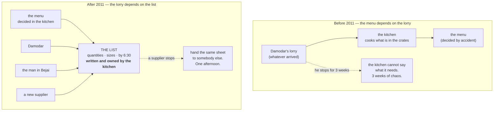

# Day 059 · System Design — Dependency inversion

**After today you can:** You can invert a dependency so the high-level policy stops importing the low-level detail.

**The interviewer asks it as:** *Your service imports the MySQL driver directly. What is wrong with that?*

---

## 1. What this is, and why they ask it

The **dependency inversion principle** is the D in SOLID, and it is two sentences: high-level modules
should not depend on low-level modules — both should depend on an abstraction. And the abstraction
should not depend on details; details should depend on the abstraction.

The part everybody misses, and the part that is actually being tested, is **who owns the
abstraction**. It is not enough to put an interface between your service and MySQL. The interface has
to belong to the *service* — defined in the service's vocabulary, living in the service's package,
answering the service's questions — with the MySQL adapter written to conform to it. If the interface
is defined by the database layer and the service imports it, you have added a layer and inverted
nothing.

They ask it as "your service imports the MySQL driver" because it is the concrete form of the
question, and because the wrong answers are so common. "I'd add a repository" is half an answer. The
full answer names the direction of the arrow, says which package the interface lives in, gives the
`grep` that proves it worked, and distinguishes the principle from dependency injection — which is a
different thing that people constantly conflate with it. This is the last of the five, and it is the
one that makes the other four reachable: open/closed
([day 056](../day-056-non-comparison-sorts/README.md)) needs somewhere to plug implementations in,
and this is what points the plug the right way.

---

## 2. The story

Sister Rita ran the kitchen at a girls' hostel in Mangalore for nineteen years, and for the first six
of them the menu was decided by a man in a lorry.

Not deliberately. It was just how it worked. Damodar came at about half past six most mornings with
whatever he had, and the cook, Sarojini, looked in the crates and worked out what she could make.
Lots of brinjal that week meant brinjal on Tuesday and again on Thursday. If the beans looked poor,
the beans dish became something else. Nobody wrote anything down and it worked, in the sense that a
hundred and forty girls got fed every day.

Then in 2011 Damodar's son had an accident and he stopped coming for three weeks, and the kitchen
essentially stopped working.

Not because there was no food — there were four other suppliers in that market. It was because nobody
in the kitchen could say what they needed. Sarojini had spent six years starting from the crates. She
could look at a crate and know what to cook; she had never once had to go the other way, from a menu
to a list, because she had never had a menu. Sister Rita went to the market herself on the second day
and stood there and could not tell the man what to send.

They got through it badly for three weeks and then Sister Rita changed the order of things, and she
says it is the only administrative thing she ever did that she is genuinely proud of.

She wrote the week's menu first. Monday to Sunday, two meals a day, decided in the kitchen by the
people who cook and the girls who eat. Then, from the menu, she wrote what the kitchen needed each
morning: quantities, and the few things that actually mattered — the potatoes not too large, the
coriander that day and not the day before, everything at the gate by half past six.

That list went to Damodar when he came back, and it went to two other suppliers as well, because now
there was something to hand over.

The list has been the same list for fourteen years. Suppliers have changed four times, twice in a
hurry. The last time, when the man in Bejai stopped, it took one afternoon: she gave the new man the
same sheet she had given the last one, and the girls did not notice anything.

What Sister Rita says about it, when anybody asks, is that for six years the kitchen had been fitting
itself around whatever arrived, and it felt normal because it worked. It was only when the lorry
stopped that anybody could see who had been deciding the menu.

---

## 3. The idea in plain English

For six years the menu depended on the supplier. After 2011 the supplier depended on the menu. Nothing
about cooking changed and nothing about growing vegetables changed. What changed is **which direction
the arrow points**, and who writes the list.

### The principle, both halves

> **High-level modules should not depend on low-level modules. Both should depend on abstractions.**
>
> **Abstractions should not depend on details. Details should depend on abstractions.**

"High-level" means the code that expresses what the business does — placing an order, calculating a
fee, deciding a menu. "Low-level" means the mechanism — MySQL, SMTP, the file system, Razorpay,
whichever lorry turned up.

The natural way to write code is high-level importing low-level, because that is the order you build
things in. `OrderService` imports `psycopg`. That is the kitchen starting from the crates.

Inversion means the arrow flips: `OrderService` declares what it needs, and the Postgres code is
written to satisfy it.

### The half everyone forgets: who owns the interface

This is the whole of today. Consider two arrangements that look identical on a diagram.

**Arrangement A — a layer, not an inversion:**

```
 orders/service.py     ->  imports  ->  persistence/repository.py  (the interface)
 persistence/postgres.py  implements ->  persistence/repository.py
```

The interface lives in the persistence package. It was designed by whoever wrote the database layer,
so it speaks in rows and connections and transactions. When the database team changes it, the service
changes. The service still depends on the persistence package. **Nothing was inverted.**

**Arrangement B — a real inversion:**

```
 orders/service.py     ->  imports  ->  orders/ports.py  (the interface, in the SERVICE's package)
 adapters/postgres.py  ->  imports  ->  orders/ports.py  and implements it
```

Now the interface belongs to the orders module. It is written in the orders module's vocabulary —
`Order`, `Money`, `OrderNotFound` — and it answers the orders module's questions. The Postgres
adapter imports *downwards* into the domain to find out what shape it must be.

The test that distinguishes them: **which package would you have to change to add a field the
business needs?** In A, the persistence package. In B, the orders package, which is where the
business lives.

Sister Rita's list is the interface, and it lives in the kitchen.

### Three things that get confused, separated

People use these three terms interchangeably and they are not the same.

- **Dependency inversion (DIP)** is about the *direction of source-level dependencies*. Who imports
  whom, and who owns the interface. It is a statement about architecture.
- **Dependency injection (DI)** is a *technique*: pass collaborators in as arguments rather than
  constructing them ([day 053](../day-053-merge-sort/README.md)). It is three lines of code.
- **Inversion of control (IoC)** is about *who calls whom at runtime* — a framework calling your
  code, rather than your code calling a library. Django calling your view is IoC.

You can have injection without inversion: `OrderService(psycopg.connect(...))` injects a concrete
Postgres connection, so the service still depends on Postgres — it just does not build it. And you
can have inversion without a framework: an interface in your package and a hand-written composition
root is complete DIP with no container anywhere. **Injection is how you deliver the dependency;
inversion is about which way the arrow points.**

### The concrete before and after

**Before.** The high-level policy imports the mechanism:

```python
# orders/service.py
import psycopg                                    # <-- the problem
from razorpay import Client

class OrderService:
    def place(self, customer_id: int, total_paise: int) -> int:
        conn = psycopg.connect(os.environ["DATABASE_URL"])
        client = Client(auth=(os.environ["RZP_KEY"], os.environ["RZP_SECRET"]))
        charge = client.order.create({"amount": total_paise, "currency": "INR"})
        with conn.cursor() as cur:
            cur.execute(
                "INSERT INTO orders (customer_id, total, charge) VALUES (%s,%s,%s) RETURNING id",
                (customer_id, total_paise, charge["id"]),
            )
            return cur.fetchone()[0]
```

Four things are wrong and it is worth naming all four:

1. The business rule cannot be read, because it is buried in SQL and vendor calls.
2. It cannot be tested without Postgres and Razorpay.
3. Swapping either one means editing the business logic.
4. `charge["id"]` — a dictionary key from a vendor's response — is now part of your service's
   knowledge. Their shape has leaked in.

**After.** The policy declares what it needs, in its own words:

```python
# orders/ports.py -- lives in the ORDERS package, owned by the business
from typing import Protocol

class OrderRepository(Protocol):
    def next_id(self) -> int: ...
    def save(self, order: "Order") -> None: ...
    def get(self, order_id: int) -> "Order": ...

class PaymentGateway(Protocol):
    def charge(self, amount: "Money", token: str) -> "ChargeId": ...
```

```python
# orders/service.py -- imports NOTHING external
from .ports import OrderRepository, PaymentGateway

class OrderService:
    def __init__(self, orders: OrderRepository, payments: PaymentGateway) -> None:
        self._orders, self._payments = orders, payments

    def place(self, customer_id: int, total: Money, token: str) -> int:
        charge = self._payments.charge(total, token)         # your types, your words
        order = Order(self._orders.next_id(), customer_id, total, charge)
        self._orders.save(order)
        return order.order_id
```

```python
# adapters/postgres_orders.py -- imports UPWARDS into the domain
from orders.ports import OrderRepository
from orders.model import Order, Money

class PostgresOrderRepository:                    # satisfies OrderRepository structurally
    def __init__(self, conn) -> None:
        self._conn = conn
    def save(self, order: Order) -> None: ...
    def get(self, order_id: int) -> Order: ...
    def next_id(self) -> int: ...
```

Read the import lines. `orders/service.py` imports `orders/ports.py`. `adapters/postgres_orders.py`
imports `orders/ports.py`. **Both point at the abstraction, and nothing points from the domain at the
adapter.** That is the inversion, and it is visible in the imports rather than in the diagram.

### The check that proves it

```bash
grep -rn "psycopg\|razorpay" orders/
```

If that returns nothing, the inversion is real. If it returns anything, it is not, whatever the
diagram says. This is a genuinely good thing to say in an interview, because it turns a principle
into a command.

### Why this is the same shape as ports and adapters

The arrangement above has a name — **ports and adapters**, also called hexagonal architecture, and
essentially the same thing as Clean Architecture's dependency rule. A **port** is an interface owned
by the domain (`OrderRepository`). An **adapter** is an implementation that translates to a specific
technology (`PostgresOrderRepository`). The rule is one sentence: **source-level dependencies always
point inwards, towards the business rules.**

You do not need to name the architecture to answer the question, but knowing that "put the interface
in the domain package" is the whole of it is worth having.

---

## 4. The picture

Sister Rita's kitchen, before and after:



**What to notice:** the arrows in the bottom half both point at the list, and the list sits with the
kitchen, not with the suppliers. If the suppliers had written the list, changing supplier would mean
a new list and a new menu — which is arrangement A, the layer that inverts nothing.

The code, with the import arrows drawn:

```
 BEFORE — the arrow points outward, from policy to mechanism

   +---------------------------+
   |  orders/service.py        |
   |  the business rules       |
   +---------------------------+
                |  import psycopg
                |  import razorpay
                v
   +---------------------------+
   |  psycopg / razorpay       |
   |  the mechanism            |
   +---------------------------+

   swap the database  ->  edit the business rules
   test the rules     ->  start Postgres


 AFTER — both arrows point at the abstraction, which lives INSIDE the domain

   +--------------------------------------------------+
   |  orders/                                          |
   |    model.py    Order, Money, ChargeId             |
   |    ports.py    OrderRepository, PaymentGateway  <-+---------+
   |    service.py  ---- imports ports ----------------+         |
   |                                                             | imports
   +--------------------------------------------------+         | (upwards,
                                                                 |  into the
   +--------------------------------------------------+         |  domain)
   |  adapters/                                        |         |
   |    postgres_orders.py  implements OrderRepository-+---------+
   |    razorpay_gateway.py implements PaymentGateway -+
   |    in_memory_orders.py implements OrderRepository-+
   +--------------------------------------------------+

   swap the database  ->  one new file in adapters/, one line in main()
   test the rules     ->  hand in in_memory_orders. No Postgres.

   grep -rn "psycopg" orders/     ->  nothing. That is the proof.
```

**What to notice:** the adapter package imports the domain package, and the domain package imports
nothing. That is the direction that has been inverted — before, the domain imported the mechanism.

Injection against inversion, which are not the same thing:

```
 (1) neither
     class OrderService:
         def __init__(self):
             self.db = psycopg.connect(...)          # builds it, and knows psycopg

 (2) INJECTION but NOT inversion
     class OrderService:
         def __init__(self, conn: psycopg.Connection):   # <- a vendor type in the signature
             self.db = conn
     -> testable-ish, but the service still DEPENDS on psycopg.
        Swapping to MySQL still edits this file.

 (3) INVERSION, delivered by injection            <- the answer
     class OrderService:
         def __init__(self, orders: OrderRepository):    # <- YOUR type, in YOUR package
             self._orders = orders
     -> the service knows nothing about any database.
```

**What to notice:** the difference between (2) and (3) is one type name in one signature, and it is
the entire principle. If a vendor's type appears in your service's constructor, you have injected a
dependency without inverting it.

---

## 5. How it actually works

### The refactor, in six steps

**Step 1 — find the outward imports.** `grep -rn "import psycopg\|import redis\|import boto3\|import
razorpay" src/domain/ src/orders/`. Every hit is a place where policy depends on mechanism.

**Step 2 — write down what the policy actually asks the mechanism for.** Not what the driver offers —
what your code uses. Usually three or four operations out of a library's hundreds. That list is the
port.

**Step 3 — declare the port in the policy's package, in the policy's vocabulary.** Your `Order`, your
`Money`, your `OrderNotFound`. **If a vendor type appears in the signature, start again** — the
interface belongs to the vendor and you have bought nothing
([day 048](../day-048-binary-search-on-floats/README.md)).

**Step 4 — write the adapter, and make it translate at its own edge.** Their rows become your
objects, their errors become your exceptions, their units become your units.

**Step 5 — name the concrete classes exactly once, in the composition root.**

**Step 6 — run the grep.** If the domain package still mentions the vendor, you are not finished.

### The domain, importing nothing

```python
# orders/model.py
from dataclasses import dataclass


@dataclass(frozen=True)
class Money:
    paise: int
    currency: str = "INR"


@dataclass(frozen=True)
class ChargeId:
    value: str


class OrderNotFound(Exception):
    """Ours. Not psycopg's, not Razorpay's."""


class PaymentDeclined(Exception):
    """Ours."""


@dataclass
class Order:
    order_id: int
    customer_id: int
    total: Money
    charge: ChargeId | None = None
```

### The ports, in the domain's package

```python
# orders/ports.py
from typing import Protocol
from .model import ChargeId, Money, Order


class OrderRepository(Protocol):
    """What the ORDERS module needs from storage. Written by orders, for orders."""

    def next_id(self) -> int: ...
    def save(self, order: Order) -> None: ...
    def get(self, order_id: int) -> Order:
        """Raises OrderNotFound if there is no such order."""
        ...


class PaymentGateway(Protocol):
    """What the ORDERS module needs from payments."""

    def charge(self, amount: Money, token: str) -> ChargeId:
        """Raises PaymentDeclined if the card is refused."""
        ...
```

Note the docstrings. They are the contract — the postconditions and the exceptions — and they are
what a contract test from [day 057](../day-057-stability-and-pythons-sort/README.md) checks. An
adapter that raises `psycopg.errors.NoDataFound` instead of `OrderNotFound` has broken it.

### The policy, readable at last

```python
# orders/service.py
from .model import Money, Order
from .ports import OrderRepository, PaymentGateway


class OrderService:
    def __init__(self, orders: OrderRepository, payments: PaymentGateway) -> None:
        self._orders = orders
        self._payments = payments

    def place(self, customer_id: int, total: Money, token: str) -> Order:
        charge = self._payments.charge(total, token)
        order = Order(self._orders.next_id(), customer_id, total, charge)
        self._orders.save(order)
        return order
```

Six lines, and every one of them is business. There is no SQL, no vendor dictionary key, no
environment variable. Somebody who knows nothing about the stack can read it and say whether the rule
is right — which is the actual point of the principle, more than swappability.

### The adapter, translating at its edge

```python
# adapters/postgres_orders.py
import psycopg                                  # the ONLY place this import appears
from orders.model import ChargeId, Money, Order, OrderNotFound


class PostgresOrderRepository:
    def __init__(self, conn: psycopg.Connection) -> None:
        self._conn = conn

    def next_id(self) -> int:
        with self._conn.cursor() as cur:
            cur.execute("SELECT nextval('order_id_seq')")
            return cur.fetchone()[0]

    def save(self, order: Order) -> None:
        with self._conn.cursor() as cur:
            cur.execute(
                "INSERT INTO orders (id, customer_id, total_paise, charge_id)"
                " VALUES (%s, %s, %s, %s)"
                " ON CONFLICT (id) DO UPDATE SET charge_id = EXCLUDED.charge_id",
                (order.order_id, order.customer_id, order.total.paise,
                 order.charge.value if order.charge else None),
            )

    def get(self, order_id: int) -> Order:
        with self._conn.cursor() as cur:
            cur.execute(
                "SELECT id, customer_id, total_paise, charge_id FROM orders WHERE id = %s",
                (order_id,),
            )
            row = cur.fetchone()
        if row is None:
            raise OrderNotFound(order_id)        # THEIR absence -> OUR exception
        return Order(row[0], row[1], Money(row[2]),
                     ChargeId(row[3]) if row[3] else None)
```

Three translations happen here and all three matter: a row tuple becomes an `Order`, an integer of
paise becomes a `Money`, and "no row" becomes `OrderNotFound`. If any of those leaked out, the domain
would know about the database again.

### The fake, which is the same shape and fifteen lines

```python
# adapters/in_memory_orders.py
from orders.model import Order, OrderNotFound


class InMemoryOrderRepository:
    def __init__(self) -> None:
        self._rows: dict[int, Order] = {}
        self._next = 1

    def next_id(self) -> int:
        value, self._next = self._next, self._next + 1
        return value

    def save(self, order: Order) -> None:
        self._rows[order.order_id] = order

    def get(self, order_id: int) -> Order:
        if order_id not in self._rows:
            raise OrderNotFound(order_id)        # the SAME contract
        return self._rows[order_id]
```

### The composition root

```python
# main.py -- the only module that knows what is actually being used
import os
import psycopg
from adapters.postgres_orders import PostgresOrderRepository
from adapters.razorpay_gateway import RazorpayGateway
from orders.service import OrderService


def build_order_service() -> OrderService:
    return OrderService(
        orders=PostgresOrderRepository(psycopg.connect(os.environ["DATABASE_URL"])),
        payments=RazorpayGateway(os.environ["RZP_KEY"], os.environ["RZP_SECRET"]),
    )
```

### Where you have already been using this

- **Python's DB-API and Java's JDBC.** Your code writes against a `Connection` and a `Cursor`; the
  driver conforms. That is why switching from Postgres to MySQL changes a connection string and some
  SQL rather than your program.
- **`logging` handlers.** Your code calls `logger.info`; a handler decides whether that lands in a
  file, in syslog, or in stdout — and your code never knows.
- **Django's storage backends and cache backends.** `default_storage.save(...)` is a port; S3 and the
  local filesystem are adapters, chosen in settings.
- **SLF4J in Java** — a façade whose entire purpose is that libraries depend on the interface and the
  application chooses the implementation.
- **The `os` module.** `open()` is a port over three different operating systems' file APIs.
- **Docker, and container runtimes.** Kubernetes depends on the Container Runtime Interface; containerd
  and CRI-O implement it ([day 013](../day-013-reverse-and-rotate/README.md)). Kubernetes did not
  change when Docker was removed as a runtime, and that is the principle paying off at a very large
  scale.

---

## 6. The numbers

### Swapping the mechanism, priced

```
 "we are moving from Razorpay to Stripe"

 without inversion:
   grep -rn "razorpay" src/     ->  38 hits across 14 files
   files to edit                :  14  (services, jobs, admin views, tests)
   business logic touched       :  yes, in 9 of them
   test suite that must re-run  :  all of it
   engineer-days                :  ~4, plus a nervous release

 with inversion:
   grep -rn "razorpay" src/     ->  2 hits: adapters/razorpay_gateway.py, main.py
   files to add                 :  1  (adapters/stripe_gateway.py)
   files to edit                :  1  (main.py, one line)
   business logic touched       :  none
   engineer-days                :  ~0.5
```

### The import graph, which is the measurable version

```
 before:
   orders/  imports psycopg, razorpay, boto3, redis, requests
   -> 5 external packages reachable from the business rules
   -> the domain cannot be imported at all without them installed

 after:
   orders/  imports  dataclasses, typing, decimal
   -> 0 external packages
   -> `python -c "import orders"` works in a bare interpreter
```

That last line is a genuine test and worth naming: **if you cannot import your domain package in an
interpreter with nothing installed, the inversion is incomplete.**

### Test cost

```
 testing "placing an order charges the card before saving"

 before : needs Postgres + a Razorpay sandbox key + network
          ~900 ms, flakes when the sandbox is slow, cannot run in CI without secrets

 after  : InMemoryOrderRepository + a recording gateway
          ~0.3 ms, deterministic, no secrets

 3,000x faster, and the failure path -- "if the charge is declined, nothing is saved" --
 becomes testable at all, which it was not before.
```

### Build and deploy blast radius, in a compiled language

```
 a monorepo where the domain imports the driver:
   changing the driver version   ->  the domain recompiles
                                 ->  every service importing the domain recompiles
                                 ->  17 services redeployed

 with inversion:
   changing the driver version   ->  adapters/ recompiles
                                 ->  the domain does not
                                 ->  1 service redeployed
```

### The cost of doing it

```
 ports.py                      : ~20 lines
 the adapter                   : ~45 lines (mostly the SQL that was inline before)
 the in-memory fake            : ~15 lines
 the composition root          : ~8 lines
 model types (Money, ChargeId) : ~20 lines
                                 -----
                                 ~108 lines of structure

 for a service with one database and no plans to change it,
 that is 108 lines buying an ability nobody has asked for.
```

Both numbers are real. Which one applies depends on how many adapters you can actually name, which is
the trade-off section.

---

## 7. The trade-offs

### What it costs

**Indirection.** Reading `self._orders.save(order)` no longer tells you what happens. You go to the
composition root to find out which adapter is wired in. One extra hop, every time, for every reader.

**Translation code.** The adapter has to convert rows to objects and errors to exceptions, and that
is code that did not exist when the service just ran SQL. On a simple CRUD service it can be more
code than the logic it protects.

**Two vocabularies to keep in step.** Your `Order` and the database's `orders` table drift, and
somebody has to maintain the mapping. This is exactly what an ORM does for you, and part of why
people reach for one.

**It can hide capability.** A port narrow enough to be clean may not expose the thing that makes your
database good — a Postgres-specific upsert, a window function, a full-text index. If the port only
offers `get` and `save`, somebody will write a slow loop where one query would do.

### When not to invert

**I would not invert a dependency on the standard library or the language.** Nobody writes a port
over `datetime` the type, `json`, or `math`. The exception is the *clock* as a source of "now", which
is not really a type dependency — it is a source of non-determinism, and that does get injected
([day 053](../day-053-merge-sort/README.md)).

**I would not invert when I cannot name the second implementation** — the test from
[day 048](../day-048-binary-search-on-floats/README.md), and it still governs. The in-memory fake for
tests counts as a second implementation, and it is usually the honest reason. If there is no fake and
no plausible second adapter, a hundred lines of ports is speculative generality.

**I would not invert a whole application on day one.** A small service with one database and a
six-week life should import `psycopg` and get on with it. The signal to invert is the second adapter
or the first painful test, and it is a refactor you can do later — which is not true of most
architectural decisions.

**I would not invert when the abstraction cannot be honest.** If your code genuinely depends on
Postgres's transactional guarantees, a port that pretends any store would do is a lie, and the first
implementation that is not Postgres will break in a way the interface promised could not happen. That
is a Liskov problem ([day 057](../day-057-stability-and-pythons-sort/README.md)) created by an
over-broad port. Better to depend on Postgres openly and say why.

### The failure mode: the layer that inverts nothing

The commonest way to get this wrong is to add a repository package whose interface is written by the
persistence layer, in the persistence layer's vocabulary, and imported by the domain. It looks like
inversion on a diagram — there is an interface in the middle — and the domain still depends on
persistence, which is the thing you were trying to stop.

**The two tests that catch it:** which package does the interface file live in, and does its signature
mention any vendor type. If the answer is "the persistence package" and "yes", nothing was inverted.

### The honest limit

Inversion buys you *source-level* independence. It does not buy you runtime independence: the service
still needs *some* adapter, and if that adapter is slow or broken the service is slow or broken. It
also does not make swapping free — moving from Postgres to DynamoDB means the adapter must implement
transactional behaviour the new store does not have, and that is a genuine engineering problem the
interface cannot dissolve. What you have bought is that the *business rules* do not change, and that
the problem is confined to one directory. Say that precisely, rather than claiming a swap is a
one-line change when the honest number is one afternoon.

---

## 8. In the interview

### How it gets asked

- *"Your service imports the MySQL driver directly. What's wrong with that?"* — the direct form.
- *"What is the dependency inversion principle?"* — and the follow-up is always "how is that
  different from dependency injection?", which is the real question.
- *"How would you make it possible to switch from Razorpay to Stripe?"* — the same principle, wearing
  a scenario.
- *"Where would you put the interface?"* — the question that separates people. In the domain package.
- *"Isn't this over-engineering for a small service?"* — the pushback, and "yes, often" is part of a
  good answer.

### What to say out loud, in the first ninety seconds

1. **Name the direction, not the missing interface.** *"The problem is that the arrow points the
   wrong way. The business rules — high-level — depend on a driver — low-level. It should be the
   other way round: both should depend on an abstraction that the business owns."*
2. **Give the three concrete harms.** *"I can't read the rule, because it's buried in SQL. I can't
   test it without a database. And swapping the database means editing business logic."*
3. **Say where the interface goes, unprompted.** *"I'd define an `OrderRepository` protocol **in the
   orders package**, in the orders package's vocabulary — my `Order`, my `Money`, my `OrderNotFound`.
   If I put it in a persistence package instead, the service still depends on persistence and nothing
   has been inverted."*
4. **Describe the adapter as a translator.** *"`PostgresOrderRepository` imports upwards into the
   domain and translates at its own edge: rows to `Order` objects, `psycopg` errors to my
   exceptions."*
5. **Give the proof.** *"The check is `grep -rn psycopg orders/` returning nothing. And a stronger
   one: I should be able to `import orders` in an interpreter with nothing installed."*

### The follow-ups

**"How is this different from dependency injection?"**
They are frequently used interchangeably and they are not the same thing. Dependency injection is a
technique — pass collaborators in as constructor arguments rather than building them inside — and it
is about three lines of code. Dependency inversion is about the *direction of source-level
dependencies*: who imports whom, and crucially who owns the interface. You can do one without the
other, and the case that shows it is injecting a concrete type. If I write
`def __init__(self, conn: psycopg.Connection)`, I have injected the dependency — I am not
constructing it, so I could hand in a test connection — but my service still names a vendor type in
its own signature, so it still depends on psycopg, and moving to MySQL still edits this file.
Nothing was inverted. The inverted version is `def __init__(self, orders: OrderRepository)`, where
`OrderRepository` is my type in my package. The difference between those two lines is the entire
principle. There is a third thing people fold in, inversion of control, which is about who calls whom
at *runtime* — a framework calling your code rather than your code calling a library, like Django
calling your view. That is orthogonal: you can have full dependency inversion with no framework at
all, just an interface in your package and a hand-written composition root. The short form:
**injection is how the dependency is delivered; inversion is which way the arrow points.**

**"Where does the interface live, and why does it matter?"**
In the package that *uses* it — the domain — not in the package that implements it. This is the half
of the principle people skip and it is the whole of it. If I put `OrderRepository` in a
`persistence` package and my service imports it from there, then my service depends on the
persistence package, the interface was designed by whoever wrote the database layer, and it will
speak in rows and cursors and transactions. When the database team changes it, my business logic
changes. I have added a layer and inverted nothing, and the diagram looks identical. If instead the
port lives in `orders/ports.py`, then the orders module owns it, it is written in orders' vocabulary
— my `Order`, my `Money`, my `OrderNotFound` — and the Postgres adapter imports *upwards* into the
domain to find out what shape it must be. That is what "inverted" means: the dependency that used to
run from policy to mechanism now runs from mechanism to policy. The two checks I would run are, which
directory is the interface file in, and does any signature in it mention a vendor type. If a vendor
type appears, the interface belongs to the vendor and I have bought nothing. Underneath, that is what
ports and adapters — hexagonal architecture — is: source dependencies always point inwards, towards
the business rules.

**"Isn't this over-engineering for a small service?"**
Often, yes, and I would rather say so than defend it everywhere. The cost is real: about a hundred
lines of ports, adapters, fakes and model types, plus a hop of indirection every time a reader wants
to know what actually happens, plus translation code that did not exist when the service just ran
SQL. For a service with one database, no plans to change it, and a six-week life, I would import
psycopg and get on with it, and I would not feel bad about it. The test I actually apply is whether I
can name the second implementation — and I would be honest that the second implementation is usually
the in-memory fake for tests, which is a legitimate reason on its own. That is where most of the
value shows up for a small team: testing "if the payment is declined, nothing is saved" is impossible
against a real gateway and trivial against a fake, and roughly half the branches in a service are
error paths I cannot otherwise reach. The other thing I would say is that this is one of the few
architectural decisions you can defer safely. Inverting a dependency later is a mechanical refactor
confined to a few files; it is not like choosing the wrong data model. So my default on a small
service is to skip it, and to do it the moment either a second adapter appears or a test becomes
painful.

### A model answer

> "The problem isn't that there's no interface — it's the direction of the dependency. The high-level
> code, the business rules about placing an order, depends on a low-level detail, a database driver.
> Dependency inversion says neither should depend on the other: both should depend on an abstraction.
>
> Three concrete harms. I can't read the business rule, because it's tangled with SQL and vendor
> dictionary keys. I can't test it without Postgres running. And swapping the database means editing
> the file where the business logic lives, which is the file I least want to touch.
>
> So I'd define an `OrderRepository` protocol with the three or four operations my service actually
> uses — `next_id`, `save`, `get` — and, importantly, I'd put it in the **orders** package, not in a
> persistence package. That's the half people skip. If the interface lives with the database code and
> my service imports it from there, my service still depends on the persistence layer, the interface
> will be written in rows and cursors, and nothing has been inverted. In the orders package it's
> written in my vocabulary — my `Order`, my `Money`, my `OrderNotFound` — and the Postgres adapter
> imports upwards into the domain to find out what shape it has to be.
>
> The adapter's job is to translate at its own edge: a row tuple becomes an `Order`, an integer of
> paise becomes a `Money`, and 'no row found' becomes `OrderNotFound` rather than a psycopg exception.
> If any of those leaked through, the domain would know about the database again.
>
> The concrete classes get named exactly once, in `main()`. And the proof that it worked is a command:
> `grep -rn psycopg orders/` should return nothing. A stronger version — I should be able to
> `import orders` in an interpreter with nothing installed.
>
> What it buys, with numbers: moving from Razorpay to Stripe went from thirty-eight references across
> fourteen files to two references — the adapter and `main()` — so it's one new file and one line
> instead of about four engineer-days. And testing 'if the payment is declined, nothing is saved' goes
> from impossible to three lines.
>
> I'd add the caveat that this is roughly a hundred lines of structure, and on a small service with
> one database and no second implementation in sight, I'd skip it. The test I apply is whether I can
> name the second implementation — and the in-memory fake for tests counts, which is usually the
> honest reason."

---

## 9. Recall card

- **High-level must not depend on low-level; both depend on an abstraction — and the abstraction must
  not depend on details.** The problem is never "there is no interface", it is **the direction of the
  arrow**. Before: `orders/` imports `psycopg`. After: `orders/` and `adapters/` both import
  `orders/ports.py`.
- **The half everyone skips: the interface lives in the *policy's* package, in the policy's
  vocabulary.** Your `Order`, your `Money`, your `OrderNotFound`. A port in a `persistence/` package,
  or a **vendor type in a signature**, is a layer that inverted nothing — and it looks identical on a
  diagram.
- **Three terms, kept apart.** **DIP** = which way source dependencies point. **DI** = passing
  collaborators in (a technique, 3 lines). **IoC** = who calls whom at runtime (a framework calling
  your code). `__init__(self, conn: psycopg.Connection)` is injection **without** inversion.
- **The proof is a command:** `grep -rn "psycopg" orders/` returns nothing, and `import orders` works
  in a bare interpreter. The adapter **translates at its edge** — rows → objects, their errors → your
  exceptions, their units → your types.
- **Numbers and limits.** Razorpay → Stripe: 38 references in 14 files becomes **1 new file + 1
  line**; the declined-payment test goes from impossible to 0.3 ms. Cost: ~108 lines of structure and
  one hop of indirection — so **skip it when you cannot name the second implementation** (the test
  fake counts), and remember it buys *source-level* independence, not a free swap.
