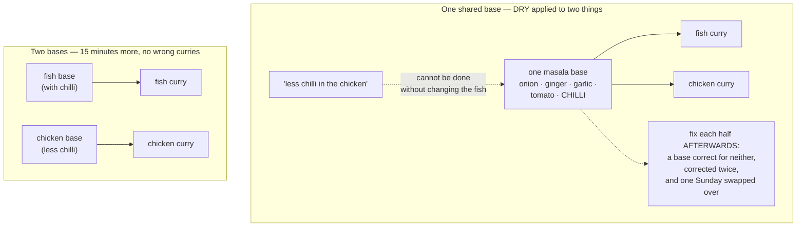

# Day 060 · System Design — DRY, KISS, and YAGNI

**After today you can:** You can tell real duplication from coincidental similarity.

**The interviewer asks it as:** *Is this duplication worth removing?*

---

## 1. What this is, and why they ask it

Three rules that everybody quotes and most people apply badly. **DRY** — don't repeat yourself — says
every piece of *knowledge* should have one authoritative home. **KISS** — keep it simple — says
prefer the plainest thing that works. **YAGNI** — you aren't gonna need it — says do not build what
nobody has asked for yet.

They ask about DRY specifically because it is the principle that does the most damage when
misapplied. Taken as "never write the same characters twice", it leads people to merge two things
that merely look alike, and then those two things need to change in different directions, and the
shared function grows a boolean flag, then a second one, then an `if` chain — and the result is worse
than the duplication ever was. The sentence a good candidate can say is **"duplication is cheaper
than the wrong abstraction"**, and being able to say *when* is what is being tested. YAGNI is the
counterweight to open/closed from
[day 056](../day-056-non-comparison-sorts/README.md), and KISS is what stops the whole of SOLID
turning into ceremony. These three are where judgement lives.

---

## 2. The story

Sulochana cooks for six people in Ernakulam and on a Sunday she makes two curries, one with fish and
one with chicken, and for about twelve years she made the masala base for both of them in the same
pan at the same time.

It was the obvious thing to do. Onion, ginger, garlic, tomato, the powders — it was the same list for
both, near enough. Making it once in a big pan and dividing it took twenty minutes instead of
thirty-five, and the kitchen was cooler, and there was one pan to wash instead of two.

Then her son's wife came to stay, and she cannot take much chilli. Not none — some. So the chicken,
which is the one she eats, had to come down.

And Sulochana could not do it. The chilli was already in the shared base. Taking it out of the base
took it out of the fish as well, and her husband will not eat the fish curry without it and says so
every single time.

What she did for a while was worse than either. She made the base as before, split it, and then
adjusted each half afterwards — extra chilli into the fish, a bit of coconut into the chicken to calm
it. That worked, sort of, and it meant the base was now a thing that was correct for neither curry
and had to be corrected twice, and she had to remember which half was which, and one Sunday she got
it the wrong way round.

She went back to two pans. It takes thirty-five minutes now instead of twenty. Nobody has got the
wrong curry since.

The thing she says about it, and she has said it to her daughter more than once, is that the two
bases were never the same base. They looked the same for twelve years, and that was luck — nothing
about a fish curry and a chicken curry says the masala has to match. The moment one of them had a
reason to change that the other did not have, it turned out she had been making one thing where there
were always two.

There is a second story in that kitchen, which is the mixer-grinder attachment her nephew bought her
for making the base in one go. Setting it up, feeding it, and washing the three parts afterwards takes
longer than a knife. It is in the top cupboard. And there is a very large steel vessel from 2018 that
was bought because a hundred people were expected at a function that got postponed and then moved to
a hall, and it has never been used.

---

## 3. The idea in plain English

Sulochana's shared base is DRY applied to something that was never one thing. The mixer-grinder is a
KISS failure. And the vessel from 2018 is YAGNI.

### DRY, stated properly

The original wording matters, because the popular version is wrong:

> **Every piece of *knowledge* must have a single, unambiguous, authoritative representation within a
> system.**

Knowledge. Not characters. Not lines. If the GST rate is eighteen percent, that fact should live in
one place, because if it changes it changes everywhere at once, and finding nine copies is how you
end up with six of them updated.

Two blocks of code that look identical are only duplication if they encode **the same knowledge**. If
they encode two different rules that currently happen to agree, they are not duplication at all —
they are two things that look alike, and merging them creates a bug that has not happened yet.

### The distinction that matters: real against coincidental

**Real duplication.** The same fact, written twice. It will always change together, because it is one
thing.

```python
# in checkout.py
total = subtotal * 1.18

# in invoice.py
total = subtotal * 1.18

# in reports.py
total = subtotal * 1.18
```

One fact — the GST rate — in three places. When it changes to twelve percent, someone will update
two of them. **Remove this.**

**Coincidental duplication.** Two different rules that currently produce the same code.

```python
def validate_customer_signup(data):
    if not data.get("email") or "@" not in data["email"]:
        raise ValueError("invalid email")
    if len(data.get("password", "")) < 8:
        raise ValueError("password too short")

def validate_admin_signup(data):
    if not data.get("email") or "@" not in data["email"]:
        raise ValueError("invalid email")
    if len(data.get("password", "")) < 8:
        raise ValueError("password too short")
```

Identical today. But customer sign-up rules are owned by the growth team, and admin sign-up rules are
owned by security, and in nine months security will require twelve characters and a second factor
while customers keep eight. **Leave this alone.** They are the fish and the chicken.

The test, and it is the same test as the single responsibility principle from
[day 055](../day-055-quickselect/README.md):

> **Would a change to one of these always require the same change to the other? If yes, it is one
> thing. If you can imagine one changing without the other, it is two.**

Or shorter: **do they change for the same reason, and would the same person ask?**

### What the wrong abstraction costs

This is the part to be able to describe, because it is what makes the principle real. When you merge
two things that need to diverge, the shared function does not stay shared. It grows:

```python
def validate_signup(data, is_admin=False):                       # month 1: one flag
    ...
def validate_signup(data, is_admin=False, min_password=8):       # month 4: two
    ...
def validate_signup(data, is_admin=False, min_password=8,
                    require_mfa=False, allow_plus_addressing=True):   # month 9: five
    if is_admin and require_mfa:
        ...
    elif not is_admin and allow_plus_addressing:
        ...
```

Every caller now passes flags describing which of the two things it actually is, and the function has
an `if` chain reconstructing the distinction you deleted. **This is strictly worse than the original
duplication**, because now the two rules are tangled *and* neither is readable, and untangling them
means understanding every caller.

The rule of thumb people use: **the rule of three.** Do not abstract on the second occurrence. Wait
for the third, because two points fit any line and three start to show you the shape. The related
slogan is **AHA — avoid hasty abstractions** — and Sandi Metz's line, which is worth quoting because
interviewers know it: *duplication is far cheaper than the wrong abstraction.*

### Un-abstracting is expensive, which is why the asymmetry matters

Going from duplicated to shared is easy: extract a function, update two call sites, done. Going the
other way is not, because by then five callers depend on the shared function's exact behaviour, three
tests exercise it, and nobody is sure which callers rely on which flag. **The cost is asymmetric, so
the default should be to wait.**

### KISS

> **Prefer the simplest thing that solves the actual problem.**

Simple does not mean short, and it does not mean crude. It means *fewer moving parts, fewer concepts
a reader must hold at once.* A forty-line function with no cleverness in it is simpler than a
twelve-line one built from three layers of generics.

The practical form is a question: **what is the plainest thing that would work, and what specifically
would break?** If you cannot name what breaks, build the plain thing.

Common KISS failures, and each of them started as a good idea:

- a plugin system where a function would do;
- a configuration file for something nobody will ever configure;
- a message queue between two functions in the same process;
- a class hierarchy where a dict of values would do
  ([day 056](../day-056-non-comparison-sorts/README.md));
- a caching layer added before anything was measured.

Sulochana's mixer-grinder is the honest shape of it: it genuinely does the job, and the setup and the
washing-up cost more than the knife.

### YAGNI

> **Do not build it until something actually needs it.**

The argument is not that the future never arrives. It is that you are usually wrong about *which*
future, and being wrong costs three separate things: the time to build it, the weight of carrying it
(every reader reads it, every refactor works around it, every test suite runs it), and the fact that
it is almost never right when the requirement finally shows up — because it was designed against a
guess.

The concrete signals:

- a parameter with a default that no caller ever overrides;
- an interface with one implementation and no test fake;
- a `type` field on a table with one value;
- a "v2" API path with nothing behind it;
- generic multi-currency, multi-tenant or multi-region support in a product with one of each.

**YAGNI is not an argument against design.** It is an argument against building *mechanism* for a
requirement you cannot name. Choosing where the boundary goes is design and costs nothing; building
the plug point behind it is mechanism and costs plenty.

### How the three fit together

They pull against each other on purpose, and knowing which wins when is the skill:

```
 DRY   pushes toward   sharing, abstraction, one place for each fact
 KISS  pushes toward   fewer concepts, plainer code
 YAGNI pushes toward   less mechanism, built later

 DRY vs YAGNI:  DRY says extract the shared thing; YAGNI says wait until
                you have three and can see the axis.
                -> YAGNI wins on the second occurrence. DRY wins on the third.

 DRY vs KISS:   removing duplication sometimes ADDS a concept (a base class,
                a strategy, a generic).
                -> If the abstraction is harder to explain than the duplication,
                   KISS wins.

 The resolution: DRY is about FACTS. If it is one fact, one home, always.
                 If it is two rules that look alike, KISS and YAGNI win.
```

---

## 4. The picture

Sulochana's two curries:



**What to notice:** the shared base was correct for twelve years. Nothing was wrong with the decision
at the time — what was wrong was that it was never re-examined when one side got a reason to change
that the other did not have. That moment is the signal, and it is the only reliable one.

Real against coincidental, side by side:

```
 REAL DUPLICATION — one fact, three homes

   checkout.py   total = subtotal * 1.18   \
   invoice.py    total = subtotal * 1.18    >  ONE fact: the GST rate
   reports.py    total = subtotal * 1.18   /

   when it changes to 12%: all three change, together, always.
   somebody will find two of them.
   -> EXTRACT.  GST_RATE = Decimal("0.18")   in one module.


 COINCIDENTAL DUPLICATION — two rules that currently agree

   customer_signup()   email check + password >= 8   \  growth team owns this
   admin_signup()      email check + password >= 8   /  security owns this

   month 9: security wants 12 chars + MFA. Growth still wants 8.
   -> if you merged them, you now have:
        validate(data, is_admin=False, min_password=8,
                 require_mfa=False, allow_plus_addressing=True)
      five flags reconstructing the distinction you deleted.
   -> LEAVE THEM.
```

**What to notice:** the code in both boxes looks the same. What differs is *who would ask for a
change*, and that is not visible in the code at all — which is why this judgement cannot be automated
and why a linter reporting "duplicate code" is a hint, not an instruction.

The cost curve, which is the argument for waiting:

```
  cost of change
      ^
      |                                    .  the wrong abstraction
      |                                 .     (flags accumulate, callers
      |                              .         tangle, untangling is hard)
      |                          .
      |                     .
      |    - - - - - -  .- - - - - - - - - -   duplication
      |          .                             (flat: n copies, n edits,
      |     .                                   but each edit is trivial)
      |  .
      +-----------------------------------------> time / number of divergent requirements
         ^
       the merge

  Duplication's cost is FLAT and known. The wrong abstraction's cost GROWS,
  and un-merging is far more expensive than merging was.
  That asymmetry is the whole argument for the rule of three.
```

**What to notice:** duplication is not free — three copies is three edits. It is that the cost is
*predictable*, and the wrong abstraction's is not.

---

## 5. How it actually works

### The four questions to ask before extracting

Run these in order on any duplication somebody points at.

**1. Is it the same knowledge, or the same characters?** Say what the fact is, in one sentence. "The
GST rate is eighteen percent" is a fact. "Both of these validate an email and a password" is a
description of two functions.

**2. Would a change to one always require the same change to the other?** If you can construct a
plausible story where one changes and the other does not, they are two things.

**3. Who would ask for the change?** Same team, same fact. Different teams, different facts. This is
the single responsibility test from
[day 055](../day-055-quickselect/README.md) applied to duplication.

**4. Is this the third occurrence?** Two is a coincidence. Three starts to show the shape, and by
then you can see which parts vary and which do not.

### Real duplication, removed properly

```python
# tax.py -- one home for one fact
from decimal import Decimal

GST_RATE = Decimal("0.18")

def with_gst(subtotal: Decimal) -> Decimal:
    """The rate lives here and nowhere else."""
    return subtotal * (1 + GST_RATE)
```

```python
# checkout.py, invoice.py, reports.py
from tax import with_gst
total = with_gst(subtotal)
```

Three call sites, one fact, one edit when the rate changes. This is DRY doing exactly what it is for
— and note the extraction is *tiny*. Real duplication usually extracts into something small and
obviously named, and that is a signal you got it right.

### Coincidental duplication, left alone — and what happens if you don't

```python
# signup/customer.py -- owned by growth
def validate_customer_signup(data: dict) -> None:
    if not data.get("email") or "@" not in data["email"]:
        raise ValidationError("invalid email")
    if len(data.get("password", "")) < 8:
        raise ValidationError("password too short")
```

```python
# signup/admin.py -- owned by security
def validate_admin_signup(data: dict) -> None:
    if not data.get("email") or "@" not in data["email"]:
        raise ValidationError("invalid email")
    if len(data.get("password", "")) < 8:
        raise ValidationError("password too short")
```

Nine months later, security's rules change. Because these were never merged, the change is four lines
in one file that growth never sees:

```python
def validate_admin_signup(data: dict) -> None:
    if not data.get("email") or not data["email"].endswith("@ourcompany.in"):
        raise ValidationError("admin accounts must use a company address")
    if len(data.get("password", "")) < 12:
        raise ValidationError("password too short")
    if not data.get("mfa_token"):
        raise ValidationError("MFA is required for admin accounts")
```

Had they been merged, the same change would be a fourth flag on a shared function, an `if is_admin`
inside it, and a re-test of the customer path — which cannot break and must be verified anyway.

### The genuinely shared part, extracted honestly

There *is* one real fact hiding in there: what a valid email address looks like. That is one piece of
knowledge, and it belongs in one place:

```python
# validation/email.py
def is_valid_email(value: str | None) -> bool:
    """One fact: what this system considers a valid address."""
    return bool(value) and "@" in value and "." in value.split("@")[-1]
```

Both validators call it, and both keep their own password rules. **Extract the fact, not the
function.** That distinction — a shared *predicate* rather than a shared *procedure* — is usually
where the honest line is.

### KISS, as a comparison

Somebody proposes a plugin system for report formats:

```python
class ReportPlugin(Protocol):
    def name(self) -> str: ...
    def render(self, report: Report, options: dict) -> bytes: ...

class PluginRegistry:
    def __init__(self) -> None:
        self._plugins: dict[str, ReportPlugin] = {}
    def register(self, plugin: ReportPlugin) -> None: ...
    def discover(self, package: str) -> None: ...      # entry-point scanning
    def render(self, name: str, report: Report, options: dict) -> bytes: ...
```

Against:

```python
RENDERERS = {"csv": render_csv, "json": render_json}

def render(report: Report, fmt: str) -> bytes:
    return RENDERERS[fmt](report)
```

Four lines against forty. The question that decides it is not "which is more flexible" — it is **"do
plugins ship separately from this application?"** If third parties write renderers and install them,
you need the registry. If two formats exist and both live in this repository, the dict is the answer,
and it is still the answer at five formats.

Note this is not an argument against the open/closed principle from
[day 056](../day-056-non-comparison-sorts/README.md). The dict *is* open for extension — a new format
is one entry. KISS is about choosing the cheapest mechanism that achieves it.

### YAGNI, made concrete

```python
# written in month 1, "because we'll definitely go multi-currency"
@dataclass(frozen=True)
class Money:
    amount: Decimal
    currency: str = "INR"
    exchange_rate_date: date | None = None

    def convert_to(self, currency: str, rates: RateProvider) -> "Money": ...
    def in_base_currency(self, rates: RateProvider) -> "Money": ...
```

Three years on: one currency, `convert_to` never called, `RateProvider` has one implementation
returning `1.0`, and every `Money` carries a `currency` field that is always `"INR"` — in the
database, in the API responses, in every test fixture.

And when the company genuinely did go multi-currency, the design was wrong anyway, because the real
requirement turned out to be that an *order* has a currency and each line inherits it, not that each
amount carries its own.

The YAGNI version:

```python
@dataclass(frozen=True)
class Money:
    paise: int
```

If multi-currency arrives, adding a field to a frozen dataclass and fixing the compile errors is a
day's work — *with the real requirement in hand.*

### Where the three show up in real systems

- **Real DRY:** configuration in one place, database migrations as the single source of schema truth,
  one shared client library for an internal API, one constants module for business rates.
- **Famous coincidental duplication:** Rails' and Django's scaffolded CRUD views look identical for
  every model and are correctly left duplicated, because each one diverges the moment the model gets
  a real rule.
- **KISS in the wild:** Go's deliberate lack of generics for a decade, SQLite being one file, the
  Unix philosophy of small composable programs.
- **YAGNI in the wild:** the "you might need microservices" argument, answered by a great many teams
  who split a monolith too early and spent a year putting it back.
- **Where DRY is deliberately violated:** across service boundaries. Two microservices sharing a
  model library are coupled at deploy time, so most teams duplicate the model on purpose. The same
  applies across bounded contexts from
  [day 051](../day-051-why-sorting-matters/README.md) — a `Customer` in billing and a `Customer` in
  support are two different things with the same name, and merging them is a classic mistake.
- **And in tests:** test code is deliberately more duplicated than production code, because a test
  should be readable top to bottom without following three helper functions. A shared test helper
  that hides the setup makes failures harder to diagnose.

---

## 6. The numbers

### Real duplication, priced

```
 the GST rate in 9 places, changing 18% -> 12%:

   places to find              : 9   (grep finds 7; two are "0.18" in a formula
                                      and one is in a template)
   probability all 9 updated
     in one pass               : low -- the empirical answer is "somebody finds 7"
   consequence of missing one  : wrong invoices, discovered by a customer
   cost of extracting          : 1 constant + 1 function + 9 call-site edits, ~1 hour

 -> extract. This is what DRY is for.
```

### The wrong abstraction, priced

```
 two validators merged in month 1, then diverging:

   month 1  : merged. 1 function, 0 flags.        24 lines saved.
   month 4  : + is_admin flag                     callers: 2 -> pass a flag
   month 6  : + min_password parameter            callers: 5 now
   month 9  : + require_mfa                       an if-chain inside
   month 12 : + allow_plus_addressing             5 params, 4 branches

   the function                : 24 lines -> 71 lines
   callers passing flags       : 5
   tests of the shared function: 14 (up from 6), most exercising flag combinations
   cost to UNTANGLE            : ~3 days -- every caller must be read to find out
                                 which flags it relies on

 -> 24 lines saved in month 1, ~3 days spent in month 12.
```

### The asymmetry, which is the argument

```
 duplicate -> shared      : extract a function, update the call sites.
                            2 copies: ~20 minutes. 5 copies: ~1 hour.
                            Low risk: the behaviour is identical by construction.

 shared -> duplicate      : read every caller to determine which behaviour it
                            depends on, split, re-test both paths.
                            ~2-4 days, and it is a behaviour-changing refactor.

 ratio: roughly 20-50x more expensive to reverse.
```

That ratio is why the default is to wait. You are choosing between a cheap reversible decision and an
expensive irreversible one.

### The rule of three, as arithmetic

```
 cost of duplication      = n_copies x cost_per_edit x n_future_changes
 cost of abstraction      = build_cost + (n_future_changes x cost_per_edit)
                            + P(wrong) x untangle_cost

 2 copies, 3 future changes, and a 40% chance the abstraction is wrong:
   duplicate : 2 x 10 min x 3            = 60 min
   abstract  : 60 min + (3 x 10) + 0.4 x 2400 min  = 1,050 min
   -> duplicate

 5 copies, 10 future changes, 10% chance wrong (the axis is clear by now):
   duplicate : 5 x 10 x 10               = 500 min
   abstract  : 60 + (10 x 10) + 0.1 x 2400 = 400 min
   -> abstract
```

The variable that moves most is `P(wrong)`, and the only thing that reduces it is seeing more
examples. That is the rule of three, derived rather than asserted.

### YAGNI, priced

```
 the speculative multi-currency Money:

   build cost                  : ~2 days
   carried cost over 3 years   :
     a `currency` column in 6 tables, always "INR"
     the field in ~40 API responses and ~200 test fixtures
     every new developer asks what it is for  (~15 min each x 11 people)
     one bug where a test set currency="USD" and nothing complained
   value delivered in 3 years  : zero
   value when it WAS needed    : negative -- the design was wrong,
                                 and had to be redone anyway
```

---

## 7. The trade-offs

### What DRY costs when it is right

Even correct extraction has a price. The caller now depends on a shared module, so a change there
reaches everybody — which is exactly what you wanted for a fact and exactly what you did not want for
a coincidence. It also adds a hop: reading `with_gst(subtotal)` means opening another file to find
out that it is eighteen percent.

**I would not extract if** the shared thing would be smaller than the call to it. A two-line helper
called from two places, where the helper name is longer than the code, adds a concept without
removing one.

### When to duplicate deliberately

**Across service boundaries.** Two services sharing a model library are coupled at deploy time —
change the library and both must be released together, which is the thing microservices exist to
avoid. Most teams duplicate the shared types on purpose and accept the drift.

**Across bounded contexts.** A `Customer` in billing (has a payment method, a GST number) and a
`Customer` in support (has a ticket history, a satisfaction score) are two different concepts wearing
one word. Merging them produces a class with twenty fields where each caller uses six
([day 051](../day-051-why-sorting-matters/README.md)).

**In tests.** Test code should be readable in one screen, top to bottom. A shared fixture that hides
the setup makes a failure harder to diagnose, and the duplication is cheap because tests rarely
change in lockstep. Slightly WET tests are a deliberate, defensible choice.

**When the two things are owned by different teams.** Even if the code is identical today, shared
ownership of one function by two teams is a coordination cost paid on every change.

### What KISS costs

Sometimes the simple thing genuinely does not scale, and choosing it means a rewrite later. That is
usually the right trade — a rewrite with real requirements beats a design built on a guess — but it
is not free, and pretending otherwise is dishonest.

**I would not choose the simple version if** the failure mode is data loss, a security hole, or
something that cannot be fixed forward. Simplicity is a cost-of-change argument, and it does not
apply to correctness or safety.

### What YAGNI costs

Some things are genuinely much cheaper to build early: an audit trail is nearly free at the start and
expensive to backfill; the same is true of a tenant identifier on your tables, of database migrations
existing at all, and of tests. YAGNI is about *speculative mechanism*, not about foundations.

**I would build it before it is needed if** the cost of adding it later is superlinear — a schema
column that would require backfilling a billion rows, an identifier that must be present from the
first record, or anything the law requires you to have retrospectively.

### The honest summary

None of these three is a rule you can apply without judgement, and an interviewer asking about them is
asking for the judgement, not the slogan. The most useful sentence in the whole topic:

> **Duplication is a known, flat cost. The wrong abstraction is an unknown, growing cost that is
> twenty to fifty times more expensive to reverse. So when you are not sure, duplicate — and let the
> third occurrence tell you the shape.**

---

## 8. In the interview

### How it gets asked

- *"Is this duplication worth removing?"* — shown two similar functions. The expected answer is a
  question back, not a yes.
- *"What does DRY actually mean?"* — and the good answer starts with the word *knowledge*.
- *"When would you deliberately duplicate code?"* — the judgement question. Service boundaries,
  bounded contexts, tests, different owners.
- *"What is YAGNI, and when is it wrong?"* — the second half is what is being tested.
- *"This code is very DRY and nobody can read it. What happened?"* — the wrong abstraction, and the
  flag-accumulation story.

### What to say out loud, in the first ninety seconds

1. **Ask the question rather than answering.** *"It depends on whether these two encode the same
   knowledge or just happen to look alike right now. Can I ask who owns each of them?"*
2. **State DRY correctly.** *"DRY is about knowledge, not characters — every fact should have one
   authoritative home. Two blocks that look identical aren't duplication unless they represent the
   same fact."*
3. **Give the test.** *"The question I'd ask: would a change to one always require the same change to
   the other? If I can imagine one changing alone, they're two things."*
4. **Name the cost of getting it wrong.** *"If I merge things that need to diverge, the shared
   function grows a flag, then another, then an `if` chain reconstructing the distinction I deleted —
   and untangling that is far more expensive than the duplication ever was."*
5. **Give the default.** *"So my default is the rule of three. Duplicate on the second occurrence,
   extract on the third, because by then I can see which parts vary."*

### The follow-ups

**"How do you decide whether duplication is real?"**
By asking what fact each piece of code encodes, not by looking at whether the characters match. If I
can say the fact in one sentence — "the GST rate is eighteen percent" — and both places encode that
same sentence, it is real duplication and it should have one home, because when the rate changes both
must change and somebody will find seven of the nine places. If the best I can say is a description
of what the two functions do — "both of these check an email and a password" — that is not a fact,
that is a resemblance. Then I ask two more questions. Would a change to one always require the same
change to the other? If I can construct a plausible story where one changes alone, they are two
things. And who would ask for the change? If it is the growth team for one and the security team for
the other, they are two things regardless of how identical they look today, because two owners means
two futures. There is usually a genuinely shared *fact* hiding inside coincidental duplication — in
that validator example, what counts as a valid email address is one fact and belongs in one place,
while the password rules are two. So the honest move is often to extract the predicate and leave the
procedures duplicated. Extract the fact, not the function.

**"What happens when you get it wrong?"**
The shared function accumulates flags, and it happens in a way that feels reasonable at every step.
Month one, you merge two identical validators and save twenty-four lines. Month four, one caller
needs slightly different behaviour, so you add `is_admin=False` — one boolean, hard to object to.
Month six, a minimum length parameter. Month nine, an MFA requirement. Month twelve there are five
parameters and a four-branch `if` inside, every caller passes flags describing which of the two
things it actually is, and the function has reconstructed the distinction you deleted — badly, and in
one place instead of two. The function has gone from twenty-four lines to seventy-one and its test
count from six to fourteen, most of them exercising flag combinations rather than behaviour. And
untangling it takes about three days, because you have to read every caller to work out which flags
it depends on, and it is a behaviour-changing refactor rather than a safe one. The number that
matters is the asymmetry: going from duplicated to shared takes twenty minutes and is low risk,
because the behaviour is identical by construction; going the other way is twenty to fifty times more
expensive. That asymmetry is the whole argument for waiting — you are choosing between a cheap
reversible decision and an expensive irreversible one.

**"When would you deliberately duplicate code?"**
Four situations, and I would name them as deliberate rather than as failures. Across service
boundaries: two services sharing a model library are coupled at deploy time, so a change to the
library forces both to be released together, which defeats the point of separating them — most teams
duplicate the shared types on purpose and accept the drift. Across bounded contexts, which is the
same idea inside one codebase: a `Customer` in billing has a payment method and a GST number, a
`Customer` in support has tickets and a satisfaction score, and they are two different concepts
sharing a word — merging them gives a twenty-field class where each caller uses six. In tests,
deliberately: a test should be readable top to bottom on one screen, and a shared fixture that hides
the setup makes a failure much harder to diagnose, so slightly repetitive tests are a defensible
choice. And when two teams own the two copies, even if the code is identical today, because shared
ownership of one function is a coordination cost on every change. Underneath all four is the same
observation: DRY reduces the number of places a fact lives, and it *increases* coupling. When the
coupling is the thing you are trying to avoid, duplication is the correct answer rather than a
compromise.

### A model answer

> "My instinct is to ask a question rather than answer, because the answer depends on something that
> isn't visible in the code. DRY is about knowledge, not characters — every *fact* should have one
> authoritative home. Two blocks that look identical are only duplication if they encode the same
> fact.
>
> So: can I say what the fact is, in one sentence? If it's 'the GST rate is eighteen percent' and it
> appears in three files, that's real duplication. It will always change together, someone will find
> two of the three, and I'd extract it immediately — into a constant and a small function, and the
> extraction being tiny is a signal I got it right.
>
> If the best I can say is 'both of these validate an email and a password', that's a resemblance, not
> a fact. Then I'd ask two things. Would a change to one always require the same change to the other?
> And who would ask for each change? If customer sign-up is owned by growth and admin sign-up by
> security, those are two rules that currently agree, and merging them means that in nine months, when
> security wants twelve characters and MFA, the shared function grows a flag. Then another. By month
> twelve it's five parameters and an if-chain reconstructing the distinction I deleted, and untangling
> it takes days because I have to read every caller to find out which flags it relies on.
>
> That's the asymmetry I'd point at. Going from duplicated to shared is twenty minutes and low risk.
> Going back is twenty to fifty times more expensive and it's a behaviour-changing refactor. So the
> default should be to wait — the rule of three: two occurrences is a coincidence, three starts to
> show which parts actually vary.
>
> One thing I'd add: there's usually a real fact hiding inside coincidental duplication. In that
> example, what counts as a valid email address is one fact and belongs in one place; the password
> rules are two. Extract the fact, not the function.
>
> And I'd name the cases where I'd duplicate on purpose — across service boundaries, across bounded
> contexts, and in tests — because in all three the coupling DRY creates is exactly the thing I'm
> trying to avoid."

---

## 9. Recall card

- **DRY is about *knowledge*, not characters:** every **fact** gets one authoritative home. "The GST
  rate is 18%" in nine files is real duplication — extract it. Two validators that look identical but
  are owned by growth and by security are **coincidental** — leave them.
- **The test:** *would a change to one always require the same change to the other?* and *who would
  ask?* Different owners means different futures, however identical the code. And usually there is a
  real fact hiding inside a coincidence — **extract the fact, not the function** (the email
  predicate, not the whole validator).
- **The wrong abstraction grows flags.** `is_admin` → `min_password` → `require_mfa` → five
  parameters and an if-chain rebuilding the distinction you deleted; 24 lines → 71, 6 tests → 14,
  ~3 days to untangle. **Duplication is far cheaper than the wrong abstraction.**
- **The asymmetry is the argument.** Duplicate → shared: ~20 minutes, low risk. Shared → duplicate:
  **20-50× more expensive** and behaviour-changing. So use the **rule of three** — two is a
  coincidence, three shows the shape.
- **KISS = fewest moving parts that solve the actual problem** (a 4-line dict beats a 40-line plugin
  registry unless plugins ship separately). **YAGNI = no mechanism for a requirement you cannot
  name** — but build it early when adding it later is *superlinear* (audit trails, tenant ids,
  migrations). And duplicate deliberately across **service boundaries, bounded contexts, and tests**,
  where DRY's coupling is the thing you are avoiding.
