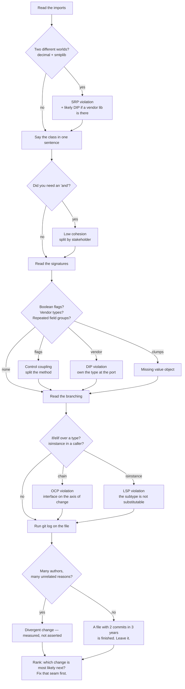

# Day 062 · System Design — Design principles revision and interview questions

**After today you can:** You can critique an unseen design using SOLID without sounding like a textbook.

**The interviewer asks it as:** *Here is a class. Which principles does it violate?*

---

## 1. What this is, and why they ask it

This is the closing day of the design-principles phase, and it is not a summary. It is a
**procedure**: a fixed order in which to read a piece of code you have never seen, so that by the end
of it you can say what is wrong, what evidence you have, and what you would change first. The eight
principles you have met — the five in SOLID, plus DRY, KISS and YAGNI, plus the coupling and cohesion
vocabulary — are the vocabulary. The procedure is what turns them into an answer.

They ask it because it is the cheapest possible test of whether you have used these ideas or read
about them. An interviewer puts sixty lines on the screen and says "what do you think?". Someone who
has only read about it says "it violates single responsibility" and stops. Someone who has done it
says "the imports are `decimal` and `smtplib`, which is finance and platform in one file; the
constructor takes a `psycopg` connection, so the domain depends on the driver; and there are four
boolean parameters, which is sixteen combinations of which about five are meaningful." Same principle
named. Completely different signal.

The other reason is that this round is a proxy for how you will behave on their codebase. They are
not really asking whether you can spot a violation. They are asking whether you will find one and
immediately rewrite the world, or find one and ask what changes most often.

---

## 2. The story

Vinay had two lakh rupees and wanted a second-hand scooter, and after three weeks of scrolling he had
found one he liked — a grey Activa, 2019, forty thousand on the clock, one owner, a flat in HSR
Layout. The photos were good. He was fairly sure about it before he had even seen it.

He took his mother's brother with him, because his mother made him. Ganesh has spent thirty-one years
in a garage in Kanakapura Road and does not like being hurried.

Vinay walked round the scooter twice, sat on it, and said it felt nice. That was his whole review.

Ganesh did not sit on it. He started at the front and did the same six things he does every time, in
the same order, and he told Vinay what each one was for as he went. He put a thumb on the tyre wall
and looked at the date stamped there — 2017. Older than the scooter, so the tyres had never been
changed. He opened the seat and looked at the underside of the storage bin for water marks, because a
scooter that has stood in a flood looks perfect from the outside. He started it cold and listened for
the first four seconds only, because that is when the noises are honest. He put it on the centre
stand and spun the front wheel with one finger and watched where it stopped, twice. He looked at the
two bolts holding the front panel and saw that the paint on their heads was gone, which means the
panel has been off, which means something happened at the front. And last he asked the owner one
question: what did you get done at the last service, and when.

Then he told Vinay: it is a good scooter, the engine is fine, someone has hit the front and had it
repaired reasonably, the tyres will cost you six thousand next month, and offer him eight thousand
less than he is asking.

On the way home Vinay asked how he knew all that. Ganesh said the useful part is not the knowing. It
is that he does the same six things in the same order on every single vehicle, so he never gets
talked out of one of them by a nice grey colour and a clean seat.

---

## 3. The idea in plain English

Vinay's review was a feeling. Ganesh's review was a **procedure** — the same checks, in the same
order, each one with a reason he could say out loud, ending in a judgement and a price.

A design critique in an interview is the same shape. The principles are the checks. Doing them in a
fixed order is what stops you from reading sixty lines, latching on to the first ugly thing, and
missing the two that matter.

Here is the whole phase in one table. Each row is a check, what it looks like when it fails, and the
move that fixes it.

| Principle | The check | The tell | The move |
|---|---|---|---|
| **Single responsibility** ([day 055](../day-055-quickselect/README.md)) | How many *people* would ask for a change to this file? | Two teams in the version history; imports from two worlds | Group methods by stakeholder, extract the most independent group |
| **Open/closed** ([day 056](../day-056-non-comparison-sorts/README.md)) | To add the next variant, do I edit this file or add one? | An `if`/`elif` chain over a type that keeps growing | Put an interface on the axis of change; new variant = new file |
| **Liskov substitution** ([day 057](../day-057-stability-and-pythons-sort/README.md)) | Can any subtype go anywhere the parent goes, without the caller knowing? | An override that `raise`s; `isinstance` in *callers* | Model the capability, not the taxonomy; or make it immutable |
| **Interface segregation** ([day 058](../day-058-custom-comparators/README.md)) | Does any caller depend on methods it never calls? | `NotImplementedError` in an implementation; fat test fakes | Split into role interfaces named after a capability |
| **Dependency inversion** ([day 059](../day-059-sorting-revision/README.md)) | Which way does the import arrow point? | Domain code importing `psycopg`, `stripe`, `boto3` | Put the interface in the policy's package, in its vocabulary |
| **DRY** ([day 060](../day-060-hash-tables/README.md)) | Is the same *fact* stated in more than one place? | A number like `18` for GST in nine files | Extract the fact, not the function |
| **KISS** ([day 060](../day-060-hash-tables/README.md)) | What is the fewest moving parts that solves the actual problem? | A registry and three abstract classes for four cases | Delete the mechanism, keep the dict |
| **YAGNI** ([day 060](../day-060-hash-tables/README.md)) | Can I name the second thing this generality is for? | `strategy` parameters with one implementation | Remove it until the second arrives |
| **Coupling / cohesion** ([day 061](../day-061-collisions/README.md)) | What crosses the boundary, and what is inside it? | Shotgun surgery, divergent change | Gather what is scattered, split what is piled up |

### The one sentence that ties them together

Every principle in that table is answering the same question in a different costume: **when the
requirements change, how much of this do I have to touch?**

Single responsibility says: keep the things that change for the same reason together. Open/closed
says: make the common change an addition rather than an edit. Liskov and interface segregation say:
make sure the abstraction you built to enable that actually holds. Dependency inversion says: point
the arrows so the stable code does not move when the volatile code does. DRY says: a fact should have
one home so a change to it has one edit. KISS and YAGNI say: do not pay for flexibility you cannot
name a use for.

Say that out loud in an interview and you have separated yourself from the person reciting five
acronyms.

### The order matters

Ganesh does not check the tyres last, and you should not check DRY first. The order below runs from
the checks that are cheap and factual to the ones that need judgement, so you say something concrete
in the first fifteen seconds and something considered in the last fifteen.

1. **The imports.** Free, factual, and it usually gives you two principles at once.
2. **The class name and a one-sentence description.** Count the "and"s.
3. **The signatures.** Boolean flags, long parameter lists, vendor types, data clumps.
4. **The branching.** `if` chains over a type, `isinstance` in callers.
5. **The state.** Which fields does each method touch? Two clusters means two classes.
6. **The history.** Who has edited this file, and for what? This is the only measurable one.

---

## 4. The picture

The review as a flow. Each diamond is one of Ganesh's six checks, and each one hands you a named
principle and a specific fix.



What to notice: every path ends at the same box. The output of a critique is not a list of
violations, it is **one ranked recommendation**. An interviewer who gets nine findings and no
priority learns that you would be exhausting to work with.

---

## 5. How it actually works

Here is the class. Read it before you read the analysis — this is the exercise, and it is very close
to what gets put on a screen in a real round.

```python
# reporting/report_manager.py
import csv
import smtplib
import psycopg
from decimal import Decimal
from datetime import date

TAX_RATE = None   # set at startup by main.py


class ReportManager:
    def __init__(self, conn: psycopg.Connection):
        self.conn = conn

    def generate(self, month: date, kind: str, email: bool = False,
                 as_csv: bool = False, include_tax: bool = True,
                 dry_run: bool = False) -> str:
        with self.conn.cursor() as cur:
            cur.execute("SELECT id, customer_id, amount_paise FROM orders "
                        "WHERE date_trunc('month', created_at) = %s", (month,))
            rows = cur.fetchall()

        total = Decimal(0)
        for row in rows:
            amount = Decimal(row[2]) / 100
            if include_tax:
                amount = amount * (1 + Decimal(TAX_RATE))
            total += amount

        if kind == "sales":
            body = f"Sales for {month}: {total}"
        elif kind == "tax":
            body = f"Tax collected: {total * Decimal(TAX_RATE) / (1 + Decimal(TAX_RATE))}"
        elif kind == "refunds":
            body = f"Refunds: {total}"
        else:
            raise ValueError(kind)

        if as_csv:
            with open(f"/tmp/{kind}.csv", "w") as handle:
                csv.writer(handle).writerows(rows)

        if email and not dry_run:
            server = smtplib.SMTP("smtp.internal", 25)
            server.sendmail("reports@acme.in",
                            self.owner.contact.email.address, body)
        return body
```

### Pass 1 — the imports

`csv`, `smtplib`, `psycopg`, `decimal`. Four worlds: file formatting, email delivery, the database
driver, and money arithmetic. Four different teams would ask for changes to those four things.

That is **single responsibility**, and the evidence is the import block, which took two seconds to
read. It is also **dependency inversion**, because `psycopg` is a vendor library and this is domain
code — `grep -rn "psycopg" reporting/` would return this file, which is the proof
[day 059](../day-059-sorting-revision/README.md) told you to run.

### Pass 2 — the name and the sentence

`ReportManager`. `Manager` is a noise word — it is the name you give a class when you cannot say what
it does. Try the sentence: "it fetches order rows from the database **and** computes a total **and**
applies tax **and** formats one of three report kinds **and** writes a CSV file **and** sends an
email." Five "and"s. That is **low cohesion**, of the **logical** kind — things grouped because they
are all vaguely "reporting".

### Pass 3 — the signatures

Four boolean parameters: `email`, `as_csv`, `include_tax`, `dry_run`. That is 2⁴ = **sixteen
combinations**, of which perhaps five are meaningful, and at least one is nonsense that compiles:
`email=False, dry_run=True` does nothing at all, silently. This is **control coupling** — the caller
is passing in a flag that picks a branch inside the callee, which means the caller has to know the
callee's internal structure.

`kind: str` is worse than it looks. It is a string that is really an enum of three values, checked at
run time, so a typo is a `ValueError` in production rather than a red squiggle in the editor.

And `conn: psycopg.Connection` in the constructor is the sentence from
[day 059](../day-059-sorting-revision/README.md) worth repeating: **this is dependency injection
without dependency inversion.** The collaborator is passed in, which looks like good practice, but
the type in the signature belongs to the driver, so nothing was inverted.

### Pass 4 — the branching

The `if kind == "sales" / "tax" / "refunds"` chain is the **open/closed** violation, and the test is
the one from [day 056](../day-056-non-comparison-sorts/README.md): can you name the fourth report
kind? If the product team has "settlements" on a roadmap, then yes — put an interface on that axis
and each kind becomes its own file. If three is genuinely the whole set and has been for two years,
leave the chain alone and say why. **Both answers are correct; only one of them is correct for this
codebase, and you have to ask.**

### Pass 5 — the state and the hidden global

`TAX_RATE = None`, set at startup by `main.py`, is **common coupling** — the worst rung on the ladder
after content coupling. Two concrete consequences, and give both: any test of this class must
remember to set a module-level global first or get `TypeError: conversion from NoneType to Decimal is
not supported`, and two tenants on two tax rates in one process is impossible without a code change.

`self.owner.contact.email.address` is a **message chain**: four dots, so this method depends on the
existence and shape of four classes to get one string. Law of Demeter. It is also a bug — `self.owner`
is never assigned, so this line raises `AttributeError: 'ReportManager' object has no attribute
'owner'` the first time anyone passes `email=True`, which tells you that path has no test.

### Pass 6 — the history

You cannot run `git log` on a screenshot, so say what you would run and what you expect:

```bash
git log --format='%an' -- reporting/report_manager.py | sort | uniq -c | sort -rn
```

If that shows commits from finance, from the platform team and from growth, you have **divergent
change** measured rather than asserted, and it is the single strongest sentence available in this
round because it is evidence rather than opinion.

### What real systems look like when this is done right

Every one of these principles is visible in software you already use, and naming a real product is
what stops the answer sounding like a textbook.

- **Open/closed:** Django middleware, pytest plugins, `sorted(key=)`, Kubernetes custom resources. In
  every case you add a file and a line in a list, and never edit the framework.
- **Dependency inversion:** SQLAlchemy Core versus your domain models; the twelve-factor rule that
  config comes from the environment. Postgres, MySQL and SQLite behind one `DBAPI` interface is the
  same shape.
- **Interface segregation:** `collections.abc` splits `Iterable`, `Sized`, `Container`, `Sequence`,
  `MutableSequence` rather than shipping one `Collection` with thirty methods. Go's `io.Reader` and
  `io.Writer` are one method each on purpose.
- **Liskov:** `java.sql.Date` extends `java.util.Date` and throws on the time methods, which is the
  standard-library example everyone cites. `Collections.unmodifiableList` is the same failure.
- **DRY, done wrong, at scale:** every company with a `common-utils` library that four teams depend
  on and nobody may change.

### The refactored version, in outline

Not because you would write it all on a whiteboard, but because the interviewer will ask what it
would look like.

```python
# reporting/ports.py — the interfaces, in the domain's vocabulary
class OrderRepository(Protocol):
    def orders_for_month(self, month: date) -> list[Order]: ...

class ReportDelivery(Protocol):
    def deliver(self, report: Report) -> None: ...

# reporting/reports.py — one file per kind, added not edited
class SalesReport:
    def build(self, orders: list[Order], tax: TaxRate) -> Report: ...

# adapters/postgres_orders.py — the only file that imports psycopg
# adapters/email_delivery.py — the only file that imports smtplib
```

Three things to point at when you show it. The `psycopg` import now exists in exactly one file. The
tax rate is a parameter, not a global. And `email`, `as_csv` and `dry_run` are gone, because choosing
a delivery is choosing an object rather than setting a flag.

---

## 6. The numbers

Design arguments lose to "we do not have time" unless you bring arithmetic. These are the numbers
this phase produced, gathered in one place because this is the round where you quote them.

**Adding the fourth report kind.**

```
 with the if/elif chain:
   files edited            1  (a shared 90-line file, on the critical path)
   existing tests re-run   40 (the whole reporting suite)
   live reports at risk    3
 with an interface:
   files added             1
   lines edited            1  (the registry)
   existing tests re-run   0
```

And the cost stays flat: the eighth kind costs what the fourth cost. With the chain, the eighth kind
is edited into a file that is now 200 lines and understood by nobody.

**Swapping the database driver.** Before: `grep -rn "psycopg" reporting/` returns 38 references
across 14 files, so the swap is a two-week project touching domain code. After: 1 new adapter file
and 1 wiring line.

**Testing "a partial month total is correct".**

```
 before:  start Postgres, load schema, insert 4 rows, set the TAX_RATE global,
          construct a connection            ~ 26 lines of setup, 180 ms per test
 after:   build 4 Order objects, call one function
                                            ~ 4 lines of setup, 0.1 ms per test
```

180 ms against 0.1 ms is **1,800×**, and with 400 such tests it is the difference between a 72-second
suite and a 40-millisecond one. That number is what actually persuades a team, because it is felt
every day rather than argued about once.

**The cost of the boolean flags.** 4 flags = 16 combinations. Testing them all is 16 test cases. In
practice a team tests 3 and the other 13 are undefined behaviour that somebody will eventually
discover in production.

**The cost of getting it wrong in the other direction.** From
[day 060](../day-060-hash-tables/README.md): the wrong abstraction grew from 24 lines to 71, from 6
tests to 14, and took about three days to untangle. Extracting a duplicate later costs ~20 minutes;
un-extracting a bad shared function costs **20 to 50× more**. That asymmetry is why "leave it
duplicated for now" is a real engineering answer and not laziness.

---

## 7. The trade-offs

### The principles contradict each other, and you should say so

This is the most valuable thing you can bring to this round, because it is the part that reading
blogs does not give you.

**DRY fights single responsibility.** Two teams have near-identical validation. DRY says extract it.
SRP says they change for different reasons, so they belong apart. SRP wins — different owners means
different futures.

**Open/closed fights KISS.** Every axis you leave open costs an interface, an extra file and a hop of
indirection — roughly 22 lines and 3 files per axis. Opening an axis you never use is pure cost
forever. KISS wins until you can name the second implementation.

**Interface segregation fights discoverability.** Six one-method interfaces make every caller's
dependency minimal, and make it impossible for a newcomer to answer "what can this thing do?". Stop
at three or four roles.

**Dependency inversion fights YAGNI.** A port and an adapter for a database you will never change is
108 lines of structure buying nothing — except that the test double counts as the second
implementation, which is usually enough to justify it on its own.

### What you give up by applying these at all

Indirection. Every one of these moves replaces a thing you can read with two things you have to jump
between. A new engineer reading the refactored version has to open four files to follow one report
being generated, where before they read one function top to bottom. That is a real cost paid by real
people, and pretending otherwise is how codebases end up with fifteen one-method classes.

### "I would not use this if..."

- **I would not invert a dependency if** I cannot name the second implementation, and the test double
  does not count because the thing is trivially fakeable in place.
- **I would not open an axis if** the set is genuinely closed — days of the week, the four blood
  groups, the three states an order can be in.
- **I would not extract a duplicate if** the two copies are owned by different teams, however
  identical they look today.
- **I would not split a class if** it is long but cohesive. A `Matrix` with forty methods is fine.
  Length is not the smell; **number of reasons to change** is.
- **I would not refactor at all if** `git log` shows two commits in three years. That file is
  finished. Refactor what changes.

### The trap in this interview round specifically

The trap is enthusiasm. You are shown bad code and invited to list what is wrong with it, and the
natural response is to list everything. Do not. Name the findings, then rank them, then say which
single change you would make first and what you would look at before making it. An interviewer is
imagining you on their codebase, and their codebase has a `ReportManager` in it that everybody knows
about and nobody has had time to fix.

---

## 8. In the interview

### How it gets asked

- The direct version: *"Here is a class. Which SOLID principles does it violate?"* Sixty lines on a
  screen, five minutes to read, then talk.
- The realistic version: *"Review this pull request. What comments would you leave?"* Same skill,
  and now the ranking matters more than the naming, because a review with nine blocking comments is
  a review nobody will act on.
- The abstract version: *"Explain SOLID."* This one is a trap dressed as a gift. Reciting five
  definitions is a mediocre answer. The good answer defines them **through one running example** and
  says what they have in common.
- The reversal: *"When would you not follow these principles?"* Asked to find out whether you are a
  person who has used them or a person who has read about them.

### What to say out loud, in the first ninety seconds

Do not start naming principles. Start with the two sentences that frame everything:

1. **Say what the code is for, in one sentence, and count your "and"s.** "This fetches orders for a
   month, computes a taxed total, formats one of three reports, optionally writes a CSV, and
   optionally emails it. That is five 'and's, so I already know it does more than one job."
2. **Say what you would need to know before recommending anything.** "Before I change anything I
   would want the version history of this file and the roadmap for report kinds, because the right
   fix depends on what actually changes."
3. **Then give three findings with evidence, not labels.** Imports, signatures, branching.
4. **Then rank.** "Of those, the one I would fix first is the database dependency, because it is
   what makes every test in this area slow, and slow tests are why the other problems never got
   fixed."
5. **Then say the thing you would leave alone.** "I would not touch the three-way `if` on report
   kind yet. Three is a small closed set. If there is a fourth coming, that changes."

That fifth point is the one candidates never make, and it is the one that reads as senior.

### The follow-ups

**"Which of those would you fix first, and why?"**
"The `psycopg` dependency, and my reason is testability rather than purity. Right now a test of the
tax arithmetic needs a running database, which is 180 milliseconds and a schema. With the repository
behind an interface it is four `Order` objects and a function call. That one change makes the others
cheap to attempt, because I would then have tests to refactor against."

**"Is that not over-engineering for a ninety-line class?"**
"It would be if I were doing it speculatively. I am doing it because there is a second implementation
today — the test double — and because the class already imports a driver, a mail library and a file
format, so it has three reasons to change. If this file had two commits in three years I would leave
it and spend the time elsewhere."

**"You said single responsibility. What is a responsibility?"**
"One reason to change, and a reason is a person or a role, not a topic. Here that is finance for the
tax arithmetic, the platform team for the driver, and whoever owns delivery for the email. Three
stakeholders in one file means one team's change can break another's without anybody meaning it."

**"How would you know if you had gone too far?"**
"When following one flow means opening four files and nothing in any of them makes a decision. Also
when interfaces have exactly one implementation and no test double. Fifteen one-method classes is the
same mistake as the god class, inverted — I would be optimising for a change that never comes."

**"Explain SOLID in one minute."**
"They are five answers to one question: when the requirements change, how much do I have to touch?
Single responsibility keeps things that change together in one place. Open/closed makes the common
change an addition rather than an edit. Liskov and interface segregation make sure the abstractions I
built for that actually hold — subtypes really are substitutable, and callers only depend on what
they use. Dependency inversion points the import arrows so the stable code does not move when the
volatile code does."

### A model answer

Asked: *here is `ReportManager`. What do you think?*

> "Let me say what it does first. It reads a month of orders from the database, computes a total,
> applies tax, formats one of three report kinds, optionally writes a CSV file, and optionally emails
> it. That is five 'and's, which is my first signal.
>
> The imports confirm it: `psycopg`, `smtplib`, `csv` and `decimal`. Those are four different worlds
> and four different teams. Finance owns the tax arithmetic, the platform team owns the driver,
> somebody else owns delivery. Single responsibility is about reasons to change, and there are at
> least three here.
>
> Two specific things I would raise in a review. The constructor takes a `psycopg.Connection`, so the
> reporting package depends on the database driver — that is injection without inversion, and its
> practical cost is that testing the tax arithmetic needs a running Postgres. And `TAX_RATE` is a
> module-level global set at startup, which is common coupling: tests have to remember to set it, and
> two tax rates in one process is impossible.
>
> On the signature, four booleans is sixteen combinations and about five meaningful ones — `email` is
> false with `dry_run` true does nothing at all. I would replace the flags with explicit calls or
> with a delivery object.
>
> The `if kind ==` chain is the open/closed candidate, but I would ask before changing it. If there
> is a fourth report kind coming this quarter, an interface pays for itself immediately. If three is
> the whole set and has been for two years, the chain is the simplest thing that works and I would
> leave it.
>
> If I could only do one thing: put the order fetch behind a repository interface owned by the
> reporting package. That is one new file and one wiring line, it takes the driver out of the domain,
> and it turns a 180-millisecond test into a 0.1-millisecond one. Everything else gets easier once
> there are fast tests to refactor against.
>
> And before doing any of it I would run `git log` on the file. If four teams have been editing it,
> that is divergent change measured rather than guessed, and it settles the argument. If two people
> have touched it in three years, the file is finished and I would leave it alone."

---

## 9. Recall card

- **All eight principles answer one question: when requirements change, how much must I touch?** SRP
  keeps co-changing things together · OCP makes the common change an addition · LSP and ISP keep the
  abstraction honest · DIP points the import arrows · DRY gives each *fact* one home · KISS and YAGNI
  refuse flexibility you cannot name a second use for.
- **Review in a fixed order, cheapest evidence first:** imports · one-sentence description (count the
  "and"s) · signatures (flags, vendor types, clumps) · branching (`if` chains, `isinstance` in
  callers) · state and globals · `git log`. The history is the only *measurable* check — 4 teams on
  one file is divergent change proved, not asserted.
- **Name findings with evidence, never with labels.** Not "violates SRP" but "`decimal` and `smtplib`
  in one import block". Not "too many parameters" but "4 booleans = 16 combinations, ~5 meaningful,
  and `email=False, dry_run=True` silently does nothing".
- **Always end on a ranking and a thing you would leave alone.** One first change, its reason
  (usually testability: 180 ms → 0.1 ms), and one honest "I would not touch the three-way `if` until
  somebody names the fourth kind."
- **The principles contradict each other and you should say so.** DRY loses to SRP when the owners
  differ · OCP loses to KISS until you can name implementation two · DIP loses to YAGNI unless the
  test double counts · and a file with two commits in three years is finished.
