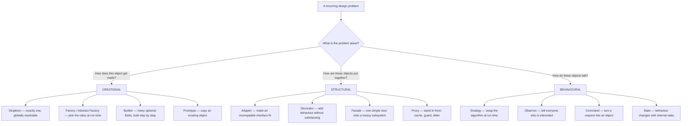

# Day 063 · System Design — What a design pattern actually is

**After today you can:** You can say why patterns exist and stop applying them where they do not belong.

**The interviewer asks it as:** *Which design patterns have you used, and why?*

---

## 1. What this is, and why they ask it

A **design pattern** is a name given to an arrangement of classes and objects that solves a problem
which keeps coming back. It is not a library you install and not a rule you follow; it is a
description of a solution that many people arrived at independently, written down so that the next
person does not have to arrive at it again. Every pattern has four parts — a **name**, the **problem**
it solves, the **solution** in outline, and the **consequences** of choosing it.

They ask it because it is a fast test of experience, and it is very hard to fake. Someone who has
read a list of patterns says "I have used singleton, factory and observer" and then cannot say what
the singleton cost them. Someone who has actually shipped code says "we used strategy for the pricing
rules because there were four countries and a fifth was coming, and it meant the fifth was a new file
rather than a fifth branch in a function twelve people depended on" — and then, unprompted, says what
they got wrong. The question is not really *which patterns*. It is *do you choose them for reasons*.

This day opens a two-week run through the patterns themselves. Everything after it — singleton,
factory, builder, adapter, decorator, facade, strategy, observer — assumes you can say what a pattern
is for, and, more importantly, when it is not.

---

## 2. The story

The hall behind the temple in Yelahanka is one long room with a stage at one end, and Ramesh has
looked after it for thirty-four years. It has a hundred and eighty folding chairs, fourteen long
tables, two ceiling fans that work and one that does not, and a store room at the back where all of
it lives.

People book it for everything. Weddings, birthdays, funerals, association meetings, school exams,
music classes, a man who once ran a course on filing tax returns.

When Ramesh started, every booking was a conversation. Where do you want the chairs, how many rows,
tables at the side or the back. Forty minutes on the phone, and half the time the person did not know
what they wanted, and he would end up moving everything again an hour before the event.

Somewhere around his fifth year he stopped asking that question and started asking a different one:
what kind of function is it?

Because there are only four ways he ever ends up arranging the room, and they are not his ideas —
they are just what works. For a function where people watch something, every chair faces the stage in
rows with a walkway up the middle. For a meeting, the tables go in a square in the middle and
everybody can see everybody's face. For an exam, single chairs spread out with a full arm's length
between them and nothing at the front. And for anything with food, chairs round the edges and the
tables in a line along the back wall, so the queue has somewhere to go and does not cut the room in
half.

He gave them names, dull on purpose. Stage side. Square. Spread out. Food line.

Now the phone call is ninety seconds. And when the two boys who help him arrive at six in the
morning, he says one of four words and goes to make tea, and it is right when he comes back.

He is also firm about one thing. A young man from the association once set the room up in the square
for a meeting of fifteen people, because it looked more important, and by the end everyone was
shouting across a table the size of a badminton court. Ramesh's view is that a name for something is
useful right up until people start choosing it because they like the name.

---

## 3. The idea in plain English

Ramesh did not invent four layouts. He noticed that the same four situations kept arriving, and that
each one had an arrangement that worked. Then he gave each arrangement a name so that a forty-minute
conversation became one word.

That is a design pattern, exactly. **Patterns are discovered, not invented.** Somebody notices that
the same shape of problem keeps appearing, that people keep solving it the same way, and writes it
down.

### The four parts of a pattern

Every properly written pattern has all four. When someone can only give you two of them, they have
read about it rather than used it.

| Part | Ramesh's version | In code |
|---|---|---|
| **Name** | "Square" | Adapter, Strategy, Observer |
| **Problem** | A meeting where everyone must see everyone | Two interfaces that must work together but cannot be edited |
| **Solution** | Tables in a square, chairs outside them | A class that implements the interface you want and forwards to the one you have |
| **Consequences** | Only works up to about thirty people; wastes the middle of the room | One more class, one more hop; the two sides stay independent |

**The consequences are the part everybody skips, and they are the part that matters.** The original
book gives each pattern roughly seventeen pages, and most of that length is consequences. A pattern
without its costs is a slogan.

### Where the idea comes from

The word was borrowed from building architecture. Christopher Alexander wrote *A Pattern Language* in
1977, cataloguing 253 arrangements of physical space that keep working — how wide a pavement should
be, where to put a window seat, why a room with light on two sides feels better than one with light
on one. His point was that these are not somebody's taste; they are solutions people converge on.

In 1994 four authors — Gamma, Helm, Johnson and Vlissides, together always called the **Gang of
Four** — did the same thing for object-oriented programming in a book called *Design Patterns*. They
catalogued **23 patterns** in three groups. Those 23 are what people mean when they say "design
patterns" without qualification, and every interview question about patterns is drawn from them.

### The three groups

**Creational — five patterns, all about *how objects get made*.** The problem they solve is that
`new Thing()` scattered through your code ties every caller to a concrete class.

Singleton · Factory Method · Abstract Factory · Builder · Prototype.

**Structural — seven patterns, all about *how objects are composed*.** How you put objects together
so the whole is usable without every part being exposed.

Adapter · Decorator · Facade · Proxy · Composite · Bridge · Flyweight.

**Behavioural — eleven patterns, all about *how objects talk to each other*.** Who calls whom, in
what order, and how that can change at run time.

Strategy · Observer · Command · Iterator · Template Method · State · Chain of Responsibility ·
Mediator · Memento · Visitor · Interpreter.

You will meet the eight that actually come up over the next two weeks. The other fifteen are worth
recognising by name and nothing more.

### What a pattern is not

This is the half that keeps people out of trouble.

**A pattern is not a library.** You cannot install adapter. It is a shape you write yourself.

**A pattern is not a rule.** SOLID gives you principles you should generally follow. Patterns are
options you should sometimes take. "This code does not use any patterns" is not a criticism.

**A pattern is not architecture.** Patterns are class-level. Microservices, event sourcing and CQRS
are architectural patterns, which is a different book and a different scale.

**A pattern name is not a class name.** A class called `PricingStrategy` is fine. A class called
`OrderFactoryFactoryBean` is a codebase telling you it stopped thinking. Name classes after what they
do in your domain, not after the shape they happen to be.

**And a pattern is not a goal.** The young man's square table was a real layout, correctly executed,
for the wrong function.

### The most important thing about patterns in Python

Many of the 23 exist because C++ and Java of 1994 could not do certain things. In a language with
first-class functions, several patterns collapse to nothing.

| Pattern | What it needs in Java | In Python |
|---|---|---|
| Strategy | An interface + one class per algorithm | A function passed as an argument |
| Command | An interface + a class per command | A closure, or `functools.partial` |
| Iterator | An interface + a class holding position | `yield` |
| Template Method | An abstract class + subclasses | A function taking a function |
| Singleton | A private constructor + a static holder | A module — it is imported once |

Peter Norvig made this point in 1996: of the 23 patterns, sixteen are either invisible or
substantially simpler in a dynamic language. This is worth saying in an interview, carefully. It is
not "patterns are useless in Python". It is "the *problem* each pattern solves is still real; in
Python the *solution* is often three lines rather than four files, and I would rather write the three
lines."

---

## 4. The picture

The three groups, and the one question each of them answers.



What to notice: the three groups are not three kinds of code, they are three kinds of *question*.
Before naming a pattern, name which of the three questions you are answering. Half of all pattern
misuse is answering a creational question with a structural pattern.

And here is the shape a pattern's write-up takes, which is also the shape your interview answer
should take:

```
        NAME  ..............  Strategy
              |
     PROBLEM  ..............  The pricing rule differs per country
              |               and a new country arrives every quarter
              |
    SOLUTION  ..............  An interface with one method; one small
              |               class per country; the caller holds a reference
              |
CONSEQUENCES  ..............  + a new country is a new file, not an edit
                              + each rule is testable alone
                              - one more indirection to follow when reading
                              - somebody must decide which one to use
```

Notice the minus signs. If your answer has no minus signs, you have described a slogan.

---

## 5. How it actually works

### How a pattern is actually applied

It is not "choose a pattern and apply it". It runs the other way, and this is the mechanic worth
learning.

1. **You feel a specific pain.** Not "this feels unstructured" — a real one. Adding a country means
   editing a function twelve people depend on. Testing this needs a live payment gateway. Every
   caller has to know six classes to do one thing.
2. **You name the axis that is moving.** Which thing keeps changing? Countries. Payment providers.
   Report formats. Notification channels.
3. **Now the pattern picks itself.** A varying algorithm is Strategy. A varying construction is
   Factory. A varying wrapper you want to stack is Decorator. An incompatible third party is Adapter.
   A messy subsystem the caller should not see is Facade.
4. **You write down what it costs before you write the code.** One more file, one more hop, one more
   place to look.

Step 1 is the one people skip, and skipping it is what produces the codebases everyone complains
about.

### Where you have already met them, in real products

Patterns are not academic. You have used all of these.

- **Decorator** — `java.io.BufferedReader(new FileReader(f))` is the textbook example: a reader
  wrapping a reader wrapping a reader, each adding one thing. In Python, `functools.lru_cache` wraps
  a function and adds caching without the function knowing.
- **Strategy** — `sorted(items, key=...)`. The comparison rule is a parameter. Python's `sorted` has
  no idea how you want things ordered, and that is the whole design ([day 058](../day-058-custom-comparators/README.md)).
- **Iterator** — every `for` loop in Python. `yield` builds one in four characters.
- **Adapter** — every database driver behind Python's DB-API. `psycopg`, `mysqlclient` and `sqlite3`
  present the same `connect`/`cursor`/`execute` surface over three entirely different wire protocols.
- **Facade** — `requests.get(url)`. Behind that one line are connection pooling, TLS negotiation,
  redirect handling, cookie storage, retries and content decoding, in about six subsystems you never
  touch.
- **Observer** — every event system. Kafka consumers, DOM `addEventListener`, Django signals,
  Kubernetes controllers watching the API server.
- **Factory** — Spring's `BeanFactory`, Django's `DEFAULT_FILE_STORAGE` setting, `logging.getLogger`.
- **Proxy** — nginx sitting in front of your application; an ORM's lazy-loading object that looks
  like your model until you touch a field and it fires a query
  ([day 041](../day-041-prefix-revision/README.md)).
- **Singleton** — Python's `logging` module, and the module system itself.

Being able to name two of these in an interview, unprompted, is worth more than reciting the
categories.

### What the write-up looks like, in code

Here is the same problem twice — a pricing rule that differs by country — done the two ways, so you
can see what the pattern buys and what it costs.

Without:

```python
def price(order: Order, country: str) -> Decimal:
    if country == "IN":
        return order.subtotal * Decimal("1.18")
    elif country == "AE":
        return order.subtotal * Decimal("1.05")
    elif country == "GB":
        return order.subtotal * Decimal("1.20")
    raise ValueError(country)
```

With Strategy, Python-style — no interface, no class hierarchy, just a mapping to functions:

```python
PRICERS: dict[str, Callable[[Order], Decimal]] = {
    "IN": lambda o: o.subtotal * Decimal("1.18"),
    "AE": lambda o: o.subtotal * Decimal("1.05"),
    "GB": lambda o: o.subtotal * Decimal("1.20"),
}

def price(order: Order, country: str) -> Decimal:
    return PRICERS[country](order)
```

That is Strategy. There is no class called `Strategy` anywhere, and there does not need to be. The
pattern is the *shape* — the varying part is a value that can be swapped — not the ceremony.

When would you take the ceremony? When a rule needs state, or three methods rather than one, or its
own tests and its own file because finance owns it. Then each becomes a class. The pattern is the
same; the weight is a separate decision.

---

## 6. The numbers

### The catalogue, by the numbers

```
 23 patterns in the Gang of Four book
  5 creational + 7 structural + 11 behavioural
 395 pages -> about 17 pages per pattern
```

Seventeen pages for something whose solution fits in half a page. The rest is problem, applicability,
consequences and known uses — which tells you where the value is.

Of the 23, roughly **eight** account for almost everything you will be asked about or will write:
Singleton, Factory, Builder, Adapter, Decorator, Facade, Strategy, Observer. Learning eight properly
beats recognising twenty-three.

### What the ceremony costs

The same three-country pricing rule, counted:

```
 if/elif chain              1 file,  9 lines
 dict of functions (Python) 1 file, 12 lines
 full Strategy classes      5 files, ~90 lines
   (1 interface + 3 implementations + 1 registry)
```

So the classes cost about **80 extra lines and 4 extra files**. That is not a reason never to do it —
it is the price, and you should know it before you quote it. It buys you: a fourth country as one new
file with zero edits to existing code, and each rule testable in isolation.

The break-even is easy to state. If you will add a fourth, fifth and sixth country, 80 lines spread
over six implementations is nothing. If three is the whole world, 80 lines is pure cost, forever.

### The vocabulary saving, which is the real one

This is the benefit people forget to quote, and it is measurable.

```
 explaining the arrangement from scratch, in a review:   ~4 minutes
 saying "this is an adapter":                            ~5 seconds
 design discussions in a 6-person team, per quarter:     ~20
 arrangements discussed per discussion:                   ~3
```

`20 × 3 × 4 minutes = 240 minutes` of explanation per quarter, against about five minutes if everyone
knows the words. **Four hours a quarter, per team, purely in vocabulary.** And that undercounts,
because the expensive failure is not the time — it is the two people who thought they had agreed and
had not.

### What over-application costs

The number from [day 056](../day-056-non-comparison-sorts/README.md) applies directly: every axis you
open speculatively costs roughly **22 lines and 3 files, forever**, plus one hop of indirection for
every future reader.

A real shape you will meet: a codebase with 14 classes ending in `Factory`, of which 9 have exactly
one implementation and no test double. Those 9 are `new Thing()` wearing a costume — about
`9 × 22 = 200` lines and 27 files that could be deleted, and every one of them is a redirection a new
engineer has to follow before finding out that nothing happens there.

### The one that justifies the whole idea

Adding the tenth payment provider:

```
 with an if/elif over provider:
   files edited              1 shared file, now ~400 lines
   existing tests re-run     ~60
   live providers at risk    9
 with adapter + factory:
   files added               1
   lines edited              1
   existing tests re-run     0
```

And, crucially, the tenth costs the same as the second. Flat cost is the actual product being sold
here.

---

## 7. The trade-offs

### What you give up, always

**Indirection.** Every pattern replaces one thing you can read with two or more things you must jump
between. Following one request through a facade, a strategy and a decorator means four files open. A
person joining the team pays that cost on their first day and every day after.

**A decision moves rather than disappearing.** Choosing a country's pricer at run time still requires
somebody to choose. The `if` did not vanish; it became a dictionary lookup, and the lookup can miss.
Say this out loud — it is the honest version of the open/closed argument.

**Names that outlive their reasons.** `PricingStrategy` still says "strategy" three years after
somebody deleted two of the three implementations. Now there is an interface with one
implementation, which is worse than no interface at all, because it looks deliberate.

### The failure modes, named

**Cargo cult.** Applying a pattern because it is a pattern. The young man's square table. The tell is
a class named after the pattern rather than the domain.

**Pattern hunting.** Reading code and looking for which pattern it is. Real code is mostly not any of
the 23, and that is fine.

**Patterns as a substitute for deleting code.** A god class with a factory in front of it is still a
god class.

**Premature patterning.** The single most common. You cannot see the axis of change until it has
changed at least once. Building the seam before then means you almost always build it in the wrong
place, and a seam in the wrong place is more expensive than no seam.

### "I would not use a pattern if..."

- **I cannot name the second implementation.** The test double counts; a hypothetical does not.
- **The variation is data, not behaviour.** Three tax rates are a dictionary, not three classes. This
  is the mistake that produces the 14 factories.
- **The set is genuinely closed.** Four blood groups, seven weekdays, three order states.
- **The language does it in three lines.** A function beats a Strategy class hierarchy in Python
  unless the strategy needs state or several methods.
- **It is the first occurrence.** Write it inline. Let the second occurrence show you where the seam
  is.

### The strongest thing you can say in this round

"The pattern I have regretted most is the one I applied before I had two implementations." Then name
one. Interviewers remember the candidate who volunteered a mistake with a reason, because everyone
else recites benefits.

---

## 8. In the interview

### How it gets asked

- The direct one: *"Which design patterns have you used, and why?"* Almost always open-ended, and
  almost always used as a way in to two follow-ups.
- The definitional one: *"What is a design pattern?"* Sounds like a gift. Most people answer with a
  list of names, which answers a different question.
- The sceptical one: *"Are design patterns still relevant?"* or *"Do you need patterns in Python?"*
  They are testing whether you have an opinion with reasons behind it, not whether you agree.
- The applied one: *"Here is a problem. Which pattern would you use?"* — which is really the reverse:
  can you go from a symptom to a shape, rather than from a name to a use.

### What to say out loud, in the first ninety seconds

1. **Define it in one sentence, with all four parts.** "A pattern is a named solution to a problem
   that keeps recurring, together with its consequences — and the consequences are the part that
   makes it useful rather than a slogan."
2. **Say what they are *for*, which is vocabulary as much as code.** "Half the value is that I can
   say 'that is an adapter' in a review and five people know exactly what I mean, instead of four
   minutes of description."
3. **Give one you have used, with the specific pain that caused it.** Not "I have used strategy" but
   "the pricing rule was different per country and a new country arrived each quarter."
4. **Give the consequence you accepted.** "The cost was that the rule for a country is no longer
   visible where the price is computed — you have to go and find the class."
5. **Give one you regret, or one you deliberately did not use.** This is the sentence that separates
   you.

### The follow-ups

**"Which pattern do you see misused most?"**
"Singleton, easily — it is a global variable with better manners, and it makes tests share state.
After that, factories with one implementation. I have worked in a codebase with fourteen classes
ending in `Factory` where nine had exactly one implementation and no test double. Those are `new
Thing()` with three extra files in front of it."

**"Do patterns still matter in a language with first-class functions?"**
"The problems do. Several of the solutions get much smaller. Strategy in Python is a function you
pass; command is a closure; iterator is `yield`; singleton is usually just a module. Norvig's point
in 1996 was that about sixteen of the twenty-three are invisible or trivial in a dynamic language,
and I think that is right. What survives is the vocabulary and the consequences — I still say 'that
is a decorator' about `lru_cache`, even though there is no `Decorator` class anywhere."

**"How do you decide whether to introduce one?"**
"I do not start from the pattern. I start from a pain: adding a country means editing a shared file;
testing this needs a live gateway. Then I name the axis that keeps moving. Once I have named the
axis, the pattern is usually obvious — a varying algorithm is strategy, a varying construction is a
factory, an incompatible third party is an adapter. And I wait for the second occurrence, because you
cannot see where the seam goes until something has actually changed."

**"Give me a pattern you removed."**
Have one ready. "We had an abstract factory producing one concrete factory. I deleted the interface
and the abstract class and called the constructor. Three files became one, and nothing else in the
codebase changed, which was the proof that the abstraction had never been doing anything."

### A model answer

Asked: *which design patterns have you used, and why?*

> "Let me start with what I think a pattern is, because it changes the answer. A pattern is a named
> solution to a problem that keeps recurring, along with its consequences. The name matters as much
> as the code — if I say 'that is an adapter' in a review, five people know what I mean in five
> seconds instead of four minutes.
>
> The three I have actually used and can defend are strategy, adapter and facade.
>
> Strategy: our pricing rule differed by country, and a country was being added roughly every
> quarter. With an `if`-chain, each new country meant editing a shared file that twelve people
> depended on and re-running about forty tests. We made the rule a value — in Python a function in a
> dictionary, not a class hierarchy — and a new country became one new entry. The consequence I
> accepted is that you can no longer see what a country charges by reading the price function; you
> have to go and find it.
>
> Adapter: we moved from one payment provider to another. The domain code had thirty-eight references
> to the vendor's SDK across fourteen files. We put an interface in our own package, in our own
> vocabulary — our `Money`, our `PaymentDeclined` — and wrote one adapter per provider. The second
> provider was then one new file and one wiring line.
>
> Facade: our checkout touched six services, and every caller had to know all six and the order to
> call them in. One entry point with one method fixed that. The risk with a facade is that it quietly
> becomes a god object, so we kept it to sequencing and put no business rules in it.
>
> The one I would push back on is singleton. It is a global variable with better manners. Every time
> I have used one, the pain has come out in tests, where two tests share state through it and the
> suite fails depending on the order it runs in.
>
> And the honest answer to 'why' is that I try not to reach for a pattern until something has changed
> at least once. Before that I cannot see where the seam goes, and a seam in the wrong place costs
> more than no seam at all."

---

## 9. Recall card

- **A pattern is a *name* + a recurring *problem* + a *solution* + its *consequences*.** The
  consequences are the half people skip — the original book spends ~17 pages per pattern, and most of
  it is costs. Patterns are **discovered, not invented**: Alexander's buildings in 1977, the Gang of
  Four's **23 patterns** in 1994.
- **Three groups, three questions.** Creational (5) = *how does this get made?* · Structural (7) =
  *how are these put together?* · Behavioural (11) = *how do these talk?* Eight of the 23 are almost
  all you will meet: singleton, factory, builder, adapter, decorator, facade, strategy, observer.
- **Go from pain to axis to pattern, never from pattern to code.** Name the specific pain, name the
  thing that keeps changing, and the pattern picks itself. Wait for the **second occurrence** — you
  cannot see the seam until something has moved.
- **In Python the shape survives and the ceremony often does not.** Strategy = a function ·
  command = a closure · iterator = `yield` · singleton = a module. Norvig, 1996: ~16 of 23 are
  invisible or trivial in a dynamic language. `sorted(key=)`, `lru_cache`, `requests.get`, the DB-API
  and nginx are all patterns you already use.
- **Quote both numbers.** Full Strategy classes cost ~80 extra lines and 4 extra files over an `if`
  chain, and buy a flat cost per new variant (the tenth costs what the second cost). Shared
  vocabulary saves a 6-person team ~4 hours a quarter. And 9 factories with one implementation each
  are ~200 lines of costume — **a pattern name is not a class name**.
