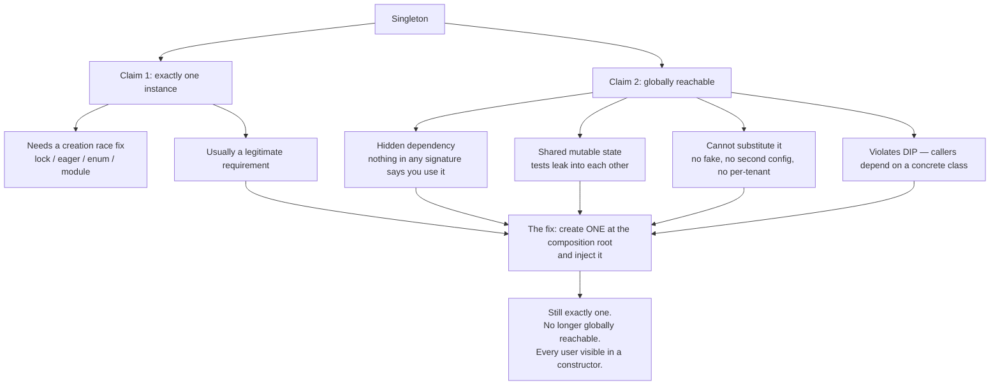

# Day 064 · System Design — Singleton

**After today you can:** You can implement it, and say why many engineers consider it an anti-pattern.

**The interviewer asks it as:** *Implement a thread-safe singleton. Now tell me why I should not use it.*

---

## 1. What this is, and why they ask it

**Singleton** is the pattern that guarantees a class has exactly one instance, and gives everybody a
global way to reach it. It is the first of the five creational patterns, the shortest to write, and
the most argued about. Two separate promises are packed into that one sentence — *exactly one* and
*globally reachable* — and almost all the trouble comes from the second one.

They ask it constantly, and they ask it in a very specific two-part shape. First "write me a
thread-safe singleton", which is a concurrency question wearing a pattern's clothes — they want to
see whether you know that the naive version has a race, and whether you know what double-checked
locking is and why it was broken for years. Then "now tell me why you should not use it", which is
the real question. The first part is knowledge; the second part is judgement, and a candidate who
sails through the code and then cannot say what it costs has just demonstrated the exact problem the
question was designed to find.

There is also a distinction hiding in here that separates good answers from great ones: **needing one
instance is not the same as using the Singleton pattern.** Almost every case where people reach for
Singleton is actually satisfied by creating one object at startup and passing it around.

---

## 2. The story

The residents' association at the flats in Kammanahalli owns one ladder.

It is aluminium, about twelve feet, and it lives behind the generator room. Nobody remembers buying
it. Everybody uses it — for the water tank float, for the ceiling fan in the corridor, for the tube
light outside flat 302, for putting up the lights at Deepavali.

The rule about it is not written anywhere. If you need the ladder, you go and get the ladder. Nobody
signs for it. Nobody is asked. This works for years at a time, and it is genuinely convenient — a
new family moves in, somebody tells them where it is, and that is the whole system.

Three things have gone wrong with it, and they went wrong in a way that took people a while to see.

The first is that when it is not behind the generator room, finding it is somebody's whole afternoon.
It could be in any of forty flats. There is no way to know except knocking.

The second happened in 2019. The old secretary handed over in March and neither the new secretary nor
the new treasurer knew where the ladder lived. Both of them went out and bought one. They found out
three weeks later, when both ladders turned up in the corridor on the same evening. Two hundred
rupees short of nine thousand, spent twice, because two people checked at the same time, both found
nothing, and both acted.

The third is the one that actually costs. Last April a man on the third floor was leaning it against
the tank and the bottom rung went. Not badly, but enough that nobody would stand on it. For eleven
days the corridor light stayed out, the tank float stayed broken, and a family who wanted to paint
their balcony could not, because in forty flats there was exactly one ladder and no plan for what
happens when there is none.

They talked about it at the next meeting. Somebody said they should keep two. Somebody else said the
real problem is that nobody knows who has it. In the end they did something duller and better: the
watchman keeps it, and if you want it you ask him and he writes your flat number down. Slightly more
annoying, nothing has gone wrong since — and it is now possible to answer "who has the ladder".

---

## 3. The idea in plain English

The ladder is a **singleton**: there is exactly one, and everybody knows how to get at it without
being given it. Both halves are doing work, and they cause different problems.

**"Exactly one"** is usually fine and often necessary. One connection pool, one configuration, one
logging destination.

**"Everybody can reach it without being handed it"** is the part that hurts. When flat 302 uses the
ladder, nothing anywhere records that flat 302 depends on the ladder. You cannot tell by looking at
the flat. That is a **hidden dependency**, and it is the same criticism as the one against global
variables — because a singleton *is* a global variable with a constructor attached.

The three failures in the story map exactly onto the three things people mean when they call
Singleton an anti-pattern.

| The story | In code |
|---|---|
| Nobody knows who has the ladder | Hidden dependencies — usage does not appear in any signature |
| Two people both bought one | The creation race — the reason "thread-safe" is in the question |
| Eleven days with no ladder at all | Shared mutable state and a single point of failure; and in tests, one test's changes leaking into the next |

And the fix they landed on is exactly the fix in code: **the watchman.** One ladder still, but now
somebody owns it, hands it out, and knows who has it. That is one instance created in one place and
handed to whoever needs it — which is *not* the Singleton pattern, and is almost always what you
actually wanted.

### The distinction that matters most

> **"I need exactly one of these" is a requirement. "Singleton" is one way to meet it, and usually
> the worst one.**

The alternative is to create one instance where your program starts up — the **composition root**,
from [day 053](../day-053-merge-sort/README.md) — and pass it to whoever needs it. You still have
exactly one. You have not made it globally reachable, so every user of it is visible in a
constructor, and a test can hand over a different one.

Say that sentence in the interview. It is the single highest-value thing in this lesson.

### The naive implementation, and its race

```python
class ConnectionPool:
    _instance = None

    @classmethod
    def get_instance(cls) -> "ConnectionPool":
        if cls._instance is None:          # 1. check
            cls._instance = ConnectionPool()   # 2. create
        return cls._instance
```

Read it as two steps: check, then create. Now put two threads in it. Thread A runs step 1 and finds
`None`. Before it reaches step 2, the operating system switches to thread B, which also runs step 1
and also finds `None`. Both create. **You have two connection pools**, both of which think they are
the only one, and half your program is holding one and half the other.

This is the secretary and the treasurer, and it is why the question says "thread-safe".

### The fixes, in the order they were invented

**Eager creation.** Build it when the class is first loaded, before anybody can ask.

```python
class ConnectionPool:
    _instance = None

ConnectionPool._instance = ConnectionPool()   # at import time
```

No race, because there is no check. The cost is that you pay for it even if nobody uses it, and you
lose control of *when* it is built — which matters if building it opens a socket.

**A lock around the whole thing.**

```python
import threading

class ConnectionPool:
    _instance = None
    _lock = threading.Lock()

    @classmethod
    def get_instance(cls) -> "ConnectionPool":
        with cls._lock:
            if cls._instance is None:
                cls._instance = ConnectionPool()
            return cls._instance
```

Correct, and every single call takes the lock forever afterwards, including the millionth call when
the answer has been sitting there for an hour.

**Double-checked locking.** Check without the lock; only take the lock if it looks unset; check
again inside.

```python
    @classmethod
    def get_instance(cls) -> "ConnectionPool":
        if cls._instance is None:              # cheap check, no lock
            with cls._lock:
                if cls._instance is None:      # the second check
                    cls._instance = ConnectionPool()
        return cls._instance
```

This is the one interviewers are fishing for, and the interesting part is its history: **in Java it
was broken until 2004.** The compiler and the CPU are allowed to reorder the write that assigns the
reference and the writes that fill in the object's fields, so another thread could see a non-null
reference pointing at a half-built object. The fix was the `volatile` keyword under Java 5's new
memory model. Being able to say that sentence is worth a lot in this question.

**The one you would actually write in Java:** an `enum`.

```java
public enum ConnectionPool {
    INSTANCE;
    public void borrow() { ... }
}
```

Joshua Bloch's recommendation in *Effective Java*. The JVM guarantees an enum constant is created
once, it is thread-safe with no code, and it is the only version that survives serialisation and
reflection attacks.

### The Python versions

In Python, most of this ceremony is unnecessary, and saying why is a strong answer.

**A module.** Python imports a module once per process and caches it in `sys.modules`. So a
module-level object *is* a singleton, created lazily, thread-safely, with no code at all.

```python
# pool.py
pool = ConnectionPool()

# anywhere else
from pool import pool
```

**A cached factory function.**

```python
from functools import cache

@cache
def get_pool() -> ConnectionPool:
    return ConnectionPool()
```

`functools.cache` remembers the result, so the object is built once, on first use. This is the
version worth writing in an interview, because it is three lines and it is lazy.

**Overriding `__new__`,** which is the version people expect to see and the one with a real trap:

```python
class ConnectionPool:
    _instance = None
    _lock = threading.Lock()

    def __new__(cls) -> "ConnectionPool":
        if cls._instance is None:
            with cls._lock:
                if cls._instance is None:
                    cls._instance = super().__new__(cls)
        return cls._instance

    def __init__(self) -> None:
        self.size = 10        # <- runs on EVERY ConnectionPool() call
```

The trap: `__new__` returns the existing object, and then Python calls `__init__` on it **again**,
every time. Any state set in `__init__` is reset on each call. This bug is subtle, common, and
exactly the kind of thing an interviewer is delighted to find.

---

## 4. The picture

The two claims a singleton makes, and which one causes which problem.



What to notice: every arrow into the fix comes from claim 2, not claim 1. Nobody objects to having
one connection pool. They object to any function anywhere being able to summon it.

Now the race, drawn on a timeline, because this is what the interviewer wants you to be able to
describe:

```
 time ->

 thread A   ...check _instance -> None ......................... create -> POOL#1
                                    \
 thread B   .......................  check _instance -> None ... create -> POOL#2
                                        ^
                              A has not assigned yet,
                              so B also sees None

 result: two pools. A holds POOL#1, B holds POOL#2, and
         cls._instance ends up as whichever wrote last.
```

The gap between the check and the assignment is the whole bug. It is usually a few nanoseconds wide,
which is why it passes every test you write and fails in production at three in the morning under
load.

---

## 5. How it actually works

### The mechanics, precisely

A singleton needs three things: a private way to construct the object so nobody can make a second, a
place to store the one instance, and a public way to get at it.

- **Java:** private constructor, `private static Instance instance`, `public static getInstance()`.
- **Python:** there is no private constructor. You cannot stop somebody calling `ConnectionPool()`,
  which is precisely why the module-level object and the cached function are preferred — they do not
  pretend to enforce something the language will not enforce.
- **Lifetime:** the instance lives as long as the class is loaded, which in practice means as long as
  the process. There is no destructor you can rely on. Anything holding a socket or a file handle
  gets closed at process exit, or not at all.

### The one that surprises people: a singleton is not global

This is worth its own heading because it is a genuine production issue and a very good thing to
volunteer.

A singleton is one instance **per process**, not per system. Run your Django application under
Gunicorn with eight workers and you have **eight** of them. Run four containers of that and you have
thirty-two. In Java it is one per class loader, which is why an application server hosting three
applications has three.

So if the thing you made a singleton is a cache, you now have thirty-two caches that disagree with
each other. If it is a rate limiter, your limit is thirty-two times what you configured. **Anything
that must be genuinely single across a system belongs in Redis or the database, not in a
`getInstance()`.**

### Real products that use it, and how

- **Python's `logging` module.** `logging.getLogger("app.orders")` returns the same logger object for
  the same name, every time, from a module-level registry. This is really a *multiton* — one instance
  per key — and it is the well-behaved cousin.
- **`None`, `True` and `False`** are singletons in CPython, which is why `x is None` works. Small
  integers from -5 to 256 are interned singletons too.
- **`Runtime.getRuntime()`** in Java, and `Calendar.getInstance()` — the latter being a factory
  method that does *not* return a singleton, which is a naming trap.
- **Spring beans are singleton-scoped by default,** and this is the important example. There is one
  instance of each bean per container — but the container *injects* it into constructors. So you get
  the "exactly one" without the "globally reachable". Spring took the good half and threw away the
  bad half, and saying that shows you understand the distinction.
- **Database connection pools** — HikariCP, `psycopg_pool`, SQLAlchemy's engine. Genuinely one per
  process, and the canonical legitimate use.
- **Django's `settings`** object. One per process, imported everywhere, and famously awkward to
  override in tests, which is why Django had to ship a dedicated `override_settings` decorator. That
  decorator existing at all is the cost of the pattern, made visible.

### What "inject it instead" looks like

```python
# main.py — the composition root, the only place this is constructed
def main() -> None:
    pool = ConnectionPool(size=10)
    repository = OrderRepository(pool)
    service = OrderService(repository)
    serve(service)
```

One pool. Created once. Everyone who uses it says so in a constructor, so `OrderService`'s
dependencies are readable from its signature, and a test can pass a fake pool without touching any
global. That is the whole alternative, and it is four lines.

---

## 6. The numbers

### The cost of the lock, if you use the naive fix

Taking an uncontended lock in Python is roughly 40-60 nanoseconds; in Java an uncontended
`synchronized` block is a few nanoseconds after biased locking, and tens of nanoseconds under
contention.

```
 get_instance() called 10,000,000 times in a request-heavy service
 always-lock version:   10,000,000 x 50 ns  = 0.5 seconds of pure lock overhead
 double-checked:        10,000,000 x  2 ns  = 0.02 seconds
```

Half a second of CPU per ten million calls is not catastrophic, but it is also completely
unnecessary, and under contention it is far worse because threads serialise on a value that has not
changed since startup. This is why double-checked locking was invented, and why it is worth being
able to explain rather than just name.

### The multi-process arithmetic

```
 1 Gunicorn worker   ->  1 instance
 8 workers            ->  8 instances
 4 containers x 8     -> 32 instances
```

If that singleton was an in-memory cache sized at 500 MB "because we only have one", your pods now
need **16 GB** of memory instead of 500 MB, and the caches disagree. If it was a rate limiter set to
100 requests per second, your real limit is **3,200 per second**.

### What it costs in the test suite

This is the number that actually persuades teams, and it is the same shape as
[day 062](../day-062-sets/README.md)'s argument.

```
 test needs a different config:
   with a singleton:  reach into the class, overwrite _instance, remember to
                      restore it in teardown, and hope no test runs in parallel
                      ~ 8 lines of setup + 3 of teardown, per test file
   with injection:    pass a different object to the constructor
                      ~ 1 line
```

And the failure mode that costs the real time: **order-dependent tests.** One test mutates the
singleton, a later test reads it, and the suite passes locally and fails in CI because the runner
shuffled the order. A team hunting one of those loses somewhere between half a day and three days,
and it will happen more than once.

A concrete shape: a suite of 400 tests where 30 touch a singleton config. Run in a random order, the
chance that at least one leaks is high enough that you will see a flaky failure roughly weekly. The
usual "fix" is to disable parallel test execution, which turns a 40-second suite into a 6-minute one
— and now everybody runs the tests less often.

### When the singleton is genuinely right

```
 connection pool:  1 process x 20 connections = 20 sockets
 no pooling:       500 requests/sec x 1 connection each = 500 connections
                   Postgres default max_connections = 100  ->  refused
```

That is a real reason to have exactly one pool, and nobody sensible argues with it. Notice that the
argument is entirely about "exactly one" and says nothing about global reachability.

---

## 7. The trade-offs

### What you give up

**Testability, first and worst.** A singleton is shared state that outlives a test. Tests stop being
independent, order starts mattering, and the eventual response is usually to stop running them in
parallel.

**Honest signatures.** `OrderService.__init__(self)` taking no arguments looks like a class with no
dependencies. If it calls `ConnectionPool.get_instance()` inside a method, it has one and you cannot
see it. Every reader has to grep the body to find out what it needs.

**The ability to have two.** Then a second tenant arrives, or a read replica, or staging config
alongside production config in one process, and "exactly one" turns out to have been an assumption
rather than a requirement. Un-singletoning something used in 200 places is a multi-week change.

**Dependency inversion.** `ConnectionPool.get_instance()` in domain code is a hard reference to a
concrete class — the exact violation from [day 059](../day-059-sorting-revision/README.md). The
import arrow points the wrong way, and no interface can be slid in without changing every call site.

**A clear lifetime.** When is it destroyed? What happens if it holds a socket and the network drops?
There is no owner, so there is nobody to reconnect it.

### What you get

Convenience, honestly. No wiring. A new piece of code can use the shared thing without anybody
threading it through four constructors. On a small script, or a genuinely process-wide, immutable,
infrastructure-level concern, this is a fair trade — and pretending otherwise is why people stop
listening to design advice.

### "I would not use this if..."

- **...the object holds mutable state.** A stateless helper as a singleton is nearly harmless. A
  mutable cache or config is where every problem comes from.
- **...anything needs to be substituted in tests.** Which, for anything touching the network, the
  clock or the filesystem, is everything.
- **...there is any chance of a second one being wanted.** Second tenant, second region, second
  database. Ask "could there ever be two?" and take the answer seriously.
- **...the uniqueness must hold across processes.** It will not. That belongs in Redis or Postgres.
- **...I am reaching for it to avoid passing an argument.** That is the real motivation about eighty
  percent of the time, and it is not a good one.

### When it is defensible

Process-wide infrastructure that is expensive to create, effectively immutable after startup, and
that genuinely must be shared: a connection pool, a metrics registry, a logging configuration, a
thread pool. And even then, the better form is: **create one at the composition root and inject
it.** You keep uniqueness and give up nothing.

---

## 8. In the interview

### How it gets asked

- The two-parter, almost verbatim: *"Implement a thread-safe singleton. Now tell me why I should not
  use it."* The second half is where the marks are.
- *"What is wrong with double-checked locking?"* A Java concurrency question that expects you to know
  about instruction reordering and `volatile`.
- *"How would you do a singleton in Python?"* Testing whether you reach for a metaclass or know that
  a module already is one.
- The disguised version: *"How would you make sure there is only one connection pool?"* — where the
  right answer is usually not the pattern at all.

### What to say out loud, in the first ninety seconds

1. **Split the two claims immediately.** "Singleton makes two promises: exactly one instance, and a
   global way to reach it. The first is often a real requirement; almost all the criticism is of the
   second."
2. **Write the naive version and point at the race before being asked.** "Check, then create. Two
   threads can both pass the check before either assigns, and you get two."
3. **Give the fixes in order, with the cost of each.** Eager (pay always), locked (pay every call),
   double-checked (pay once — and mention the Java memory-model history).
4. **Say what you would actually write in this language.** In Python: a module-level object, or
   `@cache` on a factory function. In Java: an `enum`.
5. **Then volunteer the criticism before they ask for it.** That is the move. "I should say I would
   rarely reach for it — the requirement is usually 'one instance', which I would satisfy by
   constructing it once at the composition root and injecting it."

### The follow-ups

**"Why was double-checked locking broken in Java?"**
"Because the write that publishes the reference and the writes that initialise the object's fields
could be reordered by the compiler or the CPU. A second thread could see a non-null reference to a
half-constructed object, pass the outer check, and use it. Java 5's memory model fixed it, provided
the field is declared `volatile`, which gives you the happens-before relationship you need."

**"Is a singleton thread-safe once it is created?"**
"Creating it once is thread-safe. Using it is not, and that is a different question people conflate.
If the single instance has mutable state, every thread in the process is sharing it, so you need
locking inside it as well. One instance means maximum sharing, which means maximum contention."

**"How do you test code that uses one?"**
"With difficulty, which is the argument. You end up reaching into the class to replace the private
instance and restoring it in teardown, which breaks under parallel test runners. Django ships an
`override_settings` decorator precisely because its settings object has this problem. My preferred
answer is to not be in that position: inject it, and a test passes a different object in one line."

**"Give me a case where you would use it."**
"A connection pool. Postgres has a `max_connections` of 100 by default, and 500 requests a second
each opening their own connection would be refused, so exactly one pool per process is a real
requirement. But I would still construct it in `main` and pass it down rather than exposing
`getInstance`, because that keeps the uniqueness and loses the global reach."

**"Is it really one per system?"**
"No, and that catches people out. It is one per process — or per class loader in Java. Eight Gunicorn
workers give you eight; four containers of eight give you thirty-two. So if it is a cache, thirty-two
caches disagree with each other, and if it is a rate limiter, your real limit is thirty-two times what
you set. Anything that must be single across a system belongs in Redis or the database."

### A model answer

Asked: *implement a thread-safe singleton, then tell me why I should not use it.*

> "Singleton makes two promises: that there is exactly one instance, and that anyone can reach it
> without being handed it. I will do the code first, and then I want to separate those two, because
> the criticism is almost entirely of the second.
>
> The naive version stores the instance on the class and creates it on first request — check, then
> create. That has a race: two threads can both run the check before either one assigns, so both
> create, and you end up with two objects each believing it is the only one. Half your program holds
> one and half holds the other.
>
> The fixes, in the order they were invented. Eager creation at class-load time removes the check
> entirely, but you pay for the object even if nobody uses it, and you lose control of when it is
> built — which matters if it opens sockets. A lock around the whole method is correct but takes the
> lock on every call forever, including the ten-millionth call. Double-checked locking checks without
> the lock, takes the lock only if it looks unset, and checks again inside. That is the standard
> answer, and the historical footnote is that it was broken in Java until version 5, because the
> reference could be published before the object's fields were initialised — you need `volatile` for
> the happens-before guarantee.
>
> In Java today I would write an `enum` with one constant, which is Bloch's recommendation: the JVM
> guarantees single creation and it survives serialisation. In Python I would not write any of this,
> because a module-level object already is a singleton — the interpreter imports a module once per
> process — or I would put `functools.cache` on a factory function, which gives me laziness in three
> lines. I would avoid overriding `__new__`, because `__init__` still runs on every call and resets
> the object's state, which is a bug people hit repeatedly.
>
> Now the second half. I would rarely use the pattern, and my reasoning is that 'I need exactly one'
> and 'everyone can reach it globally' are separate things, and only the first is ever the
> requirement. The global reach costs me four things. Dependencies stop being visible — a class that
> calls `getInstance` inside a method looks like it has no dependencies. Tests stop being
> independent, because state leaks between them and the suite becomes order-dependent, which is the
> kind of flake that costs days. I cannot substitute it, so a second tenant or a read replica becomes
> a multi-week change. And it is a concrete reference from my domain code to a specific class, which
> is a dependency-inversion violation with no seam to fix it.
>
> What I do instead is construct exactly one at the composition root and pass it in. I still have
> exactly one, every user of it is visible in a constructor, and a test hands over a different object
> in one line. Spring does exactly this — its beans are singleton-scoped, but the container injects
> them rather than exposing a static accessor. It kept the good half.
>
> One last thing worth saying: a singleton is one per process, not one per system. Eight workers give
> you eight of them, and four containers give you thirty-two. If it is a cache they disagree; if it
> is a rate limiter your limit is thirty-two times what you configured. Anything that must be truly
> single belongs in Redis or the database."

---

## 9. Recall card

- **Two promises, and only the second is the problem.** *Exactly one instance* is often a real
  requirement; *globally reachable* buys hidden dependencies, shared mutable state, no substitution,
  and a DIP violation. **A singleton is a global variable with a constructor.**
- **The race is check-then-create.** Fixes in order: eager (always pay) · lock every call (~50 ns
  forever) · **double-checked locking** (~2 ns after the first) — and in Java it was *broken until
  Java 5* because the reference could be published before the fields were initialised; you need
  `volatile`. In Java write an **`enum`**; in Python a **module-level object** or `@cache` on a
  factory. Never override `__new__` alone — **`__init__` re-runs on every call** and resets state.
- **Say the distinction: needing one instance ≠ using Singleton.** Create one at the **composition
  root** and inject it. Same uniqueness, visible dependencies, one-line test substitution. Spring's
  beans are singleton-*scoped* but injected — it kept the good half.
- **It is one per *process*, not per system.** 8 Gunicorn workers = 8; 4 containers × 8 = 32. A cache
  becomes 32 disagreeing caches; a 100/sec rate limiter becomes 3,200/sec. True system-wide
  uniqueness lives in Redis or Postgres.
- **The legitimate cases are process-wide, expensive, and immutable after startup:** connection pools
  (Postgres `max_connections` = 100 vs 500 req/sec), metrics registries, logging config, thread
  pools. Django's `override_settings` decorator exists *because* settings is a singleton — that
  decorator is the cost made visible.
