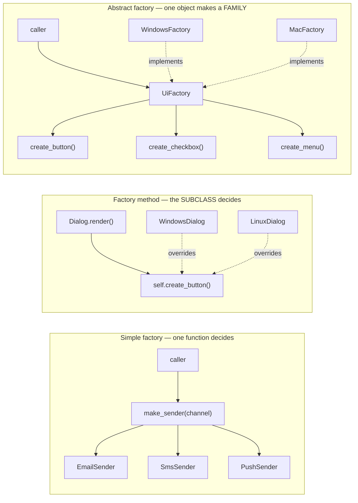

# Day 065 · System Design — Factory and abstract factory

**After today you can:** You can hide object creation behind a factory and say what that buys you.

**The interviewer asks it as:** *How do you create the right notification object for each channel?*

---

## 1. What this is, and why they ask it

A **factory** is code whose job is to decide which concrete class to build and to hand back something
the caller can use without knowing which one it got. It exists because `EmailSender()` written in the
middle of your business logic ties that logic permanently to email. An **abstract factory** goes one
step further: it hands back a whole *family* of matched objects, so you cannot accidentally mix parts
from two families.

They ask it because it is the pattern that tests whether you understand the difference between
"where an object comes from" and "what an object does" — and because there are three different things
in common use that people all call "factory", and being able to separate them immediately marks you
out. There is the **simple factory**, which is not in the Gang of Four book at all and is what nearly
everyone actually writes; **factory method**, which uses subclassing; and **abstract factory**, which
is about families. Candidates who say "a factory creates objects" and stop have given a correct and
almost worthless answer.

The second reason is that factories are the most over-applied pattern after singleton. A codebase
with fourteen classes ending in `Factory`, nine of which have one implementation, is extremely
common. An interviewer wants to hear that you know when *not* to write one.

---

## 2. The story

The uniform shop opposite the bus stand in Malleswaram has been there longer than most of the schools
it supplies. One room, floor to ceiling shelves, and a man called Iqbal behind a wooden counter with
a groove worn into it where he leans.

A parent comes in with a child in June. They do not say what they want in the way you might expect.
They say: third standard, girl, Saint Anthony's.

That is the whole conversation. They do not choose the colour, the fabric, the collar, whether the
socks are ankle or knee, or which of the four shades of blue is right. They would not know. Iqbal
knows.

He turns round, and what comes back over the counter is a set — the shirt, the pinafore, the tie, the
socks, the belt with the school's little metal clasp. Everything matched, everything from the same
school's specification, because the specification is a real thing that the school sends him every
year and he keeps on the shelf with everything else.

The matching is not a nicety. Saint Anthony's blue and Vidya Mandir blue look identical in the shop
and completely different in daylight next to each other. A child who turns up in a Saint Anthony's
shirt and a Vidya Mandir tie gets sent to the office. Iqbal has seen it happen twice, both times
because a parent bought half a set somewhere else.

Two things about how he runs it are worth noticing.

The first is that when a new school opened in Mathikere three years ago, nothing about the counter
changed. He learned one more specification, put one more set of things on one more shelf, and the
conversation with a parent is word for word what it always was. He did not have to change how he
serves anybody else.

The second is the thing that genuinely costs him. Two years ago the schools started requiring a
blazer. Not one school — all of them. And that meant going back to every single specification he
holds, one at a time, and working out what that school's blazer is: the colour, the buttons, the
badge, whether it is worn in December only. Eleven schools, eleven separate pieces of work, and until
he had done all eleven he could not tell a parent he stocked blazers. Adding a school is easy. Adding
a *garment* is not.

---

## 3. The idea in plain English

Iqbal's counter is a **factory**. The parent asks for a thing by what they need — third standard,
girl, Saint Anthony's — and gets back something usable without ever naming a product. The knowledge
of which exact product that is lives in one place, behind the counter.

The matched set is an **abstract factory**. The unit is not a shirt; it is a *family* of things that
must be consistent with each other. And the mismatched tie is exactly the bug that abstract factory
exists to make impossible.

The two things Iqbal noticed are the two halves of the trade, and you should be able to say both.

**Adding a school changed nothing at the counter.** That is open/closed from
[day 056](../day-056-non-comparison-sorts/README.md): a new family arrives as new code, and the
calling code is untouched.

**Adding a blazer meant editing all eleven specifications.** That is the known weakness of abstract
factory, it has been known since 1994, and volunteering it in an interview is worth a great deal.
A new *family* is cheap. A new *product type* is expensive.

### The three things people call "factory"

This distinction is the lesson. Get it clear and the rest is detail.

**One — the simple factory.** A function, or a static method, that takes some input and returns the
right concrete object. It is not one of the 23 patterns. It is what nearly everybody writes and it is
usually correct.

```python
def make_sender(channel: str) -> Sender:
    if channel == "email":
        return EmailSender()
    if channel == "sms":
        return SmsSender()
    if channel == "push":
        return PushSender()
    raise ValueError(channel)
```

The `if` chain has not disappeared from the world; it has been moved into one place that every
caller shares. That is the entire benefit, and it is a real one — the branch existed in nine call
sites before and exists in one now.

**Two — factory method.** A method on a class that subclasses override to decide what gets created.
The parent class contains the algorithm; the subclass supplies the product.

```python
class Dialog:
    def render(self) -> None:
        button = self.create_button()      # the factory method
        button.draw()

    def create_button(self) -> Button:     # subclasses decide
        raise NotImplementedError

class WindowsDialog(Dialog):
    def create_button(self) -> Button:
        return WindowsButton()
```

`Dialog.render` never learns which button it has. This is the GoF pattern, and in Python you would
usually pass a function instead of subclassing, which is the same idea with less ceremony.

**Three — abstract factory.** An object that creates a whole family of related products, so the
family cannot be mixed.

```python
class UiFactory(Protocol):
    def create_button(self) -> Button: ...
    def create_checkbox(self) -> Checkbox: ...
    def create_menu(self) -> Menu: ...

class WindowsFactory:
    def create_button(self) -> Button: return WindowsButton()
    def create_checkbox(self) -> Checkbox: return WindowsCheckbox()
    def create_menu(self) -> Menu: return WindowsMenu()
```

The caller holds one `UiFactory` and asks it for everything. It is now impossible to end up with a
Windows button next to a Mac checkbox, because the caller never chooses either.

### The Python version of a simple factory: a registry

The `if` chain still means editing one file per new channel. A dictionary removes even that:

```python
SENDERS: dict[str, type[Sender]] = {
    "email": EmailSender,
    "sms": SmsSender,
    "push": PushSender,
}

def make_sender(channel: str) -> Sender:
    try:
        return SENDERS[channel]()
    except KeyError:
        raise ValueError(f"unknown channel {channel!r}") from None
```

Classes are objects in Python, so a class can sit in a dictionary and be called. Adding WhatsApp is
one new class and one new line. This is the version to write in an interview, and the `try`/`except`
matters — a bare `SENDERS[channel]()` leaks a `KeyError` that says nothing useful to the caller.

### The naming rule

Call the thing after what it does in your domain, not after the pattern.
`NotificationSenderFactory` is tolerable. `AbstractSenderFactoryProvider` is a codebase that stopped
thinking. And a factory is a good place for a **named constructor** instead, which is often nicer:
`Sender.for_channel("sms")`, `datetime.fromisoformat(...)`, `Path.home()`.

---

## 4. The picture

The three factories side by side, so the difference is visible rather than described.



What to notice: in the first, the decision is *data* passed in at the call. In the second, the
decision is *which subclass you are*. In the third, the decision was made once when somebody chose
the factory, and after that consistency is guaranteed for free.

And here is the cost of abstract factory, drawn as a grid, because this is what "adding a product
type is expensive" actually means:

```
                 create_button   create_checkbox   create_menu   create_slider
 WindowsFactory       yes              yes             yes         <- NEW
 MacFactory           yes              yes             yes         <- NEW
 LinuxFactory         yes              yes             yes         <- NEW
 WebFactory           yes              yes             yes         <- NEW

 Adding a ROW (a new family)   : 1 new file, 0 edits.      Cheap.
 Adding a COLUMN (a new type)  : edit the interface
                                 + every single factory.   Expensive.
```

Iqbal adding a school is a row. Iqbal adding a blazer is a column — eleven edits before he could
serve anybody.

---

## 5. How it actually works

### What the factory actually removes

Before, the branch is everywhere:

```python
# orders/checkout.py
if user.prefers_sms:
    sender = SmsSender(api_key=settings.TWILIO_KEY)
else:
    sender = EmailSender(host=settings.SMTP_HOST)

# billing/invoices.py
if user.prefers_sms:                    # the same branch again
    sender = SmsSender(api_key=settings.TWILIO_KEY)
...
```

Nine call sites, each knowing the concrete classes *and* how to construct them — which key, which
host, which timeout. Add WhatsApp and you edit nine files, and one of them will be missed.

After, one place knows:

```python
# notifications/factory.py — the only file that names concrete senders
def sender_for(user: User) -> Sender:
    return SENDERS[user.preferred_channel]()

# everywhere else
sender_for(user).send(message)
```

Three things moved, and all three are worth naming:

1. **The branch** — from nine places to one.
2. **The construction details** — API keys, hosts, timeouts, retry settings — out of business logic.
3. **The import** — `orders/checkout.py` no longer imports `twilio`. That is dependency inversion
   from [day 059](../day-059-sorting-revision/README.md), and `grep -rn "twilio" orders/` returning
   nothing is the proof.

### The registry that removes even the one edit

```python
SENDERS: dict[str, type[Sender]] = {}

def register(channel: str):
    def decorator(cls: type[Sender]) -> type[Sender]:
        SENDERS[channel] = cls
        return cls
    return decorator


@register("whatsapp")
class WhatsAppSender:
    def send(self, message: Message) -> None: ...
```

Now a new channel is *one new file* and zero edits anywhere. The cost, and say it: the list of active
channels is no longer visible in one place — you have to know that the modules get imported, and if
one is not imported it silently does not exist. This is exactly the trade Django's app registry and
pytest's plugin system make.

### Real products, and which of the three they are

- **`logging.getLogger("app.orders")`** — a simple factory, and a cache: same name, same object.
- **`datetime.fromisoformat`, `Path.home()`, `dict.fromkeys`** — named constructors, the lightest
  form. Python prefers these to `Factory` classes and so should you.
- **`sqlalchemy.create_engine("postgresql://...")`** — a simple factory that parses the URL and
  returns a driver-specific engine. The caller never names a driver.
- **`boto3.session.client("s3")`** — a registry-based factory; the string picks the class.
- **`ssl.create_default_context()`** — a factory whose whole value is the safe defaults it applies.
- **`javax.xml.parsers.DocumentBuilderFactory`** — the textbook abstract factory, and the textbook
  example of how heavy they get.
- **Django's `DEFAULT_FILE_STORAGE` setting** — a string in configuration naming a class, which the
  framework instantiates. A factory whose registry is your settings file.
- **Spring's `BeanFactory`** — the name is literal; the container is a factory that reads
  configuration and builds the object graph.
- **`java.util.Calendar.getInstance()`** — a factory that returns a locale-appropriate subclass, and
  a warning: the name looks like a singleton accessor and is not one.

### Abstract factory in the wild

The honest answer is that it is rare in application code and common in frameworks and cross-platform
libraries. The real cases share one property: **there is a genuine family that must not be mixed.**

- Cross-platform UI toolkits — a Windows button with a Mac scrollbar is a real bug.
- Database access layers where connection, cursor, transaction and dialect must all come from the
  same driver.
- Test versus production infrastructure: `ProductionFactory` gives real Postgres, real S3, real
  Stripe; `TestFactory` gives in-memory versions of all three. Getting a real Stripe client with an
  in-memory database is exactly the mismatch you want to make impossible.

If you cannot name the family, you do not have an abstract factory — you have several simple
factories and should say so.

---

## 6. The numbers

### Adding the fourth channel

```
 branch at every call site:
   files edited               9
   places to miss             9
   existing tests re-run      ~55
 simple factory (if chain):
   files edited               1
   existing tests re-run      ~6
 registry factory:
   files added                1
   lines edited               1
 decorator registry:
   files added                1
   lines edited               0
```

And the flat-cost point, which is the actual product: the eighth channel costs what the second cost.
With the branch at nine call sites, the eighth channel is edited into nine files that are each now
longer and less well understood.

### What the abstract-factory grid costs

Four families, three product types:

```
 adding a family (a row):     1 new file,  ~3 methods,  0 edits elsewhere
 adding a product type (col): 1 interface edit + 4 factory edits + 4 new
                              product classes = 9 files
```

That is the asymmetry to quote. If your product types are stable and your families keep arriving,
abstract factory is excellent. If new product types arrive as often as new families, it is a tax on
every one of them.

Concretely: Iqbal's eleven schools and the blazer. Adding the twelfth school is one specification.
Adding the blazer was eleven pieces of work before he could serve a single parent.

### What the ceremony costs

```
 if/elif in one function        1 file,  ~10 lines
 dict registry                  1 file,  ~8 lines
 abstract factory, 4 families   5 files, ~90 lines
   (1 interface + 4 factories), before any product classes
```

So a full abstract factory over four families costs roughly **80 extra lines and 4 extra files** over
a registry — the same order as the strategy numbers from
[day 063](../day-063-counting-with-dicts/README.md). Pay it when the family-consistency guarantee is
worth something. Do not pay it because "factory" sounds architectural.

### What over-application costs, measured

A shape you will meet in a real codebase:

```
 classes ending in "Factory"                14
 with exactly one implementation             9
 lines of pure indirection in those 9      ~200
 files a reader must open to find the real
   class, per lookup                          2
```

Those nine are `new Thing()` with two extra files in front of it, and they cost every new engineer a
redirection that leads nowhere. The test is the one from
[day 063](../day-063-counting-with-dicts/README.md): **name the second implementation.** A test
double counts. A hypothetical does not.

### The one that justifies it

Swapping the SMS provider from Twilio to a local aggregator:

```
 with construction inline:  38 references across 14 files, ~2 weeks
 with a factory:            1 new class + 1 registry line, ~1 hour
```

---

## 7. The trade-offs

### What you give up

**A redirection.** To find out what actually runs, a reader opens the factory, reads the registry,
and then opens the class. Two hops instead of zero. In a codebase with fourteen factories, that is a
tax on every piece of reading anyone does.

**The failure moves to run time.** `make_sender("emial")` is a typo the compiler cannot catch. With
`EmailSender()` written inline, a misspelling is an import error at startup. With a registry keyed on
strings, it is a `ValueError` when a user with that preference finally logs in. Mitigate it with an
enum, a `Literal` type, or validation at the boundary — and say that you would.

**Discoverability, with the decorator registry.** The set of live channels is no longer written
anywhere. If a module is not imported, its channel silently does not exist. This is a real class of
bug in plugin systems and it is worth naming.

**Weight, with abstract factory.** It is the heaviest of the creational patterns. Interfaces,
implementations per family, product classes per cell of the grid. Most applications never need it.

### The specific weakness of abstract factory

Say this without being asked: **adding a new product type requires editing the interface and every
existing factory.** The pattern is open to new families and closed to new product types. That is a
choice, it was a deliberate one, and it is the right one only when families change more often than
types.

### "I would not use this if..."

- **...there is one implementation and no test double.** Call the constructor. Nine factories with
  one implementation each are 200 lines of costume.
- **...the variation is data rather than behaviour.** Three tax rates are a dictionary of numbers,
  not three classes behind a factory. This is the mistake that produces most of the fourteen.
- **...the object is trivial to construct.** A factory that only calls a constructor with no
  arguments has added a file and removed nothing.
- **...a named constructor would do.** `Sender.for_channel("sms")` is one classmethod and reads
  better than a separate factory class.
- **...I cannot name the family.** Then it is not an abstract factory, whatever it is called.

### The honest defence

Factories earn their keep for one reason more than any other, and it is not flexibility: **they are
the seam where the concrete world enters your program.** API keys, hosts, drivers, credentials,
timeouts. Keeping all of that in one file, out of your domain logic, is worth the redirection even if
you only ever have one implementation — because the alternative is `twilio` imported in
`orders/checkout.py`.

---

## 8. In the interview

### How it gets asked

- The applied one: *"How do you create the right notification object for each channel?"* — email,
  SMS, push, WhatsApp. The expected answer is a factory; the marks are in which kind and why.
- The distinction: *"What is the difference between factory method and abstract factory?"* Asked
  constantly, and answered badly nearly as often. One uses subclassing to pick a product; the other
  produces a family.
- The trap: *"Is simple factory a design pattern?"* No — it is not in the Gang of Four book. Knowing
  that, and saying it is still the right thing to write most of the time, is the good answer.
- The design version: *"We are adding a fourth payment provider. Walk me through it."* Where a
  factory is half the answer and an adapter ([day 068](../day-068-stacks/README.md)) is the other.

### What to say out loud, in the first ninety seconds

1. **Separate the three immediately.** "There are three things called factory: a simple factory,
   which is a function with a branch and is not a GoF pattern; factory method, where a subclass
   decides the product; and abstract factory, which produces a family. I think you want the first
   here, and I will say why."
2. **Name the pain the factory removes.** "Right now the choice of sender is made at nine call sites,
   and each one also knows the API key and the host. Adding WhatsApp is nine edits and one of them
   gets missed."
3. **Write the registry, not the `if` chain.** Six lines. Say "a class is an object in Python, so it
   can live in a dictionary."
4. **Say what moved.** "Three things left the business logic: the branch, the construction details,
   and the import of the vendor SDK. `grep twilio orders/` now returns nothing."
5. **Volunteer the cost.** "What I have given up is a compile-time check — `'emial'` is now a runtime
   error, so I would type the channel as an enum rather than a bare string."

### The follow-ups

**"What is the difference between factory method and abstract factory?"**
"Factory method is one product, chosen by subclassing — the base class has a `create_x` that
subclasses override, and the base class's algorithm never learns which product it got. Abstract
factory is a family of related products behind one object, so you cannot mix a Windows button with a
Mac checkbox. Different axes: one is about *who decides*, the other is about *how many things must
agree*."

**"When would you use abstract factory?"**
"When there is a genuine family that must be consistent, and mixing members is a real bug.
Cross-platform UI toolkits are the classic. The one I have found genuinely useful is test versus
production infrastructure: one factory gives real Postgres, real S3 and real Stripe, and the other
gives in-memory versions of all three. Getting a live Stripe client with an in-memory database is
exactly the mismatch it makes impossible. If I cannot name the family, I do not have one."

**"What is the drawback of abstract factory?"**
"Adding a new product type means editing the interface and every implementing factory. It is open to
new families and closed to new product types. So it is the right choice only when families arrive
more often than types, and I would check that before choosing it."

**"Is a factory not just a glorified constructor?"**
"Sometimes, and when it is I would delete it. It earns its place when one of three things is true:
the concrete class depends on runtime input; construction needs knowledge the caller should not have,
like credentials; or I need a seam for testing. If none of those hold, `Thing()` is better than
`ThingFactory().create()`."

**"How do you avoid the string-typo problem?"**
"Type the key. An enum, or `Literal['email', 'sms', 'push']`, so the type checker catches it. And
validate at the system boundary where the channel enters — from the database or the request — so a
bad value fails at the edge rather than deep in a send path at two in the morning."

### A model answer

Asked: *how do you create the right notification object for each channel?*

> "First, what is wrong today. The choice between email, SMS and push is being made at each call
> site, and each of those sites also knows how to construct the thing — the Twilio key, the SMTP
> host, the timeouts. So adding WhatsApp means editing nine files, `orders/checkout.py` imports
> `twilio`, and testing the checkout flow needs a way to stop real messages going out.
>
> What I want is one place that knows which concrete sender to build, and callers that only know the
> interface. I would define a `Sender` protocol with one method, `send`, and then a registry mapping
> a channel to a class. In Python a class is an object, so it can live in a dictionary — the factory
> is then one lookup and one call, about six lines. Callers become `sender_for(user).send(message)`.
>
> That is a simple factory. I want to be precise: it is not one of the twenty-three Gang of Four
> patterns. Factory method is the GoF one where a subclass overrides a creation method to decide the
> product, and abstract factory produces a whole family of related objects. For this problem there is
> no family and no subclassing — the simple factory is the right weight.
>
> Three things move out of the business logic and all three matter. The branch goes from nine places
> to one. The construction details — keys, hosts, retries — leave the domain. And the vendor import
> leaves too, so `grep -rn twilio orders/` returns nothing, which is the actual test for whether the
> dependency was inverted.
>
> The cost I am accepting is that the failure moves to run time. `make_sender('emial')` used to be an
> import error and is now a `ValueError` when some user with that preference logs in. So I would type
> the channel as an enum rather than a raw string, and validate it at the boundary where it comes out
> of the database.
>
> If channels are being added often, I would go one step further and register with a decorator, so a
> new channel is one new file and zero edits. The trade there is discoverability: the list of live
> channels is no longer written down anywhere, and a module that does not get imported silently does
> not exist. That is the same trade Django's app registry and pytest's plugin system make.
>
> I would not reach for abstract factory here. There is no family — a notification is one object, not
> a matched set. Where I have found it genuinely useful is test versus production infrastructure,
> where one factory hands out real Postgres, S3 and Stripe and the other hands out in-memory versions
> of all three, so you cannot end up with a live payment client and a fake database. And the drawback
> I would state up front is that adding a new product type to an abstract factory means editing every
> factory — it is open to new families and closed to new types."

---

## 9. Recall card

- **Three different things are called "factory", and separating them is the answer.** *Simple
  factory* — a function with a branch, **not a GoF pattern**, and what you should usually write.
  *Factory method* — a **subclass** overrides a creation method; the base algorithm never learns the
  product. *Abstract factory* — one object produces a **family** that must not be mixed.
- **In Python, write a registry:** `SENDERS: dict[str, type[Sender]]`, then `SENDERS[channel]()`.
  Classes are objects. A decorator registry drops it to **1 new file, 0 edits** — at the cost of the
  live list being invisible if a module is never imported.
- **Three things leave the business logic:** the branch (9 call sites → 1), the construction details
  (keys, hosts, timeouts), and the **vendor import** — `grep -rn "twilio" orders/` returning nothing
  is the proof the dependency was inverted.
- **Abstract factory's grid is asymmetric, and volunteer it.** A new **family** is 1 file and 0
  edits; a new **product type** is the interface plus *every* factory — 9 files for 4 families.
  Iqbal's twelfth school was one specification; the blazer was eleven. Use it only when families
  arrive more often than types, and only when you can **name the family**.
- **Do not write one if** there is one implementation and no test double (9 of 14 `*Factory` classes
  = ~200 lines of costume) · the variation is data, not behaviour · a **named constructor**
  (`Sender.for_channel`, `datetime.fromisoformat`) would do. And the cost you accept is that
  `'emial'` becomes a **runtime** error — so type the key as an enum.
