# Day 066 · System Design — Builder

**After today you can:** You can build an object with fifteen optional fields without a fifteen-argument constructor.

**The interviewer asks it as:** *This constructor takes twelve parameters. Fix it.*

---

## 1. What this is, and why they ask it

**Builder** separates *collecting the pieces of an object* from *creating it*. Instead of one
constructor that takes everything at once, you get a small helper object that you tell one thing at a
time, in any order, and then ask for the finished thing. The finished object can be immutable,
because the messy half-built state lived in the builder and never escaped.

They ask it because the twelve-parameter constructor is real, it is everywhere, and the naive fixes
make things worse. The first thing people reach for is a second constructor with fewer parameters,
then a third, then a fourth — the **telescoping constructor** — and now there are six overloads and
nobody knows which to call. The second thing people reach for is setters, which works and quietly
destroys immutability, so an object can now exist in a half-configured state that no validation ever
saw.

There is a third reason, and in Python it is the interesting one: **Builder is often unnecessary.**
Keyword arguments with defaults solve most of what Builder solves in Java, in one line. A candidate
who writes a thirty-line fluent builder in Python without mentioning that has demonstrated they
learned the pattern from a Java book. A candidate who says "in Python I would use keyword-only
arguments, and here is the specific case where I would still write a builder" has demonstrated
judgement.

---

## 2. The story

The bakery on the corner in Frazer Town takes about nine cake orders a day, and Reshma has been on
the counter for four years.

A man came in on a Tuesday for his daughter's ninth birthday. He knew roughly what he wanted and not
in any particular order, which is how everybody comes in.

He said a kilo. Reshma wrote it down. Then he said chocolate, then that it was for Saturday evening,
then that there should be a photograph on it, then he asked whether they did anything without egg
because one of the children does not eat egg, then he came back to the photograph and said it should
be of the girl with her dog, then he asked for her name on it, then he thought about it and changed
the weight to one and a half kilos because more people were coming than he first said.

None of that is unusual. What Reshma does is take each thing as it comes and put it against the right
line on the order screen. Weight. Flavour. Egg or eggless. Date and time. Message. Photograph or no
photograph. Finish. Delivery or collection.

Nothing is being baked while this is happening. She is only collecting.

The important bit is at the end. She reads the whole thing back — one and a half kilos, chocolate,
eggless, photo print, name in white, Saturday six o'clock, collection — and while she reads it she is
checking it against the things she knows.

And on that Tuesday it did not pass. A photo print goes on a flat fondant top. He had asked for the
chocolate ganache finish, which is glossy and soft, and a photo sheet will not sit on it — it slides
and the ink runs. So she told him: photo or ganache, not both. He took the photo and gave up the
ganache.

Then she pressed the button, and only then did the order become a real thing that goes to the back.

Reshma's view is that the reading-back is the whole job. Anyone can write down what a customer says.
The reason the bakery does not send out cakes that are wrong is that there is one moment, after
everything has been said and before anything has been made, where somebody looks at the whole order
at once and asks whether it is possible.

---

## 3. The idea in plain English

The order screen is a **builder**. It holds the pieces as they arrive, in whatever order they arrive,
and it is not a cake. Pressing the button is `build()`. The cake is the **product**, and it comes
into existence complete or not at all.

Four things come out of that, and each maps to a real benefit.

**One: the arguments arrive one at a time and named.** The man never had to say eight things in a
fixed order. Nothing was positional.

**Two: he could change his mind.** The weight went from one kilo to one and a half. The builder is
mutable; the cake is not.

**Three: there is one moment where the whole thing is checked.** Photo plus ganache is a rule that
involves two fields, so no single setter could have caught it. Only `build()` sees everything at
once.

**Four: a half-finished order never leaves the counter.** There is no such thing as a cake with a
flavour and no weight. The incomplete state existed, but only inside the builder.

### The problem it replaces

```python
class Cake:
    def __init__(self, weight_kg, flavour, eggless, finish,
                 message, photo, delivery, delivery_time,
                 tier_count, colour, candles, note):
        ...
```

Twelve parameters. Three separate problems live in that line.

**You cannot read the call site.** `Cake(1.5, "chocolate", True, "fondant", "Happy Birthday", True,
False, ..., 2, "white", 9, None)` — which `True` is which? Positional booleans are the worst kind of
argument, and this is the **control coupling** and **long parameter list** from
[day 061](../day-061-collisions/README.md).

**Most of them are optional, so you get telescoping constructors.** One with four parameters, one
with seven, one with nine, one with twelve. In Java, with `n` optional fields you would need up to
`2^n` overloads to cover every combination, so people write four or five and everyone contorts their
call to fit one of them.

**Validation has nowhere to live.** A rule involving two fields — photo needs fondant — cannot be
checked by a setter, because when the first one is set the second has not arrived.

### The two things called Builder

**The Gang of Four version** has four parts: a `Builder` interface, concrete builders, a `Director`
that knows the sequence of steps, and the product. The point of the original was that the *same
construction process* could produce *different representations* — a document parser that builds
either HTML or plain text from the same sequence of steps.

**The fluent builder** — from Joshua Bloch's *Effective Java*, Item 2 — has no director and no
interface. It is one class with one method per field, each returning `self`, and a `build()` at the
end. This is what ninety-nine percent of people mean, and it is what you should write unless
somebody asks for the other one.

```python
cake = (CakeBuilder()
        .weight(1.5)
        .flavour("chocolate")
        .eggless()
        .photo("girl-and-dog.jpg")
        .message("Happy Birthday Aarna")
        .collect_at("2026-09-05 18:00")
        .build())
```

Each method sets one field and returns the builder, so they chain. `build()` validates and returns
the finished, immutable `Cake`.

### The part people forget: `build()` is where validation lives

This is the strongest argument for the pattern and the one candidates leave out.

```python
def build(self) -> Cake:
    if self._weight_kg is None:
        raise ValueError("weight is required")
    if self._photo and self._finish == "ganache":
        raise ValueError("a photo print needs a fondant top, not ganache")
    if self._tier_count > 1 and self._weight_kg < 2:
        raise ValueError("a tiered cake needs at least 2 kg")
    return Cake(...)
```

Those are **cross-field invariants**. No setter can check them, because a setter only ever sees one
field. `build()` is the single moment where the whole object exists but has not yet escaped, and that
is exactly where the check belongs. Say that sentence in the interview.

### In Python, start with keyword arguments

This is the honest answer and it is the one that will impress.

```python
from dataclasses import dataclass

@dataclass(frozen=True, kw_only=True)
class Cake:
    weight_kg: float
    flavour: str
    eggless: bool = False
    finish: str = "cream"
    message: str | None = None
    photo: str | None = None
    tier_count: int = 1

    def __post_init__(self) -> None:
        if self.photo and self.finish == "ganache":
            raise ValueError("a photo print needs a fondant top, not ganache")
```

Six lines of class, and it already has: named arguments in any order, defaults for everything
optional, immutability, and cross-field validation in `__post_init__`. `kw_only=True` forbids
positional arguments entirely, which kills the "which `True` is which" problem outright.

```python
cake = Cake(weight_kg=1.5, flavour="chocolate", eggless=True, photo="dog.jpg")
```

That is the whole builder pattern, in the language, for free. **Java needs Builder because Java has
no keyword arguments and no default parameter values.** Saying that one sentence tells an interviewer
you understand why the pattern exists rather than that it does.

### When you still write a builder in Python

Four cases, and they are worth memorising because "you never need it" is as wrong as "always use it".

1. **Construction is genuinely stepwise.** You are parsing a file, or consuming a stream, and the
   pieces arrive over time from different places. There is no single call site that has everything.
2. **The steps are conditional.** `if user.is_premium: builder.with_priority_support()` — awkward to
   express as one call with keyword arguments.
3. **The finished object needs heavy validation or expensive assembly** that you want to happen once,
   at the end, not on every field.
4. **Test data.** This is the best use in practice, and it is worth its own paragraph.

```python
order = an_order().for_customer("ravi").with_items(3).already_paid().build()
```

A test builder with sensible defaults turns eighteen lines of object setup into one readable line
that says only what this test cares about. Every field the test does not mention gets a valid
default. This is the version of the pattern most working engineers actually use most often, and
naming it is a good interview move.

---

## 4. The picture

The three ways to construct an object with many optional fields.

```mermaid
flowchart TD
    subgraph T["Telescoping constructors"]
        T1["Cake(w, f)"] --> T2["Cake(w, f, eggless)"]
        T2 --> T3["Cake(w, f, eggless, finish)"]
        T3 --> T4["Cake(w, f, eggless, finish, msg, photo, ...)"]
        T4 --> TX["Which one do I call?<br/>Which True is which?"]
    end

    subgraph S["Setters (JavaBeans)"]
        S1["c = Cake()"] --> S2["c.weight = 1.5"]
        S2 --> S3["c.flavour = 'chocolate'"]
        S3 --> SX["Object is mutable forever.<br/>Half-built state is reachable.<br/>Cross-field rules unchecked."]
    end

    subgraph B["Builder"]
        B1["CakeBuilder()"] --> B2[".weight(1.5)"]
        B2 --> B3[".flavour('chocolate')"]
        B3 --> B4[".photo('dog.jpg')"]
        B4 --> B5["build()"]
        B5 --> B6["validate ALL fields together"]
        B6 --> B7["immutable Cake"]
    end
```



What to notice: only the third one has a box that says "validate all fields together". That box is
the pattern's real product. Everything else — the chaining, the readability — is convenience.

And here is the state of the object over time, which is the thing setters get wrong:

```
 SETTERS
   time ->  [ empty ] [ weight ] [ weight+flavour ] [ ... ] [ complete ]
              ^^^^^^^^^^^^^^^^^^^^^^^^^^^^^^^^^^^^^^^^^^
              every one of these is a real Cake that other
              code can see, pass around, and save to a database

 BUILDER
   time ->  [ builder: empty ] [ builder: partial ] [ builder: full ]
                                                          |
                                                       build()
                                                          v
                                                    [ Cake, complete ]
              the only Cake that ever exists is a valid one
```

---

## 5. How it actually works

### The mechanics

A builder has one field per field of the product, all optional, all starting empty. One method per
field, each of which stores the value and returns `self` so the calls chain. And a `build()` that
checks the invariants and constructs the product in one go.

```python
from dataclasses import dataclass

@dataclass(frozen=True)
class Cake:
    weight_kg: float
    flavour: str
    eggless: bool
    finish: str
    message: str | None
    photo: str | None


class CakeBuilder:
    def __init__(self) -> None:
        self._weight_kg: float | None = None
        self._flavour: str | None = None
        self._eggless = False
        self._finish = "cream"
        self._message: str | None = None
        self._photo: str | None = None

    def weight(self, kg: float) -> "CakeBuilder":
        self._weight_kg = kg
        return self                     # this is what makes it chain

    def flavour(self, name: str) -> "CakeBuilder":
        self._flavour = name
        return self

    def eggless(self) -> "CakeBuilder":
        self._eggless = True
        return self

    def photo(self, path: str) -> "CakeBuilder":
        self._photo = path
        return self

    def build(self) -> Cake:
        if self._weight_kg is None:
            raise ValueError("weight is required")
        if self._flavour is None:
            raise ValueError("flavour is required")
        if self._photo and self._finish == "ganache":
            raise ValueError("a photo print needs a fondant top, not ganache")
        return Cake(self._weight_kg, self._flavour, self._eggless,
                    self._finish, self._message, self._photo)
```

Two details worth pointing at in an interview.

**`return self` is the whole fluent interface.** There is nothing else to it.

**The required fields are checked in `build()`, at run time.** This is Builder's genuine weakness and
you should volunteer it: the compiler cannot tell you that you forgot the weight. A twelve-parameter
constructor at least fails to compile. The builder fails when the code runs. There are type-level
tricks to fix this — a "step builder" where each method returns a different interface so the compiler
enforces the order — and they are usually more machinery than the problem is worth.

### Real products that use it

- **`StringBuilder`** in Java and `StringBuffer` before it. The original one everybody has used —
  and note it is the same idea as building strings with a list and `"".join` from
  [day 020](../day-020-building-strings/README.md).
- **`java.net.http.HttpRequest.newBuilder().uri(...).header(...).timeout(...).build()`** — the modern
  JDK standard-library example, and a clean one to cite.
- **Lombok's `@Builder`** annotation, which generates the whole thing, because writing it by hand is
  tedious enough that an entire library exists to avoid it.
- **Protocol Buffers.** Generated message classes are immutable and every one comes with a builder;
  `Message.newBuilder().setX(1).build()`. A whole serialisation format built on the pattern.
- **`ProcessBuilder`** in Java — the case where construction really is stepwise, because you add
  environment variables and redirects conditionally.
- **SQLAlchemy's `select(...).where(...).order_by(...).limit(10)`** and **Django's
  `Model.objects.filter(...).exclude(...).order_by(...)`**. Fluent, lazy, and nothing executes until
  the end — a query builder is a builder whose product is a SQL string.
- **Test data builders** — `an_order().for_customer("ravi").build()`. Not a library, a convention,
  and the one you are most likely to write yourself.

### The Python decision, made explicitly

```
 Does the object have many optional fields?
     -> @dataclass(frozen=True, kw_only=True) with defaults.  Done.

 Do the pieces arrive at different times, from different code?
     -> a builder.

 Are some steps conditional?
     -> a builder.

 Is this test setup that is drowning the test in noise?
     -> a test data builder.

 Otherwise
     -> keyword arguments. Do not write thirty lines to avoid six.
```

---

## 6. The numbers

### The telescoping arithmetic

With `n` optional fields, the number of possible combinations is `2^n`.

```
  4 optional fields  ->  16 combinations
  8 optional fields  -> 256 combinations
 12 optional fields  -> 4,096 combinations
```

Nobody writes 4,096 constructors. In practice a team writes four or five overloads, and every call
site that does not match one passes `null` for the fields it does not want — which is how you end up
with `new Cake(1.5, "chocolate", true, null, null, null, false, null, 1, null, 0, null)`.

A builder covers all 4,096 combinations with **one class and twelve methods**.

### What the call site costs to read

```
 positional constructor:  Cake(1.5, "chocolate", true, "fondant", null, true, false, ...)
   fields a reader must look up in the signature:  12
   booleans whose meaning is invisible:             3
 builder / keyword args:  Cake(weight_kg=1.5, flavour="chocolate", eggless=True, ...)
   fields a reader must look up:                    0
```

That is not a micro-optimisation. Every code review of that line, forever, is either two seconds or
thirty.

### What it costs to write

```
 Python @dataclass(frozen=True, kw_only=True), 12 fields:  ~14 lines
 fluent builder in Python, 12 fields:                      ~45 lines
 fluent builder in Java, 12 fields (by hand):             ~120 lines
 fluent builder in Java with Lombok @Builder:                1 line
```

The Python builder is roughly **three times the code of the dataclass and buys nothing extra** unless
one of the four conditions holds. That ratio is the argument for not writing it by reflex.

### What a test data builder saves

This is the number that lands, because everybody has felt it.

```
 test setup without a builder:
   construct Customer (6 fields), Address (4), 3 x OrderLine (4 each),
   Order (9 fields)                                  ~18 lines
   lines that matter to THIS test                      2
   signal-to-noise                                    11%

 with a test data builder:
   an_order().for_customer("ravi").with_items(3).already_paid().build()
                                                       1 line
```

And the second-order effect, which is bigger: when `Order` gains a thirteenth field, the version
without a builder means editing **every test that constructs an Order** — often 40 or 60 files. With
a builder it is one default in one place.

### Validation, counted

```
 cross-field rules that a setter CAN check:   0
 cross-field rules that build() can check:    all of them
```

Three rules on the cake — photo needs fondant, tiers need 2 kg, eggless excludes certain finishes —
are all invisible to any individual setter and all trivial in `build()`.

---

## 7. The trade-offs

### What you give up

**Required fields become a run-time check.** This is the real one. A constructor that demands a
weight cannot be called without one; the compiler enforces it. `builder.build()` with no weight
compiles fine and throws when it runs. You have traded a compile-time guarantee for readability, and
you should say so out loud rather than being caught by the follow-up.

**A duplicated field list.** Every field exists twice — once on the product, once on the builder.
Adding a thirteenth field means editing two places, and forgetting the builder is a silent omission.
This is why Lombok's `@Builder` exists, and why in Python a dataclass with defaults is usually better.

**Mutable intermediate state.** The builder itself is mutable and, if you keep it around and call
`build()` twice, you get two objects sharing whatever you did in between. Worse, a builder held in a
field is not thread-safe. The convention is: build one, use it, drop it.

**More code to read.** Thirty to forty-five lines that do nothing but move values around. In a
language with keyword arguments, that is thirty to forty-five lines of pure cost.

### The GoF version has an extra cost

The full Builder — with a `Director` and a builder interface — adds two more classes for a benefit
almost nobody needs: the same construction sequence producing different representations. If you
cannot name the second representation, do not build the interface. Say "I would write the fluent
version, which is Bloch's, not the Gang of Four's, unless there really are two products from one
process."

### "I would not use this if..."

- **...the language has keyword arguments with defaults.** In Python, Kotlin, Swift, C# or modern
  JavaScript with an options object, the language already gives you the main benefit.
- **...there are fewer than about four or five fields.** Two required and one optional is a
  constructor.
- **...all the fields are required.** Then there is no combinatorial explosion, and a builder just
  moves the compile-time check to run time for nothing.
- **...the object is genuinely simple and the constructor is only long because the class is doing too
  much.** A twelve-parameter constructor is very often a single-responsibility problem wearing a
  construction problem's clothes. **Ask whether four of those twelve fields are actually a missing
  `DeliveryDetails` object.** That is a better fix than any builder.

### The best question to ask before writing one

> *Are these twelve parameters twelve things, or are they three things?*

`line1`, `line2`, `city`, `pincode` passed together is the **data clump** from
[day 061](../day-061-collisions/README.md), and it is one `Address`. Doing that twice turns twelve
parameters into five, and then you do not need a builder at all. Extracting the value objects first
and reaching for the builder second is the answer that separates candidates.

---

## 8. In the interview

### How it gets asked

- The direct one: *"This constructor takes twelve parameters. Fix it."* Sometimes with real code on
  the screen.
- The named one: *"Explain the builder pattern."* Where the good answer includes both the fluent
  version and the fact that the GoF one is different.
- The Python-specific one: *"Would you use a builder in Python?"* A test of whether you know why the
  pattern exists.
- The disguised one: *"How would you construct an object where some fields are only known later?"*
  That is the stepwise case, and it is the one where Builder is genuinely right.

### What to say out loud, in the first ninety seconds

1. **Ask the value-object question first.** "Before I reach for a pattern — are these twelve
   parameters twelve independent things? `line1`, `line2`, `city` and `pincode` look like one
   `Address`. If four of the twelve collapse into two objects, the problem may go away."
2. **Name what is actually wrong with the twelve.** "The call site is unreadable, positional booleans
   are invisible, most fields are optional so you end up with telescoping constructors, and there is
   nowhere for a rule involving two fields to live."
3. **Give the language answer before the pattern answer.** "In Python I would start with a frozen
   dataclass, keyword-only, with defaults. That is named arguments, any order, immutability and
   validation in `__post_init__`, in about fourteen lines. Java needs Builder because it has neither
   keyword arguments nor default values."
4. **Then say when you would still build one.** Stepwise construction, conditional steps, expensive
   assembly, test data.
5. **Volunteer the weakness.** "The thing Builder costs is that required fields become a run-time
   check instead of a compile-time one."

### The follow-ups

**"What is the difference between the Gang of Four Builder and the one everyone writes?"**
"The GoF version has a `Director` that knows the sequence of steps and a `Builder` interface with
several implementations, so the same process produces different representations — the example in the
book is building either HTML or plain text from one parse. What everybody actually writes is Bloch's
fluent builder from *Effective Java*: one class, one method per field, each returning `this`, and a
`build()`. No director, no interface. I would write the second unless somebody can name the second
representation."

**"How do you make sure required fields are set?"**
"In the plain version you check in `build()` and raise, which is a run-time failure. If it really
matters you can do a step builder, where each method returns a different interface so the compiler
forces the order — but that is a lot of machinery and I would want a strong reason. In Python, a
dataclass field with no default is required at construction, which gives the compile-time behaviour
back for free, and that is one of the reasons I would prefer it."

**"Why not just use setters?"**
"Three reasons. The object has to be mutable forever, so it can be changed after validation. Every
intermediate half-built state is a real object other code can see and save. And cross-field rules
cannot be checked, because a setter only ever sees one field — 'a photo needs a fondant top' involves
two, so there is no setter that could enforce it. The builder gives me one moment where the whole
thing exists and has not yet escaped."

**"Where have you actually used one?"**
"Test data builders, more than anything else. Setting up an order with a customer, an address and
three line items is about eighteen lines, of which two matter to the test. A builder with sensible
defaults turns that into one line that says only what the test cares about. And the second-order
benefit is bigger: when the order class gains a field, I change one default instead of editing sixty
test files."

**"When is a twelve-parameter constructor not a construction problem at all?"**
"When the class has too many responsibilities. If four of the twelve are delivery details and three
are pricing, the fix is two new types, not a builder. A builder on a god object makes the god object
easier to construct, which is not an improvement."

### A model answer

Asked: *this constructor takes twelve parameters. Fix it.*

> "Before I reach for a pattern I want to ask whether these are twelve things. Looking at them —
> `line1`, `line2`, `city`, `pincode` are one address, and `card_number`, `expiry`, `cvv` are one
> payment method. If those collapse into two value objects I go from twelve parameters to seven, and
> I have also fixed a data clump that is probably repeated in other signatures. That is the first
> move, and it sometimes makes the rest unnecessary.
>
> Assuming there are still too many, here is what is actually wrong. The call site is unreadable —
> positional booleans mean nobody can tell what `true, false, true` means without opening the
> signature. Most of the fields are optional, so the usual next step is a second constructor with
> fewer parameters, then a third, and now there are five overloads and people pass null to fit one.
> And there is nowhere for a rule that involves two fields to live.
>
> In Python I would not write a builder. I would write a frozen, keyword-only dataclass with defaults
> for everything optional. That gives me named arguments in any order, so the call site is
> self-documenting; `kw_only=True` forbids positional arguments entirely, which kills the boolean
> problem; fields without defaults are required at construction, so I keep the compile-time check;
> the object is immutable; and `__post_init__` is a single place where the whole object exists and
> cross-field rules can be checked. That is about fourteen lines.
>
> The reason Builder exists is that Java has neither keyword arguments nor default parameter values,
> so the fluent builder — Bloch's version, one method per field returning `this`, and a `build()` —
> is how you get those two things. Worth distinguishing from the Gang of Four Builder, which has a
> Director and an interface so one construction process can produce several representations. I would
> only write that if I could name the second representation.
>
> There are four cases where I would still write a builder in Python. When the pieces genuinely
> arrive at different times, from different code — parsing, or a stream. When steps are conditional,
> like adding priority support only for premium users. When assembly is expensive and I want it to
> happen once. And test data, which is where I use it most: an eighteen-line object setup becomes
> `an_order().for_customer('ravi').with_items(3).build()`, and when the class gains a field I update
> one default rather than sixty test files.
>
> The cost I would state up front is that required fields move from a compile-time check to a
> run-time one — `build()` with no weight compiles and throws when it runs — and that every field now
> exists in two places, so adding one means remembering both."

---

## 9. Recall card

- **Builder separates collecting the pieces from creating the object.** The product comes out
  complete and immutable; the messy half-built state lived in the builder and never escaped. Fluent
  version = one method per field, each `return self`, then `build()`.
- **`build()` is the point, not the chaining.** It is the one moment where the whole object exists
  and has not escaped, so it is the only place **cross-field invariants** can be checked — "a photo
  print needs a fondant top" involves two fields, so **no setter could ever catch it**.
- **In Python, start with `@dataclass(frozen=True, kw_only=True)` and defaults** — ~14 lines gives
  named args in any order, immutability, required fields still enforced at construction, and
  validation in `__post_init__`. **Java needs Builder because it has no keyword arguments and no
  default values.** A hand-written Python builder is ~45 lines and usually buys nothing.
- **Four cases where you still write one:** construction is genuinely **stepwise** · steps are
  **conditional** · assembly is expensive · **test data** — `an_order().for_customer("ravi").build()`
  turns 18 lines of setup (2 of them relevant) into 1, and a new field is 1 default instead of 60
  edited test files.
- **State the costs:** required fields become a **run-time** check, not a compile-time one · the
  field list is **duplicated** on product and builder · the builder is mutable and not thread-safe.
  And ask first: **are these twelve parameters twelve things, or three?** `line1/line2/city/pincode`
  is a **data clump** — one `Address` — and extracting value objects often removes the need entirely.
  n optional fields = **2ⁿ** telescoping constructors; 12 fields = 4,096.
