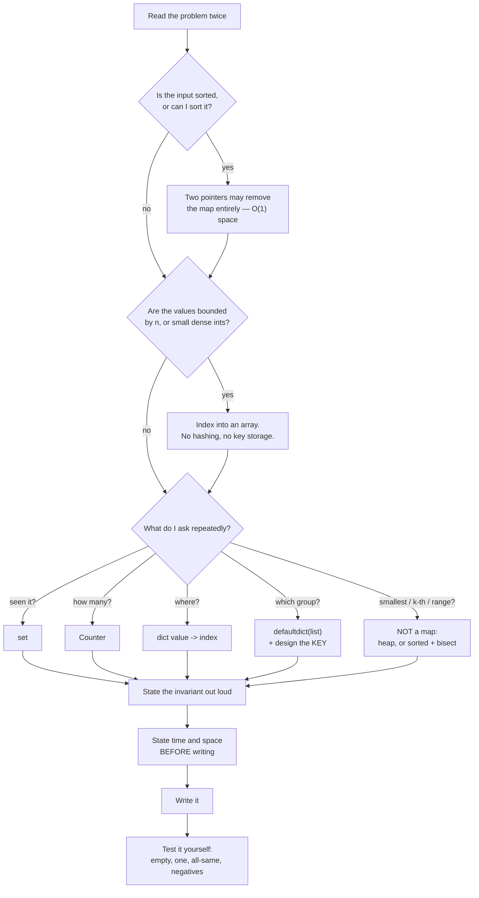

# Day 067 · DSA — Hashing revision and mock round

**After today you can:** You can solve two unseen hash-map problems cold.

**The interviewer asks it as:** *Two problems, no hints, talk as you go.*

---

## 1. What this is, and why they ask it

This closes the hashing phase. Over seven days you have met the hash table itself, collisions and the
two strategies for handling them, sets and the seen-set reflex, frequency maps and the three ways to
select a top k, grouping and the key-design skill, `__hash__` and `__eq__` on your own classes, and
the three cases where a map is the wrong tool. Today adds no new material.

What today adds is **reaching for it under observation**. There is a specific failure that happens to
people who have done all seven days properly: they are given an unseen problem, they know every
component of the answer, and they spend four minutes writing a brute force in silence because nobody
ever made them decide out loud. The knowledge was never the bottleneck. The bottleneck is having a
procedure that runs when you are being watched.

They ask it as two unseen problems with no hints because that is exactly what the coding round is.
Hash-map problems are the most common single category in that round — a hiring manager can build a
whole 45-minute interview out of "count something, then group it, then take the top k" — and the
marks come from three things almost nobody practises: naming the structure before writing anything,
saying the invariant, and continuing to talk while stuck.

---

## 2. The story

Bashir does electrical work on call in and around Cooke Town, mostly for four or five buildings whose
associations have his number. He has been doing it for nineteen years.

For most of those years his van was a jumble. One large canvas bag, a plastic crate, and things put
back wherever there was room. He knew every tool in there. Ask him whether he had a particular size
of connector and he would answer instantly and be right.

The trouble was never knowing. It was the four minutes.

A call at half past nine at night, a stairwell with the power off, him halfway up a ladder with a
torch held in his teeth, and the thing he needs is somewhere in a bag on the floor. So he comes down,
crouches, moves things, finds it, goes back up. Sometimes twice. His wife, who has heard about this
for years, once pointed out that he spends more of the evening on the ladder going up and down than
doing anything at the top of it.

What changed it was a young man he took on for a few months, who watched him for two days and then
asked a question nobody had asked before: how do you decide what to take up the ladder?

Bashir did not have an answer, because he had never decided anything. He went up, found out, came
down.

So they changed two things. The van got six boxes, labelled, and everything lives in one of them. And
— this is the part that mattered — before he goes up, he stands at the bottom for about twenty
seconds and says what he thinks the problem is and what he will need if he is right. Out loud, to
himself, which felt ridiculous for the first week.

He is wrong perhaps one time in five, which is fine; he comes down once and goes up again. But being
wrong once in five beats being unprepared five times in five, and the saying-it-out-loud does
something he did not expect. Twice now he has got halfway through the sentence and stopped, because
hearing himself say it made it obvious that it was not the fuse at all.

The tools were never the problem. Nineteen years of tools. The twenty seconds at the bottom of the
ladder was the problem.

---

## 3. The idea in plain English

The six labelled boxes are the seven days you have done. The twenty seconds at the bottom of the
ladder is what this day is about, and it is the only new thing here.

### The decision procedure, in the order to run it

Run these five questions on any unseen problem, out loud, before touching the keyboard. It takes
about forty seconds and it will pick the right structure nearly every time.

**1. What is the one question I need to ask repeatedly?**

| The question | The structure |
|---|---|
| Have I seen this before? | a **set** |
| How many times has this appeared? | a **frequency map** |
| Where did I see it? | a **map from value to index** |
| Which things belong together? | a **map from key to list** |
| Which is the smallest / k-th / next? | **not a map** — heap or sorted array |

**2. What exactly is the key?** Say the belonging sentence out loud:
*two items are the same when ___.* If the key is not the element itself, this is where the whole
problem lives ([day 064](../day-064-grouping/README.md)).

**3. Does anything about the input remove the need for a map?** Three triggers, from
[day 066](../day-066-when-hashing-is-wrong/README.md):
sorted input → two pointers · values bounded by n → index into the array itself · keys are small
dense integers → a plain list.

**4. What does it cost, and what am I trading?** "O(n) time, O(n) extra space. I am buying time with
memory." Say it before writing, not after being asked.

**5. What is the invariant?** One sentence describing what is true at the top of every iteration.
*"`seen` holds exactly the elements before the current one."* This sentence is worth more than fast
typing.

### The one-page comparison

| Structure | Answers | Time | Space | Use when |
|---|---|---|---|---|
| `set` | present? | O(1) avg | O(n) | dedupe, seen-check, cycle detection |
| `dict` | present + what | O(1) avg | O(n) | need position, count, or payload |
| `Counter` | how many | O(n) build | O(m) | frequency, anagram, top-k |
| `defaultdict(list)` | which group | O(n) build | O(nk) | grouping by a computed key |
| plain `list` as table | present, dense int keys | O(1) exact | O(range) | letters, ASCII, values in 1..n |
| sorted array + `bisect` | order, ranges | O(log n) | O(1) extra | k-th, next, between |
| heap | repeated min/max | O(log n) | O(k) | top-k with small k, streaming |

### The five sentences that carry the phase

If you remember nothing else on the morning of an interview, remember these.

1. **"A hash map does not search, it computes."** `bucket = hash(key) % capacity`, then a direct
   index. That one line is the whole structure ([day 060](../day-060-hash-tables/README.md)).
2. **"O(1) is an average, and it rests on a uniform hash and a table that grows."** The worst case is
   O(n), and it is reachable deliberately ([day 061](../day-061-collisions/README.md)).
3. **"`in` on a set is O(1); `in` on a list is O(n); the code looks identical."** 700× at n = 20,000
   ([day 062](../day-062-sets/README.md)).
4. **"The key is the problem; the loop is four lines."** Say the belonging sentence, then run both
   tests — too coarse, too fine ([day 064](../day-064-grouping/README.md)).
5. **"A map buys time with memory and throws away structure."** Sorted, bounded, or dense means
   something cheaper exists ([day 066](../day-066-when-hashing-is-wrong/README.md)).

### What a mock round is actually scoring

Not correctness alone. In most rubrics correctness is one of four or five lines, and the others are:

- **Communication** — did the interviewer always know what you were doing?
- **Approach** — did you name a structure and a complexity before coding, or discover them?
- **Correctness** — does it run, and did you test it yourself?
- **Edge cases** — empty, one element, all-identical, negatives — found by you, not by them.
- **Follow-up handling** — "now do it in O(1) space" met with a plan rather than silence.

You can lose on three of those five with perfect code, and that is the thing worth internalising.

---

## 4. The picture

The decision procedure, as a flow you can run in forty seconds.



What to notice: the two questions that could remove the map come **first**. If you ask "what do I put
in the dictionary" before asking "do I need a dictionary", you will never find the O(1)-space answer,
because you will already have committed.

And the shape of a 45-minute round, so the clock stops being a surprise:

```
 0-3    read, restate, ask clarifying questions
 3-6    say the brute force and its cost. Do not write it.
 6-10   name the structure, the key, the invariant, the complexity
 10-25  write it, narrating
 25-30  test it yourself on the four edge cases
 30-40  the follow-up ("O(1) space", "k-th largest", "what if it does not fit")
 40-45  their questions
```

The single most common mistake is spending 0-12 writing a brute force in silence. That is a quarter
of the round spent producing something you were going to throw away.

---

## 5. The code, built step by step

Two problems, worked the way you should work them. Read the problem, then close the file and try it
before reading on.

### Problem one: "Given an array of strings, return the k most common words. If two words appear the same number of times, the more alphabetically earlier one comes first."

**Minutes 0-3, out loud.** "So I need frequencies, then a selection of the top k, and the tie-break
is alphabetical ascending while the frequency is descending. Let me check one thing: if k is larger
than the number of distinct words, do I return everything? And are the words case-sensitive?"

**Minutes 3-6.** "The brute force is: for each distinct word, count it by scanning the whole list,
then sort. That is O(n·m) for the counting alone. I will not write it."

**Minutes 6-10.** "Counting is a `Counter`, O(n). Then the selection. Three options: sort all m
distinct words, O(m log m); a heap of size k, O(m log k); or bucket by count, O(n + m). The bucket
version is normally the fastest, but it does not handle the tie-break — inside a bucket I would still
have to sort alphabetically. Given the tie-break, I will use a heap with a composite key."

**The tie-break is the whole problem.** Descending by count, ascending by word. Those go in opposite
directions, so a single `reverse=True` cannot do it — this is the trap from
[day 058](../day-058-custom-comparators/README.md).

```python
from collections import Counter

counts = Counter(words)
ordered = sorted(counts, key=lambda word: (-counts[word], word))
return ordered[:k]
```

Negate the count to flip that component to descending while the string stays ascending. Say it as you
write it: *"I negate the count so it sorts descending, and leave the word alone so it sorts
ascending. I cannot use `reverse=True` because that would flip both."*

For the heap version, the same key works because `heapq` is a min-heap over tuples:

```python
import heapq
return [word for _, word in heapq.nsmallest(k, ((-c, w) for w, c in counts.items()))]
```

**Minutes 25-30, testing yourself.** `[]` with k=0. One word. All words identical. Two words with
equal counts — check the alphabetical order actually came out right, because this is where it breaks.

### Problem two: "You are given a list of log lines, each with a user id and a timestamp in seconds. A user is 'suspicious' if they made more than 100 requests in any 60-second window. Return the suspicious user ids."

**Minutes 0-3.** "Two clarifications. Is the input sorted by timestamp? And is 'any 60-second window'
a sliding window, or fixed minute buckets? Those give different answers and the second is much
cheaper."

That question is the entire interview. If it is fixed buckets, it is a grouping problem and you are
done in six lines. If it is a true sliding window, you need a per-user deque.

**Assume they say sliding.** "Then I need, per user, the timestamps in order, and a window over
them."

**Minutes 6-10.** "So this is two structures composed: a `defaultdict(list)` grouping timestamps by
user, and then per user a sliding window from
[day 031](../day-031-fixed-window/README.md). Group first, sort each user's timestamps if the input
is unsorted, then walk each list with two pointers, advancing the left pointer while the window is
wider than 60 seconds. The invariant is: everything between `left` and `right` inclusive is within 60
seconds of each other."

```python
from collections import defaultdict

def suspicious_users(logs: list[tuple[str, int]], limit: int = 100,
                     window: int = 60) -> list[str]:
    by_user: dict[str, list[int]] = defaultdict(list)
    for user, timestamp in logs:
        by_user[user].append(timestamp)

    flagged: list[str] = []
    for user, times in by_user.items():
        times.sort()
        left = 0
        for right, current in enumerate(times):
            while current - times[left] >= window:
                left += 1
            if right - left + 1 > limit:
                flagged.append(user)
                break
    return flagged
```

Notice the `break`. Once a user is flagged, stop looking at them — otherwise you append the same user
many times.

**The follow-up you will get:** "the log has ten billion lines and does not fit in memory." Answer:
"Then I do not group it in memory. If it is sorted by time I can stream it, holding one deque per
active user and evicting users whose last request is more than 60 seconds old. If it is unsorted, I
shard by user id — hash the user id modulo the number of machines, so all of one user's lines land on
one machine — and each machine does this independently. Counting and grouping are both partitionable
by key, which is exactly why this is the shape MapReduce was built for."

### The reference implementations, for revision

```python
from collections import Counter, defaultdict
from dataclasses import dataclass
import heapq


# ---- 1. the seen-set reflex (day 062) --------------------------------------
def first_duplicate(numbers: list[int]) -> int | None:
    """Invariant: at the top of each iteration, `seen` is exactly the
    elements before the current one."""
    seen: set[int] = set()
    for number in numbers:
        if number in seen:
            return number
        seen.add(number)
    return None


# ---- 2. map from value to index (day 060) ----------------------------------
def two_sum(numbers: list[int], target: int) -> tuple[int, int] | None:
    """A set is not enough here: the answer needs positions, so it is a dict."""
    position: dict[int, int] = {}
    for index, number in enumerate(numbers):
        if target - number in position:
            return position[target - number], index
        position[number] = index
    return None


# ---- 3. counting, and top k three ways (day 063) ---------------------------
def top_k_buckets(numbers: list[int], k: int) -> list[int]:
    """O(n + m). No comparisons: a count is an integer in 1..n, so index by it."""
    counts = Counter(numbers)
    buckets: list[list[int]] = [[] for _ in range(len(numbers) + 1)]
    for value, count in counts.items():
        buckets[count].append(value)

    result: list[int] = []
    for count in range(len(buckets) - 1, 0, -1):
        for value in buckets[count]:
            result.append(value)
            if len(result) == k:        # inside: one bucket can hold many
                return result
    return result


def top_k_heap(numbers: list[int], k: int) -> list[int]:
    """O(m log k). Prefer this when n is huge and m is small."""
    counts = Counter(numbers)
    return heapq.nlargest(k, counts, key=counts.get)


# ---- 4. grouping by a computed key (day 064) -------------------------------
def group_anagrams(words: list[str]) -> list[list[str]]:
    """Key: sorting destroys order (must not matter) and keeps the letter
    multiset (must matter)."""
    groups: dict[str, list[str]] = defaultdict(list)
    for word in words:
        groups["".join(sorted(word))].append(word)
    return list(groups.values())


# ---- 5. your own objects as keys (day 065) ---------------------------------
@dataclass(frozen=True)
class Point:
    """frozen=True gives __eq__ and __hash__, and makes rule 2 unbreakable."""
    x: int
    y: int


# ---- 6. when the map is the wrong answer (day 066) -------------------------
def first_missing_positive(numbers: list[int]) -> int:
    """O(n) time, O(1) space. The answer is bounded by n+1, so index into the
    array itself and store the 'seen' flag in the sign bit."""
    n = len(numbers)
    for i in range(n):
        if numbers[i] <= 0 or numbers[i] > n:
            numbers[i] = n + 1
    for i in range(n):
        value = abs(numbers[i])
        if value <= n:
            numbers[value - 1] = -abs(numbers[value - 1])   # -abs, never -x
    for i in range(n):
        if numbers[i] > 0:
            return i + 1
    return n + 1


def two_sum_sorted(numbers: list[int], target: int) -> tuple[int, int] | None:
    """Sorted input: two pointers, O(n) time and O(1) space. No map."""
    left, right = 0, len(numbers) - 1
    while left < right:
        total = numbers[left] + numbers[right]
        if total == target:
            return left, right
        if total < target:
            left += 1
        else:
            right -= 1
    return None


if __name__ == "__main__":
    print(first_duplicate([2, 1, 3, 1]))                    # 1
    print(two_sum([2, 7, 11, 15], 9))                       # (0, 1)
    print(top_k_buckets([1, 1, 1, 2, 2, 3], 2))             # [1, 2]
    print(top_k_heap([1, 1, 1, 2, 2, 3], 2))                # [1, 2]
    print(group_anagrams(["eat", "tea", "tan", "ate"]))     # [['eat','tea','ate'],['tan']]
    print(len({Point(1, 2), Point(1, 2)}))                  # 1
    print(first_missing_positive([3, 4, -1, 1]))            # 2
    print(two_sum_sorted([2, 7, 11, 15], 9))                # (0, 1)
```

---

## 6. What it costs

### The whole phase, priced at n = 1,000,000

```
 build a set / Counter               1,000,000 hash+insert      ~0.15 s
 one membership test                 1                          ~40 ns
 the same test against a list        up to 1,000,000 comparisons ~5 ms
 group into m = 100,000 groups       1,000,000 hash+append      ~0.35 s
 sort the 100,000 counts             100,000 x 17 = 1.7M cmp    ~0.05 s
 heap of size 10 over 100,000        100,000 x 3.3 = 330K cmp   ~0.02 s
 bucket by count                     1,000,000 + 100,000        ~0.06 s
```

### The three arithmetic facts to have ready

**Nested loop versus map.** `n(n-1)/2` against `n`. At n = 10,000 that is `49,995,000` against
`20,000` — a factor of **2,500**.

**Set versus list membership.** At n = 20,000, `0.004 s` against `2.9 s` — a factor of about **700**,
from identical-looking code.

**Memory per million integers.** `list 7 MB · set 32 MB · dict 40 MB`. The map costs roughly **4.5 to
5.7 times** the raw data, because it stores hashes, holds the table two-thirds empty, and keeps
pointers.

### Space, side by side

```
 set / dict of n items         O(n) extra
 grouping n items of size k    O(nk) — and it is not optional, the output is that big
 bucket top-k                  O(n + m) — n+1 buckets whatever m is
 heap top-k                    O(m + k)
 direct addressing, dense      O(range) — 8 GB if the range is a billion
 marking in place              O(1) — and it destroys the input
```

### The complexity claim that gets probed

Three loops that are *not* what they look like, and you should be able to defend all three:

- **Longest consecutive's inner `while`** is O(n) *in total*, not per iteration, because only a run's
  smallest element enters it ([day 062](../day-062-sets/README.md)).
- **Bucket top-k's nested loops** are O(n + m) total, because the buckets partition the m distinct
  values.
- **Resizing a hash table** is O(n) on one unlucky insert but **amortised O(1)**, because
  `8 + 16 + 32 + … + n/2 ≈ n` ([day 060](../day-060-hash-tables/README.md)).

---

## 7. The traps

Every trap from the phase, in one place. Each is a real error or a real wrong answer.

### `seen = []` instead of `seen = set()`

Identical code, O(n²) instead of O(n), 700× slower at n = 20,000. The first thing to check when
something is mysteriously slow.

### `{}` is an empty dict

The empty set is `set()`. `{}` gives you a dictionary, and `.add` on it raises
`AttributeError: 'dict' object has no attribute 'add'`.

### `counts[key] += 1` on a missing key

```
KeyError: 'pulao'
```

Use `counts.get(key, 0) + 1`, `defaultdict(int)`, or `Counter`.

### Reading a missing key from a `defaultdict` inserts it

```python
>>> d = defaultdict(int); d["zzz"]; len(d)
1
```

`len` is now wrong and iteration yields a key that was never in the data. With
`defaultdict(list)` it puts an empty group in your output. Check with `in`, never by indexing.

### `Counter` returns 0 for typos

`c["bb"]` is `0`, not an error. When a count that should be non-zero comes back as zero, suspect the
key before the logic.

### `words.count(word)` inside a loop

O(n²) in two clean-looking lines. 400,000,000 comparisons at n = 20,000.

### Walking the counter instead of the original

For any "first such element" question, iterate the input, not the map. It is right by accident on
`Counter` and stops being right the moment anything reorders it.

### An unhashable key

```
TypeError: unhashable type: 'list'
```

`tuple(counts)`, not `counts`. `frozenset` for an unordered group.

### `itertools.groupby` on unsorted input

It only groups **adjacent** runs, so `aet` appears three separate times. And `sorted(words)` is not
enough — it must be `sorted(words, key=key)`.

### A key that is too coarse or too fine

`frozenset(word)` groups `"aab"` with `"abb"`. `(city, pincode, area)` splits one city into forty
piles. Run both tests before writing the loop.

### `__eq__` without `__hash__`

```
TypeError: unhashable type: 'Q'
```

Python sets `__hash__ = None` when you define `__eq__`. A plain `@dataclass` is unhashable for the
same reason. Use `frozen=True`.

### Mutating a key while it is in the table

The worst one, because it is silent:

```python
>>> key.key = "A-2"
>>> key in lookup, len(lookup)
(False, 1)
```

No exception. `frozen=True` makes it impossible.

### `-x` instead of `-abs(x)` in the marking trick

Returns `1` instead of `2` on `[1, 1]`. Two elements.

### Changing a container while iterating it

```
RuntimeError: dictionary changed size during iteration
RuntimeError: Set changed size during iteration
```

Iterate over `list(d)`.

### Relying on set order

`list(set(names))` gives a different order in a fresh process, because string hashing is randomised.
Use `dict.fromkeys` when order matters.

### Direct addressing on a sparse range

`[0] * (max(numbers) + 1)` on `[1, 2, 10**9]` is 8 GB and a `MemoryError`. The condition is **dense**.

### Quoting O(1) as a worst case

It is an average. Say "O(1) average, O(n) worst" every time, and know when the worst case matters.

---

## 8. In the interview

### How it gets asked

- The standard round: two problems, forty-five minutes, no hints. The first is a warm-up that is
  really checking whether you talk; the second is the one they score.
- The composed one, which is now common: *"count them, then group them, then give me the top three
  per group."* Three phase ideas in one question.
- The scaling pivot at minute 35: *"now the input is ten billion lines."*
- The space pivot: *"now do it in O(1) space."*

### The script, minute by minute, for a 45-minute round

**Minutes 0-3 — read it twice and restate it.** "Let me say back what I think you are asking." Then
ask two clarifying questions and no more. The best two are almost always: *what should happen on an
empty input or a tie?* and *does the order of the output matter?*

**Minutes 3-6 — say the brute force and refuse to write it.** "The obvious approach is a nested loop
— for each element, look at every other. At n = 10,000 that is fifty million comparisons. I would
like to do better, so let me not write that."

**Minutes 6-10 — the forty seconds at the bottom of the ladder.** Out loud, in this order: the
repeated question, the structure, the key, the invariant, the complexity. "The question I keep asking
is 'have I seen this'. That is a set. The key is the value itself. The invariant is that `seen` holds
exactly the elements before the current one. O(n) time, O(n) extra space."

**Minutes 10-25 — write it, narrating.** Short sentences. "Now I add it to the set, so the invariant
holds for the next iteration." Silence is the thing that costs you, not slowness.

**Minutes 25-30 — test it yourself, out loud, on four inputs.** Empty. One element. All identical.
Negatives or an edge value. Finding your own bug here is worth more than not having one, because it
demonstrates the habit.

**Minutes 30-40 — the follow-up.** Have the four standard answers ready; they are below.

**Minutes 40-45 — ask them something real.** What does the on-call rotation look like; what broke
most recently.

### The follow-ups

**"Now do it in O(1) space."**
"Then the map has to go, and I have three options. Sort and walk — O(n log n) time, O(1) space, and
it destroys the input. Two pointers, if it is sorted. Or, if the values are bounded by n, mark inside
the array itself using the sign bit, which stays O(n). Which is available depends on one question:
may I modify the input?"

**"What is the worst-case complexity?"**
"O(n) per operation, so O(n²) overall, when everything collides into one bucket. It needs either a
hostile input or a bad custom hash. Python randomises string hashing per process to stop the first,
which is also why you must never persist or assert on a `hash()` value."

**"The input does not fit in memory."**
"Counting and grouping are both partitionable by key, so I shard: hash the key modulo the number of
machines, so all records with one key land on one machine, and each machine does the job
independently. Then merge the partial counters, which works because addition is associative. That is
exactly the MapReduce shape. If I only need approximate frequencies in fixed memory, Count-Min Sketch
does it with a bounded overestimate."

**"Why is your inner loop not quadratic?"**
"Because it is bounded in total rather than per iteration." Then give the specific reason for the
specific loop.

**"Would you use a set or a dict here?"**
"A set if presence is all I need; a dict the moment I need the position, the count, or a payload. The
set is the dict with the values thrown away."

### A model answer

Asked, with no preamble: *given a list of words, return the k most frequent. Ties go to the
alphabetically earlier word.*

> "Let me restate it: I need the k words with the highest counts, and where two words have the same
> count, the one that comes first alphabetically wins. Two questions before I start — if k is larger
> than the number of distinct words, do I return all of them? And are the words case-sensitive?
>
> The brute force is to count each distinct word by scanning the whole list, which is O(n·m), then
> sort. I will not write that; counting in one pass with a hash map is O(n) and there is no reason
> not to.
>
> So the first half is a `Counter`, one pass, O(n) time and O(m) space where m is the number of
> distinct words.
>
> The second half is the selection, and normally I would offer three options: sort the m counts at
> O(m log m), a heap of size k at O(m log k), or bucket by count at O(n + m), which is linear because
> a count is an integer between 1 and n so I can index by it rather than compare.
>
> But the tie-break changes the answer. I need count descending and word ascending — two components
> going in opposite directions — so a single `reverse=True` will not work, because it would flip
> both. The clean way is a composite key: negate the count and leave the word alone. Bucketing does
> not handle this naturally, because inside each bucket I would still have to sort alphabetically. So
> I will use the sort with the composite key, or a heap with the same key if k is much smaller than
> m.
>
> That is O(m log m) time on top of the O(n) counting, and O(m) space.
>
> Let me test it. Empty input with k of zero returns an empty list. A single word returns that word.
> All words identical gives one entry. And the case I actually want to check is two words with equal
> counts — 'apple' and 'banana' both twice — which should return 'apple' first, and it does, because
> the negated count ties and the string comparison breaks it.
>
> If you told me the list was ten billion lines, I would not count it in one process. I would shard
> by hashing the word, so all copies of a word land on one machine, count independently and merge the
> partial counters — counting is associative, which is what makes that safe."

---

## 9. Recall card

- **Run the five questions before touching the keyboard.** What do I ask repeatedly? · What exactly
  is the key? · Does the input remove the need for a map (sorted / bounded by n / dense ints)? · What
  am I trading? · What is the invariant? The two that could **remove** the map come first, or you
  will commit before you can see them.
- **Structure by question:** *seen it?* → set · *how many?* → `Counter` · *where?* → dict value→index
  · *which group?* → `defaultdict(list)` + a designed key · *smallest / k-th / next / between?* →
  **not a map** — heap, or sorted + `bisect`.
- **Five sentences carry the phase:** a map computes, it does not search · **O(1) is an average**,
  O(n) worst · `in` on a list is O(n) and looks identical (700× at n = 20,000) · the key is the
  problem, the loop is four lines · a map buys time with memory and **throws away structure**.
- **Numbers to have ready:** nested loop vs map at n = 10,000 = **50M vs 20K (2,500×)** · memory per
  million ints = **list 7 MB, set 32 MB, dict 40 MB** · top-k at n = 10⁶, m = 10⁵, k = 10 = 1.7M
  (sort) vs 330K (heap) vs 1.1M (buckets).
- **The round is scored on five lines, not one.** Communication · approach *before* code · correctness
  · **edge cases you found yourself** (empty, one, all-same, negatives) · follow-up handling. Minutes
  0-12 spent writing a brute force in silence is a quarter of the interview thrown away.
