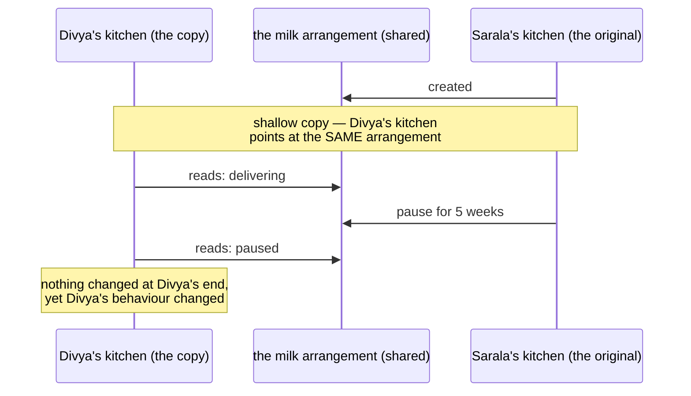

# Day 067 · System Design — Prototype, and cloning objects

**After today you can:** You can copy an object correctly and explain shallow versus deep copy.

**The interviewer asks it as:** *What is the difference between a shallow copy and a deep copy?*

---

## 1. What this is, and why they ask it

**Prototype** is the creational pattern that makes new objects by **copying an existing one** instead
of building one from scratch. The existing object is the prototype; `clone()` produces a new object
just like it, which you then adjust. It is the last of the five creational patterns and the one
people meet without knowing its name, because every language ships some form of copy.

The pattern itself takes five minutes. The reason this day exists is the question underneath it:
**what does "copy" actually mean?** A **shallow copy** makes a new outer object whose fields point at
the same inner objects as the original. A **deep copy** copies the whole graph, all the way down. The
difference is invisible until somebody mutates a shared inner object, and then two things that were
supposed to be independent change together.

They ask it because it is a real bug that real teams lose days to, and because the answer separates
three levels of candidate. The weak answer is "shallow copies one level, deep copies everything". The
better answer draws what the pointers look like and names the input that exposes the difference. The
strong answer volunteers the three things a deep copy gets *wrong* — cycles, cost, and objects that
must not be copied at all, like a socket or a lock.

---

## 2. The story

When Divya moved into her own flat in Kaggadasapura, her mother Sarala did not sit down and work out
what a flat needs. She had been running one for thirty-one years, and hers works, so she went round
her own kitchen and copied it.

Same size pressure cooker. Same steel dabbas, the set of six. The same brand of gas stove, because
hers had lasted eleven years. The same arrangement — oil and salt to the right of the stove, spices
in the second drawer — because when you have cooked in a kitchen for thirty-one years you stop
thinking about where things are and that is worth something.

It took an afternoon, and Divya's kitchen worked from the first day, which a kitchen designed from
first principles by a twenty-six-year-old would not have.

Most of what was copied was genuinely Divya's own. Her own cooker. Her own dabbas. If Divya's cooker
whistle broke, nothing happened in Sarala's kitchen.

But two things were not copied. They were shared, and nobody noticed at the time.

The milk. Sarala rang the man who has delivered to her for years and asked him to deliver to Divya's
flat too, and he said fine, and added the address. One arrangement, two addresses. And the newspaper,
the same way — one account, an extra copy dropped at the second address.

At the time this seemed like the same thing as everything else. It was not.

In March, Sarala went to her sister's in Mysuru for five weeks and did what she always does before
travelling: rang both men and stopped everything.

Divya's milk stopped. Divya's newspaper stopped. Nobody had touched anything at Divya's end, nobody
had rung anybody, and there was no reason on earth for it to happen. It took the two of them about a
week and three fairly irritated phone calls to work out why, because they were both looking for
something that had gone wrong at Divya's flat, and nothing had.

There was never a second arrangement. There was one arrangement, with two addresses written on it.

They fixed it in twenty minutes — Divya rang both men and opened her own account. And Sarala's
summary of it is that when you copy something you have to know which parts came with it and which
parts are still the original.

---

## 3. The idea in plain English

Copying the kitchen instead of designing one is **Prototype**: you already have a working instance,
so make new ones from it rather than from nothing.

The cooker and the dabbas were **deep-copied** — genuinely new things that happen to look the same.
The milk and the newspaper were **shallow-copied** — the new kitchen got a *reference* to the same
arrangement, and changing it from either end changed it for both.

### The two kinds of copy, precisely

An object has fields. Some fields hold simple values, like a number or a string. Some hold references
to other objects.

**A shallow copy** creates a new outer object and copies each field *as it is*. A field holding the
number 5 gets a new 5. A field holding a reference to a list gets a copy of the reference — which
means both objects now point at **the same list**.

**A deep copy** creates a new outer object and, for every field that is a reference, recursively
copies the object it points to as well. Nothing is shared.

```python
import copy

original = {"name": "sarala", "milk": ["monday", "tuesday"]}

shallow = copy.copy(original)
deep = copy.deepcopy(original)

shallow["milk"].append("wednesday")

original["milk"]     # ['monday', 'tuesday', 'wednesday']  <- changed!
shallow["milk"]      # ['monday', 'tuesday', 'wednesday']
deep["milk"]         # ['monday', 'tuesday']               <- independent
```

Three lines to reproduce, and it is the whole question. Note that `original` changed even though
nobody touched `original`. That is the bug, and it is why teams lose days to it: the symptom appears
somewhere nobody was working.

### When shallow is fine, which is more often than people think

Shallow copying is not the broken option. It is the right option whenever the shared parts are
**immutable**.

```python
person = {"name": "sarala", "age": 58}
copy.copy(person)          # completely safe — strings and ints cannot be mutated
```

Sharing an immutable object is invisible, because nobody can change it out from under you. This is
why the real rule is not "always deep copy" but:

> **Shallow copy is safe exactly when everything it shares is immutable.**

And it is why a codebase full of frozen dataclasses, tuples and strings almost never has this bug in
the first place. **The best answer to the copy question is usually to have less mutable state**, and
saying that is worth a lot.

### The three things a deep copy gets wrong

This is the part that separates answers.

**One: cycles.** If A holds B and B holds A, a naive recursive copy runs forever. Python's
`copy.deepcopy` keeps a `memo` dictionary of objects it has already copied, keyed by `id()`, so a
cycle terminates and — importantly — the *shape* of the sharing is preserved. If two fields pointed
at the same list before, they point at the same *new* list after, rather than at two copies.

**Two: cost.** `deepcopy` walks the entire reachable object graph. On a large structure it is slow —
often ten to a hundred times slower than shallow — and it doubles the memory. On an object holding a
100 MB cache, a deep copy is a 100 MB allocation you probably did not want.

**Three: things that must not be copied.** A socket. A file handle. A database connection. A
threading lock. An open transaction. These are not data; they are handles to something outside your
process, and copying them produces either an error or, worse, a second object that thinks it owns a
resource it does not.

```python
    def __deepcopy__(self, memo):
        clone = MyService(self.config)
        clone._connection = None      # deliberately NOT copied — reconnect on use
        return clone
```

Being able to say "a deep copy of anything holding a connection is wrong, and here is the hook where
you exclude it" is the sentence that marks out someone who has done this in production.

### Prototype, as a pattern

The pattern is: keep a registry of ready-made, fully configured objects, and create new ones by
cloning them.

```python
PROTOTYPES: dict[str, Report] = {
    "monthly_sales": Report(layout=..., filters=..., branding=...),
    "tax_summary":  Report(layout=..., filters=..., branding=...),
}

def new_report(kind: str) -> Report:
    return copy.deepcopy(PROTOTYPES[kind])
```

Three reasons to do this instead of calling a constructor.

**Construction is expensive.** If building the object means reading a database, parsing a large file,
or a network call, copying an already-built one skips all of it.

**You do not know the concrete class.** `copy.deepcopy(thing)` produces the right subclass without
you naming it. This was the original 1994 motivation, in a language where you could not easily pass a
class around.

**You want a configured template.** The prototype has forty fields already set to sensible values and
you only change two.

In Python the second reason mostly evaporates, because classes are first-class objects and a factory
([day 065](../day-065-hashing-custom-objects/README.md)) does the job. The first and third survive.

---

## 4. The picture

The two copies, drawn as boxes and arrows. This is the diagram to reproduce in an interview.

```
 ORIGINAL
   +-------------------+
   | Kitchen           |
   |  name:  "sarala"  |
   |  milk:  ---------------> [ mon, tue ]      <- one list object
   +-------------------+


 SHALLOW COPY                     copy.copy
   +-------------------+
   | Kitchen           |
   |  name:  "sarala"  |          (a new string reference, but strings
   |  milk:  --------------\      are immutable, so it does not matter)
   +-------------------+    \
                             +--> [ mon, tue ]      <- THE SAME list
   original.milk  -----------/                          both point here


 DEEP COPY                        copy.deepcopy
   +-------------------+
   | Kitchen           |
   |  name:  "sarala"  |
   |  milk:  ---------------> [ mon, tue ]      <- a NEW list
   +-------------------+

   original.milk  ----------> [ mon, tue ]      <- the old one, untouched
```

What to notice: the outer box is new in *both* cases. The only difference is whether the arrow points
somewhere new. That is the entire distinction, and drawing it takes fifteen seconds.

And the failure, as a sequence — this is the shape of the bug report you will actually receive:



The reason this costs a week rather than an hour is in the last note. The symptom appears in code
nobody has touched.

---

## 5. How it actually works

### Python's three levels

```python
import copy

b = a                      # 1. not a copy at all — another name for the same object
b = copy.copy(a)           # 2. shallow — new outer object, shared innards
b = copy.deepcopy(a)       # 3. deep — new everything, recursively
```

Level 1 catches beginners constantly: `b = a` on a list means `b.append(1)` changes `a`. It is not a
copy; it is a second reference.

For built-ins there are idiomatic shallow copies: `list(a)`, `a[:]`, `a.copy()`, `dict(a)`,
`set(a)`. All shallow, all the same thing.

### The hooks

```python
class Config:
    def __copy__(self):
        ...                      # customise copy.copy

    def __deepcopy__(self, memo):
        ...                      # customise copy.deepcopy; memo handles cycles
```

`memo` is the dictionary of already-copied objects keyed by `id()`. If you write `__deepcopy__` and
recurse, you must pass `memo` down or you will lose cycle protection.

### The Python answer that usually beats copying

```python
from dataclasses import dataclass, replace

@dataclass(frozen=True)
class Report:
    title: str
    rows: tuple[str, ...]
    branding: str

monthly = Report("Monthly", ("a", "b"), "acme")
weekly = replace(monthly, title="Weekly")     # a new object, two fields shared
```

`dataclasses.replace` builds a new instance with some fields changed. On a **frozen** dataclass with
immutable fields this is both a prototype *and* a safe shallow copy, because nothing shared can be
mutated. It is one line, it is faster than `deepcopy`, and it has no cycle problem. Python 3.13 added
a general `copy.replace` that works the same way for any type supporting it.

### Java, and why `Cloneable` is a cautionary tale

Java's `Object.clone()` and the `Cloneable` interface are the standard example of a broken design,
and Joshua Bloch says so in *Effective Java* in almost those words.

- `Cloneable` is a **marker interface** with no methods, so it does not actually give you `clone()`.
- `Object.clone()` is `protected`, so you must override it just to make it callable.
- It performs a **field-by-field shallow copy** and does not call a constructor, so `final` fields
  cannot be reassigned in it.
- It throws a checked `CloneNotSupportedException` that in practice can never happen.

The recommended replacement is a **copy constructor** or a static factory — `new ArrayList<>(other)`
— which is explicit, calls a real constructor, and can be written to copy as deeply as you need.
Naming this in an interview is a strong signal.

### Real products, and where you have already met this

- **`numpy` views versus copies.** `arr[1:]` is a **view** — a window onto the same memory — while
  `arr[1:].copy()` is a copy. Assigning to a view changes the original. This is the single most
  common shallow-copy surprise in data work.
- **pandas' `SettingWithCopyWarning`** exists entirely because users cannot tell whether a slice is a
  view or a copy.
- **JavaScript's `Object.assign` and `{...spread}`** are shallow. Nested objects stay shared, which is
  why `structuredClone` was added to browsers in 2022 and why libraries like Immer exist.
- **Protocol Buffers** generate `CopyFrom` and `MergeFrom` on messages; the builders from
  [day 066](../day-066-when-hashing-is-wrong/README.md) are the other half of the same design.
- **Docker images are prototypes.** A container is a copy of an image with a writable layer on top —
  and it is copy-on-write, so nothing is duplicated until it is written to.
- **`fork()`** is the operating-system version: the child is a copy of the parent, and the pages are
  shared copy-on-write until one of them writes.
- **Kubernetes** deployments hold a pod *template*; every pod is a clone of it with a few fields
  changed.
- **JavaScript's prototypal inheritance** is the pattern taken to its conclusion: objects inherit from
  other objects rather than from classes.

### Copy-on-write, which is the good compromise

Three of those examples — `fork`, Docker layers, and Python's own string interning — use the same
trick. Share everything, and only make a real copy at the moment somebody writes. You get the speed
of a shallow copy with the safety of a deep one, and you pay only for what actually diverges. When an
interviewer asks how to make deep copies affordable, this is the answer.

---

## 6. The numbers

### What deep costs over shallow

On a dictionary of 1,000 keys, each holding a list of 100 integers:

```
 b = a                     ~ 0.00003 ms   (no copy at all — one reference)
 copy.copy(a)              ~ 0.02 ms      (1,000 references copied)
 copy.deepcopy(a)          ~ 25 ms        (100,000 integers + 1,000 lists)
 ratio                     ~ 1,200x
```

And the memory: shallow adds one dictionary of 1,000 slots, roughly 40 KB. Deep adds 1,000 new lists
of 100 elements, roughly 4 MB — **a hundred times more**.

`deepcopy` is also slow beyond the raw work, because it maintains the `memo` dictionary and dispatches
per type. It is typically the slowest thing in any code path that calls it in a loop, and "we call
`deepcopy` inside a request handler" is a real and common production finding.

### When Prototype actually pays

The case for cloning over constructing:

```
 build a Report from scratch:
   read layout from Postgres        12 ms
   parse the branding template       4 ms
   fetch the org's settings (HTTP)  40 ms
   ------------------------------------
   total                            56 ms

 clone a prebuilt prototype:
   deepcopy of a ~50 KB object       0.4 ms
```

**140× faster**, and at 200 reports a second that is 11.2 seconds of work per second — impossible —
against 0.08 seconds. That arithmetic is the reason the pattern exists.

But notice the condition. If construction were `Report()` with three field assignments, cloning would
be *slower* than constructing, because `deepcopy` is not cheap. **Prototype only pays when
construction is expensive**, and quoting both halves is what makes the answer credible.

### The cost of the bug

The shallow-copy bug has a characteristic cost profile, and it is worth knowing why it is expensive
out of proportion to its size:

```
 lines of code involved                          1
 time to fix once found                     ~5 min
 time to find                          hours to days
```

Because the symptom appears in code nobody changed. Sarala's five-week trip broke Divya's milk. The
person debugging starts at the wrong end of the program, and every hypothesis they form is about the
place where the symptom is.

---

## 7. The trade-offs

### What deep copying costs you

**Speed and memory**, at roughly the ratios above. Anything in a hot path that deep-copies a large
object is a performance bug waiting to be found.

**Correctness, for anything holding a resource.** Sockets, file handles, database connections, locks,
open transactions, thread handles. A deep copy either raises — `TypeError: cannot pickle
'_thread.lock' object` is the one you will actually see — or silently produces an object that
believes it owns something it does not.

**Surprising sharing you did not ask for.** `deepcopy` preserves the *shape* of sharing. If your
object had two fields pointing at the same list, the copy has two fields pointing at one new list,
not two separate lists. That is almost always what you want and it is occasionally a surprise.

### What shallow copying costs you

Exactly one thing: **shared mutable state**, and the debugging cost above. Nothing else. If you can
guarantee the shared parts are immutable, shallow copying is strictly better on every axis.

### The third option, which is usually the right one

**Do not copy. Make it immutable.** The entire shallow-versus-deep question only exists because
things can be mutated. With frozen dataclasses, tuples and strings:

- shallow copying is free and safe;
- `dataclasses.replace` gives you "the same but with one field different" in one line;
- there is nothing to defend against.

This is the answer to give when an interviewer asks how you would *avoid* the problem rather than
solve it.

### "I would not use this if..."

- **...construction is cheap.** A constructor with three assignments beats `deepcopy` on speed and on
  clarity. Prototype is for objects that cost 50 ms to build, not 50 nanoseconds.
- **...the object holds a resource.** Then a clone is not a clone. Write a copy constructor that
  reconnects, or do not copy it.
- **...I can make it immutable instead.** Which removes the question rather than answering it.
- **...I am reaching for `deepcopy` to fix a bug I do not understand.** `deepcopy` as a defensive
  reflex sprinkled through a codebase is a strong sign that ownership of mutable state was never
  decided, and it will be slow *and* still buggy.

### The honest weakness of Prototype

The clone starts out identical to something that is already in use. If the prototype is ever mutated
— by anyone, at any time — every future clone silently changes. So the prototype registry itself
should be immutable or, at minimum, treated as write-once at startup. This is the same discipline the
singleton discussion needed in [day 064](../day-064-grouping/README.md), for the same reason.

---

## 8. In the interview

### How it gets asked

- The direct one, and it is extremely common: *"What is the difference between a shallow copy and a
  deep copy?"* Often as a warm-up, and often followed by "show me".
- The bug hunt: *"I changed this object and a completely different object changed too. What
  happened?"*
- The Java one: *"What is wrong with `Cloneable`?"* — a question with a well-known answer that most
  candidates do not have.
- The pattern one: *"When would you use Prototype instead of a factory?"*
- The practical one: *"How would you copy an object that holds a database connection?"*

### What to say out loud, in the first ninety seconds

1. **Define both in one sentence each, in terms of pointers.** "A shallow copy makes a new outer
   object whose fields point at the same inner objects. A deep copy recursively copies the whole
   reachable graph, so nothing is shared."
2. **Draw the boxes and arrows.** Fifteen seconds, and it does more than sixty seconds of talking.
3. **Give the three-line reproduction.** A dict with a list in it, `copy.copy`, append, print both.
4. **State the real rule rather than "always deep copy".** "Shallow is safe exactly when everything
   shared is immutable — which is most of the time in a codebase using frozen dataclasses and
   tuples."
5. **Volunteer the three things deep copy gets wrong** — cycles, cost, and resources — before being
   asked. That is the part that ends the question in your favour.

### The follow-ups

**"How does `deepcopy` handle a cycle?"**
"With a memo dictionary keyed on `id()`. Before copying an object it checks whether it has already
copied that one, and if so returns the existing copy. So a cycle terminates, and the shape of sharing
is preserved — two fields that pointed at the same list still point at one list afterwards, not two."

**"How do you copy an object holding a database connection?"**
"You do not copy the connection. I would write `__deepcopy__` explicitly, copy the configuration and
the data, and set the connection to `None` so it is re-established on next use. If I did not do that,
Python would usually raise — `TypeError: cannot pickle '_thread.lock' object` is the one you see in
practice — and if it somehow succeeded, I would have two objects believing they own one socket, which
is worse than the error."

**"What is wrong with Java's `Cloneable`?"**
"It is a marker interface with no methods, so implementing it does not give you `clone()`.
`Object.clone` is protected, so you have to override it just to call it. It does a field-by-field
shallow copy without calling a constructor, so `final` fields cannot be set. And it throws a checked
exception that can never happen. Bloch's recommendation is a copy constructor or a static factory
instead — `new ArrayList<>(other)` — which is explicit and calls a real constructor."

**"When is Prototype better than a factory?"**
"When construction is genuinely expensive and the result is reusable — if building the object means a
database read, a parse and an HTTP call, cloning a prebuilt one turns 56 milliseconds into 0.4. And
when I want a fully configured template where I change two fields out of forty. If construction is
cheap, a factory or just a constructor is better, because `deepcopy` is not free — it is often
slower than building a small object from scratch."

**"How would you make deep copies affordable?"**
"Copy-on-write. Share everything, and only materialise a real copy when somebody writes. That is what
`fork()` does with memory pages, what Docker does with image layers, and what persistent data
structures in functional languages do. You pay only for what actually diverges."

**"How would you avoid the problem entirely?"**
"Immutability. The whole shallow-versus-deep question exists because things can be mutated. With
frozen dataclasses and tuples, shallow copying is safe by construction, and `dataclasses.replace`
gives me 'the same but with one field changed' in one line and no copying at all."

### A model answer

Asked: *what is the difference between a shallow copy and a deep copy?*

> "Both make a new outer object. The difference is what the fields point at.
>
> A shallow copy copies each field as it is. A field holding an integer gets that integer. A field
> holding a reference to a list gets a copy of the *reference*, so the original and the copy now
> point at the same list. A deep copy recursively copies everything reachable, so the copy shares
> nothing with the original.
>
> The three-line demonstration: take a dictionary with a list in it, shallow copy it, append to the
> copy's list, and print the original's list. The original changed, even though nobody touched it.
> That is the whole bug, and the reason it is expensive to debug is not that it is subtle in
> isolation — it is that the symptom shows up in code nobody edited, so you start looking at the
> wrong end of the program.
>
> The rule I would actually state is not 'always deep copy'. It is that shallow copying is safe
> exactly when everything it shares is immutable. Sharing a string or a tuple or a frozen dataclass
> is invisible, because nobody can change it under you. So in a codebase built on frozen dataclasses,
> this problem mostly does not arise, and I would rather remove the question than answer it —
> `dataclasses.replace` gives me a new object with one field changed, in one line, with no copying.
>
> Three things I would say about deep copying before you ask. It handles cycles through a memo
> dictionary keyed on object identity, which also means it preserves the *shape* of sharing rather
> than duplicating it. It is expensive — on a thousand-key dictionary of hundred-element lists it is
> about a thousand times slower than shallow and a hundred times the memory, so `deepcopy` inside a
> request handler is a real performance bug. And it is wrong for anything holding a resource: a
> socket, a file handle, a database connection, a lock. Python usually raises there — `cannot pickle
> '_thread.lock' object` — and if it did not, I would have two objects believing they own one socket.
> The fix is an explicit `__deepcopy__` that copies the data and leaves the connection to be
> re-established.
>
> As for the pattern, Prototype is creating new objects by cloning a configured one instead of
> constructing from scratch. It earns its place when construction is expensive — if building the
> object costs a database read, a parse and an HTTP call, that might be fifty milliseconds against
> half a millisecond to clone. If construction is cheap, cloning is slower than constructing and I
> would not use it. You have used it without the name: Docker containers are clones of images,
> `fork()` clones a process, and Kubernetes pods are clones of a template — and all three use
> copy-on-write, which is how you get the safety of a deep copy at close to the price of a shallow
> one."

---

## 9. Recall card

- **Shallow = new outer object, fields point at the *same* inner objects. Deep = the whole reachable
  graph is copied, nothing shared.** And `b = a` is not a copy at all — it is a second name. Draw the
  boxes and arrows; it beats sixty seconds of talking.
- **The real rule is not "always deep copy".** ***Shallow is safe exactly when everything shared is
  immutable.*** So the best answer is usually to remove the question: frozen dataclasses, tuples, and
  `dataclasses.replace` for "the same but one field different".
- **Three things deep copy gets wrong, and volunteer all three.** **Cycles** — handled by a `memo`
  keyed on `id()`, which also *preserves the shape of sharing* · **cost** — ~1,200× slower and ~100×
  the memory on a 1,000-key dict of 100-element lists, so `deepcopy` in a request handler is a real
  bug · **resources** — sockets, file handles, connections, locks. `TypeError: cannot pickle
  '_thread.lock' object` is the error you will actually see; the fix is an explicit `__deepcopy__`.
- **Prototype pays only when construction is expensive.** 56 ms to build (DB read + parse + HTTP) vs
  0.4 ms to clone = **140×**. With a cheap constructor, cloning is *slower*. And the prototype itself
  must be treated as immutable, or every future clone changes silently.
- **You have already used it.** Docker images → containers · `fork()` → child process · Kubernetes
  pod templates · `numpy` views (`arr[1:]` shares memory) · JS `{...spread}` is shallow, hence
  `structuredClone`. All the good ones use **copy-on-write**: share until someone writes. And Java's
  `Cloneable` is the cautionary tale — marker interface, protected method, no constructor call, an
  impossible checked exception; use a **copy constructor** instead.
