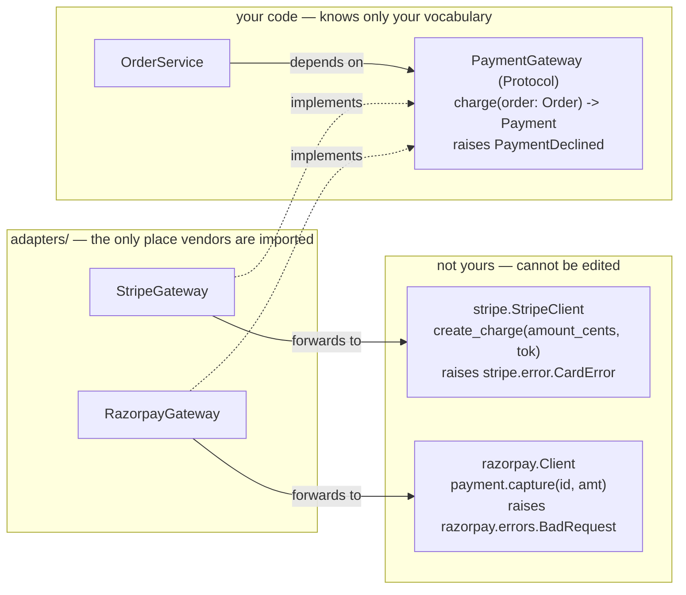

# Day 068 · System Design — Adapter

**After today you can:** You can make two incompatible interfaces work together without editing either.

**The interviewer asks it as:** *You must integrate a third-party SDK with a different interface. How?*

---

## 1. What this is, and why they ask it

An **adapter** is a small class that implements the interface your code wants and forwards the calls
to an object that has a different interface. It changes nothing about either side. The thing you
cannot edit — a vendor library, a legacy module, someone else's service — stays untouched, and your
code carries on talking in its own vocabulary.

It is the first of the seven structural patterns and by a distance the most useful one in real work,
because the situation it solves is permanent. You do not own the payment gateway. You do not own the
SMS provider, the cloud storage client, the analytics library or the thing the team before you wrote
in 2017. Their method is called `submit_charge(amount_cents, tok)`; yours wants
`charge(order: Order) -> Payment`. One of those two facts is going to have to give, and the adapter
is how neither of them does.

They ask it because it is the pattern that most reliably distinguishes people who have integrated a
third party from people who have not. The naive answer — "I would wrap it" — is directionally right
and stops one sentence too early. The good answer says where the interface lives, whose vocabulary
it is written in, and what the adapter must translate: not just method names, but **error types,
units, and data shapes**. That last part is where the marks are.

---

## 2. The story

The flat in Bengaluru came with a washing machine that the previous tenants left behind, and it is a
good one, and it does not fit.

Not physically. The plug. It is an old machine with a big round three-pin plug of a kind the flat's
sockets do not take, and the sockets are the newer flat-pin type that everything else in the house
uses.

Vinay's first instinct, standing in the kitchen on the Saturday he moved in, was to cut the plug off
and wire on a new one. His father talked him out of it in about thirty seconds. It is not his
machine. It is going back to the owner eventually. And if he cuts the cable and gets it slightly
wrong, he owns a broken washing machine that was not his.

His second instinct was to get an electrician in to change the socket. Also possible, also wrong. It
is not his socket either. It is in the wall of a flat he rents, everything else in the house uses
that socket, and the landlord would have views.

What he actually did cost a hundred and ten rupees at the shop near the bus stand. A converter. A
small white block with the round holes on one face and the flat pins on the other. The machine plugs
into it, it plugs into the wall, and neither the machine nor the wall knows anything has happened.

He has three of them now, for various things, and he is quite firm about one point when the subject
comes up: the converter does not make anything better. It does not add a function to the washing
machine and it does not improve the socket. All it does is sit in the middle and make one shape into
another shape. If you told him it was clever he would say it is the opposite of clever, which is why
it works.

The one that did go wrong is worth mentioning. A friend brought a small appliance back from Dubai and
used a converter with it, and the plug fitted perfectly and the thing burned out in about four
seconds, because the plug was not the only difference. The voltage was different too, and the
converter had only dealt with the shape. Nobody had thought about it, because the part you can see
had been solved.

---

## 3. The idea in plain English

The converter is an **adapter**. Three parties, and it is worth naming all three because interviewers
use the words.

- The **client** — the wall socket, which will only accept one shape.
- The **adaptee** — the washing machine, which has a different shape and cannot be changed.
- The **adapter** — the white block, which presents the shape the client wants and passes everything
  through to the adaptee.

Neither the socket nor the machine is modified. Neither of them knows the block exists. That is the
definition.

And the friend's burnt appliance is the part of this lesson people miss: **an adapter that only
translates the obvious difference is not finished.** The plug shape was visible; the voltage was not.
In code, the method names are the plug shape. The things nobody looks at are the units, the error
types, and the data shapes — and those are what actually burn.

### The shape, in code

Your code wants this:

```python
class PaymentGateway(Protocol):
    def charge(self, order: Order) -> Payment: ...
```

The vendor gives you this:

```python
# stripe_sdk.py — not yours, cannot be edited
class StripeClient:
    def create_charge(self, amount_cents: int, currency: str,
                      source_token: str, idempotency_key: str) -> dict: ...
```

Different name, different arguments, different return type. The adapter sits between them:

```python
class StripeGateway:                       # implements YOUR PaymentGateway
    def __init__(self, client: StripeClient) -> None:
        self._client = client

    def charge(self, order: Order) -> Payment:
        response = self._client.create_charge(
            amount_cents=order.total.paise // 100 * 100,   # units!
            currency=order.total.currency,
            source_token=order.payment_token,
            idempotency_key=str(order.id),
        )
        return Payment(reference=response["id"],
                       status=self._translate_status(response["status"]))
```

That is the whole pattern. One class, one method per method you actually use, and nothing else.

### The four things an adapter translates

This list is the answer to the interview question. Anybody can say "it renames the method". The
adapter is doing four jobs, and the last three are where real bugs live.

**1. The interface.** `create_charge` becomes `charge`. The easy part.

**2. The data shape.** Their `dict` with string keys becomes your `Payment` object. Their
`{"cust": {"em": "..."}}` becomes your `Customer`. If a vendor `dict` escapes past the adapter into
your domain, the adapter has failed — you now have their shape everywhere and no seam at all.

**3. The units and types.** Their amounts are in cents as an `int`; yours are `Money` in paise as a
`Decimal`. Their timestamps are Unix seconds; yours are timezone-aware `datetime`. Their country is
`"IND"`; yours is `"IN"`. **This is the voltage.** Every one of these has caused a production
incident somewhere, and the adapter is the one place where the conversion can be written once and
tested.

**4. The errors.** Theirs is `stripe.error.CardError`. Yours should be `PaymentDeclined`. If you skip
this, then `except stripe.error.CardError` appears in your business logic, and your domain now
imports the vendor — which is the dependency-inversion failure from
[day 059](../day-059-sorting-revision/README.md), with the interface in place and doing nothing.

```python
    def charge(self, order: Order) -> Payment:
        try:
            response = self._client.create_charge(...)
        except stripe.error.CardError as error:
            raise PaymentDeclined(str(error)) from error      # their error -> yours
        except stripe.error.RateLimitError as error:
            raise PaymentTemporarilyUnavailable() from error
```

### Where the interface lives — the half everybody gets wrong

The `PaymentGateway` protocol goes in **your** package, in **your** vocabulary. `orders/ports.py`,
not `adapters/interfaces.py`, and its signature mentions `Order`, `Money` and `PaymentDeclined` —
your types, never theirs.

A protocol that says `def charge(self, amount_cents: int) -> dict` is not an abstraction; it is the
vendor's interface with a different file name. It looks identical on a diagram and it has inverted
nothing, because the day you swap the vendor, every caller changes.

### Object adapter versus class adapter

The Gang of Four describe two forms, and interviewers occasionally ask.

**Object adapter** holds the adaptee as a field and forwards to it — everything above. It is
composition, it works with any adaptee, and it can adapt several at once.

**Class adapter** inherits from both the target and the adaptee. It needs multiple inheritance, so it
does not exist in Java or C#, and where it does exist it inherits every method of the adaptee whether
you wanted them or not — which is a Liskov and interface-segregation problem from
[days 057](../day-057-stability-and-pythons-sort/README.md)
and [058](../day-058-custom-comparators/README.md).

**Use the object adapter.** Say the other exists and that you would not use it, and say why: it
leaks the adaptee's whole surface.

### Adapter versus its neighbours

These four get confused constantly, and separating them cleanly is a strong answer.

| Pattern | Interface | Purpose |
|---|---|---|
| **Adapter** | **changes** it | make an incompatible thing usable |
| **Decorator** | **keeps** it | add behaviour, and stack it |
| **Facade** | **simplifies** it | one door onto many things |
| **Proxy** | **keeps** it | control access — cache, guard, defer |

One sentence that settles it: **adapter changes the interface, decorator changes the behaviour,
facade changes the number of things you talk to, and proxy changes when or whether you reach the real
one.**

---

## 4. The picture

The three parties, and what each one knows.



What to notice: **every arrow into `PaymentGateway` points inwards.** `OrderService` depends on it,
and the adapters depend on it. Nothing inside the `yours` box points outwards at a vendor. That
picture is what "the dependency was inverted" looks like, and the command that proves it is
`grep -rn "stripe" orders/` returning nothing.

And the four translations, as a table across the boundary:

```
                 THEIR SIDE                      YOUR SIDE
 method      create_charge(...)         ->   charge(order)
 shape       {"id": "ch_1", ...}        ->   Payment(reference=..., status=...)
 units       amount_cents: int          ->   Money(paise, "INR")
             created: 1725091200        ->   datetime(2026, 8, 31, tzinfo=UTC)
             country: "IND"             ->   "IN"
 errors      stripe.error.CardError     ->   PaymentDeclined
             stripe.error.RateLimit     ->   PaymentTemporarilyUnavailable
             ^^^^^^^^^^^^^^^^^^^^^
             the three rows below the first are the voltage
```

---

## 5. How it actually works

### Writing one, in order

1. **Write the interface you wish existed**, from the caller's point of view, before you open the
   vendor's documentation. This ordering matters. If you read their API first, you will design your
   interface to look like theirs, and the adapter will have nothing to do.
2. **Put it in the consuming package**, in your vocabulary and your types.
3. **Write the adapter**, one method at a time, and only the methods you actually use.
4. **Translate all four things** — interface, shape, units, errors.
5. **Write a fake implementing the same interface** for tests. This is the moment you find out
   whether the interface is really yours: if the fake needs a Stripe-shaped `dict`, it is not.

### In Python, the interface is free

```python
from typing import Protocol

class PaymentGateway(Protocol):
    def charge(self, order: Order) -> Payment: ...
```

`typing.Protocol` is **structural** ([day 058](../day-058-custom-comparators/README.md)), so
`StripeGateway` does not have to inherit from it or import it. It satisfies the protocol by having
the right method. The consequence is that you can declare the protocol in the *consuming* module and
never touch the provider — which is exactly what dependency inversion asks for, in about four lines.

### Adapting an interface you did not choose, in the standard library

Real examples, and naming two of these is worth more than any amount of theory.

- **Python's DB-API.** `psycopg`, `mysqlclient` and `sqlite3` speak three completely different wire
  protocols and present one `connect` / `cursor` / `execute` / `fetchall` surface. Every driver is an
  adapter, and the specification is PEP 249.
- **`io.TextIOWrapper`** adapts a binary stream to a text one — encoding, newline translation,
  buffering. `open()` is stacking three adapters and handing you the top one.
- **SLF4J** in Java exists purely so that code can log without knowing whether Log4j, Logback or
  `java.util.logging` is underneath. It is an adapter layer and nothing else.
- **`java.util.Arrays.asList()`** adapts an array to a `List` interface. Note it is a *view*, not a
  copy — and it throws on `add`, which is a Liskov violation that the standard library shipped.
- **ODBC and JDBC**, whose entire purpose is one interface over every database.
- **React Native's bridge**, adapting platform-native components to one JavaScript interface.
- **Terraform providers.** One resource model, dozens of cloud APIs behind it.

### The anti-corruption layer

At a larger scale the same idea has a different name, from Eric Evans's domain-driven design, and
using it correctly is a senior signal.

An **anti-corruption layer** is an adapter around an entire external system or legacy subsystem,
whose job is to stop that system's model leaking into yours. Not one method — a whole translation
boundary. When a team says "we integrated with the legacy billing system and now our `Customer` has
fourteen fields we do not understand", they skipped this.

The tell that you need one: the external model's vocabulary appearing in conversations about your
domain.

### The half-adapter, which is the commonest failure

```python
class StripeGateway:
    def charge(self, order: Order) -> dict:      # <- returns THEIR shape
        return self._client.create_charge(...)
```

The name is adapted. The shape is not. Now every caller does `response["id"]` and
`response["status"] == "succeeded"`, so the vendor's data model is spread through the codebase and
the seam exists in name only. When you swap the provider, the interface does not change and
forty call sites do.

**The test for whether an adapter is real: can you write a fake that returns nothing vendor-shaped?**
If the fake has to build a Stripe-looking dictionary, the adapter did not adapt.

---

## 6. The numbers

### The swap, which is the whole argument

Moving from Razorpay to Stripe:

```
 without an adapter:
   grep -rn "razorpay" .          38 references across 14 files
   files touched                  14, including domain and tests
   estimated effort               ~2 weeks
   risk                           every call site is a chance to differ

 with an adapter:
   files added                    1  (StripeGateway, ~60 lines)
   lines edited                   1  (the wiring in main.py)
   domain files touched           0
```

And the second number that matters as much: **running both at once**. With an adapter, sending 5% of
traffic to the new provider is a routing decision in one place. Without one, it is not attemptable.

### The cost of writing one

```
 the protocol                     ~6 lines
 the adapter                     ~40-80 lines, mostly translation
 the fake for tests              ~15 lines
 ------------------------------------------
 total                          ~60-100 lines, one file each
```

Against calling the SDK directly, that is roughly **60 to 100 lines of pure structure**. Worth
stating plainly, because the honest case for it is not "it is cleaner".

### The test argument, which is what actually persuades a team

```
 test "a declined card leaves the order unpaid":
   without an adapter:  needs the Stripe test API, a network call,
                        a magic card number, and a mocked SDK
                        ~35 lines, ~800 ms, flaky when their sandbox is down
   with an adapter:     a 3-line fake that raises PaymentDeclined
                        ~4 lines, ~0.3 ms
```

800 ms against 0.3 ms is roughly **2,600×**, and the flakiness matters more than the speed: a test
that depends on a third party's sandbox fails for reasons that have nothing to do with your code, and
teams respond by deleting it.

### The units bug, priced

The one nobody counts. A vendor in cents, a domain in paise, and a missing conversion in one place:

```
 amount sent as 45000 (paise) where cents were expected
 -> charged 45000 cents = $450 instead of ₹450
 -> at 200 transactions before someone notices: 200 wrong charges,
    refunds, chargebacks, and a compliance conversation
```

That is the friend's appliance. The interface fitted perfectly. Nobody checked the voltage. **One
adapter with the conversion written once and unit-tested is the entire defence**, and it is why "an
adapter translates units, not just names" is worth saying out loud.

---

## 7. The trade-offs

### What you give up

**A layer of indirection.** To find out what actually happens on a charge, a reader opens the
protocol, then the adapter, then the SDK. Three files instead of one.

**Lowest-common-denominator interfaces.** If your `PaymentGateway` must be satisfied by four
providers, it can only expose what all four can do. The fifth provider has a wonderful instalment
feature and your interface has nowhere to put it. This is a real and recurring cost, and the honest
handling is to widen the interface deliberately for the one that matters, or accept that a specific
capability is used through a specific adapter.

**Drift.** The vendor adds a field, and your adapter does not. Nobody notices, because your interface
did not change. Adapters need to be re-read when the SDK is upgraded, and nothing forces that.

**Leaky behaviour that the type system cannot see.** Your interface says `charge(order) -> Payment`.
It does not say that one provider takes 200 ms and another takes 4 seconds, that one is idempotent
and one is not, or that one enforces a rate limit. Two implementations of one interface can behave
very differently in ways no signature captures — this is the Liskov problem from
[day 057](../day-057-stability-and-pythons-sort/README.md) arriving through the back door.

### "I would not use this if..."

- **...I control both sides.** If both interfaces are mine, I change one of them. An adapter between
  two things you own is a refactor you declined to do.
- **...there is exactly one provider and there will only ever be one, and it is not an external
  service.** A local library with a slightly awkward API used in one place does not need a layer.
- **...the "adapter" would forward every method unchanged.** That is a middle man, and it is a smell
  from [day 061](../day-061-collisions/README.md). If nothing is being translated, delete it.
- **...I am wrapping something to avoid learning it.** An adapter over a library you find confusing
  hides the confusion rather than resolving it, and the person after you now has two things to
  understand.

### The strongest counter-argument, and how to answer it

*"You will still have to change things when you swap providers, because the semantics differ."*

That is true and you should concede it. The adapter buys **source-level independence** — your domain
does not import theirs — and it does **not** buy a free swap. Retry semantics, idempotency, webhook
formats and failure modes all differ, and some of that surfaces. What the adapter guarantees is that
the differences are confronted in **one file** rather than discovered in fourteen.

---

## 8. In the interview

### How it gets asked

- The direct one: *"You must integrate a third-party SDK whose interface does not match yours. How?"*
- The distinction: *"What is the difference between adapter, decorator, facade and proxy?"* All four
  wrap something; the answer is what each one changes.
- The scenario: *"We are moving from Razorpay to Stripe. Walk me through it."* Where the answer is
  adapter plus factory from [day 065](../day-065-hashing-custom-objects/README.md).
- The legacy version: *"There is a ten-year-old module nobody wants to touch. How do you build on
  it?"* — adapter, and the phrase they want is anti-corruption layer.

### What to say out loud, in the first ninety seconds

1. **Name the three parties.** "There is my code, there is their SDK which I cannot change, and I
   want a small class in the middle that has my interface and forwards to theirs."
2. **Say where the interface lives, and whose words it uses.** "The protocol goes in my package, in
   my vocabulary. Its signature mentions my `Order`, my `Money` and my `PaymentDeclined`, never their
   types. If their type appears in the signature, I have inverted nothing."
3. **List the four translations, and dwell on the last three.** "Names are the easy part. The adapter
   also converts the data shape, the units and the error types. Units are where real money gets lost
   — cents against paise."
4. **Say the test.** "The way I check the adapter is real is to write a fake for tests. If the fake
   has to construct a Stripe-shaped dictionary, then I adapted the name and nothing else."
5. **Concede the limit.** "This buys source-level independence, not a free swap. Semantics still
   differ — but they differ in one file."

### The follow-ups

**"What is the difference between an adapter and a facade?"**
"An adapter changes an interface into a different one, usually one-to-one, because the shapes do not
match. A facade simplifies — it puts one door in front of several subsystems because the caller
should not have to know there are six of them. Adapter is about incompatibility; facade is about
complexity. And an adapter usually has one adaptee, while a facade has many."

**"And a decorator?"**
"A decorator keeps the same interface and adds behaviour, which is what lets you stack them — a
caching decorator around a logging decorator around the real thing. An adapter changes the interface,
so it cannot stack. Same structure on a diagram, opposite intent."

**"Where do you put the interface?"**
"In the package that consumes it, in that package's vocabulary. If I put it in an `adapters` package
or write its signature in the vendor's types, it looks identical on a class diagram and it has
inverted nothing — every caller still changes when the vendor changes. In Python `typing.Protocol` is
structural, so I can declare it in my module and the adapter satisfies it without importing anything
of mine."

**"How do you test this?"**
"The interface makes it easy, and that is most of the value. I write a fake gateway that implements
the protocol and can be told to raise `PaymentDeclined`. Testing 'a declined card leaves the order
unpaid' becomes four lines and a fraction of a millisecond, against about thirty-five lines and
hundreds of milliseconds hitting their sandbox — and the sandbox version fails when their sandbox is
down, which teaches the team to ignore failures."

**"What are the limits of this?"**
"Two. The interface becomes the intersection of what all the providers can do, so a capability only
one of them has has nowhere to live. And it does not make providers behave the same — retry
semantics, idempotency and webhook formats still differ. The adapter means those differences are
handled in one file instead of discovered in fourteen."

### A model answer

Asked: *you must integrate a third-party payment SDK whose interface does not match ours. How?*

> "There are three parties. My code, their SDK which I cannot edit, and an adapter in the middle that
> has the interface my code wants and forwards to theirs. Neither side changes and neither side knows
> the adapter exists.
>
> The first thing I would do — and the order matters — is write the interface I wish existed, before
> reading their documentation. If I read their API first, I will unconsciously shape my interface
> like theirs and the adapter will have nothing left to do. So:
> `charge(order: Order) -> Payment`, raising `PaymentDeclined`.
>
> That protocol goes in *my* package, in my vocabulary — my `Order`, my `Money`, my exceptions. This
> is the part people skip. If I put the protocol in an `adapters` package, or if their type appears
> anywhere in the signature, it looks the same on a diagram and it has inverted nothing, because
> every caller still changes the day the vendor does. In Python I would use `typing.Protocol`, which
> is structural, so the adapter satisfies it without importing anything of mine — about six lines.
>
> Then the adapter itself, and it has four jobs, not one. The obvious one is the interface:
> `create_charge` becomes `charge`. The three that actually matter are the data shape, so their
> `dict` becomes my `Payment` object and no vendor dictionary ever escapes into my domain; the units
> and types, so their cents-as-an-int becomes my `Money` in paise, their Unix timestamps become
> timezone-aware datetimes, their `'IND'` becomes my `'IN'`; and the errors, so
> `stripe.error.CardError` becomes `PaymentDeclined`. If I skip the errors, `except
> stripe.error.CardError` ends up in my business logic and the vendor is back inside my domain
> despite the interface.
>
> The units are the ones I would emphasise, because they are the ones that cost money. A converter
> that gets the plug shape right and the voltage wrong burns the appliance, and an adapter that gets
> the method name right and the currency unit wrong charges 45,000 cents instead of 45,000 paise.
>
> The way I check the adapter is real is to write a fake for tests. If the fake can implement the
> protocol without constructing anything Stripe-shaped, the adaptation is genuine. That fake is also
> where most of the value shows up: 'a declined card leaves the order unpaid' becomes four lines and
> a fraction of a millisecond instead of thirty-five lines against their sandbox.
>
> The proof that it worked is a command: `grep -rn 'stripe' orders/` returns nothing.
>
> Two limits I would state. The interface ends up being what all my providers can do, so a capability
> only one of them offers has nowhere to live. And the adapter buys source-level independence, not a
> free swap — retry semantics, idempotency and webhook formats still differ between providers. What
> it guarantees is that I meet those differences in one file rather than in fourteen."

---

## 9. Recall card

- **Three parties: client, adaptee, adapter.** The adapter implements the interface the client wants
  and forwards to an adaptee that **cannot be edited**. Neither side changes; neither side knows.
- **An adapter translates four things, and only the first is obvious.** The **interface** (names) ·
  the **data shape** (their `dict` → your `Payment`) · the **units and types** (cents→paise,
  epoch→aware datetime, `"IND"`→`"IN"`) · the **errors** (`stripe.error.CardError` →
  `PaymentDeclined`). The last three are the voltage — the plug fitting is not the same as it working.
- **The interface lives in the *consuming* package, in *your* vocabulary.** A protocol whose signature
  mentions a vendor type has inverted nothing and looks identical on a diagram. `typing.Protocol` is
  structural, so ~6 lines and the provider is never edited. Proof: `grep -rn "stripe" orders/`
  returns nothing.
- **The test that it is a real adapter: can you write a fake with nothing vendor-shaped in it?** If
  the fake needs a Stripe-looking dict, you adapted the name only. That fake is also the payoff — 4
  lines and 0.3 ms against 35 lines and 800 ms of flaky sandbox.
- **Adapter changes the interface · decorator changes behaviour (and stacks) · facade changes how
  many things you talk to · proxy changes when you reach the real one.** Use the **object** adapter
  (composition), not the class adapter (multiple inheritance leaks the whole adaptee). At whole-system
  scale it is an **anti-corruption layer**. And concede the limit: it buys **source-level
  independence, not a free swap** — but the differences land in one file, not fourteen.
