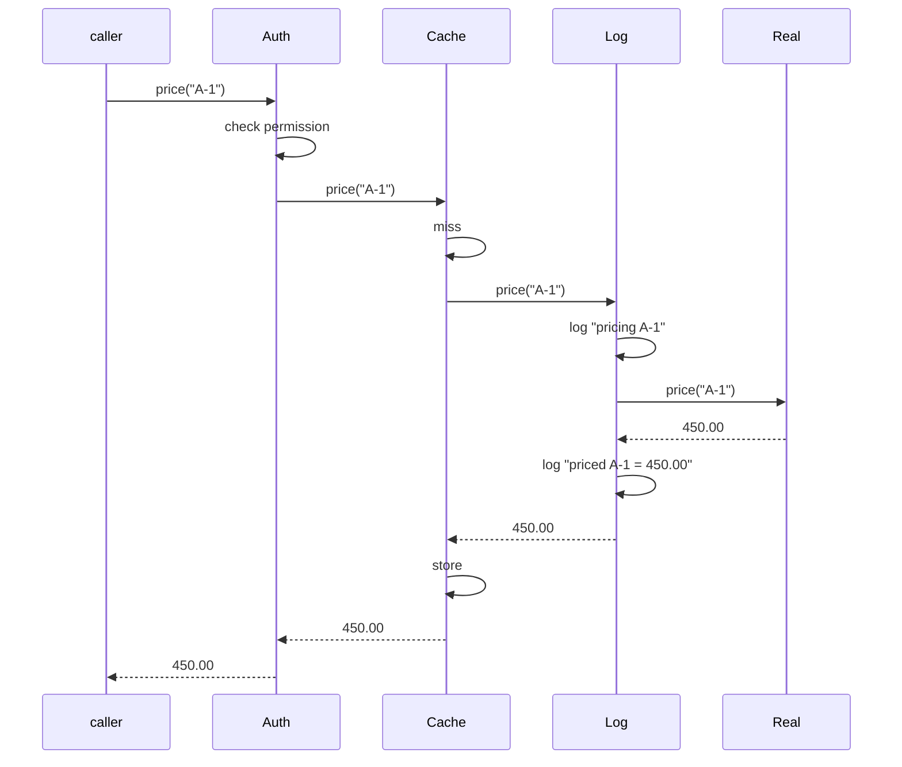

# Day 069 · System Design — Decorator

**After today you can:** You can add behaviour to an object at runtime without subclassing it.

**The interviewer asks it as:** *Add logging and caching to this service without changing its code.*

---

## 1. What this is, and why they ask it

A **decorator** is an object that has the same interface as the thing it wraps, forwards every call
to it, and does something extra on the way through. Because the interface is unchanged, the caller
cannot tell the difference — and, crucially, **a decorator can wrap another decorator**. That is the
whole pattern, and the stackability is the point.

They ask it because it is the clean answer to a question every real system asks: how do you add
logging, caching, retries, timing, authorisation and rate limiting to a service without turning that
service into a class that does seven things? The alternative people reach for is inheritance, and
inheritance falls over immediately — three optional features means eight subclasses, four means
sixteen, because you need one per combination.

The second reason is a specific trap for Python people. Python has a `@decorator` syntax, and it is
*related to* but not *the same as* the Gang of Four decorator. One wraps a function; the other wraps
an object and preserves its interface. A candidate who says "yes, `@lru_cache`" and stops has
answered half. A candidate who says "the language feature is the function-level version of the same
idea, and here is the object version" has answered all of it.

---

## 2. The story

The courier shop under the flats in Indiranagar does about sixty parcels a day, and the man who runs
it, Faisal, has an order he does things in that he does not deviate from.

Somebody brings in a thing to send. Say it is a set of six glass tumblers going to Chennai.

First the tumblers go in newspaper, individually. Then the whole lot goes into a layer of bubble
wrap. Then into a cardboard box, packed so nothing moves. Then tape along every seam. Then a red
FRAGILE sticker on two sides. Then the address label on top, and finally a clear plastic sleeve over
the label so the rain does not take the ink off.

Seven layers, and each one does exactly one job. The newspaper stops glass touching glass. The bubble
wrap absorbs a drop. The box gives it a shape. The tape stops it opening. The sticker asks for care.
The label says where it goes. The sleeve keeps the label readable.

And at every stage of that, from the first layer to the last, the thing on his counter is still just
a parcel. He can hand it to the driver at any point and the driver's job does not change. That is why
he can add or leave out any layer he likes — a book going to the next street gets a box and a label
and nothing else.

The order is not negotiable, and Faisal is quite sharp about it, because a boy who worked there for
two months got it wrong twice.

The first time he put the address label on the box and then wrapped the whole box in plastic, which
is fine, and then put the FRAGILE sticker on top of the plastic. It came off somewhere in transit.
Nobody knew the parcel was fragile, which is the same as not having put a sticker on at all.

The second time was the other way round and worse. He put the FRAGILE sticker on the inner box and
then put that box inside a bigger box. The sticker was perfect. Nobody was ever going to see it.

Faisal's rule, which he says to every new person, is that it is not enough for each layer to be
right. The layers have to be in the right order, because a layer only affects what is inside it.

---

## 3. The idea in plain English

The tumblers are the **component** — the real object that does the actual job. Each wrapping is a
**decorator**. And the reason the layers stack is that after every one of them, the thing is still a
parcel: **the interface never changes**.

Two consequences, and they are the two things to say.

**One: you can combine them freely.** Seven layers, or two, or five in a different order. Nobody had
to invent a "boxed, taped, fragile, labelled parcel" as a separate kind of thing.

**Two: order matters, because a layer only affects what is inside it.** The FRAGILE sticker on the
inner box is a caching decorator underneath a logging decorator — technically correct, and it never
sees the traffic you wanted it to see.

### The shape

```python
from typing import Protocol

class PriceService(Protocol):
    def price(self, order_id: str) -> Decimal: ...


class RealPriceService:                       # the component
    def price(self, order_id: str) -> Decimal:
        return self._db.fetch_price(order_id)  # the actual work
```

A decorator implements the same protocol, holds one of them, and forwards:

```python
class LoggedPriceService:                     # same interface
    def __init__(self, inner: PriceService) -> None:
        self._inner = inner

    def price(self, order_id: str) -> Decimal:
        log.info("pricing %s", order_id)
        result = self._inner.price(order_id)   # forward
        log.info("priced %s = %s", order_id, result)
        return result
```

And another one, identical in shape:

```python
class CachedPriceService:
    def __init__(self, inner: PriceService) -> None:
        self._inner = inner
        self._cache: dict[str, Decimal] = {}

    def price(self, order_id: str) -> Decimal:
        if order_id not in self._cache:
            self._cache[order_id] = self._inner.price(order_id)
        return self._cache[order_id]
```

Now compose:

```python
service = CachedPriceService(LoggedPriceService(RealPriceService()))
```

`service` is a `PriceService`. Every caller uses it identically. Nobody has been edited.

### Why not inheritance

Because you need one subclass per **combination**, and combinations grow as `2^n`.

```
 features: logging, caching, retry
 subclasses needed:
   PriceService
   LoggedPriceService
   CachedPriceService
   RetryingPriceService
   LoggedCachedPriceService
   LoggedRetryingPriceService
   CachedRetryingPriceService
   LoggedCachedRetryingPriceService      = 8
```

Add a fourth feature and it is sixteen. Add timing, authorisation and rate limiting and it is
one hundred and twenty-eight classes. With decorators it is **one class per feature** — three
features, three classes, and any of the eight combinations is a line of composition.

This is `2^n` against `n`, and it is the number to quote.

### Order matters, and here is the concrete case

```python
CachedPriceService(LoggedPriceService(real))     # cache OUTSIDE
LoggedPriceService(CachedPriceService(real))     # cache INSIDE
```

Not stylistic. They log different things.

With the cache **outside**, a cache hit never reaches the logger, so your logs show only the calls
that missed. Your dashboard says "12 pricing calls" when the application made 4,000.

With the cache **inside**, every call is logged and only the misses reach the database. Your logs
show 4,000, which is what you probably wanted.

Neither is wrong. But you have to know which one you built, and "the outermost decorator sees
everything; the innermost sees least" is the sentence that gets it right every time. Faisal's
FRAGILE sticker on the inner box is the cache-outside case: perfectly applied, never seen.

The same reasoning settles the other common orderings:

- **Retry outside a timeout** means each attempt gets its own timeout. **Timeout outside retry** means
  all attempts share one budget. Both are legitimate; they are different products.
- **Authorisation should be outermost.** A cache in front of an auth check will serve a cached result
  to somebody who is not allowed to see it, which is a security bug, not a performance one.

### The Python distinction you must make

```python
@lru_cache
def price(order_id: str) -> Decimal: ...
```

This is Python's `@decorator` syntax. It takes a function, returns a replacement function, and the
name is rebound. It is genuinely the same *idea* — wrap, add behaviour, keep the calling convention —
and it is not the GoF pattern, which wraps an **object** and preserves an **interface**.

The differences that matter in practice:

| | Python `@decorator` | GoF decorator |
|---|---|---|
| Wraps | a function | an object |
| Applied | at definition time | at run time, when you compose |
| Chooseable per instance | no | yes |
| Removable at run time | no | yes |

The second row is the one that decides real designs. `@lru_cache` is baked in when the module loads.
An object decorator lets you cache in production and not in tests, or wrap only the instance serving
a particular tenant.

Use the syntax when the behaviour is fixed for all uses. Use the object when composition should be a
run-time decision.

One thing to always mention about the syntax version:

```python
from functools import wraps

def timed(function):
    @wraps(function)                 # without this, the name and docstring are lost
    def wrapper(*args, **kwargs):
        ...
    return wrapper
```

Without `@wraps`, the decorated function's `__name__` becomes `"wrapper"`, its docstring disappears,
and anything that introspects it — Flask's routing, pytest's collection, Sphinx — misbehaves.

---

## 4. The picture

The layers, and what each one sees.

```
   +-----------------------------------------------------+
   |  AuthDecorator          sees: every call            |   <- outermost
   |  +-----------------------------------------------+  |
   |  |  CachedDecorator     sees: every call          |  |
   |  |  +-----------------------------------------+  |  |
   |  |  |  LoggedDecorator  sees: cache MISSES only|  |  |
   |  |  |  +-----------------------------------+  |  |  |
   |  |  |  |  RealPriceService                 |  |  |  |
   |  |  |  |  does the actual work             |  |  |  |
   |  |  |  +-----------------------------------+  |  |  |
   |  |  +-----------------------------------------+  |  |
   |  +-----------------------------------------------+  |
   +-----------------------------------------------------+

   composed as:  Auth( Cached( Logged( Real() ) ) )
                 ^^^^                        ^^^^
              outermost                   innermost
```

What to notice: **each layer only sees what gets past the layer outside it.** The logger here is
inside the cache, so it records misses and nothing else. Swap those two lines and it records
everything. That single fact is what makes ordering a design decision rather than a formatting one.

And the same call, as a sequence, so the "on the way in and on the way out" shape is visible:



Every decorator gets two moments: before the forward, and after the return. Retry and timing use
both; logging usually uses both; authorisation usually only the first.

---

## 5. How it actually works

### Writing one, in order

1. **The interface must exist first.** Decorator only works if there is a type the component and all
   the decorators share. In Python, `typing.Protocol`.
2. **The decorator holds the inner one and forwards every method.** Every method, not just the
   interesting one — a decorator that implements two of five methods is not substitutable.
3. **Compose at the composition root**, where the object graph is built
   ([day 059](../day-059-sorting-revision/README.md)).

```python
def build_service(settings: Settings) -> PriceService:
    service: PriceService = RealPriceService(db)
    service = LoggedPriceService(service)
    if settings.cache_enabled:
        service = CachedPriceService(service)          # conditional!
    return AuthorisedPriceService(service, policy)
```

That `if` is the thing subclassing cannot do. The composition is a run-time decision.

### The forwarding problem, and Python's escape hatch

For an interface with fifteen methods, a decorator that only changes one still has to forward
fourteen. That is real, tedious code and a real source of bugs when method sixteen is added.

Python has an answer:

```python
class LoggedService:
    def __init__(self, inner): self._inner = inner

    def __getattr__(self, name):          # anything not defined here
        return getattr(self._inner, name)  # goes to the inner object

    def price(self, order_id):             # the one we actually change
        ...
```

`__getattr__` is called only for attributes not found normally, so everything you did not override
forwards automatically. It is convenient and it costs you static type checking — the type checker
cannot see those methods. Mention both halves.

### Real products, and you have used all of them

- **`java.io`** is the textbook case: `new BufferedReader(new InputStreamReader(new FileInputStream(f)))`.
  Three decorators, three jobs, one `Reader` interface. It is also the standard example of the
  pattern's cost, because that line is genuinely hard to read.
- **`functools.lru_cache`, `functools.cache`** — the function-level version, and the one you will
  cite first.
- **WSGI / ASGI middleware, Django middleware, Express middleware.** A middleware is a decorator over
  a request handler, and the ordering rules in this lesson are exactly the ordering rules those
  frameworks document. Django's `MIDDLEWARE` list is a composition order, and putting the
  authentication middleware in the wrong place is a real, documented security mistake.
- **gRPC interceptors** and **Envoy filters** — the same idea in a service mesh.
- **`@property`, `@staticmethod`, `@classmethod`** — descriptors implemented via the syntax.
- **Retry, circuit breaker and timeout wrappers** — Polly in .NET, Resilience4j in Java, `tenacity`
  in Python. All decorators, all with the ordering question this lesson describes.
- **`contextlib.contextmanager`** — a decorator producing an object with a different protocol.

### Decorator versus its neighbours, again

From [day 068](../day-068-stacks/README.md), refined now that you have seen both:

- **Adapter** changes the interface. It cannot stack, because after adapting, the shape is different.
- **Decorator** keeps the interface. It stacks *because* it keeps the interface.
- **Proxy** also keeps the interface, and the difference is intent: a proxy controls *access* — lazy
  loading, permission, remoting — while a decorator adds *behaviour*. On a class diagram they are
  identical, and honest answers say so.
- **Facade** changes how many things you talk to.

The most useful distinguishing question is: **can I apply two of these at once and does that mean
something?** If yes, it is a decorator.

---

## 6. The numbers

### The subclass explosion

```
 features   subclasses (inheritance)   classes (decorator)
    1                 2                        1
    2                 4                        2
    3                 8                        3
    4                16                        4
    7               128                        7
```

`2^n` against `n`. And the decorator side gets a second benefit that is easy to miss: adding an
eighth feature is **one new class and zero edits**, while the inheritance side is 128 new classes.

At three features — logging, caching, retry — that is 8 classes of roughly 30 lines each, so about
240 lines, against 3 classes and one composition line, about 100. And the 8 classes contain
duplicated logic, because `LoggedCachedService` and `LoggedRetryingService` both re-implement
logging.

### What each layer costs at run time

A Python method call through a decorator is roughly 80-150 nanoseconds of overhead.

```
 4 layers x 120 ns  =  ~0.5 microseconds per call
 the real work (a database query)  =  ~2,000 microseconds
 overhead as a fraction            =  0.025%
```

So for anything doing real I/O, the cost is nothing and you should say so plainly. For a function
called ten million times in a tight loop it is 5 seconds, and there the pattern is the wrong tool.
**Name the condition, not just the number.**

### What the cache decorator buys, which is the point

```
 without cache:  4,000 calls x 2 ms database round trip = 8.0 s per request batch
 with cache at 85% hit rate:
     600 misses x 2 ms  +  3,400 hits x 0.001 ms  = 1.2 s
 improvement: ~6.7x
```

And the ordering consequence, in the same numbers: with the logger **inside** the cache, your logs
record 600 lines and your dashboard reports 600 pricing calls when the application made 4,000. That
is not a small reporting error; it is the kind that makes a capacity plan wrong.

### The debugging cost

The honest one:

```
 stack trace depth, undecorated:   3 frames
 stack trace depth, 4 decorators:  11 frames, 8 of which are `wrapper` or `price`
```

Every exception now travels through four layers of near-identical frames. This is the real reason
people dislike `java.io`, and it is worth conceding.

---

## 7. The trade-offs

### What you give up

**Readability of the composition line.**
`Auth(Cached(Logged(Retrying(Real()))))` is four decisions in one expression, read inside-out. It is
genuinely harder than a single class, and pretending otherwise is why people distrust patterns.

**Debuggability.** Deeper stack traces, mostly forwarding frames. Breakpoints in the wrong layer.
`repr()` showing you a wrapper instead of the thing.

**Identity.** `isinstance(service, RealPriceService)` is `False` once wrapped, and so is
`service is real`. Any code that compares identity or checks concrete types breaks. In Python,
`__name__` and `__doc__` are lost without `functools.wraps`. In Java, `equals` on a wrapped object is
a well-known hazard.

**Ordering bugs, which are silent.** The FRAGILE sticker on the inner box. Nothing raises, nothing
logs, and the layer simply does not do what you thought. Auth inside a cache is the version of this
that is a security incident.

**The forwarding burden.** Fifteen methods, fourteen of them pass-through. `__getattr__` solves it in
Python at the cost of type checking; in Java it is fifteen real methods.

### "I would not use this if..."

- **...there is only one feature and it will never be optional.** Put it in the class. A decorator to
  add logging to a service that will always log is a file for nothing.
- **...the features are not independent.** Decorator assumes layers compose freely. If caching must
  know about retries, they are not separate concerns and stacking them will produce something subtly
  wrong.
- **...the interface is wide and unstable.** Fifteen methods that change monthly means every
  decorator changes monthly too.
- **...the call is in a genuinely hot path.** Ten million calls a second, and four layers is five
  seconds of pure overhead.
- **...the language gives me it for free at the right granularity.** For a pure function with fixed
  behaviour, `@lru_cache` is one line and an object decorator is thirty.

### The strongest thing you can say

Concede that decorators move complexity rather than removing it. The eight-subclass explosion becomes
three classes and **one composition line that is now load-bearing** — and that line is not covered by
any test unless you write one for it. Teams that use decorators heavily eventually write a test that
asserts the composition order, precisely because getting it wrong is silent.

---

## 8. In the interview

### How it gets asked

- The direct one: *"Add logging and caching to this service without changing its code."*
- The comparison: *"What is the difference between decorator and inheritance?"* — where the expected
  answer includes the `2^n` arithmetic.
- The Python one: *"Is Python's `@decorator` the same as the decorator pattern?"* A precision test.
- The distinction: *"Decorator or proxy?"* — same structure, different intent.
- The sharp one, and the best: *"Does the order of your decorators matter?"*

### What to say out loud, in the first ninety seconds

1. **Say the defining property first.** "A decorator has the same interface as the thing it wraps and
   forwards to it. Because the interface is unchanged, decorators stack — and the stacking is the
   whole point."
2. **Kill inheritance with arithmetic.** "The alternative is subclassing, and that needs one class
   per combination — three features is eight subclasses, seven is a hundred and twenty-eight.
   Decorators are one class per feature."
3. **Write the composition line and read it out.** `Cached(Logged(Real()))`, and say which is
   outermost.
4. **Volunteer the ordering point before being asked.** "Order matters, because each layer only sees
   what gets past the one outside it. With the cache outside the logger, a cache hit is never logged,
   so my dashboard reports 600 calls when the app made 4,000."
5. **Make the Python distinction.** "Python's `@` syntax is the function-level version of the same
   idea. It is fixed at import time, so if I want to cache in production and not in tests, I want the
   object version."

### The follow-ups

**"Does the order matter? Give me an example."**
"Yes, and it is the most useful thing about the pattern. Cache outside logger means cache hits are
never logged, so the logs undercount. Retry outside timeout gives each attempt its own budget;
timeout outside retry gives all attempts one shared budget. And authorisation should always be
outermost — a cache in front of an auth check will serve a cached answer to someone who is not
allowed to see it, which turns a performance decision into a security bug."

**"Is Python's `@decorator` the decorator pattern?"**
"Same idea, different granularity. The syntax wraps a function and rebinds the name at definition
time. The pattern wraps an object and preserves an interface, which means the composition is a
run-time decision — I can wrap conditionally, per instance, per tenant, or not at all in tests. So
for fixed behaviour on a pure function I would use `@lru_cache`; for anything I want to configure, I
would use objects. And with the syntax I would always use `functools.wraps`, or the function's name
and docstring are lost and anything that introspects it breaks."

**"What is the difference between decorator and proxy?"**
"Structurally nothing — both keep the interface and hold the inner object. The difference is intent.
A decorator adds behaviour and expects to be stacked. A proxy controls access — lazy loading,
permission checks, talking to a remote object — and there is usually exactly one. The test I use is:
would applying two of these at once mean something? If yes, decorator."

**"What breaks when you wrap something?"**
"Identity and type checks. `isinstance` against the concrete class is false, object identity is
false, and in Python `__name__` and `__doc__` are gone without `wraps`. Stack traces get deeper —
four layers turns three frames into about eleven, most of them forwarding. And if the interface has
fifteen methods, a decorator has to forward fourteen it does not care about; in Python I would use
`__getattr__` for that, at the cost of static type checking."

**"When would you not use it?"**
"When there is one feature and it is never optional — put it in the class. When the features are not
actually independent, because stacking assumes they compose freely. And in a genuinely hot path: each
layer is roughly a hundred nanoseconds, which is nothing next to a two-millisecond database call and
is five seconds across ten million calls."

### A model answer

Asked: *add logging and caching to this service without changing its code.*

> "I would write one decorator per concern. A decorator implements the same interface as the service,
> holds an instance of it, forwards every call, and does its own thing on the way through. Because
> the interface is unchanged, the caller cannot tell, and — the important part — a decorator can wrap
> another decorator.
>
> So: a `PriceService` protocol with the one method. `RealPriceService` does the work.
> `LoggedPriceService` logs, calls the inner one, logs the result. `CachedPriceService` checks a
> dictionary, calls the inner one on a miss, stores. Then at the composition root I write
> `CachedPriceService(LoggedPriceService(RealPriceService()))`. Nothing existing was edited.
>
> The reason I would not subclass is arithmetic. Subclassing needs one class per *combination* —
> logged, cached, logged-and-cached, plus the plain one, so four for two features and eight for
> three. Seven features would be a hundred and twenty-eight classes with duplicated logic in them.
> Decorators are one class per feature and the combination is a line of composition.
>
> Now the thing I would raise before you ask, because it is the part that actually bites. **The order
> matters**, because each layer only sees what gets past the layer outside it. In what I just wrote,
> the cache is outside the logger, so a cache hit never reaches the logger — my logs would record
> only the misses. At an 85% hit rate the dashboard would say 600 pricing calls when the application
> made 4,000, which will make somebody's capacity estimate wrong. If I want every call logged, the
> logger goes outside the cache. Neither is wrong; I just have to know which one I built.
>
> The same reasoning settles the others. Retry outside timeout means each attempt gets its own
> budget; the other way round, all attempts share one. And authorisation goes outermost always,
> because a cache in front of an auth check will serve a cached result to somebody who should not see
> it — that is a security bug wearing a performance decision's clothes.
>
> Since this is Python, I should distinguish two things. `@lru_cache` is the function-level version of
> the same idea, and it is one line. What it cannot do is vary at run time — it is baked in when the
> module is imported. The object version lets me write `if settings.cache_enabled:` in the
> composition, cache in production and not in tests, or wrap only the instance serving one tenant. If
> I did use the syntax I would always use `functools.wraps`, otherwise the wrapped function's name
> and docstring are lost.
>
> What I am giving up: the composition line is read inside-out and is genuinely harder than one
> class; stack traces get about eight frames deeper, mostly forwarding; and `isinstance` against the
> concrete class stops being true. The one I would actually guard against is the ordering, because it
> fails silently — so on a team doing this heavily I would write a test that asserts the composition
> order."

---

## 9. Recall card

- **Same interface, wraps one object, forwards, adds behaviour — and *therefore* stacks.** The
  unchanged interface is what makes composition possible; that is the whole pattern.
- **Kill inheritance with arithmetic: `2ⁿ` subclasses vs `n` decorators.** 3 features = 8 subclasses
  (with duplicated logic) vs 3 classes and one composition line; 7 features = **128 vs 7**. And an
  eighth feature is 1 new class and 0 edits.
- **Order matters, because a layer only sees what gets past the layer outside it.** Cache *outside*
  logger ⇒ hits are never logged (dashboard says 600 when the app made 4,000). Retry outside timeout
  ⇒ a budget *per attempt*; timeout outside retry ⇒ one *shared* budget. **Auth is always outermost**
  — a cache in front of an auth check serves cached data to someone not allowed to see it.
- **Python's `@decorator` is the function-level version, not the pattern.** It is fixed at import
  time; the object version is a **run-time** decision (`if settings.cache_enabled:`, per instance,
  per tenant, off in tests). Always `functools.wraps`, or `__name__` and `__doc__` are lost and
  introspection breaks. `__getattr__` forwards the 14 methods you do not care about, at the cost of
  type checking.
- **Adapter changes the interface (cannot stack) · decorator keeps it and adds behaviour (stacks) ·
  proxy keeps it and controls *access* (usually one) · facade changes how many things you talk to.**
  Costs to concede: ~11 stack frames instead of 3 · `isinstance` and identity break · ~120 ns per
  layer (nothing against a 2 ms query, 5 s across 10M calls) · and the composition line becomes
  load-bearing, so **test the order**.
