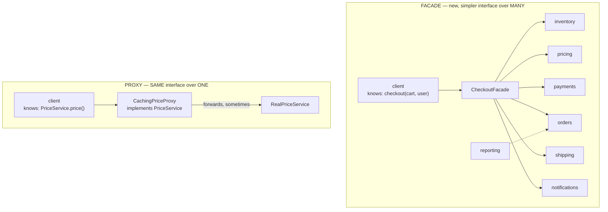

# Day 070 · System Design — Facade and proxy

**After today you can:** You can hide a messy subsystem behind one clean entry point.

**The interviewer asks it as:** *Your checkout touches six services. How do you expose it to the client?*

---

## 1. What this is, and why they ask it

Two structural patterns, both of which put something in front of something else, for opposite
reasons.

A **facade** is one simple entry point onto a complicated subsystem. The caller says `checkout(cart)`
and does not learn that six services were involved or what order they had to be called in. The
subsystem is unchanged and still directly reachable by anyone who needs it — a facade adds a door, it
does not build a wall.

A **proxy** has **the same interface** as the thing behind it and controls access to it. Same method
names, same signatures, and it decides whether, when, and how the real object is reached — lazily,
remotely, after a permission check, or from a cache.

They ask this pair because it is the point where object-oriented patterns become system design. The
checkout question is a facade question at class level and an API gateway question at service level,
and they are the same shape. Interviewers also ask because the four wrapping patterns — adapter,
decorator, facade, proxy — look identical on a class diagram, and the ability to separate them
crisply is a reliable indicator. Everybody can say "it wraps something". Very few can say what each
one changes.

---

## 2. The story

The hospital on the main road in Hubli is not large — four consulting rooms, a lab at the back, a
pharmacy counter and about sixty people through the door on a weekday morning.

Prema sits at the front desk.

A man came in one Tuesday with his mother, who had been sent by a doctor elsewhere for a blood test
and a consultation. He had a slip of instructions and no idea what to do with it.

What has to happen for that visit is not one thing. Her file has to be found or a new one made. The
consultation has to be booked with whichever doctor is free. The lab has to be told a sample is
coming and given the right test codes. Billing has to raise an entry, because the lab will not draw
blood without one. If she is on a scheme, the scheme has to be checked, and that is a phone call. And
afterwards the pharmacy needs the prescription before it will dispense.

Six things, six different people, in a particular order — billing before the lab, always, because it
has been the wrong way round before and it caused an argument.

He said none of that. He gave Prema the slip and said his mother had been sent for a blood test. She
asked three questions, and then told him to sit down for ten minutes.

While he sat, she did all six. He never knew.

That is the front desk. There is one more thing worth watching in that building, and it happens
outside room four.

Dr Kulkarni sees patients in room four, and outside the door sits Manjunath on a plastic chair. If
you want the doctor, you go to that door — there is no other way in. Manjunath is not a smaller
doctor and he does not answer medical questions. What he does is: check that you have an appointment,
check that billing has been done, tell you the doctor is with someone and there are two ahead of you,
and, four or five times a day, answer a question himself because he has heard the answer so often —
yes, come back Thursday; no, do not eat before the test.

To the patient, going to room four is going to room four. What is different is that somebody decides
whether and when you get in.

---

## 3. The idea in plain English

Prema is a **facade**. Manjunath is a **proxy**. They are doing different jobs and it is worth being
precise about how.

**A facade simplifies.** Behind Prema there are six different people with six different interfaces.
She gives you one. Note two things: she is **not** the only way to reach the lab — a doctor walks
straight in — and she does not have the same interface as any of the six, because she has her own
simpler one.

**A proxy controls.** Manjunath presents the same interface as the door itself — you go to the door
either way. He does not simplify anything. He decides whether you get in, when you get in, and
occasionally answers instead of the doctor, which is caching.

### The four wrappers, finally separated

You have now met all four. This table is the answer to the question interviewers ask.

| Pattern | Interface | Number behind it | Intent |
|---|---|---|---|
| **Adapter** | **different** | one | make an incompatible thing usable |
| **Decorator** | **same** | one | add behaviour, and stack it |
| **Facade** | **new and simpler** | **many** | reduce what the caller must know |
| **Proxy** | **same** | one | control access |

Two questions separate all four:

1. **Is the interface the same as the thing behind it?** Same → decorator or proxy. Different →
   adapter or facade.
2. **Then: how many things are behind it, and why is it there?** Many and simpler → facade. One and
   incompatible → adapter. Adding behaviour and stackable → decorator. Controlling access → proxy.

Decorator and proxy are the genuinely hard pair, because structurally they are identical. The honest
distinction is **intent plus multiplicity**: you stack decorators and expect several; a proxy is
usually one and is about access rather than behaviour.

### Facade, in code

```python
class CheckoutFacade:
    def __init__(self, inventory, pricing, payments, orders,
                 notifications, shipping) -> None:
        ...

    def checkout(self, cart: Cart, user: User) -> Order:
        self._inventory.reserve(cart.items)                 # 1
        total = self._pricing.price(cart, user.country)     # 2
        payment = self._payments.charge(user, total)        # 3
        order = self._orders.create(cart, payment)          # 4
        self._shipping.schedule(order)                      # 5
        self._notifications.order_placed(order)             # 6
        return order
```

The caller writes `checkout(cart, user)`. What the facade removed is not the six services — they are
all still there — it is **the caller's need to know the order and the failure handling.** Reserve
before charging. Charge before creating the order. Notify last. Every caller that did this by hand
was a chance to get the order wrong.

### The rule that keeps a facade from becoming a god object

This is the part to volunteer, because it is the pattern's failure mode.

> **A facade may sequence and translate. It must not make business decisions.**

The moment `checkout` contains `if user.country == "IN": total *= Decimal("1.18")`, the tax rule
lives in the facade, and next month the discount rule joins it, and in a year it is a 900-line class
that four teams edit — the divergent change from [day 061](../day-061-collisions/README.md).

The other rule: **do not seal the subsystem.** A facade is a convenience, not a wall. Reporting still
talks to `orders` directly. If you forbid that, every caller with a slightly different need has to
widen the facade, and it grows one method at a time until it is the union of everything.

### Proxy, and its four kinds

All four have the same interface as the real thing. What differs is what they do before forwarding.

**Virtual proxy — defer expensive work.** The classic is an ORM. `order.customer` looks like a
`Customer` object and is actually a stand-in that fires a query the first moment you touch a field.
This is what makes the N+1 problem from [day 041](../day-041-prefix-revision/README.md) so easy to
create: the proxy is invisible, so a loop over 100 orders quietly becomes 101 queries.

**Remote proxy — the real object is elsewhere.** A gRPC or RMI stub. You call a local method; it
serialises, sends, waits, deserialises. The whole point is that the call site looks local — and the
whole danger is that the call site looks local, because a local call cannot fail with a timeout and a
remote one can.

**Protection proxy — check permission first.** Manjunath. Same interface, plus an authorisation check
before forwarding.

**Caching (or smart) proxy — answer without asking.** Same interface, returns a stored answer when it
can. Manjunath telling you not to eat before the test.

### The system-level versions, which is where interviews go

The same two patterns, one layer up.

- **API gateway** — a facade over many services, for external clients. One endpoint, one
  authentication, one rate limit, and it fans out.
- **Backend-for-frontend (BFF)** — a facade per client type, because the mobile app and the web app
  need different shapes. This is the honest answer to "one facade or many": one per audience.
- **Reverse proxy (nginx, Envoy, Cloudflare)** — a proxy: same HTTP interface, controlling TLS
  termination, routing, caching and rate limiting.
- **Service mesh sidecar** — a proxy per service instance, doing retries, timeouts, mutual TLS and
  telemetry.
- **CDN** — a geographically distributed caching proxy.

When an interviewer asks the checkout question, they usually want the class-level facade *and* the
sentence "at the service level this is what an API gateway is".

---

## 4. The picture

The two patterns side by side, with what the caller knows in each.



Two things to notice. In the facade, the dashed arrow from `reporting` goes straight to `orders` — the
subsystem is **not sealed**, and that is deliberate. In the proxy, the client's declared type is
`PriceService`, the same type the real object has, which is what lets the proxy be substituted
without anyone knowing.

And the checkout sequence, because the ordering is the thing the facade is really protecting:

```
 caller: checkout(cart, user)
    |
    +-- 1. inventory.reserve(items)       <- must be first: fail fast if out of stock
    |
    +-- 2. pricing.price(cart, country)
    |
    +-- 3. payments.charge(user, total)   <- must be after 1: never charge for
    |                                        something you cannot ship
    +-- 4. orders.create(cart, payment)
    |
    +-- 5. shipping.schedule(order)
    |
    +-- 6. notifications.order_placed()   <- must be last: never email about an
                                             order that then failed to save
```

The caption is the point: **each of those "must be" comments is a rule that used to live in nine
callers and now lives in one.** That is the actual product a facade sells.

---

## 5. How it actually works

### Writing a facade

1. **Start from the caller's sentence, not the subsystem.** "Place this cart as an order for this
   user." One method, arguments in the caller's vocabulary, returning the caller's type.
2. **Sequence and translate inside.** Call the six in the correct order; convert their types into
   yours.
3. **Decide the failure policy in one place.** What happens if payment succeeds and order creation
   fails? That question has to be answered somewhere, and the facade is a much better somewhere than
   nine call sites.
4. **Keep decisions out.** Sequencing yes, business rules no.
5. **Leave the subsystem reachable.**

The failure policy is the part that turns this from a tidiness exercise into engineering. A real
checkout facade has a compensation path — refund on failure, or an outbox that retries the
notification, or an idempotency key so a retry does not double-charge. Mentioning even one of those
is worth a great deal.

### Writing a proxy

Identical shape to a decorator, and in Python identical code:

```python
class CachingPriceProxy:
    def __init__(self, inner: PriceService) -> None:
        self._inner = inner
        self._cache: dict[str, Decimal] = {}

    def price(self, order_id: str) -> Decimal:
        if order_id not in self._cache:
            self._cache[order_id] = self._inner.price(order_id)
        return self._cache[order_id]
```

If that looks exactly like the caching decorator from
[day 069](../day-069-balanced-brackets/README.md), that is because it is. **The pattern is in the
intent, not the code.** Say so if asked — pretending there is a structural difference is worse than
admitting there is not.

### Real products, named

**Facades:**

- `requests.get(url)` — behind one line: connection pooling, DNS, TLS, redirects, cookies, retries,
  content decoding, across about six subsystems.
- `subprocess.run()` — a facade over `Popen`, pipes, and `communicate`.
- SLF4J, `logging.basicConfig()`.
- An API gateway: Kong, AWS API Gateway, Apigee.
- Stripe Checkout — one hosted page over cards, 3-D Secure, wallets and receipts.

**Proxies:**

- nginx, HAProxy, Envoy, Cloudflare — reverse proxies.
- Hibernate and Django ORM lazy objects — virtual proxies, and the source of N+1.
- gRPC and Thrift stubs — remote proxies.
- Java dynamic proxies and Spring AOP — how `@Transactional` works: the object you are injected is a
  proxy that opens a transaction, forwards, and commits. This is also why calling a `@Transactional`
  method from *inside* the same class does nothing, because that call does not go through the proxy.
  That is a very good detail to know.
- `unittest.mock.Mock` — a proxy that records instead of forwarding.

### The subtlety that makes proxies dangerous

A proxy is invisible by design, and that is its risk. Three specific consequences worth naming:

- **The ORM proxy** makes a database query look like a field access, which is why N+1 problems are
  written by careful people.
- **The remote proxy** makes a network call look like a method call, which is the first of the
  fallacies of distributed computing: the network is not reliable, and the call site does not say so.
- **The Spring proxy** means self-invocation bypasses the behaviour entirely, silently.

In each case the interface being identical is exactly what causes the problem. Say that: **the
proxy's greatest strength and its main hazard are the same property.**

---

## 6. The numbers

### The facade, at class level

```
 callers of the checkout flow                     9
 services each must know, without a facade        6
 total coupling edges                     9 x 6 = 54
 with a facade                            9 x 1 + 1 x 6 = 15
```

More than a threefold reduction in edges, and more importantly the ordering rule is written once
instead of nine times. **Nine chances to charge before reserving becomes one.**

Adding a seventh service: without a facade, 9 files edited; with one, 1.

### The facade, at service level — where the numbers get large

A mobile client assembling a home screen from six services itself:

```
 6 round trips, mobile network RTT ~120 ms
 sequential:  6 x 120 ms = 720 ms
 parallel:    ~120 ms, but 6 TLS handshakes and 6 auth checks
 payload:     6 responses, ~40 KB total, much of it unused by this screen
```

Through a gateway or BFF:

```
 1 round trip:            120 ms
 the fan-out happens in the data centre, where RTT is ~1 ms
 6 x 1 ms in parallel  =  ~5 ms
 total:                   ~125 ms
 payload: one response shaped for this screen, ~8 KB
```

**720 ms to 125 ms, and 40 KB to 8 KB.** On a mobile network that is the difference between a screen
that feels instant and one that does not, and it is the standard justification for a BFF.

### The proxy, priced

**Caching proxy**, at an 85% hit rate on a 2 ms backend call:

```
 without:  10,000 calls x 2 ms      = 20 s of backend time
 with:     1,500 misses x 2 ms      = 3 s        (~6.7x less load)
```

**Virtual proxy, and its cost when it goes wrong** — the N+1:

```
 100 orders, each touching order.customer lazily
 1 + 100 queries x 1.5 ms = 151 ms
 with an eager join:      1 query x 4 ms = 4 ms
 ratio: ~38x
```

That number is the price of the proxy being invisible.

**Reverse proxy overhead:** nginx adds roughly 0.1-1 ms per request. Against a 50 ms application
response that is under 2%, and it buys TLS termination, connection reuse, rate limiting and static
caching. Quote both halves.

### What a facade costs

```
 the facade class                      ~40-80 lines
 tests for the sequencing               ~6 cases
 one more file in the call path           1 hop
```

Small. The real cost is not lines; it is the risk that it grows. A facade that starts at 60 lines and
reaches 900 has become the god object it was supposed to prevent, and that happens one reasonable
addition at a time.

---

## 7. The trade-offs

### What a facade costs you

**It can become a god object.** The single biggest risk. Every new cross-cutting need is "just one
more method on the facade", and there is no natural point at which anybody says no. The defence is
the rule: sequencing and translation only, never decisions — and a periodic look at
`git log` on the file to see how many teams are editing it.

**It hides capability.** The subsystem can do forty things and the facade exposes six. A caller
needing the seventh either widens the facade or bypasses it, and if bypassing is forbidden the facade
grows without limit.

**It can become the lowest common denominator.** One facade for four different kinds of caller ends
up serving none of them well. That is exactly why BFF exists: one facade per audience, not one
facade.

**One more hop to read through.** Minor, and real.

### What a proxy costs you

**Invisibility.** Already the main point: N+1 from ORM proxies, unexpected timeouts from remote
proxies, silent no-ops from self-invocation through Spring proxies. The interface being identical is
what causes all three.

**Stale data.** A caching proxy is a correctness decision wearing a performance costume. What is the
invalidation rule? How stale may an answer be? If nobody has decided, the proxy has introduced a bug
nobody has noticed yet.

**Failure modes the interface cannot express.** `price(order_id)` does not say "this may take four
seconds and time out". Two implementations of one interface behaving very differently is the Liskov
issue from [day 057](../day-057-stability-and-pythons-sort/README.md), arriving through a proxy.

### "I would not use this if..."

- **...the subsystem is already one thing with a sensible interface.** A facade over one class is a
  middle man ([day 061](../day-061-collisions/README.md)). Delete it.
- **...there are two callers and they need different things.** Two small facades beat one wide one.
- **...the facade would need business rules to do its job.** Then the design problem is upstream: a
  concept is missing, not a wrapper.
- **...the proxy's caching has no invalidation story.** Do not ship it.
- **...a lazy proxy is being used to avoid thinking about what to load.** Explicit eager loading is
  better than an invisible query.

### The strongest thing to say about the pair

Concede that facade and proxy do not remove complexity — they **relocate** it, and put a name on
where it now lives. Six services still have to be called in the right order; the facade means that
order is in one file with a test, instead of in nine developers' heads. That is the honest claim, and
it is a good one.

---

## 8. In the interview

### How it gets asked

- The scenario: *"Your checkout touches six services. How do you expose it to the client?"*
- The pair: *"What is the difference between a facade and a proxy?"* — often extended to all four
  wrappers.
- The system-design version: *"Should the mobile app call the services directly or through a
  gateway?"* Same question, one layer up.
- The debugging one: *"Why does this loop make 101 database queries?"* — a virtual proxy question in
  disguise.

### What to say out loud, in the first ninety seconds

1. **Separate the two immediately.** "A facade gives a *new, simpler* interface over *many* things. A
   proxy has the *same* interface as *one* thing and controls access to it. Different intents that
   look identical on a diagram."
2. **Say what the facade actually removes.** "It is not that the six services disappear. It is that
   the caller stops needing to know the order — reserve before charging, notify last — and stops
   owning the failure policy."
3. **Give the two rules unprompted.** "Sequencing and translation, never business decisions. And I
   would not seal the subsystem — reporting can still talk to orders directly."
4. **Go one layer up without being asked.** "At the service level this is an API gateway, and if
   different clients need different shapes it is a backend-for-frontend."
5. **Bring a number.** "For a mobile client, six round trips at 120 ms is 720 ms; one gateway call
   with the fan-out inside the data centre is about 125 ms."

### The follow-ups

**"What is the difference between a proxy and a decorator?"**
"Structurally, nothing — both keep the interface and hold the inner object, and in Python the code
can be identical. The difference is intent and multiplicity. A decorator adds behaviour and is meant
to be stacked, so several is normal. A proxy controls access — lazily, remotely, with a permission
check, or from a cache — and there is usually exactly one. The test I use is: would applying two of
these at once mean something? If yes, decorator."

**"Should the facade be the only way in?"**
"No, and that is a deliberate choice. A facade is a convenience door, not a wall. If I forbid direct
access, then every caller with a slightly different need has to widen the facade, and it grows one
method at a time until it is the union of everything, at which point it is a god object. Reporting
should be able to query orders directly."

**"How do you stop a facade becoming a god class?"**
"One rule: it may sequence and translate, and it may not make business decisions. The moment a tax
rule or a discount rule appears in it, that is the beginning. And I would measure rather than assert
— run `git log` on the file, and if four teams are editing it, that is divergent change and it needs
splitting, probably by audience."

**"Why does this loop make 101 queries?"**
"Because `order.customer` is a virtual proxy, not a `Customer`. It looks like a field and it fires a
query the first time you touch it, so a loop over 100 orders is one query plus a hundred. The fix is
to load eagerly — a join or `select_related` — and the general lesson is that the proxy's invisibility
is both why it is convenient and why this happens. About 151 milliseconds against 4."

**"Gateway or direct calls from the mobile app?"**
"Gateway, and the argument is round trips rather than architecture. Six calls at a 120 ms mobile
round trip is 720 milliseconds even before six TLS handshakes and six auth checks. One call to a
gateway that fans out inside the data centre, where the round trip is about a millisecond, is roughly
125. And the response can be shaped for that screen, so about 8 KB instead of 40. If the web and
mobile clients want genuinely different shapes, I would give each one its own — a
backend-for-frontend — rather than making one gateway serve both badly."

### A model answer

Asked: *your checkout touches six services. How do you expose it to the client?*

> "With a facade — one method, `checkout(cart, user)`, returning an `Order`.
>
> The thing I want to be precise about is what that actually removes, because it is not the six
> services; they are all still there and still directly callable. What it removes is the caller's
> need to know **the order and the failure policy**. Inventory must be reserved before payment is
> charged, or you take money for something you cannot ship. The order must be created before the
> notification goes out, or you email somebody about an order that then failed to save. Right now
> that sequence lives in every caller, so with nine callers there are nine chances to get it wrong,
> and fifty-four coupling edges. With a facade there is one place and fifteen edges.
>
> The failure policy is the half people forget. What happens if the payment succeeds and creating the
> order fails? That question has to be answered somewhere. In the facade I can put a compensating
> refund, or an idempotency key so a retry does not double-charge, or an outbox so the notification
> is retried. In nine call sites, it is answered nine different ways or not at all.
>
> Two rules I would hold it to. It sequences and translates; it does not make business decisions —
> the moment a tax rule appears in it, it starts becoming the god object it was meant to prevent. And
> it does not seal the subsystem; reporting still queries orders directly. If I forbid that, every
> caller with a slightly different need widens the facade and it grows without limit.
>
> Now, if the client is a mobile app rather than another service, the same pattern goes one layer up
> and it is an API gateway. The argument there is round trips: six calls at a 120-millisecond mobile
> round trip is 720 milliseconds, plus six TLS handshakes and six auth checks. One call to a gateway
> that fans out inside the data centre, where round trips are about a millisecond, is roughly 125
> milliseconds — and it can return one response shaped for that screen, maybe 8 KB instead of 40. If
> web and mobile want genuinely different shapes, I would give each its own backend-for-frontend
> rather than one gateway serving both badly.
>
> And since a proxy usually comes up alongside: a proxy is the other thing. It has the *same*
> interface as *one* object and controls access — lazily, remotely, with a permission check, or from
> a cache. nginx in front of the app is one, an ORM's lazy `order.customer` is one, and a gRPC stub
> is one. The property that makes them useful — the caller cannot tell — is also the hazard: it is
> why a hundred-order loop quietly becomes a hundred and one queries, and why a method call that can
> time out looks exactly like one that cannot."

---

## 9. Recall card

- **Facade = a *new, simpler* interface over *many* things. Proxy = the *same* interface over *one*
  thing, controlling access.** Two questions separate all four wrappers: *is the interface the same?*
  (same → decorator/proxy; different → adapter/facade) then *how many, and why?*
- **What a facade removes is the ordering and the failure policy, not the services.** Reserve before
  charging; notify last. 9 callers × 6 services = **54 edges → 15**, and one place to put the
  compensating refund, the idempotency key or the outbox.
- **Two rules keep it from becoming a god object: it may sequence and translate but never make
  business decisions, and it must not seal the subsystem** (reporting still queries orders directly —
  otherwise every new need widens it, one method at a time). Measure it with `git log`, not opinion.
- **One layer up, a facade is an API gateway — and one per audience is a BFF.** Mobile: 6 round trips
  × 120 ms = **720 ms** and ~40 KB, versus 1 call + in-datacentre fan-out = **~125 ms** and ~8 KB.
- **Proxy has four kinds — virtual (lazy), remote, protection, caching — and its invisibility is both
  the point and the hazard.** ORM lazy fields make N+1 easy to write (151 ms vs 4 ms, ~38×); remote
  stubs make a timeout-able call look local; Spring's `@Transactional` does **nothing** on
  self-invocation because that call never goes through the proxy. Structurally a proxy and a
  decorator are identical — **the difference is intent and multiplicity**, and you should say so
  rather than invent one.
