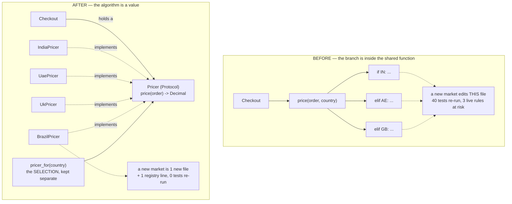

# Day 071 · System Design — Strategy

**After today you can:** You can swap an algorithm at runtime without a chain of if-statements.

**The interviewer asks it as:** *The pricing rule changes per country. How do you structure that?*

---

## 1. What this is, and why they ask it

**Strategy** turns an algorithm into a value. Instead of a function containing a branch that chooses
between three ways of doing something, you define one interface with one method, write one small
implementation per way, and hand the caller whichever one it needs. The code that *uses* the
algorithm never learns how many there are.

It is the most useful of the eleven behavioural patterns, and it is the one you have already been
using since [day 058](../day-058-custom-comparators/README.md) without the name: `sorted(items,
key=...)` is Strategy. Python's `sorted` has no idea how you want things ordered, and that is the
entire design — the comparison rule is a parameter.

They ask it because it is the cleanest demonstration of open/closed from
[day 056](../day-056-non-comparison-sorts/README.md), because the arithmetic for it is easy to state,
and — most usefully — because it is over-applied constantly. Three tax rates that differ only by a
number do not need three classes. A candidate who reaches for Strategy every time there is an `if`
has learned a pattern; a candidate who can say when a dictionary of numbers is the right answer has
learned to design.

---

## 2. The story

Basavaraj has driven an auto in Bengaluru for eleven years, and the trip he does more than any other
is from the flats near the Metro station to the hospital on Bannerghatta Road.

There are three ways to do it, and he can describe all three in one sentence each.

There is the straight one, down the main road. Shortest on the map, and between eight and eleven in
the morning it is thirty-five minutes of not moving.

There is the one through the residential streets behind the school. Longer, twisty, and empty except
between three and four when the school comes out and it is unusable.

And there is the one round by the flyover. Longest by distance, costs more in petrol, and it is the
only one that is the same at nine in the morning as at nine at night.

He does not think about which one to take in the way a passenger might imagine. He asks two things
before he starts — what time is it, and is anyone in a hurry — and then he takes one of the three. If
it is ten past eight he is on the flyover. If it is half past two he is going behind the school. If
there is a man in the back with a bag and a train to catch, flyover, whatever the time is, because it
is the one where he can promise a number.

From the passenger's side, none of this exists. You get in, you say the hospital, and you get to the
hospital. You are not asked to choose, and if he had four routes instead of three you would not
notice.

The part he mentions when the subject comes up is what happened when the new flyover opened in 2023.
He drove it a few times to see what it was like, decided it was good after eight at night, and added
it. That is all that happened. He did not have to think again about the school route or the main
road; they are still exactly what they were. One new thing learned, and nothing unlearned.

His younger cousin drives too, and does it differently — one route, always, the main road, on the
grounds that it is the shortest. He is not wrong about the distance.

---

## 3. The idea in plain English

Each route is a **strategy**: a complete, self-contained way of doing the one job. The job — get to
the hospital — does not change. The method does.

Three things from the story, and they are the three things the pattern buys.

**One: the passenger does not choose and does not know.** The calling code depends on the *job*, not
on which way it is done. That is the interface.

**Two: adding a fourth route did not disturb the other three.** New behaviour arrives as a new thing,
not as an edit to existing things. That is open/closed, and it is the argument you make in edit
counts.

**Three: choosing is a separate job from doing.** Basavaraj's two questions — what time is it, is
anyone in a hurry — are the selection logic, and they are not part of any route. Keeping those apart
is what stops the pattern collapsing back into the `if` chain it replaced.

### The problem it replaces

```python
def price(order: Order, country: str) -> Decimal:
    if country == "IN":
        base = order.subtotal * Decimal("1.18")
        if order.subtotal > 5000:
            base -= Decimal("100")
        return base
    elif country == "AE":
        return order.subtotal * Decimal("1.05")
    elif country == "GB":
        base = order.subtotal * Decimal("1.20")
        return base - order.loyalty_credit
    raise ValueError(country)
```

Four things are wrong, and it is worth naming all four rather than saying "it is ugly".

**Adding a country edits a shared file.** Twelve people depend on `price`. Every new market is a
change to code that is currently working for three existing markets, and forty tests re-run.

**The rules are entangled.** They are in one function, so a change to the UK rule and a change to the
India rule are the same file, the same merge conflicts, the same review.

**You cannot test one rule alone.** Testing the UAE rule means constructing an order and passing
`"AE"`, so the test depends on the dispatch as well as the rule.

**The function has more than one reason to change** — a new market, or a change to an existing
market's rule. That is single responsibility from
[day 055](../day-055-quickselect/README.md).

### The pattern

One interface with one method:

```python
from typing import Protocol

class Pricer(Protocol):
    def price(self, order: Order) -> Decimal: ...
```

One implementation per rule, each in its own file, each testable alone:

```python
class IndiaPricer:
    def price(self, order: Order) -> Decimal:
        total = order.subtotal * Decimal("1.18")
        return total - Decimal("100") if order.subtotal > 5000 else total


class UaePricer:
    def price(self, order: Order) -> Decimal:
        return order.subtotal * Decimal("1.05")
```

And the caller holds one and does not know which:

```python
class Checkout:
    def __init__(self, pricer: Pricer) -> None:
        self._pricer = pricer

    def total(self, order: Order) -> Decimal:
        return self._pricer.price(order)      # no branch, ever
```

### Choosing, which is a separate job

Someone still has to pick. That job is a **factory**
([day 065](../day-065-hashing-custom-objects/README.md)), and keeping it separate is the whole
discipline:

```python
PRICERS: dict[str, Pricer] = {
    "IN": IndiaPricer(),
    "AE": UaePricer(),
    "GB": UkPricer(),
}

def pricer_for(country: str) -> Pricer:
    try:
        return PRICERS[country]
    except KeyError:
        raise UnsupportedCountry(country) from None
```

Concede the honest point: **the branch did not vanish, it moved.** But a line in a dictionary of
constructors cannot break the India rule, and a new branch inside a shared function can. That
distinction is the argument, and stating it plainly is better than pretending the `if` disappeared.

### In Python, a function is a strategy

This is the part that separates someone who learned the pattern from a Java book.

```python
PRICERS: dict[str, Callable[[Order], Decimal]] = {
    "IN": lambda o: o.subtotal * Decimal("1.18"),
    "AE": lambda o: o.subtotal * Decimal("1.05"),
    "GB": lambda o: o.subtotal * Decimal("1.20"),
}

def price(order: Order, country: str) -> Decimal:
    return PRICERS[country](order)
```

That *is* Strategy. There is no class named `Strategy` and there does not need to be — the pattern is
the shape, which is that the varying part is a value you can pass around, not the ceremony.

Take the classes when the rule needs **state**, or **more than one method**, or **its own file
because a specific team owns it**. Take the function when it is a single expression. Twelve lines
against ninety is not a small difference.

Python's own library is full of this: `sorted(key=)`, `min(key=)`, `heapq.nlargest(key=)`,
`re.sub(repl=callable)`, `defaultdict(factory)`. Every one is an algorithm passed as an argument.

### Strategy and its two look-alikes

**Strategy versus State.** Identical structure — an interface, several implementations, a context
holding one. The difference is **who changes it**. In Strategy, the *client* chooses and it usually
stays put. In State, the object **transitions itself**: a `Draft` order moves itself to `Submitted`,
and the states know about each other. If your implementations set the context's next implementation,
you have written State.

**Strategy versus Template Method.** Both vary a step of an algorithm. Template Method uses
**inheritance** — an abstract base with the skeleton and subclasses filling in the holes. Strategy
uses **composition** — the varying part is an object passed in. Composition wins by default
([day 049](../day-049-peak-finding/README.md)): you can change it at run time, use several, and test
each alone.

---

## 4. The picture

The two shapes, side by side.



Two things to notice. `Checkout` has no arrow to any concrete pricer — that is what "the caller never
learns how many there are" means on a diagram. And the selection is its own box: if it were inside
`Checkout`, the branch would be back and nothing would have been gained.

And the cost, drawn as it grows:

```
 markets:        1     2     3     4     5    ...   12
 if-chain
   lines:       10    18    26    34    42          90   in ONE shared file
   tests re-run  8    16    24    32    40          88   on every change
 strategy
   files:        1     2     3     4     5          12   one each, independent
   tests re-run  0     0     0     0     0           0   for existing rules

               ^^^^^^^^^^^^^^^^^^^^^^^^^^^^^^^^^^^^^^^
               the twelfth costs what the second cost.
               THAT is the product being sold.
```

---

## 5. How it actually works

### Writing it, in order

1. **Find the axis of change.** Not "this function is long" — *what keeps varying?* Country. Payment
   provider. Compression codec. Eviction policy. If you cannot name the axis, you are not ready.
2. **Write the interface as one method, in the domain's vocabulary.** `price(order) -> Decimal`, not
   `apply_rule(dict) -> float`.
3. **Move each branch into its own implementation.** Copy, do not rewrite — this step should not
   change behaviour, and keeping it mechanical is what makes it safe.
4. **Keep the selection somewhere else.** A dictionary, a factory function, or configuration.
5. **Test each implementation directly**, with no dispatch involved.

Step 3 is where the value shows up immediately: each rule becomes independently testable, and that
usually reveals that two of them were subtly different in ways nobody had noticed.

### Where you have already used it

- **`sorted(items, key=...)`** and `min`, `max`, `heapq.nlargest`. The comparison rule is a
  parameter. This is the cleanest example in any language and the one to cite first.
- **`hashlib.new("sha256")`** — the digest algorithm chosen by name at run time.
- **Compression codecs** — gzip, zstd, lz4 behind one `compress`/`decompress` interface. The choice
  is a trade between CPU and bytes and is genuinely made per deployment.
- **Load-balancing algorithms** — round-robin, least-connections, consistent hashing. nginx and Envoy
  expose exactly this as a configuration string.
- **Cache eviction policies** — LRU, LFU, FIFO, random, behind one `evict()`.
- **Retry backoff** — fixed, exponential, exponential-with-jitter. `tenacity` and Resilience4j both
  take the backoff as a strategy object.
- **Django's `AUTH_PASSWORD_VALIDATORS`** and `PASSWORD_HASHERS` — a list of class paths in settings,
  which is Strategy configured from a file.
- **Kubernetes scheduler plugins** and **Envoy's load-balancer policies** — the same shape at
  infrastructure scale.

### The two failure modes

**One: the variation is data, not behaviour.** This is the commonest misuse by a distance.

```python
class IndiaTax:  rate = Decimal("0.18")     # a class...
class UaeTax:    rate = Decimal("0.05")     # ...for a number
class UkTax:     rate = Decimal("0.20")
```

Three files, three classes, one interface, ~40 lines — to hold three numbers. The right answer:

```python
TAX_RATES = {"IN": Decimal("0.18"), "AE": Decimal("0.05"), "GB": Decimal("0.20")}
```

**The test: does the code differ, or only a value?** If only a value, it is a dictionary. This is the
mistake that produces the fourteen `*Factory` and `*Strategy` classes from
[day 065](../day-065-hashing-custom-objects/README.md).

**Two: the selection leaks back into the caller.**

```python
class Checkout:
    def total(self, order: Order, country: str) -> Decimal:
        if country == "IN":                      # the branch is BACK
            return IndiaPricer().price(order)
```

Now you have the interface, the implementations, *and* the `if` chain. The interface is doing nothing
and you have paid for it. `Checkout` must receive a `Pricer`, not a country.

---

## 6. The numbers

### Adding the fourth market

```
 if-chain:
   files edited              1  (shared, ~34 lines, 12 dependents)
   existing tests re-run     ~32
   live rules at risk        3
   merge-conflict surface    the same function three teams edit
 strategy:
   files added               1  (~15 lines)
   lines edited              1  (the registry)
   existing tests re-run     0
   live rules at risk        0
```

And the flat-cost point: **the twelfth market costs exactly what the second cost.** With the chain,
the twelfth is edited into a 90-line function that nobody fully understands, and the cost per market
is rising.

### What the ceremony costs

```
 if/elif chain, 3 rules          1 file,  ~26 lines
 dict of functions (Python)      1 file,  ~12 lines
 full classes, 3 rules           5 files, ~90 lines
   (1 protocol + 3 pricers + 1 registry)
```

So the class version costs about **65 extra lines and 4 extra files**. That is the price. It is worth
paying when markets keep arriving and each rule is more than an expression; it is pure cost when
there are three rules that will never change.

### The test argument, which is usually the persuasive one

```
 test "UK orders get 20% VAT minus loyalty credit":
   with the if-chain:   build an Order, call price(order, "GB"),
                        and the test now depends on the dispatch too
                        ~9 lines
   with a strategy:     UkPricer().price(order)
                        ~2 lines, and it cannot be broken by the India rule
```

And the second-order effect: with the chain, a change to the India rule can break the UK test,
because they share a function. With strategies they are separate files and separate tests. That
independence is what teams actually feel.

### When the pattern loses

```
 three tax RATES as three classes:  3 files, ~40 lines, 3 tests
 three tax rates as a dict:         1 line
```

Forty lines against one. If the only difference between your implementations is a literal, the
pattern has cost you thirty-nine lines and bought nothing.

---

## 7. The trade-offs

### What you give up

**Indirection.** To find out what an Indian order is charged, a reader opens `Checkout`, finds it
holds a `Pricer`, opens the registry, and then opens `IndiaPricer`. Three hops instead of reading one
function top to bottom. This is real, and it is the honest cost.

**The rules stop being comparable at a glance.** With the `if` chain you can read all three rules
side by side and see that one of them forgot the loyalty credit. Split across three files, that
comparison is gone. For a small closed set, the chain is genuinely easier to review.

**The failure moves to run time.** `pricer_for("BR")` with no Brazil pricer is a `KeyError` when a
Brazilian customer checks out, not an error at start-up. Mitigate it: type the key as an enum,
validate at the boundary, and assert at start-up that every supported country has a pricer.

**The interface becomes the lowest common denominator.** When one market needs a second argument that
no other market has, you either widen the interface for everybody or start passing a context object.
This is the pressure that turns clean interfaces into `price(order, context: dict)`.

**A name that outlives its reason.** `PricingStrategy` with one implementation, two years after
somebody deleted the other two, is worse than no interface at all — it looks deliberate.

### "I would not use this if..."

- **...the variation is data, not behaviour.** Three rates are a dictionary. This is the big one.
- **...the set is genuinely closed.** Weekdays, blood groups, the three states an order can be in.
- **...it is the first occurrence.** Write it inline. The second occurrence shows you where the seam
  goes; the first one only lets you guess.
- **...I cannot name the second implementation.** The test double counts. A hypothetical does not.
- **...a function would do.** In Python, a one-expression rule in a dictionary beats a class
  hierarchy, and pretending otherwise is Java arriving where it was not invited.

### The strongest thing you can say

Concede that the `if` did not disappear — it moved into a registry — and then say why that is still
worth it: **a line in a list of constructors cannot break the India rule, and a new branch inside a
shared function can.** That sentence is the whole argument, honestly made, and it is far more
convincing than claiming the branch went away.

---

## 8. In the interview

### How it gets asked

- The direct one: *"The pricing rule changes per country. How do you structure that?"*
- The refactor: *"Here is a function with a six-way `if`. What would you do?"* — where "nothing, for
  now" is sometimes the right answer and you must be able to say when.
- The distinction: *"What is the difference between Strategy and State?"* Same structure, different
  intent, and the answer is *who changes it*.
- The Python one: *"Would you write a Strategy class in Python?"*
- The scaling one: *"How would you let each customer configure their own retry behaviour?"* — Strategy
  chosen from configuration.

### What to say out loud, in the first ninety seconds

1. **Name the axis before naming the pattern.** "The thing that keeps changing is the country's
   pricing rule, and a new country arrives roughly every quarter. That is the axis, and that is where
   the interface goes."
2. **Say what is wrong with the chain in edit counts, not adjectives.** "A new market edits a shared
   file that twelve callers depend on, re-runs about forty tests and puts three live rules at risk."
3. **Write the interface and one implementation.** One method, domain vocabulary.
4. **Separate the selection explicitly.** "Choosing is a different job from doing. It goes in a
   registry, not in `Checkout` — otherwise the branch is back and I have paid for an interface that
   does nothing."
5. **Give the Python answer.** "In Python I would start with a dictionary of functions — twelve lines
   rather than ninety. I would take the classes when a rule needs state, or several methods, or its
   own file because finance owns it."
6. **Say when you would not.** "If the only difference between the countries were the tax rate, I
   would not do any of this. Three numbers in a dictionary. Strategy is for behaviour that differs,
   not values that differ."

### The follow-ups

**"You still have an `if` somewhere. What did you actually gain?"**
"That is fair, and I would not claim the branch vanished — it moved into a registry. What changed is
what a mistake there can do. A wrong line in a dictionary of constructors gives an unsupported-country
error. A wrong branch inside a shared pricing function can break Diwali pricing for a live market. And
the cost stopped growing: the twelfth country costs what the second cost, whereas with the chain each
one is added to a longer function that more people depend on."

**"What is the difference between Strategy and State?"**
"Structurally nothing — an interface, several implementations, a context holding one. The difference
is who changes it. With Strategy the client picks, and it usually stays picked. With State the object
transitions *itself* — a `Draft` order moves itself to `Submitted` — so the implementations know
about each other and about the context. If my pricers started setting the next pricer, I would have
accidentally written State."

**"And Template Method?"**
"Same goal, different mechanism. Template Method puts the skeleton in an abstract base class and lets
subclasses fill in the holes — inheritance. Strategy passes the varying part in as an object —
composition. I default to Strategy: I can change it at run time, hold several at once, and test each
one without instantiating a subclass of anything."

**"Would you really write classes for this in Python?"**
"Often not. A dictionary mapping a country to a function is the same pattern with none of the
ceremony — twelve lines against about ninety. I would move to classes when a rule needs state, or has
more than one method, or genuinely deserves its own file and test suite because a particular team
owns it. And `sorted(key=...)` is the proof that the function version is idiomatic: the whole standard
library takes algorithms as arguments."

**"When would you leave the `if` chain alone?"**
"Four cases. When the set is closed — weekdays, blood groups. When the variation is data rather than
behaviour — three tax rates are a dictionary of numbers, and turning them into three classes is forty
lines to hold three literals. When it is the first occurrence, because I cannot see where the seam
goes until something has actually changed. And when the code is finished — if `git log` shows two
commits in three years, I would spend the effort somewhere else."

### A model answer

Asked: *the pricing rule changes per country. How do you structure that?*

> "First the axis, because that decides everything else. The thing that keeps changing is the pricing
> rule per market, and a new market arrives every quarter or so. So that is where I want a seam.
>
> What is wrong with the `if` chain is not that it is ugly, it is the edit count. Adding a market
> means editing a shared function that twelve callers depend on, re-running about forty tests, and
> putting three live markets at risk for a change that has nothing to do with them. The rules are
> also entangled — a change to the UK rule and a change to the India rule are the same file, the same
> review, the same merge conflicts — and I cannot test one rule without going through the dispatch.
>
> So: an interface with one method, `price(order) -> Decimal`, in my own vocabulary. One
> implementation per market, each in its own file, each testable directly. `Checkout` holds a
> `Pricer` and never branches — it does not know how many exist.
>
> The part I would be careful about is that choosing is a separate job from doing. The selection goes
> in a registry or a factory, not inside `Checkout`. If `Checkout` takes a country and branches on
> it, the `if` chain is back and I have paid for an interface that is doing nothing.
>
> And I would be honest about what I gained. The branch did not disappear; it moved into a dictionary
> of constructors. What changed is the blast radius: a wrong line in that dictionary gives an
> unsupported-country error, whereas a wrong branch inside a shared pricing function can break a live
> market. And the cost is now flat — the twelfth country is one new file and one line, the same as
> the second.
>
> In Python I would start with a dictionary mapping country to a function rather than a class
> hierarchy. That is the same pattern — the varying part is a value I can pass around — at about
> twelve lines instead of ninety. I would go to classes when a rule needs state, or more than one
> method, or its own file because finance owns it and wants their own tests.
>
> The one thing I would push back on is doing this too early. If the only difference between the
> markets is the tax rate, then this is not behaviour that varies, it is a number that varies, and
> three classes to hold three literals is forty lines buying nothing. The test I use is: does the
> *code* differ, or only a *value*? If only a value, it is a dictionary. And I would want to be able
> to name the next implementation before building the seam — before something has changed once, I am
> guessing where the seam goes, and a seam in the wrong place costs more than no seam at all."

---

## 9. Recall card

- **Strategy turns an algorithm into a value.** One interface, one method, one implementation per
  way, and the caller never learns how many there are. You have used it since day 058:
  **`sorted(items, key=...)` is Strategy.**
- **Argue it in edit counts, not adjectives.** New market with an `if` chain: 1 shared file (12
  dependents), ~40 tests re-run, 3 live rules at risk. With strategies: **1 new file + 1 registry
  line, 0 tests re-run** — and the twelfth costs what the second cost.
- **Choosing is a separate job from doing.** The selection lives in a registry or factory, never in
  the caller — otherwise the branch is back and the interface is doing nothing. And **concede that
  the `if` moved rather than vanished**: a wrong line in a list of constructors cannot break Diwali
  pricing, and a new branch in a shared function can.
- **In Python a function is a strategy.** A `dict[str, Callable]` is ~12 lines against ~90 for the
  full class version. Take classes when a rule needs **state**, **several methods**, or **its own
  owner**. Real ones: compression codecs · load-balancing algorithms · cache eviction policies ·
  retry backoff · `hashlib.new` · Django's `PASSWORD_HASHERS`.
- **The commonest misuse: the variation is *data*, not *behaviour*.** Three tax rates as three
  classes is ~40 lines to hold three literals — the test is ***does the code differ, or only a
  value?*** Also leave the chain alone when the set is closed, when it is the first occurrence, or
  when you cannot name the second implementation. **Strategy vs State** = same structure, but State
  transitions *itself*; **Strategy vs Template Method** = composition vs inheritance.
