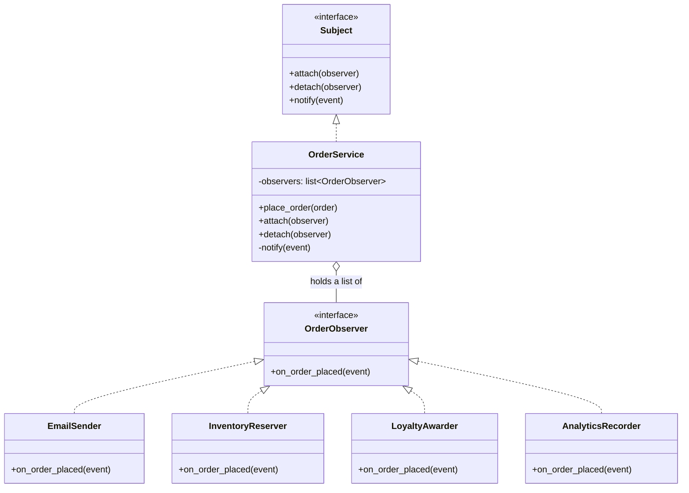
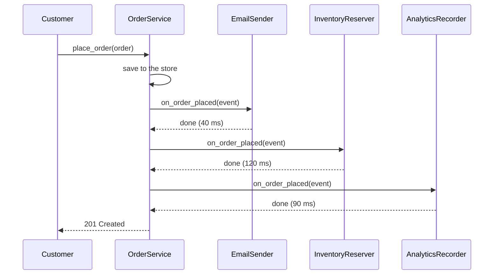

# Day 072 · System design — Observer

**After today you can:** You can notify many listeners of one event without coupling them to the source.

**The interviewer asks it as:** *When an order is placed, five things must happen. Design that.*

---

## 1. What this is, and why they ask it

**Observer** is the pattern where one object — the **subject** — keeps a list of other objects that
want to be told when something happens to it, and tells all of them with one call. The objects on the
list are the **observers**. The subject knows nothing about them except that each one has a method it
can call.

The whole value is in that last sentence. Adding a sixth thing that must happen when an order is
placed does not touch the order code at all. You write the new observer and add it to the list.

They ask it because "when X happens, these five other things must happen" is the single most common
shape in real backend work, and because the naive version — one function that calls five services in
a row — is the single most common source of slow, fragile checkout flows. It also shows up as the
explanation for things the candidate has already used without naming: a button click handler, a
spreadsheet cell that updates when another cell changes, a chat app that refreshes when a message
arrives. Expect it in low-level design rounds and as a follow-up in almost any "design the order
flow" question.

---

## 2. The story

Meera runs a small bakery two lanes behind the bus stand. The bread comes out of the oven at four in
the afternoon, and for about twenty minutes it is still warm, which is the only thing her regulars
actually care about.

For years she handled it by remembering. At four she would wipe her hands, pick up her phone, and
call four people. Ganesh, who ran the tea stall and bought six loaves every day. The two sisters in
the flat above the tailor's. And her cousin, who took whatever was left at seven and sold it out on
the highway.

It worked until it did not. A schoolteacher started asking to be told, so that was five calls. Then
Ganesh's brother took over the stall and wanted to be called on his own number, so that was six. Then
the sisters moved out, and Meera kept calling them for three weeks, because nobody had told her to
stop, and the phone kept ringing in an empty flat.

The worse problem was that four o'clock had become the busiest twenty minutes of her day. She was
standing there with hot trays in one hand and the phone in the other, and if one call went long — her
cousin liked to talk — the bread was cooling while she waited for him to finish.

Her daughter fixed it in an afternoon. She made one group on Meera's phone, and stuck a small card by
the counter: if you want to know when the bread is out, leave your number and we will add you. If you
stop wanting to know, say so and we will take you off.

Now at four Meera sends one message to the group. It takes her six seconds. She does not know how
many people are in it any more — her daughter looks after that — and she does not know what any of
them do with the message. Ganesh walks over. The schoolteacher sends her son. Her cousin ignores it
until six.

None of that is Meera's business. Her job is the bread and the one message. Whether there are three
people on the other end or thirty, four o'clock takes six seconds.

---

## 3. The idea in plain English

Meera is the **subject**: the thing that something happens to. The people in the group are the
**observers**: the things that want to know. The group itself is the **subscription list**, and the
one message is the **notification**.

Four moves make up the pattern, and they map one to one.

**One: the subject holds a list.** Not of people, of objects. Each entry is something with a known
method — call it `update` — that the subject can call. Meera's group is a list of phone numbers, and
a phone number is exactly this: a thing you can call, whose owner you do not need to know.

**Two: observers add and remove themselves.** `attach(observer)` and `detach(observer)`. The
schoolteacher walked up and left her number; the sisters should have told Meera to remove them. This
is the part that makes the pattern extensible: adding a listener is not a change to the subject's
code, it is a change to the subject's *data*.

**Three: one call notifies all of them.** `notify()` loops the list and calls `update` on each. Six
seconds, whether there are three or thirty.

**Four — and this is the point — the subject does not know what any observer does.** Meera does not
know that Ganesh walks over and the schoolteacher sends her son. The order-placed subject does not
know that one observer sends an email and another decrements stock. It knows there is a list of
things with an `update` method.

### Push or pull

When Meera sends the message, does she write "forty loaves, white and brown, out now" — or just
"bread is out"?

- **Push**: the subject sends the details with the notification. `update(order)`. Convenient;
  every observer gets everything whether it needs it or not, and adding a field means changing the
  signature everybody implements.
- **Pull**: the subject sends only "something changed, and here is who I am", and each observer asks
  back for what it needs. `update(subject)` then `subject.get_total()`. Flexible; more round trips,
  and the observer now depends on the subject's full interface.

In practice you push a small, immutable **event object** — a plain record describing what happened,
like `OrderPlaced(order_id, user_id, total, items)`. That is push with the coupling kept narrow, and
it is what nearly every real system does.

### The word you will hear instead

Outside pattern books this is usually called **publish–subscribe**, or **pub/sub**. Same shape:
publisher, subscribers, topic. The difference people draw is that classic Observer has the subject
holding the list directly, while pub/sub usually puts a **broker** in the middle — a separate piece
of software that holds the subscriptions, so the publisher does not even hold the list. Meera's
daughter is the broker. Meera does not know who is on the group any more.

That difference matters more than it sounds, and §5 is where it starts to pay.

### Why not just call the five things directly?

You could write this:

```python
def place_order(order: Order) -> None:
    save(order)
    send_confirmation_email(order)          # 1
    reserve_inventory(order)                # 2
    generate_invoice(order)                 # 3
    award_loyalty_points(order)             # 4
    record_analytics(order)                 # 5
```

It is honest, readable, and for a long time it is the right answer. Say so in the interview, then
name what goes wrong as it grows: the sixth thing means editing this function and re-testing
checkout; `place_order` now imports the email module, the inventory module, the billing module and
the analytics module; and if the analytics call is slow, checkout is slow.

Observer trades that for a list. What it does **not** do is make the five calls disappear — they
still happen, in a loop, one after another. Anyone who tells you the pattern makes checkout fast is
confusing Observer with a message queue. Getting that distinction right is most of §7.

---

## 4. The picture

The structure. Note that `OrderService` has an arrow to the *interface*, never to the concrete
listeners.



What to notice: there is **no arrow from `OrderService` to `EmailSender`**. That missing arrow is the
entire pattern. `OrderService` imports the interface and nothing else, so adding a fifth listener
adds a class and a line of wiring, and changes no existing file.

Now the same thing over time, synchronously:



What to notice: the customer is waiting for all three. The arrows return before the next one starts.
The 201 comes back after 250 milliseconds of work that has nothing to do with saving the order. This
diagram is the argument for making it asynchronous, and drawing it is how you make that argument
without a speech.

---

## 5. How it actually works

### The smallest honest implementation

Start with the interface. In Python a `Protocol` is enough — any class with a matching method
satisfies it, with no inheritance required.

```python
from typing import Protocol

class OrderObserver(Protocol):
    def on_order_placed(self, event: "OrderPlaced") -> None: ...
```

Then the event. Make it a frozen dataclass: a plain record of what happened, which cannot be changed
by one observer before the next one sees it.

```python
from dataclasses import dataclass

@dataclass(frozen=True)
class OrderPlaced:
    order_id: str
    user_id: str
    total_paise: int
    item_count: int
```

`frozen=True` matters more than it looks. If the event were mutable, observer three could edit a
field and observer four would silently see different data — a bug that is close to impossible to find
because the order of observers is not written down anywhere.

Then the subject.

```python
class OrderService:
    def __init__(self, store: "OrderStore") -> None:
        self._store = store
        self._observers: list[OrderObserver] = []

    def attach(self, observer: OrderObserver) -> None:
        self._observers.append(observer)

    def detach(self, observer: OrderObserver) -> None:
        self._observers.remove(observer)
```

Two lines of registration. Note `detach` — the pattern is not finished without it, and forgetting it
is the most common real bug (see §7).

```python
    def place_order(self, order: Order) -> str:
        order_id = self._store.save(order)              # the real work, first
        event = OrderPlaced(order_id, order.user_id,
                            order.total_paise, len(order.items))
        self._notify(event)
        return order_id
```

The order in which those three lines appear is a decision, not an accident. **Save first, notify
after.** If you notify first and the save then fails, you have sent a confirmation email for an order
that does not exist. That mistake is called a phantom notification and it is very hard to undo.

```python
    def _notify(self, event: OrderPlaced) -> None:
        for observer in list(self._observers):          # copy: a listener may detach itself
            try:
                observer.on_order_placed(event)
            except Exception:
                logger.exception("observer %r failed", observer)
```

Three details in five lines, and each is worth a sentence in the interview.

`list(self._observers)` iterates over a **copy**. Without it, an observer that calls `detach` on
itself during `update` mutates the list you are looping over, and Python quietly skips the next
observer. This is a real bug, not a theoretical one.

The `try` around each call means **one broken observer cannot break the others, or the order**. This
is the single most important line in the file. Without it, an exception in the analytics recorder
propagates all the way out of `place_order`, and the customer sees a 500 for an order that was
actually saved.

And catching means you must **log**, or failures vanish. `logger.exception` records the traceback.

### Wiring it up

```python
service = OrderService(store)
service.attach(EmailSender(smtp))
service.attach(InventoryReserver(warehouse))
service.attach(LoyaltyAwarder(loyalty))
service.attach(AnalyticsRecorder(pipeline))
```

This is the **composition root** from [day 053](../day-053-merge-sort/README.md) — one place, run at
start-up, where the pieces are joined. Adding a sixth listener is one line here and one new file.
`OrderService` is untouched, so no checkout test needs to run again.

### The version that actually scales: hand the event to a broker

Synchronous observers put every listener's latency in the customer's request. The fix is to replace
the in-process list with a **message broker** — a separate service that accepts a message, stores it
durably, and delivers it to subscribers on their own schedule.

```python
    def _notify(self, event: OrderPlaced) -> None:
        self._broker.publish("orders.placed", asdict(event))     # ~2 ms, then return
```

The shape of the pattern is identical. What changes is the guarantees:

| | In-process observers | Broker (Kafka, RabbitMQ, SNS) |
|---|---|---|
| Publisher waits for | every listener | one durable write |
| A listener crashes | you catch and log; the work is lost | the message is redelivered |
| Listener is slow | the customer waits | a queue grows |
| Listener is deployed separately | no | yes |
| Debugging | one stack trace | tracing across services |

**Real products, and what each one is.**

- **`addEventListener` in the browser.** The DOM is the canonical Observer: `button.addEventListener
  ("click", handler)` is `attach`, `removeEventListener` is `detach`, and the browser calls every
  registered handler when the click happens.
- **Django signals.** `post_save.connect(send_welcome_email, sender=User)`. Saving a `User` notifies
  every connected receiver. Powerful, and heavily criticised — see §7.
- **Spring's `ApplicationEventPublisher`** in Java, with `@EventListener` methods. Same pattern with
  annotations doing the `attach`.
- **`java.util.Observer` and `Observable`** were in the standard library from Java 1.0 and were
  **deprecated in Java 9** — the official reason was that the interface was too weak to be useful
  (no event typing, no ordering guarantee, not serialisable). Worth knowing: it signals that the
  *shape* is right and one particular API was not.
- **Redis pub/sub.** `SUBSCRIBE orders`, `PUBLISH orders "..."`. Very fast, and **fire-and-forget** —
  a subscriber that is offline when you publish never sees the message. Do not use it for anything
  that must not be lost.
- **Kafka.** Subscribers read from a durable, ordered, replayable log. A consumer that was down for
  an hour catches up. This is the version you name when the interviewer says "what if the email
  service is down?"
- **PostgreSQL `LISTEN` / `NOTIFY`.** The database itself is the subject. `NOTIFY order_placed,
  'id-91'` wakes every connection that ran `LISTEN order_placed`. Useful, and the payload is capped
  at 8000 bytes, so it carries an id rather than an object.
- **Webhooks.** Stripe calling your `/webhooks/stripe` URL when a payment succeeds is Observer across
  the internet — you registered a URL, which is exactly `attach`.
- **RxJS / ReactiveX**, and React's `useEffect` re-running when a value changes. Observer with a
  large amount of machinery on top for composing streams.

### What happens on restart

An in-process observer list lives in memory and is rebuilt by the composition root every time the
process starts. That is fine, because the list is code. A broker's subscriptions are stored by the
broker, so they survive your restart — and that is exactly why a broker can redeliver what your
process missed while it was down.

---

## 6. The numbers

### The latency the customer feels

Five listeners on an order, measured at the median:

```
 save the order to Postgres          25 ms
 send the confirmation email         40 ms   (SMTP handshake + send)
 reserve inventory (HTTP call)      120 ms
 generate the invoice PDF            90 ms
 award loyalty points (HTTP call)    60 ms
 record analytics                    30 ms
 ---------------------------------------
 synchronous total                  365 ms
```

The customer waits **365 ms** for a request whose actual job took 25. Fourteen times the necessary
work, and every listener you add makes it worse — the cost is the **sum**, because they run one after
another in a loop.

Now publish to a broker instead:

```
 save the order to Postgres          25 ms
 publish OrderPlaced to Kafka         2 ms
 ---------------------------------------
 total                               27 ms
```

**365 ms to 27 ms**, and the number stops growing when you add the sixth listener. That single
comparison is the strongest thing you can say in this question.

### What it does to throughput

At 500 orders per second with a thread-per-request server:

```
 synchronous:  500 req/s × 0.365 s = 182 concurrent requests in flight
 async:        500 req/s × 0.027 s =  14 concurrent requests in flight
```

Thirteen times fewer threads or connections held open, from one change. If each in-flight request
holds a database connection from a pool of 100, the synchronous version **exhausts the pool** and the
asynchronous one uses fourteen percent of it.

### What it does to reliability

Suppose each listener is independently available 99.9 percent of the time. If the whole checkout
fails when any of them fails:

```
 0.999^5 = 0.9950   ->  99.50% available
 failures per million orders:  5,000   instead of  1,000
```

Five times more failed checkouts, caused entirely by things that are not checkout. Catching
exceptions per observer fixes this for the *customer*, at the cost of silently losing work — which
is why the durable broker is the real answer.

### The size of the notification

An `OrderPlaced` event as JSON:

```
 order_id  36 B (uuid) + user_id 36 B + total 8 B + item_count 4 B
 + field names and JSON punctuation, say ~120 B
 -> about 200 bytes per event
```

At 500 orders per second:

```
 500 × 200 B         = 100 KB/s published
 × 5 subscribers     = 500 KB/s delivered
 × 86,400 s          ≈ 43 GB/day delivered, 8.6 GB/day stored
 with 7-day retention and 3 replicas: 8.6 × 7 × 3 ≈ 181 GB of broker disk
```

That is the arithmetic for "can Kafka hold this" — and the answer is that it is nothing. A single
broker node handles it comfortably.

### The cost of the list itself

Ten listeners at roughly 200 bytes of object overhead each is two kilobytes of memory and a ten-step
loop. In-process Observer is free. **The cost of this pattern is never the list; it is always what
the listeners do.**

---

## 7. The trade-offs

### What you give up

**The order of notification is not part of the contract, and people rely on it anyway.** Observers
are called in list order, which is registration order, which is whatever the composition root happens
to do. If the loyalty awarder needs the invoice to exist, you have built an ordering dependency that
is documented nowhere and that a reordered wiring line will break. If order matters, you do not want
Observer — you want an explicit sequence, or a workflow with named steps.

**Failures become silent by design.** The `try/except` that stops one bad listener from breaking
checkout also means the confirmation email can fail forever and the customer's request still returns
201. You must add: structured logging, a metric per listener, and an alert on the failure rate.
Without those three, Observer is a machine for losing work quietly.

**You cannot see the call graph.** With five direct calls, "what happens when an order is placed" is
answered by reading one function. With observers, it is answered by finding the composition root, and
in a framework like Django by grepping the entire codebase for `post_save.connect`. This is the
single most common complaint about Django signals, and it is a fair one: a new engineer cannot tell
what saving a model does.

**The lapsed listener.** The subject holds a strong reference to every observer, so an observer that
is never detached is never garbage collected. In a long-lived process where short-lived objects
subscribe — a request handler, a UI screen — this is a genuine memory leak. Meera calling the sisters
for three weeks after they moved out is exactly this bug. The fixes: detach explicitly in a `finally`
or a context manager, or hold **weak references** (`weakref.WeakSet`), which let the observer be
collected and quietly drop out of the list.

**Cascades and cycles.** Observer A updates something that notifies observer B, which updates
something that notifies A. In-process this is a `RecursionError`; across services it is an infinite
loop of messages that shows up as a mysterious cost spike. Keep observers from writing to the thing
they observe, and if you cannot, add a guard flag.

**Testing gets indirect.** You can no longer assert that `place_order` sent an email, because
`place_order` does not send emails. You test the observer alone, and you test that the subject
notified — usually by attaching a fake observer that records what it received. That is a better test,
but it is two tests where there was one.

**Debugging across a broker is a different skill.** Once the notification goes over Kafka, a single
stack trace no longer explains a failure. You need correlation ids on every event and distributed
tracing to follow one order through five consumers. That is real operational cost and you should say
so.

### "I would not use this if..."

- **...the set of listeners is fixed and small.** Two things happen when an order is placed and both
  are core to ordering. Call them. A list of two is ceremony.
- **...the steps must happen in a specific order.** That is a workflow, not a broadcast. Write the
  sequence, or use a proper orchestrator.
- **...every step must succeed or the whole thing must roll back.** Observer has no transaction. If
  the five things must be all-or-nothing, you want them inside one database transaction, or the saga
  pattern with explicit compensating actions.
- **...the listener needs to send something *back*.** Observers return nothing by design. If the
  subject needs an answer — "is this order fraudulent?" — that is a call, not a notification.
- **...it is the first listener.** One observer and an interface is a hierarchy built for a future
  that has not arrived. Add the pattern when the second listener does.

### The honest concession

Observer does not remove work and it does not make anything faster on its own — in-process, the five
calls still run one after another and the customer still waits for all of them. What it removes is
the **compile-time dependency**: `OrderService` no longer knows the names of the five things. The
speed comes from the *next* step, replacing the list with a queue.

Say that explicitly. A candidate who claims the pattern makes checkout fast has not thought about it;
a candidate who says "the pattern buys decoupling, and asynchrony is a separate decision I would make
next" has.

---

## 8. In the interview

### How it gets asked

- The direct version: *"When an order is placed, we need to send an email, reserve stock, generate an
  invoice, award loyalty points and log analytics. How would you structure that?"*
- The UI version: *"Several parts of the screen show the same data. When it changes, they all need to
  update. Design that."*
- The scaling version: *"Our checkout endpoint takes 400 ms and most of it is not checkout. What is
  going on and how do you fix it?"*
- The pattern-name version, in a low-level design round: *"Which pattern would you use here, and what
  would it cost you?"*
- The trap version: *"Would you use Django signals for this?"* — they are testing whether you can
  criticise a tool you have used.

### What to say out loud, in the first ninety seconds

1. **Name the shape before naming the pattern.** "This is one event with several independent
   reactions, and the list of reactions will grow. That is Observer, or publish–subscribe."
2. **Say what the coupling problem is, concretely.** "If `place_order` calls all five directly, it
   imports the email module, the warehouse client, the billing module and the analytics pipeline.
   Adding a sixth means editing checkout and re-testing checkout."
3. **State the structure in one breath.** "The order service holds a list of listeners behind one
   interface, publishes an immutable `OrderPlaced` event, and the wiring — which listeners exist —
   lives in the composition root, not in the service."
4. **Say the two decisions that are not the pattern.** "Two things I would decide separately: whether
   notification is synchronous or goes through a broker, and what happens when one listener fails."
5. **Then give the number.** "Synchronously those five listeners are 340 milliseconds added to a
   25-millisecond save. Publishing to Kafka is 2 milliseconds and it does not grow with the sixth
   listener."

If you are drawing, draw the class diagram with the missing arrow, then the sequence diagram with the
customer waiting. The second diagram wins the argument for you.

### The follow-ups

**"What happens if one listener throws?"**
"In-process, I wrap each call in its own try/except so one bad listener cannot fail the order or stop
the other four — the order is already saved by then. But catching means losing work silently, so I
would add a metric and an alert per listener. The proper fix is a durable broker: publish once, and
each consumer retries on its own with a dead-letter queue for what it cannot process. Then a failed
email is a message waiting, not a message gone."

**"Do the listeners run in a guaranteed order?"**
"No, and I would not let anyone depend on one. They run in registration order, which is an accident
of the wiring code. If step B genuinely needs step A to have finished, that is not a broadcast, it is
a workflow — I would write it as an explicit sequence, or have B subscribe to an event that A
publishes when it is done."

**"How do you make this asynchronous?"**
"Replace the in-process list with a publish to a broker. The service writes the order, publishes
`OrderPlaced` to a topic, and returns. Each of the five becomes a consumer with its own retry policy
and its own deployment. The publisher's latency drops from the sum of all listeners to a single
durable write — about 2 milliseconds for Kafka. The cost is that it is now eventually consistent: the
customer can refresh and not see the loyalty points yet, so the UI has to be honest about that."

**"How is this different from a message queue?"**
"It is the same pattern with different guarantees, and where the subscription list lives. Classic
Observer keeps the list inside the subject, in memory, and delivery is a method call — fast, and lost
if the process dies. A broker keeps the list outside both sides, so publisher and subscriber do not
even know about each other, and the message is durable. Redis pub/sub sits in between: broker in the
middle, but fire-and-forget, so a subscriber that was offline never sees it."

**"What about memory leaks?"**
"The lapsed listener problem. The subject holds a strong reference to every observer, so an observer
that never detaches is never collected. It matters when short-lived objects subscribe to a long-lived
subject. Two fixes: detach in a `finally` or a context manager so it always happens, or hold the
observers in a `weakref.WeakSet` so they drop out when nothing else refers to them."

**"Would you use Django signals here?"**
"Cautiously, and probably not for business logic. They work, but they hide the call graph — a new
engineer reading `user.save()` has no way to know that six receivers fire, and finding them means
grepping for `connect`. I would use them for genuinely cross-cutting things like cache invalidation
or an audit trail, and use an explicit service call or a real event bus for anything a person needs
to reason about."

### A model answer

Asked: *when an order is placed, five things must happen. Design that.*

> "Let me first say what shape this is, because it decides everything. One thing happens — an order is
> placed — and several independent reactions follow. The list of reactions will grow; it always does.
> Nobody has ever removed the fifth thing that happens after checkout.
>
> The naive version is `place_order` calling all five in a row, and honestly, for two reactions that
> is the right code. The problem starts at four or five. `place_order` now imports the email module,
> the warehouse client, the billing service and the analytics pipeline, so a change in any of them
> can break checkout, and adding a sixth reaction means editing and re-testing the most
> business-critical function in the system.
>
> So I would use Observer. The order service keeps a list of listeners behind a single narrow
> interface — one method, `on_order_placed`, taking an immutable event. I would make the event a
> frozen record with the order id, the user id, the total and the item count, so no listener can
> mutate what the next one sees. The service saves the order first and notifies afterwards, never the
> other way round — otherwise a failed save has already triggered a confirmation email for an order
> that does not exist.
>
> Which listeners exist is wiring, and wiring belongs in the composition root at start-up, not in the
> service. That is the payoff: the sixth reaction is a new file and one line of wiring, and no
> checkout test has to run again.
>
> Two things I would decide separately, because they are not the pattern.
>
> First, failure. In-process I wrap each listener call in its own try/except, so a broken analytics
> recorder cannot fail an order that is already saved. But that trades a loud failure for a silent
> one, so it only counts as a design if I also add a per-listener metric and an alert.
>
> Second, latency, and this is where the numbers matter. Those five listeners are roughly 340
> milliseconds — email 40, inventory 120, invoice 90, loyalty 60, analytics 30 — on top of a
> 25-millisecond save. The customer waits fourteen times longer than the work required, and it gets
> worse with every listener, because in-process observers run in a loop and the cost is the sum.
>
> So the version I would actually ship publishes the event to a broker — Kafka, or SNS — and returns.
> That is one durable write, about 2 milliseconds, and it does not grow. Each of the five becomes a
> consumer with its own retries and its own dead-letter queue, so a failed email is a message waiting
> rather than work lost, and the email service can be down for an hour and catch up.
>
> The costs I would name up front. The order listeners run in is not a contract, so nothing may
> depend on it — if one step genuinely needs another, that is a workflow and I would write it
> explicitly. The call graph becomes invisible, so a new engineer cannot tell what saving an order
> does; I would document the event and its subscribers in one place. And the async version is
> eventually consistent, so the UI has to be honest that loyalty points appear a moment later.
>
> One thing I would not do is introduce the pattern for two listeners. With two, the direct calls are
> clearer and I would leave them alone until the third one arrives."

---

## 9. Recall card

- **One subject holds a list of observers behind one narrow interface, and `notify` loops the list.**
  The subject knows the interface and **nothing about the concrete listeners** — that missing arrow in
  the class diagram *is* the pattern. Adding the sixth listener is a new file plus one line in the
  composition root; checkout is not edited or re-tested.
- **Four rules for the implementation:** save first and **notify after** (or you email about an order
  that does not exist) · publish an **immutable event object**, so listener 3 cannot change what
  listener 4 sees · iterate over a **copy** of the list, or a self-detaching observer skips the next
  one · wrap **each** call in its own try/except, and then log and alert, or you have built a machine
  for losing work silently.
- **The honest concession: in-process Observer buys decoupling, not speed.** The five calls still run
  one after another and the cost is the **sum** — 25 ms of save plus 40 + 120 + 90 + 60 + 30 = **365
  ms** the customer waits. Publishing to a broker instead is **~27 ms and stops growing**. Async is a
  *separate* decision from the pattern.
- **Observer → pub/sub is where the list moves out of the subject and into a broker.** `addEventListener`
  · Django signals · Spring `@EventListener` · Redis pub/sub (**fire-and-forget, lost if offline**) ·
  Kafka (**durable, replayable, redelivered**) · Postgres `LISTEN/NOTIFY` (8 KB payload cap) ·
  webhooks. `java.util.Observable` was **deprecated in Java 9** for being too weak an interface.
- **Do not use it if the order of steps matters** (that is a workflow), **if it must be
  all-or-nothing** (that is a transaction or a saga), **if the listener must return an answer**, or
  **if there is only one listener**. Watch for the **lapsed listener** leak — detach in a `finally`,
  or hold observers in a `weakref.WeakSet`.
