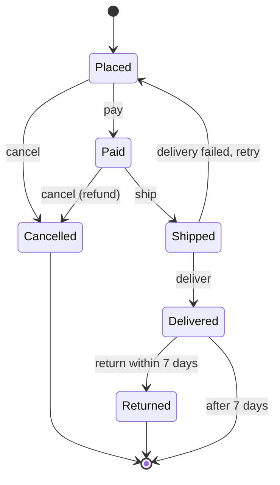
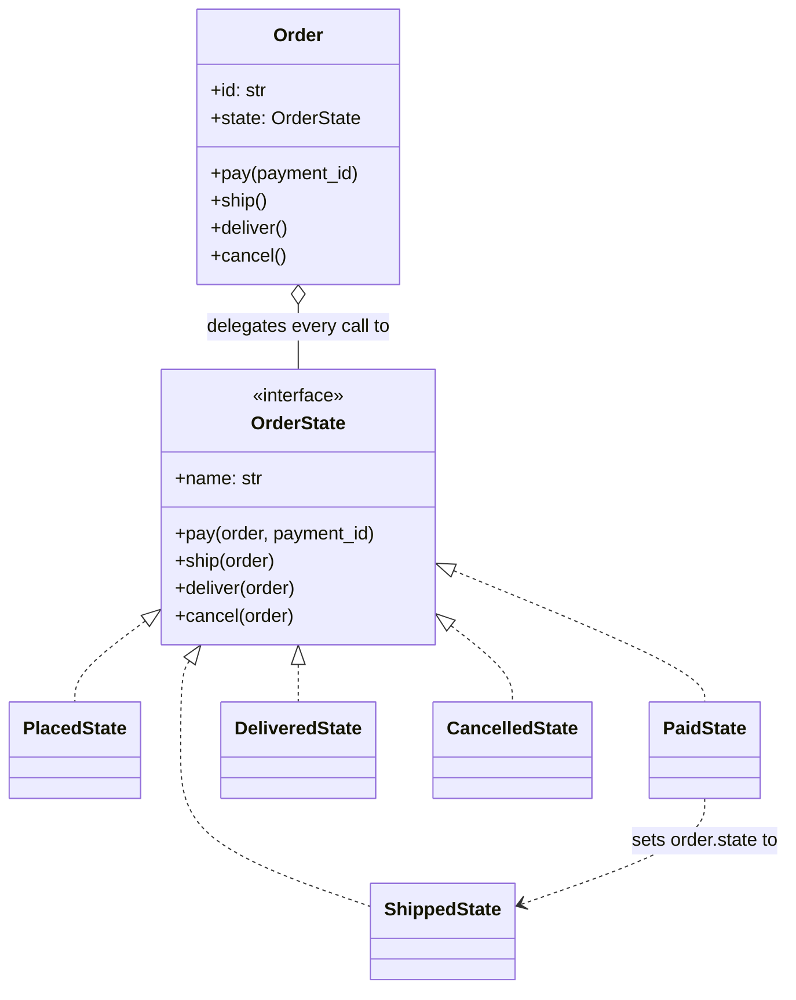

# Day 073 · System design — State

**After today you can:** You can model an object whose behaviour changes with its state, without a giant switch.

**The interviewer asks it as:** *Model an order that moves through placed, paid, shipped and delivered.*

---

## 1. What this is, and why they ask it

**State** is the pattern where an object's behaviour changes because of what it currently *is*, and
you model that by giving each condition its own class. The object — the **context** — holds one of
those classes and forwards every request to it. Change the state, and the same method call does
something different.

The thing it replaces is a set of `if status == "shipped"` checks scattered across a dozen methods.
That set always starts as one innocent `if`, and it always ends as the file nobody wants to open.

They ask it because every real system has something that moves through stages — an order, a payment,
a support ticket, a document under review, a taxi ride — and because the interesting part is not the
happy path. The interesting part is what happens when someone tries to cancel a delivered order, or
when two workers try to ship the same order at once. Expect it in low-level design rounds, and expect
it as a follow-up in almost any "design the order flow" or "design a booking system" question.

---

## 2. The story

Suresh ordered a mixer for his mother's birthday from a shop two districts away, and then spent four
days phoning them.

The first call was on Monday evening. He had given the old house address by mistake. The girl who
answered said no problem at all, put him on hold, and came back thirty seconds later: changed. She had
asked the packing room, and the packing room still had the box, so the address was just a matter of
writing a new one on it.

The second call was Wednesday morning. He wanted to add a second mixer for his sister. This time the
answer was no. The box had gone out on the van at six that morning, and the girl said, quite plainly,
"it is with the driver now, I cannot add anything to a box that has left." She offered to place a
second order instead.

The third call was Wednesday afternoon, because his mother had gone to a wedding and would not be
home. That one the driver could handle — he brought it back and it went out again on Thursday.

The fourth call was Friday, after it had been delivered and after his mother had said, very kindly,
that she already had one. And now it was somebody else entirely on the line: the returns desk, who
asked for the delivery date, said he had seven days, and arranged a pickup.

What Suresh worked out, somewhere around the third call, is that there is no single person at that
shop who knows all the rules. The girl who answers the phone just finds out who is holding the box
right now and puts him through. Before it is packed, the packing room holds it and can do almost
anything. Once it is on the van, only the driver can help, and only in the two ways a driver can help.
Once it is in the house, only the returns desk, and only for a week.

And when the packing room hands the box to the driver, the packing room stops answering questions
about it. They do not keep half the responsibility. They hand it over completely, and the next person
takes all of it.

---

## 3. The idea in plain English

The box is the **context** — the object that has a life and moves through stages. The packing room,
the driver and the returns desk are the **states**. The girl on the phone is the context forwarding
every request to whoever currently holds the box.

### The four moves

**One: each stage becomes its own object.** `PlacedState`, `PaidState`, `ShippedState`,
`DeliveredState`, `CancelledState`. Each one is small, because it only has to know the rules of its
own stage.

**Two: they all implement the same interface.** Whatever an order can be asked to do — pay, ship,
deliver, cancel — is a method on every state. The girl asks the same question of everyone; the answer
differs.

**Three: the context holds one state and forwards to it.** `Order.cancel()` is one line:
`self._state.cancel(self)`. The order does not decide anything itself. It passes the request to the
object that currently holds it.

**Four: states cause transitions.** When the driver picks up the box, the packing room stops being
responsible. In code, a state's method sets the context's state to a different one, and after that
line the old state is never consulted again.

```python
class PaidState:
    def ship(self, order: "Order") -> None:
        order.tracking_id = generate_tracking_id()
        order.state = ShippedState()          # hand it to the driver
```

That single assignment is the transition. Everything the object can now do changed, and no `if`
anywhere had to be edited.

### What it replaces, and why that thing rots

Without the pattern you write this:

```python
def cancel(self) -> None:
    if self.status == "placed":
        self.status = "cancelled"
    elif self.status == "paid":
        refund(self.payment_id)
        self.status = "cancelled"
    elif self.status == "shipped":
        raise ValueError("cannot cancel a shipped order")
    elif self.status == "delivered":
        raise ValueError("cannot cancel a delivered order")
```

That is fine. The problem is that the same chain appears in `ship`, in `deliver`, in `refund`, in
`can_edit_address`, and in the three places that build the UI. Five states and six operations means
the same five-way branch written six times, and **adding a sixth state means finding all six of
them.** Miss one and you get the bug where a `returned` order can still be shipped.

State turns that grid on its side. Instead of one method per operation containing every state, you
get one class per state containing every operation. Adding a state is **adding a file**. That is the
same trade you saw in Strategy on [day 071](../day-071-monotonic-stack/README.md), applied to a
different axis.

### The rule that makes it not-Strategy

The two patterns have an identical class diagram, and interviewers ask you to tell them apart.

> **In Strategy, the client chooses the implementation. In State, the object changes its own.**

A `Pricer` is handed to `Checkout` from outside and never changes itself. A `PaidState` replaces
itself with a `ShippedState` from the inside, and nobody outside chose that. **States know their
successors; strategies do not know each other exists.** Say that sentence and the question is over.

### Illegal transitions are the design

The valuable part of this model is not that `cancel` works. It is that **`cancel` on a delivered
order is impossible to write by accident**, because `DeliveredState` simply does not do it:

```python
class DeliveredState:
    def cancel(self, order: "Order") -> None:
        raise IllegalTransition("a delivered order cannot be cancelled; use return")
```

Put that default in a base class and every state gets it for free, then each state overrides only
what it genuinely allows. Now a new state that forgets to implement `ship` refuses to ship, which is
the safe direction to fail in. **Design so that forgetting something makes it stricter, not looser.**

### The word you will hear: finite state machine

This is a **finite state machine** — a fixed set of states, a fixed set of events, and a table saying
which event moves you from which state to which. The State pattern is one way to write one. The other
two ways are a dictionary keyed by `(state, event)`, and an `enum` plus a `match`. All three are
legitimate; §7 says when to pick which.

---

## 4. The picture

The machine itself. Notice how few arrows there are compared with how many are imaginable.



What to notice: there are 6 states and 5 events, so there are 30 imaginable combinations — and only
**8 arrows**. The other 22 are illegal, and the whole point of modelling this properly is that the 22
become impossible rather than merely discouraged. Also notice the one backwards arrow, Shipped →
Placed for a failed delivery. Real machines have them, and a design that assumes everything moves
forward will need surgery the first time a delivery fails.

Now the structure:



What to notice: the dashed arrow from `PaidState` to `ShippedState`. **That arrow is what makes this
State and not Strategy** — one implementation knows about another and installs it. In a Strategy
diagram no such arrow exists.

---

## 5. How it actually works

### The interface, with safe defaults

```python
class IllegalTransition(Exception):
    """Raised when an operation is not legal in the current state."""


class OrderState:
    name: str

    def pay(self, order: "Order", payment_id: str) -> None:
        self._refuse("pay")

    def ship(self, order: "Order") -> None:
        self._refuse("ship")

    def deliver(self, order: "Order") -> None:
        self._refuse("deliver")

    def cancel(self, order: "Order") -> None:
        self._refuse("cancel")

    def _refuse(self, action: str) -> None:
        raise IllegalTransition(f"cannot {action} an order in state {self.name!r}")
```

Everything refuses by default. Each concrete state overrides only what it allows. This is the design
decision that matters most in the whole file: a new state added by a tired engineer on a Friday is
**maximally restrictive** until someone deliberately opens it up.

### Three of the states

```python
class PlacedState(OrderState):
    name = "placed"

    def pay(self, order: "Order", payment_id: str) -> None:
        order.payment_id = payment_id
        order.state = PaidState()

    def cancel(self, order: "Order") -> None:
        order.state = CancelledState()          # nothing to refund yet
```

Two methods. `ship` and `deliver` are inherited refusals, so an unpaid order cannot be shipped and
you did not have to write an `if` to say so.

```python
class PaidState(OrderState):
    name = "paid"

    def ship(self, order: "Order") -> None:
        order.tracking_id = tracking.create(order.id)
        order.state = ShippedState()

    def cancel(self, order: "Order") -> None:
        payments.refund(order.payment_id)       # the extra work this state implies
        order.state = CancelledState()
```

Look at the two `cancel` methods side by side. Same name, same signature, different work — one
refunds and one does not. In the `if` chain version that difference is a branch buried in a long
method; here it is the entire body of a four-line class.

```python
class DeliveredState(OrderState):
    name = "delivered"

    def cancel(self, order: "Order") -> None:
        raise IllegalTransition("cannot cancel a delivered order; start a return")
```

Overriding a refusal with a *better* refusal. The generic message says what is not allowed; this one
says what to do instead, and error messages that name the alternative are worth writing.

### The context

```python
class Order:
    def __init__(self, order_id: str, total_paise: int) -> None:
        self.id = order_id
        self.total_paise = total_paise
        self.payment_id: str | None = None
        self.tracking_id: str | None = None
        self.state: OrderState = PlacedState()

    def pay(self, payment_id: str) -> None:
        self._transition(lambda: self.state.pay(self, payment_id))

    def ship(self) -> None:
        self._transition(lambda: self.state.ship(self))
```

Every public method is one line of delegation. The order contains **no rules at all**, which is what
makes it readable a year later.

```python
    def _transition(self, action) -> None:
        before = self.state.name
        action()
        if self.state.name != before:
            history.append(f"{self.id}: {before} -> {self.state.name}")
```

One place to put the audit trail, the metric and the published event, because every transition goes
through it. That is a benefit you do not get from scattered `if`s, and it is worth pointing at: it is
exactly where you would publish the `OrderShipped` event to the observers from
[day 072](../day-072-largest-rectangle/README.md).

### Persisting it

The state is a class in memory and a **string in the database**:

```python
    STATES = {c.name: c for c in (PlacedState, PaidState, ShippedState,
                                  DeliveredState, CancelledState)}

    @classmethod
    def load(cls, row) -> "Order":
        order = cls(row["id"], row["total_paise"])
        order.state = cls.STATES[row["status"]]()      # rebuild from the name
        return order
```

Store the name, not a pickled object, so a deploy that renames a class does not corrupt a million
rows. And put a database-level check on the column — `CHECK (status IN ('placed', 'paid', ...))` — so
a bug in one service cannot write a state that no code can read.

### The two other legitimate implementations

**A transition table.** When the states have no behaviour of their own and only the *arrows* matter:

```python
TRANSITIONS = {
    ("placed", "pay"): "paid",
    ("placed", "cancel"): "cancelled",
    ("paid", "ship"): "shipped",
    ("shipped", "deliver"): "delivered",
}

def apply(status: str, event: str) -> str:
    try:
        return TRANSITIONS[(status, event)]
    except KeyError:
        raise IllegalTransition(f"{event!r} is not legal from {status!r}")
```

Eight lines, and the whole machine is visible in one place — which is a real advantage over five
files. Use this when transitions are the entire content. Use classes when each state carries genuine
work, like the refund inside `PaidState.cancel`.

**An enum with `match`.** Python 3.10 and later:

```python
    match (order.status, event):
        case (Status.PAID, "ship"):
            ...
```

Readable for small machines, and it becomes the same unmaintainable chain at fifteen states.

### Where you have already seen this

- **TCP** is a finite state machine, and a famous one: `CLOSED → SYN_SENT → ESTABLISHED → FIN_WAIT_1
  → TIME_WAIT → CLOSED`. Every diagram in [day 004](../day-004-the-growth-curves/README.md) is this
  pattern, and `netstat` prints the current state of each connection.
- **Stripe's `PaymentIntent`** moves through `requires_payment_method`, `requires_confirmation`,
  `processing`, `succeeded`, `canceled`. Their API documentation is a state diagram, and the
  webhook you receive names the transition.
- **Kubernetes pod phases** — `Pending`, `Running`, `Succeeded`, `Failed`, `Unknown` — with a
  controller whose entire job is driving objects toward the state you asked for.
- **`django-fsm` and `AASM` in Rails** are libraries that add exactly this to a model class, with a
  decorator naming the legal source and target states.
- **AWS Step Functions** and **Temporal** are state machines as a hosted service, for when the
  transitions take days and must survive a process restart.
- **XState** in the JavaScript world, where the machine is defined as data and can be drawn
  automatically — which is the strongest argument for the table form.

---

## 6. The numbers

### The size of the thing you are replacing

Six states and six operations:

```
 if-chain form:
   6 methods × a 6-way branch each        = 36 branches to maintain
   adding a 7th state: edit 6 methods, find all of them, re-test all of them

 state-object form:
   6 classes × only the operations each allows
   Placed 2, Paid 2, Shipped 2, Delivered 1, Cancelled 0, Returned 0  = 7 methods written
   adding a 7th state: 1 new file, 0 existing methods edited
```

**36 branches against 7 methods**, because 29 of the 36 combinations are refusals and the base class
writes them all once. That ratio is the argument, and it is a number rather than an opinion.

### The transition matrix

```
 6 states × 5 events        = 30 possible (state, event) pairs
 legal transitions          =  8
 illegal                    = 22  (73% of the grid)
```

Nearly three-quarters of what could be asked must be refused. A design where refusal is the default
gets 22 cases right by doing nothing; a design where each refusal is an `if` gets them right only if
somebody wrote 22 `if`s.

### What the audit trail costs

Every transition writes one history row:

```
 1,000,000 orders/month × 4 transitions each = 4,000,000 rows/month
 row: order_id 16 B + from 12 B + to 12 B + actor 16 B + timestamp 8 B + overhead ≈ 100 B
 4,000,000 × 100 B = 400 MB/month  ->  4.8 GB/year
```

Five gigabytes a year for a complete history of every order's life. That is nothing against what it
buys you in a support call, and quoting it is how you win the argument for keeping it.

### The concurrency number, which is the one they are actually testing

Two workers read the same paid order at the same moment and both call `ship`:

```
 worker A: read status 'paid'  ->  create tracking  ->  write 'shipped'
 worker B: read status 'paid'  ->  create tracking  ->  write 'shipped'
 result: two tracking numbers, two parcels, one order
```

The in-memory state machine cannot prevent this, because both workers hold their own copy of the
object. The fix is at the database, and it is one line — a conditional update:

```sql
UPDATE orders SET status = 'shipped' WHERE id = $1 AND status = 'paid';
```

If it reports 0 rows updated, somebody else won the race and this worker must stop. At 500 shipments
per second with two workers, the collision window is milliseconds wide and it *will* happen daily.
**Say this before you are asked.** It is the difference between a candidate who has drawn state
machines and one who has run them.

---

## 7. The trade-offs

### What you give up

**A class per state, for machines that do not deserve one.** Six states is six files. If your states
carry no behaviour and the only content is which arrow goes where, a dictionary of `(state, event) →
state` says the same thing in eight lines and shows the whole machine on one screen. Reach for classes
when states carry *work*, not merely names.

**The machine stops being visible in one place.** With a table you can see all eight transitions at
once. With classes they are scattered across six files, one assignment at a time, and answering "can
a shipped order be cancelled?" means opening a file. Mitigation: keep the diagram in the repository
next to the code, and write one test that asserts the full set of legal transitions.

**States knowing about each other is real coupling.** `PaidState` imports `ShippedState`, which is a
direct dependency between two concrete classes — the thing most patterns exist to avoid. It is
usually acceptable, because the graph is small and deliberate, but circular imports appear the moment
`ShippedState` needs to go back to `PlacedState`. A `_transition(order, "shipped")` helper that looks
up the class by name breaks the cycle at the cost of losing the type checker's help.

**Where does the work live?** `PaidState.cancel` calls `payments.refund`. Now a state object depends
on the payment service, and testing `cancel` needs that service faked. The alternative is for states
to only decide and for the context to do the work, which keeps states pure and makes the context fat
again. There is no clean answer; pick one, be consistent, and say which you picked.

**Instances or singletons?** `PaidState()` allocates a new object on every transition. If states hold
no data — and they should not — one shared instance per state is enough, which is the Singleton from
[day 064](../day-064-grouping/README.md) used properly. It matters at a million transitions a minute
and not at all below that.

**It does nothing for concurrency.** This is the big one. The pattern makes illegal transitions
impossible *within one object in one process*. Two processes holding two copies can both make a legal
transition from the same starting point and produce nonsense. The state machine is a modelling tool;
the guarantee has to come from a conditional update, a row lock, or a version column.

### "I would not use this if..."

- **...there are two states.** A boolean and one `if`. `is_active` does not need a class hierarchy.
- **...the states have no behaviour, only names.** Use a table or an enum. Five classes containing
  one assignment each are ceremony, and the table is easier to review.
- **...the transitions are the *whole* product** — a payment flow with retries, timeouts and manual
  review that must survive restarts. Then you want a durable workflow engine like Temporal or Step
  Functions, not objects in memory that die with the process.
- **...the "states" are really independent flags.** `paid`, `gift_wrapped` and `flagged_for_review`
  can be true in any combination, so they are not states — they are three booleans, and forcing them
  into one machine gives you eight states that mean nothing.
- **...you cannot draw the diagram.** If the arrows are not clear enough to draw, the requirements are
  not clear enough to model, and the pattern will freeze the confusion in place.

### The honest concession

The branching did not vanish. Python still has to find `PaidState.ship` rather than
`ShippedState.ship`, and that lookup is a branch in the interpreter. What changed is **who maintains
the branch**: the language does, by method dispatch, instead of you doing it by hand in six different
methods. That is worth saying, because the alternative — claiming the `if`s disappeared — is not
true and a good interviewer will press on it.

---

## 8. In the interview

### How it gets asked

- The direct version: *"Model an order that goes through placed, paid, shipped and delivered. What
  happens if someone tries to cancel after delivery?"*
- The pattern version: *"You have a class with a `status` field and eight methods that all start with
  the same `if status ==` chain. How would you restructure it?"*
- The named version, in a low-level design round: *"Design a vending machine"* or *"design an
  elevator"* — both are state machines wearing a costume, and both are coming later this phase.
- The distinguishing question, which is almost guaranteed: *"How is this different from Strategy?
  The class diagrams look the same."*
- The one that separates people: *"Two workers pick up the same order at the same moment. What
  happens?"*

### What to say out loud, in the first ninety seconds

1. **Draw the machine before writing any code.** "Let me list the states and the legal transitions
   first — placed, paid, shipped, delivered, cancelled, returned." Then draw the arrows. Everything
   else follows from that picture.
2. **Count the grid out loud.** "Six states, five events, so thirty combinations, and only eight of
   them are legal. So the design question is really: how do I make the other twenty-two impossible
   rather than merely discouraged?"
3. **Name the structure.** "One class per state, all implementing the same interface, with a base
   class that refuses everything. Each state overrides only what it permits, so forgetting something
   makes it stricter."
4. **Show the delegation.** "`Order.cancel` is one line: `self._state.cancel(self)`. The order holds
   no rules. That also gives me one place to write the audit trail and publish the event."
5. **Pre-empt the Strategy question.** "This looks like Strategy, and the difference is direction: in
   Strategy the client picks the implementation; in State the object replaces its own, so states know
   their successors."
6. **Raise concurrency yourself.** "One thing the pattern does not give me is safety across
   processes. I would enforce transitions with a conditional update — `WHERE id = ? AND status =
   'paid'` — and treat zero rows updated as losing the race."

### The follow-ups

**"How is this different from Strategy?"**
"Identical class diagram, opposite direction of control. A strategy is chosen from outside and never
changes itself — `Checkout` is handed a pricer and that pricer has no idea other pricers exist. A
state changes itself from inside: `PaidState.ship` sets `order.state = ShippedState()`. So states know
their successors and strategies do not. The tell in code is an assignment to the context's own field
inside an implementation."

**"What happens if someone tries to cancel a delivered order?"**
"It raises. `DeliveredState` overrides `cancel` with a message saying to start a return instead. And
importantly, that is not the only reason it fails — the base class refuses everything by default, so
even if nobody had written that override it would still refuse. The system fails closed."

**"Where do you store the state?"**
"A string column with a `CHECK` constraint listing the valid names, and I rebuild the state object
from the name on load. Never a pickled object, because renaming a class would then corrupt every
existing row. If I need history I add a separate transitions table — one row per change with from,
to, actor and timestamp. At a million orders a month and four transitions each that is about 400 MB a
month, which is cheap for what it gives support."

**"Two workers try to ship the same order at once."**
"The pattern cannot help, because each worker has its own copy of the object and both see a legal
transition. The guarantee has to be at the database: `UPDATE orders SET status = 'shipped' WHERE id =
? AND status = 'paid'`, and if it reports zero rows updated then somebody else won and this worker
stops. That is optimistic concurrency, and it is one line. The alternative is `SELECT … FOR UPDATE`
to take a row lock first, which is simpler to reason about and holds a lock for the length of the
transaction."

**"Would you always use classes for this?"**
"No, and I would ask what the states actually do. If they carry real work — a refund on cancelling a
paid order, a tracking number on shipping — classes are right, because that work has a natural home.
If the states are only names and the content is which arrow goes where, a dictionary keyed by state
and event is eight lines and shows the entire machine on one screen, which is easier to review and
easier to draw automatically. Five classes containing one assignment each is ceremony."

**"The machine needs to survive a restart and wait three days for a manual review."**
"Then it is not an in-memory pattern any more. I would move it to a durable workflow engine — AWS
Step Functions or Temporal — where the state is persisted by the engine, timers are first-class, and
a process dying mid-transition resumes rather than losing the order. The modelling stays the same;
what changes is who owns the state and the clock."

### A model answer

Asked: *model an order that moves through placed, paid, shipped and delivered.*

> "Before any code, let me list the states and the legal moves, because the arrows are the design.
> Placed, paid, shipped, delivered, cancelled, and returned. Pay moves placed to paid. Cancel works
> from placed and from paid — and from paid it also has to refund, which is the first sign the states
> are not just labels. Ship moves paid to shipped. Deliver moves shipped to delivered. A failed
> delivery moves shipped back to placed for a retry, and I would confirm that one with you because
> systems that assume everything moves forward break the first time a driver cannot find the house.
> Return moves delivered to returned, within seven days.
>
> That is six states and five events, so thirty possible combinations, and only about eight of them
> are legal. So the real design question is how to make the other twenty-two impossible rather than
> merely discouraged.
>
> The version I would avoid is a `status` string and an `if status ==` chain inside every method.
> With six operations that is the same six-way branch written six times, and adding a seventh state
> means finding all six and editing all six. The bug that gets you is the one you missed — a returned
> order that can still be shipped.
>
> So: one class per state, all implementing the same interface, and a base class where every
> operation refuses with a clear message. Each state overrides only what it genuinely allows.
> `PlacedState` implements pay and cancel and inherits refusals for the rest, so an unpaid order
> cannot be shipped and I never wrote an `if` to say so. `PaidState.cancel` issues the refund before
> transitioning, which is exactly the kind of per-state work that justifies classes over a lookup
> table. `DeliveredState.cancel` overrides the refusal with a better one that names the alternative.
>
> The important property there is the direction of failure: a new state written on a Friday refuses
> everything until someone deliberately opens it up.
>
> The order itself holds no rules. Every method is one line of delegation to the current state, which
> means I have exactly one place — a small `_transition` wrapper — to write the audit row, emit the
> metric, and publish the `OrderShipped` event to whatever is listening.
>
> If you ask how this differs from Strategy: the class diagram is the same and the direction of
> control is opposite. A strategy is chosen by the client and never changes itself. A state replaces
> its own — `PaidState` sets the order's state to `ShippedState` — so states know their successors.
>
> For persistence, the state is a string column with a check constraint, and I rebuild the object
> from the name on load. Never a serialised object, because a class rename would then break every
> row. History goes in a separate transitions table, about 400 megabytes a month at a million orders,
> which support will thank you for.
>
> And the thing this pattern does not solve, which I would raise before you do: it gives me no safety
> across processes. Two workers can both read a paid order and both legally ship it, and I get two
> parcels. So the actual guarantee is a conditional update — set status to shipped where the id
> matches and the status is still paid — and zero rows updated means I lost the race and must stop.
> The state machine is the model; the database provides the enforcement.
>
> One honest note: the branching did not disappear. It moved from my `if` chains into method
> dispatch. What I gained is that the language maintains it instead of me maintaining it in six
> places."

---

## 9. Recall card

- **State = one class per stage, all behind one interface, and the context delegates every call to
  the one it currently holds.** `Order.cancel()` is `self._state.cancel(self)` and the order holds
  **no rules at all** — which also gives you exactly one place for the audit row, the metric and the
  published event.
- **The base class refuses everything; each state overrides only what it allows.** So a new state
  fails **closed**, and 22 of the 30 (state, event) pairs are handled by writing nothing. Compare **36
  branches across 6 methods** with **7 methods across 6 files** — adding a state is **one new file,
  zero edits**.
- **State versus Strategy: identical diagram, opposite direction.** *The client chooses a strategy;
  the object replaces its own state.* **States know their successors** — the tell is
  `order.state = ShippedState()` inside an implementation. Strategies never reference each other.
- **Three legitimate forms, and the choice is about content:** classes when states carry real work
  (the refund inside `PaidState.cancel`) · a `(state, event) → state` **dictionary** when only the
  arrows matter, because the whole machine then fits on one screen · an enum plus `match` for tiny
  machines. Persist the state as a **string with a CHECK constraint**, never a pickled object.
- **The pattern gives you no concurrency guarantee, and this is the follow-up that separates people.**
  Two workers can both legally ship the same paid order. Enforce it in the database:
  `UPDATE … WHERE id = ? AND status = 'paid'`, and **0 rows updated means you lost the race**. Real
  machines: **TCP**, Stripe `PaymentIntent`, Kubernetes pod phases, `django-fsm`, Step Functions,
  XState.
