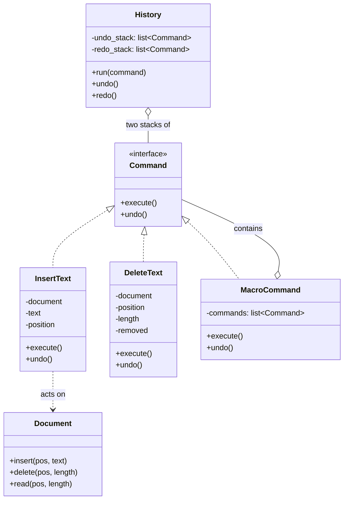
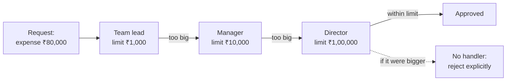

# Day 074 · System design — Command and chain of responsibility

**After today you can:** You can turn an action into an object, which makes undo and queuing possible.

**The interviewer asks it as:** *Design undo and redo for a text editor.*

---

## 1. What this is, and why they ask it

**Command** is the pattern where you stop *calling* an operation and start *making* one. Instead of
`editor.insert("hello", at=42)`, you build an object — `InsertText("hello", 42)` — that knows how to
do the thing and how to undo it. Once the action is an object, you can put it in a list, send it over
a network, write it to disk, run it later, run it a thousand times, or run it backwards.

**Chain of responsibility** is the pattern where a request is passed along a line of handlers, each
of which either deals with it or passes it on. Nobody knows the whole line. Each handler knows one
thing: what it can handle, and who is next.

They go together because both start from the same move — **make the request a thing** — and because
every web framework you will ever use is both at once. A request object travelling through a stack of
middleware is chain of responsibility. A job on a Celery or Sidekiq queue is a command. Interviewers
ask Command as "design undo and redo", which is the cleanest question in the whole low-level design
set: it has an obvious naive answer, that answer runs out of memory, and the fix is the pattern.

---

## 2. The story

Faiz runs a place with eleven tables near the market, and until two years ago the way an order
reached the kitchen was that a waiter stood at the hatch and shouted it.

It mostly worked. It failed in four specific ways, and Faiz can list them because each one cost him
money.

If the cook was elbow-deep in something when the shout came, the order was simply gone. Nobody could
prove it had ever been made. The waiter said he shouted it; the cook said he never heard.

If a customer changed their mind — and they do, constantly, ninety seconds after ordering — the
waiter had to go back and shout a correction, and hope the correction arrived after the order and not
before.

At eleven at night, when Faiz sat down to work out what the day had been, there was nothing to work
out from. The food had been cooked and eaten and nobody had a record of what.

And when two waiters shouted at the same time, which happened every single lunch, one of the two
orders came out wrong.

Now there is a screen on the kitchen wall, and the waiter presses buttons on a small handset at the
table. The order becomes a line on that screen with a number against it — 74, two chapati, one dal
fry, no chilli.

Everything Faiz was losing came back at once, and none of it because the cooking changed.

The order waits its turn on the screen instead of depending on whether anyone was listening. If the
customer changes their mind, the waiter touches the line and it goes, as long as the cook has not
started it. At eleven at night the whole day is still on the screen, in order, and Faiz scrolls it
while he counts the cash. When a table says "the same again", the waiter presses one button and the
same order appears at the bottom with a new number.

There is one more thing they added last year. Special requests used to go to whoever was nearest.
Now they go down the line. The cook at the tawa handles it if it is his — less oil, no onion. If it
is not his, he passes it to the head cook, who handles the ones about ingredients. If it is not his
either, it goes to Faiz, who is the only one allowed to say yes to a discount. Nobody has to know the
whole set of rules. Each of them knows two things: what they are allowed to decide, and who to hand
it to when they are not.

---

## 3. The idea in plain English

The shout is a **method call**. It happens and it is gone. The line on the screen is a **command
object**: the same instruction, but now it is a thing that exists, and everything Faiz got back
follows from that one change.

### What making it a thing buys you

| Faiz got back | Because a command is an object |
|---|---|
| Orders stopped being lost | You can put an object in a **queue** |
| Corrections work | You can **cancel** an object, which is undo |
| The day is on the screen at eleven | You can keep a **log** of objects |
| "The same again" is one button | You can **replay** an object |
| Two waiters no longer collide | Objects go in a list; shouts collide in the air |

That table is the argument for the pattern. Every row is impossible with a plain method call, and
every row is free once the call becomes an object.

### The Command interface

Two methods. That is the whole pattern.

```python
class Command(Protocol):
    def execute(self) -> None: ...
    def undo(self) -> None: ...
```

A command holds everything it needs: the target it acts on, the arguments, and — crucially — whatever
it must remember in order to reverse itself.

```python
@dataclass
class InsertText:
    document: "Document"
    text: str
    position: int

    def execute(self) -> None:
        self.document.insert(self.position, self.text)

    def undo(self) -> None:
        self.document.delete(self.position, len(self.text))
```

Reversing an insert needs only the position and the length, both of which the command already has.
Reversing a *delete* is different, and it is the interesting case:

```python
@dataclass
class DeleteText:
    document: "Document"
    position: int
    length: int
    removed: str = ""          # filled in by execute, needed by undo

    def execute(self) -> None:
        self.removed = self.document.read(self.position, self.length)   # remember it
        self.document.delete(self.position, self.length)

    def undo(self) -> None:
        self.document.insert(self.position, self.removed)
```

**A command must capture whatever undo will need, at the moment it executes.** Deleting throws
information away, so the command has to catch it on the way past. That single line, `self.removed =
…`, is the difference between an undo that works and one that quietly loses the user's paragraph.

### Undo and redo are two stacks

```
 undo stack        redo stack
 (things done)     (things undone)

 do X       -> push X onto undo, CLEAR redo
 undo       -> pop from undo, call .undo(), push onto redo
 redo       -> pop from redo, call .execute(), push onto undo
```

The stack from [day 068](../day-068-stacks/README.md), used exactly as it was defined: the most
recent thing not yet resolved.

The line that people forget is **clear the redo stack when a new command is executed**. If the user
undoes three edits and then types something new, the three undone edits are no longer reachable —
history has forked, and you keep the branch the user is on. Leave the redo stack alone and Ctrl+Y
will apply an edit to a document that has changed underneath it.

### Chain of responsibility, in the same breath

The special-request line at Faiz's place is a different pattern with the same starting move. The
request is an object; each handler holds a reference to the next one.

```python
class Handler:
    def __init__(self, next_handler: "Handler | None" = None) -> None:
        self._next = next_handler

    def handle(self, request: "Request") -> "Response | None":
        if self.can_handle(request):
            return self.respond(request)
        if self._next is not None:
            return self._next.handle(request)     # pass it on
        return None                               # nobody could
```

Three cases in seven lines: I handle it, I pass it on, or it falls off the end. The last case is the
one that gets designed badly — see §7.

The classic example is an approval limit, and it is worth having ready because interviewers use it:

```
 expense of ₹800     -> team lead approves        (limit ₹1,000)
 expense of ₹9,000   -> lead passes to manager    (limit ₹10,000)
 expense of ₹80,000  -> lead -> manager -> director (limit ₹100,000)
 expense of ₹9,00,000 -> falls off the end        -> must be handled explicitly
```

Each handler knows its own limit and its successor. Nobody knows the whole ladder. Adding a
vice-president between manager and director is one insertion and zero edits to existing handlers.

### The two patterns are not the same thing

Say this if asked, because they are taught together and confused constantly:

> **Command is about *what* to do — one object, and it will definitely be done.
> Chain of responsibility is about *who* does it — many candidates, and possibly nobody.**

A command has one receiver, chosen when the command is built. A chain has many possible handlers and
the choice happens at run time, by walking the line.

---

## 4. The picture

Command, with the undo and redo stacks:



What to notice: `MacroCommand` both **is** a command and **contains** commands. That is what makes
"select all, replace, and reformat" one undoable step — it is a list of commands wearing the same
interface, and its `undo` runs the children backwards. A pattern that composes with itself like this
is worth pointing at in an interview.

Chain of responsibility, as a request flowing:



What to notice: the dotted arrow. **Every chain needs a defined end.** Falling off the end silently
returning `None` is how a request gets approved by nobody and nobody notices for a month.

And the shape every web framework has, which is the same picture turned sideways:

```
 request  ->  logging  ->  auth  ->  rate limit  ->  your handler
                                                          |
 response <-  logging  <-  auth  <-  rate limit  <---------+
```

Middleware is a chain of responsibility where each handler gets to act on the way in *and* on the way
back out. That double pass is the one addition real frameworks make to the textbook pattern.

---

## 5. How it actually works

### The history object

```python
class History:
    def __init__(self, limit: int = 500) -> None:
        self._undo: list[Command] = []
        self._redo: list[Command] = []
        self._limit = limit

    def run(self, command: Command) -> None:
        command.execute()
        self._undo.append(command)
        self._redo.clear()                      # history has forked
        if len(self._undo) > self._limit:
            self._undo.pop(0)                   # forget the oldest
```

Four lines of policy, and each one is a decision an interviewer will poke at. Executing before
pushing means a command that throws is never recorded. Clearing redo is the forking rule. The limit
is what stops an eight-hour editing session eating memory, and dropping the *oldest* is right because
nobody undoes four hundred steps.

```python
    def undo(self) -> None:
        if not self._undo:
            return                              # nothing to undo; not an error
        command = self._undo.pop()
        command.undo()
        self._redo.append(command)

    def redo(self) -> None:
        if not self._redo:
            return
        command = self._redo.pop()
        command.execute()
        self._undo.append(command)
```

Perfect mirrors. Notice that redo calls `execute` again, not a third method — which is only safe if
`execute` is repeatable, and that is a real constraint worth naming (§7).

### Macros compose for free

```python
@dataclass
class MacroCommand:
    commands: list[Command]

    def execute(self) -> None:
        for command in self.commands:
            command.execute()

    def undo(self) -> None:
        for command in reversed(self.commands):   # backwards, always
            command.undo()
```

`reversed` is not decoration. Undoing "delete the word, then insert the replacement" in the original
order would insert into a document that still has the word in it. **Undo runs a macro backwards**, and
saying that unprompted is a small, cheap signal.

### Commands you can put on a wire

Once a command is data, it can leave the machine:

```python
    def to_json(self) -> dict:
        return {"type": "insert", "position": self.position, "text": self.text}
```

That is the whole idea behind a task queue. A **Celery** task is a serialised command — function name
plus arguments — sitting in Redis or RabbitMQ until a worker picks it up. **Sidekiq** in Ruby and
**BullMQ** in Node are the same thing. The queue does not know what the job does; it knows how to
store and deliver an object.

### Real systems built on Command

- **Every editor's Ctrl+Z.** VS Code, Word, Photoshop. Photoshop's History panel is the undo stack,
  rendered.
- **Database write-ahead logging.** Postgres writes what it is *about* to do to the WAL before doing
  it. Recovery after a crash replays that log. Redo is literally the name of the operation, and undo
  logs are how a transaction rolls back. This is Command at the storage layer, and it is why
  [day 033](../day-033-window-with-a-map/README.md)'s transactions can be rolled back at all.
- **Redis AOF** (append-only file) records every write command received; restarting replays them.
- **`git revert`** creates a new commit that is the inverse of an old one — a command that knows its
  own undo.
- **Event sourcing and CQRS**, where the database stores the sequence of commands rather than the
  current state, and the current state is what you get by replaying them.
- **Java's `Runnable`** and any `ExecutorService.submit(task)` — an action, made into an object, so it
  can be scheduled.

### Real systems built on chain of responsibility

- **Django middleware**, **Express `app.use`**, **ASP.NET Core's request pipeline**, **Java servlet
  filters**. Each one wraps the next, sees the request going in and the response coming out.
- **Spring Security's filter chain** — authentication, then authorisation, then CSRF, in a fixed
  order, each free to reject and stop the chain.
- **Python's `logging` module.** A log record goes to the logger's handlers, then propagates to the
  parent logger, up to the root — and `logger.propagate = False` is how you stop the chain.
- **Netty's `ChannelPipeline`**, where decoders and handlers are an explicit ordered list.
- **Firewall rules** — `iptables` and AWS WAF walk rules in order until one matches, with a default
  policy at the end. The default policy *is* the "nobody handled it" case, made explicit.
- **DOM event bubbling.** A click on a button fires on the button, then the div, then the body, until
  something calls `stopPropagation()`.

### What happens on failure

For Command: if `execute` throws halfway through a macro, you are in a half-applied state. The
honest options are to undo the children that already succeeded (compensation) or to require that each
child is independently safe. Say which you chose.

For a chain: if a handler throws, the request stops there, and whether the remaining handlers should
still run on the way out is a real decision — in middleware it usually matters a great deal, because
the logging middleware is the one that would have recorded the failure.

---

## 6. The numbers

### Why the naive undo runs out of memory

The obvious implementation of undo is "keep a copy of the whole document before each change".

```
 document:                    1 MB  (a 200-page manuscript)
 undo depth:                  500 edits
 snapshot approach:  500 × 1 MB  =  500 MB
```

Half a gigabyte to be able to undo five hundred keystrokes. Now the command version:

```
 InsertText: text ~20 B + position 8 B + object overhead ~120 B  ≈  150 B
 DeleteText: same plus the removed text, say up to 1 KB          ≈  1 KB worst case
 500 commands × 1 KB worst case                                  =  500 KB
```

```
 snapshots:  500 MB
 commands:   0.5 MB
 ratio:      1,000x
```

**A thousand times less memory**, because a command stores the *difference* and a snapshot stores the
*state*. That single comparison is the reason the pattern exists here, and it is the number to lead
with when asked to design undo.

The mixed strategy real editors use: a snapshot every 200 commands plus the commands since, so that
undoing 500 steps is 2 snapshot restores plus at most 200 replays instead of 500 sequential undos.

### The cost of a middleware chain

Eight middlewares on a web request, each doing a small amount of work:

```
 request id        0.05 ms
 logging           0.20 ms
 CORS              0.02 ms
 session load      1.50 ms   (a Redis round trip)
 authentication    0.80 ms   (JWT verify)
 rate limit        0.60 ms   (a Redis INCR)
 CSRF              0.05 ms
 compression       0.90 ms
 -----------------------------
 total overhead    4.12 ms   before your handler runs at all
```

At 5,000 requests per second that is **20.6 seconds of CPU per second** across the fleet — about 21
cores doing nothing but pipeline. Worth knowing, because "why is our p50 4 ms even on an endpoint that
returns a constant?" is a real question with this answer, and because it tells you which order to put
the handlers in: **the cheapest rejection first.** Rate limiting before session loading saves the
Redis round trip on exactly the requests you were going to throw away.

### Order matters, in money

```
 auth before rate limit:  every abusive request costs a JWT verify (0.8 ms)
 rate limit before auth:  a blocked request costs one Redis INCR  (0.6 ms) and stops

 at a 50,000 req/s attack:
   wrong order: 50,000 × 0.8 ms = 40 core-seconds per second
   right order: rejected at the edge
```

### The undo-history table, if it is persisted

Collaborative editors persist operations, not documents:

```
 100,000 documents × 2,000 operations each × 200 B = 40 GB
 compaction: snapshot each document nightly and keep 24 h of operations
   100,000 × 100 ops × 200 B = 2 GB of operations + the snapshots
```

Which is the storage-layer version of the same 1,000× argument.

---

## 7. The trade-offs

### What Command costs you

**A class per action.** Twenty operations means twenty classes, and most of them are four lines. In
Python a closure or a `functools.partial` does the `execute` half in one line, and the moment you need
`undo` as well, the class earns itself back. Be honest that the ceremony is real and that the second
method is what justifies it.

**Not every operation has an inverse.** "Send the email" cannot be undone. "Charge the card" can only
be *compensated* by a refund, which is a different transaction with its own failure modes, not a
reversal. Undo is easy inside a document and hard the moment the action leaves the building. Say this
out loud — it is the difference between designing an editor and designing a system.

**`redo` calling `execute` again requires idempotent construction.** If `execute` generates a fresh id
or reads the clock, redoing produces a *different* command than the one you undid. Capture anything
non-deterministic in the constructor, or on the first `execute`, never on each one.

**Undo depth is unbounded unless you bound it.** Five hundred commands is a policy. Without it, an
editor left open all day accumulates for ever, and a `DeleteText` holding a megabyte of removed text
makes that expensive fast.

**Commands can go stale.** Undoing an edit at position 400 is nonsense if the document has since been
edited by someone else at position 100. Single-user editors get away with it. Collaborative ones need
**operational transformation** or **CRDTs**, which exist precisely because "just keep an undo stack"
does not survive two users. Naming that boundary is worth more than pretending it does not exist.

**Memento is the alternative and sometimes the right one.** Store a snapshot of state instead of the
inverse operation. It is much simpler and it is correct when the state is small — a drawing app's
selection, a form's contents. Use Command when state is big and changes are small; use Memento when
state is small or the inverse is hard to write.

### What chain of responsibility costs you

**The request can fall off the end.** The default implementation returns `None` and nobody notices.
Always terminate the chain deliberately: a final handler that rejects loudly, or a raised exception.
`iptables` gets this right with a default policy; most hand-rolled chains do not.

**Nobody can see the whole flow.** "Why was this request rejected?" means walking eight handlers.
Mitigation: keep the chain construction in one place, in order, and log which handler terminated the
request.

**Order is a hidden contract.** Authentication must run before authorisation. Rate limiting should
run before anything expensive. None of that is expressible in the pattern; it lives in the order of a
list, and a reordering merge is a security incident waiting to happen. Write the required order down
next to the list.

**Long chains cost latency on every request**, including the ones every handler passes through
untouched — the 4.12 ms above.

**Debugging a deep chain is a stack trace forty frames tall**, because each handler calls the next.

### "I would not use this if..."

- **...only one thing can handle the request.** Then it is a call, not a chain. A chain with one
  handler is a function with extra steps.
- **...every handler must run.** That is a pipeline or an observer broadcast, not a chain — the
  defining property of a chain is that handling *stops* the walk.
- **...the action has no inverse and never needs queuing, logging or replay.** Then Command is
  ceremony. Call the method.
- **...the state is small enough to snapshot.** Memento is fewer moving parts and cannot get the
  inverse wrong.
- **...two users edit the same document.** Neither pattern is sufficient; you need OT or CRDTs, and
  saying so is better than bolting a mutex onto an undo stack.

### The honest concession

Command does not make anything simpler on the day you write it. It makes the *third* requirement
cheap — undo, then queuing, then an audit log, then replay — and every one of those is impossible to
retrofit onto direct method calls without rewriting the call sites. That is the actual argument:
**you are paying up front for the three features you know are coming.**

---

## 8. In the interview

### How it gets asked

- The direct version: *"Design undo and redo for a text editor. How much memory does it use?"*
- The escalation, always: *"Now support multi-step undo. Now support undoing a find-and-replace that
  changed forty places, as one step."*
- The queue version: *"Users click a button that starts a slow job. Design that."* — the answer is a
  command on a queue.
- The chain version: *"Expenses need approval, with different limits at different levels. Design
  it."* Or: *"Design the request pipeline for a web framework."*
- The distinguishing question: *"When would you use a chain of responsibility rather than a list of
  observers?"*

### What to say out loud, in the first ninety seconds

1. **Name the move.** "The core idea is to stop calling operations and start creating them. Every
   edit becomes an object with `execute` and `undo`."
2. **Say what that buys, as a list.** "Once an action is an object I can stack it for undo, queue it,
   log it, replay it, and group several into one. None of those are possible with a plain method
   call."
3. **Kill the naive answer with the number.** "The obvious approach is snapshotting the document
   before each edit. At a one-megabyte document and five hundred levels of undo that is five hundred
   megabytes. Commands store the difference, not the state — about half a megabyte for the same
   history. A thousand times less."
4. **Say the two stacks and the forking rule.** "Undo stack and redo stack. Do something: push to
   undo and *clear* redo, because history has forked. Undo: pop, reverse, push to redo."
5. **Name the hard part before they do.** "The interesting command is delete, because deleting throws
   information away. The command has to capture the removed text during `execute` so `undo` can put it
   back."
6. **Show that it composes.** "Find-and-replace across forty places is a macro command — a command
   containing commands — and its `undo` runs the children in reverse order."
7. **State the boundary.** "This works for a single user. Two users editing the same document breaks
   the position arithmetic, and that needs operational transformation or CRDTs, which is a different
   design."

### The follow-ups

**"How much memory does the undo history take?"**
"It depends entirely on whether you store state or differences. Snapshots of a one-megabyte document
at 500 levels is 500 MB. Commands are the delta: an insert is the text plus a position, about 150
bytes; a delete is worse because it has to hold what it removed, but still kilobytes not megabytes.
Call it half a megabyte for the same history — about a thousandfold difference. I would also cap the
depth at a few hundred and drop the oldest, and for very long sessions take a periodic snapshot so
undoing five hundred steps is a restore plus a short replay rather than five hundred sequential
undos."

**"What about actions that cannot be undone?"**
"Then undo is the wrong word and I would say so to the product owner. Sending an email or charging a
card cannot be reversed; they can only be *compensated* — a retraction, a refund — which is a new
action with its own failure modes. In an editor I would keep such actions out of the undo stack and
grey out the menu item, rather than pretend. In a distributed system this is exactly the saga
pattern: every step has a compensating step, and the compensation is not a rollback."

**"How do you make find-and-replace one undo step?"**
"A macro command: a command that holds a list of commands and implements the same interface. Its
`execute` runs them in order, its `undo` runs them in *reverse* order, which matters — undoing a
delete-then-insert pair in the original order would insert into a document that still has the old
text. Because it implements the same interface, the history object does not need to know it is
special."

**"When is chain of responsibility better than just calling the right handler?"**
"When the choice of handler depends on the request in a way the caller should not know about, and
when the set of handlers changes. Expense approval is the clean example: the caller submits an
expense and does not know or care what the limits are. If the caller *can* pick the handler, a
dictionary lookup is simpler and faster than walking a chain. And if *every* handler should run, it
is not a chain — a chain's defining property is that handling stops the walk."

**"What happens if nobody in the chain handles it?"**
"That has to be a deliberate decision, and it is the part people get wrong. The default
implementation returns `None` and the request is silently approved by nobody. I would terminate the
chain with an explicit final handler that rejects and logs, the way a firewall has a default policy.
And I would log which handler terminated any request, because otherwise 'why was this rejected'
means reading eight files."

**"How would you order the middleware?"**
"Cheapest rejection first. A request that is going to be rate-limited should be rejected before I
spend a Redis round trip loading its session and 0.8 milliseconds verifying its token. In our
numbers, an eight-stage pipeline costs about 4 milliseconds per request before the handler runs at
all, and under attack the ordering is the difference between rejecting at the edge and burning forty
core-seconds a second on JWT verification. Authentication before authorisation, always, and I would
write the required order in a comment next to the list because the pattern cannot express it."

### A model answer

Asked: *design undo and redo for a text editor.*

> "The move that makes this possible is to stop calling operations and start creating them. Today the
> editor probably calls `document.insert(position, text)` directly, and once that call has returned
> there is nothing left to reverse. So instead every edit becomes an object with two methods:
> `execute` and `undo`.
>
> Before I go further, let me kill the obvious alternative with a number, because it is what most
> people reach for. You could snapshot the whole document before each change. For a one-megabyte
> document with five hundred levels of undo that is five hundred megabytes of memory. Commands store
> the *difference* rather than the *state*: an insert command is the text and a position, roughly a
> hundred and fifty bytes. The same five hundred levels come to well under a megabyte. That is about
> a thousandfold difference and it is the reason to do it this way.
>
> The history is two stacks. Running a command executes it, pushes it on the undo stack, and clears
> the redo stack — that last part matters, because if the user undoes three edits and then types
> something new, history has forked and the undone edits are unreachable. Undo pops the undo stack,
> calls `undo`, and pushes onto redo. Redo does the mirror.
>
> The interesting command is delete, and I would write that one first in an interview because it is
> where the design is. Insert is easy to reverse — you know the position and the length. Delete
> throws information away, so the command has to capture the removed text during `execute` and hold
> it, and that captured text is what `undo` puts back. Getting that wrong gives you an undo that
> silently loses a paragraph.
>
> Find-and-replace across forty places should be a single undo step, and the pattern gives that for
> free: a macro command that holds a list of commands and implements the same interface. Its
> `execute` runs them forwards and its `undo` runs them backwards — backwards matters, or you insert
> into a document that still contains the old text. The history object never learns that macros
> exist.
>
> Two policies I would set explicitly. Cap the depth, say five hundred, dropping the oldest, because
> an editor left open all day otherwise grows without bound and a delete command can be holding a
> megabyte. And for very deep histories, take a snapshot every couple of hundred commands so undoing
> a long way is a restore plus a short replay rather than hundreds of sequential undos.
>
> Two boundaries I would name rather than paper over. First, redo re-executes the command, so
> `execute` must be repeatable — anything non-deterministic like a generated id or a timestamp has to
> be captured once, not regenerated. Second, all of this assumes one user. The moment two people edit
> the same document, position 400 in my command may not mean position 400 any more, and that needs
> operational transformation or CRDTs — a genuinely different design, not an extension of this one.
>
> The wider point is that making the action an object gives me four things at once and I only asked
> for one: undo, but also queuing, an audit log of everything that was done, and replay. That is why
> databases do exactly this — Postgres writes what it is about to do to the write-ahead log before
> doing it, and crash recovery is replaying that log."

---

## 9. Recall card

- **Command = stop *calling* the operation, start *creating* it.** Two methods, `execute` and `undo`.
  Once the action is an object you get four things you did not have: **queue it · undo it · log it ·
  replay it**. Celery/Sidekiq jobs, Postgres WAL, Redis AOF, `git revert`, event sourcing are all
  this.
- **The number that wins the undo question: snapshots store *state*, commands store the *difference*.**
  1 MB document × 500 levels = **500 MB**; the same history as commands ≈ **0.5 MB** — about
  **1,000×**. Cap the depth and drop the oldest; snapshot every ~200 commands so a deep undo is a
  restore plus a short replay.
- **Two stacks, and the rule people forget: executing a new command *clears the redo stack*** —
  history has forked. **Delete is the interesting command**, because it must capture the removed text
  during `execute` or undo loses it. A **macro command** is a command holding commands, and its
  `undo` runs the children **in reverse**.
- **Chain of responsibility = each handler knows two things: what it can handle, and who is next.**
  Handling **stops** the walk — if every handler must run it is not a chain. **Always terminate the
  chain deliberately**, or a request is approved by nobody. Real chains: Django/Express middleware,
  Spring Security filters, Python `logging` propagation, `iptables` with a default policy, DOM event
  bubbling.
- **Order is a hidden contract and it costs money: cheapest rejection first.** An 8-stage pipeline is
  ~**4.1 ms** before your handler runs; rate-limit before auth or a 50,000 req/s attack burns 40
  core-seconds a second on JWT verification. **Boundaries to name:** actions with no inverse
  (compensate, do not undo) · `execute` must be repeatable for redo · two users need **OT or CRDTs**,
  not a bigger undo stack · **Memento** beats Command when state is small.
