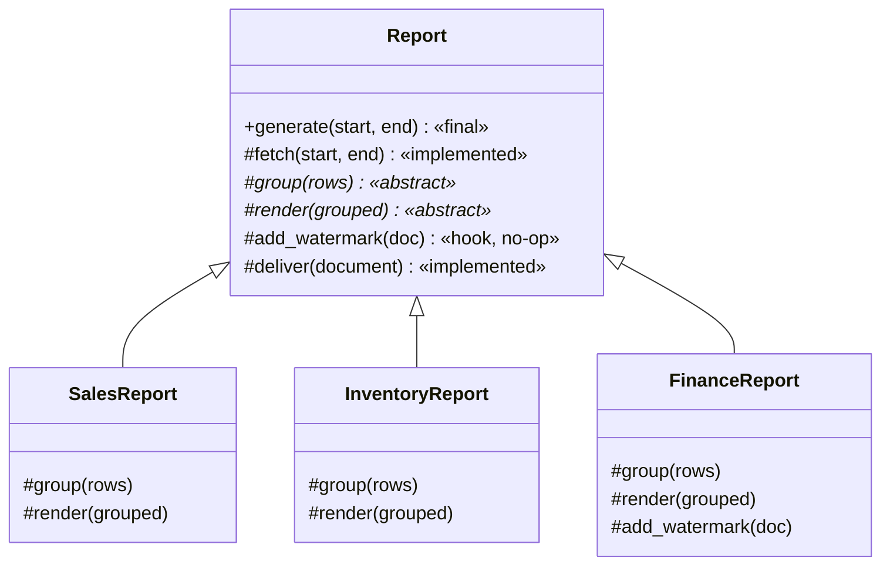
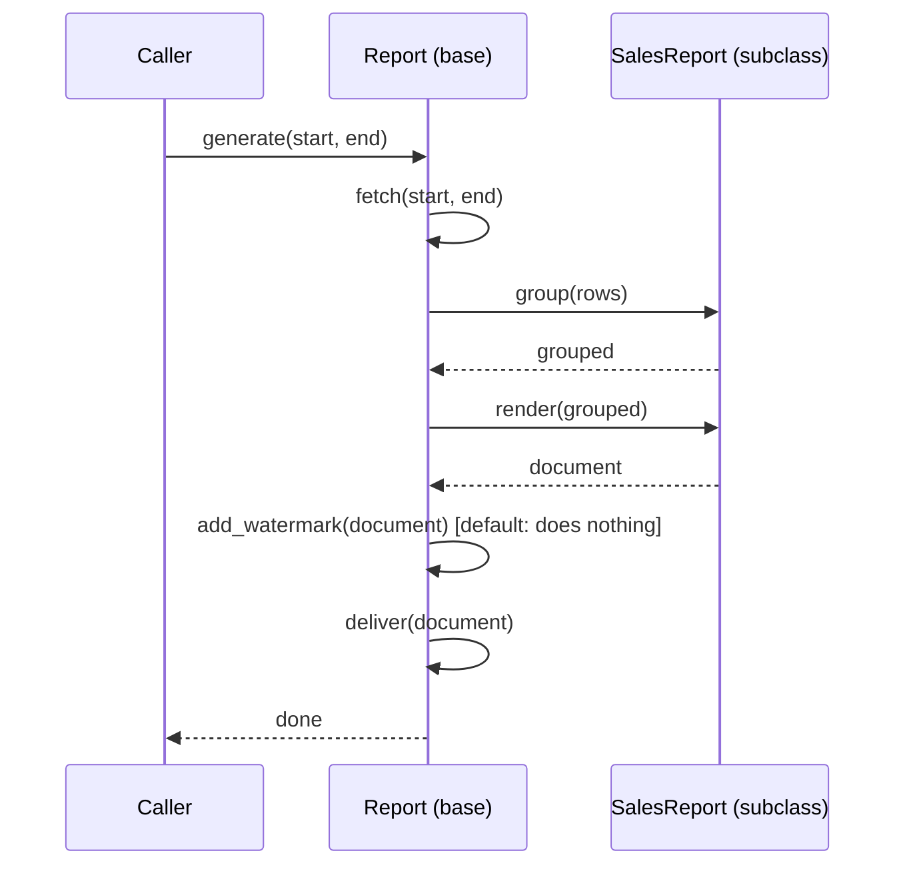

# Day 075 · System design — Template method and iterator

**After today you can:** You can fix the skeleton of an algorithm and let subclasses fill in the steps.

**The interviewer asks it as:** *Three report types share 80 percent of their logic. Structure it.*

---

## 1. What this is, and why they ask it

**Template method** is the pattern where a base class writes down the *order of the steps* and leaves
some of the steps blank. The order is fixed and subclasses cannot change it. What they can do is fill
in the blanks. One method — the template — calls the steps in sequence, and that method is the thing
you are not allowed to override.

**Iterator** is the pattern where "go through this collection one item at a time" is separated from
"this collection". The caller asks for the next item and does not know, and does not want to know,
whether the items are in a list, in a file, in a database, or arriving over the network.

They are taught together because they are the two patterns that are already built into the language
you are using. Every `for` loop in Python is the iterator pattern. Every `unittest.TestCase` with
`setUp` and `tearDown` is a template method. Interviewers ask template method as *"these three
reports are 80 percent identical — restructure it"*, which is the most common real refactoring
question there is, and they ask iterator as *"this query returns ten million rows and the process
runs out of memory"*, which is the most common real production incident.

---

## 2. The story

Every morning at Nandini's school the assembly runs the same way, and it has run that way since long
before she joined.

The bell goes at eight forty. The children come out and stand in their lines by class, tallest at the
back, and that takes four minutes on a good day and seven when it has rained. Then the head girl
leads the prayer. Then somebody speaks for three or four minutes. Then everyone says the pledge
together. Then the classes are sent back inside, one at a time, starting with the smallest children.

Bell, lines, prayer, the talk, the pledge, back inside. Six things, always in that order, and nobody
has ever written it down anywhere Nandini has seen. It simply is the assembly.

The one part that changes is the talk. Monday is the principal, and it is usually about shoes or
about the exam timetable. Tuesday and Thursday a class teacher takes it by turn. Wednesday is the
sports teacher, who is short, and everybody likes that. Friday one of the students speaks, and that
one is either very good or very bad.

The teacher whose turn it is does not decide when to speak, or whether the prayer comes before or
after, or how long the lines take. She is told: four minutes, after the prayer. She fills her slot.
That is all she does.

There is a seventh thing, but it only happens sometimes. If somebody has won something outside
school, they are called up and clapped, after the pledge and before the classes go in. Most days that
step simply does not happen, and nobody stands there feeling a gap where it should have been.

Once, a new teacher sent her own class back inside straight after the prayer, because it was very hot
and a girl had fainted the week before. The whole assembly came apart — the other classes were still
standing, the pledge had not been said, and the little ones followed her class because they follow
everybody. She was not told off for wanting to protect her students. She was told off because the
order is not hers to change.

And the register is its own small thing. Every teacher reads the names out one at a time and marks
each child present, and not one of them knows or cares how the names are kept — by roll number, by
the order the children joined, by anything at all. You start at the beginning and keep going until
there are no more names.

---

## 3. The idea in plain English

The assembly is a **template method**. The register is an **iterator**. Two patterns, one morning.

### Template method

The base class owns the order:

```python
class Assembly:
    def run(self) -> None:          # THE TEMPLATE. Do not override this.
        self.ring_bell()
        self.form_lines()
        self.prayer()
        self.talk()                 # the blank
        self.pledge()
        self.award()                # the optional blank — a "hook"
        self.dismiss()
```

Five of those are written once in the base class, because they never change. `talk` is **abstract** —
the base class declares it and refuses to implement it, so every subclass must. `award` is a
**hook**: the base class implements it as *doing nothing*, so a subclass may override it and most do
not.

That is the complete pattern. Three kinds of step:

| Kind | Base class | Subclass |
|---|---|---|
| **Fixed step** | implements it | must not override |
| **Abstract step** | declares it, refuses to implement | must implement |
| **Hook** | implements it as a no-op or a sensible default | may override |

The new teacher's mistake was overriding `run`. That is the one method the pattern exists to
protect. In Java you write `final` on it; in Python you write a comment and rely on people reading
it, which is a genuine weakness worth mentioning.

### The Hollywood principle

The usual one-line summary is: **"Don't call us, we'll call you."**

In ordinary code *you* call the library. In a template method the base class calls *your* code. The
teacher does not decide when to speak; she is called. This inversion is what makes frameworks
frameworks — the reason `unittest` runs your `setUp` before your `test_` method is that it owns the
loop and you own the steps.

### What it is for: three reports that are 80 percent the same

```
 sales report:      fetch rows -> group by region -> render to CSV  -> email it
 inventory report:  fetch rows -> group by depot  -> render to XLSX -> email it
 finance report:    fetch rows -> group by month  -> render to PDF  -> email it
```

Everything except two steps is identical, and today those three files are near-copies of each other.
The pattern moves the identical parts into one place and leaves two blanks:

```python
class Report:
    def generate(self, start: date, end: date) -> None:      # the template
        rows = self.fetch(start, end)                        # fixed
        grouped = self.group(rows)                           # blank
        document = self.render(grouped)                      # blank
        self.deliver(document)                               # fixed
```

Adding a fourth report becomes: one class, two methods. And, more importantly, fixing a bug in
`deliver` becomes one edit instead of three.

### Iterator

The register is the other half. A teacher reads names one at a time and never learns how they are
stored. In code:

```python
for student in classroom:
    mark_present(student)
```

That `for` loop asks `classroom` for an **iterator** — an object with one job, `__next__`, which
returns the next item or signals that there are none left. `classroom` might hold a list, or read a
file, or page through a database. The loop does not change.

```python
class Classroom:
    def __iter__(self):
        return iter(self._students)          # hand back something with __next__
```

**Why this matters more than it looks:** if `__iter__` hands back a *generator* rather than a list,
the items are produced one at a time and never all exist at once. That is the difference between a
report that holds ten million rows in memory and one that holds a thousand.

```python
    def __iter__(self):
        offset = 0
        while True:
            page = db.fetch(limit=1000, offset=offset)   # one page in memory
            if not page:
                return
            yield from page                              # hand them out one by one
            offset += 1000
```

The caller still writes `for row in report_source:`. It has no idea that a database is being paged
behind it. That is the pattern doing its job: **the traversal is separated from the collection, so
one can change without touching the other.**

### The distinctions you will be asked for

**Template method versus Strategy** ([day 071](../day-071-monotonic-stack/README.md)): template
method varies a step by **subclassing** and fixes the algorithm at compile time; Strategy varies a
whole behaviour by **holding an object** and can change it at run time. Template method uses
inheritance; Strategy uses composition. If you want two variations at once, or want to swap the
behaviour while the program runs, you want Strategy.

**Iterator versus a plain list**: a list is a collection; an iterator is a *position in* a traversal.
A list can be walked many times; a generator is **one-shot** — walk it twice and the second walk is
empty, which is a bug people hit constantly.

---

## 4. The picture

Template method, with the three kinds of step marked:



What to notice: `generate` appears **only** in the base class and in none of the subclasses. That
absence is the pattern. If a subclass overrides `generate`, the pattern has been broken and the
duplication will come straight back. Also notice that only `FinanceReport` overrides the hook — the
other two get the default without writing anything.

The control flow, which is the part that surprises people:



What to notice: the arrows go **from the base class into the subclass**, not the other way. That is
"don't call us, we'll call you", drawn.

And the iterator, showing why it is not just a loop:

```
 without an iterator (a list):

   [ row 1 ][ row 2 ][ row 3 ] ... [ row 10,000,000 ]     all in memory at once
   |<---------------------- 2 GB ----------------------->|

 with an iterator (a generator over pages):

   fetch page ->  [ 1,000 rows ]  -> hand out one at a time -> discard -> fetch next
                  |<-- 200 KB -->|

   the caller's code is identical:  for row in source: ...
```

---

## 5. How it actually works

### The template, written properly

```python
from abc import ABC, abstractmethod

class Report(ABC):
    def generate(self, start: date, end: date) -> Path:
        """The template. The ORDER lives here and subclasses must not change it."""
        rows = self.fetch(start, end)
        if not rows:
            return self.empty_document()          # a hook with a real default
        grouped = self.group(rows)
        document = self.render(grouped)
        self.decorate(document)                   # hook: usually does nothing
        return self.deliver(document)
```

Eight lines that say what a report *is*. Everything about ordering, about the empty case, about
delivery, is decided once and inherited by everybody.

```python
    def fetch(self, start: date, end: date) -> list[Row]:
        return self._db.query(self.QUERY, start=start, end=end)   # fixed step

    @abstractmethod
    def group(self, rows: list[Row]) -> dict[str, list[Row]]:
        """Subclasses must implement. There is no sensible default."""

    @abstractmethod
    def render(self, grouped: dict[str, list[Row]]) -> Document:
        """Subclasses must implement."""

    def decorate(self, document: Document) -> None:
        """Hook. Default: do nothing."""
```

`@abstractmethod` from Python's `abc` module means the class cannot be instantiated unless every
abstract method is implemented. Try it and you get a real error at construction time:

```
TypeError: Can't instantiate abstract class SalesReport with abstract method render
```

That is a much better failure than a report that silently produces an empty file, and it is a good
reason to use `ABC` rather than raising `NotImplementedError` by hand.

A subclass is now genuinely small:

```python
class SalesReport(Report):
    QUERY = "SELECT region, amount, sold_at FROM sales WHERE sold_at BETWEEN %s AND %s"

    def group(self, rows):
        return groupby_key(rows, key=lambda row: row.region)

    def render(self, grouped):
        return CsvDocument(grouped)
```

Two methods and a query string. That is the 20 percent that differs, and nothing else was copied.

### Where you have already used it

- **`unittest.TestCase`.** The framework calls `setUp`, then your `test_` method, then `tearDown`,
  then `tearDownClass` — in that order, always, and you never call them yourself. Pytest fixtures are
  the same idea with composition instead of inheritance.
- **Django's class-based views.** `View.dispatch` decides GET or POST; `ListView.get` calls
  `get_queryset`, then `get_context_data`, then `render_to_response`. You override the small ones.
  This is the single most-used template method in the Python world.
- **`HttpServlet.service()`** in Java, which inspects the method and calls your `doGet` or `doPost`.
- **Spring's `JdbcTemplate`.** It opens the connection, runs the statement, handles the exception
  translation and closes everything; you supply the row mapper. The name says the pattern.
- **Airflow operators.** The scheduler calls `execute(context)`; you write only that.
- **React's class components** — `componentDidMount`, `render`, `componentWillUnmount` are called by
  React in a fixed lifecycle order.
- **Android's `Activity`** lifecycle, which is the same thing and the reason every Android tutorial
  starts with a diagram of it.

### The iterator, in the two forms that matter

The explicit form, which is what other languages make you write:

```python
class Countdown:
    def __init__(self, start: int) -> None:
        self._start = start

    def __iter__(self) -> "CountdownIterator":
        return CountdownIterator(self._start)          # a FRESH position each time


class CountdownIterator:
    def __init__(self, current: int) -> None:
        self._current = current

    def __next__(self) -> int:
        if self._current <= 0:
            raise StopIteration                        # the "no more names" signal
        self._current -= 1
        return self._current + 1

    def __iter__(self):
        return self
```

Two classes on purpose. **The collection and the position are different things.** Returning a fresh
iterator from `__iter__` is what lets two `for` loops walk the same collection independently — and
merging them into one class is exactly how you get the bug where a second loop finds nothing.

The Python form, which is the one you write:

```python
def countdown(start: int):
    while start > 0:
        yield start
        start -= 1
```

A generator function *is* an iterator. `yield` produces one value and suspends; the next call resumes
where it left off. Four lines instead of twenty, and the same interface, so `for`, `list()`, `sum()`,
`any()` and `zip()` all work on it unchanged.

### The production version: paging a database

```python
def all_orders(db, batch: int = 1_000):
    """Yield every order without ever holding more than `batch` in memory."""
    last_id = 0
    while True:
        rows = db.query(
            "SELECT * FROM orders WHERE id > %s ORDER BY id LIMIT %s",
            last_id, batch,
        )
        if not rows:
            return
        yield from rows
        last_id = rows[-1].id            # keyset pagination, not OFFSET
```

Two production details in there. **Keyset pagination** — `WHERE id > last_id` — instead of
`OFFSET n`, because `OFFSET 5000000` makes the database count and discard five million rows on every
page, so paging a large table with `OFFSET` is quadratic. And the caller writes
`for order in all_orders(db):` and never knows.

Real systems that hand you an iterator over something enormous: **database cursors** (`SELECT` with a
server-side cursor in Postgres), **S3 `list_objects_v2`** with its continuation token, **the Kafka
consumer**, **`os.scandir`**, and Python's own `itertools`, whose entire library is functions that
take an iterator and return another one.

### What happens when it goes wrong

A generator is **one-shot**. Walk it twice and the second walk sees nothing:

```python
    rows = all_orders(db)
    count = sum(1 for _ in rows)      # 4,912,003
    total = sum(r.amount for r in rows)   # 0 — the generator is exhausted
```

No error. A total of zero. This is the most common iterator bug in Python and it is completely
silent. If you need two passes, either materialise deliberately with `list(...)` and accept the
memory, or call the generator function twice.

And **mutating a collection while iterating it** raises, which is the good outcome:

```
RuntimeError: dictionary changed size during iteration
```

---

## 6. The numbers

### The duplication being removed

Three reports, before:

```
 sales_report.py        124 lines
 inventory_report.py    118 lines
 finance_report.py      131 lines
 --------------------------------
 total                  373 lines,  of which ~96 lines are near-identical in all three
```

After:

```
 report.py (base)        98 lines
 sales_report.py         26 lines
 inventory_report.py     24 lines
 finance_report.py       31 lines
 --------------------------------
 total                  179 lines
```

**373 lines down to 179**, a little over half. But the line count is the weakest part of the argument.
The real numbers are these:

```
 fixing a bug in the delivery step:
   before:  3 files edited, 3 chances to miss one, 3 sets of tests
   after:   1 file edited

 adding a fourth report:
   before:  copy 124 lines, change ~28
   after:   1 file, 2 methods, ~25 lines

 the bug that actually happens:
   before:  the fix is applied to 2 of the 3 files and nobody notices for a quarter
   after:   impossible
```

That last row is the argument. Duplication does not cost you lines; it costs you **inconsistency you
cannot see**.

### The iterator, in memory

Ten million order rows at about 200 bytes each:

```
 load into a list:      10,000,000 × 200 B  =  2.0 GB
 stream in pages:            1,000 × 200 B  =  200 KB  held at any moment
 ------------------------------------------------------------------
 ratio                                          10,000x
```

On a container with a 512 MB memory limit, the first version does not merely run slowly:

```
MemoryError
```

or, more often in production, the container is killed by the operating system and you see nothing at
all in the application log — just an exit code 137. That silence is why this bug takes so long to
diagnose, and why "iterate, do not load" is worth saying before it is asked.

### Why `OFFSET` paging is worse than it looks

```
 page 1:      OFFSET 0        the database reads 1,000 rows
 page 100:    OFFSET 99,000   it reads 100,000 rows and throws 99,000 away
 page 5,000:  OFFSET 4,999,000  it reads 5,000,000 and throws 4,999,000 away

 total rows read to page through 10,000,000 in 1,000-row pages:
   1,000 + 2,000 + ... + 10,000,000  ≈  5 × 10^10 row reads
```

Fifty billion row reads to page through ten million rows. With keyset pagination — `WHERE id >
last_id` on an indexed column — it is ten million reads plus ten thousand index seeks. **Five
thousand times less work**, and the code is barely different.

### The cost of the template call itself

Six method calls per report instead of one inlined function. At roughly 60 nanoseconds per Python
method call, that is **under half a microsecond** on a report that takes four seconds. The
performance cost of this pattern is zero and you should say so, because someone always asks.

---

## 7. The trade-offs

### What template method costs you

**It is inheritance, with everything that implies.** A subclass is bound to its base for ever. You
cannot change the skeleton at run time, you cannot mix two variations, and you cannot reuse a step
outside the hierarchy. Strategy — passing objects in — has none of those limits, which is why
"favour composition over inheritance" from [day 049](../day-049-peak-finding/README.md) points away
from this pattern by default.

**The fragile base class problem.** Adding a step to the template changes the behaviour of every
subclass, including ones in other teams' code that you cannot see. That is the classic hazard of
inheritance and it is not theoretical: adding a `validate()` call to `generate` can break a subclass
whose `group` was silently relying on unvalidated rows.

**The order becomes invisible.** A reader of `SalesReport` sees two methods and no clue that they are
called between `fetch` and `deliver`. Somebody has to open the base class. Mitigate it with a
docstring on the template that lists the steps, and by naming methods after their position in the
sequence.

**Python cannot stop you overriding the template.** There is no `final`. A subclass that overrides
`generate` breaks the whole thing and no tool complains. Convention and code review are the only
defence, and a comment saying "do not override" is genuinely part of the design.

**Too many hooks turn into a mess.** A base class with eleven overridable steps is not a template; it
is a configuration language with a bad syntax. If subclasses need to control that much, they should
be composing objects, not filling in blanks.

**Deep hierarchies.** Two levels is fine. `Report → PdfReport → QuarterlyPdfReport` is where debugging
starts meaning "which of the three classes implements this method?", and Python's method resolution
order from [day 052](../day-052-quadratic-sorts/README.md) becomes something you have to reason
about.

### What iterator costs you

**Laziness makes errors arrive late.** The exception from a bad database row surfaces inside the
caller's `for` loop, thousands of lines away from where the query was written, and the traceback
points at the loop. Wrap the generator's body and re-raise with context.

**One-shot generators.** Silent, as shown above. If a function returns a generator, say so in its
name or its type hint (`Iterator[Row]`, not `list[Row]`), because the caller's behaviour depends on
it.

**No `len()`, no indexing, no going back.** If the caller needs a count or a second pass, laziness is
the wrong shape and you should return a list.

**A long-running iteration sees a moving target.** Paging through ten million rows takes minutes;
rows are being inserted and deleted while you do it. Keyset pagination on an immutable id gives you a
sane guarantee — you see everything that existed before you started, in id order — but `OFFSET`
paging can show you the same row twice or skip one entirely when rows are deleted underneath. Say
which guarantee you are giving.

**Resources stay open.** A generator holding a database cursor keeps it open until the loop finishes
or the generator is closed. Abandon it halfway and you leak a connection. `with` blocks and
`contextlib.closing` exist for this.

### "I would not use this if..."

- **...only one thing varies, and it varies at run time.** That is Strategy — pass the object in.
- **...there are two subclasses and they share ten lines.** Extract a function. A base class for
  ten shared lines costs more than it saves.
- **...the steps are not genuinely in a fixed order.** If subclasses keep wanting to reorder or skip
  steps, the order is not a fact about the domain and the template is fighting reality. Build a
  pipeline of composable steps instead.
- **...the caller needs the collection, not a walk over it.** Return a list. Laziness that nobody
  wants is just a way to surprise people.
- **...the data is small.** Ten thousand rows is two megabytes. Load it and move on.

### The honest concession

Template method does not remove the duplication so much as **move it into a place where it can only
be written once**. The three reports still do three different things; what changed is that the
identical parts now have exactly one home. And it buys that with inheritance, which is the most
rigid coupling in object-oriented design. If you expect the variation to grow in more than one
direction — three formats *and* three delivery channels *and* three grouping rules — the hierarchy
will explode, and composition is the answer instead. Saying that before the interviewer does is what
shows you have used the pattern rather than read about it.

---

## 8. In the interview

### How it gets asked

- The refactoring version, which is the common one: *"We have three report generators that are about
  80 percent identical. How would you restructure them?"*
- The framework version: *"How does `unittest` know to call `setUp` before your test?"* or *"Explain
  the Hollywood principle."*
- The memory version, for iterator: *"This job loads ten million rows and gets killed by the OOM
  killer. Fix it."*
- The API version: *"Design an API that returns a very large result set."* — the answer is a cursor
  or a continuation token, which is iterator over the network.
- The distinguishing question: *"When would you use template method rather than strategy?"*

### What to say out loud, in the first ninety seconds

1. **Separate the fixed from the varying, out loud, before choosing a pattern.** "Let me name the
   steps first: fetch, group, render, deliver. Fetch and deliver are the same for all three. Group
   and render differ. So four steps, two fixed and two varying."
2. **Name the pattern and what it protects.** "That is a template method: a base class owns the
   *order* in one non-overridable method, and the two varying steps are abstract."
3. **Name the three kinds of step.** "Fixed steps live in the base. Abstract steps must be
   implemented. And I would add hooks — steps with a do-nothing default — for things like an optional
   watermark, so subclasses that do not care write nothing."
4. **Give the real benefit, not the line count.** "The win is not fewer lines. It is that a bug in
   the delivery step is one edit instead of three, and the failure I actually care about is the fix
   applied to two files out of three, which nobody notices for a quarter."
5. **Flag the cost honestly.** "The cost is inheritance. If variation grows in a second direction —
   three formats *and* three delivery channels — the hierarchy explodes and I would move to
   composition, passing in a renderer and a deliverer."
6. **If iteration comes up, lead with memory.** "I would have `fetch` return an iterator rather than
   a list, so a ten-million-row report never holds more than a page in memory — two gigabytes against
   two hundred kilobytes."

### The follow-ups

**"When would you use template method instead of strategy?"**
"Template method when there is one algorithm with a fixed sequence and I want to *guarantee* the
sequence — that guarantee is the value, and inheritance is how it is enforced. Strategy when the
varying part is a whole behaviour that should be swappable at run time, or when more than one thing
varies independently. The practical test: if I can imagine wanting to change the varying step while
the program is running, or combining two variations, I use Strategy. Template method fixes the
choice when the subclass is written."

**"How do you stop a subclass overriding the template?"**
"In Java, `final`. In C#, non-virtual. In Python there is nothing that enforces it, so I write it in
the docstring and rely on review — and I would say that is a genuine weakness of the pattern in
Python. If it really mattered I could raise from `__init_subclass__` when a subclass defines
`generate`, which is about six lines and turns the convention into an error."

**"What is a hook and why not just make it abstract?"**
"A hook is a step the base class implements as a no-op or a sensible default, so subclasses may
override it and most do not. Abstract means every subclass *must* write something, and if the honest
answer for four out of five is 'nothing', abstract forces four empty methods that add noise and can
be forgotten. Hooks for optional steps, abstract for the ones with no sensible default."

**"The report job gets killed by the OOM killer. What do you do?"**
"Stop materialising. Make `fetch` a generator that pages the query and yields rows, so at any moment
only one page is in memory — a thousand rows at 200 bytes is 200 kilobytes rather than two gigabytes.
The caller's `for` loop does not change at all, which is the point of the iterator pattern. I would
page with a keyset — `WHERE id > last_seen ORDER BY id LIMIT 1000` — not `OFFSET`, because `OFFSET`
makes the database read and discard everything before the page, so paging a ten-million-row table
costs about fifty billion row reads instead of ten million."

**"What is the danger of returning a generator from a public function?"**
"It is one-shot and that is silent. If the caller iterates it once to count and again to sum, the
second pass sees nothing and returns zero — no exception, just a wrong number. So I make it visible
in the type hint, `Iterator[Row]` rather than `list[Row]`, and if a caller genuinely needs two passes
I either return a list deliberately or give them a function they can call twice. The other danger is
resource lifetime: a generator holding a database cursor keeps it open until the loop finishes, so
abandoning it halfway leaks a connection unless it is closed."

**"Where have you already used both of these without noticing?"**
"Template method: every `unittest.TestCase` — the framework calls `setUp`, my test, then `tearDown`,
and I never call them. Django's class-based views, Spring's `JdbcTemplate`, servlet `doGet`, the
Android activity lifecycle. Iterator: every `for` loop in Python; `itertools`; a Postgres server-side
cursor; S3's `list_objects_v2` continuation token; a Kafka consumer. Both patterns are mostly
invisible because the language and the frameworks already did them."

### A model answer

Asked: *three report types share 80 percent of their logic. Structure it.*

> "Before picking anything, let me split the fixed from the varying, because that division is the
> design and everything else follows from it.
>
> All three do the same four things in the same order: fetch the rows for a date range, group them,
> render them into a document, and deliver it by email. Fetching and delivering are identical across
> all three — same connection handling, same retry, same recipients logic. Grouping differs: by
> region, by depot, by month. Rendering differs: CSV, XLSX, PDF. So it is four steps, two fixed and
> two varying, and the *order* never varies at all.
>
> That last part is what makes it a template method rather than anything else. The order is a fact
> about what a report is, and I want it written down exactly once, in a method that subclasses do not
> override. `generate` calls fetch, group, render, deliver. The two varying steps are abstract, so a
> subclass cannot forget them — with Python's `abc` module, forgetting one is a `TypeError` at
> construction rather than an empty file in someone's inbox.
>
> I would also add one or two hooks: steps the base implements as doing nothing, which subclasses may
> override. A watermark, say, or a per-report footer. The distinction matters: abstract for steps with
> no sensible default, hooks for optional ones, because making an optional step abstract forces four
> empty methods and someone will eventually put something wrong in one.
>
> On the numbers, the three files are about 373 lines today and roughly 96 of those are near-identical
> in all three. Afterwards it is a base of about 100 lines and three subclasses of about 25 each. But
> the line count is the weakest part of the argument. The real one is that fixing a bug in the
> delivery step becomes one edit instead of three — and the failure I actually care about is the fix
> being applied to two files out of three, which nobody notices for a quarter. Duplication does not
> cost lines; it costs inconsistency you cannot see.
>
> There is a second thing I would change while I am in there. If `fetch` returns a list, a
> ten-million-row report holds about two gigabytes in memory and gets killed by the OOM killer — and
> in a container you usually see nothing in the application log, just exit code 137. I would make
> `fetch` return an iterator that pages the query and yields rows, so only a thousand rows exist at
> once, about two hundred kilobytes. The rest of the template does not change at all, because a `for`
> loop does not care where its items come from. I would page with a keyset — `WHERE id > last_seen
> ORDER BY id LIMIT 1000` — rather than `OFFSET`, because `OFFSET` makes the database read and discard
> everything before the page, and paging ten million rows that way is about fifty billion row reads
> against ten million.
>
> Two costs I would name up front. The first is that this is inheritance, so the subclasses are bound
> to the base for ever, adding a step to the template changes behaviour for everybody, and Python
> cannot actually stop someone overriding `generate` — that is convention plus review. The second is
> the direction of growth. This works because exactly one thing varies. If tomorrow we need three
> formats *and* three delivery channels independently, the hierarchy multiplies out and I would move
> to composition instead — pass in a renderer object and a deliverer object, which is Strategy. I
> would rather take the simple template today and know exactly which change would make me abandon
> it."

---

## 9. Recall card

- **Template method: the base class owns the ORDER in one method that must not be overridden, and
  leaves blanks.** Three kinds of step — **fixed** (base implements, do not override) · **abstract**
  (`@abstractmethod`, subclass must implement, forgetting is a `TypeError` at construction) · **hook**
  (base implements as a no-op, subclass may override). "**Don't call us, we'll call you.**"
- **The argument is not lines, it is edit count.** 373 → 179 lines is weak; *a bug in the shared step
  is 1 edit instead of 3*, and the real failure is **the fix applied to 2 of 3 files, unnoticed for a
  quarter**. Adding a fourth report = one file, two methods. The six extra method calls cost **under
  half a microsecond** — never a performance argument.
- **Template method vs Strategy: inheritance vs composition, fixed at subclass-writing time vs
  swappable at run time.** Use Strategy the moment **two things vary independently** (three formats ×
  three delivery channels) or the choice must change while running. Python has **no `final`**, so the
  "do not override" is convention — a real weakness worth admitting.
- **Iterator separates *walking* from *the collection*, so `for row in source:` never changes when
  the source does.** `__iter__` must return a **fresh** position each time. A **generator is
  one-shot** — iterating twice silently gives zero the second time — so type-hint it `Iterator[Row]`,
  not `list[Row]`, and remember it can hold a cursor open.
- **The memory number: 10M rows × 200 B = 2 GB loaded, vs 1,000 × 200 B = 200 KB streamed —
  10,000×**, and the failure looks like **exit code 137 with nothing in the log**. Page with a
  **keyset** (`WHERE id > last_seen`), never `OFFSET`: paging 10M rows costs ~**5 × 10¹⁰** row reads
  with OFFSET against **10⁷** with a keyset. Already in your hands: `unittest`, Django CBVs,
  `JdbcTemplate`, servlet `doGet` · every `for` loop, `itertools`, S3 continuation tokens, Kafka
  consumers.
