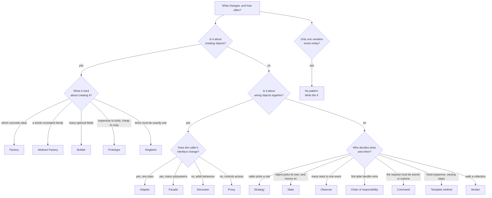

# Day 076 · System design — Design patterns revision and interview questions

**After today you can:** You can pick and defend a pattern for an unseen problem, or argue that none is needed.

**The interviewer asks it as:** *Which pattern fits here, and what would you lose by using it?*

---

## 1. What this is, and why they ask it

Over the last fourteen days you have met sixteen patterns: Singleton, Factory, Abstract Factory,
Builder, Prototype, Adapter, Decorator, Facade, Proxy, Strategy, Observer, State, Command, Chain of
Responsibility, Template Method and Iterator. Today is not a seventeenth. Today is the skill that
makes the other sixteen worth anything: **looking at an unfamiliar problem and saying which one fits,
which two it could be confused with, and what it costs.**

The interview question is almost never "explain the decorator pattern". It is a mess of requirements
and a pause. What you are being scored on is whether you can name the **axis of change** — the one
thing that will keep changing about this code — before you name a pattern, and whether you can say
"none of them, write the `if`" when that is the honest answer.

They ask it because pattern knowledge without judgement is worse than no pattern knowledge. A
candidate who reaches for Abstract Factory when a dictionary would do has told the interviewer
exactly how they will behave in the codebase. The strongest answer in this whole area is always the
one that names the cost.

---

## 2. The story

When Ravi moved into his own place, his uncle gave him a metal box of tools. Twenty-three of them,
several of which Ravi still cannot name.

The kitchen tap started dripping in the second week. Ravi opened the box and stood in front of it for
ten minutes.

He knew how to fix a dripping tap. He had watched it done twice. But owning twenty-three tools had
put an idea in his head — that somewhere in that box was the tap tool, the correct one, and that
using anything else would be a mistake he would find out about in six months. So he stood there,
picking things up and putting them back, and the tap kept dripping into the bucket.

In the end he went next door. Sudhakar has been fixing things in that building for thirty years and
does not own twenty-three of anything. He came over with three things in his hand and had it done in
four minutes.

What he said afterwards, while he was drying his hands on his shirt, is the part Ravi remembers. Most
jobs, he said, are one of about six jobs. Something is loose. Something is worn out. Something is
blocked. Something is in the wrong place. Something needs holding still while you work on it.
Something needs cutting. Once you are sure which of the six you are looking at, the tool picks
itself. The difficulty is never the tool. It is being sure which job it is.

Two months later Ravi hung a shelf. He needed four small holes, and by then he had bought a drill,
and he was quite pleased about the drill.

He used it. The wall was thin and older than the building deserved, the drill went in much further
than it should have, and the crack it made runs from behind the shelf to the corner of the window
where anybody sitting on the sofa can see it.

A screwdriver and some patience would have done the job. He owned the screwdriver. He used the drill
because he had it, and because using it felt like doing the job properly.

---

## 3. The idea in plain English

Sudhakar's six jobs are the point. **Recognising the job is the skill; the pattern is the easy part.**
And Ravi's crack in the wall is the other half: a pattern applied where none was needed does visible
damage, and the damage looks like competence while you are doing it.

### The first question is never "which pattern"

It is: **what is going to change, and how often?**

Every pattern in this phase exists to make one particular kind of change cheap, and it makes every
other kind of change slightly more expensive. So the sequence is always:

1. **Name the axis of change** in three or four words. "A new payment provider." "A new report
   format." "A new thing that must happen after checkout."
2. **Say how often it changes.** Twice a year, or twice a sprint? Once ever?
3. **Only then** name the pattern that makes *that* axis cheap.
4. **Say what it costs**, in files, indirection and readability.
5. **Say what would make you not do it.**

A candidate who does steps 1 and 2 out loud has already outperformed one who jumps to step 3 with the
right answer.

### The sixteen, as one-sentence triggers

Read these as *"if you hear this, think of that"*. This table is the revision.

| Pattern | The trigger sentence | Day |
|---|---|---|
| **Singleton** | "There must be exactly one of these in the process." | [064](../day-064-grouping/README.md) |
| **Factory** | "The caller should not know which concrete class it gets." | [065](../day-065-hashing-custom-objects/README.md) |
| **Abstract Factory** | "These objects must come from the same family and never be mixed." | [065](../day-065-hashing-custom-objects/README.md) |
| **Builder** | "This object has fifteen optional fields and a validity rule." | [066](../day-066-when-hashing-is-wrong/README.md) |
| **Prototype** | "Making one from scratch is expensive; copying an existing one is not." | [067](../day-067-hashing-revision/README.md) |
| **Adapter** | "This class does the right thing behind the wrong interface." | [068](../day-068-stacks/README.md) |
| **Decorator** | "Add behaviour to one object, at run time, stackably, without subclassing." | [069](../day-069-balanced-brackets/README.md) |
| **Facade** | "Five subsystems, and callers should see one simple door." | [070](../day-070-min-stack/README.md) |
| **Proxy** | "Same interface, but control *access* — lazily, remotely, or with a check." | [070](../day-070-min-stack/README.md) |
| **Strategy** | "This rule varies, and the caller picks which one." | [071](../day-071-monotonic-stack/README.md) |
| **Observer** | "When X happens, several independent things must react." | [072](../day-072-largest-rectangle/README.md) |
| **State** | "Behaviour depends on which stage this object is in, and it moves itself." | [073](../day-073-queues/README.md) |
| **Command** | "The request itself must be storable — queued, undone, logged, replayed." | [074](../day-074-deques-and-window-max/README.md) |
| **Chain of responsibility** | "Several possible handlers; the first that can, does; the rest stop." | [074](../day-074-deques-and-window-max/README.md) |
| **Template method** | "One fixed sequence of steps, and two of the steps vary." | [075](../day-075-queue-from-stacks/README.md) |
| **Iterator** | "Walk this collection without knowing how it stores things." | [075](../day-075-queue-from-stacks/README.md) |

### The three families, and what each family is really about

- **Creational** — Singleton, Factory, Abstract Factory, Builder, Prototype. All about **how an object
  comes into existence**, and all of them exist because `new` and `__init__` are inflexible: they
  name a concrete class, they take positional arguments, and they run every time.
- **Structural** — Adapter, Decorator, Facade, Proxy. All about **how objects are wired together**.
  Three of the four are one object wrapping another; the difference between them is *why*.
- **Behavioural** — Strategy, Observer, State, Command, Chain of Responsibility, Template Method,
  Iterator. All about **who decides what, and when**. This is the family interviewers care about most,
  because it is where the design decisions live.

### The wrapping four, told apart

Adapter, Decorator, Facade and Proxy all look like "class A holds class B and forwards calls". They
are told apart by **what happens to the interface** and **why the wrapper exists**:

```
             interface        purpose
 Adapter     CHANGES it       make an incompatible thing usable
 Decorator   keeps it         add behaviour, stackably, at run time
 Proxy       keeps it         control access — lazy, remote, cached, permission-checked
 Facade      NEW, simpler     hide several subsystems behind one door
```

The two-question test: **does the caller's interface change?** (Adapter and Facade yes, Decorator and
Proxy no.) And **is the wrapper adding behaviour the caller asked for, or controlling access the
caller did not ask about?** (Decorator adds; Proxy controls.)

### The behavioural look-alikes, told apart

**Strategy vs State** — identical class diagrams. *The client chooses a strategy; the object replaces
its own state.* States know their successors; strategies do not know each other exists. The tell in
code is an assignment to the context's own field from inside an implementation.

**Strategy vs Template Method** — both vary a step. Strategy uses **composition** and can change at
run time; Template Method uses **inheritance** and is fixed when the subclass is written. If two
things vary independently, Template Method's hierarchy multiplies and Strategy does not.

**Observer vs Chain of Responsibility** — both hand a request to several objects. *In Observer,
everyone gets it. In a chain, the first one that can handle it stops the walk.* If it must reach all
of them, it is not a chain.

**Command vs Strategy** — both are "an object that does something". A strategy is an **algorithm**
plugged into a caller; a command is a **request with its receiver and arguments already bound**, so
it can be stored, queued and undone. If you need `undo`, it is Command.

**Factory vs Builder** — a factory decides **which class**; a builder assembles **one complicated
object** step by step. Fifteen optional fields is Builder; three subclasses to choose between is
Factory.

### And the answer that is often correct: none

An `if` with three branches, a dictionary of functions, a plain function argument. Say it when it is
true. "There are two cases today and I have no evidence of a third, so I would write the `if` and
extract a pattern when the second variation actually arrives" is a strong, senior-sounding answer,
and it is the one Sudhakar would give.

---

## 4. The picture

The decision map. Start at the top with the axis of change, not with a pattern.



What to notice: the fastest route through this diagram is the one on the right, straight to "no
pattern". That branch exists because it is used more often than any single pattern on the left, and
drawing it is how you show the interviewer that you know it.

Now the wrapping four, drawn so the difference is visible rather than described:

```
 ADAPTER — the interface changes

   caller --[ our interface ]--> Adapter --[ their odd interface ]--> Legacy

 DECORATOR — the interface is preserved, and it stacks

   caller --[ I ]--> Retry --[ I ]--> Logging --[ I ]--> Cache --[ I ]--> Real

 PROXY — the interface is preserved, and the wrapper decides whether to call at all

   caller --[ I ]--> Proxy --(maybe)--> Real
                       |
                       +--> permission check / lazy load / remote call

 FACADE — a new, smaller interface over several things

   caller --[ one simple method ]--> Facade --> Billing
                                            --> Inventory
                                            --> Notifications
```

The one that catches people: **Decorator and Proxy have the same shape.** The difference is intent —
a decorator adds something the caller wanted, a proxy controls access to something the caller did not
ask about — and a caching proxy and a caching decorator can be the same class with two different
names on two different days. When they look identical, say so, and say which intent you mean.

---

## 5. How it actually works

### The five moves for any "which pattern" question

This is the script. It works whether the prompt is a payment gateway, a report generator or an
notification system.

**Move 1 — restate the requirement as an axis of change.**
"So the thing that keeps changing is *which payment provider we use*, and we add roughly one a year."
This single sentence does most of the work, because most wrong pattern choices come from picking the
wrong axis.

**Move 2 — write the naive version out loud, and do not be embarrassed by it.**
"Today this would be an `if provider == 'razorpay'` chain in one function." Say it, then say
specifically what breaks: how many files change, how many tests re-run, what gets missed.

**Move 3 — name the pattern and what it makes cheap.**
"That is Strategy: one interface, one class per provider, and the choice made in a registry. Adding
the fourth provider is one new file and one line, and no existing test re-runs."

**Move 4 — name the cost.**
"What I lose is that reading 'what happens for Razorpay' is now three hops instead of reading one
function top to bottom, and the failure moves from compile time to run time if the registry has no
entry."

**Move 5 — name the condition under which you would not do it.**
"If the only difference between providers were a rate or a URL, this would be a dictionary, not four
classes. I would use Strategy because the *shapes* of the rules differ, not just the values."

Five sentences. If you can produce those five for any prompt, you have passed this part of the
interview regardless of which pattern you named, because the reasoning is the answer.

### A worked example, start to finish

> *"We send notifications. Right now it is email. Marketing wants SMS. Support wants a Slack message
> for high-priority items. And every notification must be logged, and some must be retried three
> times. How would you structure it?"*

**Move 1 — there are two axes, not one.** "There is *which channel* — email, SMS, Slack — and there is
*what wraps every send* — logging, retry. Those change independently, and that is the important
observation, because one pattern will not cover both."

**Move 2 — the naive version.** "One `send` function with an `if channel ==` chain, and logging and
retry written inline in each branch. Adding a channel means editing the shared function; adding retry
to SMS means copying the retry code."

**Move 3 — two patterns, one per axis.**
"Channels are **Strategy**: a `Notifier` interface with `send(message)`, one implementation per
channel, chosen by a registry. Logging and retry are **Decorator**: wrappers that implement the same
`Notifier` interface and hold another one, so `RetryingNotifier(LoggingNotifier(SmsNotifier()))`
composes. Decorator rather than Strategy for those, because I want to *stack* them and choose the
stack at run time."

**Move 4 — the costs.** "Six small classes instead of one function. A stack trace now shows three
wrappers before the real send. And the composition happens in the composition root, so 'what actually
happens when we send an SMS' is not answerable by reading one file."

**Move 5 — where I would stop.** "If there were one channel and no retry, none of this. And if
high-priority items must go to *several* channels at once, that is not Strategy any more — that is
**Observer**, and I would want to know before choosing."

That last line is the one that gets remembered. Noticing that a small requirement change would flip
the pattern is exactly the judgement being tested.

### The patterns you have already used without naming them

Being able to point at real code is what separates having read about patterns from having used them.

- **Singleton** — Python's module system. `import config` gives everybody the same object, and that
  is the least dangerous singleton there is.
- **Factory** — `logging.getLogger(name)`, `open(path, mode)`, `hashlib.new("sha256")`.
- **Builder** — a query builder, `subprocess.Popen`'s enormous keyword list, `datetime.replace`.
- **Prototype** — `copy.deepcopy`, and `dataclasses.replace(obj, field=new)`.
- **Adapter** — `io.StringIO` making a string look like a file. Every ORM.
- **Decorator** — Python's `@` decorators, `functools.lru_cache`, WSGI middleware, `gzip.GzipFile`
  wrapping a file object.
- **Facade** — `requests.get`, which hides connection pooling, redirects, TLS and encoding.
- **Proxy** — Django's lazy `QuerySet`, an ORM's lazy relation, a gRPC client stub, a CDN.
- **Strategy** — `sorted(key=...)`, `nginx`'s `least_conn`, Django's `PASSWORD_HASHERS`.
- **Observer** — `addEventListener`, Django signals, Kafka consumers.
- **State** — TCP's connection states, Stripe's `PaymentIntent`, Kubernetes pod phases.
- **Command** — Celery tasks, the Postgres write-ahead log, `git revert`, Ctrl+Z.
- **Chain of responsibility** — Django middleware, `iptables`, Python's `logging` propagation.
- **Template method** — `unittest.TestCase`, Django's class-based views, `JdbcTemplate`.
- **Iterator** — every `for` loop, `itertools`, S3 continuation tokens.

If you can name three of these from memory in an interview, you have said more than the pattern
definition ever could.

---

## 6. The numbers

### What each pattern costs to introduce

Measured as the smallest honest version — one interface plus three implementations, against the `if`
chain it replaces:

```
 if/elif chain, 3 cases                1 file,  ~26 lines
 dict of functions (Python)            1 file,  ~12 lines
 Strategy, 3 classes                   5 files, ~90 lines
 State, 5 states                       6 files, ~85 lines
 Decorator, 2 wrappers                 3 files, ~55 lines
 Observer, 4 listeners                 6 files, ~95 lines
 Abstract Factory, 2 families × 3      9 files, ~160 lines
```

So the class-based version of a three-case rule costs roughly **65 extra lines and 4 extra files**.
That is the price of admission, and it is worth quoting because it makes "is this worth it?" a
question with an answer instead of a matter of taste.

### What it buys, per new variation

```
 adding the 4th case:
   if-chain:   1 shared file edited · ~32 existing tests re-run · 3 live rules at risk
   pattern:    1 new file added     ·   0 existing tests re-run · 0 live rules at risk

 adding the 12th case:
   if-chain:   a 90-line function nobody fully understands; cost per case RISING
   pattern:    identical to adding the 4th; cost per case FLAT
```

**The flatness is the whole argument.** The pattern is not cheaper on the second case. It is cheaper
on the sixth, and it stops getting more expensive, which the `if` chain never does.

### The break-even, stated as a rule

```
 1 variation:   pattern costs ~65 lines, saves nothing        -> do not
 2 variations:  pattern costs ~65 lines, saves ~10            -> probably not
 3 variations:  roughly break even                            -> judgement
 4+ and still arriving:  clearly worth it                     -> yes
```

The famous version of this is the **rule of three**: write it inline once, write it inline twice, and
extract on the third. It is a rule of thumb, not a law, and the reason it works is that the second
occurrence is the first time you can *see* which part actually varies. Deciding from one example is
guessing.

### The cost of guessing wrong

```
 wrong pattern, discovered in month 2:
   ~200 lines to unpick, 1 day, no user impact

 wrong pattern, discovered in month 14:
   9 dependent classes, 3 teams, a deprecation cycle
   typical: 2-3 weeks, or it is never removed at all
```

The asymmetry is the reason to under-apply rather than over-apply. Removing an unnecessary `if` is an
afternoon. Removing an unnecessary hierarchy that four teams have built on is a quarter, and it
usually does not happen — it just stays there, and every new engineer assumes it is load-bearing.

### The run-time cost, so you can dismiss it

```
 one extra method call in Python        ~60 ns
 a 3-deep decorator stack               ~180 ns per call
 an 8-handler chain of responsibility   ~500 ns of dispatch
```

On a request that takes 40 milliseconds, a 3-deep decorator stack is **0.0005 percent**. The cost of
patterns is never speed; it is always readability and indirection. Say that when somebody raises
performance, and get back to the real argument.

---

## 7. The trade-offs

### What all of these patterns cost you, without exception

**Indirection.** Every one of them replaces "read the function" with "find the implementation". Three
hops instead of one. That cost is paid on every read by every engineer for the life of the code, and
reads outnumber writes enormously.

**Errors move from compile time to run time.** A registry lookup that has no entry for a new country
is a `KeyError` when a customer checks out, not a build failure. Every factory, registry and dynamic
dispatch has this shape. Mitigate it — validate at start-up, use enums as keys, assert completeness
in a test — and say that you would.

**Names outlive their reasons.** `PricingStrategy` with one implementation, two years after somebody
deleted the other two, is worse than no interface: it looks deliberate, so nobody removes it.

**The interface becomes the lowest common denominator.** The moment one implementation needs an
argument the others do not have, you either widen the interface for everyone or start passing a
context dictionary. This is how clean interfaces become `handle(request, context: dict)`.

**Patterns invite more patterns.** A factory suggests an abstract factory; a strategy suggests a
strategy factory. Each step is locally reasonable and the destination is a codebase where finding
where the work happens takes twenty minutes.

### The Python-specific concession, which is worth making unprompted

Several of these patterns exist because Java and C++ lack first-class functions. In Python:

- **Strategy** is often a function in a dictionary. Twelve lines rather than ninety.
- **Command** without `undo` is `functools.partial(fn, *args)`.
- **Decorator** is frequently the `@` syntax rather than a wrapper class.
- **Singleton** is a module.
- **Abstract Factory** is often a dictionary of dictionaries, and honest about it.
- **Iterator** is `yield`.

Saying "in Python I would write this as a dict of functions, and here is the version with classes if
we need the ceremony" is a strong answer. It shows you know the pattern *and* the language, and it
directly answers the "what would you lose" half of the question — you lose about seventy-eight lines
and gain nothing.

### "I would not use a pattern at all if..."

- **...this is the first variation.** You are guessing at the seam. The second occurrence tells you
  where it actually is.
- **...only a value differs, not a behaviour.** Three tax rates are a dictionary. Three tax *rule
  shapes* are a Strategy. This is the single most common mistake.
- **...the set is genuinely closed.** Seven weekdays, four suits in a deck, three states an order can
  be in and no more ever.
- **...I cannot name the second implementation.** A test double counts. A hypothetical does not.
- **...the team is two people and the code is six months old.** Patterns buy coordination between
  people who will never speak to each other. That is a real benefit and it is worth nothing yet.

### The sentence that carries the most weight

> "I would write the `if` today, and here is the specific signal that would make me extract the
> pattern: the third payment provider, or the first time two of them need different arguments."

That answer says you know the pattern, you know its cost, and you have a trigger rather than a taste.
It is better than naming the pattern immediately, and interviewers notice.

---

## 8. In the interview

### How it gets asked

- The open version, mid-way through a design round: *"Which pattern would you use here, and what
  would it cost you?"*
- The refactoring version: *"Here is a 200-line function with a nine-way `if`. What do you do?"*
- The distinguishing version, which is almost guaranteed if you name a pattern: *"How is that
  different from Strategy?"* or *"Is that not just a decorator?"*
- The trap version: *"Would you use a Singleton for the database connection pool?"* — they want to
  hear the criticism, not the definition.
- The experience version: *"Tell me about a pattern you removed."* This is the best question in the
  set and almost nobody has an answer ready. Have one.

### What to say out loud, in the first ninety seconds

1. **Do not name a pattern yet.** "Before I pick anything, let me say what I think changes here and
   how often."
2. **Name the axis of change in one sentence.** "The thing that varies is which payment provider, and
   we add about one a year."
3. **Check for a second axis.** "Is there anything that varies independently of that? Because if
   logging and retry also vary, that is a second axis and it wants a different pattern."
4. **Say the naive version and what breaks.** "Today this is an `if` chain. With three cases that is
   fine. The problem starts at five: one shared function that three teams edit, and a change to the
   India rule can break the UK test."
5. **Name the pattern, then immediately name the cost.** "Strategy. What I lose is one function you
   can read top to bottom, and a `KeyError` at run time instead of an error at build time."
6. **Give the condition for not doing it.** "If the providers differed only by a rate, this would be
   a dictionary and I would say so."

### The follow-ups

**"How is that different from Strategy?"** — for whichever pattern you named.
Have the one-liners ready. *State*: the object replaces its own; the client picks a strategy.
*Template Method*: inheritance and fixed at subclass-writing time; Strategy is composition and
run-time. *Command*: a bound request that can be stored and undone; a strategy is an algorithm with
no memory. *Decorator*: same interface, stacks, adds behaviour; a strategy replaces behaviour and
does not stack.

**"Would you use a Singleton here?"**
"Rarely, and I would want to know why one instance is required rather than merely convenient. The
real objections are that it is global mutable state under a respectable name, that it makes tests
order-dependent because state leaks between them, and that 'one per process' is meaningless once
there are eight processes on four machines. For a connection pool I would create one instance at
start-up and pass it in — dependency injection gives me the single instance without the global."

**"When would you use no pattern at all?"**
"Most of the time, honestly. When only one variation exists, when only a value differs rather than a
behaviour, when the set is closed, or when I cannot name the second implementation. The cost of
removing an unnecessary `if` is an afternoon; the cost of removing an unnecessary hierarchy that four
teams have built on is a quarter, and usually it never happens. So I would rather be late than
early."

**"You have used a pattern and regretted it. Tell me."**
Have a real one. A usable shape: "I introduced a Strategy for two variants that turned out to be the
same variant with a different constant. It became five files, and every reader had to open all of
them to learn something that was one line. We removed it a year later and the diff was minus
sixty-two lines. What I took from it is that 'the behaviour differs' and 'the value differs' look
identical from a distance, and the test I use now is: can I write both implementations as one
function with one extra argument? If yes, it is a value."

**"Which of these do you actually see most in real code?"**
"Strategy, Decorator, Observer and Iterator, by a distance — and Iterator and Template Method mostly
because the language and the frameworks already implemented them. Abstract Factory and Prototype I
have almost never needed. Singleton I see often and want to remove most times I see it."

### A model answer

Asked: *here is a service with a nine-way `if` on `provider`, and each branch is about thirty lines.
Which pattern, and what would it cost?*

> "Before I pick a pattern, let me name what is actually varying, because getting that wrong is how
> people end up with the wrong one.
>
> The axis here is *which payment provider*, and nine branches tells me it has been varying for a
> while and is still varying — nobody writes nine branches on purpose in one sitting. So this is not a
> case where I would say 'leave the `if`'. At two or three branches I would leave it.
>
> Before I commit, one check: is there a second axis? If retry, logging and idempotency also vary
> independently of the provider, that is a separate dimension and one pattern will not cover both. If
> so, I would use Strategy for the provider and Decorator for the cross-cutting wrappers, because
> decorators stack and strategies do not.
>
> Assuming one axis: this is Strategy. One `PaymentProvider` interface with the two or three methods
> the caller actually uses, one implementation per provider, and the selection in a registry — a
> dictionary from provider name to instance — built at start-up in the composition root. Crucially,
> the selection does not live inside the checkout service, or I have just moved the `if` and gained
> nothing.
>
> What that buys, concretely: adding the tenth provider is one new file and one line in the registry.
> Zero existing tests re-run and zero live providers are at risk, because they are in different files.
> Today, a change to the Razorpay branch can break the Stripe tests, because they share a function and
> the same 200-line file is edited by three teams. And the cost per provider stops rising — the tenth
> costs what the fourth cost, whereas right now each one makes that function harder.
>
> What it costs, and I want to say this rather than have you find it. Reading 'what happens for
> Razorpay' becomes three hops: open checkout, see it holds a provider, find the registry, open the
> implementation. Right now it is one function you can read top to bottom, and for a small number of
> cases that is genuinely better. The failure also moves from build time to run time — a provider
> name with no registry entry is a `KeyError` during a customer's checkout — so I would type the key
> as an enum and add a start-up assertion that every supported provider has an implementation.
> Roughly, this is five files and ninety lines where there was one file and two hundred and seventy,
> so it is not a saving in lines. It is a saving in blast radius.
>
> And the condition that would change my answer: if the nine branches turn out to differ only by a
> URL and an API key, this is not nine behaviours, it is one behaviour with nine configurations, and
> the right answer is a dictionary of settings and one implementation. That is the mistake I would be
> most worried about making here, so before writing anything I would read all nine branches and ask
> whether I can express any two of them as the same code with a different constant. If I can, they are
> data, not strategies.
>
> One last thing on performance, since it sometimes comes up: the extra indirection is about sixty
> nanoseconds per call on a request that takes forty milliseconds. The cost of this decision is
> readability, never speed."

---

## 9. Recall card

- **Name the axis of change before naming a pattern, and say how often it changes.** Five moves for
  any prompt: *restate the axis · say the naive version and what breaks · name the pattern and what it
  makes cheap · name the cost · name the condition for not doing it.* The reasoning scores higher than
  the choice.
- **The wrapping four, told apart by two questions:** *does the caller's interface change?* — Adapter
  and Facade **yes**, Decorator and Proxy **no**; *adding behaviour or controlling access?* — Decorator
  **adds and stacks**, Proxy **controls** (lazy, remote, permission). Facade = a **new smaller**
  interface over several subsystems; Adapter = **one** class behind the wrong interface.
- **The behavioural look-alikes, one line each.** Strategy vs State: *the client picks a strategy; the
  object replaces its own state.* Strategy vs Template Method: *composition and run-time vs inheritance
  and fixed.* Observer vs Chain: *everyone gets it vs the first able handler stops the walk.* Command
  vs Strategy: *if you need `undo`, it is Command.* Factory vs Builder: *which class vs fifteen
  optional fields.*
- **The economics: ~65 extra lines and 4 extra files for a three-case rule, and the payoff is
  flatness** — the twelfth case costs what the fourth cost, while the `if` chain gets worse for ever.
  **Rule of three.** Getting it wrong in month 2 costs a day; in month 14 it costs a quarter or never
  gets undone — so **under-apply rather than over-apply**. Runtime cost is ~60 ns per hop:
  **never a performance argument.**
- **"No pattern" is a real answer and often the right one:** one variation today · only a **value**
  differs, not a behaviour · a closed set · you cannot name the second implementation. In Python,
  Strategy is often a **dict of functions** (12 lines vs 90), Command without undo is
  `functools.partial`, Singleton is a **module**, Iterator is `yield`. The strongest sentence in the
  whole phase: ***"I would write the `if` today, and the third provider is the signal that makes me
  extract it."***
