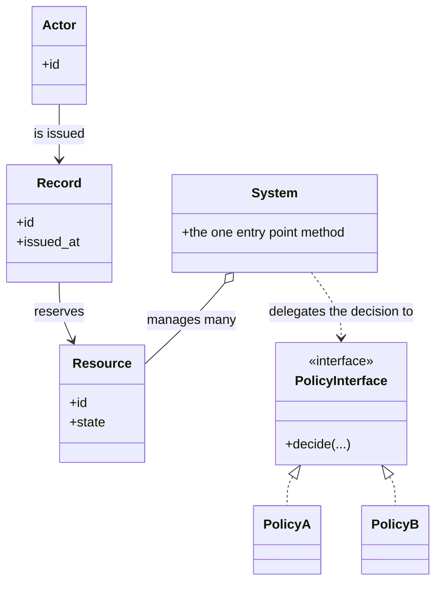
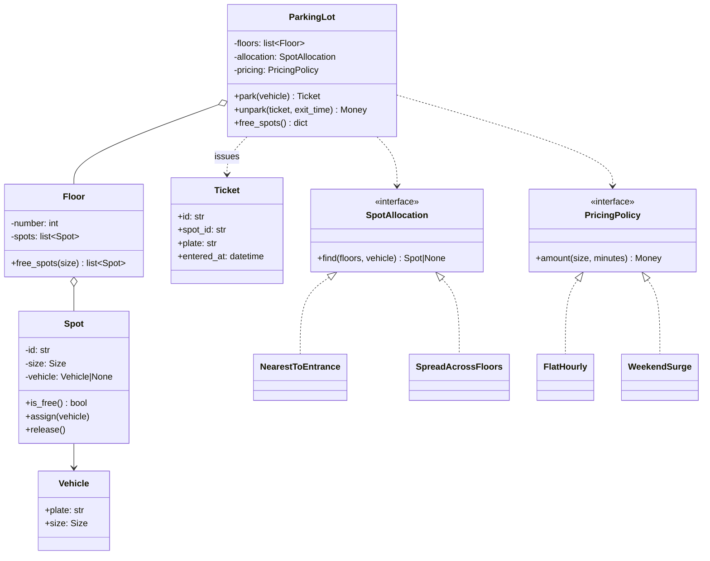

# Day 077 · System design — How to run a low-level design interview: the forty-minute script

**After today you can:** You have a repeatable order of moves for any LLD prompt, so you never freeze.

**The interviewer asks it as:** *Design a parking lot. You have forty minutes. Begin.*

---

## 1. What this is, and why they ask it

A **low-level design** round gives you a small, familiar system — a parking lot, a lift, a vending
machine, Splitwise — and forty minutes. The output is **classes**: what objects exist, what each one
is responsible for, how they relate, and code for the two or three that matter. It is not about
servers, load balancers or databases. That is the *high-level* round, and it comes much later in this
course.

Today is not a system. Today is the **script** — the fixed order of moves you run on every one of
these prompts for the next twenty days. Six moves, a rough number of minutes each, and one heuristic
for finding the single place where the design is actually decided.

They ask this round because it is the closest thing to watching you work. Anyone can memorise a
parking lot design; the round is built so that the interviewer can change a requirement at minute
thirty-five and see whether your design bends or breaks. And they ask it because the most common
failure is not a bad design. It is a candidate who knows the material, is asked an open question, and
spends nine minutes deciding where to start.

---

## 2. The story

Vinod's tailoring shop is one room with two machines, and on the four days before any festival there
are people standing in it from eight in the morning.

He has a way of taking an order and it never changes. The customer sits on the stool. He asks what
the occasion is and when it is needed — always that first, because half the time the date is
impossible and there is no point in the rest of the conversation. Then he takes the measurements, in
the same order every time, calling them out while his wife enters them into the phone. Then the three
questions: sleeves, neck, lining. Then the price and the date. Then the customer stands up.

Nine minutes. He has been doing it for twenty-two years and it is nine minutes whether the customer
is chatty or silent.

Kishore, who joined last year, is in several ways a better tailor than Vinod. His finishing is
neater and he is much better with difficult fabric. And on a busy day he takes thirty-five minutes
with a customer and the room fills up behind him.

The reason is not that he is slow with the tape. It is that he starts wherever the customer starts. A
woman comes in holding a photograph on her phone and says "can you do this neck", and Kishore looks
at the photograph, and they talk about the neck, and then about whether the fabric will hold that
shape, and then about a similar thing he made last month — and twenty minutes later nobody has taken
a single measurement or asked when it is needed.

Vinod is not rude to those customers. He looks at the photograph for four seconds, says "yes, we can
do that, let me take the measurements first", and then does. The photograph comes back at the right
moment, which is after the measurements and before the price, because the neck changes the price.

What Vinod says about it, when Kishore complains that his way is mechanical, is that having an order
is what lets him actually think. He is not spending anything on deciding what to do next. So when
something unusual turns up — the woman last week who needed it in two days and had brought fabric
that was half a metre short — he had all of his attention for that, and he solved it, and it still
took eleven minutes.

---

## 3. The idea in plain English

Vinod's nine minutes are a **script**: a fixed order of moves that costs nothing to run, so that all
of your thinking goes into the problem rather than into what to do next. The interview version has
six moves.

### The six moves

**Move 1 · Clarify — three or four questions, then state your assumptions.** (minutes 0–5)
Not "any questions?" — specific ones whose answers change the design. Then say the assumptions out
loud and write them down, because an interviewer who disagrees will correct you now rather than at
minute thirty.

**Move 2 · Requirements — a short list, and what you are leaving out.** (minutes 5–8)
Four or five bullet points of what the system does. Then, explicitly: "I am not going to design
authentication, or the payment gateway integration, or the mobile app." Naming the exclusions is what
stops the scope quietly doubling.

**Move 3 · The nouns — pull the classes straight out of the requirements.** (minutes 8–13)
Read your own requirement list and underline the nouns. Ticket, vehicle, spot, floor, payment. Write
each as a class with **one line saying what it is responsible for**. If you cannot write that line in
one sentence, the class is wrong.

**Move 4 · The class diagram — the artefact they are waiting for.** (minutes 13–22)
Boxes, key fields, key methods, and the relationships between them. This is the thing the interviewer
will photograph. Draw it while narrating; do not draw in silence.

**Move 5 · The interesting part — find it, put an interface there, show two implementations.**
(minutes 22–33)
Every LLD prompt has exactly one place where the design is genuinely decided. Find it and spend a
third of your time there. This is the move that separates candidates, and the next section is
entirely about it.

**Move 6 · Concurrency and extension.** (minutes 33–40)
What happens when two people do the thing at the same moment. Then answer the requirement they are
about to add, before they add it.

### Move 5, which is the whole interview: find the one interesting part

A parking lot is not an interesting problem. `Vehicle`, `Spot`, `Ticket` and `Floor` are obvious and
everyone gets them. What is interesting is **which spot you give a car**, because that is where a
requirement change actually hurts.

Every prompt has one. Learn to find it, because the rest is bookkeeping:

| Prompt | The one interesting part |
|---|---|
| Parking lot | Spot allocation, and pricing |
| Elevator | Scheduling: which lift answers which call |
| Vending machine | The state machine, and making change |
| ATM | The state machine, and what happens mid-withdrawal |
| Library | Who owns the late-fee rule |
| Tic-tac-toe | Win detection that survives an N×N board |
| Deck of cards | Shuffling, and comparing hands |
| Splitwise | Minimising the number of settlement transactions |
| BookMyShow | Seat locking when two people click at once |
| Food delivery | The order state machine |
| Ride hailing | Matching a rider to a driver |
| Rate limiter | Which algorithm, and why |
| In-memory cache | The eviction policy |
| Logging framework | Adding a new destination without touching the core |

The test for whether you have found it: **if the interviewer changed one requirement, which part of
your design would have to change?** That part is the interesting part, and it is where an interface
belongs.

Then do the thing that wins the round: **put an interface there and show two implementations.**

```python
class SpotAllocation(Protocol):
    def find(self, spots: list[Spot], vehicle: Vehicle) -> Spot | None: ...

class NearestToEntrance:  ...     # today's rule
class SpreadAcrossFloors: ...     # tomorrow's rule, for lift congestion
```

Two implementations, not one. One implementation is a class; two is a demonstration that the design
survives change. It is Strategy from [day 071](../day-071-monotonic-stack/README.md), applied to the
part of the problem where change is actually going to arrive.

### The rule that matters more than any of the moves

**Never present the finished design as if it appeared fully formed.**

Show version one. Say what breaks. Then fix it. "I would start with the parking lot itself finding
the spot — one method, thirty lines. That is fine until pricing also varies by vehicle type and by
time of day, at which point that method is doing two unrelated jobs. So I would pull allocation out
behind an interface."

An interviewer cannot tell the difference between a memorised diagram and an understood one — until
you show them the seam and why it is there.

### The nouns test, and the two failure modes

Too few classes: one `ParkingLot` class with eleven methods and every rule inside it. It works, and
it demonstrates nothing.

Too many: `ParkingLotFactory`, `AbstractTicketBuilder`, `SpotAllocationStrategyRegistryProvider`. This
is Ravi's drill through the wall from [day 076](../day-076-lru-cache/README.md), and interviewers
read it as inexperience rather than sophistication.

**Six to ten classes is right** for a forty-minute prompt. If you have four, you have merged
responsibilities. If you have eighteen, you are designing a framework nobody asked for.

---

## 4. The picture

The forty minutes, drawn as a budget. Notice how little of it is code.

```
 0    5     8        13              22                    33          40
 |----|-----|--------|---------------|---------------------|-----------|
 clar  reqs  nouns    class diagram   THE INTERESTING PART   concurrency
 ify   and   with     drawn while     interface + 2 impls    + extension
       scope one-line narrating       + the code for it
             purpose

 |<--- 13 min: agreeing what to build --->|<-- 20 min: the design -->|<- 7 ->|
```

What to notice: **a third of the round is spent before you draw a single box.** That feels wrong when
the clock is running, and it is the difference between designing the right system and designing a
system fast.

The shape of every class diagram you will draw for the next twenty days:



What to notice: the dashed arrow from `System` to `PolicyInterface`. Every good low-level design has
exactly one of those, and it points at the interesting part. If your diagram has no interface in it,
you have described a system rather than designed one. If it has five, you have over-built.

And the move-5 pattern, drawn on its own because it is the one to internalise:

```
 version 1                          version 2 (after you say what breaks)

 +----------------+                 +----------------+       +------------------+
 |  ParkingLot    |                 |  ParkingLot    |------>| «interface»      |
 |----------------|                 |----------------|       | SpotAllocation   |
 | find_spot()    |  <- the rule    | (holds one)    |       +------------------+
 | price()        |     lives here  +----------------+              ^      ^
 | park()         |                                                 |      |
 +----------------+                                     NearestToEntrance  SpreadAcrossFloors
```

---

## 5. How it actually works

The script, run end to end, on a prompt you will meet properly tomorrow.

### Move 1 · Clarify (minutes 0–5)

Ask four questions. Good ones have the property that a different answer gives a different design:

> "Multiple floors, or one level?" — *Multiple.*
> "Multiple vehicle sizes, and can a small vehicle use a large spot?" — *Motorcycle, car, bus. Yes,
> but only if nothing smaller is free.*
> "Is payment on exit, and is it time-based?" — *On exit, hourly, with a different rate per size.*
> "Roughly how big — a hundred spots or ten thousand?" — *About a thousand.*

Bad questions are ones whose answer changes nothing: "is it an underground car park?"

Then say the assumptions out loud: "I will assume a ticket is issued at entry and paid at exit, that a
vehicle occupies exactly one spot, and that we are designing the in-process object model, not the
database schema. Stop me if any of those is wrong."

### Move 2 · Requirements and scope (minutes 5–8)

```
 In scope
   - park a vehicle: find a spot, issue a ticket
   - unpark: compute the fee, free the spot
   - several floors, several spot sizes
   - report free spots per floor
 Out of scope, deliberately
   - payment gateway integration
   - number-plate recognition
   - the mobile app and the API layer
```

Saying the second list is a move, not an omission. It stops the interviewer's follow-ups from being
about things you never claimed to design.

### Move 3 · The nouns (minutes 8–13)

Read your own requirements and pull the nouns out, each with one line of responsibility:

- **`Vehicle`** — a number plate and a size. Knows nothing else.
- **`Spot`** — a location, a size, and whether it is occupied.
- **`Floor`** — holds spots, and can report what is free.
- **`Ticket`** — links a vehicle to a spot with an entry time. Immutable once issued.
- **`ParkingLot`** — the entry point: `park(vehicle)` and `unpark(ticket)`.
- **`SpotAllocation`** *(interface)* — decides which free spot a vehicle gets.
- **`PricingPolicy`** *(interface)* — turns a duration and a size into an amount.

Seven. Two of them are interfaces, and both sit exactly where change will arrive.

Notice what is *not* there. No `ParkingLotManager`, because a class whose name ends in "Manager"
usually means you could not say its responsibility in one line. No `TicketFactory`, because there is
one kind of ticket.

### Move 4 · The diagram (minutes 13–22)



Narrate while drawing. "The lot holds floors, a floor holds spots, a spot may hold a vehicle. The lot
delegates two decisions — which spot, and how much — and everything else is bookkeeping."

### Move 5 · The interesting part (minutes 22–33)

**Say version one first, and say what breaks.**

"The simplest thing is `ParkingLot.park` scanning the floors for the first free spot of the right
size. That is fifteen lines and it is correct. It stops being adequate the moment someone says
'spread cars across floors so the lifts are not congested', or 'reserve floor 1 for electric
vehicles' — because then that method is making a policy decision inside a bookkeeping class, and
every new rule edits it."

**Then the interface and two implementations.**

```python
from typing import Protocol

class SpotAllocation(Protocol):
    def find(self, floors: list[Floor], vehicle: Vehicle) -> Spot | None: ...


class NearestToEntrance:
    """Lowest floor first, then lowest spot number. What a driver expects."""

    def find(self, floors: list[Floor], vehicle: Vehicle) -> Spot | None:
        for floor in sorted(floors, key=lambda f: f.number):
            free = floor.free_spots(vehicle.size)
            if free:
                return min(free, key=lambda spot: spot.id)
        return None


class SpreadAcrossFloors:
    """Pick the emptiest floor, to keep lift and ramp congestion even."""

    def find(self, floors: list[Floor], vehicle: Vehicle) -> Spot | None:
        candidates = [(f, f.free_spots(vehicle.size)) for f in floors]
        candidates = [(f, free) for f, free in candidates if free]
        if not candidates:
            return None
        floor, free = max(candidates, key=lambda pair: len(pair[1]))
        return free[0]
```

Two implementations of the same three-line interface. **This is the artefact that wins the round.**

Then the upgrade question, out loud: "One thing to notice — a small vehicle should be able to take a
large spot when nothing smaller is free, but only then. That is a rule about *fallback order*, and I
would put it in the allocation implementation rather than in `Floor`, because it is a policy and
`Floor` is bookkeeping."

**Then the class that carries it**, written properly:

```python
class ParkingLot:
    def __init__(self, floors, allocation, pricing) -> None:
        self._floors = floors
        self._allocation = allocation
        self._pricing = pricing
        self._open: dict[str, Ticket] = {}

    def park(self, vehicle: Vehicle, now: datetime) -> Ticket:
        spot = self._allocation.find(self._floors, vehicle)
        if spot is None:
            raise ParkingFull(f"no free spot for a {vehicle.size.name}")
        spot.assign(vehicle)
        ticket = Ticket(id=new_id(), spot_id=spot.id, plate=vehicle.plate, entered_at=now)
        self._open[ticket.id] = ticket
        return ticket
```

Eight lines, and it contains **no rules** — only sequencing. That is what "the lot delegates the
decisions" looks like in code, and it is worth pointing at when you finish typing.

### Move 6 · Concurrency and extension (minutes 33–40)

**Raise concurrency yourself, before you are asked.** "Two cars at the barrier at the same instant
can both be allocated the same spot, because `find` and `assign` are two separate steps. In one
process, a lock around find-and-assign fixes it, and I would take the lock per floor rather than per
lot so that two floors do not contend. Across processes, the allocation has to be a conditional
update in the database — `UPDATE spots SET vehicle = ? WHERE id = ? AND vehicle IS NULL` — and zero
rows updated means somebody else won and I retry with the next candidate."

**Then pre-empt the requirement they are about to add.** They always add one. For a parking lot it is
usually electric-vehicle charging bays, or monthly pass holders, or a reserved floor. Say: "If you
added charging bays, `Size` becomes insufficient and I would give `Spot` a set of features and let
the allocation policy filter on them — that change is one class, because the policy is already
isolated."

---

## 6. The numbers

### The time budget, and what it costs to get it wrong

```
 clarify + requirements      8 min   (20% of the round)
 nouns                       5 min
 class diagram               9 min
 the interesting part       11 min   (28% — the largest single block)
 concurrency + extension     7 min
 -------------------------------
 total                      40 min
```

The two common distributions, and what they produce:

```
 candidate A: 2 min clarifying, 25 min drawing every class in detail,
              5 min on allocation, no concurrency
              -> a complete diagram of a system nobody asked for
 candidate B: 8 min clarifying, 9 min diagram, 11 min on allocation,
              7 min on concurrency
              -> a smaller diagram and a design that survives a changed requirement
```

Interviewers hire B. The diagram is not the deliverable; the **decisions** are.

### How many classes

```
 4 or fewer     responsibilities have been merged; one class does everything
 6 to 10        right for a 40-minute prompt
 12 to 15       acceptable only if several are tiny value objects (Money, Size, Plate)
 18 or more     you are building a framework; this reads as inexperience
```

And the interface count:

```
 0 interfaces   you described a system; you did not design one
 1 to 2         correct — one per axis of change that actually exists
 5 or more      every method is now three hops from its caller
```

### Objects in memory, which they will ask

For a thousand-spot car park:

```
 Spot      1,000 × ~120 B  =  120 KB
 Floor         5 × ~200 B  =    1 KB
 Ticket, one per parked vehicle, at most 1,000 × ~200 B = 200 KB
 -------------------------------------------------------------
 total                     ≈  321 KB
```

A third of a megabyte for the whole car park. Say the number and then say what it means: **the entire
model fits in memory, so there is no reason to design around a database for the object model.** That
is a real conclusion drawn from arithmetic, and it is exactly what this section is for.

Contrast with a case where it does not: BookMyShow with 10,000 screens × 200 seats × 6 shows a day is
12 million seat records a day, and that one does not fit the same way.

### The concurrency window, in real units

```
 find a free spot        ~50 µs   (a scan of a few hundred spots)
 assign it               ~1 µs
 -----------------------------
 window between them     ~51 µs

 at 2 cars per second entering:  collision probability per event ≈ 10^-4
 at 1,000 spots and 300 arrivals in a peak hour: about 1 collision per 3 hours
```

That is the number that turns "you should use a lock" into "here is why a lock is required": a
collision every three hours is a car parked in an occupied spot every three hours, which is a real
incident, not a theoretical one.

### The forty-minute reality

```
 typical: 6-10 classes, 1-2 interfaces, ~120 lines of code written
 realistic code you will actually type: 2-3 classes, ~40 lines
```

You will not write the whole system, and you should not try. Write the classes that carry the
interesting part, and describe the rest.

---

## 7. The trade-offs

### What the script costs you

**It can sound rehearsed.** If you run the moves as a recitation — "now I will identify the nouns" —
it reads as a script rather than as thinking. Run the moves; do not narrate the names of the moves.
The interviewer should notice only that you never seem stuck.

**It can be the wrong order for the prompt.** Some interviewers open with "just start coding the core
class". Follow them, and fold the missing moves in as you go: clarify while writing the constructor,
name the interface when you reach the decision. **The script is a default, not a contract.**

**It biases you toward one interface.** Move 5 pushes you to find the interesting part and abstract
it. On a genuinely simple prompt — "design a deck of cards" — the honest answer may be five classes
and no interfaces at all, and inventing a `ShuffleStrategy` to satisfy the script is Ravi's drill
again. If you cannot name the second implementation, do not build the first.

**Eight minutes of clarifying feels like eight wasted minutes.** It is the highest-value part of the
round and it never feels like it while the clock is running. Trust it.

### What a low-level design round cannot tell them

It cannot tell them whether you can build the thing. Forty minutes of diagram is a sample of your
judgement, not of your work. Which is exactly why the *reasoning* is scored so much more heavily than
the diagram — and why a candidate who says "I would start with the simple version, and here is the
signal that would make me change it" outperforms one with a more elaborate drawing.

### "I would not follow this script if..."

- **...the interviewer has already given the requirements in writing.** Skip move 1 to a single
  confirming question and start at move 2. Asking questions they have already answered is worse than
  not asking.
- **...they ask for code immediately.** Some rounds are "implement an LRU cache" wearing a design
  hat. Code, and narrate the design decisions as you go.
- **...the prompt is genuinely a state machine** — vending machine, ATM, order flow. Then move 5 is
  the machine, and you should draw the state diagram *before* the class diagram, because the states
  determine the classes.
- **...there are twenty minutes, not forty.** Compress moves 2, 3 and 4 into one pass and keep move 5
  intact. Never sacrifice the interesting part to finish the diagram.

### The honest concession

The script does not make you a better designer. It makes your existing judgement *visible* inside a
fixed time, which is what the round measures. Vinod is not a better tailor than Kishore. He finishes,
every time, and he has attention left over when something unusual walks in.

---

## 8. In the interview

### How it gets asked

- The standard opening: *"Design a parking lot."* Or a lift, a vending machine, a library, a card
  game. Almost always with no further detail — the vagueness is deliberate.
- The narrowed version: *"Design the seat-booking part of BookMyShow."* Here the interesting part has
  been named for you; go straight to it.
- The code-first version: *"Write the classes for a rate limiter."*
- The mid-round curve ball, which is guaranteed: *"Now suppose we add electric vehicles / two lifts /
  a monthly pass."*

### What to say out loud, in the first ninety seconds

1. **Take control of the shape.** "Let me spend a few minutes on requirements, then draw the classes,
   then go deep on the part I think is actually interesting — probably spot allocation. Does that
   work for you?" Interviewers almost always say yes, and now the structure is agreed.
2. **Ask the four questions.** Multiple floors? Multiple sizes and can a small vehicle take a large
   spot? Payment on exit and time-based? How big?
3. **State the assumptions and invite correction.** "I will assume X, Y and Z — stop me if any of
   those is wrong."
4. **Say the scope exclusions.** "I am not designing the payment gateway or the app."
5. **Then start the nouns**, saying the responsibility of each in one line as you write it.

### The follow-ups

**"You have thirty seconds. What is the core of this design?"**
Name the interesting part, not the class list. "The core is spot allocation, because that is the rule
most likely to change — it is behind an interface with two implementations, and the parking lot
itself holds no rules."

**"Two cars arrive at the barrier at the same instant."**
"They can both be allocated the same spot, because finding a free spot and claiming it are two
separate steps with about fifty microseconds between them. At three hundred arrivals in a peak hour
that is roughly one collision every few hours, so it is a real incident. In one process, a lock
around find-and-claim, taken per floor rather than per lot so the floors do not contend. Across
processes, a conditional update — claim the spot only if it is still free — and zero rows updated
means retry with the next candidate."

**"Now add electric-vehicle charging bays."**
"`Size` alone is no longer enough, so a spot gains a set of features and a vehicle gains a set of
requirements. The allocation policy filters on features. That change touches one class — the
allocation implementation — because the policy was already isolated. If I had left the rule inside
`ParkingLot.park`, this would touch the busiest method in the system."

**"Why did you make that an interface and not the others?"**
"Because I can name the second implementation. There are two real allocation rules — nearest to the
entrance, and spread across floors for lift congestion — and two real pricing rules — flat hourly and
weekend surge. For everything else I cannot name a second implementation, so an interface there would
be a hierarchy built for a future that has not arrived, and it would cost every reader an extra hop."

**"Is this over-engineered?"**
"It might be, and here is the test I applied: for each interface I asked whether I could name a
second implementation that someone would actually want. Two passed and the rest did not, so there are
two interfaces and everything else is a plain class. If you told me the allocation rule will never
change, I would delete `SpotAllocation` and put the fifteen lines back inside `ParkingLot`."

**"You did not use a database anywhere."**
"Deliberately — I read this as an object-model question. And the arithmetic supports it: a thousand
spots plus tickets is about three hundred kilobytes, so the whole model fits in memory. If you want
persistence, spots and tickets become tables, and the concurrency answer changes from a lock to a
conditional update, which I mentioned. But I would not design the schema unless you want that."

### A model answer

Asked: *design a parking lot. You have forty minutes. Begin.*

> "Before I start — let me suggest a shape for the forty minutes so you know where I am going. A few
> minutes on requirements, then the classes and how they relate, then I want to spend the largest
> block on the part I think is actually interesting, which for a parking lot is how you choose which
> spot a vehicle gets. Then concurrency at the end. Does that work?
>
> Four questions. Multiple floors or one level? Multiple vehicle sizes, and can a car take a bus spot
> when nothing else is free? Is payment on exit and is it time-based? And roughly how many spots — a
> hundred or ten thousand? …Right. Multiple floors, three sizes with fallback allowed, hourly payment
> on exit at a different rate per size, about a thousand spots.
>
> So the assumptions I am working under: a ticket is issued at entry and settled at exit, one vehicle
> occupies exactly one spot, and I am designing the in-process object model rather than a database
> schema. Stop me if any of those is wrong. And I am explicitly not designing the payment gateway,
> number-plate recognition, or the app.
>
> The nouns fall straight out. `Vehicle` — a plate and a size, nothing else. `Spot` — an id, a size,
> and the vehicle in it if any. `Floor` — holds spots, reports what is free. `Ticket` — links a
> vehicle to a spot with an entry time, and I would make it immutable once issued. `ParkingLot` — the
> entry point, with `park` and `unpark`.
>
> That is five classes and it works, and I want to say why I am not going to stop there. If the whole
> rule for choosing a spot lives inside `ParkingLot.park`, then the first time someone says 'spread
> cars across floors so the lift queue is shorter', or 'reserve floor one for electric vehicles',
> that method gains a branch — and it is the method every car goes through. So the two decisions that
> will actually change get interfaces: `SpotAllocation`, which takes the floors and a vehicle and
> returns a spot or nothing; and `PricingPolicy`, which turns a size and a duration into an amount.
>
> The test I applied for each is: can I name a second implementation somebody would really want? For
> allocation, yes — nearest-to-entrance, which is what a driver expects, and spread-across-floors for
> congestion. For pricing, yes — flat hourly and weekend surge. For the other classes I cannot name a
> second implementation, so they stay plain classes. Two interfaces, seven classes.
>
> With that, `ParkingLot.park` is about eight lines and contains no rules at all — ask the allocation
> policy for a spot, raise if there is none, assign the vehicle, issue a ticket, record it. All the
> policy is somewhere I can change without touching the path every car takes.
>
> One rule that is easy to put in the wrong place: a small vehicle may use a large spot, but only when
> nothing smaller is free. That is a fallback ordering, and it is policy, so it goes in the allocation
> implementation rather than in `Floor`. `Floor` is bookkeeping and should stay that way.
>
> Concurrency, before you ask. Finding a free spot and claiming it are two separate steps, about fifty
> microseconds apart, so two cars at the barrier can be given the same spot. At a few hundred arrivals
> in a peak hour that is roughly one collision every few hours — a real incident, not a theoretical
> one. In one process I would hold a lock around find-and-claim, per floor rather than per lot so two
> floors do not contend. Across processes, the claim becomes a conditional update — take the spot only
> if it is still free — and zero rows updated means somebody else won and I try the next candidate.
>
> On size: a thousand spots at roughly a hundred and twenty bytes each, plus tickets, is about three
> hundred kilobytes. The entire model fits in memory comfortably, which is why I have not designed
> around a database.
>
> And if you added charging bays now, the change is one class: a spot gains a set of features, a
> vehicle a set of requirements, and the allocation policy filters on them. That is the payoff for
> isolating the decision, and it is the only reason I did it."

---

## 9. Recall card

- **Six moves, always in this order: clarify · requirements and scope · nouns · class diagram · the
  interesting part · concurrency and extension.** Budget them **8 · 5 · 9 · 11 · 7** minutes.
  A third of the round goes before you draw a box, and that is correct. Announce the shape in the
  first thirty seconds and the interviewer will agree to it.
- **Every LLD prompt has exactly ONE interesting part — find it and spend a third of the time there.**
  The test: *if the interviewer changed one requirement, what would have to change?* Parking lot →
  allocation. Lift → scheduling. Vending machine → the state machine. BookMyShow → seat locking.
  Splitwise → minimising settlements. Cache → eviction.
- **Put an interface at the interesting part and show TWO implementations.** One is a class; two is
  proof the design survives change. The gate for every interface: **can you name a second
  implementation somebody would actually want?** If not, do not build the first.
  **6–10 classes and 1–2 interfaces** is right; 4 classes means merged responsibilities, 18 means you
  are building a framework.
- **Never present the design as if it appeared fully formed.** Version one, what breaks, then the fix.
  That is the only way an interviewer can tell an understood design from a memorised one.
- **Raise concurrency yourself at minute 33.** Find-then-claim is two steps with a real window — ~51 µs,
  about one collision every few hours at peak — so: a lock **per resource, not per system**, or a
  **conditional update** where zero rows updated means you lost and must retry. Then answer the
  requirement they are about to add, before they add it.
