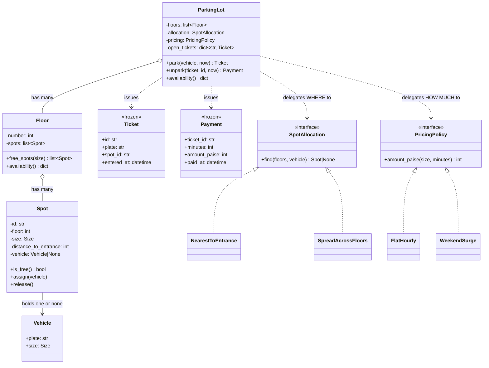
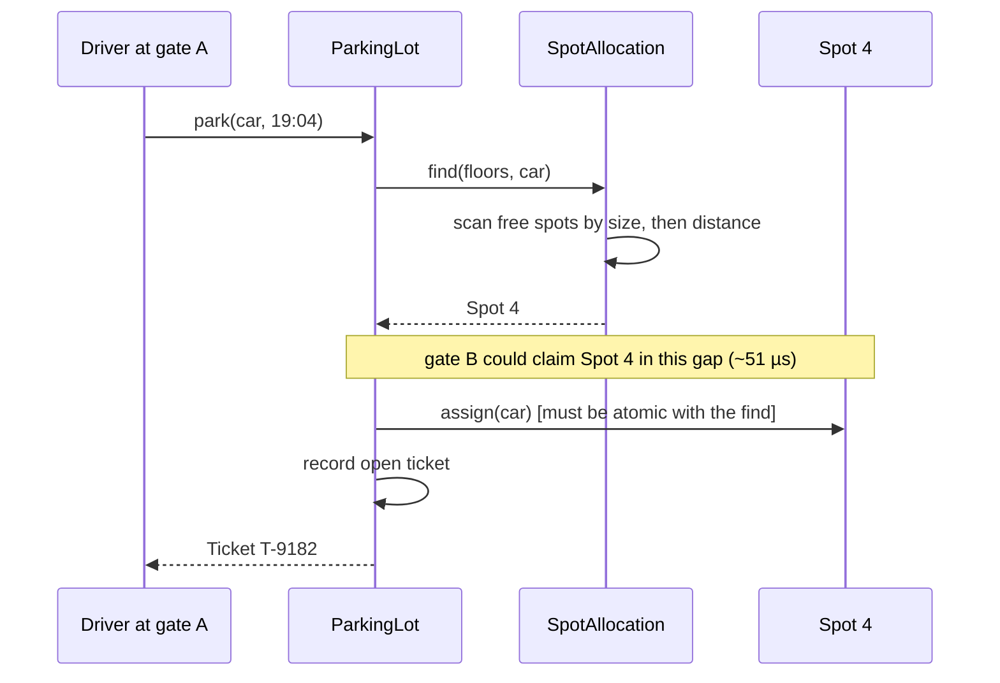

# Day 078 · System design — Design a parking lot

**After today you can:** You can produce classes, an interface for pricing, and a spot-allocation strategy.

**The interviewer asks it as:** *Design a parking lot. Multiple floors, multiple vehicle types.*

---

## 1. What this is, and why they ask it

"Design a parking lot" is the most-asked low-level design question there is. You get forty minutes, a
one-line prompt, and no further detail. The output is classes: what objects exist, what each is
responsible for, how they relate, and real code for the two or three that carry the design.

Yesterday you learned the [six-move script](../day-077-stacks-queues-revision/README.md). Today you
run it end to end on the canonical prompt, and the thing to take away is not the diagram. It is the
habit of finding the **one place where the design is actually decided** — here, which spot a vehicle
gets — putting an interface there, and showing two implementations.

They ask this one because everybody has been in a car park, so no domain knowledge separates
candidates, and because it has a perfect curve ball available at minute thirty-five: *"now add
electric-vehicle charging bays"*. A design where the allocation rule is buried inside the main method
needs surgery for that. A design with the rule isolated needs one class. The interviewer can see the
difference in ninety seconds.

---

## 2. The story

The wedding hall on the main road has a ground beside it that holds about ninety cars, and on a
Saturday in December it is full by seven.

Munna has run that ground for nine years. He stands at the gate in a reflective jacket that is too
big for him, and he decides where every car goes.

There is nothing marked on the ground. No lines, no numbers. He knows it the way you know your own
house in the dark. He knows the corner by the generator where a big car cannot turn, and the strip
along the back wall where the water collects after rain, and the six places near the gate that he
keeps empty until half past seven, because that is when the older relatives arrive and they should
not have to walk.

When a car comes in he looks at it for about a second — the size of it, and whether the driver is
going to be any good — and then he points. Left, left, straight, stop. He hands over a small numbered
token and drops the matching one into his shirt pocket in the order they arrived, and that pocket is
how he finds any car in ninety seconds when somebody wants to leave at eleven.

The two things that go wrong, go wrong the same way every time.

The first is when the ground is nearly full and a very large car arrives. There is space — three or
four gaps — but not one gap that will take it. He has to turn the car away, and the driver never
believes him, because from the gate it looks like there is plenty of room.

The second is the other gate. On big functions they open the side gate and put Munna's nephew on it,
and twice now the two of them have sent cars into the same gap at the same moment, because neither
could see what the other had just done. The first time everybody laughed. The second time a man
reversed into a scooter.

---

## 3. The idea in plain English

Munna's job is the design. He does four things, and the design has four parts.

**He decides where each car goes.** That is **spot allocation**, and it is the interesting part —
because his rule is not "the first free space". It is "the first free space that fits, except the six
near the gate before half past seven". Rules like that arrive constantly, and they must land in one
place.

**He looks at the car and judges its size.** That is the **vehicle type**, and the rule that a large
gap can take a small car but not the reverse. Munna's first failure — the ground looks empty and the
bus cannot fit — is a *fallback* rule, and it belongs with allocation, not with the ground.

**He hands out a token and keeps the matching one.** That is the **ticket**: a record linking a
vehicle to a spot and a time, which is what makes exit and payment possible at all.

**Two gates cannot see each other.** That is **concurrency**, and it is the part that separates
candidates. Finding a free spot and claiming it are two steps, and something can happen in between.

### The classes, straight out of that

Seven, each with one line of responsibility. If you cannot write the line, the class is wrong.

- **`Vehicle`** — a number plate and a size. Nothing else.
- **`Spot`** — a location, a size, and the vehicle currently in it if any.
- **`Floor`** — holds spots and reports what is free. Bookkeeping only, no policy.
- **`Ticket`** — links a plate to a spot with an entry time. Immutable once issued.
- **`ParkingLot`** — the entry point: `park`, `unpark`, and the free-space display.
- **`SpotAllocation`** *(interface)* — decides which free spot a vehicle gets.
- **`PricingPolicy`** *(interface)* — turns a size and a duration into an amount.

Two interfaces, five plain classes. The gate for an interface is always the same: **can you name a
second implementation somebody would actually want?** Allocation: nearest-to-entrance, and
spread-across-floors for lift congestion. Pricing: flat hourly, and weekend surge. Both pass. Nothing
else does, so nothing else gets one.

### Version one, and what breaks it

Start by saying the simple version out loud, because presenting the finished design as if it appeared
fully formed is what makes an interviewer suspect memorisation.

```python
    def park(self, vehicle):
        for floor in self._floors:                    # version one
            for spot in floor.spots:
                if spot.is_free() and spot.size == vehicle.size:
                    spot.assign(vehicle)
                    return Ticket(...)
        raise ParkingFull()
```

Fifteen lines, correct, and fine for a long time. It breaks the moment anyone says any of these:

- "A car should be allowed to use a bus spot when no car spots are free." → a fallback ordering.
- "Spread cars across floors so the lift queue is shorter." → a completely different rule.
- "Reserve floor one for electric vehicles." → a filter on features.
- "Monthly pass holders get the reserved bay." → a rule about the *driver*, not the vehicle.

Every one of those adds a branch to the method that every single car goes through. Four rules later
it is ninety lines and two teams edit it. So:

```python
class SpotAllocation(Protocol):
    def find(self, floors: list[Floor], vehicle: Vehicle) -> Spot | None: ...
```

Three lines of interface, and `ParkingLot.park` now contains **no rules at all** — only sequencing.

### The size rule, and where it belongs

Sizes are ordered: motorcycle < car < bus. A vehicle fits a spot when the spot is at least as large.
But you do not want a motorcycle taking a bus bay while a bus is waiting, so the rule is: **try the
exact size first, then progressively larger.**

That is a *policy* — a different car park might allow no upsizing at all — so it lives in the
allocation implementation, not in `Floor`. `Floor` answers "which spots of exactly this size are
free?" and nothing more. Keeping bookkeeping and policy apart is the single most useful instinct in
low-level design.

### The ticket, and why it is immutable

A ticket records what happened: this plate, that spot, at this time. Nothing about it should change
afterwards. Make it a frozen dataclass and the whole class of bugs where the exit code adjusts the
entry time to make the fee come out differently simply cannot be written.

Payment produces a **separate** record, so that an unpaid ticket and a paid one are different objects
rather than the same object with a mutated flag. That also gives you the audit trail for free.

---

## 4. The picture

The ground itself, so the size and fallback rules are visible:

```
 FLOOR 1                              size legend:  M = motorcycle  C = car  B = bus
 +----+----+----+----+----+----+----+----+
 | M  | M  | C  | C  | C  | C  | B  | B  |     entrance
 |free|used|used|free|used|free|used|free|  <-- this side
 +----+----+----+----+----+----+----+----+

 a CAR arrives:
   exact size (C) free?  yes, spots 4 and 6   -> take the one nearest the entrance
 a BUS arrives:
   exact size (B) free?  yes, spot 8          -> take it
 another BUS arrives:
   exact size (B) free?  no
   larger than B?        nothing is larger    -> REJECT, even though 3 spots are free
                                                 (Munna at the gate, being disbelieved)
 a MOTORCYCLE arrives:
   exact size (M) free?  yes, spot 1          -> take it
   (only if no M were free would it consider a C spot)
```

What to notice: the bus is rejected while three spots stand empty. That is not a bug and it is the
thing to say out loud — **"free spots" and "usable spots" are different numbers, and the display board
has to be honest about which it shows.**

The class diagram:



What to notice: the two dashed arrows out of `ParkingLot`. They are the design. Everything else is
containment and record-keeping, and if you removed those two arrows you would have described a car
park rather than designed one.

The entry sequence, with the race visible:



---

## 5. How it actually works

### Move 1 · Clarify (minutes 0–5)

Four questions whose answers change the design, then the assumptions:

> **"Multiple floors, or one level?"** — Multiple.
> **"How many vehicle sizes, and can a small vehicle use a larger spot?"** — Motorcycle, car, bus.
> Yes, but only when nothing of its own size is free.
> **"Is payment on exit, and is it time-based?"** — On exit, per hour, different rate per size.
> **"Roughly how many spots?"** — About a thousand.

> "I will assume a ticket is issued at entry and settled at exit, that one vehicle occupies exactly
> one spot, and that we are designing the in-process object model rather than a database schema.
> I am not designing the payment gateway, number-plate recognition, or the mobile app."

### Move 2 · The nouns (minutes 5–13)

The seven classes from §3, each with its one-line responsibility, said aloud as you write them.

### Move 3 · The value objects, written first

```python
from dataclasses import dataclass
from datetime import datetime
from enum import IntEnum


class Size(IntEnum):
    MOTORCYCLE = 1
    CAR = 2
    BUS = 3
```

`IntEnum` rather than `Enum`, deliberately, so `Size.CAR <= Size.BUS` is true and the fallback rule is
a comparison rather than a lookup table. Say that when you write it — small choices with a stated
reason read very well.

```python
@dataclass(frozen=True)
class Vehicle:
    plate: str
    size: Size


@dataclass(frozen=True)
class Ticket:
    id: str
    plate: str
    spot_id: str
    entered_at: datetime
```

Frozen, both of them. A ticket is a record of something that happened, and nothing downstream should
be able to edit the entry time to change the fee.

### Move 4 · The bookkeeping classes

```python
class Spot:
    __slots__ = ("id", "floor", "size", "distance_to_entrance", "vehicle")

    def __init__(self, id: str, floor: int, size: Size, distance_to_entrance: int) -> None:
        self.id = id
        self.floor = floor
        self.size = size
        self.distance_to_entrance = distance_to_entrance
        self.vehicle: Vehicle | None = None

    def is_free(self) -> bool:
        return self.vehicle is None

    def assign(self, vehicle: Vehicle) -> None:
        if self.vehicle is not None:
            raise SpotTaken(f"spot {self.id} already holds {self.vehicle.plate}")
        self.vehicle = vehicle
```

The check inside `assign` is not defensive noise. It is the **last line of defence against the
two-gate race**, and it turns a silent double-park into an exception you can catch and retry. Point
at it when you write it.

```python
class Floor:
    def __init__(self, number: int, spots: list[Spot]) -> None:
        self.number = number
        self.spots = spots

    def free_spots(self, size: Size) -> list[Spot]:
        """Free spots of EXACTLY this size. Fallback is policy, not bookkeeping."""
        return [s for s in self.spots if s.is_free() and s.size == size]
```

One sentence of docstring doing a lot of work. `Floor` answers a factual question. It does not decide
whether a motorcycle may take a car bay, because that is a rule that varies between car parks.

### Move 5 · The interesting part — allocation

```python
class SpotAllocation(Protocol):
    def find(self, floors: list[Floor], vehicle: Vehicle) -> Spot | None: ...


class NearestToEntrance:
    """Exact size first, then progressively larger; within a size, nearest first."""

    def find(self, floors: list[Floor], vehicle: Vehicle) -> Spot | None:
        for size in Size:                            # MOTORCYCLE, CAR, BUS in order
            if size < vehicle.size:
                continue                             # never smaller than the vehicle
            candidates = [s for floor in floors for s in floor.free_spots(size)]
            if candidates:
                return min(candidates, key=lambda s: (s.distance_to_entrance, s.id))
        return None
```

Read the loop out loud: *try the exact size, and only if nothing is free try the next size up.* The
`if size < vehicle.size: continue` is the fallback rule, and it is three words long because `Size` is
an `IntEnum`.

```python
class SpreadAcrossFloors:
    """Send vehicles to the emptiest floor, to keep lift and ramp queues even."""

    def find(self, floors: list[Floor], vehicle: Vehicle) -> Spot | None:
        best: Spot | None = None
        best_free = -1
        for size in Size:
            if size < vehicle.size:
                continue
            for floor in floors:
                free = floor.free_spots(size)
                if free and len(free) > best_free:
                    best_free, best = len(free), min(free, key=lambda s: s.id)
            if best is not None:
                return best
        return None
```

**Two implementations, not one.** This is the artefact the round is scored on: it demonstrates that
the design survives a changed requirement rather than asserting it.

### Move 6 · Pricing, the second interface

```python
class PricingPolicy(Protocol):
    def amount_paise(self, size: Size, minutes: int) -> int: ...


class FlatHourly:
    """Part hours round up. The first 15 minutes are free."""

    RATES = {Size.MOTORCYCLE: 1000, Size.CAR: 3000, Size.BUS: 8000}   # paise per hour

    FREE_MINUTES = 15

    def amount_paise(self, size: Size, minutes: int) -> int:
        if minutes <= self.FREE_MINUTES:
            return 0
        hours = -(-minutes // 60)                    # ceiling division
        return hours * self.RATES[size]
```

`-(-minutes // 60)` is ceiling division without importing anything, and rounding *up* is a business
rule you should state: "part hours round up, which is what car parks do — I would confirm that."

### The lot itself, which holds no rules

```python
class ParkingLot:
    def __init__(self, floors, allocation, pricing) -> None:
        self._floors = floors
        self._allocation = allocation
        self._pricing = pricing
        self._open: dict[str, Ticket] = {}
        self._spots = {s.id: s for floor in floors for s in floor.spots}
        self._lock = threading.Lock()

    def park(self, vehicle: Vehicle, now: datetime) -> Ticket:
        with self._lock:                             # find and claim, atomically
            spot = self._allocation.find(self._floors, vehicle)
            if spot is None:
                raise ParkingFull(f"no spot available for a {vehicle.size.name}")
            spot.assign(vehicle)
        ticket = Ticket(new_id(), vehicle.plate, spot.id, now)
        self._open[ticket.id] = ticket
        return ticket
```

Nine lines and **not one business rule**. It asks where, it claims, it records. Say that when you
finish typing it — a class that only sequences is the goal, and it is what makes the electric-vehicle
follow-up cheap.

```python
    def unpark(self, ticket_id: str, now: datetime) -> Payment:
        ticket = self._open.pop(ticket_id, None)
        if ticket is None:
            raise UnknownTicket(ticket_id)           # lost, or already settled
        minutes = max(0, int((now - ticket.entered_at).total_seconds() // 60))
        spot = self._spots[ticket.spot_id]
        amount = self._pricing.amount_paise(spot.size, minutes)
        spot.release()
        return Payment(ticket.id, minutes, amount, now)
```

`pop` rather than a lookup-then-delete, so the same ticket cannot be settled twice by two exit gates
racing. That is a one-word decision worth narrating.

### Move 7 · The display board

```python
    def availability(self) -> dict[int, dict[str, int]]:
        return {
            floor.number: {size.name: len(floor.free_spots(size)) for size in Size}
            for floor in self._floors
        }
```

Per floor and per size, because a single total is a lie — as Munna's rejected bus shows. If the board
says "3 FREE" and a bus is turned away, the board is wrong even though the number is right.

### Real systems that work this way

Every commercial car-park management system — **Amano McGann**, **Skidata**, **Flowbird** — has this
shape: a spot inventory, a rate engine that is configured rather than coded, and a barrier controller.
The rate engine being *configuration* is the real-world version of `PricingPolicy`: nobody ships a
release to change a Sunday rate. Airport car parks add reservations, which turn the spot inventory
into an availability calendar and change the concurrency question completely.

---

## 6. The numbers

### The model fits in memory, and that decides the design

A thousand spots across five floors:

```
 Spot with __slots__      ~120 B × 1,000  =  120 KB
 Floor                    ~200 B ×     5  =    1 KB
 Ticket (one per parked vehicle, at most) ~200 B × 1,000 = 200 KB
 Vehicle                  ~120 B × 1,000  =  120 KB
 ----------------------------------------------------
 total                                    ≈  441 KB
```

Under half a megabyte. **So there is no reason to design the object model around a database.** Say
the number and then say the conclusion — that is what this section is for, and it is the difference
between "it will be small" and an argument.

### Traffic, so you know what you are building for

```
 1,000 spots, average stay 3 hours, open 16 hours
 turnovers per spot per day:  16 / 3  ≈  5.3
 vehicles per day:            1,000 × 5.3  ≈  5,300
 events per day:              5,300 entries + 5,300 exits = 10,600
 average:                     10,600 / (16 × 3,600)  ≈  0.18 events per second
```

**Under one event every five seconds on average.** Even at a peak twenty times the average, this is
four events per second. That number matters because it tells you that a single lock around
find-and-claim is *completely adequate* — you do not need lock-free anything, and proposing it would
be a mistake.

### The allocation scan

```
 NearestToEntrance, worst case: scan all 1,000 spots × 3 size passes = 3,000 checks
 at ~50 ns per check:  150 µs
```

150 microseconds per arrival, at four arrivals per second, is 0.06 percent of one core. Fine. But if
this were a 10,000-spot airport car park with a peak of 50 arrivals a second, the scan becomes 1.5 ms
and 7.5 percent of a core — at which point you keep a per-floor, per-size list of free spots and the
allocation is a `pop` from a list instead of a scan. **Say the threshold at which you would change
it**, not just that you might.

### The concurrency window, in real units

```
 find a free spot   ~150 µs
 assign it            ~1 µs
 ------------------------------
 unguarded window   ~151 µs

 two gates, 4 arrivals/s at peak:
   probability two arrivals land inside the same window ≈ 4 × 151 µs ≈ 6 × 10^-4 per arrival
   over 5,300 arrivals/day:  about 3 collisions per day
```

**Three double-allocations a day.** That is Munna's nephew and the scooter, quantified, and it is the
strongest possible argument for holding the lock across find-and-claim rather than around each step.

### Revenue arithmetic, if pricing comes up

```
 5,300 vehicles/day × average 3 hours × ₹30/hour (car rate) = ₹4,77,000/day
 a 1-minute error in the entry time, on every ticket:
   5,300 × 1 min = 88 hours/day of unbilled time ≈ ₹2,650/day ≈ ₹9.7 lakh/year
```

Which is why the ticket is immutable and the clock is the server's, not the barrier's. A small
correctness argument with a rupee figure behind it lands much harder than "we should be careful with
times".

---

## 7. The trade-offs

### What this design gives up

**Allocation is a scan, not an index.** `free_spots` filters the whole floor every call. At a thousand
spots that is 150 microseconds and irrelevant; at a hundred thousand it is not. The fix is a
`dict[(floor, size)] -> list[Spot]` of free spots maintained on assign and release, turning allocation
into a `pop`. I would not build that at a thousand spots, and I would name the threshold — say ten
thousand spots or fifty arrivals a second.

**One global lock serialises all entries.** At four events a second that is free. At a thousand it is
the bottleneck, and the fix is a lock per floor, since two floors never contend for the same spot.
The cost is that `SpreadAcrossFloors` reads several floors and would then need to take several locks —
which is where deadlocks come from, so you would take them in a fixed order.

**Everything is in memory, so a restart loses the car park.** For a real installation the spot state
and open tickets must be persisted, and then the concurrency answer changes from a lock to a
conditional update: `UPDATE spots SET plate = ? WHERE id = ? AND plate IS NULL`, with zero rows
updated meaning somebody else won. The class design does not change; only the claim step does.

**The size hierarchy is a total order, and real car parks are not.** Motorcycle < car < bus works
until you meet a spot that is wide but low — fine for a car, not for a van — or an EV bay that is
physically a car spot but only useful to some cars. The moment two dimensions matter, `Size` should
become a **set of features** on the spot and a **set of requirements** on the vehicle, and the
comparison becomes a subset test. I would not build that up front, and I would say exactly what would
make me.

**No reservations.** Everything here assumes vehicles arrive and take what is free. Reservations turn
the inventory into a calendar — a spot is not "free" but "free between these times" — and that is a
genuinely different system, closer to BookMyShow than to this.

**Lost tickets have no story.** `unpark` needs a ticket id. In reality people lose them, and the
answer is a lookup by number plate plus a flat lost-ticket fee, which needs a plate index and a
policy. Worth naming even if you do not build it.

### "I would change this design if..."

- **...spots exceed about ten thousand, or arrivals about fifty a second.** Then free-spot lists
  instead of scans, and a lock per floor.
- **...it must survive a restart.** Then persistence, and the claim becomes a conditional update.
- **...spot suitability stops being one ordered dimension.** Then features and requirements as sets.
- **...reservations are required.** Then availability becomes time-ranged and this is a booking
  system.
- **...there is one floor, one vehicle size and a fixed rate.** Then delete both interfaces and put
  the fifteen lines back inside `ParkingLot`. Two interfaces for a car park with no variation is
  exactly the over-engineering this course keeps warning about.

### The honest concession

The two interfaces are the whole design, and they are also the whole risk. If allocation genuinely
never changes, `SpotAllocation` costs every reader a hop for nothing. The reason to build it anyway
is that I **can name two implementations that someone would really want** — nearest-to-entrance and
spread-across-floors are both real rules in real car parks — and that gate is what separates a design
decision from a reflex.

---

## 8. In the interview

### How it gets asked

- The standard: *"Design a parking lot."* No further detail, deliberately.
- The narrowed version: *"Design just the part that decides where a car goes."* The interesting part
  has been named for you — go straight there and go deep.
- The extension, at minute thirty-five, guaranteed: *"Now add electric-vehicle charging bays"*, or
  *"monthly pass holders"*, or *"a second entrance"*.
- The concurrency probe: *"Two cars arrive at two gates at the same instant."*
- The scale probe: *"Now it is an airport with fifty thousand spots."*

### The timed script

**Minutes 0–5 · Requirements and scope.** Four questions whose answers change the design. State the
assumptions. State the exclusions: no payment gateway, no plate recognition, no app.

**Minutes 5–10 · Estimation, out loud.** "A thousand spots, three-hour average stay, sixteen hours
open — that is about 5,300 vehicles a day and under one event every five seconds. So a single lock is
adequate and I do not need anything clever. And the whole model is about 440 kilobytes, so it fits in
memory."

**Minutes 10–15 · The nouns and their responsibilities.** Seven classes, one line each. Say which two
are interfaces and why.

**Minutes 15–25 · The class diagram, drawn while narrating.** The containment first, then the two
dashed arrows for the delegated decisions.

**Minutes 25–35 · The deep dive on allocation.** Version one, what breaks it, the interface, two
implementations written properly, and the size-fallback rule with the reason it lives in the policy
and not in `Floor`.

**Minutes 35–40 · Failure modes and what you would do next.** Raise the two-gate race yourself with
the number — about three collisions a day — and give both fixes. Then pre-empt the extension.

### The follow-ups

**"Two cars arrive at two gates at the same instant."**
"They can both be given the same spot, because finding a free spot and claiming it are two separate
steps about a hundred and fifty microseconds apart. At peak that works out to roughly three
double-allocations a day, which is a real incident, not a theoretical one. In one process I hold a
lock across find-and-claim — not around each separately — and at four events a second that lock costs
nothing. I would also keep the check inside `Spot.assign`, so that even if the lock discipline is
broken somewhere, the second claim raises rather than silently overwriting. Across processes it
becomes a conditional update on the spot row, and zero rows updated means I lost the race and should
retry with the next candidate."

**"Now add electric-vehicle charging bays."**
"One class changes. A spot gains a set of features — `{'ev_charger'}` — and a vehicle gains a set of
requirements, and the allocation implementation filters on `requirements <= spot.features` before it
considers size. `ParkingLot.park` does not change at all, because it holds no rules. That is the
entire reason allocation is behind an interface. The follow-on question I would raise is whether an
ordinary car may occupy a charging bay when nothing else is free — that is a policy decision, and it
belongs in the same class."

**"Now it is an airport with fifty thousand spots and fifty arrivals a second."**
"Two things change and neither is the class design. First, allocation stops being a scan: I keep a
dictionary from (floor, size) to a list of free spots, maintained on assign and release, so finding a
spot is a `pop` rather than fifty thousand checks — the scan would be about seven milliseconds at that
size, which at fifty a second is a third of a core doing nothing useful. Second, one global lock
serialises fifty arrivals a second, so I shard it per floor, since two floors never contend. If I
shard the lock, `SpreadAcrossFloors` needs several locks and I would take them in a fixed order to
avoid deadlock — or accept a slightly stale free count."

**"How do you handle a lost ticket?"**
"An index from number plate to the open ticket, and a lost-ticket policy — typically a flat maximum
fee, since you cannot prove the entry time. I would keep that fee in `PricingPolicy` rather than in
`ParkingLot`, because it is a pricing rule. And I would note that plate lookup is the point where you
need plate uniqueness, which is not guaranteed across states, so in practice it is plate plus a
verification question."

**"Why is `Ticket` frozen?"**
"Because it records something that already happened. If it were mutable, the exit path could adjust
`entered_at` and change the fee, and that bug is invisible in review. There is also a rupee argument:
at 5,300 vehicles a day, a one-minute error on every ticket is about eighty-eight unbilled hours a
day. Payment is a separate frozen record rather than a flag on the ticket, so the audit trail exists
by construction."

**"Is this over-engineered?"**
"Two interfaces and five plain classes, and I applied the same gate to each: can I name a second
implementation somebody would actually want? For allocation, nearest-to-entrance and
spread-across-floors — both are real. For pricing, flat hourly and weekend surge — both are real. For
everything else I could not, so they are plain classes. If you told me the allocation rule will never
change, I would delete that interface and put fifteen lines back inside `ParkingLot`."

### A model answer

Asked: *design a parking lot. Multiple floors, multiple vehicle types.*

> "Let me suggest the shape first: a few minutes on requirements, a quick estimate, then the classes,
> then I want to spend the biggest block on the part I think actually decides this design, which is
> how you choose which spot a vehicle gets. Concurrency at the end.
>
> Four questions. Multiple floors — yes. Three vehicle sizes, and can a car use a bus bay when nothing
> else is free — yes, but only then. Payment on exit, hourly, different rate per size. And about a
> thousand spots. I will assume a ticket at entry, settlement at exit, one vehicle per spot, and that
> we are designing the object model rather than a schema. I am not designing the payment gateway,
> plate recognition, or the app.
>
> A quick estimate, because it changes what I build. A thousand spots, a three-hour average stay,
> sixteen hours open — about 5,300 vehicles a day, so roughly one event every five seconds, and maybe
> four a second at peak. And the whole model — spots, floors, tickets, vehicles — is about four
> hundred and forty kilobytes. So everything fits in memory and a single lock will be more than
> adequate. I say that now because it stops me designing something clever that this problem does not
> need.
>
> The nouns. `Vehicle` is a plate and a size. `Spot` is an id, a floor, a size, a distance from the
> entrance, and the vehicle in it if any. `Floor` holds spots and reports what is free — bookkeeping
> only, no rules. `Ticket` links a plate to a spot with an entry time, and it is frozen, because it
> records something that happened and nothing downstream should be able to edit the entry time and
> change the fee. `ParkingLot` is the entry point.
>
> Now the part that matters. The simple version is `park` scanning the floors for a free spot of the
> right size — about fifteen lines, correct, and fine for a long time. It stops being fine the first
> time someone says 'spread cars across floors so the lift queue is shorter', or 'reserve floor one
> for electric vehicles', or 'monthly pass holders get the near bays'. Each of those adds a branch to
> the one method every single car goes through.
>
> So I pull that decision out behind an interface — `SpotAllocation`, one method, takes the floors and
> a vehicle, returns a spot or nothing — and I would write two implementations, because one
> implementation is just a class. `NearestToEntrance` tries the exact size first and only then larger
> sizes, and within a size picks the nearest to the gate. `SpreadAcrossFloors` picks the emptiest
> floor. Pricing gets the same treatment for the same reason: flat hourly and weekend surge are both
> real rules.
>
> One rule that is easy to put in the wrong place: a car may use a bus bay only when no car bays are
> free. That is a policy — another car park might forbid it — so it lives in the allocation
> implementation, not in `Floor`. `Floor` answers a factual question: which spots of exactly this
> size are free. Keeping bookkeeping and policy apart is what makes the rest of this cheap.
>
> With that, `ParkingLot.park` is about nine lines and contains no rules at all: ask where, claim it,
> issue a ticket, record it.
>
> Concurrency, before you ask. Finding a spot and claiming it are two steps about a hundred and fifty
> microseconds apart, and with two gates at four arrivals a second that is roughly three
> double-allocations a day — a real incident. So the lock goes around find-and-claim together, not
> around each. And `Spot.assign` raises if the spot is already occupied, so a broken lock discipline
> anywhere gives me an exception rather than two cars in one bay. Across processes it becomes a
> conditional update — claim the spot only if it is still free — and zero rows updated means retry.
>
> One thing about the display board, because it is a nice trap: 'free spots' and 'usable spots' are
> different numbers. If three motorcycle bays are free and a bus arrives, the bus is turned away while
> the board says three. So the board reports per floor and per size, not a single total.
>
> And if you added charging bays now: `Spot` gains a set of features, `Vehicle` a set of requirements,
> and the allocation policy filters on them. One class. That is the only reason the interface is
> there."

---

## 9. Recall card

- **The interesting part is spot allocation, and everything else is bookkeeping.** Version one is a
  scan inside `ParkingLot.park`; it breaks on the first policy change (spread across floors · reserve
  a floor · pass holders). Pull it behind **`SpotAllocation`** and show **two** implementations —
  *one implementation is a class, two is a demonstration.* Same for **`PricingPolicy`**.
  **Seven classes, two interfaces.**
- **Keep policy out of bookkeeping.** `Floor.free_spots(size)` answers a *factual* question — spots of
  exactly this size. The **fallback rule** (a car may take a bus bay only if no car bays are free)
  is *policy* and lives in the allocation implementation. `Size` as an **`IntEnum`** makes the
  fallback a comparison.
- **The numbers that shape the design.** 1,000 spots ≈ **441 KB** → *the whole model fits in memory,
  so do not design around a database.* 5,300 vehicles/day ≈ **0.18 events/s**, ~4/s at peak → *one
  lock is adequate; being clever here would be a mistake.* Change it at **~10,000 spots or ~50
  arrivals/s**: free-spot lists instead of scans, and a lock per floor.
- **Raise the race yourself: find-then-claim is two steps ~151 µs apart, ≈ 3 double-allocations a
  day.** Hold one lock **across both steps**, and keep the guard inside `Spot.assign` as the last line
  of defence. Across processes: `UPDATE … WHERE id = ? AND plate IS NULL`, **0 rows updated = you lost,
  retry**. `Ticket` is **frozen** and `unpark` uses `pop`, so it cannot be settled twice.
- **"Free" and "usable" are different numbers** — a bus is turned away while three motorcycle bays
  stand empty, so the board reports **per floor and per size**. The guaranteed extension, **EV
  charging bays**, costs **one class**: spot **features**, vehicle **requirements**, a subset test in
  the policy — and `ParkingLot` does not change, which is the entire payoff.
