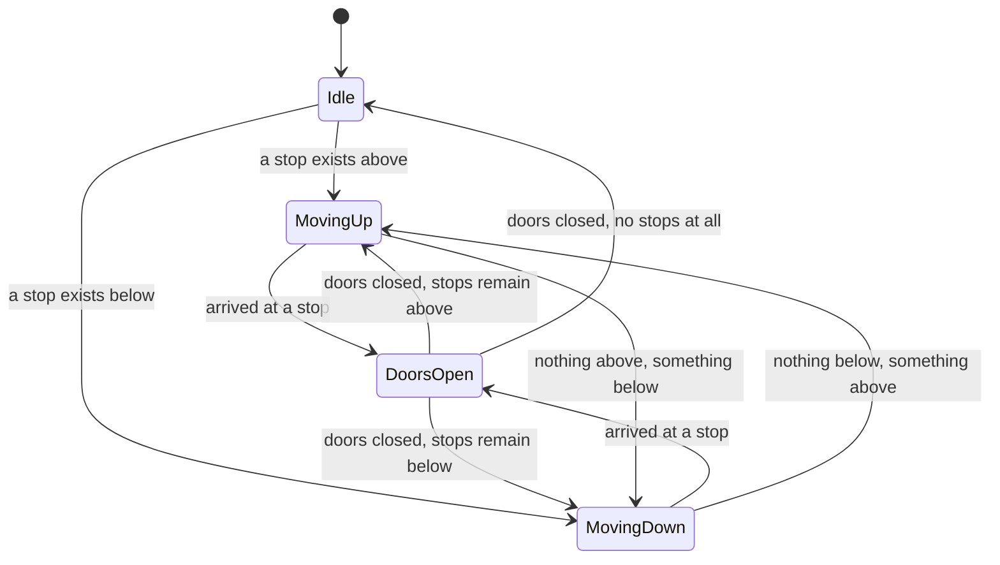
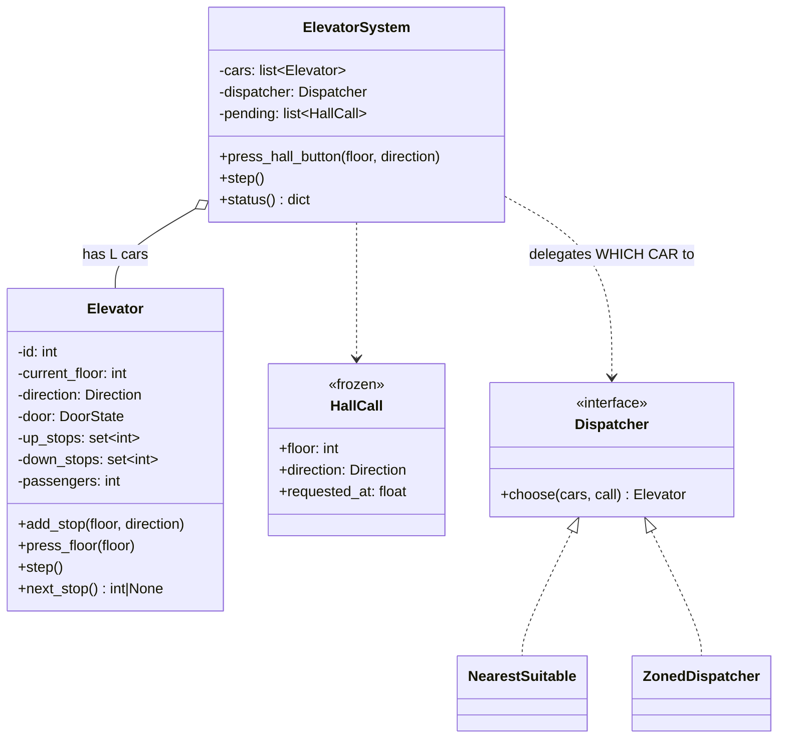

# Day 079 · System design — Design an elevator system

**After today you can:** You can model requests, scheduling and direction without hand-waving the algorithm.

**The interviewer asks it as:** *Design an elevator system for a ten-storey building with three lifts.*

---

## 1. What this is, and why they ask it

You are given a building, some number of floors, and some number of lift cars. People press buttons
in two different places — outside the lift, where they say which *direction* they want, and inside
it, where they say which *floor* they want — and your design has to decide which car goes where, and
in what order.

The bookkeeping is easy. `Elevator`, `Floor`, `Button`, `Request` fall out in three minutes. The
question is entirely the **scheduling**, and it has two halves that candidates routinely merge into
one: *which car answers this hall call*, and, separately, *in what order does one car serve the stops
it has accepted*. Getting those apart is most of the interview.

They ask it because there is a real algorithm underneath, it has a name, and the obvious answers are
demonstrably bad. Serving requests in the order they arrive makes a car cross the building
repeatedly. Always going to the nearest request starves the top floor. The correct answer — keep going
in one direction while anything ahead of you wants that direction, then turn — is called the
**elevator algorithm**, and disk schedulers use the same one under the name **SCAN**. Expect this
prompt at Amazon, Uber, Flipkart and anywhere that runs a low-level design round.

---

## 2. The story

Shanta does the week's shopping on Thursday morning, in the lane that runs from the bus stop at one
end to the temple at the other. It is about three hundred metres, and there are shops down both
sides.

She has eight things to get. Her husband, when he does it, buys them in the order they are listed on
his phone — flour, then coriander, then the thing from the shop near the temple, then something back
near the bus stop again. He walks that lane four times and comes home after an hour and a half
complaining about his knees.

Shanta walks up one side and down the other.

Going up, she buys everything that is on that side, in the order the shops come. She does not care
what order the list is in. If the flour is nearer the temple than the dal, she gets the dal first,
because she is passing it anyway. At the temple end she crosses over, and comes back down the other
side, picking up everything on that side. One pass each way, about twenty-five minutes, and she is at
the bus stop again with everything.

The part she is strict about is what happens when her daughter rings.

Her daughter rings most Thursdays and adds one thing. If it is at a shop further up, that is easy —
Shanta is going that way anyway, and it costs her nothing. If it is at a shop she has already passed
on this side, she does **not** turn round. She notes it, and she gets it on the way down, or next
week. Turning round for it would mean walking the stretch three times instead of once, and the whole
point is that she walks each stretch once.

She learned that from the year her daughter used to ring four or five times in a morning. Shanta kept
turning back for each one, and one Thursday she got to half past twelve having covered the same
hundred metres six times and still not reached the temple end at all.

Now she is quite firm about it. She keeps going until there is nothing left ahead of her on this
side. Then, and only then, she turns.

---

## 3. The idea in plain English

Shanta's lane is the lift shaft. Her two passes are the two directions. And her rule — *keep going
while there is anything ahead of you that wants this direction, then turn* — is the **elevator
algorithm**, also called **LOOK**, and it is the answer to this whole question.

### Two kinds of request, and why the difference matters

This is the distinction that separates a good answer from a vague one.

- **A hall call** is pressed *outside* the lift, on a floor. It carries a floor **and a direction** —
  "I am on 4 and I want to go up". It carries no destination, because the person has not said where
  they are going yet. Any car may serve it, so **the system** must choose one.
- **A car request** is pressed *inside* the lift. It carries a floor and no direction, and it belongs
  to **that car only**. Nobody else can serve it.

So there are two scheduling decisions, not one:

1. **Dispatch** — which car answers a hall call. A system-level decision.
2. **Stop ordering** — given the stops a car has accepted, in what order does it visit them. A
   per-car decision.

Merging these is the most common mistake in this question. Say them separately, in that order.

### The three stop-ordering algorithms, and why two of them are wrong

Take a car on floor 1 with stops pending at floors 2, 9, 3, 8 and 4, in that order of arrival.

**First come, first served.** Serve them in arrival order: 1→2→9→3→8→4.

```
 travel: 1 + 7 + 6 + 5 + 4  =  23 floors
```

Correct, fair, and terrible. The car crosses the building four times. Nobody builds this.

**Shortest seek first.** Always go to the nearest pending stop: 1→2→3→4→8→9.

```
 travel: 1 + 1 + 1 + 4 + 1  =  8 floors
```

Efficient — and it **starves**. If people keep pressing buttons near the car, the request on floor 9
is never the nearest one and waits for ever. In a building this shows up as "the tenth floor
complains about the lifts", and it is a genuine, historical complaint.

**LOOK, the elevator algorithm.** Keep going in the current direction while anything ahead of you
wants a stop; when nothing is ahead, reverse.

```
 going up from 1:  2, 3, 4, 8, 9   =  8 floors
 then reverse and serve anything below
```

Same travel as nearest-first on this input, and **no starvation**, because a request above you is
guaranteed to be served before the car turns around. Shanta noting the coriander and getting it on
the way down.

The name for the strict version that runs to the very top before turning is **SCAN**. The version
that turns as soon as nothing is ahead — which is what real lifts do — is **LOOK**. Knowing both
names, and that disk head schedulers use the same algorithm, is worth ten seconds.

### The state a single car holds

```
 current_floor      : int
 direction          : UP | DOWN | IDLE
 door               : OPEN | CLOSED
 up_stops           : sorted set of floors to serve while going up
 down_stops         : sorted set of floors to serve while going down
```

Two sets rather than one is the trick that makes LOOK simple. A stop at floor 7 means two different
things depending on whether the person there wants to go up or down, and keeping them apart means the
"what is next" question is a `min` or a `max`:

```python
    if direction is UP:
        above = [f for f in up_stops if f > current_floor]
        next_stop = min(above) if above else ...        # nothing above: turn
```

### Dispatch: which car answers a hall call

The simple, defensible rule, and the one to give first:

> **Prefer a car that is already moving toward the call and in the same direction. Otherwise prefer an
> idle car. Break ties by distance.**

A car on floor 2 going up is a *better* answer to "floor 5, going up" than an idle car on floor 6,
even though the idle car is closer — because the moving car passes floor 5 anyway and the idle car
would have to come down and then go back up.

Scoring it makes this concrete:

```python
 same direction and ahead of the call:   |car_floor - call_floor|
 idle:                                   |car_floor - call_floor| + 5      penalty
 wrong direction or behind:              |car_floor - call_floor| + 20     penalty
```

The penalties are made up, and you should say so: they are a tuning knob, and the honest sentence is
"I would tune those against measured waiting times, not guess them once."

### The interesting part, and where the interface goes

Dispatch is the decision that will change. Real buildings change it constantly — up-peak mode in the
morning, a zoned scheme where cars 1 and 2 serve floors 1–5 and car 3 serves 6–10, destination
dispatch in modern towers where you enter your floor in the lobby. So:

```python
class Dispatcher(Protocol):
    def choose(self, cars: list[Elevator], call: HallCall) -> Elevator: ...
```

And, as always, **two implementations**: `NearestSuitable` as above, and `ZonedDispatcher` where each
car owns a band of floors. One implementation is a class; two is a demonstration that the design
survives a changed requirement.

Stop *ordering*, by contrast, gets no interface. LOOK is not going to be replaced — every lift in the
world uses it — and an interface there would be a hierarchy built for a future that will not arrive.
Saying why one decision gets an interface and the other does not is exactly the judgement being
tested.

---

## 4. The picture

One car, running LOOK. Floors on the left, the car's stop sets on the right.

```
  floor
   10  |                                 up_stops   = {4, 9}
    9  |  <- stop (someone on 9 wants DOWN)          down_stops = {9, 2}
    8  |
    7  |
    6  |
    5  |
    4  |  <- stop (someone on 4 wants UP)
    3  |
    2  |  <- stop (someone on 2 wants DOWN)
    1  |  [CAR]  direction = UP
       +-----

  going UP from 1:
    up_stops above me: {4}          -> go to 4, open, close
    up_stops above me: {9}          -> go to 9, open, close
    nothing above wants UP          -> TURN
  going DOWN from 9:
    down_stops below me: {2}        -> go to 2, open, close
    nothing below                   -> IDLE

  travel: 1->4->9->2 = 3 + 5 + 7 = 15 floors, every stop served, nobody starved
```

What to notice: floor 9 appears in **both** sets, because somebody there pressed "down". The car
serves it as an up-stop when it arrives going up (people who wanted to go up get in) and again — or
instead — as a down-stop. Keeping the two sets separate is what makes that expressible at all.

The car as a state machine:



What to notice: **there is no transition from `MovingUp` straight to `MovingUp` at a different
floor** — every arrival goes through `DoorsOpen`, and every direction change goes through a state
where the doors are shut. That is not decoration; it is the safety property, and drawing it that way
is how you show you thought about it.

The classes:



---

## 5. How it actually works

### Move 1 · Clarify (minutes 0–5)

> **"How many floors and how many cars?"** — Ten floors, three cars.
> **"Do the outside buttons have separate up and down, or one call button?"** — Separate. This is the
> question that most changes the design, because a single button loses the direction and forces the
> car to guess.
> **"Is there a capacity limit, and should a full car skip a hall call?"** — Thirteen people, and yes.
> **"Am I designing the control logic, or also the motor and door hardware?"** — Control logic; assume
> `move_one_floor()` and `open_doors()` exist.

> "I will assume one car per shaft, no express floors, and that people board in the direction the car
> is going. I am not designing fire-service mode or the maintenance interface, though I will say
> where they would attach."

### Move 2 · The nouns (minutes 5–10)

- **`Direction`** — `UP`, `DOWN`, `IDLE`. An enum, because a boolean cannot express idle.
- **`HallCall`** — a floor plus a direction plus the time it was pressed. Frozen; it is a record of an
  event.
- **`Elevator`** — one car: where it is, which way it is going, the doors, and its two stop sets.
- **`ElevatorSystem`** — holds the cars, receives hall calls, and delegates the choice.
- **`Dispatcher`** *(interface)* — chooses a car for a hall call.

Five, one of them an interface. Note what is **not** here: no `Button` class, because a button is an
input event and modelling it as an object buys nothing; no `Person`, because passengers only exist as
a count for the capacity rule; no `Floor`, because a floor is an integer and giving it a class is
ceremony. Saying why you left things out is as valuable as what you put in.

### Move 3 · The car, which is where the algorithm lives

```python
class Direction(Enum):
    UP = 1
    DOWN = -1
    IDLE = 0


class Elevator:
    def __init__(self, id: int, floor: int = 1, capacity: int = 13) -> None:
        self.id = id
        self.current_floor = floor
        self.direction = Direction.IDLE
        self.doors_open = False
        self.passengers = 0
        self.capacity = capacity
        self.up_stops: set[int] = set()        # serve these while going UP
        self.down_stops: set[int] = set()      # serve these while going DOWN
```

Two sets, and the reason is worth saying while you type it: a stop at floor 7 means something
different depending on which way the person there wants to travel, and one set cannot hold that.

```python
    def add_stop(self, floor: int, direction: Direction) -> None:
        """A hall call assigned to this car."""
        if direction is Direction.UP:
            self.up_stops.add(floor)
        else:
            self.down_stops.add(floor)

    def press_floor(self, floor: int) -> None:
        """A car request from inside. Which set it goes in depends on where we are."""
        if floor > self.current_floor:
            self.up_stops.add(floor)
        elif floor < self.current_floor:
            self.down_stops.add(floor)
```

The asymmetry there is real and worth pointing at: a hall call *tells you* its direction, and a car
request does not, so you infer it from where the car is now.

```python
    def next_stop(self) -> int | None:
        """LOOK: keep going while anything ahead wants this direction, then turn."""
        if self.direction is Direction.UP:
            above = [f for f in self.up_stops if f > self.current_floor]
            if above:
                return min(above)
            below = self.down_stops | {f for f in self.up_stops if f < self.current_floor}
            return max(below) if below else None        # turn: highest thing below
        ...
```

Four lines that are the entire algorithm. Read them out loud as Shanta: *is there anything ahead of
me on this side? Then go to the nearest one. Nothing ahead? Then turn, and go to the furthest thing
on the other side.*

### Move 4 · Dispatch, the interface

```python
class Dispatcher(Protocol):
    def choose(self, cars: list[Elevator], call: HallCall) -> Elevator | None: ...


class NearestSuitable:
    """Prefer a car already coming this way; then an idle car; then anything.

    The penalties are a tuning knob, not a law — I would fit them to measured
    waiting times rather than guess once.
    """

    SAME_DIRECTION = 0
    IDLE_PENALTY = 5
    WRONG_WAY_PENALTY = 20

    def choose(self, cars, call):
        available = [c for c in cars if c.passengers < c.capacity]
        if not available:
            return None                                 # every car is full: queue it
        return min(available, key=lambda car: self._score(car, call))

    def _score(self, car: Elevator, call: HallCall) -> int:
        distance = abs(car.current_floor - call.floor)
        if car.direction is Direction.IDLE:
            return distance + self.IDLE_PENALTY
        approaching = (
            car.direction is call.direction
            and (call.floor - car.current_floor) * car.direction.value > 0
        )
        return distance if approaching else distance + self.WRONG_WAY_PENALTY
```

The `approaching` expression is the one to explain rather than let them read: *the car is going the
same way the caller wants, and the caller is ahead of it in that direction.* Multiplying by
`direction.value` — which is +1 or −1 — makes "ahead" one comparison for both directions.

```python
class ZonedDispatcher:
    """Each car owns a band of floors. Used in tall buildings and at peak."""

    def __init__(self, zones: dict[int, range]) -> None:
        self._zones = zones                             # car id -> floors it serves

    def choose(self, cars, call):
        candidates = [c for c in cars
                      if call.floor in self._zones[c.id] and c.passengers < c.capacity]
        if not candidates:
            candidates = [c for c in cars if c.passengers < c.capacity]   # fall back
        return min(candidates, key=lambda c: abs(c.current_floor - call.floor), default=None)
```

Two implementations. Zoning reduces the average number of stops per trip, which is why real towers
use it above about fifteen floors — and the fallback line matters, because a design that returns
nothing when a zone's car is full is worse than one that leaks across zones.

### Move 5 · The system, which holds no algorithm

```python
class ElevatorSystem:
    def __init__(self, cars: list[Elevator], dispatcher: Dispatcher) -> None:
        self._cars = cars
        self._dispatcher = dispatcher
        self._unassigned: list[HallCall] = []
        self._assigned: dict[tuple[int, Direction], int] = {}   # call -> car id

    def press_hall_button(self, floor: int, direction: Direction, now: float) -> None:
        key = (floor, direction)
        if key in self._assigned:
            return                                      # already answered; ignore
        call = HallCall(floor, direction, now)
        car = self._dispatcher.choose(self._cars, call)
        if car is None:
            self._unassigned.append(call)               # all full: retry next tick
            return
        car.add_stop(floor, direction)
        self._assigned[key] = car.id
```

The `if key in self._assigned: return` is the idempotence rule, and it is a real requirement: five
people on floor 4 pressing "up" is one call, not five. Without it, five cars are dispatched to one
floor — which is a bug real systems have shipped.

### Real systems

- **Otis, Kone, Schindler and Mitsubishi** all run variants of LOOK with a dispatch layer on top.
  Kone's marketing name for their dispatcher is *destination control*; Otis's is *Compass*.
- **Destination dispatch** is the modern change: you enter your destination floor on a lobby keypad
  *before* boarding, and the system tells you which car to take. That turns a hall call into a full
  origin-and-destination request, so cars can be grouped by destination and the number of stops per
  trip drops sharply — typically a 25–30 percent reduction in journey time in tall buildings.
- **Disk schedulers** use the same algorithm and the same names: Linux's `elevator=` boot parameter
  chose between `noop`, `deadline` and `cfq`, and the SCAN/C-SCAN family is textbook for spinning
  disks. Mentioning that the algorithm is shared between lifts and disks is a genuinely good
  five-second aside.
- **Fire-service mode** is a legal requirement, not a feature: on alarm, all cars cancel every stop,
  return to the ground floor, open, and stay there. Worth naming as a state that pre-empts everything,
  because it shows you know the domain has rules that are not about efficiency.

---

## 6. The numbers

### The basic physics

```
 floor-to-floor travel        2 s
 stop overhead (decelerate,
 doors open, dwell, close)    8 s
 capacity                     13 people (1,000 kg)
 building                     10 floors, 3 cars, ~600 occupants
```

### Why LOOK, in seconds rather than in principle

The five pending stops from §3, from floor 1:

```
 first come, first served:  23 floors × 2 s              =  46 s of travel
 LOOK:                       8 floors × 2 s              =  16 s of travel
 -------------------------------------------------------------------------
 saving                                                     30 s per sweep, ~2.9x
```

Add the stop overhead — five stops at 8 s each is 40 s under both — and the round becomes 86 s versus
56 s. **A 35 percent reduction in journey time from choosing the order of stops**, with no extra
hardware. That is the number that justifies the algorithm.

### Can three cars handle the morning?

```
 up-peak: 400 people arrive at the lobby over 30 minutes
 arrival rate: 400 / 1,800 s  =  0.22 people per second

 one round trip, up-peak:
   10 floors up          10 × 2 s  = 20 s
   6 stops               6  × 8 s  = 48 s
   express return down   10 × 2 s  = 20 s
   ------------------------------------
   round trip                        88 s, carrying about 8 people

 system capacity: 3 cars × 8 people / 88 s = 0.27 people per second
                  = 982 people per hour
 demand:          800 people per hour
```

**Capacity 982 against demand 800 — it fits, with about 20 percent headroom.** That is the arithmetic
the question is really asking for, and it is the moment to say what you would do if it did not fit:
zoning, or destination dispatch, or a fourth car, in that order of cost.

### Waiting time, which is what people actually complain about

```
 average wait ≈ round trip time / (2 × number of cars)
              = 88 / 6  ≈  15 s   at peak
 off-peak, one car idle nearby:  ≈ 6 s
```

Under 20 seconds is generally considered good in a ten-storey building; over 40 seconds generates
complaints. Quoting a target rather than a formula is what makes this sound like engineering.

### Memory and events

```
 3 Elevator objects × ~250 B                    =  750 B
 pending hall calls: at most 10 floors × 2 dirs =  20 calls × ~100 B = 2 KB
 --------------------------------------------------------------------------
 total state                                    ≈  3 KB
```

Three kilobytes. **The entire system state fits in a processor cache line budget**, which is worth
saying because it kills every question about databases and scaling — there is nothing to scale. The
constraint here is physics, not computing.

```
 events: ~800 hall calls per hour at peak = 0.22 per second
```

Under one event every four seconds. A single control loop ticking every 100 ms is enormously more than
enough, and proposing anything concurrent would be a mistake.

---

## 7. The trade-offs

### What this design gives up

**LOOK is not optimal, and cannot be.** The optimal schedule needs to know future requests, and you do
not have them. LOOK is a *greedy* rule that is provably starvation-free and close to optimal in
practice, which is the honest claim. Do not say "optimal"; say "no starvation, and within a few
percent of the best possible schedule for realistic traffic".

**Dispatch decisions are final here, and real systems re-evaluate.** If car 1 is assigned a call on
floor 5 and then car 2 finishes early on floor 4, car 2 is now the better answer. Reassignment
improves waiting times and introduces a new failure: a call that gets passed between cars repeatedly
and is never served. Real controllers reassign but pin the decision once a car is within one or two
floors. I would build the simple version first and name this as the next improvement.

**Direction is inferred for car requests.** `press_floor` decides up or down from the car's current
position, which is wrong in one case: someone presses floor 3 while the car is at 3 with the doors
open. Guard it, or the stop is silently dropped.

**Capacity is a count, not a weight.** Real lifts weigh the car, and thirteen people is a legal
proxy. A full car should decline hall calls but must still serve its own car requests, and the
distinction matters: skipping your own passengers' floors is much worse than skipping a hall call.

**No express zones or up-peak mode.** In the morning, most traffic is lobby-to-everywhere, and a
system that parks idle cars at their current floor wastes them. Real systems park idle cars at the
lobby during up-peak. That is a policy and it belongs in the dispatcher, which is exactly why the
dispatcher is an interface.

**Nothing here handles failure.** A stuck car, a door that will not close, a floor sensor that lies. A
real controller has a watchdog per car and takes a non-responding car out of dispatch. Naming that is
better than designing it.

### "I would change this design if..."

- **...the building is over about fifteen floors.** Then zoning, or an express bank serving 1 and
  20–40 only. The dispatcher changes; nothing else does.
- **...traffic is heavily up-peak.** Then park idle cars at the lobby and consider destination
  dispatch, which typically cuts journey time by a quarter to a third.
- **...waiting times are measured and are over 40 seconds.** Then reassignment of pending calls, and
  only then a fourth car — hardware is the expensive answer.
- **...there is one call button per floor rather than up and down.** Then the direction is unknown at
  dispatch time, the car has to guess, and average waits get materially worse. I would push back on
  that requirement rather than design around it.

### The honest concession

The dispatcher is behind an interface and the stop ordering is not, and that asymmetry is a
deliberate judgement rather than an oversight. I can name two dispatch policies that real buildings
genuinely use — nearest-suitable and zoned — so the interface earns itself. I cannot name a second
stop-ordering algorithm anybody would ship, because LOOK is what every lift in the world does. An
interface there would be a hierarchy built for a future that will not arrive.

---

## 8. In the interview

### How it gets asked

- The standard: *"Design an elevator system for a ten-storey building with three lifts."*
- The narrowed version, which is better for you: *"How do you decide which lift answers a call?"* —
  the interesting part has been named; go straight there.
- The algorithm probe: *"What is wrong with always sending the nearest lift?"* — they want the word
  *starvation*.
- The capacity question: *"Four hundred people arrive between 9:00 and 9:30. Is three lifts enough?"*
- The curve ball: *"Now the building is forty floors"*, or *"now there is a fire alarm"*.

### The timed script

**Minutes 0–5 · Clarify.** Floors and cars. Separate up and down buttons outside? Capacity, and does
a full car skip calls? Control logic only? State the assumptions and the exclusions.

**Minutes 5–10 · Estimation.** Round-trip time, system capacity in people per hour, demand at peak,
average wait. This is unusual for a low-level design round and it is exactly what makes this prompt
different — say the 982-against-800 number early, because it justifies every later decision.

**Minutes 10–15 · The two decisions, separated.** "There are two scheduling problems here and I want
to keep them apart: which car answers a hall call, and in what order one car serves the stops it has.
Different scopes, different answers."

**Minutes 15–25 · The car and LOOK.** The two stop sets, the state machine, `next_stop` in four lines.
Compare FCFS, nearest-first and LOOK with the floor counts and name starvation.

**Minutes 25–35 · Dispatch behind an interface**, with two implementations and the scoring function
explained rather than read.

**Minutes 35–40 · Failure modes and extension.** Idempotent hall calls. A full car. Reassignment as
the next improvement, with its risk. Fire mode as a state that pre-empts everything. Then the
forty-floor answer: zoning.

### The follow-ups

**"What is wrong with always sending the nearest lift?"**
"It starves. Nearest-first is greedy on distance, so if people keep pressing buttons near a car, a
request at the far end is never the nearest one and waits indefinitely — in a real building that is
the top floor complaining about the lifts, and it is a historical complaint, not a hypothetical one.
LOOK fixes it structurally rather than with a timeout: because the car serves everything ahead of it
before turning, a request above the car is guaranteed to be served on this sweep."

**"How do you decide which lift answers a hall call?"**
"A score, and the ordering matters more than the numbers. Best is a car already moving in the caller's
direction with the caller ahead of it, because it passes that floor anyway and the marginal cost is
one stop. Next is an idle car, scored by distance plus a penalty. Worst is a car going the wrong way,
which has to finish its sweep first. I would keep those penalties as constants and say plainly that
they are a tuning knob to fit against measured waiting times, not physics."

**"Four hundred people arrive in half an hour. Is three lifts enough?"**
"Let me work it out. That is 800 people an hour. A round trip in up-peak is ten floors up at two
seconds a floor, six stops at eight seconds each, and an express return — 88 seconds, carrying about
eight people. Three cars gives about 982 people an hour against 800 demanded, so it fits with roughly
twenty percent headroom, and average wait is round-trip over twice the number of cars, about fifteen
seconds. If it had not fitted, the order of fixes by cost is: park idle cars at the lobby during
up-peak, then zone the cars, then destination dispatch, then a fourth car."

**"Five people on floor 4 press 'up'. What happens?"**
"One call. The system keys pending hall calls by floor and direction and ignores a repeat, so five
presses dispatch one car. Without that, five cars converge on floor 4 — which is a bug real systems
have shipped. The button light being on *is* the state, and it clears when a car arrives at that floor
going that way."

**"Now the building is forty floors."**
"The car logic does not change at all — LOOK is LOOK. The dispatcher does. At forty floors a single
pool means every car serves every floor and the average trip has too many stops, so I would zone:
cars 1–2 serve 1–20, cars 3–4 serve 1 and 21–40 as an express bank. That is a different `Dispatcher`
implementation and nothing else in the design moves, which is why that decision is behind an
interface. Above that scale, destination dispatch, where people enter their floor in the lobby, cuts
journey time by roughly a quarter to a third by grouping passengers with the same destination."

**"What about a fire alarm?"**
"Fire-service mode, and it is a legal requirement rather than a feature. On alarm, every car cancels
every pending stop, ignores all buttons, travels to the designated floor — usually the ground — opens
its doors and stays there until a keyed switch releases it. In the design it is a state that pre-empts
everything else, so I would model it as a mode flag checked at the top of the control loop rather than
as another entry in the stop sets, because it must not be schedulable."

### A model answer

Asked: *design an elevator system for a ten-storey building with three lifts.*

> "A few clarifying questions first, because two of the answers change the design. Are the buttons
> outside separate up and down, or one call button? Separate — good, because a single button loses the
> direction and forces the car to guess. Is there a capacity limit and should a full car skip hall
> calls? Thirteen and yes. And am I designing control logic or hardware? Control logic. I will assume
> one car per shaft and no express floors, and I will note where fire mode attaches rather than design
> it.
>
> Let me do the arithmetic before the classes, because it decides how hard this has to be. Two seconds
> a floor, about eight seconds for a stop with the doors. In the morning peak, four hundred people
> arrive over half an hour, so 800 an hour. A round trip is ten floors up, six stops, an express
> return — about 88 seconds carrying eight people. Three cars is roughly 982 people an hour against
> 800 demanded, so it fits with about twenty percent headroom, and the average wait is round trip over
> twice the car count, about fifteen seconds. Also worth saying: the entire system state is a few
> kilobytes. There is nothing to scale here; the constraint is physics.
>
> Now the design, and the first thing I want to do is separate two scheduling problems that get
> merged. There is *which car answers a hall call*, which is a system-level decision, and there is *in
> what order does one car serve the stops it has accepted*, which is per-car. Different scopes,
> different answers.
>
> Start with the car. It holds its floor, its direction, its door state, and — this is the part that
> matters — **two** sets of stops rather than one: floors to serve while going up, and floors to serve
> while going down. A stop at floor seven means something different depending on which way the person
> there wants to travel, and one set cannot express that.
>
> The ordering algorithm is LOOK, the elevator algorithm: keep going in the current direction while
> anything ahead of you wants that direction, and only when there is nothing ahead do you turn. Let me
> justify it against the two obvious alternatives with a concrete case — a car on floor one with stops
> at 2, 9, 3, 8 and 4. First-come-first-served travels 23 floors and crosses the building four times.
> Nearest-first travels 8 floors and **starves**: if people keep pressing buttons near the car, floor
> nine waits for ever, which in a real building is the top floor complaining about the lifts. LOOK
> also travels 8 floors and cannot starve, because everything ahead is served before the car turns.
> In seconds that is 46 against 16 of travel time, so about a 35 percent shorter journey with no extra
> hardware.
>
> Then dispatch, and this is where I would put an interface, because it is the decision that actually
> changes between buildings. The default rule: prefer a car already travelling the caller's direction
> with the caller ahead of it, because that car passes the floor anyway; then an idle car, scored by
> distance plus a penalty; then a car going the wrong way, with a bigger penalty. I would say plainly
> that those penalties are a tuning knob to fit against measured waiting times, not physics. And I
> would write a second implementation — a zoned dispatcher where each car owns a band of floors —
> because one implementation is a class and two is a demonstration that the design survives a change.
>
> I would deliberately *not* put an interface around the stop ordering. I cannot name a second
> algorithm anyone would ship; every lift in the world uses LOOK. An interface there would be a
> hierarchy for a future that will not arrive.
>
> Two details I would raise before you ask. First, hall calls must be idempotent: five people on floor
> four pressing 'up' is one call, so I key pending calls by floor and direction and ignore repeats —
> otherwise five cars converge on one floor, and that bug has shipped in real systems. Second, a full
> car should decline hall calls but must still serve its own passengers' floor requests, because
> skipping your own passengers is far worse than skipping a waiting person.
>
> And what I would do next, in order: reassign pending calls when a nearer car frees up — which
> improves waiting times and introduces a call that can be passed around for ever, so I would pin the
> decision once a car is within a floor or two — then park idle cars at the lobby during up-peak, then
> zone the cars if the building grows. Fire mode sits outside all of it: a mode flag checked at the
> top of the control loop that cancels every stop and sends every car to the ground floor, because it
> must not be schedulable."

---

## 9. Recall card

- **Separate the two scheduling problems before designing anything: *which car answers a hall call*
  (system-level, dispatch) and *in what order does one car serve its stops* (per-car, ordering).**
  Merging them is the standard mistake. A **hall call** carries a floor **and a direction** and any car
  may take it; a **car request** carries only a floor and belongs to that car alone.
- **The per-car answer is LOOK, the elevator algorithm: keep going while anything ahead wants this
  direction, then turn.** Against stops at 2, 9, 3, 8, 4 from floor 1: **FCFS 23 floors · nearest-first
  8 but it STARVES · LOOK 8 and cannot starve.** In seconds, 46 vs 16 of travel — about **35 percent
  shorter journeys**. The strict-to-the-end variant is **SCAN**; disk schedulers use the same
  algorithm.
- **Keep TWO stop sets per car, `up_stops` and `down_stops`,** because floor 7 means different things
  to someone going up and someone going down. Then `next_stop` is `min(above)` while going up, and the
  turn is `max(below)`. Every arrival goes through a **doors-open** state and every direction change
  through closed doors — that is the safety property, drawn.
- **The estimate is the part that makes this prompt different — do it before the classes.** 2 s/floor,
  8 s/stop, 13 capacity → round trip **88 s** carrying 8 → 3 cars ≈ **982 people/hour against 800
  demanded**, average wait **≈ 15 s**. Total system state ≈ **3 KB**: *there is nothing to scale here;
  the constraint is physics.*
- **The interface goes on `Dispatcher` and NOT on the stop ordering** — two real dispatch policies
  exist (nearest-suitable, zoned) and no second ordering algorithm does. **Hall calls must be
  idempotent** (five presses on floor 4 = one call, or five cars converge). A **full car declines hall
  calls but still serves its own passengers.** Next improvements in cost order: reassignment · lobby
  parking at up-peak · zoning · **destination dispatch** (25–30% faster) · a fourth car. **Fire mode
  pre-empts everything and must not be schedulable.**
