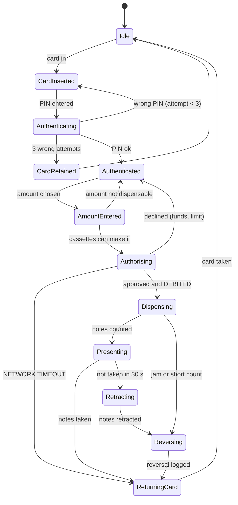
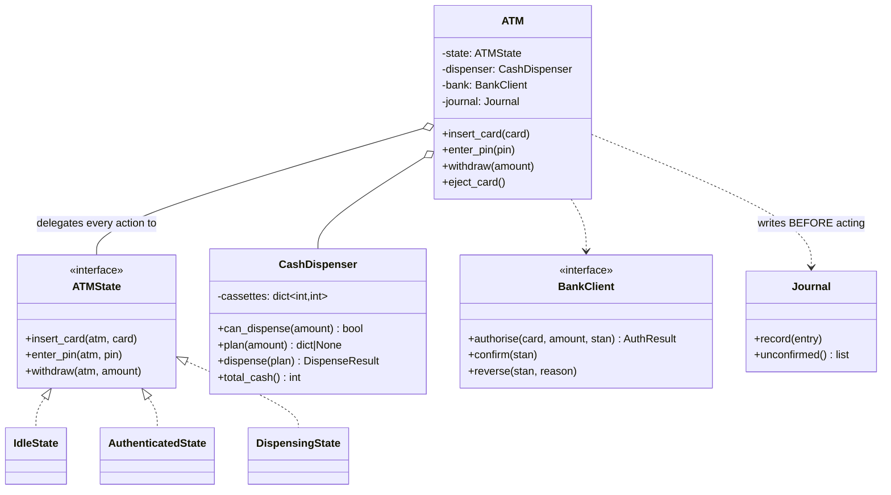

# Day 080 · System design — Design an ATM

**After today you can:** You can model the state machine, the cash dispenser, and the failure cases.

**The interviewer asks it as:** *Design an ATM. What happens if the network dies mid-withdrawal?*

---

## 1. What this is, and why they ask it

An ATM is a box with a card reader, a keypad, a screen, four cash cassettes and a network connection.
The design has three parts: a **state machine** for what the machine is doing, a **dispenser** that
turns an amount into a set of notes, and a **protocol** for the moment when the money leaves the
machine and the account is debited — which are two separate events that can fail between.

The first two are ordinary work. The third is the question. *"The network dies after the bank has
debited the account and before the notes come out"* has a right answer, and it is not "use a
transaction". You cannot roll back cash that has already been counted into somebody's hand, and you
cannot hold a database transaction open across a physical motor.

They ask it because it is the cleanest real example of a distributed failure that a beginner can hold
in their head. Everyone understands the stakes. And it separates candidates instantly: one group says
"wrap it in a transaction", and the other says "decide which side takes the risk, log every step
locally, and reconcile". Expect it at Amazon, at every fintech, and in any round that wants to see
whether you think about failure before you are asked to.

---

## 2. The story

The milk booth by the park opens at six and Anand has been going for years.

It works in two halves. You pay at the first window, where the man gives you a small brass token with
a number stamped on it. You carry the token four steps to the second window, hand it over, and the
other man fills your can from the tank.

Two windows, because one man cannot both take money and pour milk without a queue forming halfway
down the road.

One Tuesday in November the tank ran dry at ten past seven, with four people still holding tokens.

Anand was the third of the four. And what he remembers is that nothing dramatic happened. The man at
the second window did not shrug, and he did not go and argue with the first window. He asked for the
four tokens back, said the numbers out loud to himself as he took them, and put them in a separate
tin on the shelf rather than back in the drawer with the used ones.

Then he told the four of them to come back at eleven.

At eleven the two men do the accounts, which they do every day whatever happens. The money in the box
at the first window has to match the milk gone from the tank. On a normal day it does. That Tuesday
it did not, and the difference was exactly four tokens' worth — which is why the four tokens went in
their own tin instead of into the drawer. The men counted the tin, matched the numbers, and paid the
four of them back from the box.

Anand asked once why they do not simply take the money at the second window, when the milk is actually
in the can. The man said two things. First, that the queue would be twice as slow, because counting
change while pouring is how you spill. And second — and he was quite certain about this — that people
who have already paid come back, and people who have not paid do not. If the milk goes out first and
something goes wrong, he is chasing somebody down the road. This way the money is already in the box
and the worst case is that he owes it, which he can settle at eleven.

---

## 3. The idea in plain English

The two windows are the two halves of a withdrawal: **the account is debited** and **the notes are
dispensed**. They are separate acts, and something can happen in between. The milk booth's answer —
take the money first, keep a record of what was owed, and settle it at the daily count — is very
close to what real ATMs do.

### The three parts of the design

**One: the state machine.** An ATM is doing exactly one thing at a time and the legal moves are
strictly limited. You cannot dispense before authenticating. You cannot accept a new card while the
previous one is still in the slot. This is the State pattern from
[day 073](../day-073-queues/README.md), and it is the right shape here because each state genuinely
carries different behaviour.

**Two: the dispenser.** Given ₹3,700, decide which notes to hand out from the cassettes you actually
have. This looks like a triviality and is not, because the cassettes run out unevenly.

**Three: the failure protocol.** The part the question is really about.

### The state machine

```
 IDLE  ->  CARD_INSERTED  ->  AUTHENTICATED  ->  AMOUNT_ENTERED
       ->  AUTHORISING (talking to the bank)  ->  DISPENSING  ->  RETURNING_CARD  ->  IDLE
```

Two properties are worth stating out loud.

**Every path returns the card.** Failure at any state must lead back to a state that ejects the card
before going idle, or the machine eats cards — which is the single most common real ATM complaint.

**`DISPENSING` cannot be interrupted.** Once the motor starts counting notes, there is no
cancellation. That is a physical fact and the design has to respect it: the last cancellable moment
is *before* the dispense begins, and the interface should stop offering cancel after that.

### The dispenser, and why greedy is not obviously right

Denominations in India are ₹100, ₹200, ₹500 and ₹2000. The obvious algorithm is greedy: take as many
of the largest note as you can, then the next, and so on.

For a *canonical* currency system — and every real one is — greedy gives the fewest notes when supply
is unlimited. But **supply is not unlimited**, and that is what breaks it:

```
 amount wanted: ₹600
 cassettes:     ₹500 × 1 remaining,  ₹200 × 3 remaining

 greedy:  take the ₹500. Now ₹100 remains and there are no ₹100 notes.
          FAIL — and it fails after having already committed a note.
 correct: ₹200 × 3.
```

So the real algorithm is a small **bounded** problem: minimise notes subject to the count available in
each cassette. With four denominations and a limit of, say, forty notes, a plain search over the
counts is tiny — a few hundred combinations — and you can also do it as dynamic programming over the
amount in ₹100 units, which is 400 cells for ₹40,000.

The practical answer to give: **try greedy first because it is right almost always and costs
nothing; fall back to the bounded search when greedy cannot complete.** Then say the number: greedy
fails only when a cassette is nearly empty, which is a few percent of transactions late in a
replenishment cycle.

And one more rule that is not an algorithm: **decide the notes before you dispense any of them.** If
you dispense as you go and discover at note four that you cannot finish, you have handed out ₹1,500 of
a ₹1,700 withdrawal and there is no way to take it back.

### The failure protocol, which is the question

Three things happen, in order, and any of them can fail:

```
 1. the bank authorises and DEBITS the account
 2. the ATM DISPENSES the notes
 3. the ATM CONFIRMS to the bank that the cash was actually handed over
```

Why debit first? The same reason as the milk booth: **if the money leaves the machine and the debit
has not happened, the bank is chasing a person. If the debit has happened and the money did not leave,
the bank owes a person.** The second failure is recoverable by an internal process; the first is not.
So the design deliberately puts the risk on the side the bank can fix.

Now the failure cases, and each has a different answer:

| Failure | What happened | What must happen |
|---|---|---|
| Network dies **before** the debit | Nothing. No debit, no cash. | Show an error, return the card. |
| Network dies **after** the debit, before dispensing | Money is gone from the account; no cash. | ATM logs a *failed* transaction locally; the bank **auto-reverses** when no confirmation arrives. |
| Notes jam **during** dispensing | Partial cash out. | Log exactly how many notes were purged versus presented; reverse the difference. |
| Confirmation lost **after** a good dispense | Cash out, bank does not know it completed. | The bank must **not** reverse — this is why the ATM's local journal is the source of truth at reconciliation. |
| Customer walks away without taking the notes | Cash presented, not taken. | Retract after ~30 s, log it, reverse the debit. |

The two mechanisms that make all of that work:

**The electronic journal.** Every ATM writes every step to local storage before doing it, and the
journal survives a power cut. It records the transaction id, the amount authorised, the notes
counted, and whether they were presented and taken. This is the tin on the shelf.

**Auto-reversal and reconciliation.** If the bank debits and never receives a confirmation, it issues
a reversal — typically after a timeout of minutes, and definitively at end-of-day reconciliation,
which is the eleven o'clock count. In India this is why a failed ATM withdrawal is credited back
within a fixed number of working days, and why the rules mandate compensation if it is not.

**Idempotency.** Every transaction carries a unique id — in the ISO 8583 protocol that ATMs speak, the
**system trace audit number**, or STAN. If the ATM retries because it did not hear an answer, the bank
must recognise the retry and not debit twice. This is the same idempotency-key idea as
[day 018](../day-018-arrays-revision/README.md)'s API design, and it is what makes retrying safe at
all.

### What the ATM must never do

**Never store or verify the PIN.** The keypad is an encrypting device; the PIN is encrypted at the keypad
into a PIN block and verified by a hardware security module at the bank. The ATM software never sees
it in the clear. Saying this unprompted is a strong signal, and getting it wrong the other way —
"the ATM checks the PIN against the card" — is a serious mark against you.

**Never hold a lock across the dispense.** The motor takes seconds. Nothing on the bank's side may be
waiting on it.

---

## 4. The picture

The state machine, with the failure paths drawn, because those are the design:



What to notice: **every state has a path back to `ReturningCard`.** A machine that can reach a dead
end eats the card, and that is the failure customers actually experience. Also notice that
`Dispensing` has no cancel arrow — once the motor runs, the only exits are "counted" and "jammed".

The physical layout, so the cassette problem is visible:

```
  CASSETTES                         notes remaining

  +--------+  ₹2000                    0      (removed; not loaded since 2018)
  +--------+  ₹500                 2,500
  +--------+  ₹200                 2,500
  +--------+  ₹100                 2,500
  +--------+  REJECT bin              14      (notes the counter refused)
  +--------+  RETRACT bin              3      (presented but not taken)

  request ₹3,700  ->  greedy: 500×7 + 200×1 = 8 notes
  request ₹600 with only ₹500×1 and ₹200×3 left:
      greedy takes the ₹500, then needs ₹100 and cannot   -> FAIL
      correct answer is ₹200×3
```

What to notice: there are two bins that are not cassettes. **The reject bin and the retract bin are
part of the design**, not an afterthought — they are how the machine's cash count still balances when
notes go somewhere other than a customer's hand.

The classes:



---

## 5. How it actually works

### Move 1 · Clarify (minutes 0–5)

> **"Withdrawal only, or deposits and balance too?"** — Withdrawal, balance, and PIN change; no
> deposits.
> **"Is the ATM online for every transaction, or does it ever operate offline?"** — Online. This
> matters enormously; offline ATMs need floor limits and stand-in processing.
> **"Which denominations, and how many cassettes?"** — ₹100, ₹200, ₹500; four cassettes.
> **"Am I designing the ATM software, or the bank's side too?"** — The ATM, with the bank behind an
> interface.

> "I will assume the card is a chip card, that PIN verification happens at the bank and never on the
> ATM, and that there is a daily withdrawal limit enforced by the bank. I am not designing the
> hardware drivers or the card network protocol itself."

### Move 2 · The nouns (minutes 5–10)

- **`ATM`** — the machine. Holds the current state and delegates everything to it.
- **`ATMState`** *(interface)* — one class per state; each implements only the actions legal in it.
- **`Card`** — the number and the account it maps to. No PIN, ever.
- **`CashDispenser`** — owns the cassettes; plans and dispenses.
- **`BankClient`** *(interface)* — authorise, confirm, reverse. Behind an interface because it must be
  faked in tests and because failure injection is the whole point.
- **`Journal`** — an append-only local record, written *before* each irreversible act.
- **`Transaction`** — a frozen record with a unique id, the amount and the outcome.

Seven, two interfaces. The gate as always: can you name a second implementation? For `BankClient`,
yes — the real one and a simulator that times out on demand, which is not a hypothetical because you
cannot test this design without it.

### Move 3 · The state machine

```python
class ATMState:
    """Every action refuses by default; each state enables only what it allows."""
    name: str

    def insert_card(self, atm: "ATM", card: Card) -> None:
        self._refuse("insert a card")

    def enter_pin(self, atm: "ATM", pin: str) -> None:
        self._refuse("enter a PIN")

    def withdraw(self, atm: "ATM", amount: int) -> None:
        self._refuse("withdraw")

    def _refuse(self, action: str) -> None:
        raise IllegalOperation(f"cannot {action} while {self.name}")
```

Refusal by default, exactly as on [day 073](../day-073-queues/README.md). A new state written in a
hurry is maximally restrictive until somebody deliberately opens it up — which in a machine that
hands out money is the only acceptable direction to fail in.

```python
class AuthenticatedState(ATMState):
    name = "authenticated"

    def withdraw(self, atm: "ATM", amount: int) -> None:
        if amount % 100 != 0:
            raise InvalidAmount("amount must be a multiple of 100")
        plan = atm.dispenser.plan(amount)          # decide the notes FIRST
        if plan is None:
            raise CannotDispense("this machine cannot make that amount")
        atm.state = AuthorisingState(amount, plan)
        atm.run_authorisation()
```

Two guards before anything irreversible: the amount must be dispensable *by this machine's current
cassettes*, and the plan is computed **before** the bank is asked. Asking the bank first and then
discovering you cannot make the amount means a debit you have to reverse for no reason.

### Move 4 · The dispenser

```python
class CashDispenser:
    def __init__(self, cassettes: dict[int, int]) -> None:
        self._cassettes = dict(cassettes)          # denomination -> notes remaining

    def plan(self, amount: int) -> dict[int, int] | None:
        """Choose the notes. Greedy first; bounded search when greedy cannot finish."""
        greedy = self._greedy(amount)
        if greedy is not None:
            return greedy
        return self._search(amount)
```

Two algorithms, and the reason for both said in one line of docstring. Greedy is right almost always
and costs nothing; the search exists for the end of a replenishment cycle.

```python
    def _greedy(self, amount: int) -> dict[int, int] | None:
        plan: dict[int, int] = {}
        remaining = amount
        for note in sorted(self._cassettes, reverse=True):
            take = min(remaining // note, self._cassettes[note])
            if take:
                plan[note] = take
                remaining -= note * take
        return plan if remaining == 0 else None    # None means "greedy could not"
```

```python
    def _search(self, amount: int) -> dict[int, int] | None:
        """Fewest notes, subject to the count available. Tiny: 3-4 denominations."""
        notes = sorted(self._cassettes, reverse=True)

        def best(index: int, remaining: int) -> dict[int, int] | None:
            if remaining == 0:
                return {}
            if index == len(notes):
                return None
            note = notes[index]
            for take in range(min(remaining // note, self._cassettes[note]), -1, -1):
                rest = best(index + 1, remaining - note * take)
                if rest is not None:
                    return {note: take, **rest} if take else rest
            return None

        return best(0, amount)
```

Exhaustive, and small enough not to care: four denominations and at most forty notes each is a few
thousand combinations in the worst case, microseconds. **Say the size before someone asks whether it
is expensive.**

```python
    def dispense(self, plan: dict[int, int]) -> None:
        for note, count in plan.items():
            if self._cassettes[note] < count:
                raise CassetteEmpty(note)          # someone else drained it: abort
        for note, count in plan.items():
            self._cassettes[note] -= count         # commit only after all checks
```

Check everything, then commit everything. Half-dispensing is the failure that cannot be undone, so the
code is written so it cannot happen.

### Move 5 · The withdrawal protocol — the actual answer

```python
    def run_withdrawal(self, amount: int, plan: dict[int, int]) -> None:
        stan = new_stan()                           # unique id; makes retries safe
        self.journal.record("AUTH_REQUEST", stan=stan, amount=amount)

        try:
            result = self.bank.authorise(self.card, amount, stan)
        except NetworkTimeout:
            # We do not know whether the bank debited. Assume it might have.
            self.journal.record("AUTH_UNKNOWN", stan=stan, amount=amount)
            self.bank.reverse_later(stan, reason="no response")   # queued, retried
            self.state = ReturningCardState("Unable to complete. Please try again.")
            return
```

The comment is the answer to the interview question. **On a timeout you do not know whether the debit
happened**, so you must behave as if it might have: write the unknown to the journal and queue a
reversal that will be retried until the bank acknowledges it. Silence is not "no".

```python
        if not result.approved:
            self.journal.record("DECLINED", stan=stan, reason=result.reason)
            self.state = AuthenticatedState()       # let them try a smaller amount
            return

        # The account is now debited. From here on, the bank is owed an answer.
        self.journal.record("DISPENSE_START", stan=stan, plan=plan)
        try:
            self.dispenser.dispense(plan)
        except DispenserFault as fault:
            self.journal.record("DISPENSE_FAILED", stan=stan, error=str(fault))
            self.bank.reverse(stan, reason="dispenser fault")
            self.state = OutOfServiceState()
            return

        self.journal.record("DISPENSED", stan=stan, plan=plan)
        self.bank.confirm(stan)                     # may fail; the journal is the truth
        self.state = PresentingState(plan)
```

Three journal writes around one physical act. Each is written **before** the act it describes where
possible, so that a power cut at any instant leaves a record that reconciliation can interpret.

And the last line matters: `confirm` may itself fail, and that is *tolerable*, because the journal
records that the notes were dispensed and the daily reconciliation will match it against the bank's
record. **The journal, not the network call, is the source of truth.**

### Real systems

- **ISO 8583** is the message format ATMs and card networks actually speak, and the **STAN** (system
  trace audit number) is its idempotency key. Message type `0200` is a request, `0210` a response,
  `0420` a reversal advice.
- **NCR and Diebold Nixdorf** make most of the world's ATMs; the software layer is usually **CEN/XFS**,
  a standard interface to the card reader, cassettes and keypad — the reason ATM software is not
  written against motors directly.
- **The encrypting PIN pad and the HSM.** The PIN never exists in the clear outside the keypad and the
  bank's hardware security module. This is a certification requirement, not a design choice.
- **NPCI's rules in India** require a failed ATM withdrawal to be auto-reversed within a fixed number
  of working days, with compensation per day beyond it. That regulation exists precisely because this
  failure mode is common enough to need one.
- **The electronic journal** is a real, named component in every ATM, and it is the first thing a
  dispute investigation reads.

---

## 6. The numbers

### Cash, and how long it lasts

```
 4 cassettes × 2,500 notes = 10,000 notes
 loaded as: ₹500 × 5,000  = ₹25,00,000
            ₹200 × 2,500  =  ₹5,00,000
            ₹100 × 2,500  =  ₹2,50,000
 -------------------------------------------
 total capacity                ₹32,50,000
```

```
 200 withdrawals a day × ₹3,000 average  =  ₹6,00,000 a day
 replenishment interval: 32,50,000 / 6,00,000  ≈  5.4 days
```

**A cash-out every five days.** That is the number that decides the cash-in-transit schedule, and it
is why the machine must report per-cassette levels rather than a total — the ₹100 cassette empties
first in proportion and takes the machine out of service for odd amounts long before the money runs
out.

### Notes per transaction, which is why the denomination mix matters

```
 ₹3,000 from {500, 200, 100}:  500×6                = 6 notes
 ₹3,700:                       500×7 + 200×1        = 8 notes
 ₹3,000 with no ₹500 left:     200×15               = 15 notes
```

Dispensing runs at roughly 4 notes a second, so 8 notes is 2 seconds and 15 notes is nearly 4. Worse,
most machines cap a single dispense at 40 notes. **When the ₹500 cassette empties, the maximum
withdrawal effectively drops** — from ₹20,000 to ₹8,000 in the mix above. That is a real operational
consequence of a design detail, and it is a good thing to notice out loud.

### The failure arithmetic

```
 network timeout rate:  0.5% of transactions
 200 transactions/day/ATM × 0.5%  =  1 incomplete transaction per ATM per day
 a bank with 5,000 ATMs:          =  5,000 reversals per day
                                  =  1.8 million a year
```

**Five thousand a day.** That is why auto-reversal has to be an automated pipeline with a queue and
retries, not a support ticket. If you build the "happy path plus a phone number", you have designed a
call centre.

And the cost of getting the *order* wrong:

```
 dispense-then-debit, with the same 0.5% failure rate:
   5,000 cases a day where cash left and no debit was recorded
   × ₹3,000 average  =  ₹1.5 crore a day at risk, unrecoverable
 debit-then-dispense:
   5,000 cases a day where the customer is owed money
   -> automatically reversed, cost is the float and the goodwill
```

**₹1.5 crore a day of unrecoverable loss against a reversal pipeline.** That single comparison is the
whole justification for debiting first, and it is far more convincing than "the bank should take the
risk".

### Reconciliation

```
 end of day:
   notes counted out of cassettes      (physical count)
   + reject bin + retract bin
   = notes loaded at replenishment     (must balance)

   journal DISPENSED entries × amounts
   = bank's settled transactions       (must balance)

 a mismatch of one transaction:  investigate the journal by STAN
```

### The dispenser algorithm's cost

```
 greedy:            4 denominations, one pass         ~1 µs
 bounded search:    worst case ~40^4 = 2.5M combinations, pruned to a few thousand
                    in practice                       < 1 ms
 frequency of falling back to search: a few percent, late in the cycle
```

Under a millisecond, a few percent of the time, on a machine whose dispense takes two seconds. **The
algorithm is free**, so choose the correct one rather than the fast one — and say that, because it is
the right way to weigh an optimisation.

---

## 7. The trade-offs

### What this design gives up

**The customer can be owed money for days.** Debit-then-dispense means a timeout leaves the account
short until the reversal lands. That is a deliberate choice — the alternative is unrecoverable loss —
but it is a genuine cost borne by the customer, and it is why the reversal timer and the regulator's
compensation rule exist. Say this plainly; pretending the failure is invisible is worse than owning
it.

**The journal is a single local file on a machine in a wall.** If the ATM's storage fails at the same
moment as the network, the evidence is gone and the dispute becomes the bank's word against the
customer's. Real machines mirror the journal to the host as soon as connectivity returns, and the gap
between "written locally" and "mirrored" is a window of real exposure.

**Cash count can drift.** Notes stick together, the counter miscounts, a note is torn. That is what
the reject bin is for, and it is why the physical count at replenishment is authoritative rather than
the software's counter. A design that trusts its own counter absolutely will eventually be wrong by
one note and unable to explain it.

**Everything is serialised on one customer.** One card at a time, one transaction at a time. That is
correct here and it is worth noticing that it makes the concurrency question almost trivial *inside*
the machine — the concurrency that matters is between the ATM and the bank, and between two ATMs used
by the same account at the same moment, which is the bank's problem and is solved by the daily limit
and by the account's own locking.

**Retries need care in exactly one place.** `authorise` may be retried on timeout only because the
STAN makes it idempotent. `dispense` must **never** be retried automatically, because the physical act
may have partially happened. Distinguishing which operations are safe to retry is the general lesson,
and getting it backwards here hands out money twice.

### "I would change this design if..."

- **...the ATM must work offline.** Then it needs a floor limit — approve small amounts locally
  without the bank, up to a cap, and settle later — plus a hot-card list downloaded in advance. That
  is a different risk model and materially more design.
- **...it accepts deposits.** Cash deposits need a note validator, an escrow area where the notes wait
  until the customer confirms, and a rule for what happens to the escrow on a power cut. That is
  another whole state machine.
- **...the same account can be used at two ATMs at once.** Already possible, and the answer is not in
  the ATM: the daily limit and the account balance are enforced by the bank, which is the only place
  that sees both machines.
- **...notes could be dispensed before the debit.** Only for a trusted, offline, low-value case, and I
  would want the ₹1.5 crore number in front of whoever asked for it.

### The honest concession

There is no way to make this atomic and there never will be. A database transaction cannot span a
motor that pushes paper into a person's hand. So the design does not try: it **picks which side takes
the risk**, makes that side the recoverable one, writes down every step before doing it, and settles
the difference at a count. That is not a workaround for a missing transaction — it is what a
transaction is, implemented in the only way available when one of the participants is physical.

---

## 8. In the interview

### How it gets asked

- The standard: *"Design an ATM."* Then, within five minutes: *"What happens if the network dies in
  the middle of a withdrawal?"*
- The algorithm probe: *"How do you decide which notes to give out?"* — they want you to notice that
  greedy breaks when a cassette is empty.
- The security probe: *"Where is the PIN checked?"* — a one-line question with a serious wrong answer.
- The state probe: *"What happens if someone yanks the card out halfway?"*
- The scale probe: *"How many of these failures do you expect, and what do you build for them?"*

### The timed script

**Minutes 0–5 · Clarify.** Withdrawal only? Always online? Which denominations and how many
cassettes? ATM software or the bank too? State the assumptions, especially that the PIN is verified
at the bank.

**Minutes 5–10 · Estimation.** Cassette capacity, transactions a day, replenishment interval, and —
most importantly — the failure rate arithmetic: 0.5 percent of 200 a day is one per ATM per day, five
thousand a day for a bank. Say that early, because it justifies building a reversal pipeline rather
than an error message.

**Minutes 10–18 · The state machine.** Draw it. Point at two things: every path returns the card, and
`Dispensing` has no cancel.

**Minutes 18–25 · The classes.** Seven, two interfaces, and say why `BankClient` is one — you cannot
test this design without a fake that times out on demand.

**Minutes 25–35 · The deep dive: the failure protocol.** The three steps, why debit comes first with
the crore-a-day comparison, the five failure cases with a different answer each, the journal, the
STAN, and auto-reversal.

**Minutes 35–40 · The dispenser.** Greedy, the counterexample where a cassette is empty, the bounded
search, and the rule that the plan is decided before any note moves.

### The follow-ups

**"The network dies after the bank has debited, before the cash comes out. What happens?"**
"On a timeout I do not know whether the debit happened, so I have to assume it might have. The ATM
writes an 'authorisation outcome unknown' entry to its local journal, queues a reversal keyed by the
transaction id, and returns the card with a message. The reversal is retried until the bank
acknowledges it, and independently the bank auto-reverses any authorisation it never receives a
confirmation for. At end of day, reconciliation matches the journal against the bank's records and the
physical cash count, and anything still unmatched is investigated by transaction id. The customer is
temporarily out of pocket, which is a real cost, and it is the deliberate trade — the other ordering
loses the money permanently."

**"Why not dispense first and debit afterwards?"**
"Because the two failures are not symmetric. If cash leaves and the debit fails, the bank is chasing a
person who already has the money — unrecoverable. If the debit lands and the cash does not, the bank
owes a person, and that is fixable by an automated reversal. At a 0.5 percent failure rate, 200
transactions a day and 5,000 ATMs, that is 5,000 cases a day either way — about ₹1.5 crore a day
unrecoverable under the wrong ordering, against a reversal pipeline under the right one."

**"How do you decide which notes to dispense?"**
"Greedy from the largest denomination down, which for a canonical currency gives the fewest notes when
supply is unlimited. But supply is not unlimited, and greedy fails when a cassette runs low — asking
for ₹600 with one ₹500 note and three ₹200s left, greedy takes the ₹500 and then cannot make ₹100,
while the answer is three ₹200s. So greedy first, and a small bounded search over the available counts
when greedy cannot complete. With four denominations that search is under a millisecond, on a machine
whose dispense takes two seconds, so it costs nothing. The rule that matters more than the algorithm:
compute the whole plan before dispensing any note, because a half-completed dispense cannot be
undone."

**"Where is the PIN verified?"**
"Never on the ATM. The keypad is an encrypting device — it turns the PIN into an encrypted PIN block
in hardware — and verification happens in a hardware security module at the bank. The ATM software has
no access to the PIN in the clear and stores nothing. That is a certification requirement rather than
a design preference. What the ATM *does* track is the attempt count, so it can retain the card after
three failures."

**"Someone pulls their card out halfway through."**
"Physically the card is held by the reader during a transaction, so that is largely prevented in
hardware. Logically, any interruption before the authorisation is harmless — cancel and eject. After
the debit, it changes nothing about the protocol: the transaction completes or reverses on its own
schedule regardless of where the card is. The case I would actually design for is the customer walking
away *after* the notes are presented: the machine retracts them after about thirty seconds into a
retract bin, logs it, and reverses the debit. The retract bin exists so that the cash count still
balances when notes end up somewhere other than a hand."

**"How would you test this?"**
"That is the reason `BankClient` is an interface. I would write a fake that can be told to time out,
to decline, to approve and then lose the confirmation, and to approve twice for the same transaction
id. Then a test per row of the failure table, asserting the journal contents and the cassette counts
afterwards. The dispenser gets its own tests with cassettes deliberately drained, including the ₹600
case where greedy fails. Testing the happy path here is nearly worthless — every interesting
behaviour is a failure path."

**"What if the same account is used at two ATMs at the same moment?"**
"The ATM cannot solve that, and it should not try — it has no visibility of the other machine. The
bank enforces the balance and the daily limit, and it is the only participant that sees both
authorisations. What the ATM must do is make its own request idempotent with a transaction id, so its
own retries never turn into two debits."

### A model answer

Asked: *design an ATM. What happens if the network dies mid-withdrawal?*

> "Let me split this into three parts, because the third is the interesting one. There is a state
> machine for what the machine is doing, a dispenser that turns an amount into notes, and a protocol
> for the moment when the account is debited and the cash comes out — which are two separate events
> with a gap between them.
>
> Before that, one estimate, because it changes what I build. Say 200 withdrawals a day per machine and
> a network failure rate of half a percent. That is one incomplete transaction per ATM per day, and
> for a bank with five thousand ATMs, five thousand a day — nearly two million a year. So the failure
> path is not an edge case with a phone number attached; it is a pipeline with a queue and retries,
> and I will design it as one.
>
> The state machine first, quickly. Idle, card inserted, authenticating, authenticated, amount
> entered, authorising, dispensing, presenting, returning card. I would implement it as one class per
> state with a base that refuses every action, so each state enables only what it allows — a machine
> that hands out money should fail closed. Two properties I would point at on the diagram: every path
> has a route back to returning the card, because a machine that can reach a dead end eats cards; and
> dispensing has no cancel transition, because once the motor is counting notes there is no taking
> them back.
>
> Now the question. Three things happen in order: the bank authorises and debits, the ATM dispenses,
> and the ATM confirms that the cash actually went out.
>
> Why that order? Because the two failures are not symmetric. If cash leaves and the debit has not
> happened, the bank is chasing a person who already has the money, and that is unrecoverable. If the
> debit happens and the cash does not come out, the bank owes a person, and that is fixable by an
> automated reversal. At five thousand failures a day and three thousand rupees average, that is about
> a crore and a half a day of unrecoverable loss under the wrong ordering. So the design deliberately
> puts the risk on the side that can be fixed — which is exactly what a shop does when it takes your
> money at one window and gives you the goods at another.
>
> So: on a network timeout during authorisation, I do not know whether the debit happened. Silence is
> not 'no'. The ATM writes an 'outcome unknown' entry to its local electronic journal, queues a
> reversal keyed by the transaction id, returns the card and shows an error. The reversal is retried
> until the bank acknowledges it; independently, the bank auto-reverses any authorisation it never
> receives a confirmation for. Every step is written to the journal *before* it is attempted, so a
> power cut at any instant leaves something reconciliation can interpret.
>
> Two mechanisms make that safe. Every transaction carries a unique id — in the ISO 8583 messages ATMs
> actually speak that is the system trace audit number — so a retry is recognised as a retry and not a
> second debit. And at end of day, reconciliation matches three things: the physical notes counted out
> of the cassettes plus the reject and retract bins, the journal's dispensed entries, and the bank's
> settled transactions. Anything that does not match is investigated by transaction id.
>
> One thing that must never be automatically retried is the dispense itself, because the physical act
> may have partially happened. Authorise is idempotent and safe to retry; dispense is not. Knowing
> which operations are safe to retry is the general version of this whole answer.
>
> On the dispenser: greedy from the largest note down is right almost always, and it breaks when a
> cassette runs low — six hundred rupees with one five-hundred note and three two-hundreds left,
> greedy takes the five hundred and then cannot make a hundred, while the answer is three two-hundreds.
> So greedy first and a small bounded search over the available counts as a fallback; with four
> denominations that is well under a millisecond on a machine whose dispense takes two seconds. And the
> rule that matters more than the algorithm: decide the entire plan before moving a single note,
> because a half-finished dispense cannot be undone.
>
> Last thing, unprompted: the PIN is never verified on the ATM. The keypad encrypts it in hardware and
> a security module at the bank checks it. The ATM tracks the attempt count so it can retain the card
> after three failures, and that is all it knows about the PIN."

---

## 9. Recall card

- **Three parts: a state machine, a dispenser, and a failure protocol — and only the third is the
  question.** State machine with **refusal by default** (fail closed), **every path returns the card**,
  and **`Dispensing` has no cancel** because a motor cannot be rolled back.
- **Debit first, then dispense, then confirm — and the reason is asymmetry, not convention.** Cash out
  with no debit is *unrecoverable*; a debit with no cash is *reversible*. At 0.5% of 200/day across
  5,000 ATMs that is **5,000 failures a day** either way — about **₹1.5 crore a day unrecoverable**
  under the wrong ordering, against an automated reversal pipeline under the right one.
- **On a timeout you do not know whether the debit happened — silence is not "no".** Write
  `AUTH_UNKNOWN` to the **electronic journal** *before* acting, queue a **reversal**, return the card.
  Every transaction carries a unique id (**STAN**, in ISO 8583) so retries are idempotent.
  **`authorise` is safe to retry; `dispense` never is.** The journal, not the network call, is the
  source of truth at reconciliation.
- **Greedy note selection breaks when a cassette runs low:** ₹600 with ₹500×1 and ₹200×3 — greedy takes
  the ₹500 and strands ₹100; the answer is ₹200×3. **Greedy first, bounded search as fallback**
  (<1 ms, a few percent of the time). **Decide the whole plan before moving one note** — a
  half-dispense cannot be undone. The **reject and retract bins** exist so the cash count still
  balances.
- **The PIN is never seen by the ATM** — encrypting keypad, verified by an HSM at the bank; the ATM
  tracks only the attempt count. **Nothing here is atomic and nothing can be**: a transaction cannot
  span a motor. The design *picks which side takes the risk*, **writes every step before doing it**,
  and **settles at a daily count** — capacity ₹32.5 lakh, ~200 withdrawals/day, replenished every
  **~5.4 days**.
