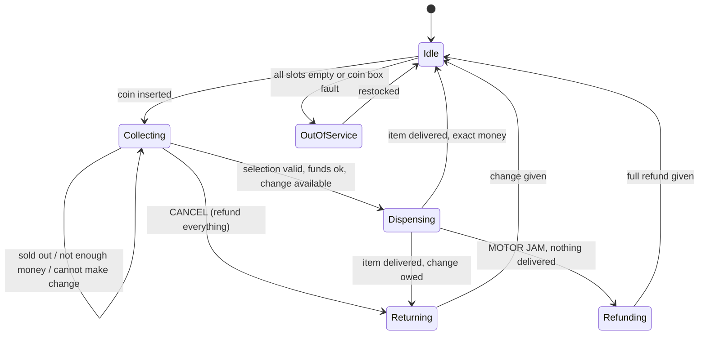
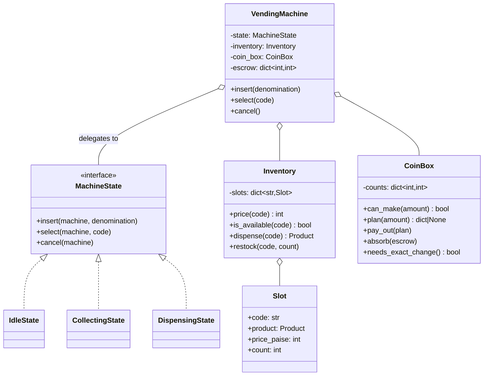

# Day 081 · System design — Design a vending machine

**After today you can:** You can model the coin-and-selection state machine cleanly.

**The interviewer asks it as:** *Design a vending machine. Handle exact change and refunds.*

---

## 1. What this is, and why they ask it

A vending machine takes money, then a selection, then gives out an item and any change. The design
has three parts: a **state machine** for where the customer is in that sequence, an **inventory** of
slots with prices and counts, and a **coin box** that has to be able to make change out of the coins
it happens to be holding.

The third part is what makes it interesting, and it is the mirror image of yesterday's ATM. In an ATM
money goes *out* and the account is debited first. Here money comes *in* first, and the machine holds
it — so the failure that matters is not "cash left without a debit", it is **"I have taken your fifty
rupees, the item costs thirty-five, and I have no coins to give you fifteen back."**

They ask it because it is the standard interview state machine — small enough to draw completely in
five minutes, with genuinely non-obvious behaviour at the edges. Cancel at any point. Change that
cannot be made. An item that jams after the money is taken. Every one of those has a right answer, and
the right answers are not symmetric with each other. Expect it in low-level design rounds everywhere,
often as a shorter alternative to the ATM.

---

## 2. The story

Devi's shop is the one just before the bus stop, and she opens the shutter at half past five in the
morning, which is when the first shift goes past.

If you go at six and buy a ten-rupee packet of biscuits with a five-hundred-rupee note, she will look
at you the way she has looked at people for twenty-six years and say no. Not rudely. Just no. Come
back later, or bring change.

She is not being difficult. At six in the morning her tin has almost nothing in it — a few coins she
put in the night before so she can start at all. Every note she takes early goes in and does not come
out, because there is nothing to give back with it.

By about eleven it has fixed itself. Enough small purchases have come through that the tin is full of
tens and twenties and coins, and now she can break a five hundred without thinking about it. By six in
the evening she has more change than she needs. The same customer, the same note, the same packet of
biscuits: refused at six in the morning, fine at six in the evening. Nothing about the sale changed.
Only what was in the tin.

There is a second tin, a smaller one, at the back of the shelf. That one has about four hundred rupees
of coins in it and she does not spend it. It is what she starts tomorrow with. Her son once used it to
give change on a busy evening and she found out the next morning at half past five, and he has not
done it since.

The thing she is most careful about is the order she does things in. She works out the change first,
in her head, before she hands anything over. If she cannot make it, she says so while the packet is
still on her side of the counter.

She got that from a bad afternoon years ago. A man bought a bottle of something cold, she gave him the
bottle, took his note, and then found she was eight rupees short of the change. He had already opened
it. She could not take it back and he was not going to accept eight rupees less. In the end she gave
him a toffee and both of them were annoyed.

Now the change is counted before the packet leaves her hand.

---

## 3. The idea in plain English

Devi's tin is the coin box. Her rule about counting the change first is the single most important line
in this design. And "the same sale is fine at six in the evening and refused at six in the morning" is
the **exact change only** light, which is not a fault condition but an ordinary state.

### The three parts

**One: the state machine.** The customer inserts money, selects, and receives. Between those, the
machine is in a definite state and only certain things are legal. This is the State pattern from
[day 073](../day-073-queues/README.md).

**Two: the inventory.** Slots, each with a code (`A3`), a product, a price and a count. Simple, and
worth keeping simple.

**Three: the coin box.** A count per denomination, and the ability to answer "can I make ₹15 out of
what I am holding?" — which is the same bounded change-making problem as yesterday's cash dispenser,
in miniature.

### The states

```
 IDLE          nothing inserted
 COLLECTING    money is in, more may come, nothing selected yet
 DISPENSING    committed: item is being pushed out
 RETURNING     giving change or a refund
```

Four states, and the transitions that matter are the ones that go *backwards*:

- From `COLLECTING`, **cancel** must always work and must return everything inserted. This is not
  optional and it is not a feature — a machine that can swallow money without giving an item is a
  machine that gets kicked.
- From `COLLECTING`, selecting an item that is **sold out** returns to `COLLECTING`, not to an error
  state. The customer's money is still in the machine and they may want something else.
- From `COLLECTING`, selecting an item you **cannot make change for** also returns to `COLLECTING`,
  with a message. The money stays in; the customer can add a coin or choose something else.

That last one is the design decision people miss. **Not being able to make change is not a failure of
the transaction — it is a refusal to start it.**

### The rule that carries the whole design

> **Verify the change before dispensing the item.**

Devi counting before the packet leaves her hand. In code:

```python
    if not self.coin_box.can_make(inserted - price):
        return "Exact change required for this item"     # nothing has happened yet
    self.inventory.dispense(code)                        # now commit
    self.coin_box.pay_out(change)
```

The order is the design. Dispense first and you may find yourself owing change you cannot pay, with
the item already gone and no way to reverse it. That is the man with the opened bottle.

Compare with the ATM on [day 080](../day-080-dummy-head/README.md), where the correct order was
*debit first, then dispense*. It looks like the opposite rule and it is the same rule: **do the
reversible thing first, and the irreversible thing last.** In an ATM the debit is reversible and the
cash is not. Here the money is already held by the machine, so the *item* is the irreversible act.
Saying that connection out loud is worth a lot — it shows you have a principle rather than two
memorised answers.

### The exact-change problem, concretely

The customer inserts ₹50 for a ₹35 item. The machine owes ₹15.

```
 coin box:  ₹10 × 0,  ₹5 × 2,  ₹2 × 3,  ₹1 × 0
 can it make 15?   5 + 5 + 2 + 2 + ... = 5+5+2+2 = 14, then nothing.  NO.
 with one ₹1:      5 + 5 + 2 + 2 + 1 = 15.  YES.
```

Greedy alone is not enough for the same reason as the ATM: it can strand you when a denomination runs
out. Use greedy first — it is right almost always — and fall back to a bounded search over the counts
you hold. With four denominations and a change amount under ₹100 this is trivially small.

And the **exact change only** light is simply: "is there any amount I might owe that I cannot make?"
The cheap and correct approximation used by real machines is to check whether the machine can make
change for the most common overpayments, and to light the indicator when it cannot.

### The coin float, which is a real design element

Devi's second tin is a **float**: coins reserved so tomorrow can start. In a machine this shows up as
a decision about the coins the customer just inserted:

- **Escrow model** — hold the inserted coins separately until the sale completes, then move them into
  the box. This means a cancel returns *the customer's own coins*, which is fairer and simpler.
- **Immediate model** — drop the coins into the box at once, and pay change from the pooled box. This
  gives you *more* coins to make change with, at the cost of a cancel returning different coins than
  were inserted, which customers do not care about and auditors sometimes do.

Real machines use escrow, and the reason is worth knowing: it makes a cancel provably correct even if
the machine loses power, because the customer's money was never mixed in.

### What makes this simpler than the ATM

One customer at a time, physically. There is no concurrency inside the machine at all — no two people
can insert coins into one slot simultaneously. Say this early, because it removes a whole category of
discussion and shows you know which problems this system does *not* have. The interesting failures
here are physical and sequential, not concurrent.

---

## 4. The picture

The state machine, with the backward transitions drawn, because those are the design:



What to notice: **three different arrows leave `Collecting` and come straight back to it.** Sold out,
insufficient funds, and cannot-make-change are all *refusals to start*, not failures — the money stays
in the machine and the customer keeps choosing. A design that sends any of those to an error state or
refunds automatically is worse for the customer and more code.

Also notice `Dispensing → Refunding`. The motor is the only thing here that can fail after commitment,
and it needs its own path.

The coin box, so the change problem is visible:

```
  COIN BOX                          ESCROW (this customer's coins)
  +--------+  ₹10 ×  0              +--------+
  +--------+  ₹5  ×  2              | ₹20 note |
  +--------+  ₹2  ×  3              | ₹10 coin |
  +--------+  ₹1  ×  0              +--------+
                                     inserted: ₹30

  item A3 costs ₹22  ->  change owed ₹8
    greedy: ₹5 + ₹2 = ₹7, then needs ₹1 and has none      -> greedy FAILS
    search: ₹2 × 3 = ₹6... no combination makes 8         -> genuinely impossible
    result: refuse the selection, keep the money in escrow,
            show "exact change required", stay in Collecting

  item B1 costs ₹25  ->  change owed ₹5
    greedy: ₹5 × 1                                        -> OK, sell it
```

What to notice: the machine can sell B1 and cannot sell A3, **for the same customer with the same
money in the escrow**. Availability is per-item and depends on the coin box, which is why the "exact
change" indicator is a machine-level approximation of a per-item truth.

The classes:



---

## 5. How it actually works

### Move 1 · Clarify (minutes 0–5)

> **"Coins only, or notes and cashless too?"** — Coins and small notes; assume no card for now, but
> ask, because cashless changes the design fundamentally.
> **"Can the customer cancel after inserting money?"** — Yes, at any time before the item is
> dispensed.
> **"Do all items cost the same?"** — No, per-slot pricing.
> **"What happens if the machine cannot make change?"** — That is the interesting question, and I
> would propose: refuse the selection, keep the money in, and tell the customer.

> "I will assume one customer at a time, which is physically true, so there is no concurrency inside
> the machine. I am not designing the coin validator hardware or the network telemetry, though I will
> say where they attach."

### Move 2 · The nouns (minutes 5–10)

- **`VendingMachine`** — the front door. Holds the state and delegates.
- **`MachineState`** *(interface)* — one class per state; each allows only what is legal in it.
- **`Slot`** — a code, a product, a price and a count.
- **`Inventory`** — the slots, and the availability question.
- **`CoinBox`** — counts per denomination, and the change-making question.
- **`Escrow`** — the coins this customer has inserted, held apart until the sale completes.

Six. One interface. Note what is missing: no `Customer` class, because a customer is not a thing the
machine stores; no `Transaction` object, because there is only ever one in flight and it lives in the
state. Saying why you left things out is worth as much as the classes you include.

### Move 3 · The state machine

```python
class MachineState:
    """Refuse everything by default; each state enables only what it permits."""
    name: str

    def insert(self, machine: "VendingMachine", denomination: int) -> str:
        return self._refuse("insert money")

    def select(self, machine: "VendingMachine", code: str) -> str:
        return self._refuse("make a selection")

    def cancel(self, machine: "VendingMachine") -> str:
        return self._refuse("cancel")

    def _refuse(self, action: str) -> str:
        raise IllegalOperation(f"cannot {action} while {self.name}")
```

Fail closed. In a machine holding customers' money, a state written in a hurry should refuse rather
than allow.

```python
class CollectingState(MachineState):
    name = "collecting money"

    def insert(self, machine, denomination):
        machine.escrow[denomination] = machine.escrow.get(denomination, 0) + 1
        return f"Credit: {machine.credit()}"

    def cancel(self, machine):
        refund = machine.escrow                 # the customer's OWN coins
        machine.escrow = {}
        machine.state = IdleState()
        return f"Refunded {sum(d * c for d, c in refund.items())}"
```

Cancel returns the escrow, not coins from the box. That is the escrow model paying off: the refund is
exactly what went in, and it is correct even if the box is empty.

### Move 4 · The selection, which is where the rule lives

```python
    def select(self, machine, code):
        if not machine.inventory.is_available(code):
            return "Sold out — choose something else"            # stay in Collecting

        price = machine.inventory.price(code)
        credit = machine.credit()
        if credit < price:
            return f"Insert {price - credit} more"               # stay in Collecting

        change = credit - price
        if change and not machine.coin_box.can_make(change, extra=machine.escrow):
            return "Exact change required for this item"         # stay in Collecting
```

Three refusals, all of which **keep the money in the machine and stay in the same state**. None of
them is an error. This block is the answer to "handle exact change", and it is four lines.

The `extra=machine.escrow` matters: the coins this customer just inserted are available to give back
as change, so a ₹5 coin they put in can be part of their own ₹15. Forgetting that makes the machine
refuse sales it could complete.

```python
        # every check has passed — commit, in the irreversible-last order
        plan = machine.coin_box.plan(change, extra=machine.escrow)
        machine.coin_box.absorb(machine.escrow)      # escrow joins the box
        machine.escrow = {}
        product = machine.inventory.dispense(code)   # the irreversible act
        machine.coin_box.pay_out(plan)
        machine.state = IdleState()
        return f"Dispensed {product}, change {change}"
```

The plan is computed **before** anything moves, exactly as with the ATM's cash dispenser. Half a
transaction is the failure that cannot be undone, so the code is arranged so it cannot occur.

### Move 5 · The coin box

```python
class CoinBox:
    def __init__(self, counts: dict[int, int]) -> None:
        self._counts = dict(counts)             # denomination -> how many

    def plan(self, amount: int, extra: dict[int, int] | None = None) -> dict[int, int] | None:
        available = self._merged(extra)
        greedy = self._greedy(amount, available)
        return greedy if greedy is not None else self._search(amount, available)

    def can_make(self, amount: int, extra=None) -> bool:
        return amount == 0 or self.plan(amount, extra) is not None
```

Same two-algorithm shape as the ATM: greedy first because it is right almost always and free, a
bounded search as the fallback. With four denominations and change under ₹100 the search is a few
hundred combinations.

```python
    def needs_exact_change(self) -> bool:
        """Light the indicator when a common change amount cannot be made."""
        return any(self.plan(amount) is None for amount in (1, 2, 5, 10, 15, 20))
```

An approximation, and you should say so: the true answer is per-item and per-customer, and a single
lamp on the front of the machine cannot express that. Checking a handful of typical amounts is what
real machines do.

### Move 6 · The failures that remain

```python
class DispensingState(MachineState):
    name = "dispensing"

    def on_motor_jam(self, machine, code, credit):
        machine.inventory.mark_faulty(code)      # do not sell this slot again
        machine.coin_box.refund(credit)          # full refund from the box
        machine.state = IdleState()
        return "Sorry — refunded. That slot is now disabled."
```

The motor is the one component that can fail *after* commitment, and the answer is a full refund plus
disabling the slot so the next customer does not hit the same jam. Disabling the slot is the part
people forget, and it is what turns one annoyed customer into one annoyed customer rather than
fifteen.

### Real systems

- **MDB (Multi-Drop Bus)** is the actual serial protocol between a vending controller and its coin
  mechanism, bill validator and cashless reader. The coin mechanism reports what it accepted and is
  commanded to pay out — the "coin box" in a real machine is a device you talk to, not a dictionary.
- **Escrow is a physical component**, not a metaphor: a real coin mech holds the inserted coins in an
  escrow tube and either returns them on cancel or drops them into the cash box on a completed sale.
- **Cashless readers** (Nayax, Cantaloupe, UPI QR in India) change the design more than anything else
  in this list: with a card or a UPI payment, the machine authorises first, dispenses, and *then*
  captures — which is exactly the ATM's ordering, and the exact-change problem disappears entirely.
  That is the single biggest simplification available and it is worth naming.
- **Telemetry** — modern machines report stock and coin levels over the network so the route is
  planned by need rather than by schedule, which is where the numbers in §6 come from.

---

## 6. The numbers

### Inventory and how long it lasts

```
 40 slots × 8 items per slot           = 320 items
 average price ₹25
 sales: 120 per day at a busy site
 restock interval: 320 / 120           ≈ 2.7 days
```

But the average hides the shape:

```
 the top 3 slots take about 40% of sales:  120 × 0.40 / 3  ≈ 16 sales/day each
 8 items in a slot / 16 sales per day      =  half a day
```

**The popular slots empty in half a day while the machine as a whole lasts nearly three.** So a
restock schedule based on total stock is wrong, and the machine should report per-slot levels. That
is a real conclusion from arithmetic, and it is exactly the kind of thing this section is for.

### The coin box

```
 daily takings:  120 sales × ₹25  =  ₹3,000
 assume 60% of customers overpay and need change, averaging ₹8 back:
   72 × ₹8  =  ₹576 of change paid out per day
 coins received: whatever customers insert — mostly ₹10 and ₹20 notes at a busy site
```

The imbalance is the whole problem:

```
 coins IN  from customers:  mostly ₹10 coins and notes
 coins OUT as change:       ₹1, ₹2 and ₹5
 net drain on small coins:  ~70 small coins per day
 float loaded at restock:   ₹5 × 100, ₹2 × 100, ₹1 × 100  =  ₹800
 time until "exact change only" lights:  800 / 576  ≈  1.4 days
```

**The coin float runs out in under a day and a half, while the stock lasts nearly three.** That single
comparison explains why the light is on so often on real machines, and it is the argument for either
a bigger float, prices chosen to need less change, or cashless payment.

### Prices chosen to reduce change

```
 prices ending in ₹5 or ₹0:   change is always a multiple of ₹5  -> only ₹5 coins needed
 prices like ₹22 or ₹37:      change can need ₹1 and ₹2 coins    -> three denominations to keep
```

Rounding every price to a multiple of five removes two denominations from the float entirely.
**Pricing is a design lever, not just a business decision** — noticing that is a good moment in the
interview.

### The change algorithm's cost

```
 change amounts: 0 to about ₹95
 denominations: 4
 greedy:                    4 steps           ~1 µs
 bounded search worst case: ~20^4 pruned      < 1 ms
 frequency of the fallback: a few percent, late in the float's life
```

Under a millisecond on a machine whose motor takes four seconds. **The algorithm is free** — so choose
the correct one, not the fast one.

### State, and the absence of scale

```
 40 Slot objects × ~150 B            =  6 KB
 CoinBox                              =  a few hundred bytes
 escrow                               =  tens of bytes
 ----------------------------------------------------
 total                                ≈  7 KB
```

Seven kilobytes. **There is nothing to scale here, and no concurrency inside the machine** — one
customer, one hand, one slot at a time. The interesting problems are physical and sequential. Saying
that early keeps the conversation on the parts that matter.

---

## 7. The trade-offs

### What this design gives up

**"Exact change only" is a machine-level lamp for a per-item truth.** The machine may be able to sell
you a ₹25 item and not a ₹22 one with the same coins in the box. A single indicator cannot express
that, so it is an approximation — check a handful of common change amounts and light it if any fail.
The honest alternative is per-item availability shown on a screen, which needs a screen.

**Escrow means a cancel returns the customer's own coins, and that reduces change-making ability.** If
the coins went straight into the box, the box would be fuller and more sales would be possible. Escrow
trades a little sales capacity for a refund that is provably correct even after a power cut. Real
machines choose escrow, and it is worth saying *why* rather than just which.

**A jammed motor is unrecoverable in software.** The only honest answers are a full refund and
disabling the slot. Retrying the motor risks dispensing two items for one payment, which is worse than
a refund. **Never retry a physical dispense** — the same rule as the ATM, for the same reason.

**Nothing here handles two customers, and nothing needs to.** But it also means nothing here scales to
a bank of six machines sharing a cashless reader, which is a real deployment. That would need a
transaction id per machine and a shared payment session.

**The float is loaded by a human on a schedule and runs out faster than the stock.** That is an
operational failure the software can only report, not fix. Telemetry that reports coin levels is
therefore not a nice-to-have; it is the difference between a machine that is sellable for three days
and one that is sellable for one and a half.

**No audit trail.** A real machine logs every sale, every refund and every coin movement, because the
route operator has to reconcile the cash box against the sales. Adding that is one append-only log and
it is the same electronic-journal idea as the ATM.

### "I would change this design if..."

- **...cashless payment is added.** Then the ordering flips to authorise → dispense → capture, exactly
  like the ATM, and the entire exact-change problem disappears. This is the biggest available
  simplification and I would push for it.
- **...the machine sells items of different sizes from one spiral.** Then a slot is not one product
  and the inventory model changes.
- **...prices are dynamic** — happy-hour pricing, or a discount card. Then price becomes a policy
  rather than a field on the slot, and I would put an interface there.
- **...one payment session spans several machines.** Then there is a transaction id and a shared
  session, and the "no concurrency" claim stops being true.

### The honest concession

This design has exactly one interesting decision — the order in which money and goods move — and
everything else is bookkeeping. It would be easy to dress it up with a `DispenseStrategy` and a
`PricingFactory`, and both would be hierarchies built for futures that have not arrived. The state
classes earn themselves because each state genuinely allows different actions and refusal-by-default
is a safety property. Nothing else does, so nothing else gets one.

---

## 8. In the interview

### How it gets asked

- The standard: *"Design a vending machine."* Then: *"What if it cannot make change?"*
- The state probe: *"What happens if the customer presses cancel after inserting forty rupees?"*
- The ordering probe, which is the good one: *"Do you dispense the item first or the change first?
  Why?"*
- The failure probe: *"The motor jams and the item does not come out. Now what?"*
- The comparison, if the ATM came up earlier: *"Yesterday you debited before dispensing. Here you
  check change before dispensing. Which is it?"*

### The timed script

**Minutes 0–5 · Clarify.** Coins, notes, cashless? Cancel allowed? Per-slot prices? And ask what
should happen when change cannot be made — proposing the answer as you ask is fine and shows you have
thought about it.

**Minutes 5–10 · Estimation and framing.** 40 slots, 120 sales a day, 320 items — stock lasts 2.7 days
and the coin float lasts 1.4. Say that gap out loud; it frames the whole design. And say the thing
that removes a category of discussion: **one customer at a time, no concurrency inside the machine.**

**Minutes 10–20 · The state machine.** Four states. Draw the three arrows that leave `Collecting` and
come straight back, and say why sold-out, insufficient-funds and cannot-make-change are refusals
rather than failures.

**Minutes 20–30 · The deep dive: money and goods.** The verify-change-before-dispensing rule, the
escrow, the greedy-then-search change algorithm, and the connection to the ATM: *do the reversible
thing first and the irreversible thing last.*

**Minutes 30–40 · Failures and extensions.** The motor jam and why you never retry it. The float
running out. Then cashless, and how it collapses the hardest part of the problem.

### The follow-ups

**"What if the machine cannot make change?"**
"It refuses the *selection*, not the transaction. The money stays in escrow, the machine stays in the
collecting state, and the display says exact change is required for that item. The customer can add a
coin, choose a cheaper or differently-priced item, or cancel and get their own coins back. What it
must not do is take the money and give a partial refund, or dispense and owe change. And I would note
that availability is per-item — the same coins might buy a ₹25 item and not a ₹22 one — so the 'exact
change only' lamp is an approximation of a per-item truth."

**"Do you dispense the item or the change first?"**
"Neither, first — I *verify* the change before anything moves. Compute the coin plan, confirm it is
possible, and only then dispense. If I dispense first and then find I am short, the item is gone and I
cannot reverse it. The general rule, which is the same one as the ATM: **do the reversible thing first
and the irreversible thing last.** In an ATM the debit is reversible and the cash is not, so you debit
first. Here the machine is already holding the money, so the item is the irreversible act and it goes
last."

**"The customer presses cancel after inserting forty rupees."**
"Full refund of exactly what they inserted, because the coins are held in escrow rather than mixed
into the box. That is the reason for escrow: the refund is provably correct even if the coin box is
empty or the machine loses power mid-cancel. Cancel must be legal at any point in the collecting
state — a machine that can swallow money without giving an item is a machine that gets kicked."

**"The motor jams and the item does not come out."**
"Full refund from the coin box, and mark that slot as faulty so nobody else hits the same jam — that
second part is what turns one annoyed customer into one rather than fifteen. And I would never retry
the motor automatically: a retry risks dispensing two items for one payment, which is worse than a
refund. Same rule as the ATM's dispense — a physical act that may have partially happened is never
safe to repeat."

**"How do you decide which coins to give?"**
"Greedy from the largest coin down, falling back to a small bounded search over the counts I actually
hold — because greedy strands you when a denomination runs out, exactly like the ATM cassettes. And
importantly, the coins this customer just inserted are available as change, since they are sitting in
escrow. Forgetting that makes the machine refuse sales it could complete. The whole computation is
under a millisecond on a machine whose motor takes four seconds, so I would choose the correct
algorithm rather than the fast one."

**"How often will the exact-change light be on?"**
"More often than the machine is out of stock, which surprises people. At 120 sales a day with maybe 60
percent needing change averaging ₹8, that is about ₹576 of small coins paid out daily, against a float
of roughly ₹800 loaded at restock — so about a day and a half, while the stock lasts nearly three. Two
levers help: a bigger float, and pricing everything in multiples of five, which removes the ₹1 and ₹2
denominations from the problem entirely. And the real fix is cashless."

**"Add card and UPI payment."**
"It simplifies the hardest part of this design out of existence. With cashless the machine authorises
the exact price, dispenses, and then captures — there is no change to make, so the coin box, the
escrow and the exact-change lamp all stop mattering for those sales. The ordering becomes the ATM's:
authorise first because it is reversible, dispense last because it is not. What I gain in exchange is
a network dependency and the same failure I had yesterday — authorised but not dispensed — which needs
a reversal and a local log."

### A model answer

Asked: *design a vending machine. Handle exact change and refunds.*

> "Three parts: a state machine for where the customer is, an inventory of slots with prices and
> counts, and a coin box that has to make change from whatever it happens to be holding. The third is
> where the design actually lives.
>
> One framing point first, because it removes a whole category of discussion: there is exactly one
> customer at a time, physically. No concurrency inside the machine. The interesting failures here are
> physical and sequential.
>
> The states are idle, collecting, dispensing and returning. I would implement them as one class per
> state with a base that refuses every action, so each state enables only what it permits — a machine
> holding customers' money should fail closed.
>
> The transitions that matter are the ones that go backwards. From collecting, there are three
> different refusals that all come straight back to collecting: the item is sold out, there is not
> enough money in yet, and — the interesting one — the machine cannot make change for that item. None
> of those is a failure. The money stays in, and the customer picks something else or adds a coin.
> That is the answer to 'handle exact change': it is a refusal to *start* the transaction, not a
> failure in the middle of one.
>
> And cancel must work at any point in collecting, returning everything. I would hold the inserted
> coins in escrow — separate from the coin box — until the sale completes, so a refund gives back
> exactly what went in and is correct even if the box is empty or the power cuts. Real coin mechanisms
> do this in hardware for the same reason.
>
> Now the rule that carries the design: **verify the change before dispensing the item**. Compute the
> coin plan, confirm it is possible, and only then move anything. If I dispense and then discover I am
> eight rupees short, the item is gone and there is no reversing it.
>
> That is the same principle as the ATM yesterday, even though it looks like the opposite order: do
> the reversible thing first and the irreversible thing last. In an ATM the debit is reversible and
> the cash is not, so you debit first. Here the machine already holds the money, so the item is the
> irreversible act and it goes last.
>
> For the change itself: greedy from the largest coin down, with a small bounded search as a fallback,
> because greedy strands you when a denomination runs out. And the coins in escrow count as available
> change — a five-rupee coin the customer just inserted can be part of their own fifteen rupees back.
> Forgetting that makes the machine refuse sales it could complete.
>
> Two failures I would design for explicitly. A jammed motor: full refund, and mark the slot faulty so
> the next fifteen customers do not hit it, and never retry the motor, because a retry risks two items
> for one payment. And the coin float running out, which is not a bug — some arithmetic: 120 sales a
> day, maybe sixty percent needing change averaging eight rupees, is about five hundred and seventy-six
> rupees of small coins out per day against a float of eight hundred. So the exact-change light comes
> on in about a day and a half, while the stock lasts nearly three. The levers are a bigger float,
> pricing everything in multiples of five so only five-rupee coins are needed, and telemetry so the
> route is planned by coin level rather than by schedule.
>
> If I could change one requirement, it would be to add cashless payment, because it deletes the
> hardest part of this design: no change to make, no float to run out, no exact-change lamp. What it
> costs is a network dependency and the ATM's failure mode — authorised but not dispensed — which
> needs a reversal and a local log."

---

## 9. Recall card

- **The rule that carries the design: verify the change BEFORE dispensing the item.** Same principle
  as the ATM even though the order looks opposite — **do the reversible thing first, the irreversible
  thing last.** ATM: the debit is reversible, cash is not → debit first. Vending: the money is already
  held, the item is irreversible → item last.
- **Cannot-make-change is a REFUSAL TO START, not a failure.** Sold out · not enough money · cannot
  make change are three arrows that leave `Collecting` and come **straight back to it**: the money
  stays in, the customer chooses again. The "exact change only" lamp is a machine-level approximation
  of a **per-item** truth — the same coins may buy a ₹25 item and not a ₹22 one.
- **Hold inserted coins in ESCROW, not in the box.** Then cancel returns *exactly what went in* and is
  correct even after a power cut — and the escrow coins still count as available change, which real
  designs forget. **Cancel must be legal at any point** before dispensing.
- **Greedy change, bounded search as fallback** (greedy strands you when a denomination empties);
  **compute the whole plan before anything moves**; **never retry a jammed motor** — refund fully and
  **disable the slot**, or fifteen more customers hit the same jam.
- **The float runs out before the stock does: ~₹576/day of change against a ~₹800 float ≈ 1.4 days,
  while 320 items at 120 sales/day ≈ 2.7 days.** Levers: bigger float · **prices in multiples of five**
  (removes ₹1 and ₹2 from the problem) · per-slot telemetry (the top 3 slots empty in **half a day**) ·
  and the real fix, **cashless**, which deletes change-making entirely and moves the ordering back to
  authorise → dispense → capture. Total state ≈ **7 KB**, **one customer at a time, no concurrency.**
