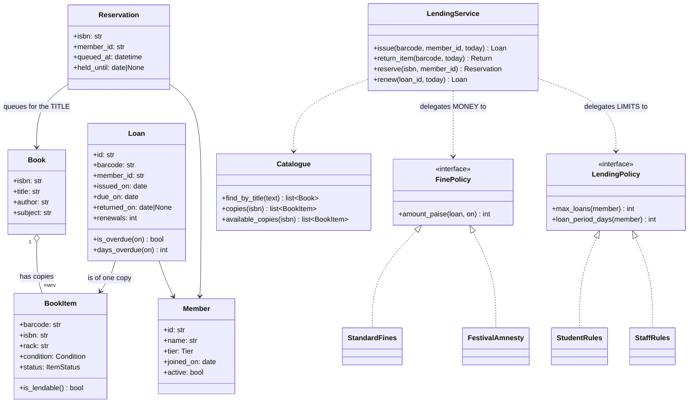
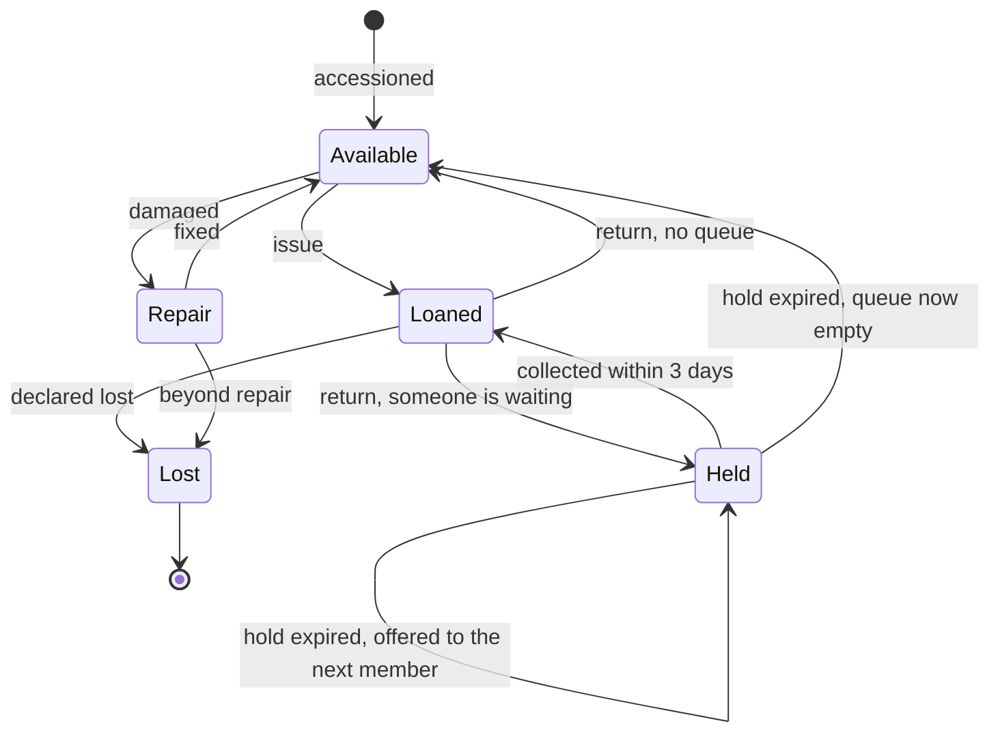

# Day 082 · System design — Design a library management system

**After today you can:** You can model members, catalogues, loans and fines with the right responsibilities.

**The interviewer asks it as:** *Design a library system. Who owns the rule about late fees?*

---

## 1. What this is, and why they ask it

A library lends physical copies of books to members, takes them back, charges for late returns, and
lets people reserve something that is currently out. Four verbs, and the whole design turns on two
questions that look small and are not.

The first is a **modelling** question: is "*Ponniyin Selvan*" one thing or six? The library owns six
physical copies, each with its own barcode, its own condition, and its own borrower. But a member
searching the catalogue is looking for the *title*, and a reservation queue is a queue for the title,
not for copy number four. Merging those two ideas into one class is the single most common mistake in
this prompt, and it breaks reservations, availability and reporting all at once.

The second is a **responsibility** question, and it is the one in the prompt: **who owns the rule
about late fees?** Not the book. Not the member. Arguably not even the loan. Getting that answer right
— and being able to say *why* the obvious homes are wrong — is what this round is scored on.

They ask it because it is a domain everyone understands, so no knowledge separates candidates, only
judgement. And because the two questions above are exactly the two questions every real business
system asks: *what are the entities really*, and *where does the rule live*.

---

## 2. The story

Shakuntala's shop is two rooms behind the temple and it has been a lending library since 1979, when
her father-in-law started it with about two hundred Kannada novels.

There are about four thousand now. People pay thirty rupees a month and take two at a time.

She has two problems and she has had both of them for forty years.

The first is the word "book". A woman comes in and asks whether Shakuntala has *Mookajjiya Kanasugalu*,
and Shakuntala says yes — because she does, it is on the list, they have had it since before the shop
had electricity. Then she has to say the other thing, which is that both copies are out, one with the
schoolmaster who has had it since August and one with a woman in the next lane. So the answer is yes
and also no, and the woman is annoyed, and Shakuntala has explained this ten thousand times. The book
exists. The books you can take home do not.

She has three copies of one Bhyrappa novel and one of them has a torn spine and she will not lend it
to anyone she does not know. So even "we have three" is not a simple sentence.

The second problem is the late fee, and this one her daughter finally made her look at properly.

There is a rule. It is a rupee a day after two weeks. Shakuntala will tell you that rule without
hesitating.

But she does not charge the schoolmaster, because he is seventy-nine and he brings the books back
eventually and once he gave her father-in-law money when the shop flooded. She does not charge anybody
in the week of a festival. She charges the college boys the full amount and sometimes more than the
full amount, because otherwise they keep the books for months. She once charged a woman fourteen rupees
and then took eight of it off when the woman said the child had been ill.

Her daughter, who does the accounts on a laptop now, asked her one evening what the rule actually is,
so she could put it in.

Shakuntala said, a rupee a day after two weeks.

Her daughter said, but that is not what you do.

And Shakuntala said the thing that ended the conversation, which was: the rule is not in the book and
it is not in the person, it is in my head, and I change it. Write down what happened — who took what,
when they took it, when they brought it back. What they owe is my business, and I will tell you.

---

## 3. The idea in plain English

Shakuntala's two problems are the two design questions. And her last sentence is the answer to the
second one, almost word for word.

### Problem one: a book is two things

There are two entirely different concepts sharing a word, and they need two classes.

- **`Book`** — the *title*. ISBN, title, author, publisher, subject. There is exactly one of these for
  *Mookajjiya Kanasugalu*, however many copies exist. This is what the catalogue searches and what a
  reservation queues for.
- **`BookItem`** — a *physical copy*. Its own barcode, its own rack location, its own condition, its
  own status (on the shelf, lent out, lost, being repaired), its own purchase date and price. Six of
  these can point at one `Book`.

Once you split them, three things that were awkward become obvious:

```
 "Do you have X?"          -> a Book lookup.  Answer: yes.
 "Can I take X home?"      -> is any BookItem of that Book available?  Answer: no.
 "I want X when it comes"  -> a reservation on the Book, not on a copy.
 "This copy has a torn
  spine, do not lend it"   -> a condition on ONE BookItem.
```

**Reservations queue for the title; loans are of a copy.** That single sentence is the payoff, and it
is impossible to say if `Book` and `BookItem` are the same class. This is the same
title-versus-instance split you see everywhere once you look for it: a film versus a showing, a flight
number versus today's flight, a product versus a serial number.

### Problem two: who owns the late-fee rule

Consider each candidate home and say why it is wrong. Doing this out loud is the answer to the
question.

**Not `Book`.** A fine is not a property of *Ponniyin Selvan*. The book does not change when the
library changes its rates.

**Not `BookItem`.** Same, and worse — the fine would then vary by copy for no reason.

**Not `Member`.** A member is a person with a name and a membership. They do not know the daily rate,
and putting it there means every member object carries pricing logic.

**Not `Loan` either**, and this is the interesting one, because `Loan` is the tempting answer. A loan
knows who borrowed what and when it was due, so `loan.fine()` looks natural. But to compute a fine
correctly it would need: the daily rate, which varies by membership tier; the maximum cap; the
holiday calendar, because most libraries do not charge for days they were closed; the current date;
and whatever waiver applies. All of those change without any loan changing, and none of them is
something a *record of a borrowing* should know.

**So: a `FinePolicy`.** The loan holds the **facts** — who, what, when it went out, when it was due,
when it came back. The policy **interprets** those facts into money.

```python
class FinePolicy(Protocol):
    def amount_paise(self, loan: Loan, on: date) -> int: ...
```

That is Shakuntala's sentence: *write down what happened; what they owe is my business.*

And now the rule is a thing you can change, test, and have several of at once — a student rate, a
staff rate, a festival amnesty — without touching a single `Loan`.

### The line between the record and the rule

This does not mean `Loan` is a bag of data with no behaviour. On
[day 044](../day-044-first-and-last-occurrence/README.md) you met the **anaemic model** — an object
that is only fields, with all the logic elsewhere — and it is a real smell, not something to aim for.

The line to draw is this:

- **`Loan` answers questions about itself.** Is it returned? Is it overdue on a given date? How many
  days late? Can it be renewed? Those are facts about the loan and nothing else is needed to answer
  them.
- **`FinePolicy` answers questions about money.** Because money needs rates, tiers, calendars and
  waivers, and those are not facts about the loan.

`days_overdue` lives on the loan. `rupees_owed` does not. That one-line boundary is the most reusable
idea in this lesson, and it generalises far beyond libraries.

### The second policy, which people forget

There is a matching rule on the way *out*: how many books may this member take, and for how long?

```python
class LendingPolicy(Protocol):
    def max_loans(self, member: Member) -> int: ...
    def loan_period_days(self, member: Member) -> int: ...
    def max_renewals(self, member: Member) -> int: ...
```

A student may take 3 for 14 days; a staff member 10 for 30; a member with an outstanding fine over a
threshold may take none. Same argument as the fine: it varies by tier and by policy changes, and it
does not belong on `Member`.

Two policies, and the gate for both is the one from
[day 076](../day-076-lru-cache/README.md): **can you name a second implementation someone would
actually want?** For fines: standard, and a festival amnesty. For lending: student and staff. Both
pass easily. Nothing else in this design does, so nothing else gets an interface.

### Reservations, which are a queue on the title

When every copy is out, a member joins a **first-in-first-out queue** on the `Book`. When any copy
comes back:

1. If the queue is empty, the copy goes back on the shelf, status available.
2. Otherwise the copy is **held** for the member at the front — not lent, held — for a fixed window,
   say three days.
3. If they do not collect it in that window, the hold expires, they lose their place, and the next
   member in the queue is offered it.

The hold window is the part that makes it a real design rather than a queue. Without an expiry, one
member who never comes in blocks the copy for ever. Say that unprompted.

---

## 4. The picture

The class diagram. Notice the two arrows out of `LendingService` — the two delegated decisions.



What to notice: **`Loan` points at a `BookItem` and `Reservation` points at a `Book`.** Those two
arrows going to different classes *is* the answer to problem one, and if both pointed at the same
class the design would be wrong in a way that only shows up when someone reserves a title with six
copies.

The lifecycle of a single physical copy:



What to notice: `Held` is a real state, distinct from both `Available` and `Loaned`. A copy on hold is
in the building and cannot be lent to a walk-in. Designs that skip it either lend the copy to the
wrong person or lose it from the shelf count.

And the two ideas of "a book", drawn:

```
  Book (title)                        BookItem (copies)
  +----------------------+            +----------+----------+----------+
  | ISBN  978-81-...     |----------->| BC-1041  | BC-1042  | BC-1043  |
  | Mookajjiya Kanasugalu|            | rack 3A  | rack 3A  | rack 7B  |
  | Kota Shivarama Karanth|           | good     | good     | TORN     |
  +----------------------+            | LOANED   | LOANED   | REPAIR   |
            ^                         +----------+----------+----------+
            |
   Reservation queue                   Loans point HERE
   points HERE (the title)              (one specific copy)

  "Do you have it?"        -> yes, the Book exists
  "Can I take it home?"    -> no, zero lendable copies
```

---

## 5. How it actually works

### Move 1 · Clarify (minutes 0–5)

> **"Physical books only, or e-books too?"** — Physical. E-books have no copies and no fines, so they
> would change the model.
> **"Can members reserve a book that is currently out?"** — Yes, with a queue.
> **"Do different member types have different limits and rates?"** — Yes: students and staff.
> **"Are fines charged for days the library is closed?"** — Good question to ask, because the answer
> decides whether the fine calculation needs a calendar. Assume no charge on closed days.

> "I will assume a single branch, that a loan is of one copy, and that payment of fines is out of
> scope beyond recording that they were paid. I am not designing the search engine internals or the
> membership billing."

### Move 2 · The nouns (minutes 5–12)

- **`Book`** — the title. One per ISBN.
- **`BookItem`** — one physical copy. Barcode, rack, condition, status.
- **`Member`** — a person, a tier, and whether the membership is active.
- **`Loan`** — one copy out to one member, with dates. Answers questions about *itself*.
- **`Reservation`** — one member queued for a *title*, with a hold window when offered.
- **`Catalogue`** — search and availability lookups.
- **`LendingService`** — issue, return, renew, reserve. The entry point; holds no rules.
- **`FinePolicy`** *(interface)* — facts to money.
- **`LendingPolicy`** *(interface)* — limits and periods per member.

Nine, two of them interfaces. Say what is deliberately absent: no `Librarian` class, because a
librarian is a user of the system rather than a thing in it; no `Rack` class, because a rack is a
string on the copy until someone asks for shelf management.

### Move 3 · The records, written first

```python
@dataclass(frozen=True)
class Book:
    isbn: str
    title: str
    author: str
    subject: str


class BookItem:
    def __init__(self, barcode: str, isbn: str, rack: str) -> None:
        self.barcode = barcode
        self.isbn = isbn                       # which title this is a copy of
        self.rack = rack
        self.condition = Condition.GOOD
        self.status = ItemStatus.AVAILABLE

    def is_lendable(self) -> bool:
        return self.status is ItemStatus.AVAILABLE and self.condition is not Condition.TORN
```

`is_lendable` is one line and it earns its place: "available" and "lendable" are different things, and
Shakuntala's torn Bhyrappa is why.

```python
@dataclass
class Loan:
    id: str
    barcode: str
    member_id: str
    issued_on: date
    due_on: date
    returned_on: date | None = None
    renewals: int = 0

    def is_returned(self) -> bool:
        return self.returned_on is not None

    def is_overdue(self, on: date) -> bool:
        return not self.is_returned() and on > self.due_on

    def days_overdue(self, on: date) -> int:
        end = self.returned_on or on
        return max(0, (end - self.due_on).days)
```

**Three methods, and not one of them mentions money.** This is the boundary from §3, in code: the loan
answers questions about itself using only what it holds. `days_overdue` needs no rate, no calendar and
no tier, so it belongs here.

### Move 4 · The policies — the interesting part

```python
class FinePolicy(Protocol):
    def amount_paise(self, loan: Loan, on: date) -> int: ...


class StandardFines:
    """A rate per day per tier, a cap, and no charge for days the library
    was closed. All four of those change without any Loan changing, which is
    exactly why this is not a method on Loan."""

    RATE_PAISE = {Tier.STUDENT: 100, Tier.PUBLIC: 200, Tier.STAFF: 0}
    CAP_PAISE = 50_000                          # never more than the book is worth

    def __init__(self, members: "MemberDirectory", closed_days: set[date]) -> None:
        self._members = members
        self._closed = closed_days

    def amount_paise(self, loan: Loan, on: date) -> int:
        if not loan.is_overdue(on) and not loan.is_returned():
            return 0
        chargeable = self._chargeable_days(loan, on)
        tier = self._members.get(loan.member_id).tier
        return min(chargeable * self.RATE_PAISE[tier], self.CAP_PAISE)
```

Look at the constructor. The policy holds a member directory and a closed-day calendar — two
dependencies that a `Loan` should never have. That is the concrete argument for the split, and it is
more convincing than any principle.

```python
    def _chargeable_days(self, loan: Loan, on: date) -> int:
        end = loan.returned_on or on
        days = 0
        day = loan.due_on + timedelta(days=1)
        while day <= end:
            if day not in self._closed:
                days += 1
            day += timedelta(days=1)
        return days


class FestivalAmnesty:
    """The second implementation. Every year, for one week, fines are waived —
    and this is a one-line class rather than a branch inside the standard one."""

    def __init__(self, wrapped: FinePolicy, from_day: date, to_day: date) -> None:
        self._wrapped, self._from, self._to = wrapped, from_day, to_day

    def amount_paise(self, loan: Loan, on: date) -> int:
        if self._from <= on <= self._to:
            return 0
        return self._wrapped.amount_paise(loan, on)
```

Worth pointing at: `FestivalAmnesty` **wraps** the standard policy rather than replacing it, which
makes it a decorator ([day 069](../day-069-balanced-brackets/README.md)) as well as a second
implementation of the interface. Shakuntala not charging anyone in festival week, expressed in six
lines instead of in her head.

### Move 5 · The service, which holds no rules

```python
class LendingService:
    def issue(self, barcode: str, member_id: str, today: date) -> Loan:
        member = self._members.get(member_id)
        if not member.active:
            raise NotAllowed("membership is not active")

        open_loans = self._loans.open_for(member_id)
        if len(open_loans) >= self._lending.max_loans(member):
            raise NotAllowed(f"limit of {self._lending.max_loans(member)} books reached")

        item = self._catalogue.item(barcode)
        if not item.is_lendable():
            raise NotAllowed(f"copy {barcode} is {item.status.name.lower()}")
```

Three checks, and each one asks somebody else the question. `max_loans` comes from the policy, not
from a constant here. That is what "the service holds no rules" means in practice.

```python
        held = self._reservations.hold_on(item.barcode)
        if held is not None and held.member_id != member_id:
            raise NotAllowed(f"this copy is held for another member until {held.held_until}")

        period = self._lending.loan_period_days(member)
        loan = Loan(new_id(), barcode, member_id, today, today + timedelta(days=period))
        item.status = ItemStatus.LOANED
        self._loans.add(loan)
        if held is not None:
            self._reservations.fulfil(held)
        return loan
```

The held-copy check is the one people miss: a copy sitting on the hold shelf must not be handed to a
walk-in, and the error message should say why.

```python
    def return_item(self, barcode: str, today: date) -> "Return":
        loan = self._loans.open_for_barcode(barcode)
        loan.returned_on = today
        fine = self._fines.amount_paise(loan, today)      # the policy decides the money

        next_in_queue = self._reservations.next_for(self._catalogue.item(barcode).isbn)
        item = self._catalogue.item(barcode)
        if next_in_queue is None:
            item.status = ItemStatus.AVAILABLE
        else:
            item.status = ItemStatus.HELD                  # not available — held
            next_in_queue.held_until = today + timedelta(days=3)
            self._notify(next_in_queue.member_id, item)
        return Return(loan, fine_paise=fine)
```

Two things at once, and both matter. The fine is computed by asking the policy. And the returned copy
goes to `HELD` rather than `AVAILABLE` if anyone is waiting, with an expiry — because a hold with no
expiry blocks the copy for ever.

### Real systems

- **Koha** and **Evergreen** are the two big open-source library systems, and both have exactly this
  split: a *bibliographic record* (the title) and *items* (the copies), which in library standards are
  the MARC bibliographic record and the holdings record.
- **The circulation rules matrix** in Koha is literally a table of (member category × item type) →
  loan period, renewals, fine rate. That is `LendingPolicy` and `FinePolicy` as configuration rather
  than code — and it is what a mature version of this design turns into, because librarians change
  rules and cannot deploy software.
- **RFID and barcodes** are per-copy, which is another argument for `BookItem`: the physical world
  already has the distinction, and a design that lacks it cannot represent what the scanner reads.
- **Overdrive / Libby** for e-books deliberately *simulates* copies — a library buys a number of
  simultaneous licences and members queue for them — precisely so that the same circulation model
  keeps working. The industry chose to keep the copy concept even where it is artificial.

---

## 6. The numbers

### Size, which decides the storage design

```
 titles                50,000
 copies                80,000        (1.6 copies per title on average)
 members               20,000
 active loans          12,000        (60% of members holding 1-2 books)
 loans per year        500 per day × 300 days = 150,000
```

```
 Book       ~400 B × 50,000   =  20 MB
 BookItem   ~200 B × 80,000   =  16 MB
 Member     ~300 B × 20,000   =   6 MB
 Loan       ~200 B × 150,000/yr = 30 MB per year of history
 -------------------------------------------------------
 current working set          ≈  42 MB, plus 30 MB per year of loans
```

**Everything except the loan history fits comfortably in memory.** So the interesting storage question
is not the catalogue, it is the loan table, which grows for ever — ten years is 1.5 million rows and
300 MB, still small, but it is the only thing that grows and that is worth saying.

### Traffic

```
 500 loans/day + 500 returns/day + ~2,000 searches/day
 = 3,000 operations over a 10-hour day
 = 0.08 operations per second
```

**One operation every twelve seconds.** This is not a scale problem, and saying so early stops the
conversation drifting into caching and sharding. The design questions here are about *responsibility*,
not throughput.

### Fines, which is what the prompt is about

```
 15% of loans returned late, averaging 4 days over
 150,000 loans/year × 0.15  =  22,500 late returns
 22,500 × 4 days × ₹2/day   =  ₹1,80,000 per year
```

And the reason the cap exists:

```
 one loan forgotten for 3 years at ₹2/day = ₹2,190
 the book cost ₹450
 -> without a cap, the fine is 5x the value of the book, and nobody ever pays it
 -> cap at the replacement cost, ₹500, and the debt is collectable
```

**An uncapped fine is an uncollectable fine.** That is a business rule with an arithmetic
justification, and it is exactly the kind of thing that belongs in `FinePolicy` where it can be
changed.

### Closed days, which is why the calendar is a dependency

```
 library closed: 52 Sundays + 15 public holidays = 67 days a year
 67 / 365 = 18% of days
 a 4-day overdue period spanning a weekend: 4 days charged vs 2 chargeable
 -> the naive calculation overcharges by up to 50% on short overdues
```

Half of a typical fine, wrong, if you subtract dates naively. **That is the single strongest argument
for the fine rule not living on `Loan`**: a loan has no idea when the library was shut.

### Reservations

```
 popular title: 6 copies, 40 members in the queue
 average loan: 14 days
 copies returning: 6 / 14  ≈  0.43 per day
 wait for position 40:  40 / 0.43  ≈  93 days
```

Three months for the fortieth person. Which is why the hold window matters:

```
 hold window 3 days, 20% of members do not collect
 wasted shelf time per copy cycle: 0.20 × 3 days = 0.6 days
 across 6 copies over a year: 6 × (365/14) × 0.6  ≈  94 copy-days lost
```

**Ninety-four copy-days a year lost to uncollected holds**, which is about a quarter of one extra
copy. That is the number that justifies shortening the window or charging for a missed hold.

---

## 7. The trade-offs

### What this design gives up

**Two policies is two indirections.** Answering "what does this member owe?" now means finding the
policy implementation rather than reading a method. That is the standard cost of putting a rule behind
an interface, and it is worth it here only because the rule genuinely varies — by tier, by calendar,
by amnesty — and changes without any entity changing.

**A policy in code still needs a deploy.** Real libraries change fine rates by decree, on a Monday.
The mature version of this design makes the policy **configuration** — a rules table keyed by member
category and item type, which is exactly what Koha does — and the code becomes an interpreter of that
table. I would build the interface first and move to a table when the second rate change arrives.

**Fines are computed, not stored, and that is a decision with consequences.** Computing on demand
means a rate change silently re-prices historical debts. Storing the amount at return time means the
number never moves but a bug in the policy is frozen into the record. The usual answer is: compute at
the moment of return, **store the result on the return record**, and keep the policy for the
calculation. Say which you chose.

**The reservation queue is per title and ignores everything else.** Strict FIFO is easy to explain and
easy to defend, and it means a member who reserves six popular books ties up six queue positions. Real
systems cap simultaneous reservations per member, which is another line in `LendingPolicy`.

**No branches, no inter-library loans, no e-books.** Multiple branches turn `BookItem` into something
with a home branch and a current branch, and turn availability into a per-branch question. E-books
have no copies at all, which either breaks the model or forces the licence-simulation trick real
vendors use.

**`Loan` mutating `returned_on` is convenient and slightly dishonest.** A loan is a record of
something that happened; mutating it means the object means different things at different times. The
purer alternative is an immutable `Loan` plus a separate immutable `Return` record, which gives a
clean audit trail at the cost of two lookups everywhere. For a library, mutation is fine; for anything
financial, it would not be.

### "I would change this design if..."

- **...there are multiple branches.** `BookItem` gains a branch, availability becomes per-branch, and
  transfers become a first-class operation with their own state.
- **...fine rules change more than about twice a year.** Then policies become a configuration table
  that a librarian edits, not classes an engineer deploys.
- **...e-books are added.** No copies, no fines, automatic expiry. Either a separate lending path, or
  the licence-count simulation.
- **...members can be in more than one queue for the same title**, or queues need priority — research
  staff before undergraduates. Then FIFO becomes a priority queue and I would want the rule written
  down before building it.

### The honest concession

Two interfaces in a system with nine classes is a lot of ceremony, and I would want to defend each
one. `FinePolicy` earns it because the fine depends on four things that are not on the loan — tier,
rate, cap, calendar — and because a second implementation, the amnesty, is real rather than
hypothetical. `LendingPolicy` earns it for the same reason with student and staff. If the library had
one member type and one flat rate, both would be a method on the service and I would say so.

---

## 8. In the interview

### How it gets asked

- The standard: *"Design a library management system."* Then, within a few minutes: *"Who owns the
  rule about late fees?"*
- The modelling probe, which is the good one: *"You have six copies of the same book. Model that."*
- The reservation probe: *"A member wants a book that is out. What happens when a copy comes back?"*
- The responsibility probe: *"Why not just put `calculate_fine()` on the `Loan` class?"*
- The concurrency probe: *"Two members try to borrow the last copy at the same moment."*

### The timed script

**Minutes 0–5 · Clarify.** Physical only? Reservations? Member tiers? Fines on closed days? State the
assumptions and the exclusions.

**Minutes 5–10 · The modelling insight, early.** "The first thing I want to settle is that a book is
two things — the title and the physical copy — because reservations queue for the title and loans are
of a copy, and merging them breaks both." Getting this out early sets the tone.

**Minutes 10–18 · The classes.** Nine, with one-line responsibilities. Draw the two arrows that go to
different classes: `Loan → BookItem`, `Reservation → Book`.

**Minutes 18–30 · The deep dive: who owns the fine rule.** Walk through each candidate home and reject
it with a reason. Land on `FinePolicy`, and show the constructor with the member directory and the
holiday calendar — those two dependencies are the argument. Then draw the line: `days_overdue` on the
loan, `rupees_owed` in the policy.

**Minutes 30–36 · Reservations and the hold state.** The queue on the title, the hold window, and what
happens when it expires.

**Minutes 36–40 · Numbers and failure.** One operation every twelve seconds, so this is not a scale
problem. The 18-percent-closed-days figure. The fine cap argument. Then the last-copy race.

### The follow-ups

**"Why not put `calculate_fine()` on `Loan`?"**
"Because to do it correctly the loan would need four things it has no business knowing: the daily rate,
which varies by member tier; the cap; the holiday calendar, because we do not charge for days we were
shut; and today's date. All four change without any loan changing. So the loan holds the *facts* — who,
what, when it was due, when it came back — and it answers questions about itself, like `days_overdue`.
A `FinePolicy` interprets those facts into money. The tell is in the constructor: the policy needs a
member directory and a calendar, and a `Loan` that held those would be doing somebody else's job."

**"Is that not an anaemic model?"**
"It would be if `Loan` were only fields. It is not — it answers `is_overdue`, `days_overdue`,
`is_returned` and `can_renew`, which are all facts about itself that need nothing external. The line I
draw is: *the loan owns questions about the loan; the policy owns questions about money*, because
money needs rates and calendars. `days_overdue` on the loan, `rupees_owed` in the policy."

**"You have six copies of the same book. Model that."**
"Two classes. `Book` is the title — ISBN, author, subject — and there is one per title. `BookItem` is a
physical copy with its own barcode, rack, condition and status, and six of those point at one `Book`.
The payoff is one sentence: reservations queue for the title, loans are of a copy. You also get honest
answers to 'do you have it' versus 'can I take it home', and you can mark one copy as damaged without
affecting the others. Merging them is the standard mistake here and it breaks reservations,
availability and reporting at the same time."

**"A member wants a book that is out. What happens?"**
"They join a FIFO queue on the title. When any copy of that title is returned, the copy does not go
back to available — it goes to a distinct `HELD` state and is held for the member at the front of the
queue for a fixed window, say three days, and they are notified. If they do not collect it, the hold
expires, they lose their place, and it is offered to the next person. The expiry is the part that
matters: without it, one member who never comes in blocks the copy indefinitely. And `HELD` has to be
its own state, or a walk-in gets handed a copy that was promised to someone else."

**"Two members try to borrow the last copy at the same moment."**
"Inside one process, the check-then-issue is two steps and needs a lock around them. But the real
answer is at the storage layer, and it is a conditional update on the copy: set status to loaned where
the barcode matches *and* the status is still available. Zero rows updated means somebody else won and
that member gets 'sorry, just gone — shall I reserve it?'. That is the same pattern as the parking
spot and the shipped order: **the two-step operation is find-then-claim, and the claim must be
conditional.** At one operation every twelve seconds this will almost never fire, and it must still be
correct."

**"How would you handle a rate change?"**
"Two questions hidden in that. For future loans, it is a new `FinePolicy` implementation or a new row
in a rules table, and I would move to the table version the second time a rate changes, because
librarians change rules and cannot deploy software — that is what Koha's circulation rules matrix is.
For loans already returned, I would not want a rate change to silently re-price history, so I compute
the fine at the moment of return and *store the amount* on the return record. The policy computes; the
record remembers."

**"How big does this get?"**
"Small. Fifty thousand titles, eighty thousand copies, twenty thousand members is about forty
megabytes — the whole catalogue fits in memory. The only thing that grows without bound is the loan
history, at about thirty megabytes a year. And the traffic is roughly one operation every twelve
seconds, so there is no scale problem here at all. The design questions are about responsibility, not
throughput, and I would say that early so we spend the time on the right thing."

### A model answer

Asked: *design a library system. Who owns the rule about late fees?*

> "Let me settle one modelling question first, because everything else depends on it. A 'book' is two
> different things and they need two classes. There is the *title* — ISBN, author, subject — and there
> is the *physical copy*, with its own barcode, its own rack, its own condition, its own borrower. Six
> copies point at one title.
>
> The reason that matters, in one sentence: **reservations queue for the title, and loans are of a
> copy.** If those are one class, you cannot express either properly. You also get honest answers to
> the two questions a member is really asking — do you have it, which is about the title, and can I
> take it home, which is about the copies — and you can mark one copy as damaged without touching the
> other five.
>
> From there the nouns fall out. `Book`, `BookItem`, `Member`, `Loan`, `Reservation`, a `Catalogue`
> for lookups, and a `LendingService` as the entry point.
>
> Now the question you actually asked. Where does the late-fee rule live?
>
> Not on `Book` — a fine is not a property of a novel. Not on `BookItem`, for the same reason and
> worse. Not on `Member` — a person does not know the daily rate.
>
> And, I would argue, not on `Loan` either, even though that is the tempting answer. To compute a fine
> correctly you need four things: the daily rate, which varies by member tier; the maximum cap; the
> holiday calendar, because we do not charge for days the library was shut; and today's date. Every one
> of those changes without any loan changing, and none is something a record of a borrowing should
> know. The concrete tell is the constructor — the thing that computes a fine needs a member directory
> and a calendar, and a `Loan` holding those is doing somebody else's job.
>
> So there is a `FinePolicy`, one method: given a loan and a date, return an amount. The loan holds the
> facts — who, what, when it went out, when it was due, when it came back — and answers questions about
> *itself*: is it overdue, how many days late, can it be renewed. The policy turns facts into money.
>
> The line I would state explicitly, because it generalises: **`days_overdue` belongs on the loan;
> `rupees_owed` does not.** That also answers the anaemic-model objection — the loan is not just fields,
> it just does not own pricing.
>
> Two numbers that support this. The library is closed 52 Sundays and about 15 holidays, so 18 percent
> of days, and a naive date subtraction overcharges a typical four-day overdue by up to half. And
> without a cap, a book forgotten for three years accrues about two thousand rupees of fine on a
> four-hundred-rupee book, which nobody ever pays — so the cap is set at replacement cost, and an
> uncapped fine is an uncollectable one. Both of those rules live in the policy, which is exactly where
> a rule that changes belongs.
>
> There is a matching policy on the way out — how many books and for how long, by member tier — and
> both pass the same gate: I can name a real second implementation. For fines, a festival amnesty, which
> I would write as a wrapper around the standard policy rather than a branch inside it. For lending,
> student and staff. Nothing else in this design gets an interface.
>
> Two more things I would raise unprompted. Reservations are a FIFO queue on the title, and when a copy
> comes back it goes into a distinct `HELD` state — not available — for three days, and the hold
> expires if nobody collects it, or one member who never comes in blocks a copy for ever. And the last
> copy is a find-then-claim race: two members can both see it as available, so the claim must be a
> conditional update — set it to loaned only if it is still available — and zero rows updated means the
> other person won.
>
> On size: the whole catalogue is about forty megabytes and the traffic is roughly one operation every
> twelve seconds. This is not a scale problem, and I would rather spend the time on responsibilities,
> which is where the actual difficulty is."

---

## 9. Recall card

- **A "book" is two classes, and this is the modelling insight the round is testing.** `Book` is the
  **title** (one per ISBN); `BookItem` is a **physical copy** (barcode, rack, condition, status). The
  payoff sentence: **reservations queue for the title, loans are of a copy** — and on the diagram those
  two arrows go to *different classes*.
- **The fine rule lives in a `FinePolicy`, and you win the question by rejecting each wrong home with a
  reason.** Not `Book`/`BookItem` (a fine is not a property of a novel) · not `Member` (a person does
  not know rates) · **not `Loan` either**, because computing a fine needs the **tier rate, the cap, the
  holiday calendar and today's date** — four things that change without any loan changing. The tell is
  the constructor: the policy needs a member directory and a calendar.
- **Draw the line: `days_overdue` belongs on the loan; `rupees_owed` does not.** The loan is not
  anaemic — it answers `is_overdue`, `days_overdue`, `can_renew` from its own fields. It just does not
  own money. Matching policy on the way out: **`LendingPolicy`** for limits and periods per tier.
- **`HELD` is a real state, distinct from available and loaned, and holds must EXPIRE.** Return a copy →
  if the queue is empty it goes available, otherwise it is **held for the front of the queue for ~3
  days** and then offered to the next member. No expiry means one absent member blocks a copy for ever;
  no `HELD` state means a walk-in gets a promised copy.
- **The numbers that justify the design rather than decorate it.** 50k titles + 80k copies + 20k
  members ≈ **42 MB, all in memory**; traffic ≈ **one operation every 12 seconds — not a scale
  problem.** The library is shut **18% of days**, so naive date subtraction overcharges a short overdue
  by up to **50%**. **An uncapped fine is uncollectable** — ₹2,190 of fine on a ₹450 book — so cap at
  replacement cost. The last copy is a **find-then-claim** race: the claim must be a **conditional
  update**.
